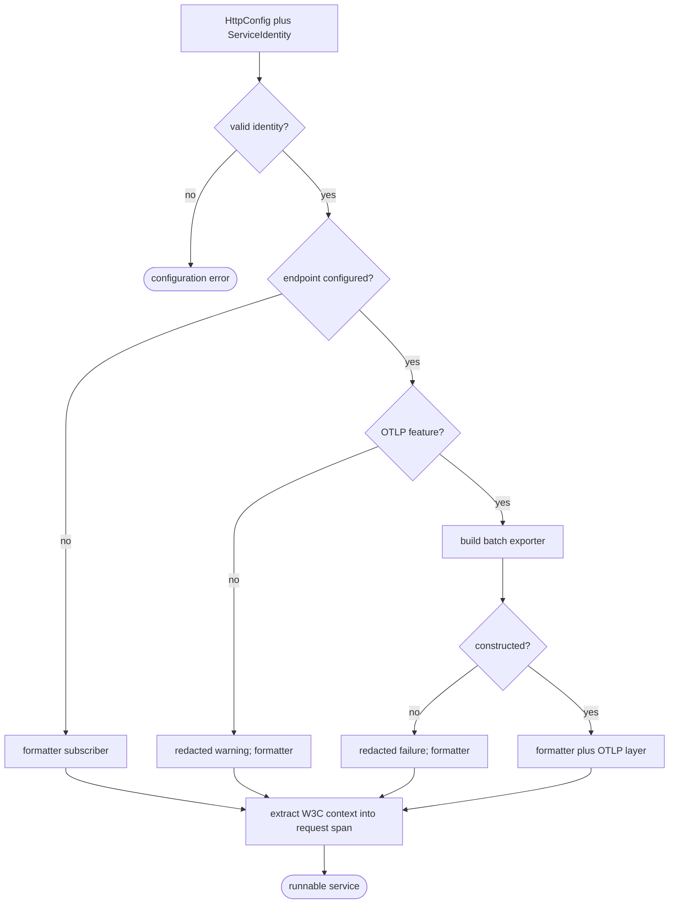

## Logic
<!-- type: logic lang: mermaid -->


## Changes
<!-- type: changes lang: yaml -->

```yaml
changes:
  - path: libs/service-http/Cargo.toml
    action: modify
    section: logic
    impl_mode: hand-written
    description: Add a default-off otlp feature and optional OpenTelemetry dependencies while preserving the plain logging build.
  - path: libs/service-http/src/config.rs
    action: modify
    section: contract
    impl_mode: hand-written
    description: Add a backward-compatible ServiceIdentity contract with validated stable name and version fields for shared tracing initialization.
  - path: libs/service-http/src/logging.rs
    action: modify
    section: logic
    impl_mode: hand-written
    description: Construct an optional OTLP tracer from HttpConfig and ServiceIdentity, preserve the formatter, and fall back non-fatally on missing feature or exporter construction failure.
  - path: libs/service-http/src/transport.rs
    action: modify
    section: logic
    impl_mode: hand-written
    description: Add a shared propagation middleware that extracts W3C traceparent/tracestate into the existing request span without changing route behavior.
  - path: libs/service-http/src/lib.rs
    action: modify
    section: contract
    impl_mode: hand-written
    description: Export the public service identity, initialization, and propagation surface with explicit logging-only defaults.
  - path: libs/service-http/README.md
    action: modify
    section: contract
    impl_mode: hand-written
    description: Document opt-in OTLP, stable resource attributes, fallback semantics, and the Lumen/Tape adoption handoff.
  - path: libs/service-http/external-contracts/behavior/shared-http-service-scaffold-contract.md
    action: modify
    section: contract
    impl_mode: hand-written
    description: Add claim closure for optional OTLP export and propagated request context while retaining no-endpoint behavior.
  - path: libs/service-http/tests/otlp_tracing.rs
    action: create
    section: unit-test
    impl_mode: hand-written
    description: Cover plain startup, identity stability, exporter construction fallback, and W3C parent propagation with local deterministic fixtures.
  - path: libs/service-http/tech-design/semantic/source/libs-service-http-src-config-rs.md
    action: modify
    section: source
    impl_mode: hand-written
    description: Refresh configuration semantic source coverage.
  - path: libs/service-http/tech-design/semantic/source/libs-service-http-src-logging-rs.md
    action: modify
    section: source
    impl_mode: hand-written
    description: Refresh exporter and fallback semantic source coverage.
  - path: libs/service-http/tech-design/semantic/source/libs-service-http-src-transport-rs.md
    action: modify
    section: source
    impl_mode: hand-written
    description: Refresh propagation middleware semantic source coverage.
  - path: libs/service-http/tech-design/semantic/source/libs-service-http-src-lib-rs.md
    action: modify
    section: source
    impl_mode: hand-written
    description: Refresh public tracing API semantic source coverage.
  - path: libs/service-http/tech-design/semantic/source/libs-service-http-tests-otlp-tracing-rs.md
    action: create
    section: source
    impl_mode: hand-written
    description: Add semantic coverage for OTLP contract verification tests.
```
## Unit Test

```mermaid
---
id: service-http-shared-otlp-tracing-verification
requirements:
  fallback:
    id: R3
    text: "Malformed or unreachable exporter setup does not abort service startup and falls back to structured logging without leaking endpoint secrets."
    kind: negative
    risk: high
    verify: cargo test -p service-http --features otlp --test otlp_tracing exporter_setup_failure_keeps_logging_available -- --exact
  identity_contract:
    id: R2
    text: "An OTLP-enabled service supplies stable non-empty service name and version resource attributes through the shared configuration API."
    kind: functional
    risk: high
    verify: cargo test -p service-http --features otlp --test otlp_tracing otlp_identity_contract_is_stable -- --exact
  logging_only_default:
    id: R1
    text: "Without an OTLP endpoint or OTLP feature, shared service tracing remains logging-only and preserves the existing initialization contract."
    kind: regression
    risk: high
    verify: cargo test -p service-http --test otlp_tracing logging_only_default_requires_no_exporter -- --exact
  trace_context:
    id: R4
    text: "The shared HTTP trace layer accepts a valid W3C traceparent and makes the resulting request span a child of that propagated context."
    kind: contract
    risk: medium
    verify: cargo test -p service-http --features otlp --test otlp_tracing trace_layer_propagates_w3c_parent_context -- --exact
---
flowchart TD
    r1[R1 logging only default] --> cargo_test_p_service_http_test_otlp_tracing_logging_only_default_requires_no_exporter_exact[cargo test -p service-http --test otlp_tracing logging_only_default_requires_no_exporter -- --exact]
    r2[R2 identity contract] --> cargo_test_p_service_http_features_otlp_test_otlp_tracing_otlp_identity_contract_is_stable_exact[cargo test -p service-http --features otlp --test otlp_tracing otlp_identity_contract_is_stable -- --exact]
    r3[R3 fallback] --> cargo_test_p_service_http_features_otlp_test_otlp_tracing_exporter_setup_failure_keeps_logging_available_exact[cargo test -p service-http --features otlp --test otlp_tracing exporter_setup_failure_keeps_logging_available -- --exact]
    r4[R4 trace context] --> cargo_test_p_service_http_features_otlp_test_otlp_tracing_trace_layer_propagates_w3c_parent_context_exact[cargo test -p service-http --features otlp --test otlp_tracing trace_layer_propagates_w3c_parent_context -- --exact]
```

<!-- type: unit-test lang: mermaid -->


