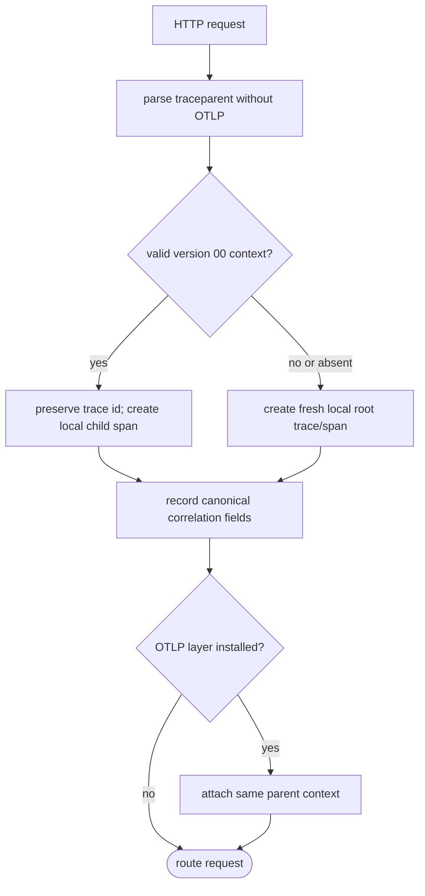

## Logic
<!-- type: logic lang: mermaid -->



## Changes
<!-- type: changes lang: yaml -->

```yaml
changes:
  - path: libs/service-http/Cargo.toml
    action: modify
    section: logic
    impl_mode: hand-written
    description: Add the small OS-random dependency used to create nonzero trace and span ids when no OpenTelemetry layer exists.
  - path: libs/service-http/src/trace_context.rs
    action: create
    section: logic
    impl_mode: hand-written
    description: Parse and canonicalize W3C version 00 traceparent, reject malformed or zero ids, and create exporter-independent root or child request correlation.
  - path: libs/service-http/src/transport.rs
    action: modify
    section: logic
    impl_mode: hand-written
    description: Replace the feature-gated-only make-span path with an always-on request context and record canonical correlation fields while preserving optional OTLP parent attachment.
  - path: libs/service-http/src/lib.rs
    action: modify
    section: contract
    impl_mode: hand-written
    description: Export the stable request trace-context types and parsing surface for service adopters and tests.
  - path: libs/service-http/README.md
    action: modify
    section: contract
    impl_mode: hand-written
    description: Document always-on W3C server context, safe invalid-header fallback, field shape, and the independent OTLP exporter boundary.
  - path: libs/service-http/external-contracts/behavior/shared-http-service-scaffold-contract.md
    action: modify
    section: contract
    impl_mode: hand-written
    description: Close the shared request-correlation claim for logging-only and OTLP-enabled builds.
  - path: libs/service-http/tests/request_trace_context.rs
    action: create
    section: unit-test
    impl_mode: hand-written
    description: Prove valid parent preservation, local id generation, malformed and zero-id fallback, request routing, and no-OTLP behavior.
```
