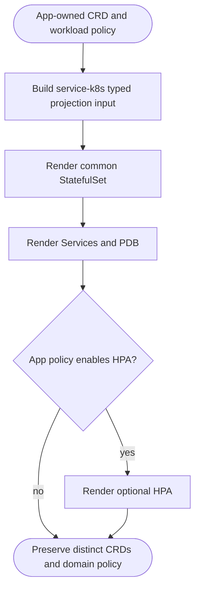
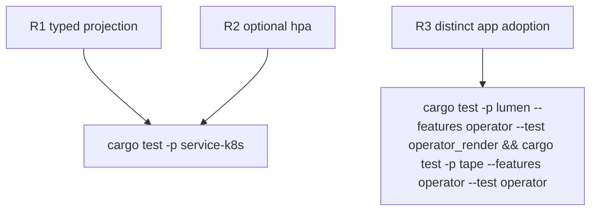

## Logic
<!-- type: logic lang: mermaid -->


## Changes
<!-- type: changes lang: yaml -->

```yaml
changes:
  - path: libs/service-k8s/src/render.rs
    action: modify
    section: logic
    impl_mode: hand-written
    description: "Adopt the already-shared typed StatefulSet, Services, PDB, secure pod defaults, resource-request-only defaults, and optional HPA projection as the canonical service-k8s contract."
  - path: apps/lumen/src/operator/render.rs
    action: modify
    section: logic
    impl_mode: hand-written
    description: "Record Lumen as a consumer of ServiceStatefulSet while retaining its CRD, shard policy, probes, storage, and optional autoscaling decisions."
  - path: apps/tape/src/operator/render.rs
    action: modify
    section: logic
    impl_mode: hand-written
    description: "Record Tape as a consumer of ShardedStatefulSet while retaining its distinct Tape CRD and topic-service policy."
```
## Unit Test
<!-- type: unit-test lang: mermaid -->


