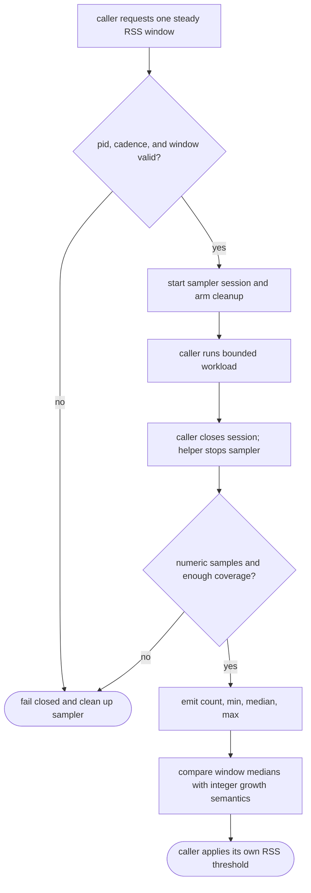

## Logic
<!-- type: logic lang: mermaid -->



Contract invariants:

- `libs/service-observability/scripts/soak-metrics.sh` remains the shared process-metric owner. It adds an explicit sampler start/stop/summary lifecycle plus the plateau helper without taking ownership of any app workload, duration policy, or growth threshold.
- The new sampler session owns its lifecycle. Start returns a session token or handle for the caller's current window, creates the temporary sample artifact, records one RSS value per line at a fixed cadence for the whole measured window, and stop or the registered cleanup hook always kills and waits for the background sampler before returning, even when the caller is interrupted with `INT` or `TERM`.
- Sampling fails closed when the measured pid disappears before window completion, `service_soak_rss_kb` returns a non-numeric value, or the captured series does not reach `ceil(window_secs / sample_interval_secs)` samples. A missing or malformed series never degrades to a best-effort endpoint comparison.
- Window summaries are deterministic integer records. `count`, `min`, `median`, and `max` come from sorting the captured series; odd counts take the middle element, and even counts average the two middle elements with shell-integer division semantics so later growth math stays stable.
- Plateau comparison is median-to-median only. `service_soak_percent_growth` keeps its current integer percentage semantics, but the shared RSS oracle feeds it each window summary's median instead of one endpoint reading. A bounded transient spike therefore affects `max` while a sustained allocation increase moves `median` and can breach the caller-owned limit.
- Deterministic shell coverage exercises three cases: a fixed numeric series with a transient spike (`100 100 500 100 100`), a sustained-growth pair (`100` median to `120` median), and a real bounded child process whose sampler is cleaned up on both normal completion and forced interruption.

## Changes
<!-- type: changes lang: yaml -->

```yaml
changes:
  - path: libs/service-observability/scripts/soak-metrics.sh
    action: modify
    section: logic
    impl_mode: hand-written
    description: Add the explicit RSS sampler start/stop/summary lifecycle, validated count/min/median/max reduction, median-to-median plateau comparison, and cleanup that never leaves a background sampler running.
  - path: libs/service-observability/tests/soak_metrics_window_contract.sh
    action: create
    section: unit-test
    impl_mode: hand-written
    description: Prove transient-spike median stability, sustained-growth breach behavior, malformed or insufficient sample failures, and real-child sampler cleanup on both normal completion and interruption.
```

## Unit Test

```mermaid
---
id: phase-stable-soak-rss-window-sampling-verification
requirements:
  median_growth_semantics:
    id: R2
    text: "Median-to-median growth keeps the existing integer percentage semantics so stable windows pass, a sustained 100 to 120 median reports 20 percent growth, and caller-owned thresholds stay outside the shared helper."
    kind: contract
    risk: high
    verify: bash libs/service-observability/tests/soak_metrics_window_contract.sh median_growth_semantics
  rust_regression:
    id: R5
    text: "Existing service-observability Rust tests still pass after the shell-helper additions so the new RSS contract does not regress the current logging and observability surface."
    kind: regression
    risk: medium
    verify: cargo test -p service-observability
  sampler_lifecycle_cleanup:
    id: R3
    text: "Sampling a real bounded child process records the required window coverage, and both normal completion and forced interruption leave no background sampler process behind."
    kind: regression
    risk: high
    verify: bash libs/service-observability/tests/soak_metrics_window_contract.sh sampler_lifecycle_cleanup
  shell_parseability:
    id: R4
    text: "The shared helper remains shell-parseable after adding the sampler lifecycle, summary reducer, and cleanup hooks."
    kind: regression
    risk: medium
    verify: bash -n libs/service-observability/scripts/soak-metrics.sh
  summary_validation:
    id: R1
    text: "A fixed series `100 100 500 100 100` produces count 5, min 100, median 100, and max 500, while malformed or insufficient series fail non-zero instead of degrading to endpoint-only RSS checks."
    kind: functional
    risk: high
    verify: bash libs/service-observability/tests/soak_metrics_window_contract.sh summary_validation
---
flowchart TD
    r1[R1 summary validation] --> bash_libs_service_observability_tests_soak_metrics_window_contract_sh_summary_validation[bash libs/service-observability/tests/soak_metrics_window_contract.sh summary_validation]
    r2[R2 median growth semantics] --> bash_libs_service_observability_tests_soak_metrics_window_contract_sh_median_growth_semantics[bash libs/service-observability/tests/soak_metrics_window_contract.sh median_growth_semantics]
    r3[R3 sampler lifecycle cleanup] --> bash_libs_service_observability_tests_soak_metrics_window_contract_sh_sampler_lifecycle_cleanup[bash libs/service-observability/tests/soak_metrics_window_contract.sh sampler_lifecycle_cleanup]
    r4[R4 shell parseability] --> bash_n_libs_service_observability_scripts_soak_metrics_sh[bash -n libs/service-observability/scripts/soak-metrics.sh]
    r5[R5 rust regression] --> cargo_test_p_service_observability[cargo test -p service-observability]
```

<!-- type: unit-test lang: mermaid -->


