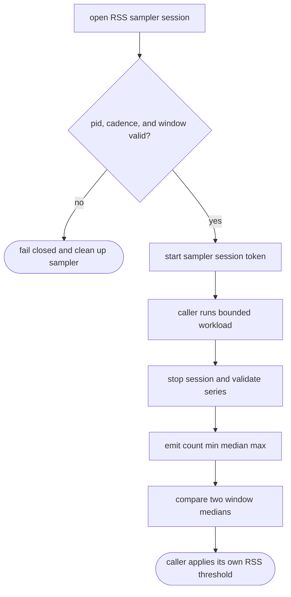

## Logic
<!-- type: logic lang: mermaid -->



Contract invariants:

- `libs/service-observability/scripts/soak-metrics.sh` remains the shared process-metric owner. It adds an explicit `start -> stop -> summarize -> compare` RSS lifecycle and keeps app workloads, duration policy, and growth thresholds caller-owned.
- `service_soak_rss_sampler_start` opens one sampler session for one steady window. The returned session token identifies the target pid, the temp sample artifact, and the sampler pid so callers can run their existing loops without `eval`, `sh -c`, or a library-owned workload callback.
- `service_soak_rss_sampler_stop` is the only normal close path for a session token. It always kills and waits for the background sampler, validates that the series contains only non-negative integer RSS values, and rejects windows whose coverage is below `ceil(window_secs / sample_interval_secs)` or whose target pid disappeared before the window finished.
- A registered cleanup hook owns abnormal teardown. `EXIT`, `INT`, and `TERM` all resolve any live session token, kill the sampler, wait for it, and return non-zero instead of leaving a detached sampler process behind.
- Session summaries are deterministic integer records with `count`, `min`, `median`, and `max` fields. Sorting defines the reduction order; odd counts take the middle element, and even counts average the two middle elements with shell-integer division semantics so later growth math stays stable.
- `service_soak_rss_window_growth_pct` compares two window summaries by feeding their medians into the existing integer percentage calculation. A transient spike therefore raises `max` but not `median`, while sustained growth moves the second-window median and can breach the caller-owned plateau policy.
## Changes
<!-- type: changes lang: yaml -->

```yaml
changes:
  - path: libs/service-observability/scripts/soak-metrics.sh
    action: modify
    section: logic
    impl_mode: hand-written
    description: Add the session-token RSS sampler start/stop lifecycle, validated count/min/median/max reduction, median-to-median growth oracle, and cleanup that never leaves a background sampler running.
  - path: libs/service-observability/tests/soak_metrics_window_contract.sh
    action: create
    section: unit-test
    impl_mode: hand-written
    description: Prove transient-spike median stability, sustained-growth breach behavior, malformed or insufficient sample failures, and real-child sampler cleanup on both normal completion and interruption.
```
## Unit Test

```mermaid
---
id: phase-stable-soak-rss-window-sampling-verification
requirements:
  median_growth_semantics:
    id: R2
    text: "Median-to-median growth keeps the existing integer percentage semantics so stable windows pass, a sustained 100 to 120 median reports 20 percent growth, and caller-owned thresholds stay outside the shared helper."
    kind: contract
    risk: high
    verify: bash libs/service-observability/tests/soak_metrics_window_contract.sh median_growth_semantics
  rust_regression:
    id: R5
    text: "Existing service-observability Rust tests still pass after the shell-helper additions so the new RSS contract does not regress the current logging and observability surface."
    kind: regression
    risk: medium
    verify: cargo test -p service-observability
  sampler_lifecycle_cleanup:
    id: R3
    text: "Sampling a real bounded child process records the required window coverage, and both normal completion and forced interruption leave no background sampler process behind."
    kind: regression
    risk: high
    verify: bash libs/service-observability/tests/soak_metrics_window_contract.sh sampler_lifecycle_cleanup
  shell_parseability:
    id: R4
    text: "The shared helper remains shell-parseable after adding the sampler lifecycle, summary reducer, and cleanup hooks."
    kind: regression
    risk: medium
    verify: bash -n libs/service-observability/scripts/soak-metrics.sh
  summary_validation:
    id: R1
    text: "A fixed series `100 100 500 100 100` produces count 5, min 100, median 100, and max 500, while malformed or insufficient series fail non-zero instead of degrading to endpoint-only RSS checks."
    kind: functional
    risk: high
    verify: bash libs/service-observability/tests/soak_metrics_window_contract.sh summary_validation
---
flowchart TD
    r1[R1 summary validation] --> bash_libs_service_observability_tests_soak_metrics_window_contract_sh_summary_validation[bash libs/service-observability/tests/soak_metrics_window_contract.sh summary_validation]
    r2[R2 median growth semantics] --> bash_libs_service_observability_tests_soak_metrics_window_contract_sh_median_growth_semantics[bash libs/service-observability/tests/soak_metrics_window_contract.sh median_growth_semantics]
    r3[R3 sampler lifecycle cleanup] --> bash_libs_service_observability_tests_soak_metrics_window_contract_sh_sampler_lifecycle_cleanup[bash libs/service-observability/tests/soak_metrics_window_contract.sh sampler_lifecycle_cleanup]
    r4[R4 shell parseability] --> bash_n_libs_service_observability_scripts_soak_metrics_sh[bash -n libs/service-observability/scripts/soak-metrics.sh]
    r5[R5 rust regression] --> cargo_test_p_service_observability[cargo test -p service-observability]
```

<!-- type: unit-test lang: mermaid -->


