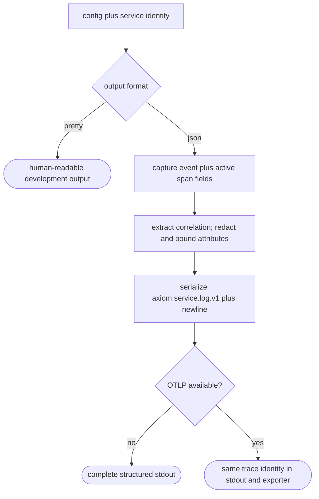

## Logic
<!-- type: logic lang: mermaid -->

The collector contract is exporter-independent. Reserved top-level fields are `schema`, `timestamp`, `severity`, `service`, `event`, `message`, `trace_id`, `span_id`, `parent_span_id`, `trace_flags`, `request_id`, and `attributes`. Correlation is inherited from the nearest entered span, with event fields taking precedence only when they pass the documented lowercase-hex validation. Authorization, cookie, baggage, and tracestate-like keys are excluded before bounded attributes are serialized.
