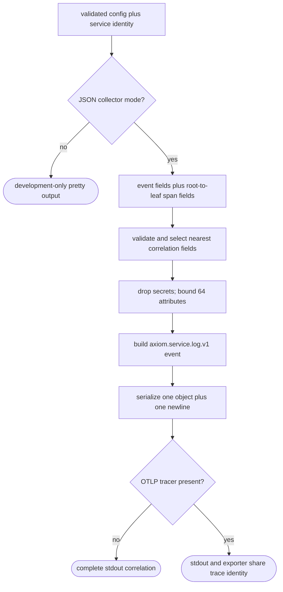

## Logic
<!-- type: logic lang: mermaid -->



Contract invariants:

- `schema` is exactly `axiom.service.log.v1`; `timestamp` is RFC3339 UTC; `severity` is the tracing level; `service.name` and `service.version` come only from validated `ServiceIdentity`.
- `event` uses a bounded explicit event field when present and otherwise tracing metadata name. `message` is always present and defaults to the event name.
- Entered span fields are merged root-to-leaf, then event fields are considered. Reserved correlation fields are promoted only when valid: trace ids are 32 lowercase hex, span and parent ids are 16 lowercase hex, flags are two lowercase hex, and request ids are non-empty bounded strings. Invalid values are omitted, never copied into attributes.
- `authorization`, `proxy-authorization`, `cookie`, `set-cookie`, `baggage`, and `tracestate` field spellings, including normalized HTTP header attribute paths, are excluded. The formatter keeps at most 64 non-reserved attributes, limits keys to 128 bytes and string/debug values to 4096 bytes, and emits deterministic key order.
- Serialization failure returns `fmt::Error`; it never emits a partial JSON prefix. Each successful event is a single compact JSON object followed by exactly one newline.
- Pretty formatting remains available only through explicit `LogFormat::Pretty`; `LogFormat::Json` is the sole collector-compatible mode. OTLP availability never changes the JSON schema.
## Changes
<!-- type: changes lang: yaml -->

```yaml
changes:
  - path: libs/service-observability/src/jsonl.rs
    action: create
    section: logic
    impl_mode: hand-written
    description: Define ServiceLogEventV1, stable schema constants, correlation validation, sensitive-key exclusion, bounded attributes, and the tracing-subscriber JSONL formatter.
  - path: libs/service-observability/src/logging.rs
    action: modify
    section: logic
    impl_mode: hand-written
    description: Compose JsonFields and ServiceJsonFormatter for LogFormat::Json while retaining explicit pretty output and optional OTLP layering.
  - path: libs/service-observability/src/lib.rs
    action: modify
    section: logic
    impl_mode: hand-written
    description: Export the versioned event, service identity payload, formatter, and collector-compatibility constants.
  - path: libs/service-observability/contracts/axiom.service.log.v1.schema.json
    action: create
    section: logic
    impl_mode: hand-written
    description: Define the machine-readable required, optional, nested service, correlation-pattern, attribute-bound, and additional-property rules.
  - path: libs/service-observability/README.md
    action: modify
    section: logic
    impl_mode: hand-written
    description: Document JSON as the stdout collector contract and pretty as development-only output for all service adopters.
  - path: libs/service-observability/tests/service_log_jsonl.rs
    action: create
    section: unit-test
    impl_mode: hand-written
    description: Capture real tracing output and verify per-line framing, stable schema, inherited correlation, validation, redaction, bounds, static-schema drift, and exporter independence.
```

`libs/service-observability/Cargo.toml` gains the direct workspace `serde` and `serde_json` dependencies required by the public wire type and formatter. Those declarative dependency entries are covered by compiling the generated target set rather than receiving source-ownership markers.
## Unit Test

```mermaid
---
id: versioned-service-jsonl-stdout-verification
requirements:
  adopter_and_schema_surface:
    id: R5
    text: "The public Rust event model and static schema stay aligned, JSON remains collector-compatible, and pretty remains an explicit development-only choice."
    kind: contract
    risk: medium
    verify: cargo test -p service-observability
  inherited_correlation:
    id: R3
    text: "Active valid trace, span, parent, flags, and request fields are inherited without requiring an OTLP exporter."
    kind: functional
    risk: high
    verify: cargo test -p service-observability --test service_log_jsonl active_span_fields_become_valid_correlation -- --exact
  jsonl_contract:
    id: R1
    text: "Collector-compatible output uses the axiom.service.log.v1 event contract and every stdout line parses independently."
    kind: functional
    risk: high
    verify: cargo test -p service-observability --test service_log_jsonl jsonl_lines_parse_independently_with_identity -- --exact
  safe_untrusted_fields:
    id: R4
    text: "Sensitive propagation fields are excluded, correlation values are validated, and attribute count and size are bounded without breaking JSONL framing."
    kind: security
    risk: high
    verify: cargo test -p service-observability --test service_log_jsonl sensitive_and_oversized_attributes_are_safe -- --exact
  stable_fields:
    id: R2
    text: "Each structured event contains timestamp, severity, service identity, event, message, and bounded attributes."
    kind: regression
    risk: high
    verify: cargo test -p service-observability --test service_log_jsonl jsonl_lines_parse_independently_with_identity -- --exact
---
flowchart TD
    r1[R1 jsonl contract] --> cargo_test_p_service_observability_test_service_log_jsonl_jsonl_lines_parse_independently_with_identity_exact[cargo test -p service-observability --test service_log_jsonl jsonl_lines_parse_independently_with_identity -- --exact]
    r2[R2 stable fields] --> cargo_test_p_service_observability_test_service_log_jsonl_jsonl_lines_parse_independently_with_identity_exact
    r3[R3 inherited correlation] --> cargo_test_p_service_observability_test_service_log_jsonl_active_span_fields_become_valid_correlation_exact[cargo test -p service-observability --test service_log_jsonl active_span_fields_become_valid_correlation -- --exact]
    r4[R4 safe untrusted fields] --> cargo_test_p_service_observability_test_service_log_jsonl_sensitive_and_oversized_attributes_are_safe_exact[cargo test -p service-observability --test service_log_jsonl sensitive_and_oversized_attributes_are_safe -- --exact]
    r5[R5 adopter and schema surface] --> cargo_test_p_service_observability[cargo test -p service-observability]
```

<!-- type: unit-test lang: mermaid -->


