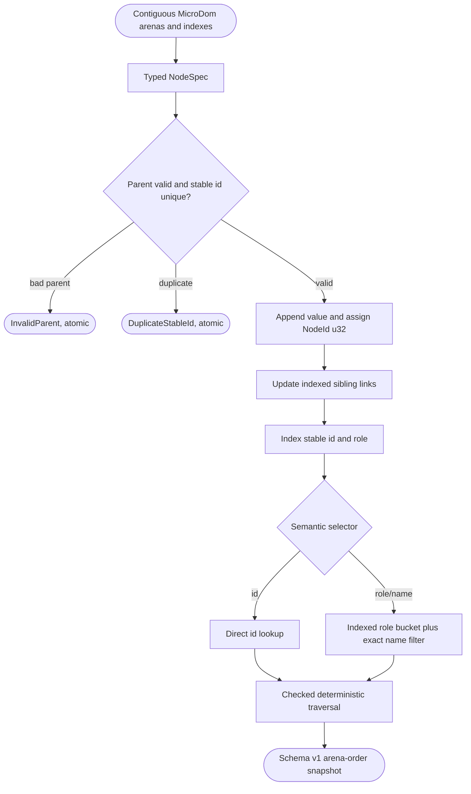

## Logic
<!-- type: logic lang: mermaid -->


## Changes
<!-- type: changes lang: yaml -->

```yaml
changes:
  - path: libs/surface/src/lib.rs
    action: modify
    section: logic
    impl_mode: hand-written
    anchor: Element
    description: Export pub mod microdom adjacent to the existing renderer-neutral Element contract; do not alter Element behavior.
  - path: libs/surface/src/microdom.rs
    action: create
    section: logic
    impl_mode: hand-written
    description: Implement NodeId(u32), typed SemanticRole, compact NodeState and ActionSet, NodeSpec, contiguous Vec<MicroNode> storage, index-based parent/first-child/last-child/next-sibling links, stable-id and role indexes, SemanticSelector, typed atomic insertion errors, and schema-v1 canonical snapshot types.
  - path: libs/surface/tests/microdom_contract.rs
    action: create
    section: unit-test
    impl_mode: hand-written
    description: Add the four contract tests named by the unit-test section, including exact canonical JSON evidence and pre/post mutation equality for error cases.
```
## Unit Test

```mermaid
---
id: surface-microdom-v1-verification
requirements:
  atomic_errors:
    id: R4
    text: "Duplicate stable ids and invalid parent NodeId values return typed errors without partially mutating nodes, relationships, or selector indexes."
    kind: functional
    risk: high
    verify: cargo test -p cclab-surface --test microdom_contract invalid_insertions_are_typed_and_atomic -- --nocapture
  canonical_snapshot:
    id: R3
    text: "Identical MicroDOM inputs emit byte-identical schema-versioned canonical snapshots in arena order and do not serialize unordered selector indexes."
    kind: regression
    risk: medium
    verify: cargo test -p cclab-surface --test microdom_contract canonical_snapshot_is_byte_stable -- --nocapture
  compact_indexed_arena:
    id: R1
    text: "MicroDOM stores typed NodeId values in one compact node arena and preserves parent/child insertion order without one heap object per node."
    kind: functional
    risk: high
    verify: cargo test -p cclab-surface --test microdom_contract compact_arena_preserves_typed_identity_and_child_order -- --nocapture
  semantic_selectors:
    id: R2
    text: "Stable id, semantic role, and role-plus-accessible-name selectors return deterministic NodeId matches through the id or role index."
    kind: functional
    risk: high
    verify: cargo test -p cclab-surface --test microdom_contract selectors_resolve_stable_id_role_and_name -- --nocapture
---
flowchart TD
    r1[R1 compact indexed arena] --> cargo_test_p_cclab_surface_test_microdom_contract_compact_arena_preserves_typed_identity_and_child_order_nocapture[cargo test -p cclab-surface --test microdom_contract compact_arena_preserves_typed_identity_and_child_order -- --nocapture]
    r2[R2 semantic selectors] --> cargo_test_p_cclab_surface_test_microdom_contract_selectors_resolve_stable_id_role_and_name_nocapture[cargo test -p cclab-surface --test microdom_contract selectors_resolve_stable_id_role_and_name -- --nocapture]
    r3[R3 canonical snapshot] --> cargo_test_p_cclab_surface_test_microdom_contract_canonical_snapshot_is_byte_stable_nocapture[cargo test -p cclab-surface --test microdom_contract canonical_snapshot_is_byte_stable -- --nocapture]
    r4[R4 atomic errors] --> cargo_test_p_cclab_surface_test_microdom_contract_invalid_insertions_are_typed_and_atomic_nocapture[cargo test -p cclab-surface --test microdom_contract invalid_insertions_are_typed_and_atomic -- --nocapture]
```

<!-- type: unit-test lang: mermaid -->


