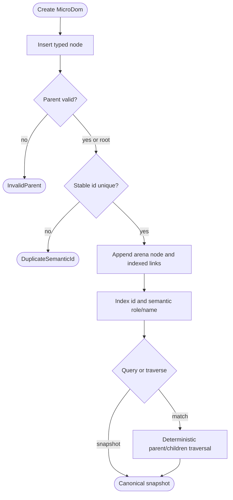

## Logic
<!-- type: logic lang: mermaid -->



## Changes
<!-- type: changes lang: yaml -->

```yaml
changes:
  - path: libs/surface/src/lib.rs
    action: modify
    section: logic
    impl_mode: hand-written
    anchor: Element
    description: Export the focused microdom module from the existing renderer-neutral Surface crate without changing the Element authoring contract.
  - path: libs/surface/src/microdom.rs
    action: create
    section: logic
    impl_mode: hand-written
    description: Define the compact indexed MicroDOM v1 arena, typed node identity and semantics, deterministic traversal, indexed selectors, typed construction errors, and canonical snapshot.
  - path: libs/surface/tests/microdom_contract.rs
    action: create
    section: unit-test
    impl_mode: hand-written
    description: Prove stable node identity, insertion-order traversal, id and semantic selectors, canonical serialization, and atomic rejection of invalid parent or duplicate stable id.
```
