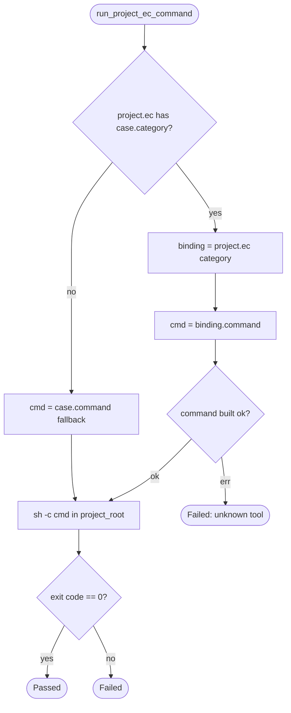

# TD: aw EC tool-binding config + verify-ec dispatch

## Logic
<!-- type: logic lang: mermaid -->



## Schema
<!-- type: schema lang: yaml -->

```yaml
$schema: "https://json-schema.org/draft/2020-12/schema"
$id: "aw-ec-tool-binding"
title: "EC tool-binding additions to the Project model"
description: "Project gains an optional `ec` map (category -> tool binding) verified by aw health --verify-ec. Project-scoped (like TD), declared before `workspaces`."
type: object
properties:
  ec:
    type: object
    description: "Optional. Map of EC category (free string: correctness | benchmark | security | stability | ...) to a tool binding. A category absent from this map falls back to the EC manifest command (the cargo-test default)."
    additionalProperties:
      $ref: "#/$defs/EcBinding"
$defs:
  EcBinding:
    type: object
    additionalProperties: false
    required: [tool]
    properties:
      tool:
        type: string
        enum: ["arena", "rig", "meter"]
        description: "Which external measurement tool verifies this EC category."
      spec:
        type: string
        description: "arena: comparison spec path -> `arena run --spec <spec>`."
      dir:
        type: string
        description: "rig: scenario directory -> `rig run --dir <dir>`."
      meter:
        type: string
        description: "meter: meter.toml path the meter invocation honors for [gate] ceilings."
```
