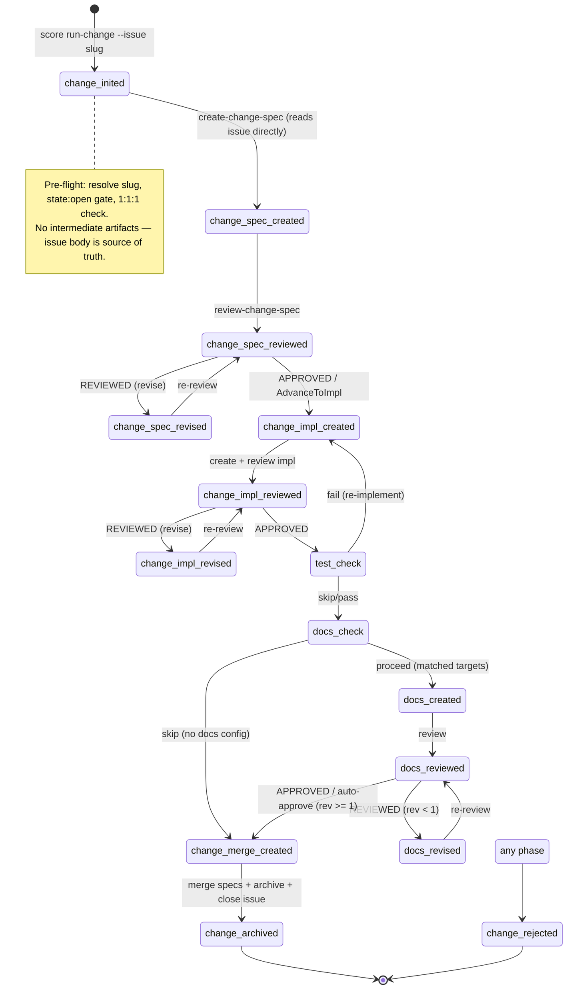

# SDD Specs

> **Legacy SDD workflow index.** Much of this README describes the retired
> `score run-change` workflow. Current Score lifecycle
> commands (`aw wi`, `aw td`, `aw cb`) resolve their filesystem root
> from the CLI process CWD via `find_project_root()` and write under that
> checkout's `.aw/` tree. Linked git checkouts must stay anchored to their
> own checkout.

## Workbench UI Specs
<!-- type: doc lang: markdown -->

Cross-surface SDD workbench contracts for `score`, `cue`, and `conductor`.

| Spec | Scope |
|------|-------|
| [Workbench UI System](specs/workbench-ui-system.md) | Shared office-dense workbench UI contract for SDD-based surfaces, including project/session navigation, WorkItem context, workflow graph, artifacts, gates, and operations dashboards. |
| [Workbench UI Primitive Design](specs/workbench-ui-primitive-design.md) | Concrete primitive API, layout slot, token, interaction, and migration design for implementing the SDD workbench contract across Cue, Score, and Conductor. |
| [Workbench UI Migration Plan](specs/workbench-ui-migration-plan.md) | Ordered impact map and migration slices for moving Cue, Score, Conductor, and existing cclab-ui specs toward SDD-owned Workbench UI primitives. |

## 3-Phase Overview
<!-- type: doc lang: markdown -->

```
aw wiue (CRR) --> score workflow (spec -> impl -> docs) --> score merge
```

1. **aw wiue**: `aw wi create` + `aw wi validate` prepares structured issues with reference context, requirements, and scope. Quality gate promotes `draft` to `open`.
2. **score workflow**: `score run-change --issue <slug>` drives through 15 phases: ChangeInited → ChangeSpec CRR → ChangeImpl CRR → TestCheck → DocsCheck/CRR → ChangeMergeCreated.
3. **score merge**: `score merge <change-id>` archives specs, merges worktree, creates PR, closes the issue, and moves it to `closed/`.

## interfaces/
<!-- type: doc lang: markdown -->

Interface layer — how tools are exposed.

| Spec | Format | Description |
|------|--------|-------------|
| [workflow/mod](interfaces/workflow/mod.md) | Rust source snapshot | Current `sdd_run_change` workflow bridge source ownership. |
| [tools/utility-tools](interfaces/tools/utility-tools.md) | OpenRPC | Stateless utility tools (read/write artifact, delegate-agent, etc.) |
| [cli/commands](interfaces/cli/commands.md) | YAML + table | `cclab sdd` CLI commands + mapping to logic |

## logic/
<!-- type: doc lang: markdown -->

Business logic layer — state machine, per-tool logic, prompts, artifact schemas.

| Spec | Format | Description |
|------|--------|-------------|
| [state-machine](logic/state-machine.md) | JSON Schema + Mermaid | StatePhase (15 variants), State model, phase routing, CRR cycle |
| [restructure-input](logic/restructure-input.md) | YAML + JSON Schema | **ARCHIVED** — absorbed by issue lifecycle CRR |
| [pre-clarifications](logic/pre-clarifications.md) | YAML + JSON Schema | **ARCHIVED** — absorbed by issue lifecycle CRR |
| [reference-context](logic/reference-context.md) | Mermaid + JSON Schema | Central router, CRR, sub-state enum, spec matching (now runs during issue authoring) |
| [post-clarifications](logic/post-clarifications.md) | YAML + JSON Schema | **ARCHIVED** — absorbed by issue lifecycle CRR |
| [change-spec](logic/change-spec.md) | Mermaid + YAML + JSON Schema | Per-spec lifecycle, skeleton → fill → prune, spec_type routing |
| [workflow/implement](interfaces/workflow/implement.md) | Rust source snapshot | Current implementation workflow router, per-task action selection, and prompt payloads |
| [workflow/merge](interfaces/workflow/merge.md) | Rust source snapshot | Current merge workflow router |
| [executor-resolution](logic/executor-resolution.md) | YAML + Mermaid | Agent config, provider:model format, delegation protocol |

## tools/utils/
<!-- type: doc lang: markdown -->

Utility tool specs (stateless, no phase transitions).

| Spec | Description |
|------|-------------|
| [write-artifact](tools/utils/write-artifact.md) | Unified artifact writer |
| [read-artifact](tools/utils/read-artifact.md) | Unified artifact reader |
| [delegate-agent](tools/utils/delegate-agent.md) | Verified agent dispatch |
| [fetch-issues](tools/utils/fetch-issues.md) | Issue fetch + groups builder |
| [analyze-code-for-spec](tools/utils/analyze-code-for-spec.md) | Code analysis for spec structure |
| [platform-sync](tools/utils/platform-sync.md) | Sync to GitHub/GitLab |
| [validate-change](tools/utils/validate-change.md) | Validate proposal files |
| [validate-spec-completeness](tools/utils/validate-spec-completeness.md) | Validate spec for codegen |

## config/
<!-- type: doc lang: markdown -->

| Spec | Description |
|------|-------------|
| [agents](config/agents.md) | Agent routing keys, workflow version |
| [platform](config/platform.md) | GitHub/GitLab CLI platform config |

## skills/
<!-- type: doc lang: markdown -->

Claude Code skill bindings.

| Spec | Description |
|------|-------------|
| [run-change](skills/run-change.md) | `/cclab:sdd:run-change` skill |
| [agent](skills/agent.md) | `/cclab:sdd:agent` skill |
| [fillback](skills/fillback.md) | `/cclab:sdd:fillback` skill |

## generate/
<!-- type: doc lang: markdown -->

Code generation subsystem. See [generate/README.md](generate/README.md).

## E2E Lifecycle
<!-- type: doc lang: markdown -->

SDD operates in two layers. **Layer 1** prepares the issue. **Layer 2** executes the change. Current Score uses one issue = one branch = one change.

### Layer 1 — Issue Preparation

Before any code changes, the issue must be **structured** ([structured-issue](logic/structured-issue.md) R1-R2). This is a **hard gate** — `init_change` rejects unstructured issues.

```
/aw:issue create "<title>"
  → User writes: Problem, Requirements, Scope,
    Acceptance Criteria, Key Decisions

aw wi enrich <slug>
  → score-issue-author agent fills: ## Reference Context
    (spec refs, file refs, repros, suggested first fix)

Result: is_structured_issue() == true → ready for Layer 2
```

| Issue Section | Absorbs SDD Phase | Read By |
|---|---|---|
| `## Problem` + `## Requirements` | restructure_input (removed) | Spec prompt reads issue directly |
| `## Key Decisions` | pre_clarifications (removed) | Spec prompt reads issue directly |
| `## Reference Context` | reference_context (removed from change flow) | Spec prompt reads issue directly |
| `## Scope` + `## Acceptance Criteria` | post_clarifications (removed) | Spec prompt reads issue directly |

### Layer 2 — SDD Change (15 phases)



### Phase x Executor Routing (15 phases)

| Phase | CLI Action | Executor | Agent | Model |
|-------|-----------|----------|-------|-------|
| _(none)_ | `init-change` | CLI direct | — | — |
| `change_inited` | `create-change-spec` | subagent | score-change-spec | sonnet |
| `change_spec_created` | `review-change-spec` | subagent | score-review | opus |
| `change_spec_reviewed` | verdict-based | mainthread | — | — |
| `change_spec_revised` | `review-change-spec` | subagent | score-review | opus |
| `change_impl_created` | `create-change-impl` | subagent | score-change-impl | sonnet |
| `change_impl_reviewed` | `review-change-impl` | subagent | score-review | opus |
| `change_impl_revised` | `review-change-impl` | subagent | score-review | opus |
| `test_check` | _(transient)_ | mainthread | — | — |
| `docs_check` | _(transient)_ | mainthread | — | — |
| `docs_created` | `review-change-docs` | subagent | — | — |
| `docs_reviewed` | verdict-based | mainthread | — | — |
| `docs_revised` | `review-change-docs` | subagent | — | — |
| `change_merge_created` | `create-change-merge` | CLI direct | — | — |
| `change_archived` / `change_rejected` | _(terminal)_ | — | — | — |

### Key Constraints

| Constraint | Spec | Enforcement |
|---|---|---|
| Structured issue = hard gate | [structured-issue](logic/structured-issue.md) R2 | `init_change` rejects non-structured |
| 1 issue : 1 worktree : 1 change | [issue-centric-workflow](logic/issue-centric-workflow.md) R3 | `init_change` checks `issue.phase` |
| change_id = issue slug | [issue-centric-workflow](logic/issue-centric-workflow.md) R4 | Deterministic derivation |
| Mainthread drives merge decisions | CLAUDE.md | Read verdict → /aw:merge or /aw:revise |
| Executor is per-action | CLAUDE.md | Call `score workflow <action>` → read `executor` field |
| Subagent failure → mainthread takes over | CLAUDE.md | Mainthread reads same `prompt_path` |

### Detailed Specs

Per-phase logic, artifact schemas, and agent prompts live in the individual specs below.
