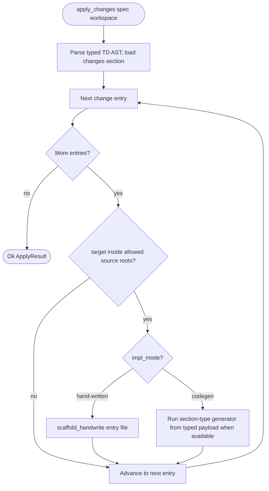
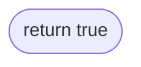
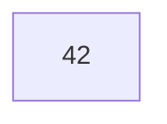
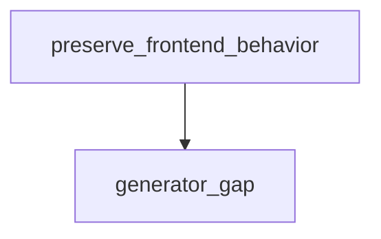

# Generate Apply Pipeline

## Overview
<!-- type: overview lang: markdown -->

Public API manifest for `projects/agentic-workflow/src/generate/apply.rs` generated from AST during Score force-regeneration standardization.

### Symbols

| Name | Target | Kind | Visibility | Line | Signature |
|------|--------|------|------------|------|-----------|
| `ApplyReport` | projects/agentic-workflow/src/generate/apply.rs | struct | pub | 77 |  |
| `ChangeEntry` | projects/agentic-workflow/src/generate/apply.rs | struct | pub | 1385 |  |
| `FileApplyResult` | projects/agentic-workflow/src/generate/apply.rs | struct | pub | 61 |  |
| `ImplMode` | projects/agentic-workflow/src/generate/apply.rs | enum | pub | 1435 |  |
| `apply_replaces` | projects/agentic-workflow/src/generate/apply.rs | function | pub | 2036 | apply_replaces(     content: &str,     symbols: &[String],     spec_ref: &str,     generated_code: &str,     lang: Lang, ) -> Option<String> |
| `apply_replaces_outside_block` | projects/agentic-workflow/src/generate/apply.rs | function | pub | 2521 | apply_replaces_outside_block(     content: &str,     symbols: &[String],     spec_ref: &str, ) -> String |
| `auto_wire_mamba_lib` | projects/agentic-workflow/src/generate/apply.rs | function | pub | 1063 | auto_wire_mamba_lib(generated_paths: &[PathBuf]) -> crate::generate::Result<()> |
| `auto_wire_readme_symbols` | projects/agentic-workflow/src/generate/apply.rs | function | pub | 937 | auto_wire_readme_symbols(     spec_path: &Path,     root: &Path, ) -> crate::generate::Result<()> |
| `dedupe_use_statements` | projects/agentic-workflow/src/generate/apply.rs | function | pub | 2755 | dedupe_use_statements(content: &str) -> String |
| `extract_change_entries` | projects/agentic-workflow/src/generate/apply.rs | function | pub | 1880 | extract_change_entries(spec_content: &str) -> Vec<ChangeEntry> |
| `extract_change_entries_count` | projects/agentic-workflow/src/generate/apply.rs | function | pub | 1653 | extract_change_entries_count(spec_content: &str) -> usize |
| `extract_section_anchors` | projects/agentic-workflow/src/generate/apply.rs | function | pub | 1720 | extract_section_anchors(     section_id: Option<&str>,     mermaid_blocks: &[crate::generate::frontmatter::MermaidPlusBlock],     spec_content: &str, ) -> Vec<String> |
| `extract_section_fence` | projects/agentic-workflow/src/generate/apply.rs | function | pub | 8415 | extract_section_fence(spec_content: &str, heading: &str) -> Option<String> |
| `extract_section_yaml` | projects/agentic-workflow/src/generate/apply.rs | function | pub | 7858 | extract_section_yaml(spec_content: &str, heading: &str) -> Option<String> |
| `extract_typed_section_yaml` | projects/agentic-workflow/src/generate/apply.rs | function | pub | 7913 | extract_typed_section_yaml(spec_content: &str, section_type: &str) -> Option<String> |
| `files_created` | projects/agentic-workflow/src/generate/apply.rs | function | pub | 92 | files_created(&self) -> usize |
| `generate_code_for_entry` | projects/agentic-workflow/src/generate/apply.rs | function | pub | 6423 | generate_code_for_entry(     entry: &ChangeEntry,     spec_path: &str,     mermaid_blocks: &[crate::generate::frontmatter::MermaidPlusBlock],     spec_content: &str,     td_ast: Option<&crate::td_ast::types::TDAst>, ) -> String |
| `generate_source_section_code` | projects/agentic-workflow/src/generate/apply.rs | function | pub | 7998 | generate_source_section_code(     spec_content: &str,     spec_path: &str,     target_rel_path: Option<&str>,     root: &Path, ) -> String |
| `is_all_hand_written` | projects/agentic-workflow/src/generate/apply.rs | function | pub | 1691 | is_all_hand_written(spec_content: &str) -> bool |
| `mermaid_blocks_from_td_ast` | projects/agentic-workflow/src/generate/apply.rs | function | pub | 6925 | mermaid_blocks_from_td_ast(     td_ast: &crate::td_ast::types::TDAst, ) -> Vec<crate::generate::frontmatter::MermaidPlusBlock> |
| `missing_implementation_paths` | projects/agentic-workflow/src/generate/apply.rs | function | pub | 1668 | missing_implementation_paths(spec_content: &str, root: &std::path::Path) -> Vec<String> |
| `run_apply` | projects/agentic-workflow/src/generate/apply.rs | function | pub | 104 | run_apply(     spec_path: &Path,     project_root: &Path,     dry_run: bool, ) -> crate::generate::Result<ApplyReport> |
| `run_apply_scoped` | projects/agentic-workflow/src/generate/apply.rs | function | pub | 118 | run_apply_scoped(     spec_path: &Path,     project_root: &Path,     dry_run: bool,     allowed_target_roots: &[PathBuf], ) -> crate::generate::Result<ApplyReport> |
| `run_apply_scoped_sections` | projects/agentic-workflow/src/generate/apply.rs | function | pub | 137 | run_apply_scoped_sections(     spec_path: &Path,     project_root: &Path,     dry_run: bool,     allowed_target_roots: &[PathBuf],     allowed_sections: &[&str], ) -> crate::generate::Result<ApplyReport> |
| `run_apply_scoped_targets` | projects/agentic-workflow/src/generate/apply.rs | function | pub | 155 | run_apply_scoped_targets(     spec_path: &Path,     project_root: &Path,     dry_run: bool,     allowed_target_roots: &[PathBuf], ) -> crate::generate::Result<ApplyReport> |
| `run_apply_scoped_targets_quiet` | projects/agentic-workflow/src/generate/apply.rs | function | pub | 176 | run_apply_scoped_targets_quiet(     spec_path: &Path,     project_root: &Path,     dry_run: bool,     allowed_target_roots: &[PathBuf], ) -> crate::generate::Result<ApplyReport> |
| `run_apply_worktree` | projects/agentic-workflow/src/generate/apply.rs | function | pub | 196 | run_apply_worktree(     spec_path: &Path,     worktree: &Path, ) -> crate::generate::Result<ApplyReport> |
| `should_emit_section_to_entry` | projects/agentic-workflow/src/generate/apply.rs | function | pub | 1859 | should_emit_section_to_entry(     entry: &ChangeEntry,     all_entries: &[ChangeEntry],     anchors: &[String], ) -> bool |
| `supports_source_backed_replay` | projects/agentic-workflow/src/generate/apply.rs | function | pub | 7479 | supports_source_backed_replay(target_rel_path: &str, section: Option<&str>) -> bool |
| `supports_source_backed_replay_for_spec` | projects/agentic-workflow/src/generate/apply.rs | function | pub | 7484 | supports_source_backed_replay_for_spec(     target_rel_path: &str,     section: Option<&str>,     spec_rel_path: &str, ) -> bool |
| `total_blocks_updated` | projects/agentic-workflow/src/generate/apply.rs | function | pub | 87 | total_blocks_updated(&self) -> usize |
| `with_quiet_apply_diagnostics` | projects/agentic-workflow/src/generate/apply.rs | function | pub | 53 | with_quiet_apply_diagnostics(f: impl FnOnce() -> T) -> T |
## Logic: apply_changes
<!-- type: logic lang: mermaid -->



## Source
<!-- type: source lang: rust -->
<!-- source-from-target: strip-managed-markers -->

<!-- source-snapshot: path=projects/agentic-workflow/src/generate/apply.rs -->
```````rust
// SPEC-MANAGED: projects/agentic-workflow/tech-design/core/generate/apply.md#source
// CODEGEN-BEGIN
//! Apply implementation: run codegen and write CODEGEN blocks to target files.
//!
//! `run_apply` reads the spec's `changes` section, runs codegen for each
//! target file, and updates CODEGEN-BEGIN/END blocks in place.
//!
//! `run_apply_worktree` runs apply scoped to a worktree path.
//! Both support `dry_run` mode for preview without writing.

// @spec .aw/changes/codegen-td-to-code/groups/codegen-td-to-code-main/specs/sdd-codegen-validation-harness.md#changes

use std::path::{Path, PathBuf};

/// Per-file apply result.
#[derive(Debug, Clone)]
/// @spec projects/agentic-workflow/tech-design/core/generate/apply.md#source
pub struct FileApplyResult {
    /// Target file path (relative to project root or worktree).
    pub path: PathBuf,
    /// True if the file was created (action = create).
    pub created: bool,
    /// True if content was updated inside CODEGEN blocks.
    pub updated: bool,
    /// Number of CODEGEN blocks updated.
    pub blocks_updated: usize,
    /// True in dry_run mode (no files written).
    pub dry_run: bool,
}

/// Apply report for a spec file.
#[derive(Debug, Clone)]
/// @spec projects/agentic-workflow/tech-design/core/generate/apply.md#source
pub struct ApplyReport {
    /// Per-file apply results.
    pub files: Vec<FileApplyResult>,
    /// True if any files were written (false in dry_run mode).
    pub wrote_files: bool,
}

/// @spec projects/agentic-workflow/tech-design/core/generate/apply.md#source
impl ApplyReport {
    /// Total number of CODEGEN blocks updated across all files.
    pub fn total_blocks_updated(&self) -> usize {
        self.files.iter().map(|f| f.blocks_updated).sum()
    }

    /// Number of new files created.
    pub fn files_created(&self) -> usize {
        self.files.iter().filter(|f| f.created).count()
    }
}

/// Run codegen apply for a spec file against the project root.
///
/// Reads the spec `changes` section, runs codegen for each target,
/// and updates CODEGEN blocks in the target files.
// @spec .aw/changes/codegen-td-to-code/groups/codegen-td-to-code-main/specs/sdd-codegen-validation-harness.md#changes
pub fn run_apply(
    spec_path: &Path,
    project_root: &Path,
    dry_run: bool,
) -> crate::generate::Result<ApplyReport> {
    run_apply_inner(spec_path, project_root, dry_run, None, None)
}

/// Run codegen apply for a spec file, skipping change entries whose targets
/// fall outside the supplied absolute target roots.
///
/// Used by project-level force regeneration to replay a project's TD root
/// without writing into another project's source tree.
// @spec projects/agentic-workflow/tech-design/core/generate/apply.md#source
pub fn run_apply_scoped(
    spec_path: &Path,
    project_root: &Path,
    dry_run: bool,
    allowed_target_roots: &[PathBuf],
) -> crate::generate::Result<ApplyReport> {
    run_apply_inner(
        spec_path,
        project_root,
        dry_run,
        Some(allowed_target_roots),
        None,
    )
}

/// Run codegen apply for selected section ids, skipping change entries outside
/// the supplied source roots or outside the selected sections.
// @spec projects/agentic-workflow/tech-design/core/generate/apply.md#source
pub fn run_apply_scoped_sections(
    spec_path: &Path,
    project_root: &Path,
    dry_run: bool,
    allowed_target_roots: &[PathBuf],
    allowed_sections: &[&str],
) -> crate::generate::Result<ApplyReport> {
    run_apply_inner(
        spec_path,
        project_root,
        dry_run,
        Some(allowed_target_roots),
        Some(allowed_sections),
    )
}

/// @spec projects/agentic-workflow/tech-design/core/generate/apply.md#source
pub fn run_apply_scoped_targets(
    spec_path: &Path,
    project_root: &Path,
    dry_run: bool,
    allowed_target_roots: &[PathBuf],
) -> crate::generate::Result<ApplyReport> {
    run_apply_inner(
        spec_path,
        project_root,
        dry_run,
        Some(allowed_target_roots),
        None,
    )
}

/// Run apply scoped to a worktree path.
///
/// Identical to `run_apply` but operates within the worktree directory.
// @spec .aw/changes/codegen-td-to-code/groups/codegen-td-to-code-main/specs/sdd-codegen-validation-harness.md#changes
pub fn run_apply_worktree(
    spec_path: &Path,
    worktree: &Path,
) -> crate::generate::Result<ApplyReport> {
    run_apply_inner(spec_path, worktree, false, None, None)
}

fn run_apply_inner(
    spec_path: &Path,
    root: &Path,
    dry_run: bool,
    allowed_target_roots: Option<&[PathBuf]>,
    allowed_sections: Option<&[&str]>,
) -> crate::generate::Result<ApplyReport> {
    use crate::generate::frontmatter::extract_mermaid_plus_blocks;
    use crate::generate::marker::{
        insert_codegen_block, parse_codegen_blocks, replace_codegen_block,
    };

    let spec_content =
        std::fs::read_to_string(spec_path).map_err(|e| crate::generate::GenerateError::Io(e))?;

    // Use path relative to root for SPEC-REF markers (avoids absolute worktree paths)
    let spec_path_str = spec_path
        .strip_prefix(root)
        .unwrap_or(spec_path)
        .to_string_lossy();

    let td_ast = match crate::td_ast::parse::parse_td_str(&spec_content) {
        Ok(ast) => Some(ast),
        Err(err) => {
            eprintln!(
                "[gen apply] WARNING: typed TD AST parse failed for '{}': {}. \
                 Falling back to legacy section scanners.",
                spec_path.display(),
                err.message,
            );
            None
        }
    };
    // Extract Mermaid Plus blocks for content-aware codegen. Prefer the
    // typed TD AST view so generator routing follows section annotations
    // instead of literal heading text; fall back to the legacy raw scanner.
    let mut mermaid_blocks = td_ast
        .as_ref()
        .map(mermaid_blocks_from_td_ast)
        .unwrap_or_default();
    if mermaid_blocks.is_empty() {
        mermaid_blocks = extract_mermaid_plus_blocks(&spec_content);
    }

    let change_entries = extract_change_entries(&spec_content);

    // R4.1: Warn when Changes section has valid YAML but 0 entries extracted.
    // This prevents silent no-op from masking parser bugs (e.g. unexpected field names).
    if change_entries.is_empty() {
        eprintln!(
            "[gen apply] WARNING: No change entries extracted from spec '{}'. \
            Check that the Changes YAML uses 'path:' or 'file:' fields.",
            spec_path.display()
        );
    }

    let mut files = Vec::new();

    // Snapshot for cross-entry anchor routing (Bug 2 fix). When N>1 entries
    // share the same `section:`, we use each entry's `replaces:` list to
    // route a section's CODEGEN block to exactly one file rather than
    // duplicating the same block into all N. See `should_emit_section_to_entry`.
    let all_entries: Vec<ChangeEntry> = change_entries.clone();
    let source_from_target_replays_whole_file =
        source_from_target_directive(&spec_content).is_some();
    let whole_file_source_targets: std::collections::BTreeSet<String> = all_entries
        .iter()
        .filter(|entry| {
            source_from_target_replays_whole_file
                && entry.impl_mode != ImplMode::HandWritten
                && is_whole_file_codegen_section(
                    entry.section_id.as_deref(),
                    source_from_target_replays_whole_file,
                )
        })
        .map(|entry| entry.path.clone())
        .collect();

    for entry in change_entries {
        let target_path = root.join(&entry.path);
        if let Some(allowed_roots) = allowed_target_roots {
            if !allowed_roots
                .iter()
                .any(|allowed_root| target_path.starts_with(allowed_root))
            {
                eprintln!(
                    "[gen apply] SKIP: '{}' target is outside project source scope",
                    entry.path,
                );
                files.push(FileApplyResult {
                    path: PathBuf::from(&entry.path),
                    created: false,
                    updated: false,
                    blocks_updated: 0,
                    dry_run,
                });
                continue;
            }
        }
        if let Some(allowed_sections) = allowed_sections {
            let section_id = entry.section_id.as_deref().unwrap_or_default();
            if !allowed_sections.contains(&section_id) {
                eprintln!(
                    "[gen apply] SKIP: '{}' section '{}' is outside selected section scope",
                    entry.path, section_id,
                );
                files.push(FileApplyResult {
                    path: PathBuf::from(&entry.path),
                    created: false,
                    updated: false,
                    blocks_updated: 0,
                    dry_run,
                });
                continue;
            }
        }
        let entry_is_non_source_codegen = entry.impl_mode != ImplMode::HandWritten
            && !is_whole_file_codegen_section(
                entry.section_id.as_deref(),
                source_from_target_replays_whole_file,
            );
        let existing_whole_file_source_owner = entry_is_non_source_codegen
            && target_path
                .exists()
                .then(|| std::fs::read_to_string(&target_path).ok())
                .flatten()
                .is_some_and(|content| has_whole_file_source_codegen_block(&content));
        if entry_is_non_source_codegen
            && (whole_file_source_targets.contains(&entry.path) || existing_whole_file_source_owner)
        {
            eprintln!(
                "[gen apply] SKIP: '{}' section '{}' is covered by whole-file source replay.",
                entry.path,
                entry.section_id.as_deref().unwrap_or("changes"),
            );
            files.push(FileApplyResult {
                path: PathBuf::from(&entry.path),
                created: false,
                updated: false,
                blocks_updated: 0,
                dry_run,
            });
            continue;
        }

        // impl_mode: hand-written — rule 2-2 of the codegen policy. Spec
        // tracks requirements + tests + intent; agent edits the target
        // file directly. When the entry carries `anchor:` we additionally
        // scaffold an XML-form handwrite marker
        // marker pair around the anchor symbol so the audit pipeline can
        // detect the region (sdd-handwrite-marker R1).
        if entry.impl_mode == ImplMode::HandWritten {
            let mut updated = false;
            let mut created = false;
            // Bug 1 fix: `action: create` + `impl_mode: hand-written` previously
            // produced no file. Now scaffold an empty placeholder with a single
            // HANDWRITE-marked region so authors have a starting point and
            // `score td audit` can surface the gap.
            if entry.action == "create" && !target_path.exists() {
                let scaffold = scaffold_handwrite_file(&entry);
                if dry_run {
                    eprintln!(
                        "[gen apply] HANDWRITE: would scaffold new file {} ({} bytes, dry_run)",
                        entry.path,
                        scaffold.len(),
                    );
                } else {
                    if let Some(parent) = target_path.parent() {
                        std::fs::create_dir_all(parent)
                            .map_err(|e| crate::generate::GenerateError::Io(e))?;
                    }
                    std::fs::write(&target_path, &scaffold)
                        .map_err(|e| crate::generate::GenerateError::Io(e))?;
                    eprintln!(
                        "[gen apply] HANDWRITE: scaffolded new file {} ({} bytes)",
                        entry.path,
                        scaffold.len(),
                    );
                }
                created = true;
            } else if let Some(anchor) = entry.handwrite_anchor.as_deref() {
                let h_entry = crate::generate::handwrite::HandwriteEntry {
                    gap: entry.handwrite_gap.clone(),
                    tracker: entry.handwrite_tracker.clone(),
                    reason: entry.handwrite_reason.clone(),
                };
                match crate::generate::handwrite_scaffold::scaffold_handwrite(
                    &h_entry,
                    &target_path,
                    anchor,
                    entry.section_id.as_deref(),
                ) {
                    Ok(crate::generate::handwrite_scaffold::ScaffoldOutcome::Inserted) => {
                        updated = true;
                        eprintln!(
                            "[gen apply] HANDWRITE: scaffolded marker around '{}' in {}",
                            anchor, entry.path,
                        );
                    }
                    Ok(crate::generate::handwrite_scaffold::ScaffoldOutcome::Skipped) => {
                        eprintln!(
                            "[gen apply] HANDWRITE: marker already present for '{}' in {} (idempotent)",
                            anchor, entry.path,
                        );
                    }
                    Ok(crate::generate::handwrite_scaffold::ScaffoldOutcome::AnchorMissing) => {
                        eprintln!(
                            "[gen apply] HANDWRITE: anchor '{}' not found in {} — agent must insert marker by hand",
                            anchor, entry.path,
                        );
                    }
                    Err(e) => {
                        return Err(crate::generate::GenerateError::Io(e));
                    }
                }
            } else {
                eprintln!(
                    "[gen apply] SKIP: '{}' impl_mode=hand-written (no anchor; spec tracks intent only)",
                    entry.path,
                );
            }
            files.push(FileApplyResult {
                path: PathBuf::from(&entry.path),
                created,
                updated,
                blocks_updated: 0,
                dry_run,
            });
            continue;
        }

        // Tech-stack gate: only Rust is supported today. Non-Rust workspaces
        // would silently emit Rust syntax into .ts/.py files and compile to noise.
        // Fail loud instead, pointing at the unsupported workspace.
        if let Some(lang_err) =
            check_workspace_language(root, &target_path, entry.section_id.as_deref())
        {
            return Err(crate::generate::GenerateError::UnsupportedLanguage(
                lang_err,
            ));
        }

        let target_lang = target_language(&target_path, entry.section_id.as_deref());
        let Some(target_lang) = target_lang else {
            eprintln!(
                "[gen apply] SKIP: '{}' — no generator matches (extension + section \
                 combination unsupported).",
                entry.path,
            );
            files.push(FileApplyResult {
                path: PathBuf::from(&entry.path),
                created: false,
                updated: false,
                blocks_updated: 0,
                dry_run,
            });
            continue;
        };

        let (file_content, existed) = if target_path.exists() {
            let content = std::fs::read_to_string(&target_path)
                .map_err(|e| crate::generate::GenerateError::Io(e))?;
            (content, true)
        } else {
            (String::new(), false)
        };

        // Bug 2 fix: changes-driven over-emit. When the spec's section emits
        // a CODEGEN block whose primary anchor (the function/type/command
        // name the section produces) is claimed by another entry's
        // `replaces:` list, skip emission for THIS entry — the block belongs
        // in the file whose `replaces:` matches. Without this guard a single
        // section's body gets duplicated into every change-entry that names
        // the same `section:`.
        let section_anchors =
            extract_section_anchors(entry.section_id.as_deref(), &mermaid_blocks, &spec_content);
        if !should_emit_section_to_entry(&entry, &all_entries, &section_anchors) {
            eprintln!(
                "[gen apply] SKIP: '{}' — section '{}' anchors {:?} routed to a \
                 sibling entry via `replaces:` (no over-emit).",
                entry.path,
                entry.section_id.as_deref().unwrap_or("changes"),
                section_anchors,
            );
            files.push(FileApplyResult {
                path: PathBuf::from(&entry.path),
                created: false,
                updated: false,
                blocks_updated: 0,
                dry_run,
            });
            continue;
        }

        let spec_ref = format!(
            "{}#{}",
            spec_path_str,
            entry.section_id.as_deref().unwrap_or("changes")
        );
        let existing_blocks = if existed {
            parse_codegen_blocks(&file_content)
        } else {
            Vec::new()
        };

        if existed
            && !is_whole_file_codegen_section(
                entry.section_id.as_deref(),
                source_from_target_replays_whole_file,
            )
            && is_whole_file_codegen_content(&file_content, &existing_blocks)
            && existing_blocks
                .first()
                .is_some_and(|block| block.spec_ref != spec_ref)
        {
            eprintln!(
                "[gen apply] SKIP: '{}' section '{}' would nest inside whole-file CODEGEN block '{}'.",
                entry.path,
                entry.section_id.as_deref().unwrap_or("changes"),
                existing_blocks[0].spec_ref,
            );
            files.push(FileApplyResult {
                path: PathBuf::from(&entry.path),
                created: false,
                updated: false,
                blocks_updated: 0,
                dry_run,
            });
            continue;
        }

        // Pick the generator per section type. `manifest` section routes to the
        // TOML manifest generator; everything else falls through to the
        // Rust-family dispatcher keyed by mermaid / schema / cli / ...
        let source_backed_existing = if supports_source_backed_replay_for_spec(
            &entry.path,
            entry.section_id.as_deref(),
            &spec_path_str,
        ) {
            existing_blocks
                .iter()
                .find(|block| block.spec_ref == spec_ref)
                .and_then(|block| source_backed_existing_content(&block.content, target_lang))
        } else {
            None
        };
        let generated_code = if let Some(existing_content) = source_backed_existing {
            existing_content
        } else {
            match entry.section_id.as_deref() {
                Some("manifest") => {
                    crate::generate::gen::rust::manifest::generate_manifest(&spec_content).code
                }
                Some("tests") => {
                    crate::generate::gen::rust::tests_gen::generate_tests(&spec_content).code
                }
                Some("source") => generate_source_section_code(
                    &spec_content,
                    &spec_path_str,
                    Some(&entry.path),
                    root,
                ),
                Some("runtime-image" | "deployment") => {
                    let section = entry.section_id.as_deref().unwrap_or("changes");
                    try_generate_operations_artifact(&spec_content, &entry, td_ast.as_ref())
                        .unwrap_or_else(|| {
                            crate::generate::marker::emit_spec_ref(
                                &spec_path_str,
                                section,
                                entry
                                    .description
                                    .as_deref()
                                    .unwrap_or(&format!("Implement {}", entry.path)),
                                crate::generate::marker::Lang::Toml,
                            )
                        })
                }
                _ => generate_code_for_entry(
                    &entry,
                    &spec_path_str,
                    &mermaid_blocks,
                    &spec_content,
                    td_ast.as_ref(),
                ),
            }
        };

        let (updated_content, blocks_updated) = if existed {
            let blocks = existing_blocks;
            let matching_block = blocks.iter().find(|b| b.spec_ref == spec_ref);
            let duplicate_matching_blocks =
                blocks.iter().filter(|b| b.spec_ref == spec_ref).count() > 1;
            let generated_body = if let Some(existing_block) = matching_block {
                if supports_source_backed_replay_for_spec(
                    &entry.path,
                    entry.section_id.as_deref(),
                    &spec_path_str,
                ) {
                    source_backed_existing_content(&existing_block.content, target_lang)
                        .unwrap_or_else(|| generated_codegen_body(&generated_code, &spec_ref))
                } else {
                    generated_codegen_body(&generated_code, &spec_ref)
                }
            } else {
                generated_codegen_body(&generated_code, &spec_ref)
            };

            if let Some(existing_block) = matching_block {
                if is_whole_file_codegen_section(
                    entry.section_id.as_deref(),
                    source_from_target_replays_whole_file,
                ) && entry.replaces.is_empty()
                    && entry.action == "modify"
                    && !is_whole_file_codegen_content(&file_content, &blocks)
                {
                    let with_block =
                        insert_codegen_block("", &spec_ref, &generated_body, None, target_lang);
                    (with_block, 1)
                } else {
                    // CODEGEN block exists. First, if the entry has a non-empty
                    // `replaces:`, sweep any outside-block items that match
                    // (e.g., the spec evolved to subsume previously-hand-written
                    // impls). Without this step, `score td gen-code` on an
                    // already-migrated file leaves stale hand-written
                    // duplicates that conflict with the regenerated CODEGEN
                    // block (E0119 / E0428).
                    let extended = augment_replaces_with_impls(&entry.replaces, &generated_body);
                    if extended.is_empty()
                        && normalize_codegen_body(&existing_block.content)
                            == normalize_codegen_body(&generated_body)
                    {
                        if duplicate_matching_blocks {
                            let updated =
                                replace_codegen_block(&file_content, &spec_ref, &generated_body);
                            (updated, 1)
                        } else {
                            (file_content.clone(), 0)
                        }
                    } else {
                        let stripped = if !extended.is_empty() && entry.action == "modify" {
                            apply_replaces_outside_block(&file_content, &extended, &spec_ref)
                        } else {
                            file_content.clone()
                        };
                        let updated = replace_codegen_block(&stripped, &spec_ref, &generated_body);
                        (updated, 1)
                    }
                }
            } else if is_whole_file_codegen_content(&file_content, &blocks)
                && is_whole_file_codegen_section(
                    entry.section_id.as_deref(),
                    source_from_target_replays_whole_file,
                )
                && entry.replaces.is_empty()
                && entry.action == "modify"
            {
                (file_content.clone(), 0)
            } else if is_whole_file_codegen_section(
                entry.section_id.as_deref(),
                source_from_target_replays_whole_file,
            ) && entry.replaces.is_empty()
                && entry.action == "modify"
            {
                // `source` and operations artifacts are whole-file templates.
                // On first promotion from managed HANDWRITE to regenerable
                // CODEGEN, replace the file instead of appending a second copy.
                // If `replaces:` is present, keep the symbol-level path below
                // so large files can be split into multiple source fragments.
                let with_block =
                    insert_codegen_block("", &spec_ref, &generated_body, None, target_lang);
                (with_block, 1)
            } else if !entry.replaces.is_empty() && entry.action == "modify" {
                // `action: modify` + explicit `replaces:` — remove the named
                // hand-written items and drop the CODEGEN block in their
                // place. This is the escape from append-duplication (the
                // revert that motivated this feature).
                let extended = augment_replaces_with_impls(&entry.replaces, &generated_body);
                let replaced = apply_replaces(
                    &file_content,
                    &extended,
                    &spec_ref,
                    &generated_body,
                    target_lang,
                );
                match replaced {
                    Some(out) => (out, 1),
                    None => {
                        // None of the symbols matched — either the author
                        // lists names that don't exist or the file was
                        // already migrated. Fall back to ordinary append so
                        // gen-code is idempotent.
                        let with_block = insert_codegen_block(
                            &file_content,
                            &spec_ref,
                            &generated_body,
                            None,
                            target_lang,
                        );
                        (with_block, 1)
                    }
                }
            } else {
                // First-time insertion. For Cargo-deps manifest blocks, anchor
                // under `[dependencies]`; otherwise append at end.
                let with_block = if entry.section_id.as_deref() == Some("manifest")
                    && is_cargo_toml(&target_path)
                {
                    insert_cargo_deps_block(&file_content, &spec_ref, &generated_body)
                } else {
                    insert_codegen_block(
                        &file_content,
                        &spec_ref,
                        &generated_body,
                        None,
                        target_lang,
                    )
                };
                (with_block, 1)
            }
        } else {
            let spec_ref = format!(
                "{}#{}",
                spec_path_str,
                entry.section_id.as_deref().unwrap_or("changes")
            );
            let generated_body = generated_codegen_body(&generated_code, &spec_ref);
            let new_content =
                if entry.section_id.as_deref() == Some("manifest") && is_cargo_toml(&target_path) {
                    // Seed a minimal Cargo.toml skeleton so the block has a home.
                    let skeleton = "[dependencies]\n";
                    insert_cargo_deps_block(skeleton, &spec_ref, &generated_body)
                } else {
                    insert_codegen_block("", &spec_ref, &generated_body, None, target_lang)
                };
            (new_content, 1)
        };

        let changed = !existed || updated_content != file_content;

        if !dry_run && changed {
            if let Some(parent) = target_path.parent() {
                std::fs::create_dir_all(parent)
                    .map_err(|e| crate::generate::GenerateError::Io(e))?;
            }
            std::fs::write(&target_path, &updated_content)
                .map_err(|e| crate::generate::GenerateError::Io(e))?;
        }

        files.push(FileApplyResult {
            path: PathBuf::from(&entry.path),
            created: !existed,
            updated: changed,
            blocks_updated,
            dry_run,
        });
    }

    // Post-pass: dedupe `use` statements across CODEGEN blocks in the same file.
    // Each generator emits imports inside its own block; at module scope that
    // produces E0252 (name defined multiple times). Keep the first occurrence.
    if !dry_run {
        let mut unique_paths: std::collections::BTreeSet<PathBuf> =
            std::collections::BTreeSet::new();
        for f in &files {
            unique_paths.insert(root.join(&f.path));
        }
        for path in &unique_paths {
            if let Ok(content) = std::fs::read_to_string(path) {
                let deduped = dedupe_use_statements(&content);
                if deduped != content {
                    let _ = std::fs::write(path, deduped);
                }
            }
        }
    }

    // Post-pass: auto-wire MambaModule lib.rs files. For every written .rs file
    // that exports a `pub fn register(r: &mut ... ModuleRegistrar)`, find the
    // sibling lib.rs (same parent dir). If it contains `impl MambaModule for`,
    // update two CODEGEN blocks — `mamba-mod-decls` at crate root with
    // `pub mod X;` and `mamba-register-body` inside the register() body with
    // `X::register(r);`.
    if !dry_run {
        let generated_paths: Vec<PathBuf> = files
            .iter()
            .filter(|f| f.updated)
            .map(|f| root.join(&f.path))
            .collect();
        auto_wire_mamba_lib(&generated_paths)?;
        // README aggregation: the spec's tech-design directory (parent of the
        // spec file) is the scan root; the sibling project README lives under
        // `<project>/README.md`. We derive the project path from the tech-design
        // directory by stripping `.aw/tech-design/` from the front.
        auto_wire_readme_symbols(spec_path, root)?;
    }

    // R5: Write codegen_markers.yaml with all emitted SPEC-REF markers
    if !dry_run {
        write_markers_yaml(root, &files)?;
    }

    Ok(ApplyReport {
        files,
        wrote_files: !dry_run,
    })
}

fn is_whole_file_codegen_section(
    section: Option<&str>,
    source_from_target_replays_whole_file: bool,
) -> bool {
    matches!(section, Some("runtime-image" | "deployment"))
        || (source_from_target_replays_whole_file && matches!(section, Some("source")))
}

fn is_whole_file_codegen_content(
    content: &str,
    blocks: &[crate::generate::marker::CodegenBlock],
) -> bool {
    let [block] = blocks else {
        return false;
    };
    let lines = content.lines().collect::<Vec<_>>();
    let spec_line = block.begin_line.saturating_sub(1);
    let before = lines
        .get(..spec_line)
        .unwrap_or(&[])
        .iter()
        .all(|line| line.trim().is_empty());
    let after = lines
        .get(block.end_line + 1..)
        .unwrap_or(&[])
        .iter()
        .all(|line| line.trim().is_empty());
    before && after
}

/// Rebuild the Registered Symbols section of the project's README.md.
///
/// Derives the project from the spec path — expects the spec to live under
/// `<root>/.aw/tech-design/<project>/<spec>.md`. For each such layout, the
/// target README is `<root>/<project>/README.md`. Scan aggregates across every
/// `.md` file in the tech-design directory so symbols stay synced as new
/// specs ship, regardless of which spec was just applied.
///
/// Silently no-ops when the spec path doesn't follow the `.aw/tech-design/`
/// convention or the target README doesn't exist. The CODEGEN block is keyed
/// on `generated/readme#mamba-symbols`; first-run insertion creates both an
/// `## Registered symbols` H2 and the CODEGEN block under it.
/// @spec projects/agentic-workflow/tech-design/core/generate/apply.md#source
pub(crate) fn auto_wire_readme_symbols(
    spec_path: &Path,
    root: &Path,
) -> crate::generate::Result<()> {
    // Canonicalize both paths so strip_prefix works even when the caller
    // passes an absolute spec path that already starts with `/` but has
    // symlinks vs. the canonical root (common on macOS where /tmp symlinks to
    // /private/tmp).
    let spec_abs = spec_path
        .canonicalize()
        .unwrap_or_else(|_| spec_path.to_path_buf());
    let root_abs = root.canonicalize().unwrap_or_else(|_| root.to_path_buf());
    if let Some((tech_design_dir, readme_path)) =
        configured_readme_symbol_paths(&spec_abs, &root_abs)
    {
        return write_readme_symbols(&tech_design_dir, &readme_path, &root_abs);
    }

    if spec_abs.strip_prefix(&root_abs).is_err() {
        return Ok(());
    }
    let td_base = crate::shared::workspace::tech_design_path(&root_abs);
    let td_base_abs = td_base.canonicalize().unwrap_or(td_base);
    let Ok(rel_to_td) = spec_abs.strip_prefix(&td_base_abs) else {
        return Ok(());
    };

    // Remaining components form the project path. The LAST component is the
    // spec filename — drop it; everything else is the project dir (supports
    // both `<project>/spec.md` and `<a>/<b>/spec.md` layouts).
    let remaining: Vec<_> = rel_to_td.components().collect();
    if remaining.len() < 2 {
        return Ok(());
    }
    let project_parts = &remaining[..remaining.len() - 1];
    let project_rel: std::path::PathBuf = project_parts.iter().map(|c| c.as_os_str()).collect();
    let tech_design_dir = td_base_abs.join(&project_rel);
    let readme_path = root_abs.join(&project_rel).join("README.md");
    write_readme_symbols(&tech_design_dir, &readme_path, &root_abs)
}

fn write_readme_symbols(
    tech_design_dir: &Path,
    readme_path: &Path,
    root_abs: &Path,
) -> crate::generate::Result<()> {
    use crate::generate::gen::rust::readme::generate_readme_symbols;
    use crate::generate::marker::{parse_codegen_blocks, replace_codegen_block};

    if !readme_path.exists() {
        return Ok(());
    }
    let out = generate_readme_symbols(&tech_design_dir, &root_abs);
    if !out.emitted {
        return Ok(());
    }

    let readme_content =
        std::fs::read_to_string(&readme_path).map_err(|e| crate::generate::GenerateError::Io(e))?;
    let spec_ref = "generated/readme#mamba-symbols";
    let blocks = parse_codegen_blocks(&readme_content);
    let updated = if blocks.iter().any(|b| b.spec_ref == spec_ref) {
        replace_codegen_block(&readme_content, spec_ref, &out.code)
    } else {
        insert_readme_symbols_block(&readme_content, spec_ref, &out.code)
    };
    if updated != readme_content {
        std::fs::write(&readme_path, updated).map_err(|e| crate::generate::GenerateError::Io(e))?;
    }
    let _ = Lang::Markdown; // silence unused-import warning on the re-export path
    Ok(())
}

/// Insert an `## Registered symbols` H2 + CODEGEN block at end of file.
///
/// When the README already has a `## Registered symbols` section, the block
/// is inserted immediately under it so the table lives in the expected spot.
fn insert_readme_symbols_block(existing: &str, spec_ref: &str, body: &str) -> String {
    let body = body.trim_end();
    let block = format!(
        "<!-- SPEC-MANAGED: {spec_ref} -->\n<!-- CODEGEN-BEGIN -->\n{body}\n<!-- CODEGEN-END -->",
    );
    let lines: Vec<&str> = existing.lines().collect();
    let header_idx = lines
        .iter()
        .position(|l| l.trim().eq_ignore_ascii_case("## Registered symbols"));
    match header_idx {
        Some(idx) => {
            let mut out = String::new();
            for line in &lines[..=idx] {
                out.push_str(line);
                out.push('\n');
            }
            out.push('\n');
            out.push_str(&block);
            out.push('\n');
            for line in &lines[idx + 1..] {
                out.push_str(line);
                out.push('\n');
            }
            out
        }
        None => {
            let mut out = existing.trim_end().to_string();
            if !out.is_empty() {
                out.push_str("\n\n");
            }
            out.push_str("## Registered symbols\n\n");
            out.push_str(&block);
            out.push('\n');
            out
        }
    }
}

/// Scan generated `.rs` files for `pub fn register(r: &mut ... ModuleRegistrar)`
/// and aggregate them into the sibling `lib.rs`'s `MambaModule::register` body.
///
/// Two CODEGEN blocks in `lib.rs`:
///   - `<spec_ref>#mamba-mod-decls` at the crate root — emits `pub mod X;`
///   - `<spec_ref>#mamba-register-body` inside the `register()` body — emits
///     `X::register(r);`
///
/// `<spec_ref>` uses the pseudo-path `generated/mamba-registry` so the blocks
/// survive spec-file renames without drifting.
/// @spec projects/agentic-workflow/tech-design/core/generate/apply.md#source
pub(crate) fn auto_wire_mamba_lib(generated_paths: &[PathBuf]) -> crate::generate::Result<()> {
    use crate::generate::marker::{
        insert_codegen_block, parse_codegen_blocks, replace_codegen_block, Lang,
    };
    use std::collections::BTreeMap;

    // Group generated files by parent dir; each dir becomes a candidate for
    // lib.rs wiring.
    let mut by_dir: BTreeMap<PathBuf, Vec<String>> = BTreeMap::new();
    for path in generated_paths {
        if !is_rust_source(path) {
            continue;
        }
        let Some(stem) = path.file_stem().and_then(|s| s.to_str()) else {
            continue;
        };
        if stem == "lib" || stem == "mod" {
            continue;
        }
        let Some(parent) = path.parent() else {
            continue;
        };
        let content = match std::fs::read_to_string(path) {
            Ok(c) => c,
            Err(_) => continue,
        };
        if !exports_mamba_register(&content) {
            continue;
        }
        by_dir
            .entry(parent.to_path_buf())
            .or_default()
            .push(stem.to_string());
    }

    for (dir, mut modules) in by_dir {
        let lib_path = dir.join("lib.rs");
        if !lib_path.exists() {
            continue;
        }
        let lib_content = match std::fs::read_to_string(&lib_path) {
            Ok(c) => c,
            Err(_) => continue,
        };
        if !lib_content.contains("impl MambaModule for") {
            continue;
        }

        modules.sort();
        modules.dedup();

        // Merge with any existing mod declarations inside the decls block so we
        // don't drop modules whose specs weren't regenerated this run.
        let decls_ref = "generated/mamba-registry#mamba-mod-decls";
        let body_ref = "generated/mamba-registry#mamba-register-body";
        let existing_mods = extract_existing_modules(&lib_content, decls_ref);
        let mut all_modules: Vec<String> = modules.into_iter().chain(existing_mods).collect();
        all_modules.sort();
        all_modules.dedup();

        let decls_body = all_modules
            .iter()
            .map(|m| format!("pub mod {};", m))
            .collect::<Vec<_>>()
            .join("\n");
        let register_body = all_modules
            .iter()
            .map(|m| format!("    {}::register(r);", m))
            .collect::<Vec<_>>()
            .join("\n");

        let mut updated = lib_content.clone();
        let blocks = parse_codegen_blocks(&updated);
        if blocks.iter().any(|b| b.spec_ref == decls_ref) {
            updated = replace_codegen_block(&updated, decls_ref, &decls_body);
        } else {
            updated = insert_codegen_block(&updated, decls_ref, &decls_body, None, Lang::Rust);
        }

        let blocks = parse_codegen_blocks(&updated);
        if blocks.iter().any(|b| b.spec_ref == body_ref) {
            updated = replace_codegen_block(&updated, body_ref, &register_body);
        } else {
            // Insert the body block inside `fn register(&self, r: &mut ModuleRegistrar) {`.
            updated = insert_register_body_block(&updated, body_ref, &register_body);
        }

        if updated != lib_content {
            std::fs::write(&lib_path, updated)
                .map_err(|e| crate::generate::GenerateError::Io(e))?;
        }
    }

    Ok(())
}

fn configured_readme_symbol_paths(spec_abs: &Path, root_abs: &Path) -> Option<(PathBuf, PathBuf)> {
    #[derive(serde::Deserialize, Default)]
    struct Config {
        #[serde(default)]
        projects: Vec<ProjectRow>,
    }

    #[derive(serde::Deserialize)]
    struct ProjectRow {
        name: String,
        path: String,
    }

    let config_path = crate::shared::workspace::config_path(root_abs);
    let content = std::fs::read_to_string(config_path).ok()?;
    let parsed = toml::from_str::<Config>(&content).ok()?;

    parsed.projects.into_iter().find_map(|project| {
        let resolved =
            crate::services::project_registry::resolve_td_root_from_config(root_abs, &project.name)
                .ok()?;
        let td_root = PathBuf::from(resolved.root);
        let td_root_abs = td_root.canonicalize().unwrap_or(td_root);
        spec_abs.strip_prefix(&td_root_abs).ok()?;
        Some((td_root_abs, root_abs.join(project.path).join("README.md")))
    })
}

/// Recognize a generator-produced `register()` that takes `&mut ModuleRegistrar`.
/// Match both the fully qualified and bare form — mamba_binding currently emits
/// `pub fn register(r: &mut cclab_mamba_registry::ModuleRegistrar)`.
fn exports_mamba_register(file_content: &str) -> bool {
    file_content.contains("pub fn register(r: &mut cclab_mamba_registry::ModuleRegistrar)")
        || file_content.contains("pub fn register(r: &mut ModuleRegistrar)")
}

/// Parse `pub mod X;` lines from the existing mod-decls CODEGEN block.
fn extract_existing_modules(lib_content: &str, spec_ref: &str) -> Vec<String> {
    use crate::generate::marker::parse_codegen_blocks;
    let blocks = parse_codegen_blocks(lib_content);
    let Some(block) = blocks.iter().find(|b| b.spec_ref == spec_ref) else {
        return Vec::new();
    };
    block
        .content
        .lines()
        .filter_map(|line| {
            line.trim()
                .strip_prefix("pub mod ")
                .and_then(|rest| rest.strip_suffix(";"))
                .map(|s| s.trim().to_string())
        })
        .collect()
}

/// Insert a CODEGEN block inside the `register()` body of a `MambaModule`
/// impl. Anchors on the opening `{` of `fn register(&self, r: &mut ... ) {`.
/// Falls back to end-of-file insertion if no anchor found (same as the
/// regular `insert_codegen_block`).
fn insert_register_body_block(lib_content: &str, spec_ref: &str, body: &str) -> String {
    use crate::generate::marker::{insert_codegen_block, Lang};
    // Locate the first `fn register(` signature that takes `&mut` and is inside
    // an `impl MambaModule for` scope. Cheap heuristic: find the line that
    // opens the fn and inject after its `{`.
    let mut lines: Vec<String> = lib_content.lines().map(String::from).collect();
    let mut insertion_line: Option<usize> = None;
    let mut in_mamba_impl = false;
    for (i, line) in lines.iter().enumerate() {
        let t = line.trim_start();
        if t.starts_with("impl MambaModule for") {
            in_mamba_impl = true;
            continue;
        }
        if in_mamba_impl
            && t.contains("fn register(")
            && t.contains("&mut")
            && line.trim_end().ends_with("{")
        {
            insertion_line = Some(i);
            break;
        }
    }
    let Some(idx) = insertion_line else {
        return insert_codegen_block(lib_content, spec_ref, body, None, Lang::Rust);
    };
    // Build the block manually to match the same comment style used by
    // `insert_codegen_block` (Rust `//` prefix, SPEC-MANAGED + BEGIN/END pair).
    let block = format!(
        "    // SPEC-MANAGED: {spec_ref}\n    // CODEGEN-BEGIN\n{body}\n    // CODEGEN-END",
        spec_ref = spec_ref,
        body = body,
    );
    lines.insert(idx + 1, block);
    lines.join("\n") + "\n"
}

/// Scaffold the body of a brand-new `action: create` + `impl_mode: hand-written`
/// file. Produces a single handwrite begin/end region carrying the
/// entry's gap / tracker / reason so `score td audit --group-by gap` will pick
/// it up immediately. The body is intentionally empty (`// TODO: hand-write`)
/// — the placeholder is a starting point, not the implementation.
///
/// Files outside the recognised source-language set get a generic plain
/// scaffold (no comment markers); Rust gets comment-style begin/end line
/// markers; markdown gets HTML-comment markers. The gap/tracker/reason
/// attributes on the begin line are read by `parse_handwrite_markers`.
fn scaffold_handwrite_file(entry: &ChangeEntry) -> String {
    // R1 (bug-cb-fill-payload-routes-by-marker-id-alone-collides): when
    // the spec doesn't supply an explicit `handwrite_gap`, fall back to a
    // generic id derived from `section_id` (or the "hand-written"
    // sentinel). Multiple files would otherwise share that id and `cb
    // fill --apply --marker <id>` would silently route to the
    // alphabetically-first match. Append a stable per-path suffix so each
    // marker has a unique id even when the base is generic. Explicit
    // `handwrite_gap` values are kept verbatim — authors choose them
    // intentionally and may rely on them across files.
    // @spec score-cb-fill-workflow.md#schema
    let gap = match &entry.handwrite_gap {
        Some(explicit) => explicit.clone(),
        None => {
            let base = entry
                .section_id
                .clone()
                .map(|s| format!("missing-generator:{}", s))
                .unwrap_or_else(|| "missing-generator:hand-written".to_string());
            format!("{}:{}", base, short_path_hash(&entry.path))
        }
    };
    let tracker = entry
        .handwrite_tracker
        .clone()
        .unwrap_or_else(|| "pending-tracker".to_string());
    let reason = entry.handwrite_reason.clone().unwrap_or_else(|| {
        entry.description.clone().unwrap_or_else(|| {
            format!(
                "scaffold for {} — fill in by hand and update tracker when codegen is ready",
                entry.path,
            )
        })
    });
    let gap = handwrite_attr_value(&gap);
    let tracker = handwrite_attr_value(&tracker);
    let reason = handwrite_attr_value(&reason);

    // Choose comment style by extension. Default to Rust.
    let ext = std::path::Path::new(&entry.path)
        .extension()
        .and_then(|e| e.to_str())
        .unwrap_or("");
    match ext {
        "md" => format!(
            "<!-- {begin} gap=\"{gap}\" tracker=\"{tracker}\" reason=\"{reason}\" -->\n\
             TODO: hand-write content for `{path}`.\n\
             <!-- {end} -->\n",
            begin = HANDWRITE_BEGIN_TOKEN,
            end = HANDWRITE_END_TOKEN,
            gap = gap,
            tracker = tracker,
            reason = reason,
            path = entry.path,
        ),
        "py" => format!(
            "# {begin} gap=\"{gap}\" tracker=\"{tracker}\" reason=\"{reason}\"\n\
             # TODO: hand-write content for `{path}`.\n\
             pass\n\
             # {end}\n",
            begin = HANDWRITE_BEGIN_TOKEN,
            end = HANDWRITE_END_TOKEN,
            gap = gap,
            tracker = tracker,
            reason = reason,
            path = entry.path,
        ),
        // .rs and friends — the default.
        _ => format!(
            "// {begin} gap=\"{gap}\" tracker=\"{tracker}\" reason=\"{reason}\"\n\
             // TODO: hand-write content for `{path}`.\n\
             // {end}\n",
            begin = HANDWRITE_BEGIN_TOKEN,
            end = HANDWRITE_END_TOKEN,
            gap = gap,
            tracker = tracker,
            reason = reason,
            path = entry.path,
        ),
    }
}

fn handwrite_attr_value(value: &str) -> String {
    let collapsed = value
        .chars()
        .map(|ch| match ch {
            '\r' | '\n' | '\t' => ' ',
            '"' => '\'',
            '\\' => '/',
            ch if ch.is_control() => ' ',
            ch => ch,
        })
        .collect::<String>();
    let mut normalized = collapsed.split_whitespace().collect::<Vec<_>>().join(" ");
    while normalized.contains("-->") {
        normalized = normalized.replace("-->", "-- >");
    }
    if normalized.is_empty() {
        "pending".to_string()
    } else {
        normalized
    }
}

/// 32-bit FNV-1a hash of `path`, lowercase 8-hex. Used to disambiguate
/// generic HANDWRITE marker ids across files (see
/// `scaffold_handwrite_file` R1 fix). Stable across processes; not
/// security-sensitive — collisions only weaken disambiguation, never
/// route to the wrong file (cb_fill also rejects ambiguous matches).
fn short_path_hash(path: &str) -> String {
    let mut hash: u32 = 0x811c_9dc5;
    for b in path.as_bytes() {
        hash ^= u32::from(*b);
        hash = hash.wrapping_mul(0x0100_0193);
    }
    format!("{:08x}", hash)
}

#[derive(Debug, Clone)]
/// @spec projects/agentic-workflow/tech-design/core/generate/apply.md#source
pub(crate) struct ChangeEntry {
    pub(crate) path: String,
    #[allow(dead_code)] // consumed in tests; kept for future drift-detection wiring
    pub(crate) action: String,
    pub(crate) description: Option<String>,
    pub(crate) section_id: Option<String>,
    /// How this change is produced. Implements the codegen policy's rule
    /// 2-2: entries declared as `hand-written` are tracked by the SDD
    /// issue for context + tests + review but `score td gen-code` does not
    /// touch them — an agent (or human) edits the target file directly.
    /// Default: `codegen` (legacy behaviour; most entries).
    pub(crate) impl_mode: ImplMode,
    /// Named top-level items to delete from the target file before
    /// inserting the CODEGEN block. Used on `action: modify` to replace
    /// hand-written declarations with the generator's output in place,
    /// instead of appending a second copy that produces E0428/E0119
    /// duplicate-definition errors.
    ///
    /// Each entry names either a type (`"RuleId"`, matches `pub enum
    /// RuleId` / `pub struct RuleId` / `pub trait RuleId`) or an impl
    /// block (`"impl Finding"`, `"impl FromStr for RuleId"` — matched by
    /// prefix). The first match of each symbol is removed along with its
    /// full braced body. The CODEGEN block is then inserted at the
    /// position of the first removed item.
    pub(crate) replaces: Vec<String>,
    /// Optional module-facade declaration consumed by the `exports` section
    /// generator. Each entry emits `pub mod <module>;` followed by the listed
    /// `pub use <module>::<symbol>;` re-exports.
    pub(crate) exports: Vec<crate::generate::generators::ExportEntry>,
    /// Optional trait-impl declaration consumed by the `trait_impl` section
    /// generator. Emits one `impl <Trait> for <Type>` block.
    pub(crate) trait_impl: Option<crate::generate::generators::TraitImplSpec>,
    /// Optional override for the HANDWRITE marker `gap` attribute when
    /// `impl_mode: hand-written` (R3 of sdd-handwrite-marker). If absent,
    /// `scaffold_handwrite` derives it from `section_id`.
    pub(crate) handwrite_gap: Option<String>,
    /// Optional override for the HANDWRITE marker `tracker` attribute. If
    /// absent, the sentinel `pending-tracker` is used (R3, R10).
    pub(crate) handwrite_tracker: Option<String>,
    /// Optional override for the HANDWRITE marker `reason` attribute. If
    /// absent, `scaffold_handwrite` synthesises one from `section_id` and
    /// the target file basename.
    pub(crate) handwrite_reason: Option<String>,
    /// Optional anchor symbol used to position the HANDWRITE marker. When
    /// absent, no scaffold is inserted (the SKIP behaviour is preserved).
    pub(crate) handwrite_anchor: Option<String>,
}

#[derive(Debug, Clone, Copy, PartialEq, Eq)]
/// @spec projects/agentic-workflow/tech-design/core/generate/apply.md#source
pub enum ImplMode {
    /// `score td gen-code` owns this entry — writes a CODEGEN block,
    /// regenerates on every apply. Default.
    Codegen,
    /// Spec tracks requirements / tests / intent, but the Rust edit is
    /// hand-written by an agent. `score td gen-code` logs SKIP and moves
    /// on. Rule 2-2 of the codegen policy.
    HandWritten,
}

/// @spec projects/agentic-workflow/tech-design/core/generate/apply.md#source
impl ImplMode {
    fn from_str(s: &str) -> Option<Self> {
        match s {
            "codegen" => Some(Self::Codegen),
            "hand-written" | "hand_written" => Some(Self::HandWritten),
            _ => None,
        }
    }
}

/// Count the spec's Changes entries (excluding `action: delete`). Used by
/// `score td merge` (Bug 2) to gauge how much implementation the spec
/// promises so it can refuse a merge whose entire promise is unfulfilled.
/// @spec projects/agentic-workflow/tech-design/core/generate/apply.md#source
pub fn extract_change_entries_count(spec_content: &str) -> usize {
    extract_change_entries(spec_content)
        .into_iter()
        .filter(|e| e.action == "create" || e.action == "modify")
        .count()
}

/// Walk the spec's Changes section and return the subset of `action: create`
/// or `action: modify` entries whose `path:` does NOT exist on disk relative
/// to `root`. Used by `score td merge` (Bug 2) to refuse a merge whose
/// implementation is empty: a spec listing N files with 0 written is the
/// signature of a stalled gen-code + missing handwrite step.
///
/// `delete` entries are excluded — the missing-file IS the desired outcome.
/// @spec projects/agentic-workflow/tech-design/core/generate/apply.md#source
pub fn missing_implementation_paths(spec_content: &str, root: &std::path::Path) -> Vec<String> {
    extract_change_entries(spec_content)
        .into_iter()
        .filter(|e| e.action == "create" || e.action == "modify")
        .filter_map(|e| {
            let p = root.join(&e.path);
            if p.exists() {
                None
            } else {
                Some(e.path)
            }
        })
        .collect()
}

/// True when the spec's Changes section exists and every entry is declared
/// `impl_mode: hand-written`. Rule 2-2 (hand-written) specs take this path —
/// `score td gen-code` will emit zero files, and callers (e.g. the
/// codegen-ready safety net at review approval) should skip codegen-shape
/// checks (LogicContent / StateMachineContent frontmatter).
///
/// Returns `false` if Changes is missing, empty, or any entry is `codegen`.
/// @spec projects/agentic-workflow/tech-design/core/generate/apply.md#source
pub fn is_all_hand_written(spec_content: &str) -> bool {
    let entries = extract_change_entries(spec_content);
    !entries.is_empty()
        && entries
            .iter()
            .all(|e| matches!(e.impl_mode, ImplMode::HandWritten))
}

// ---------------------------------------------------------------------------
// Bug 2 fix: changes-driven anchor routing
// ---------------------------------------------------------------------------

/// Extract the set of "primary anchors" a section's generator will emit.
///
/// An anchor is the top-level Rust symbol name the section produces:
///
/// - **Logic**: the function name parsed out of `signature: "pub fn foo(...)"`
/// - **Schema**: each top-level type listed under `definitions:` (or the root
///   `title:` if `definitions` is absent)
/// - **CLI**: each command name listed under `commands:` (or the root
///   `name:` for a single-command spec)
///
/// Other section types currently have no routing anchors — they fall through
/// to the legacy "emit to all matching entries" path, which is correct when
/// only one entry references the section.
///
/// Returns an empty Vec when no anchors can be extracted; callers treat that
/// as "no routing constraint" — every entry is eligible for emission.
/// @spec projects/agentic-workflow/tech-design/core/generate/apply.md#source
pub(crate) fn extract_section_anchors(
    section_id: Option<&str>,
    mermaid_blocks: &[crate::generate::frontmatter::MermaidPlusBlock],
    spec_content: &str,
) -> Vec<String> {
    let Some(section) = section_id else {
        return Vec::new();
    };
    match section {
        "logic" => {
            // Pull the first logic block's `signature:` and parse out the fn name.
            for block in mermaid_blocks {
                if block.section_type.as_deref() != Some("logic") {
                    continue;
                }
                if let Some(sig) = block.frontmatter.get("signature").and_then(|v| v.as_str()) {
                    if let Some(name) = parse_fn_name_from_signature(sig) {
                        return vec![name];
                    }
                }
            }
            Vec::new()
        }
        "schema" => collect_schema_anchors(spec_content),
        "cli" => collect_cli_anchors(spec_content),
        _ => Vec::new(),
    }
}

/// Parse the function name from a Rust signature like `pub fn foo(...)` or
/// `pub async fn foo(...) -> ...`. Returns the name if the signature parses;
/// `None` for malformed input (caller treats as "no routing constraint").
fn parse_fn_name_from_signature(sig: &str) -> Option<String> {
    let after_fn = sig.split_whitespace().skip_while(|t| *t != "fn").nth(1)?;
    // `foo(` or `foo<T>(` — strip from the first `(` or `<`.
    let end = after_fn
        .find(|c: char| c == '(' || c == '<')
        .unwrap_or(after_fn.len());
    let name = after_fn[..end].trim();
    if name.is_empty() {
        None
    } else {
        Some(name.to_string())
    }
}

/// Pull anchor names from a Schema section. Looks for the first ` ```yaml `
/// fence under `## Schema` and extracts top-level `definitions:` keys.
/// Falls back to the root `title:` when no definitions are present.
fn collect_schema_anchors(spec_content: &str) -> Vec<String> {
    let yaml = match section_yaml_block(spec_content, "## Schema") {
        Some(y) => y,
        None => return Vec::new(),
    };
    let val: serde_yaml::Value = match serde_yaml::from_str(&yaml) {
        Ok(v) => v,
        Err(_) => return Vec::new(),
    };
    if let Some(defs) = val.get("definitions").and_then(|v| v.as_mapping()) {
        return defs
            .keys()
            .filter_map(|k| k.as_str().map(String::from))
            .collect();
    }
    val.get("title")
        .and_then(|v| v.as_str())
        .map(|s| vec![s.to_string()])
        .unwrap_or_default()
}

/// Pull anchor names from a CLI section. Looks for the first ` ```yaml `
/// fence under `## CLI` and extracts `commands:` keys, or the root `name:`
/// for a single-command spec.
fn collect_cli_anchors(spec_content: &str) -> Vec<String> {
    let yaml = match section_yaml_block(spec_content, "## CLI") {
        Some(y) => y,
        None => return Vec::new(),
    };
    let val: serde_yaml::Value = match serde_yaml::from_str(&yaml) {
        Ok(v) => v,
        Err(_) => return Vec::new(),
    };
    if let Some(cmds) = val.get("commands").and_then(|v| v.as_mapping()) {
        return cmds
            .keys()
            .filter_map(|k| k.as_str().map(String::from))
            .collect();
    }
    val.get("name")
        .and_then(|v| v.as_str())
        .map(|s| vec![s.to_string()])
        .unwrap_or_default()
}

/// Find the first ` ```yaml ` fenced block under the given `## Section`
/// heading and return its raw YAML body. Used by anchor extractors.
fn section_yaml_block(spec_content: &str, heading: &str) -> Option<String> {
    let mut in_section = false;
    let mut in_yaml = false;
    let mut buf = String::new();
    for line in spec_content.lines() {
        let trimmed = line.trim();
        if trimmed.starts_with("## ") {
            if in_yaml {
                break;
            }
            in_section = trimmed == heading || trimmed.starts_with(&format!("{heading} "));
            continue;
        }
        if !in_section {
            continue;
        }
        if !in_yaml && trimmed == "```yaml" {
            in_yaml = true;
            continue;
        }
        if in_yaml {
            if trimmed == "```" {
                return Some(buf);
            }
            buf.push_str(line);
            buf.push('\n');
        }
    }
    None
}

/// Decide whether `entry` should receive a CODEGEN block for a section
/// whose primary anchors are `anchors`.
///
/// Routing rule:
/// - If `anchors` is empty (no routing constraint extractable) → emit.
/// - If THIS entry's `replaces:` covers any of `anchors` → emit (it's the
///   declared destination).
/// - If ANOTHER entry (with the same `section_id`) has `replaces:` covering
///   one of `anchors` → skip (the sibling entry owns this block).
/// - Otherwise (no entry claims the anchor) → emit, preserving legacy
///   behaviour for specs that don't use `replaces:` to route.
/// @spec projects/agentic-workflow/tech-design/core/generate/apply.md#source
pub(crate) fn should_emit_section_to_entry(
    entry: &ChangeEntry,
    all_entries: &[ChangeEntry],
    anchors: &[String],
) -> bool {
    if anchors.is_empty() {
        return true;
    }
    let entry_claims = entry.replaces.iter().any(|r| anchors.contains(r));
    if entry_claims {
        return true;
    }
    let some_sibling_claims = all_entries.iter().any(|e| {
        e.path != entry.path
            && e.section_id == entry.section_id
            && e.replaces.iter().any(|r| anchors.contains(r))
    });
    !some_sibling_claims
}

/// @spec projects/agentic-workflow/tech-design/core/generate/apply.md#source
pub(crate) fn extract_change_entries(spec_content: &str) -> Vec<ChangeEntry> {
    let mut entries = Vec::new();

    let Some(yaml_content) = extract_section_yaml(spec_content, "Changes")
        .or_else(|| extract_typed_section_yaml(spec_content, "changes"))
    else {
        return entries;
    };

    // Parse change entries from YAML.
    if let Ok(yaml) = serde_yaml::from_str::<serde_yaml::Value>(&yaml_content) {
        // Accept three forms:
        //   changes: [...]  — canonical
        //   files:   [...]  — TD-spec legacy alias
        //   [...]           — bare top-level sequence (TD author
        //                    convention; no wrapper key)
        let seq = yaml
            .get("changes")
            .and_then(|v| v.as_sequence())
            .or_else(|| yaml.get("files").and_then(|v| v.as_sequence()))
            .or_else(|| yaml.as_sequence());
        if let Some(changes) = seq {
            for change in changes {
                // Accept both 'path:' (canonical) and 'file:' (backward-compat alias).
                // 'path:' takes precedence when both are present.
                let path = change
                    .get("path")
                    .and_then(|v| v.as_str())
                    .or_else(|| change.get("file").and_then(|v| v.as_str()));
                let action = change.get("action").and_then(|v| v.as_str());
                if let (Some(p), Some(a)) = (path, action) {
                    let impl_mode = change
                        .get("impl_mode")
                        .and_then(|v| v.as_str())
                        .and_then(ImplMode::from_str)
                        .unwrap_or(ImplMode::Codegen);
                    let replaces: Vec<String> = change
                        .get("replaces")
                        .and_then(|v| v.as_sequence())
                        .map(|seq| {
                            seq.iter()
                                .filter_map(|v| v.as_str().map(String::from))
                                .collect()
                        })
                        .unwrap_or_default();
                    let exports: Vec<crate::generate::generators::ExportEntry> = change
                        .get("exports")
                        .and_then(|v| v.as_sequence())
                        .map(|seq| {
                            seq.iter()
                                .filter_map(|entry| {
                                    let module =
                                        entry.get("module").and_then(|v| v.as_str())?.to_string();
                                    let symbols = entry
                                        .get("symbols")
                                        .and_then(|v| v.as_sequence())?
                                        .iter()
                                        .filter_map(|v| v.as_str().map(String::from))
                                        .collect::<Vec<_>>();
                                    Some(crate::generate::generators::ExportEntry {
                                        module,
                                        symbols,
                                    })
                                })
                                .collect()
                        })
                        .unwrap_or_default();
                    let trait_impl = change.get("trait_impl").cloned().and_then(|v| {
                        serde_yaml::from_value::<crate::generate::generators::TraitImplSpec>(v).ok()
                    });
                    let handwrite_gap = change
                        .get("gap")
                        .and_then(|v| v.as_str())
                        .map(|s| s.to_string());
                    let handwrite_tracker = change
                        .get("tracker")
                        .and_then(|v| v.as_str())
                        .map(|s| s.to_string());
                    let handwrite_reason = change
                        .get("reason")
                        .and_then(|v| v.as_str())
                        .map(|s| s.to_string());
                    let handwrite_anchor = change
                        .get("anchor")
                        .and_then(|v| v.as_str())
                        .map(|s| s.to_string());
                    entries.push(ChangeEntry {
                        path: p.to_string(),
                        action: a.to_string(),
                        description: change
                            .get("description")
                            .and_then(|v| v.as_str())
                            .map(|s| s.to_string()),
                        section_id: change
                            .get("section")
                            .and_then(|v| v.as_str())
                            .map(|s| s.to_string()),
                        impl_mode,
                        replaces,
                        exports,
                        trait_impl,
                        handwrite_gap,
                        handwrite_tracker,
                        handwrite_reason,
                        handwrite_anchor,
                    });
                }
            }
        }
    }

    entries
}

// ---------------------------------------------------------------------------
// `replaces:` — symbol-aware replacement for action: modify
// ---------------------------------------------------------------------------

use crate::generate::marker::Lang;

const MODULE_PREAMBLE_REPLACE: &str = "<module-preamble>";
const MODULE_TRAILER_REPLACE: &str = "<module-trailer>";
const HANDWRITE_GAP_REPLACE_PREFIX: &str = "<handwrite-gap:";
const HANDWRITE_TRACKER_REPLACE_PREFIX: &str = "<handwrite-tracker:";
const HANDWRITE_BEGIN_TOKEN: &str = concat!("HANDWRITE-", "BEGIN");
const HANDWRITE_END_TOKEN: &str = concat!("HANDWRITE-", "END");
const HANDWRITE_XML_OPEN_PREFIX: &str = concat!("<", "HANDWRITE");
const HANDWRITE_XML_CLOSE_PREFIX: &str = concat!("</", "HANDWRITE");

/// Rewrite `content` by removing each top-level item listed in `symbols`
/// and dropping a fresh CODEGEN-BEGIN/END block at the position of the
/// first removed item.
///
/// Recognised symbol forms:
/// - Bare type name (`"RuleId"`) — matches `pub enum RuleId`, `pub struct
///   RuleId`, `pub trait RuleId`, including visibility-less and
///   `pub(crate)` variants. First occurrence wins.
/// - Impl prefix (`"impl Finding"`, `"impl FromStr for RuleId"`) — matched
///   as-a-prefix against the trimmed start of the line. Lets authors
///   target a specific impl block without naming every method.
/// - **Method-level** (`"impl Foo::bar"`) — removes only `bar` (and its
///   attached attrs/doc) from inside `impl Foo { ... }`, leaving the rest
///   of the block intact. Lets authors split codegen-bound methods out of
///   a mixed `impl` without a manual prepare-commit step. The CODEGEN
///   block then lands separately and emits a fresh `impl Foo { bar }`.
///
/// Returns `None` when `symbols` is empty OR no symbol matches anything in
/// `content`. Callers treat `None` as "fall back to ordinary append" so
/// re-running gen-code on an already-migrated file stays a no-op instead
/// of double-inserting.
///
/// Approximation: the block-end scanner counts raw `{`/`}` bytes without
/// skipping string literals or comments. For idiomatic Rust this is
/// reliable (unbalanced braces would already fail to parse); pathological
/// files with braces inside strings are out of scope.
/// @spec projects/agentic-workflow/tech-design/core/generate/apply.md#source
pub(crate) fn apply_replaces(
    content: &str,
    symbols: &[String],
    spec_ref: &str,
    generated_code: &str,
    lang: Lang,
) -> Option<String> {
    if symbols.is_empty() {
        return None;
    }

    let lines: Vec<&str> = content.lines().collect();
    let mut ranges: Vec<(usize, usize)> = Vec::new();

    for symbol in symbols {
        if let Some(range) = special_replace_range(&lines, symbol) {
            ranges.push(range);
            continue;
        }
        // Method-level form: "impl Type::method" — surgically remove one
        // method from inside an existing impl block.
        if let Some(method_range) = find_method_in_impl(&lines, symbol) {
            ranges.push(method_range);
            continue;
        }
        for (i, line) in lines.iter().enumerate() {
            if match_item_start(line, symbol) {
                if let Some(end) = find_block_end(&lines, i) {
                    // Extend the start of the range backward through any
                    // attributes (`#[...]`) and doc comments (`///`, `//!`)
                    // that attach to this item. Without this, deleting
                    // `pub enum Foo { ... }` leaves an orphaned
                    // `#[derive(...)]` above it — E0774 at the first use.
                    let start = sweep_preceding_attrs(&lines, i);
                    ranges.push((start, end));
                    break; // only remove first occurrence per symbol
                }
            }
        }
    }

    if ranges.is_empty() {
        return None;
    }

    // Merge overlapping / adjacent ranges so the emitted file has one
    // contiguous deletion zone per cluster.
    ranges.sort_by_key(|&(s, _)| s);
    let mut merged: Vec<(usize, usize)> = Vec::new();
    for r in ranges {
        if let Some(last) = merged.last_mut() {
            if r.0 <= last.1 + 1 {
                last.1 = last.1.max(r.1);
                continue;
            }
        }
        merged.push(r);
    }

    let pfx = lang.line_comment();
    let suf = lang.line_comment_end();
    let block_header = vec![
        format!("{pfx}SPEC-MANAGED: {spec_ref}{suf}"),
        format!("{pfx}CODEGEN-BEGIN{suf}"),
    ];
    let block_footer = format!("{pfx}CODEGEN-END{suf}");

    let mut out: Vec<String> = Vec::new();
    let mut i = 0usize;
    let mut emitted_codegen = false;
    while i < lines.len() {
        let hit = merged.iter().find(|&&(s, e)| i >= s && i <= e);
        if let Some(&(_, end)) = hit {
            if !emitted_codegen {
                // Drop trailing blank lines accumulated just before the
                // deleted range so we don't leave a widowed blank above
                // the CODEGEN block.
                while out.last().map(|l| l.trim().is_empty()).unwrap_or(false) {
                    out.pop();
                }
                if !out.is_empty() {
                    out.push(String::new());
                }
                out.extend(block_header.iter().cloned());
                for l in generated_code.lines() {
                    out.push(l.to_string());
                }
                out.push(block_footer.clone());
                emitted_codegen = true;
            }
            // Skip lines inside the deleted range, plus a single following
            // blank line if present (symmetric trim to the pre-block trim).
            i = end + 1;
            if i < lines.len() && lines[i].trim().is_empty() {
                i += 1;
            }
        } else {
            out.push(lines[i].to_string());
            i += 1;
        }
    }

    let mut joined = out.join("\n");
    if content.ends_with('\n') {
        joined.push('\n');
    }
    Some(joined)
}

/// Augment a `replaces:` list with `impl <Trait> for <Type>` entries for
/// every type that the generated code now emits a trait impl for, where
/// the type is in the original replaces list. Catches the common case
/// where a hand-written `impl Default for X` or `impl Display for X`
/// sits outside the CODEGEN block and would otherwise collide with the
/// codegen-emitted impl (E0119).
///
/// Scans `generated_code` for lines matching
/// `impl[<...>] <Trait> for <Type>` and adds one entry per (Trait, Type)
/// pair where Type is in the original `replaces` list.
fn augment_replaces_with_impls(replaces: &[String], generated_code: &str) -> Vec<String> {
    let mut extended: Vec<String> = replaces.to_vec();
    let original_set: std::collections::HashSet<&str> =
        replaces.iter().map(|s| s.as_str()).collect();
    for line in generated_code.lines() {
        let trimmed = line.trim_start();
        let Some(rest) = trimmed.strip_prefix("impl ") else {
            continue;
        };
        // Skip generic parameters (`impl<T> Trait for X`).
        let rest = rest.trim_start_matches(|c: char| {
            c == '<'
                || c == '>'
                || c == ','
                || c == '\''
                || c.is_whitespace()
                || c.is_alphanumeric()
                || c == '_'
        });
        // Find ` for `.
        let Some(for_idx) = trimmed.find(" for ") else {
            continue;
        };
        let trait_name = trimmed["impl ".len()..for_idx].trim();
        // Stop trait_name at the first generic angle bracket if any.
        let trait_clean = trait_name.split('<').next().unwrap_or(trait_name).trim();
        let after_for = &trimmed[for_idx + " for ".len()..];
        // Type ends at `<`, `{`, or whitespace.
        let type_end = after_for
            .find(|c: char| c == '<' || c == '{' || c.is_whitespace())
            .unwrap_or(after_for.len());
        let type_name = after_for[..type_end].trim();
        if type_name.is_empty() || trait_clean.is_empty() {
            continue;
        }
        if original_set.contains(type_name) {
            let entry = format!("impl {} for {}", trait_clean, type_name);
            if !extended.contains(&entry) {
                extended.push(entry);
            }
        }
        let _ = rest; // suppress unused-warning on rest, kept for trace clarity.
    }
    extended
}

fn special_module_replace_range(lines: &[&str], symbol: &str) -> Option<(usize, usize)> {
    match symbol {
        MODULE_PREAMBLE_REPLACE => find_module_preamble_range(lines),
        MODULE_TRAILER_REPLACE => find_module_trailer_range(lines),
        _ => None,
    }
}

fn special_replace_range(lines: &[&str], symbol: &str) -> Option<(usize, usize)> {
    special_module_replace_range(lines, symbol)
        .or_else(|| {
            let gap = symbol
                .strip_prefix(HANDWRITE_GAP_REPLACE_PREFIX)?
                .strip_suffix('>')?;
            find_handwrite_attr_range(lines, "gap", gap)
        })
        .or_else(|| {
            let tracker = symbol
                .strip_prefix(HANDWRITE_TRACKER_REPLACE_PREFIX)?
                .strip_suffix('>')?;
            find_handwrite_attr_range(lines, "tracker", tracker)
        })
}

fn find_handwrite_attr_range(
    lines: &[&str],
    attr_name: &str,
    attr_value: &str,
) -> Option<(usize, usize)> {
    for (idx, line) in lines.iter().enumerate() {
        let body = strip_handwrite_comment_lead(line.trim_start());
        if !is_handwrite_open(body)
            || extract_handwrite_attr(body, attr_name).as_deref() != Some(attr_value)
        {
            continue;
        }

        let mut depth = 1usize;
        for (offset, candidate) in lines[(idx + 1)..].iter().enumerate() {
            let candidate_body = strip_handwrite_comment_lead(candidate.trim_start());
            if is_handwrite_open(candidate_body) {
                depth += 1;
            } else if is_handwrite_close(candidate_body) {
                depth -= 1;
                if depth == 0 {
                    return Some((idx, idx + 1 + offset));
                }
            }
        }
        return Some((idx, lines.len().saturating_sub(1)));
    }
    None
}

fn strip_handwrite_comment_lead(line: &str) -> &str {
    let s = line.trim_start();
    if let Some(rest) = s.strip_prefix("///") {
        return rest.trim_start();
    }
    if let Some(rest) = s.strip_prefix("//!") {
        return rest.trim_start();
    }
    if let Some(rest) = s.strip_prefix("//") {
        return rest.trim_start();
    }
    if let Some(rest) = s.strip_prefix('#') {
        return rest.trim_start();
    }
    s
}

fn extract_handwrite_attr(body: &str, name: &str) -> Option<String> {
    let needle = format!("{name}=\"");
    let start = body.find(&needle)? + needle.len();
    let rest = &body[start..];
    let end = rest.find('"')?;
    Some(rest[..end].to_string())
}

fn is_handwrite_open(body: &str) -> bool {
    body.starts_with(HANDWRITE_XML_OPEN_PREFIX) || body.starts_with(HANDWRITE_BEGIN_TOKEN)
}

fn is_handwrite_close(body: &str) -> bool {
    body.starts_with(HANDWRITE_XML_CLOSE_PREFIX) || body.starts_with(HANDWRITE_END_TOKEN)
}

fn find_module_preamble_range(lines: &[&str]) -> Option<(usize, usize)> {
    let mut last_preamble = None;
    let mut idx = 0usize;
    while idx < lines.len() {
        let line = lines[idx];
        if is_module_preamble_line(line) {
            last_preamble = Some(idx);
            if is_semicolon_terminated_preamble_item_start(line) && !line.trim_end().ends_with(';')
            {
                idx += 1;
                while idx < lines.len() {
                    last_preamble = Some(idx);
                    if lines[idx].trim_end().ends_with(';') {
                        break;
                    }
                    idx += 1;
                }
            }
            idx += 1;
            continue;
        }
        break;
    }
    let mut end = last_preamble?;
    while end > 0 && lines[end].trim().is_empty() {
        end -= 1;
    }
    Some((0, end))
}

fn is_module_preamble_line(line: &str) -> bool {
    let trimmed = line.trim_start();
    if line.trim_start().len() != line.len() {
        return false;
    }
    if trimmed.is_empty() {
        return true;
    }
    if trimmed.contains("SPEC-MANAGED:")
        || trimmed.contains("CODEGEN-BEGIN")
        || trimmed.contains("CODEGEN-END")
    {
        return false;
    }
    if trimmed.starts_with("///") {
        return false;
    }
    if trimmed.starts_with("//")
        || trimmed.starts_with("#![")
        || trimmed.starts_with("pub use ")
        || trimmed.starts_with("use ")
        || trimmed.starts_with("extern crate ")
    {
        return true;
    }
    if trimmed.starts_with("pub mod ") || trimmed.starts_with("mod ") {
        return trimmed.ends_with(';');
    }
    if trimmed.starts_with("#[") {
        return false;
    }
    false
}

fn is_semicolon_terminated_preamble_item_start(line: &str) -> bool {
    let trimmed = line.trim_start();
    if line.trim_start().len() != line.len() {
        return false;
    }
    trimmed.starts_with("pub use ")
        || trimmed.starts_with("use ")
        || trimmed.starts_with("extern crate ")
        || trimmed.starts_with("pub mod ")
        || trimmed.starts_with("mod ")
}

fn find_module_trailer_range(lines: &[&str]) -> Option<(usize, usize)> {
    let mut last_item_end = None;
    let mut idx = 0usize;
    while idx < lines.len() {
        if is_module_item_start(lines[idx]) {
            if let Some(end) = find_block_end(lines, idx) {
                last_item_end = Some(end);
                idx = end + 1;
                continue;
            }
        }
        idx += 1;
    }
    let mut start = last_item_end? + 1;
    let mut after_item = start;
    while after_item < lines.len() && lines[after_item].trim().is_empty() {
        after_item += 1;
    }
    if after_item < lines.len() && is_codegen_end_line(lines[after_item]) {
        start = after_item + 1;
    }
    if start >= lines.len() || lines[start..].iter().all(|line| line.trim().is_empty()) {
        return None;
    }
    Some((start, lines.len() - 1))
}

fn is_codegen_end_line(line: &str) -> bool {
    line.trim().contains("CODEGEN-END")
}

fn is_module_item_start(line: &str) -> bool {
    if line.trim_start().len() != line.len() {
        return false;
    }
    const PREFIXES: &[&str] = &[
        "pub enum ",
        "pub struct ",
        "pub trait ",
        "pub fn ",
        "pub async fn ",
        "pub mod ",
        "pub(crate) enum ",
        "pub(crate) struct ",
        "pub(crate) trait ",
        "pub(crate) fn ",
        "pub(crate) async fn ",
        "pub(crate) mod ",
        "pub(super) enum ",
        "pub(super) struct ",
        "pub(super) trait ",
        "pub(super) fn ",
        "pub(super) async fn ",
        "pub(super) mod ",
        "enum ",
        "struct ",
        "trait ",
        "fn ",
        "async fn ",
        "mod ",
    ];
    PREFIXES.iter().any(|prefix| line.starts_with(prefix))
}

/// Does `line` begin the declaration of `symbol`?
///
/// `symbol` starts with `"impl "` → treated as an impl-block prefix.
/// Otherwise `symbol` is a type identifier; we look for
/// `[vis] (enum|struct|trait) <symbol>` at the start of the trimmed line.
fn match_item_start(line: &str, symbol: &str) -> bool {
    let trimmed = line.trim_start();
    if symbol.starts_with("impl ") {
        if !trimmed.starts_with(symbol) {
            return false;
        }
        let tail = &trimmed[symbol.len()..];
        // Next char must be whitespace, `<` (generics), `{`, `(`, or end
        // of line — otherwise `impl Find` would match `impl Finding`.
        let next = tail.chars().next();
        matches!(
            next,
            Some(' ') | Some('\t') | Some('<') | Some('{') | Some('(') | Some('\n') | None
        )
    } else {
        const PREFIXES: &[&str] = &[
            "pub enum ",
            "pub struct ",
            "pub trait ",
            "pub fn ",
            "pub async fn ",
            "pub mod ",
            "pub(crate) enum ",
            "pub(crate) struct ",
            "pub(crate) trait ",
            "pub(crate) fn ",
            "pub(crate) async fn ",
            "pub(crate) mod ",
            "pub(super) enum ",
            "pub(super) struct ",
            "pub(super) trait ",
            "pub(super) fn ",
            "pub(super) async fn ",
            "pub(super) mod ",
            "enum ",
            "struct ",
            "trait ",
            "fn ",
            "async fn ",
            "mod ",
        ];
        for p in PREFIXES {
            let Some(rest) = trimmed.strip_prefix(p) else {
                continue;
            };
            let Some(after) = rest.strip_prefix(symbol) else {
                continue;
            };
            let next = after.chars().next();
            if matches!(
                next,
                Some(' ')
                    | Some('\t')
                    | Some('<')
                    | Some('{')
                    | Some('(')
                    | Some(';')
                    | Some('\n')
                    | None
            ) {
                return true;
            }
        }
        if let Some(path) = trimmed.strip_prefix("pub use ") {
            return pub_use_exports_symbol(path, symbol);
        }
        false
    }
}

fn pub_use_exports_symbol(path: &str, symbol: &str) -> bool {
    let path = path.trim().trim_end_matches(';').trim();
    let exported = path.rsplit("::").next().unwrap_or(path).trim();
    exported == symbol
}

/// Variant of `apply_replaces` that *only* deletes named items found
/// **outside** the existing CODEGEN block whose `SPEC-MANAGED` line
/// references `spec_ref`. Used by `apply_change_entries` when an
/// already-migrated file is being re-gen-coded with an evolved spec —
/// the old block stays in place (it will be swapped in-place by
/// `replace_codegen_block`), while items the new spec subsumes via
/// `replaces:` (e.g., a previously-hand-written `impl Display for X`)
/// get cleared so they don't collide with the new CODEGEN body.
///
/// Returns the input unchanged when `symbols` is empty, when no CODEGEN
/// block is found, or when no symbol matches an outside-block item.
/// @spec projects/agentic-workflow/tech-design/core/generate/apply.md#source
pub(crate) fn apply_replaces_outside_block(
    content: &str,
    symbols: &[String],
    spec_ref: &str,
) -> String {
    if symbols.is_empty() {
        return content.to_string();
    }
    let lines: Vec<&str> = content.lines().collect();
    let block_range = find_codegen_block_range(&lines, spec_ref);

    let mut ranges: Vec<(usize, usize)> = Vec::new();
    for symbol in symbols {
        if let Some(range) = special_replace_range(&lines, symbol) {
            if !range_overlaps(&block_range, range) {
                ranges.push(range);
            }
            continue;
        }
        // Method-level form first.
        if let Some(method_range) = find_method_in_impl(&lines, symbol) {
            if !range_overlaps(&block_range, method_range) {
                ranges.push(method_range);
            }
            continue;
        }
        for (i, line) in lines.iter().enumerate() {
            if match_item_start(line, symbol) {
                if let Some(end) = find_block_end(&lines, i) {
                    let r = (sweep_preceding_attrs(&lines, i), end);
                    if !range_overlaps(&block_range, r) {
                        ranges.push(r);
                        break;
                    }
                }
            }
        }
    }
    if ranges.is_empty() {
        return content.to_string();
    }
    ranges.sort_by_key(|&(s, _)| s);
    let mut merged: Vec<(usize, usize)> = Vec::new();
    for r in ranges {
        if let Some(last) = merged.last_mut() {
            if r.0 <= last.1 + 1 {
                last.1 = last.1.max(r.1);
                continue;
            }
        }
        merged.push(r);
    }

    let mut out: Vec<String> = Vec::new();
    let mut i = 0usize;
    while i < lines.len() {
        let hit = merged.iter().find(|&&(s, e)| i >= s && i <= e);
        if let Some(&(_, end)) = hit {
            // Trim trailing blanks in `out` so the deletion zone collapses
            // cleanly without leaving widow blank lines above.
            while out.last().map(|l| l.trim().is_empty()).unwrap_or(false) {
                out.pop();
            }
            i = end + 1;
            // Symmetric trim on the line just after the deleted range.
            if i < lines.len() && lines[i].trim().is_empty() {
                i += 1;
            }
            // Reinsert one blank as a separator (keeps spacing tidy).
            if !out.is_empty() && i < lines.len() {
                out.push(String::new());
            }
        } else {
            out.push(lines[i].to_string());
            i += 1;
        }
    }
    let mut joined = out.join("\n");
    if content.ends_with('\n') {
        joined.push('\n');
    }
    joined
}

/// Find the line range (inclusive) of the CODEGEN-BEGIN/END block whose
/// preceding `SPEC-MANAGED:` line carries `spec_ref`. Returns `None` if
/// no such block is found.
fn find_codegen_block_range(lines: &[&str], spec_ref: &str) -> Option<(usize, usize)> {
    let mut i = 0;
    while i < lines.len() {
        let trimmed = lines[i].trim();
        if trimmed.contains("SPEC-MANAGED:") && trimmed.contains(spec_ref) {
            // Next line should be CODEGEN-BEGIN; find CODEGEN-END.
            for j in (i + 1)..lines.len() {
                if lines[j].trim().contains("CODEGEN-END") {
                    return Some((i, j));
                }
            }
            return None;
        }
        i += 1;
    }
    None
}

/// True iff `r` falls entirely or partly within the optional CODEGEN
/// block range. Used to skip outside-block matches in
/// `apply_replaces_outside_block`.
fn range_overlaps(block: &Option<(usize, usize)>, r: (usize, usize)) -> bool {
    match *block {
        Some((s, e)) => !(r.1 < s || r.0 > e),
        None => false,
    }
}

/// Parse a method-level symbol of the form `"impl Type::method"` and
/// return the inclusive line range of `method` (and its attached attrs/
/// doc) inside the first matching `impl Type { ... }` block. Returns
/// `None` when `symbol` is not the method form, when the impl block
/// can't be found, or when the named method isn't inside it.
///
/// Method discovery: scans the impl block body for a line whose trimmed
/// content begins with `pub fn <method>(`, `pub fn <method><`,
/// `fn <method>(`, or `fn <method><` — the latter handles methods with
/// generic parameters. Body extent is found by brace-counting from the
/// signature line; an opening `{` may be on the signature line or any
/// later line of the signature (multi-line signatures are tolerated).
fn find_method_in_impl(lines: &[&str], symbol: &str) -> Option<(usize, usize)> {
    let rest = symbol.strip_prefix("impl ")?;
    let (type_part, method) = rest.split_once("::")?;
    let type_part = type_part.trim();
    let method = method.trim();
    if type_part.is_empty() || method.is_empty() {
        return None;
    }
    let impl_prefix = format!("impl {}", type_part);

    // Find the first matching impl block.
    let (impl_start, impl_end) = lines.iter().enumerate().find_map(|(i, line)| {
        if !match_item_start(line, &impl_prefix) {
            return None;
        }
        let end = find_block_end(lines, i)?;
        Some((i, end))
    })?;

    // Inside the impl block (exclusive of the brace lines themselves),
    // find a line whose trimmed start matches `[pub ]fn <method>(` or
    // `[pub ]fn <method><`.
    let needle_paren = format!("fn {}(", method);
    let needle_lt = format!("fn {}<", method);
    for i in (impl_start + 1)..impl_end {
        let trimmed = lines[i].trim_start();
        let after_pub = trimmed
            .strip_prefix("pub ")
            .or_else(|| trimmed.strip_prefix("pub(crate) "))
            .or_else(|| trimmed.strip_prefix("pub(super) "))
            .unwrap_or(trimmed);
        if !(after_pub.starts_with(&needle_paren) || after_pub.starts_with(&needle_lt)) {
            continue;
        }
        // Found the method signature. Walk forward to find the matching
        // closing brace of its body. The opening `{` can be on this line
        // (single-line signature) or further down (multi-line signature).
        let body_end = find_block_end(lines, i)?;
        let start = sweep_preceding_attrs(lines, i);
        // Don't sweep past the impl block's opening line — the impl-level
        // attrs belong to the impl, not to this method.
        let start = start.max(impl_start + 1);
        return Some((start, body_end));
    }
    None
}

/// Walk backward from `item_line` while the preceding lines are
/// attributes (`#[...]`), outer doc comments (`///`), or inner doc
/// comments (`//!`). These attach to the item that follows them in Rust,
/// so deleting the item must take them along — otherwise `#[derive]`
/// orphans fail to parse (E0774).
///
/// Stops at the first non-attribute / non-doc line (including blanks).
/// Returns the new start index, which is `<= item_line`.
fn sweep_preceding_attrs(lines: &[&str], item_line: usize) -> usize {
    let mut start = item_line;
    while start > 0 {
        let prev = lines[start - 1].trim_start();
        let is_attr = prev.starts_with("#[") || prev.starts_with("#![");
        let is_doc = prev.starts_with("///") || prev.starts_with("//!");
        if is_attr || is_doc {
            start -= 1;
        } else {
            break;
        }
    }
    start
}

/// Scan forward from `start` until the brace depth returns to zero after
/// having seen at least one `{`. Returns the index (inclusive) of the
/// line holding the matching closer. `None` if the file is truncated.
fn find_block_end(lines: &[&str], start: usize) -> Option<usize> {
    let mut depth = 0i32;
    let mut opened = false;
    for (offset, line) in lines[start..].iter().enumerate() {
        for b in line.bytes() {
            if b == b'{' {
                depth += 1;
                opened = true;
            } else if b == b'}' {
                depth -= 1;
            }
        }
        if opened && depth <= 0 {
            return Some(start + offset);
        }
        // Unit struct shorthand: `pub struct X;` — line opens no brace and
        // ends with `;`. The first such line we hit (when no brace has been
        // opened on prior lines) is the end of the item.
        if !opened && line.trim_end().ends_with(';') {
            return Some(start + offset);
        }
    }
    None
}

/// Write `.aw/codegen_markers.yaml` with all SPEC-REF markers collected from written files.
///
/// Format: `spec-path -> [{ section, file, line, task }]`
/// Dedupe module-level `use` statements across multiple CODEGEN blocks.
/// Module-scope duplicates are E0252 hard errors; each generator emits its
/// own imports independently, so we strip later occurrences here.
/// Only considers lines starting with `use ` at indent level 0 (skipping
/// `use super::*;` lines since those live inside `mod tests`).
/// @spec projects/agentic-workflow/tech-design/core/generate/apply.md#source
pub(crate) fn dedupe_use_statements(content: &str) -> String {
    use std::collections::{BTreeMap, BTreeSet};

    // Track per-prefix items already imported at module scope so we can
    // suppress narrow re-imports that are subsets of a wider earlier
    // import. e.g. seeing `use serde::{Deserialize, Serialize};` first
    // makes a later `use serde::Serialize;` redundant — emitting both
    // produces E0252.
    let mut seen_exact: BTreeSet<String> = BTreeSet::new();
    let mut seen_by_prefix: BTreeMap<String, BTreeSet<String>> = BTreeMap::new();
    let mut out: Vec<String> = Vec::new();
    let mut in_mod_tests = false;
    let mut brace_depth = 0i32;
    for line in content.lines() {
        let trimmed = line.trim_start();
        if trimmed.starts_with("mod tests") || trimmed.starts_with("mod test ") {
            in_mod_tests = true;
        }
        brace_depth += line.matches('{').count() as i32;
        brace_depth -= line.matches('}').count() as i32;
        if brace_depth <= 0 {
            in_mod_tests = false;
            brace_depth = 0;
        }

        if !in_mod_tests && trimmed.starts_with("use ") && line.starts_with("use ") {
            let canon = trimmed.to_string();
            if seen_exact.contains(&canon) {
                continue;
            }

            // Try to parse `use <prefix>::{a, b, c};` or `use <prefix>::a;`
            // into (prefix, {items}). If parseable, check whether the items
            // are already covered by a previous import at the same prefix.
            if let Some((prefix, items)) = parse_use_items(&canon) {
                let cumulative = seen_by_prefix.entry(prefix.clone()).or_default();
                let missing: BTreeSet<String> = items
                    .iter()
                    .filter(|it| !cumulative.contains(*it))
                    .cloned()
                    .collect();
                if missing.is_empty() {
                    // Fully covered by an earlier import at this prefix — skip.
                    continue;
                }
                for it in &missing {
                    cumulative.insert(it.clone());
                }
                let emitted = if missing.len() == items.len() {
                    canon
                } else {
                    format_use_items(&prefix, &missing)
                };
                seen_exact.insert(emitted.clone());
                out.push(emitted);
                continue;
            }

            seen_exact.insert(canon);
        }
        out.push(line.to_string());
    }
    out.join("\n") + if content.ends_with('\n') { "\n" } else { "" }
}

fn format_use_items(prefix: &str, items: &std::collections::BTreeSet<String>) -> String {
    if items.len() == 1 {
        let item = items.iter().next().expect("one item");
        format!("use {prefix}::{item};")
    } else {
        let joined = items.iter().cloned().collect::<Vec<_>>().join(", ");
        format!("use {prefix}::{{{joined}}};")
    }
}

/// Parse a `use prefix::{a, b};` or `use prefix::a;` line into
/// `(prefix, items_set)`. Returns `None` for shapes the dedupe pass
/// should leave alone (glob imports, aliased `as`, nested groups,
/// crate-relative without a prefix segment, etc.).
fn parse_use_items(line: &str) -> Option<(String, std::collections::BTreeSet<String>)> {
    use std::collections::BTreeSet;

    let body = line.trim_start_matches("use ").trim_end_matches(';').trim();
    // Skip aliased imports — `as` rebinds the name and shouldn't be merged.
    if body.contains(" as ") {
        return None;
    }
    if let Some(idx) = body.rfind("::") {
        let prefix = body[..idx].to_string();
        let tail = &body[idx + 2..];
        // Skip glob imports — they cover an open set, not a closed one.
        if tail == "*" {
            return None;
        }
        let items: BTreeSet<String> = if tail.starts_with('{') && tail.ends_with('}') {
            let inner = &tail[1..tail.len() - 1];
            // Skip nested groups for safety — `Self`, `super`, `crate`
            // semantics inside groups aren't worth modelling here.
            if inner.contains('{') {
                return None;
            }
            inner
                .split(',')
                .map(|s| s.trim())
                .filter(|s| !s.is_empty() && !s.contains(" as "))
                .map(String::from)
                .collect()
        } else {
            // Single item: `use prefix::Item;`
            let item = tail.trim();
            if item.is_empty() {
                return None;
            }
            std::iter::once(item.to_string()).collect()
        };
        if items.is_empty() {
            return None;
        }
        Some((prefix, items))
    } else {
        // No `::` separator — bare `use foo;` (rare, leave alone).
        None
    }
}

fn write_markers_yaml(root: &Path, files: &[FileApplyResult]) -> crate::generate::Result<()> {
    use crate::generate::marker::{collect_spec_refs, group_markers};

    let mut all_entries = Vec::new();

    for file_result in files {
        let target_path = root.join(&file_result.path);
        if target_path.exists() {
            if let Ok(content) = std::fs::read_to_string(&target_path) {
                let path_str = target_path.to_string_lossy().into_owned();
                let entries = collect_spec_refs(&path_str, &content);
                all_entries.extend(entries);
            }
        }
    }

    let grouped = group_markers(all_entries);

    // Serialize to YAML
    let yaml_content = serde_yaml::to_string(&grouped).unwrap_or_else(|_| "{}".to_string());

    let markers_path = root.join(".aw/codegen_markers.yaml");
    if let Some(parent) = markers_path.parent() {
        let _ = std::fs::create_dir_all(parent);
    }
    std::fs::write(&markers_path, yaml_content)
        .map_err(|e| crate::generate::GenerateError::Io(e))?;

    Ok(())
}

// ---------------------------------------------------------------------------
// Tests
// ---------------------------------------------------------------------------

#[cfg(test)]
mod tests {
    use super::*;

    fn hw_open(attrs: &str) -> String {
        format!("// {HANDWRITE_XML_OPEN_PREFIX} {attrs}>")
    }

    fn hw_close() -> String {
        format!("// {HANDWRITE_XML_CLOSE_PREFIX}>")
    }

    fn contains_hw_open(s: &str) -> bool {
        s.contains(HANDWRITE_XML_OPEN_PREFIX)
    }

    fn contains_hw_close(s: &str) -> bool {
        s.contains(HANDWRITE_XML_CLOSE_PREFIX)
    }

    #[test]
    fn test_write_markers_yaml_uses_aw_state_dir() {
        let tmp = tempfile::tempdir().unwrap();

        write_markers_yaml(tmp.path(), &[]).unwrap();

        assert!(tmp.path().join(".aw/codegen_markers.yaml").exists());
        assert!(!tmp.path().join(".score").exists());
    }

    /// R1 (bug-cb-fill-payload-routes-by-marker-id-alone-collides):
    /// scaffold gap ids derived from generic defaults must be unique
    /// across files. Two different paths must produce distinct ids when
    /// neither carries an explicit `handwrite_gap`.
    #[test]
    fn test_scaffold_handwrite_disambiguates_generic_ids_across_files() {
        let mk = |path: &str| ChangeEntry {
            path: path.to_string(),
            action: "create".to_string(),
            description: None,
            section_id: None,
            impl_mode: ImplMode::HandWritten,
            replaces: vec![],
            exports: Vec::new(),
            trait_impl: None,
            handwrite_gap: None,
            handwrite_tracker: None,
            handwrite_reason: None,
            handwrite_anchor: None,
        };
        let a = scaffold_handwrite_file(&mk("crates/a/src/x.rs"));
        let b = scaffold_handwrite_file(&mk("crates/b/src/x.rs"));
        // Extract gap="..." from each scaffold body.
        let extract_gap = |body: &str| -> String {
            let needle = "gap=\"";
            let i = body.find(needle).expect("gap= present");
            let rest = &body[i + needle.len()..];
            let j = rest.find('"').expect("closing quote");
            rest[..j].to_string()
        };
        let ga = extract_gap(&a);
        let gb = extract_gap(&b);
        assert_ne!(ga, gb, "two paths must yield distinct disambiguated ids");
        assert!(ga.starts_with("missing-generator:hand-written:"));
        assert!(gb.starts_with("missing-generator:hand-written:"));
    }

    /// Explicit `handwrite_gap` values are preserved verbatim — the
    /// disambiguator only kicks in for generic defaults.
    #[test]
    fn test_scaffold_handwrite_preserves_explicit_gap() {
        let entry = ChangeEntry {
            path: "crates/a/src/x.rs".to_string(),
            action: "create".to_string(),
            description: None,
            section_id: None,
            impl_mode: ImplMode::HandWritten,
            replaces: vec![],
            exports: Vec::new(),
            trait_impl: None,
            handwrite_gap: Some("phase-1-namespace-split".to_string()),
            handwrite_tracker: None,
            handwrite_reason: None,
            handwrite_anchor: None,
        };
        let body = scaffold_handwrite_file(&entry);
        assert!(body.contains("gap=\"phase-1-namespace-split\""));
        assert!(!body.contains("phase-1-namespace-split:"));
    }

    #[test]
    fn test_scaffold_handwrite_sanitizes_attribute_values_for_rustfmt() {
        let entry = ChangeEntry {
            path: "tests/github_backend_tests.rs".to_string(),
            action: "create".to_string(),
            description: None,
            section_id: Some("test-plan".to_string()),
            impl_mode: ImplMode::HandWritten,
            replaces: vec![],
            exports: Vec::new(),
            trait_impl: None,
            handwrite_gap: Some("missing-generator:test".to_string()),
            handwrite_tracker: Some("wi:\"quoted\"".to_string()),
            handwrite_reason: Some("mock \"gh\" setup\nsecond line --> tail".to_string()),
            handwrite_anchor: None,
        };
        let body = scaffold_handwrite_file(&entry);

        let begin_line = body.lines().next().expect("begin marker");
        assert!(begin_line.contains("tracker=\"wi:'quoted'\""));
        assert!(begin_line.contains("reason=\"mock 'gh' setup second line -- > tail\""));
        assert!(!body.lines().any(|line| line.trim_start().starts_with('"')));

        let temp = tempfile::tempdir().unwrap();
        let file = temp.path().join("scaffold.rs");
        std::fs::write(&file, body).unwrap();
        let status = std::process::Command::new("rustfmt")
            .arg("--edition")
            .arg("2021")
            .arg(&file)
            .status()
            .unwrap();
        assert!(status.success(), "scaffold must be rustfmt-able");
    }

    #[test]
    fn test_source_template_supports_typescript_targets() {
        assert_eq!(
            target_language(
                std::path::Path::new("projects/agentic-workflow/packages/@sdd/ui/src/App.tsx"),
                Some("source"),
            ),
            Some(crate::generate::marker::Lang::TypeScript)
        );
        assert_eq!(
            target_language(
                std::path::Path::new("projects/agentic-workflow/packages/@sdd/core/src/index.ts"),
                Some("source"),
            ),
            Some(crate::generate::marker::Lang::TypeScript)
        );
    }

    #[test]
    fn test_extract_section_fence_returns_raw_source_payload() {
        let spec = r#"
## Source
<!-- type: source lang: tsx -->

```tsx
export function App() {
  return <div>ok</div>
}
```

## Traceability Changes
<!-- type: changes lang: yaml -->
"#;
        let source = extract_section_fence(spec, "Source").expect("source fence");
        assert_eq!(
            source,
            "export function App() {\n  return <div>ok</div>\n}\n"
        );
    }

    #[test]
    fn test_extract_section_fence_supports_long_outer_fence() {
        let spec = r##"
## Source
<!-- type: source lang: rust -->

````rust
let fixture = r#"
```yaml
rust_type: Option<Option<u16>>
```
"#;
``````
"##;
        let source = extract_section_fence(spec, "Source").expect("source fence");
        assert!(source.contains("```yaml\nrust_type: Option<Option<u16>>\n```"));
        assert!(source.contains("let fixture"));
    }

    #[test]
    fn test_source_template_adds_rust_spec_markers() {
        let spec = r#"
## Source
<!-- type: source lang: rust -->

```rust
pub struct Viewer;

impl Viewer {
    pub fn new() -> Self {
        Self
    }
}

pub fn render() {}
```
"#;
        let source = generate_source_section_code(
            spec,
            ".aw/tech-design/projects/agentic-workflow/interfaces/ui/viewer/render.md",
            Some("projects/agentic-workflow/src/ui/viewer/render.rs"),
            std::path::Path::new("."),
        );

        assert!(source.contains("/// @spec .aw/tech-design/projects/agentic-workflow/interfaces/ui/viewer/render.md#source\npub struct Viewer;"));
        assert!(source.contains("/// @spec .aw/tech-design/projects/agentic-workflow/interfaces/ui/viewer/render.md#source\nimpl Viewer {"));
        assert!(source.contains("/// @spec .aw/tech-design/projects/agentic-workflow/interfaces/ui/viewer/render.md#source\npub fn render() {}"));
        assert!(!source.contains("/// @spec .aw/tech-design/projects/agentic-workflow/interfaces/ui/viewer/render.md#source\n    pub fn new()"));
    }

    #[test]
    fn test_source_template_does_not_duplicate_spec_before_derive() {
        let spec = r#"
## Source
<!-- type: source lang: rust -->

```rust
/// Existing type docs.
///
/// @spec .aw/tech-design/projects/agentic-workflow/interfaces/td_ast/types.md#schema
#[derive(Debug)]
pub struct MermaidPlusPayload;
```
"#;
        let source = generate_source_section_code(
            spec,
            ".aw/tech-design/projects/agentic-workflow/interfaces/td_ast/types.md",
            Some("projects/agentic-workflow/src/td_ast/types.rs"),
            std::path::Path::new("."),
        );

        assert_eq!(source.matches("@spec ").count(), 1);
        assert!(!source.contains("#[derive(Debug)]\n/// @spec"));
    }

    #[test]
    fn test_source_template_can_read_target_and_strip_handwrite() {
        let tmp = tempfile::tempdir().unwrap();
        let root = tmp.path();
        let target = root.join("projects/agentic-workflow/src/tools/context.rs");
        std::fs::create_dir_all(target.parent().unwrap()).unwrap();
        std::fs::write(
            &target,
            format!(
                "{}\n//! module docs\n\npub fn definition() {{}}\n{}\n",
                hw_open("gap=\"standardize:claim-code\" tracker=\"t\" reason=\"r\""),
                hw_close(),
            ),
        )
        .unwrap();

        let spec = r#"
## Source
<!-- type: source lang: rust -->
<!-- source-from-target: strip-handwrite -->
"#;

        let source = generate_source_section_code(
            spec,
            ".aw/tech-design/projects/agentic-workflow/tools/context.md",
            Some("projects/agentic-workflow/src/tools/context.rs"),
            root,
        );

        assert!(!source.contains("HANDWRITE"));
        assert!(source.contains("//! module docs"));
        assert!(source.contains("/// @spec .aw/tech-design/projects/agentic-workflow/tools/context.md#source\npub fn definition() {}"));
    }

    #[test]
    fn test_source_template_reads_existing_codegen_block_on_rerun() {
        let tmp = tempfile::tempdir().unwrap();
        let root = tmp.path();
        let target = root.join("projects/agentic-workflow/src/tools/context.rs");
        std::fs::create_dir_all(target.parent().unwrap()).unwrap();
        std::fs::write(
            &target,
            "// SPEC-MANAGED: .aw/tech-design/projects/agentic-workflow/tools/context.md#source\n\
// CODEGEN-BEGIN\n\
pub fn definition() {}\n\
// CODEGEN-END\n\
\n\
pub fn shadow() {}\n",
        )
        .unwrap();

        let spec = r#"
## Source
<!-- type: source lang: rust -->
<!-- source-from-target: strip-handwrite -->
"#;

        let source = generate_source_section_code(
            spec,
            ".aw/tech-design/projects/agentic-workflow/tools/context.md",
            Some("projects/agentic-workflow/src/tools/context.rs"),
            root,
        );

        assert!(source.contains("pub fn definition() {}"));
        assert!(!source.contains("CODEGEN-BEGIN"));
        assert!(!source.contains("pub fn shadow()"));
    }

    #[test]
    fn test_source_template_normalizes_nested_codegen_wrappers_on_rerun() {
        let tmp = tempfile::tempdir().unwrap();
        let root = tmp.path();
        let target = root.join("projects/agentic-workflow/src/generate/marker.rs");
        std::fs::create_dir_all(target.parent().unwrap()).unwrap();
        std::fs::write(
            &target,
            "// SPEC-MANAGED: .aw/tech-design/projects/agentic-workflow/generate/marker.md#source\n\
// CODEGEN-BEGIN\n\
// SPEC-MANAGED: .aw/tech-design/projects/agentic-workflow/generate/marker.md#source\n\
// CODEGEN-BEGIN\n\
pub fn parse_codegen_blocks() {}\n\
// CODEGEN-END\n\
\n\
// CODEGEN-END\n",
        )
        .unwrap();

        let spec = r#"
## Source
<!-- type: source lang: rust -->
<!-- source-from-target: strip-managed-markers -->
"#;

        let source = generate_source_section_code(
            spec,
            ".aw/tech-design/projects/agentic-workflow/generate/marker.md",
            Some("projects/agentic-workflow/src/generate/marker.rs"),
            root,
        );

        assert!(source.contains("pub fn parse_codegen_blocks() {}"));
        assert!(!source.contains("SPEC-MANAGED"));
        assert!(!source.contains("CODEGEN-BEGIN"));
        assert!(!source.contains("CODEGEN-END"));
    }

    #[test]
    fn test_source_template_preserves_existing_block_trailing_style() {
        let tmp = tempfile::tempdir().unwrap();
        let root = tmp.path();
        let target = root.join("projects/score/src/cb_fill.rs");
        std::fs::create_dir_all(target.parent().unwrap()).unwrap();
        std::fs::write(
            &target,
            "// SPEC-MANAGED: .aw/tech-design/projects/score/src/cb_fill.md#source\n\
// CODEGEN-BEGIN\n\
/// @spec .aw/tech-design/projects/score/src/cb_fill.md#source\n\
pub fn run() {}\n\
// CODEGEN-END\n",
        )
        .unwrap();

        let spec = r#"
## Source
<!-- type: source lang: rust -->
<!-- source-from-target: strip-managed-markers -->
"#;

        let source = generate_source_section_code(
            spec,
            ".aw/tech-design/projects/score/src/cb_fill.md",
            Some("projects/score/src/cb_fill.rs"),
            root,
        );

        assert!(source.ends_with("pub fn run() {}"));
        assert!(!source.ends_with('\n'));
    }

    #[test]
    fn test_source_template_preserves_existing_block_single_trailing_blank() {
        let tmp = tempfile::tempdir().unwrap();
        let root = tmp.path();
        let target = root.join("projects/score/src/cb_fill.rs");
        std::fs::create_dir_all(target.parent().unwrap()).unwrap();
        std::fs::write(
            &target,
            "// SPEC-MANAGED: .aw/tech-design/projects/score/src/cb_fill.md#source\n\
// CODEGEN-BEGIN\n\
/// @spec .aw/tech-design/projects/score/src/cb_fill.md#source\n\
pub fn run() {}\n\
\n\
// CODEGEN-END\n",
        )
        .unwrap();

        let spec = r#"
## Source
<!-- type: source lang: rust -->
<!-- source-from-target: strip-managed-markers -->
"#;

        let source = generate_source_section_code(
            spec,
            ".aw/tech-design/projects/score/src/cb_fill.md",
            Some("projects/score/src/cb_fill.rs"),
            root,
        );

        assert!(source.ends_with("pub fn run() {}\n"));
        assert!(!source.ends_with("pub fn run() {}\n\n"));
    }

    #[test]
    fn test_source_template_can_strip_handwrite_and_codegen_markers() {
        let tmp = tempfile::tempdir().unwrap();
        let root = tmp.path();
        let target = root.join("projects/agentic-workflow/src/td_ast/entities.rs");
        std::fs::create_dir_all(target.parent().unwrap()).unwrap();
        std::fs::write(
            &target,
            format!(
                "{}\npub struct EntityRef;\n{}\n\n// SPEC-MANAGED: .aw/tech-design/projects/agentic-workflow/interfaces/td_ast/types.md#trait_impl\n// CODEGEN-BEGIN\nimpl EntityRef {{ pub fn new() -> Self {{ Self }} }}\n// CODEGEN-END\n",
                hw_open("gap=\"schema\" tracker=\"t\" reason=\"r\""),
                hw_close(),
            ),
        )
        .unwrap();

        let spec = r#"
## Source
<!-- type: source lang: rust -->
<!-- source-from-target: strip-managed-markers -->
"#;

        let source = generate_source_section_code(
            spec,
            ".aw/tech-design/projects/agentic-workflow/interfaces/td_ast/entities.md",
            Some("projects/agentic-workflow/src/td_ast/entities.rs"),
            root,
        );

        assert!(!source.contains("HANDWRITE"));
        assert!(!source.contains("SPEC-MANAGED"));
        assert!(!source.contains("CODEGEN-BEGIN"));
        assert!(!source.contains("CODEGEN-END"));
        assert!(source.contains("pub struct EntityRef;"));
        assert!(source.contains("impl EntityRef {"));
    }

    #[test]
    fn test_source_template_strips_partial_handwrite_markers_without_dropping_file() {
        let tmp = tempfile::tempdir().unwrap();
        let root = tmp.path();
        let target = root.join("projects/agentic-workflow/src/tools/review_change_impl.rs");
        std::fs::create_dir_all(target.parent().unwrap()).unwrap();
        let target_source = vec![
            "//! Review tools".to_string(),
            String::new(),
            hw_open(r#"gap="tool-def" tracker="t" reason="manual block""#),
            "pub fn workflow_definition() {}".to_string(),
            hw_close(),
            String::new(),
            "pub fn execute_workflow() {}".to_string(),
        ]
        .join("\n");
        std::fs::write(&target, format!("{target_source}\n")).unwrap();

        let spec = r#"
## Source
<!-- type: source lang: rust -->
<!-- source-from-target: strip-handwrite -->
"#;

        let source = generate_source_section_code(
            spec,
            ".aw/tech-design/projects/agentic-workflow/tools/review_change_impl.md",
            Some("projects/agentic-workflow/src/tools/review_change_impl.rs"),
            root,
        );

        assert!(!source.contains("HANDWRITE"));
        assert!(source.contains("//! Review tools"));
        assert!(source.contains("pub fn workflow_definition() {}"));
        assert!(source.contains("pub fn execute_workflow() {}"));
    }

    #[test]
    fn test_source_template_can_extract_specific_handwrite_gap() {
        let tmp = tempfile::tempdir().unwrap();
        let root = tmp.path();
        let target = root.join("projects/agentic-workflow/src/td_ast/types.rs");
        std::fs::create_dir_all(target.parent().unwrap()).unwrap();
        let target_source = vec![
            "pub struct Generated;".to_string(),
            String::new(),
            hw_open(r#"gap="missing-generator:trait-impls" tracker="t" reason="manual block""#),
            "pub struct MermaidPlusPayload;".to_string(),
            "impl SectionKind {".to_string(),
            "    pub fn for_section_type() {}".to_string(),
            "}".to_string(),
            hw_close(),
            String::new(),
            "pub fn tail() {}".to_string(),
        ]
        .join("\n");
        std::fs::write(&target, format!("{target_source}\n")).unwrap();

        let spec = r#"
## Source
<!-- type: source lang: rust -->
<!-- source-from-target: handwrite-gap missing-generator:trait-impls -->
"#;

        let source = generate_source_section_code(
            spec,
            ".aw/tech-design/projects/agentic-workflow/interfaces/td_ast/types.md",
            Some("projects/agentic-workflow/src/td_ast/types.rs"),
            root,
        );

        assert!(source.contains("pub struct MermaidPlusPayload;"));
        assert!(source.contains("impl SectionKind {"));
        assert!(!source.contains("pub struct Generated;"));
        assert!(!source.contains("pub fn tail()"));
        assert!(!source.contains("HANDWRITE"));
    }

    #[test]
    fn test_source_template_preserves_marker_like_string_literals() {
        let tmp = tempfile::tempdir().unwrap();
        let root = tmp.path();
        let target = root.join("projects/agentic-workflow/src/tools/review_change_impl.rs");
        std::fs::create_dir_all(target.parent().unwrap()).unwrap();
        let target_source = vec![
            format!(
                "const FIXTURE: &str = \"// {HANDWRITE_XML_OPEN_PREFIX} gap=\\\"fixture\\\" tracker=\\\"t\\\" reason=\\\"fixture\\\">\\n\\"
            ),
            r#"pub fn fixture_only() {}\n\"#.to_string(),
            format!("// {HANDWRITE_XML_CLOSE_PREFIX}>\\n\";"),
            String::new(),
            hw_open(r#"gap="tool-def" tracker="t" reason="manual block""#),
            "pub fn real_definition() {}".to_string(),
            hw_close(),
        ]
        .join("\n");
        std::fs::write(&target, format!("{target_source}\n")).unwrap();

        let spec = r#"
## Source
<!-- type: source lang: rust -->
<!-- source-from-target: strip-handwrite -->
"#;

        let source = generate_source_section_code(
            spec,
            ".aw/tech-design/projects/agentic-workflow/tools/review_change_impl.md",
            Some("projects/agentic-workflow/src/tools/review_change_impl.rs"),
            root,
        );

        assert!(source.contains("gap=\\\"fixture\\\""));
        assert!(source.contains("pub fn fixture_only() {}"));
        assert!(!source.contains("manual block"));
        assert!(source.contains("pub fn real_definition() {}"));
    }

    #[test]
    fn test_source_apply_replaces_existing_handwrite_file() {
        let tmp = tempfile::tempdir().unwrap();
        let root = tmp.path();
        let crate_dir = root.join("projects/agentic-workflow");
        std::fs::create_dir_all(crate_dir.join("src")).unwrap();
        std::fs::write(
            crate_dir.join("Cargo.toml"),
            "[package]\nname = \"sdd\"\nversion = \"0.1.0\"\nedition = \"2021\"\n",
        )
        .unwrap();
        std::fs::write(
            crate_dir.join("src/demo.rs"),
            format!(
                "{}\npub fn old() {{}}\n{}\n",
                hw_open(r#"gap="standardize:claim-code" tracker="demo" reason="fixture""#),
                hw_close(),
            ),
        )
        .unwrap();

        let spec_path = root.join(".aw/tech-design/projects/agentic-workflow/validate/demo.md");
        std::fs::create_dir_all(spec_path.parent().unwrap()).unwrap();
        std::fs::write(
            &spec_path,
            r#"---
id: demo
fill_sections: [source, changes]
---

## Source
<!-- type: source lang: rust -->

```rust
pub fn generated() {}
```

## Traceability Changes
<!-- type: changes lang: yaml -->

```yaml
changes:
  - path: projects/agentic-workflow/src/demo.rs
    action: modify
    section: source
    impl_mode: codegen
```
"#,
        )
        .unwrap();

        let report = run_apply(&spec_path, root, false).unwrap();
        assert_eq!(report.files.len(), 1);
        let written = std::fs::read_to_string(crate_dir.join("src/demo.rs")).unwrap();
        assert!(written.starts_with("// SPEC-MANAGED:"));
        assert!(written.contains("pub fn generated() {}"));
        assert!(written.contains(
            "/// @spec .aw/tech-design/projects/agentic-workflow/validate/demo.md#source"
        ));
        assert!(!written.contains("HANDWRITE"));
        assert!(!written.contains("pub fn old"));
    }

    #[test]
    fn test_source_apply_with_replaces_keeps_unrelated_items() {
        let tmp = tempfile::tempdir().unwrap();
        let root = tmp.path();
        let crate_dir = root.join("projects/agentic-workflow");
        std::fs::create_dir_all(crate_dir.join("src")).unwrap();
        std::fs::write(
            crate_dir.join("Cargo.toml"),
            "[package]\nname = \"sdd\"\nversion = \"0.1.0\"\nedition = \"2021\"\n",
        )
        .unwrap();
        std::fs::write(
            crate_dir.join("src/demo.rs"),
            r#"pub fn replaced() -> u8 {
    1
}

pub fn keep() -> u8 {
    2
}
"#,
        )
        .unwrap();

        let spec_path =
            root.join(".aw/tech-design/projects/agentic-workflow/validate/demo-fragment.md");
        std::fs::create_dir_all(spec_path.parent().unwrap()).unwrap();
        std::fs::write(
            &spec_path,
            r#"---
id: demo-fragment
fill_sections: [source, changes]
---

## Source
<!-- type: source lang: rust -->

```rust
pub fn replaced() -> u8 {
    3
}
```

## Traceability Changes
<!-- type: changes lang: yaml -->

```yaml
changes:
  - path: projects/agentic-workflow/src/demo.rs
    action: modify
    section: source
    impl_mode: codegen
    replaces: [replaced]
```
"#,
        )
        .unwrap();

        run_apply(&spec_path, root, false).unwrap();
        let written = std::fs::read_to_string(crate_dir.join("src/demo.rs")).unwrap();
        assert!(written.contains("pub fn keep() -> u8"));
        assert!(written.contains("pub fn replaced() -> u8"));
        assert!(written.contains("3"));
        assert!(!written.contains("    1\n"));
        assert!(written.contains("// CODEGEN-BEGIN"));
    }

    #[test]
    fn test_apply_scoped_skips_targets_outside_source_roots() {
        let tmp = tempfile::tempdir().unwrap();
        let root = tmp.path();
        let score_dir = root.join("projects/score");
        std::fs::create_dir_all(score_dir.join("src")).unwrap();
        std::fs::write(
            score_dir.join("Cargo.toml"),
            "[package]\nname = \"score\"\nversion = \"0.1.0\"\nedition = \"2021\"\n",
        )
        .unwrap();

        let spec_path = root.join(".aw/tech-design/projects/score/specs/scoped-demo.md");
        std::fs::create_dir_all(spec_path.parent().unwrap()).unwrap();
        std::fs::write(
            &spec_path,
            r#"---
id: scoped-demo
fill_sections: [source, changes]
---

## Source
<!-- type: source lang: rust -->

```rust
pub fn generated() {}
```

## Traceability Changes
<!-- type: changes lang: yaml -->

```yaml
changes:
  - path: projects/score/src/generated.rs
    action: create
    section: source
    impl_mode: codegen
  - path: projects/agentic-workflow/src/outside.rs
    action: create
    impl_mode: handwrite
    gap: source-scope-fixture
    tracker: scoped-demo
    reason: outside the selected project source scope
```
"#,
        )
        .unwrap();

        let report = run_apply_scoped(&spec_path, root, false, &[score_dir]).unwrap();

        assert_eq!(report.files.len(), 2);
        assert!(root.join("projects/score/src/generated.rs").exists());
        assert!(!root
            .join("projects/agentic-workflow/src/outside.rs")
            .exists());
        assert_eq!(report.files.iter().filter(|file| file.updated).count(), 1);
    }

    #[test]
    fn test_apply_scoped_sections_skips_non_selected_sections() {
        let tmp = tempfile::tempdir().unwrap();
        let root = tmp.path();
        let score_dir = root.join("projects/score");
        std::fs::create_dir_all(score_dir.join("src")).unwrap();
        std::fs::write(
            score_dir.join("Cargo.toml"),
            "[package]\nname = \"score\"\nversion = \"0.1.0\"\nedition = \"2021\"\n",
        )
        .unwrap();
        std::fs::write(
            score_dir.join("src/proposal.rs"),
            "// SPEC-MANAGED: .aw/tech-design/projects/score/commands/proposal.md#source\n// CODEGEN-BEGIN\npub fn run() {}\n// CODEGEN-END\n",
        )
        .unwrap();

        let spec_path = root.join(".aw/tech-design/projects/score/commands/proposal.md");
        std::fs::create_dir_all(spec_path.parent().unwrap()).unwrap();
        std::fs::write(
            &spec_path,
            r#"---
id: proposal
fill_sections: [source, schema, changes]
---

## Source
<!-- type: source lang: rust -->
<!-- source-from-target: strip-managed-markers -->

## Schema
<!-- type: schema lang: yaml -->

```yaml
definitions:
  ProposalCommands:
    type: string
```

## Traceability Changes
<!-- type: changes lang: yaml -->

```yaml
changes:
  - path: projects/score/src/proposal.rs
    action: modify
    section: schema
    impl_mode: codegen
  - path: projects/score/src/proposal.rs
    action: modify
    section: source
    impl_mode: codegen
```
"#,
        )
        .unwrap();

        let report =
            run_apply_scoped_sections(&spec_path, root, false, &[score_dir], &["source"]).unwrap();
        let written = std::fs::read_to_string(root.join("projects/score/src/proposal.rs")).unwrap();

        assert_eq!(report.files.iter().filter(|file| file.updated).count(), 1);
        assert!(written.contains("pub fn run() {}"));
        assert!(!written.contains("#[derive"));
    }

    // @spec .aw/changes/codegen-td-to-code/groups/codegen-td-to-code-main/specs/sdd-codegen-validation-harness.md#changes
    #[test]
    fn test_apply_report_total_blocks() {
        let report = ApplyReport {
            files: vec![
                FileApplyResult {
                    path: std::path::PathBuf::from("a.rs"),
                    created: true,
                    updated: true,
                    blocks_updated: 2,
                    dry_run: false,
                },
                FileApplyResult {
                    path: std::path::PathBuf::from("b.rs"),
                    created: false,
                    updated: true,
                    blocks_updated: 1,
                    dry_run: false,
                },
            ],
            wrote_files: true,
        };

        assert_eq!(
            report.total_blocks_updated(),
            3,
            "Should sum blocks across files"
        );
        assert_eq!(report.files_created(), 1, "Should count 1 created file");
    }

    // @spec .aw/changes/codegen-td-to-code/groups/codegen-td-to-code-main/specs/sdd-codegen-validation-harness.md#changes
    #[test]
    fn test_extract_change_entries_from_spec() {
        let spec = r#"
## Changes

```yaml
changes:
  - path: projects/agentic-workflow/src/generate/diff.rs
    action: create
    description: Diff implementation
  - path: projects/agentic-workflow/src/generate/apply.rs
    action: create
    description: Apply implementation
```
"#;
        let entries = extract_change_entries(spec);
        assert_eq!(entries.len(), 2, "Should extract 2 change entries");
        assert_eq!(
            entries[0].path,
            "projects/agentic-workflow/src/generate/diff.rs"
        );
        assert_eq!(entries[0].action, "create");
        assert_eq!(
            entries[1].path,
            "projects/agentic-workflow/src/generate/apply.rs"
        );
    }

    /// Regression test: 'file:' key (backward-compat alias for 'path:') must be accepted.
    #[test]
    fn test_extract_change_entries_accepts_file_key() {
        let spec = r#"
## Changes

```yaml
changes:
  - file: projects/agentic-workflow/src/generate/diff.rs
    action: create
    description: Diff implementation
  - file: projects/agentic-workflow/src/generate/apply.rs
    action: modify
```
"#;
        let entries = extract_change_entries(spec);
        assert_eq!(
            entries.len(),
            2,
            "file: key should be accepted as alias for path:"
        );
        assert_eq!(
            entries[0].path,
            "projects/agentic-workflow/src/generate/diff.rs"
        );
        assert_eq!(entries[0].action, "create");
        assert_eq!(
            entries[1].path,
            "projects/agentic-workflow/src/generate/apply.rs"
        );
        assert_eq!(entries[1].action, "modify");
    }

    /// Regression test: when both 'path:' and 'file:' are present, 'path:' takes precedence.
    #[test]
    fn test_extract_change_entries_path_takes_precedence_over_file() {
        let spec = r#"
## Changes

```yaml
changes:
  - path: projects/agentic-workflow/src/canonical.rs
    file: projects/agentic-workflow/src/alias.rs
    action: create
```
"#;
        let entries = extract_change_entries(spec);
        assert_eq!(entries.len(), 1, "Should extract 1 entry");
        assert_eq!(
            entries[0].path, "projects/agentic-workflow/src/canonical.rs",
            "path: takes precedence over file:"
        );
    }

    #[test]
    fn test_extract_change_entries_ignores_source_fixture_changes() {
        let spec = r####"
## Source
<!-- type: source lang: rust -->

````rust
let fixture = r#"
## Changes

```yaml
changes:
  - path: foo.rs
    action: create
  - path: bar.rs
    action: create
```
"#;
````

## Changes

```yaml
changes:
  - path: projects/agentic-workflow/src/real.rs
    action: modify
```
"####;
        let entries = extract_change_entries(spec);
        assert_eq!(entries.len(), 1, "Should extract only real Changes");
        assert_eq!(entries[0].path, "projects/agentic-workflow/src/real.rs");
        assert_eq!(entries[0].action, "modify");
    }

    /// End-to-end: spec with `x-mamba-binding` + `x-constructor` drives a clean
    /// codegen run that produces the generated .rs file AND auto-wires the sibling
    /// lib.rs's MambaModule::register() body. Zero hand-written framework code
    /// required — proves the "specs-only" claim for the httpkit crate.
    #[test]
    fn test_end_to_end_mamba_binding_codegen() {
        let tmp = tempfile::tempdir().unwrap();
        let root = tmp.path();

        // Synthesise a crate workspace so check_workspace_language passes.
        let crate_dir = root.join("projects/mamba/mambalibs/httpkit");
        std::fs::create_dir_all(crate_dir.join("src")).unwrap();
        std::fs::write(
            crate_dir.join("Cargo.toml"),
            "[package]\nname = \"api\"\nversion = \"0.1.0\"\nedition = \"2021\"\n",
        )
        .unwrap();
        std::fs::write(
            crate_dir.join("src/lib.rs"),
            r#"use cclab_mamba_registry::{MambaModule, ModuleRegistrar};

pub struct HttpkitModule;

impl MambaModule for HttpkitModule {
    fn name(&self) -> &'static str { "mambalibs.http" }
    fn register(&self, r: &mut ModuleRegistrar) {
    }
}
"#,
        )
        .unwrap();

        // Spec with the mamba-binding annotations mirroring the real
        // http-exception spec.
        let spec_dir = root.join(".aw/tech-design/projects/httpkit");
        std::fs::create_dir_all(&spec_dir).unwrap();
        let spec_path = spec_dir.join("http-exception.md");
        std::fs::write(
            &spec_path,
            r#"---
id: http-exception
fill_sections: [overview, schema, changes]
---

# HTTPException

## Overview
<!-- type: overview lang: markdown -->

Test spec.

## Schema
<!-- type: schema lang: yaml -->

```yaml
title: HTTPException
type: object
required: [status_code, detail]
properties:
  status_code:
    type: integer
    x-rust-type: u16
  detail:
    type: string
x-constructor:
  args:
    - { name: status_code, mb_type: int, rust_type: u16, default: "500" }
    - { name: detail, mb_type: str, rust_type: String, nullable: true,
        default_expr: "cclab_mamba_registry::http::status_phrase(status_code).to_string()" }
  validations:
    - { field: status_code, rule: range, min: 100, max: 599 }
x-mamba-binding:
  symbol: HTTPException
  extern_fn: http_exception_new
  signature: "HTTPException(status_code: int, detail: str | None = None)"
```

## Traceability Changes
<!-- type: changes lang: yaml -->

```yaml
changes:
  - path: projects/mamba/mambalibs/httpkit/src/http_exception.rs
    action: create
    section: schema
    description: generated struct + binding
```
"#,
        )
        .unwrap();

        let report = run_apply(&spec_path, root, false).unwrap();
        assert_eq!(report.files.len(), 1, "one change entry → one file result");
        let written = std::fs::read_to_string(crate_dir.join("src/http_exception.rs")).unwrap();

        // Struct from schema
        assert!(
            written.contains("pub struct HTTPException"),
            "struct should be emitted\n---\n{}\n---",
            written
        );
        // Constructor + validation from x-constructor
        assert!(written.contains("impl HTTPException"));
        assert!(written.contains("pub fn new("));
        assert!(
            written.contains("(100..=599).contains"),
            "range validation should be inlined"
        );
        // Computed default now calls mamba PR-4's canonical phrase table
        // directly — the old `helpers: [http_status_phrase]` inlined table
        // is retired.
        assert!(written.contains("cclab_mamba_registry::http::status_phrase(status_code)"));
        // FFI shim
        assert!(written.contains("pub unsafe extern \"C\" fn http_exception_new"));
        assert!(written.contains("mb_wrap_native_typed(\"HTTPException\""));
        // Aggregate register fn (emitted by try_generate_schema) — one per
        // file, calls every per-type `register_<snake>`.
        assert!(written.contains("pub fn register(r: &mut cclab_mamba_registry::ModuleRegistrar)"));
        assert!(written.contains("rt_sym!(\"HTTPException\", http_exception_new"));
        // Per-type register fn
        assert!(written.contains(
            "pub fn register_http_exception(r: &mut cclab_mamba_registry::ModuleRegistrar)"
        ));

        // lib.rs auto-wired
        let lib = std::fs::read_to_string(crate_dir.join("src/lib.rs")).unwrap();
        assert!(
            lib.contains("pub mod http_exception;"),
            "lib.rs should have mod decl\n---\n{}\n---",
            lib
        );
        assert!(
            lib.contains("http_exception::register(r);"),
            "lib.rs register() body should call the generated register fn\n---\n{}\n---",
            lib
        );
    }

    /// End-to-end: `tests` section → runnable `#[test]` file. Verifies the
    /// extension gate accepts a `tests/<name>.rs` path when section=tests and
    /// the generated file contains the declared setup + assertions.
    #[test]
    fn test_end_to_end_tests_generator() {
        let tmp = tempfile::tempdir().unwrap();
        let root = tmp.path();

        let crate_dir = root.join("projects/httpkit");
        std::fs::create_dir_all(crate_dir.join("src")).unwrap();
        std::fs::write(
            crate_dir.join("Cargo.toml"),
            "[package]\nname = \"mambalibs-http\"\nversion = \"0.1.0\"\nedition = \"2021\"\n",
        )
        .unwrap();

        let spec_path = root.join("spec.md");
        std::fs::write(
            &spec_path,
            r#"---
id: http-exception
fill_sections: [overview, tests, changes]
---

## Overview
<!-- type: overview lang: markdown -->

Tests.

## Tests
<!-- type: tests lang: yaml -->

```yaml
imports:
  - "use mambalibs_http::http_exception::HTTPException;"
tests:
  - name: ok_case
    setup: "let r = HTTPException::new(404);"
    assertions:
      - "assert!(r.is_ok())"
  - name: err_case
    setup: "let r = HTTPException::new(600);"
    assertions:
      - "assert!(r.is_err())"
```

## Traceability Changes
<!-- type: changes lang: yaml -->

```yaml
changes:
  - path: projects/httpkit/tests/http_exception_test.rs
    action: create
    section: tests
```
"#,
        )
        .unwrap();

        let report = run_apply(&spec_path, root, false).unwrap();
        assert_eq!(report.files.len(), 1);
        let test_path = crate_dir.join("tests/http_exception_test.rs");
        assert!(test_path.exists());
        let test_content = std::fs::read_to_string(&test_path).unwrap();
        assert!(test_content.contains("use mambalibs_http::http_exception::HTTPException;"));
        assert!(test_content.contains("#[test]"));
        assert!(test_content.contains("fn ok_case()"));
        assert!(test_content.contains("fn err_case()"));
        assert!(test_content.contains("assert!(r.is_ok());"));
        assert!(test_content.contains("assert!(r.is_err());"));
    }

    /// End-to-end: applying a spec with `x-mamba-binding` updates the project
    /// README.md with an aggregated symbols table. Covers first-time insertion
    /// (creates the `## Registered symbols` section + CODEGEN block) and
    /// subsequent replacement.
    #[test]
    fn test_end_to_end_readme_symbol_aggregation() {
        let tmp = tempfile::tempdir().unwrap();
        let root = tmp.path();

        let crate_dir = root.join("httpkit");
        std::fs::create_dir_all(crate_dir.join("src")).unwrap();
        std::fs::write(
            crate_dir.join("Cargo.toml"),
            "[package]\nname = \"mambalibs-http\"\nversion = \"0.1.0\"\nedition = \"2021\"\n",
        )
        .unwrap();
        std::fs::write(
            crate_dir.join("src/lib.rs"),
            r#"pub struct HttpkitModule;
"#,
        )
        .unwrap();
        std::fs::write(crate_dir.join("README.md"), "# httpkit\n\nFramework.\n").unwrap();

        let td_dir = root.join(".aw/tech-design/httpkit");
        std::fs::create_dir_all(&td_dir).unwrap();
        let spec_path = td_dir.join("http-exception.md");
        std::fs::write(
            &spec_path,
            r#"---
id: http-exception
fill_sections: [schema, changes]
---

## Schema
<!-- type: schema lang: yaml -->

```yaml
title: HTTPException
type: object
properties:
  status_code: { type: integer, x-rust-type: u16 }
required: [status_code]
x-mamba-binding:
  symbol: HTTPException
  extern_fn: http_exception_new
  signature: "HTTPException(status_code: int)"
```

## Traceability Changes
<!-- type: changes lang: yaml -->

```yaml
changes:
  - path: httpkit/src/http_exception.rs
    action: create
    section: schema
```
"#,
        )
        .unwrap();

        run_apply(&spec_path, root, false).unwrap();
        let readme = std::fs::read_to_string(crate_dir.join("README.md")).unwrap();
        assert!(
            readme.contains("## Registered symbols"),
            "README should have the H2 added\n---\n{}",
            readme
        );
        assert!(
            readme.contains("<!-- SPEC-MANAGED: generated/readme#mamba-symbols -->"),
            "markdown CODEGEN marker should be present"
        );
        assert!(readme.contains("<!-- CODEGEN-BEGIN -->"));
        assert!(readme.contains("<!-- CODEGEN-END -->"));
        assert!(readme.contains("| Symbol | Spec |"));
        assert!(readme.contains("| `HTTPException` |"));
        assert!(readme.contains(".aw/tech-design/httpkit/http-exception.md"));

        // Add a second spec, re-run, expect both symbols aggregated.
        let response_spec = td_dir.join("response.md");
        std::fs::write(
            &response_spec,
            r#"---
id: response
fill_sections: [schema, changes]
---

## Schema
<!-- type: schema lang: yaml -->

```yaml
title: Response
type: object
properties: { status: { type: integer, x-rust-type: u16 } }
required: [status]
x-mamba-binding:
  symbol: Response
  extern_fn: response_new
  signature: "Response()"
```

## Changes

```yaml
changes:
  - path: httpkit/src/response.rs
    action: create
    section: schema
```
"#,
        )
        .unwrap();

        run_apply(&spec_path, root, false).unwrap();
        let readme2 = std::fs::read_to_string(crate_dir.join("README.md")).unwrap();
        assert!(readme2.contains("| `HTTPException` |"));
        assert!(
            readme2.contains("| `Response` |"),
            "second spec's symbol should be aggregated\n---\n{}",
            readme2
        );
        assert_eq!(
            readme2.matches("<!-- CODEGEN-BEGIN -->").count(),
            1,
            "only one CODEGEN block should exist",
        );
    }

    #[test]
    fn test_readme_symbol_aggregation_uses_configured_td_path() {
        let tmp = tempfile::tempdir().unwrap();
        let root = tmp.path();
        std::fs::create_dir_all(root.join(".aw")).unwrap();
        std::fs::write(
            root.join(".aw/config.toml"),
            r#"
[agentic_workflow.tech_design_platform]
path = ".aw/tech-design"

[[projects]]
name = "httpkit"
path = "projects/mamba/mambalibs/httpkit"
td_path = "projects/mamba/mambalibs/httpkit/tech_design"
"#,
        )
        .unwrap();

        let crate_dir = root.join("projects/mamba/mambalibs/httpkit");
        std::fs::create_dir_all(crate_dir.join("src")).unwrap();
        std::fs::write(
            crate_dir.join("Cargo.toml"),
            "[package]\nname = \"api\"\nversion = \"0.1.0\"\nedition = \"2021\"\n",
        )
        .unwrap();
        std::fs::write(crate_dir.join("src/lib.rs"), "pub struct HttpkitModule;\n").unwrap();
        std::fs::write(crate_dir.join("README.md"), "# httpkit\n").unwrap();

        let td_dir = root.join("projects/mamba/mambalibs/httpkit/tech_design");
        std::fs::create_dir_all(&td_dir).unwrap();
        let spec_path = td_dir.join("http-exception.md");
        std::fs::write(
            &spec_path,
            r#"---
id: http-exception
fill_sections: [schema, changes]
---

## Schema
<!-- type: schema lang: yaml -->

```yaml
title: HTTPException
type: object
properties:
  status_code: { type: integer, x-rust-type: u16 }
required: [status_code]
x-mamba-binding:
  symbol: HTTPException
  extern_fn: http_exception_new
  signature: "HTTPException(status_code: int)"
```

## Traceability Changes
<!-- type: changes lang: yaml -->

```yaml
changes:
  - path: projects/mamba/mambalibs/httpkit/src/http_exception.rs
    action: create
    section: schema
```
"#,
        )
        .unwrap();

        run_apply(&spec_path, root, false).unwrap();

        let readme = std::fs::read_to_string(crate_dir.join("README.md")).unwrap();
        assert!(readme.contains("## Registered symbols"));
        assert!(readme.contains("| `HTTPException` |"));
        assert!(readme.contains("projects/mamba/mambalibs/httpkit/tech_design/http-exception.md"));
    }

    /// End-to-end: `manifest` section → Cargo.toml deps block via apply pipeline.
    /// Verifies (1) the extension gate now accepts Cargo.toml with section=manifest,
    /// (2) the block is inserted under `[dependencies]`, (3) re-running replaces
    /// the existing block in place.
    #[test]
    fn test_end_to_end_manifest_generator() {
        let tmp = tempfile::tempdir().unwrap();
        let root = tmp.path();

        let crate_dir = root.join("projects/mamba/mambalibs/httpkit");
        std::fs::create_dir_all(&crate_dir).unwrap();
        let cargo_path = crate_dir.join("Cargo.toml");
        std::fs::write(&cargo_path, "[package]\nname = \"api\"\nversion = \"0.1.0\"\nedition = \"2021\"\n\n[dependencies]\nthiserror.workspace = true\n").unwrap();
        // src/ dir so check_workspace_language returns None
        std::fs::create_dir_all(crate_dir.join("src")).unwrap();

        let spec_path = root.join("spec.md");
        std::fs::write(
            &spec_path,
            r#"---
id: httpkit-manifest
fill_sections: [overview, manifest, changes]
---

# httpkit manifest

## Overview
<!-- type: overview lang: markdown -->

Dep list for the httpkit crate.

## Manifest
<!-- type: manifest lang: yaml -->

```yaml
dependencies:
  - { name: serde, spec: workspace, features: [derive] }
  - { name: serde_json, spec: workspace }
  - { name: cclab-mamba-registry, spec: path, path: "../../crates/cclab-mamba-registry" }
```

## Traceability Changes
<!-- type: changes lang: yaml -->

```yaml
changes:
  - path: projects/mamba/mambalibs/httpkit/Cargo.toml
    action: modify
    section: manifest
    description: seed deps from spec
```
"#,
        )
        .unwrap();

        let report = run_apply(&spec_path, root, false).unwrap();
        assert_eq!(report.files.len(), 1);
        assert!(
            report.files[0].updated,
            "manifest apply should mark the target as updated"
        );

        let cargo = std::fs::read_to_string(&cargo_path).unwrap();
        assert!(cargo.contains("[dependencies]"));
        assert!(
            cargo.contains("# SPEC-MANAGED:"),
            "TOML CODEGEN marker should be present"
        );
        assert!(cargo.contains("# CODEGEN-BEGIN"));
        assert!(
            cargo.contains("serde = { workspace = true, features = [\"derive\"] }"),
            "serde with features rendered as inline table"
        );
        assert!(
            cargo.contains("serde_json.workspace = true"),
            "workspace-only dep uses dotted-key shorthand"
        );
        assert!(cargo
            .contains("cclab-mamba-registry = { path = \"../../crates/cclab-mamba-registry\" }"));
        assert!(cargo.contains("# CODEGEN-END"));
        // First-time insertion replaces the `[dependencies]` body entirely —
        // any hand-written dep previously listed there is dropped, forcing the
        // spec to be the source of truth.
        assert_eq!(
            cargo.matches("thiserror").count(),
            0,
            "pre-existing hand-written thiserror should be replaced by spec-managed block\n---\n{}",
            cargo,
        );

        // Re-run: block contents should be replaced, not duplicated.
        run_apply(&spec_path, root, false).unwrap();
        let cargo2 = std::fs::read_to_string(&cargo_path).unwrap();
        assert_eq!(
            cargo2.matches("# CODEGEN-BEGIN").count(),
            1,
            "second run should not create a duplicate CODEGEN block\n---\n{}",
            cargo2,
        );
    }

    /// Regression test: auto_wire_mamba_lib aggregates `pub mod X;` + `X::register(r);`
    /// into the CODEGEN blocks of a sibling lib.rs that hosts a `MambaModule` impl.
    #[test]
    fn test_auto_wire_mamba_lib_writes_both_blocks() {
        use std::io::Write;
        let tmp = tempfile::tempdir().unwrap();
        let src = tmp.path().join("src");
        std::fs::create_dir(&src).unwrap();

        let lib_path = src.join("lib.rs");
        let lib = r#"use cclab_mamba_registry::{MambaModule, ModuleRegistrar};

pub struct HttpkitModule;

impl MambaModule for HttpkitModule {
    fn name(&self) -> &'static str { "mambalibs.http" }
    fn register(&self, r: &mut ModuleRegistrar) {
    }
}
"#;
        std::fs::write(&lib_path, lib).unwrap();

        let gen_path = src.join("http_exception.rs");
        let mut f = std::fs::File::create(&gen_path).unwrap();
        writeln!(
            f,
            "pub fn register(r: &mut cclab_mamba_registry::ModuleRegistrar) {{\n\
             \x20   // ...\n\
             }}"
        )
        .unwrap();

        auto_wire_mamba_lib(&[gen_path]).unwrap();

        let updated = std::fs::read_to_string(&lib_path).unwrap();
        assert!(
            updated.contains("pub mod http_exception;"),
            "lib.rs should contain the mod declaration\n---\n{}\n---",
            updated
        );
        assert!(
            updated.contains("http_exception::register(r);"),
            "lib.rs should contain the register call\n---\n{}\n---",
            updated
        );
        assert!(
            updated.contains("SPEC-MANAGED: generated/mamba-registry#mamba-mod-decls"),
            "lib.rs should carry the mod-decls SPEC-REF marker"
        );
        assert!(
            updated.contains("SPEC-MANAGED: generated/mamba-registry#mamba-register-body"),
            "lib.rs should carry the register-body SPEC-REF marker"
        );
    }

    /// Regression test: re-running auto_wire_mamba_lib with a new module merges
    /// with the existing block instead of dropping modules from prior runs.
    #[test]
    fn test_auto_wire_mamba_lib_merges_across_runs() {
        use std::io::Write;
        let tmp = tempfile::tempdir().unwrap();
        let src = tmp.path().join("src");
        std::fs::create_dir(&src).unwrap();
        let lib_path = src.join("lib.rs");
        std::fs::write(
            &lib_path,
            r#"use cclab_mamba_registry::{MambaModule, ModuleRegistrar};

pub struct HttpkitModule;

impl MambaModule for HttpkitModule {
    fn name(&self) -> &'static str { "mambalibs.http" }
    fn register(&self, r: &mut ModuleRegistrar) {
    }
}
"#,
        )
        .unwrap();

        for name in ["http_exception", "response"] {
            let p = src.join(format!("{}.rs", name));
            let mut f = std::fs::File::create(&p).unwrap();
            writeln!(
                f,
                "pub fn register(r: &mut cclab_mamba_registry::ModuleRegistrar) {{}}"
            )
            .unwrap();
            auto_wire_mamba_lib(&[p]).unwrap();
        }

        let updated = std::fs::read_to_string(&lib_path).unwrap();
        assert!(
            updated.contains("pub mod http_exception;"),
            "first-run module preserved\n---\n{}",
            updated
        );
        assert!(
            updated.contains("pub mod response;"),
            "second-run module added\n---\n{}",
            updated
        );
        assert!(updated.contains("http_exception::register(r);"));
        assert!(updated.contains("response::register(r);"));
    }

    /// R3 — impl_mode: hand-written entries are recorded but no code is
    /// written. Spec tracks intent; agent implements Rust directly.
    #[test]
    fn hand_written_impl_mode_skips_codegen_output() {
        let tmp = tempfile::tempdir().unwrap();
        let root = tmp.path();
        let crate_dir = root.join("projects/score/src");
        std::fs::create_dir_all(&crate_dir).unwrap();
        let target = crate_dir.join("merge_target.rs");
        std::fs::write(&target, "// hand-written module; spec tracks intent only\npub fn resolve_merge_target() -> String { \"main\".to_string() }\n").unwrap();
        let before = std::fs::read_to_string(&target).unwrap();

        // Also drop in a Cargo.toml so check_workspace_language finds the
        // workspace in case we DO try to apply (regression: if we dropped
        // the hand-written skip, this would fall through and fail).
        std::fs::write(
            root.join("projects/score/Cargo.toml"),
            "[package]\nname = \"score\"\nversion = \"0.1.0\"\nedition = \"2021\"\n",
        )
        .unwrap();

        let spec_path = root.join(".aw/tech-design/projects/score/merge-branch-fix.md");
        std::fs::create_dir_all(spec_path.parent().unwrap()).unwrap();
        std::fs::write(
            &spec_path,
            r#"---
id: merge-branch-fix
fill_sections: [overview, changes]
---

## Overview
<!-- type: overview lang: markdown -->

Spec tracks the merge-branch bug fix intent. Rust edit is hand-written
by the agent — rule 2-2 of the codegen policy.

## Traceability Changes
<!-- type: changes lang: yaml -->

```yaml
changes:
  - path: projects/score/src/merge_target.rs
    action: modify
    impl_mode: hand-written
    description: |
      Resolve merge target via git rev-parse HEAD; fall back to config
      default_branch only on detached HEAD. Implementation is hand-
      written; this spec entry just records the requirement so reviewer
      knows what to look for.
```
"#,
        )
        .unwrap();

        let report = run_apply(&spec_path, root, false).unwrap();
        assert_eq!(report.files.len(), 1, "one change entry → one result");
        let result = &report.files[0];
        assert!(
            !result.updated,
            "hand-written entry should not mark updated"
        );
        assert_eq!(result.blocks_updated, 0, "no CODEGEN blocks written");

        let after = std::fs::read_to_string(&target).unwrap();
        assert_eq!(before, after, "hand-written entry leaves file untouched");
        assert!(
            !after.contains("CODEGEN-BEGIN"),
            "no CODEGEN block should be inserted into a hand-written target"
        );
    }

    /// Regression test: extension gate skips non-.rs files instead of blasting Rust into them.
    #[test]
    fn test_is_rust_source_gates_non_rs_files() {
        use std::path::PathBuf;
        assert!(is_rust_source(&PathBuf::from(
            "projects/mamba/mambalibs/httpkit/src/http_exception.rs"
        )));
        assert!(is_rust_source(&PathBuf::from("foo.rs")));
        assert!(!is_rust_source(&PathBuf::from(
            "projects/mamba/mambalibs/httpkit/Cargo.toml"
        )));
        assert!(!is_rust_source(&PathBuf::from("projects/mamba/mambalibs/httpkit/README.md")));
        assert!(!is_rust_source(&PathBuf::from("foo.py")));
        assert!(!is_rust_source(&PathBuf::from("foo.ts")));
        assert!(!is_rust_source(&PathBuf::from("no_extension")));
    }

    /// Regression test: YAML with neither 'path:' nor 'file:' extracts 0 entries.
    #[test]
    fn test_extract_change_entries_no_path_or_file_yields_empty() {
        let spec = r#"
## Changes

```yaml
changes:
  - target: projects/agentic-workflow/src/something.rs
    action: create
```
"#;
        let entries = extract_change_entries(spec);
        assert_eq!(
            entries.len(),
            0,
            "Missing path: and file: should yield 0 entries"
        );
    }

    #[test]
    fn test_extract_change_entries_uses_type_annotation_when_heading_varies() {
        let spec = r#"
## Contract Changes
<!-- type: changes lang: yaml -->

```yaml
changes:
  - path: projects/agentic-workflow/src/validate/rules/r6a_loose_root_file.rs
    action: modify
```
"#;

        let entries = extract_change_entries(spec);

        assert_eq!(entries.len(), 1);
        assert_eq!(
            entries[0].path,
            "projects/agentic-workflow/src/validate/rules/r6a_loose_root_file.rs",
        );
    }

    // -----------------------------------------------------------------------
    // Gap 1 regression tests: schema extraction + codegen
    // -----------------------------------------------------------------------

    #[test]
    fn test_extract_schema_yaml_from_spec() {
        let spec = r#"
## Schema
<!-- type: schema lang: yaml -->

```yaml
$schema: https://json-schema.org/draft/2020-12/schema
title: MyModel
type: object
required: [id, name]
properties:
  id:
    type: string
    description: Unique identifier
  name:
    type: string
  count:
    type: integer
```
"#;
        let schemas = extract_schema_yaml(spec);
        assert_eq!(schemas.len(), 1, "Should extract 1 schema block");
        assert_eq!(
            schemas[0].get("title").and_then(|v| v.as_str()),
            Some("MyModel"),
        );
    }

    #[test]
    fn test_extract_schema_yaml_ignores_non_schema_yaml() {
        let spec = r#"
## CLI
<!-- type: cli lang: yaml -->

```yaml
commands:
  score:
    gen:
      apply:
        description: Run codegen
```

## Schema
<!-- type: schema lang: yaml -->

```yaml
title: Config
type: object
properties:
  debug:
    type: boolean
```
"#;
        let schemas = extract_schema_yaml(spec);
        assert_eq!(
            schemas.len(),
            1,
            "Should extract only the Schema section YAML"
        );
        assert_eq!(
            schemas[0].get("title").and_then(|v| v.as_str()),
            Some("Config"),
        );
    }

    #[test]
    fn test_extract_schema_yaml_empty_when_no_schema_section() {
        let spec = r#"
## Changes

```yaml
changes:
  - path: foo.rs
    action: create
```
"#;
        let schemas = extract_schema_yaml(spec);
        assert!(
            schemas.is_empty(),
            "No ## Schema section should yield empty"
        );
    }

    #[test]
    fn test_try_generate_schema_produces_rust_structs() {
        let spec = r#"
## Schema
<!-- type: schema lang: yaml -->

```yaml
title: StructuredIssue
type: object
required: [problem, requirements]
properties:
  problem:
    type: string
    description: Problem description
  requirements:
    type: array
    items:
      type: object
  acceptance_criteria:
    type: array
    items:
      type: string
```
"#;
        let code = try_generate_schema(spec, "", None);
        assert!(code.is_some(), "Should produce code from schema");
        let code = code.unwrap();
        assert!(
            code.contains("struct StructuredIssue"),
            "Should generate StructuredIssue struct"
        );
        assert!(
            code.contains("problem: String"),
            "Should have problem field"
        );
        assert!(code.contains("Vec<"), "Should have array fields as Vec");
    }

    #[test]
    fn test_try_generate_schema_returns_none_without_schema() {
        let spec = "## Changes\nSome content\n";
        assert!(try_generate_schema(spec, "", None).is_none());
    }

    #[test]
    fn test_generate_code_for_entry_uses_schema_generator() {
        let spec = r#"
## Schema
<!-- type: schema lang: yaml -->

```yaml
title: Issue
type: object
required: [id]
properties:
  id:
    type: string
  title:
    type: string
```

## Traceability Changes
<!-- type: changes lang: yaml -->

```yaml
changes:
  - file: projects/agentic-workflow/src/issue.rs
    action: create
    description: New issue model
```
"#;
        let entry = ChangeEntry {
            path: "projects/agentic-workflow/src/issue.rs".to_string(),
            action: "create".to_string(),
            description: Some("New issue model".to_string()),
            section_id: None,
            impl_mode: ImplMode::Codegen,
            replaces: Vec::new(),
            exports: Vec::new(),
            trait_impl: None,
            handwrite_gap: None,
            handwrite_tracker: None,
            handwrite_reason: None,
            handwrite_anchor: None,
        };
        let code = generate_code_for_entry(&entry, "test-spec.md", &[], spec, None);
        assert!(
            code.contains("struct Issue"),
            "Should generate struct from schema"
        );
        assert!(
            !code.contains("SPEC-REF"),
            "Should NOT fall back to SPEC-REF marker"
        );
    }

    #[test]
    fn test_generate_code_for_entry_falls_back_to_marker() {
        let spec = r#"
## Changes

```yaml
changes:
  - path: foo.rs
    action: create
    description: Some implementation
```
"#;
        let entry = ChangeEntry {
            path: "foo.rs".to_string(),
            action: "create".to_string(),
            description: Some("Some implementation".to_string()),
            section_id: None,
            impl_mode: ImplMode::Codegen,
            replaces: Vec::new(),
            exports: Vec::new(),
            trait_impl: None,
            handwrite_gap: None,
            handwrite_tracker: None,
            handwrite_reason: None,
            handwrite_anchor: None,
        };
        let code = generate_code_for_entry(&entry, "test-spec.md", &[], spec, None);
        assert!(
            code.contains("SPEC-REF"),
            "Should fall back to SPEC-REF marker without schema"
        );
        assert!(code.contains("TODO"), "Should include TODO marker");
    }

    #[test]
    fn generate_code_for_entry_prefers_typed_td_ast_schema_payload() {
        let spec = r#"---
id: typed-schema-fixture
fill_sections: [schema, changes]
---

## Data Contract
<!-- type: schema lang: yaml -->

```yaml
title: TypedWidget
type: object
properties:
  name:
    type: string
required: [name]
```

## Traceability Changes
<!-- type: changes lang: yaml -->

```yaml
changes:
  - path: projects/agentic-workflow/src/typed_widget.rs
    action: create
    section: schema
    impl_mode: codegen
```
"#;
        let td_ast = crate::td_ast::parse::parse_td_str(spec).expect("typed TD AST parses");
        let entry = ChangeEntry {
            path: "projects/agentic-workflow/src/typed_widget.rs".to_string(),
            action: "create".to_string(),
            description: Some("Typed widget schema".to_string()),
            section_id: Some("schema".to_string()),
            impl_mode: ImplMode::Codegen,
            replaces: Vec::new(),
            exports: Vec::new(),
            trait_impl: None,
            handwrite_gap: None,
            handwrite_tracker: None,
            handwrite_reason: None,
            handwrite_anchor: None,
        };

        let code = generate_code_for_entry(&entry, "typed-spec.md", &[], spec, Some(&td_ast));

        assert!(
            code.contains("struct TypedWidget"),
            "schema generator should consume typed TD AST payload even when heading is not literally `Schema`",
        );
        assert!(
            !code.contains("SPEC-REF"),
            "typed schema payload should avoid marker-only fallback",
        );
    }

    #[test]
    fn generate_code_for_entry_dispatches_python_models_section() {
        let spec = r#"---
id: python-models-fixture
fill_sections: [schema, changes]
---

## Models
<!-- type: schema lang: yaml -->

```yaml
section_type: schema
spec_id: python-models-fixture
module_docstring: |
  Widget API models.
imports:
  - { module: pydantic, names: [] }
pydantic_models:
  - name: WidgetRequest
    base: pydantic.BaseModel
    docstring: |
      WidgetRequest.
    fields:
      - { name: name, py_type: str }
      - { name: active, py_type: bool, default: "True" }
```
"#;
        let entry = ChangeEntry {
            path: "examples/fixture_platform/backend/src/features/widget/api_models.py".to_string(),
            action: "modify".to_string(),
            description: Some("Widget API models".to_string()),
            section_id: Some("models".to_string()),
            impl_mode: ImplMode::Codegen,
            replaces: Vec::new(),
            exports: Vec::new(),
            trait_impl: None,
            handwrite_gap: None,
            handwrite_tracker: None,
            handwrite_reason: None,
            handwrite_anchor: None,
        };

        let code = generate_code_for_entry(&entry, "widget/api_models.md", &[], spec, None);

        assert!(code.starts_with("\"\"\"Widget API models."));
        assert!(code.contains("import pydantic"));
        assert!(code.contains("class WidgetRequest(pydantic.BaseModel):"));
        assert!(code.contains("    \"\"\"WidgetRequest.\n    \"\"\"\n"));
        assert!(code.contains("name: str"));
        assert!(code.contains("active: bool = True"));
        assert!(!code.contains("SPEC-REF"));
        assert_eq!(
            target_language(
                Path::new("examples/fixture_platform/backend/src/features/widget/api_models.py"),
                Some("models"),
            ),
            Some(crate::generate::marker::Lang::Python),
        );
    }

    #[test]
    fn generate_code_for_entry_dispatches_python_models_from_typed_td_ast() {
        let spec = r#"---
id: python-typed-models-fixture
fill_sections: [schema, changes]
---

## API Contracts
<!-- type: schema lang: yaml -->

```yaml
section_type: schema
spec_id: python-typed-models-fixture
imports:
  - { module: pydantic, names: [] }
pydantic_models:
  - name: TypedWidget
    base: pydantic.BaseModel
    fields:
      - { name: name, py_type: str }
```
"#;
        let td_ast = crate::td_ast::parse::parse_td_str(spec).expect("parse typed TD");
        let entry = ChangeEntry {
            path: "examples/fixture_platform/backend/src/features/widget/api_models.py".to_string(),
            action: "modify".to_string(),
            description: Some("Widget API models".to_string()),
            section_id: Some("models".to_string()),
            impl_mode: ImplMode::Codegen,
            replaces: Vec::new(),
            exports: Vec::new(),
            trait_impl: None,
            handwrite_gap: None,
            handwrite_tracker: None,
            handwrite_reason: None,
            handwrite_anchor: None,
        };

        let code =
            generate_code_for_entry(&entry, "widget/api_models.md", &[], spec, Some(&td_ast));

        assert!(code.contains("import pydantic"));
        assert!(code.contains("class TypedWidget(pydantic.BaseModel):"));
        assert!(code.contains("    name: str"));
        assert!(!code.contains("SPEC-REF"));
    }

    #[test]
    fn generate_code_for_entry_dispatches_python_module_from_typed_td_ast() {
        let spec = r#"---
id: python-module-fixture
fill_sections: [schema, changes]
---

## Module Contract
<!-- type: schema lang: yaml -->

```yaml
spec_id: python-module-fixture
python_modules:
  - path: examples/fixture_platform/backend/migrations/015.py
    body:
      - kind: class
        name: Forward
        body:
          - kind: function
            decorators:
              - free_fall_migration(document_models=[])
            is_async: true
            name: run
            args: [self, session]
            body:
              - "\"\"\"Run migration.\"\"\""
              - "return None"
```
"#;
        let td_ast = crate::td_ast::parse::parse_td_str(spec).expect("parse typed TD");
        let entry = ChangeEntry {
            path: "examples/fixture_platform/backend/migrations/015.py".to_string(),
            action: "modify".to_string(),
            description: Some("Migration module".to_string()),
            section_id: Some("schema".to_string()),
            impl_mode: ImplMode::Codegen,
            replaces: Vec::new(),
            exports: Vec::new(),
            trait_impl: None,
            handwrite_gap: None,
            handwrite_tracker: None,
            handwrite_reason: None,
            handwrite_anchor: None,
        };

        let code = generate_code_for_entry(&entry, "migrations.md", &[], spec, Some(&td_ast));

        assert!(code.contains("class Forward:"));
        assert!(code.contains("    @free_fall_migration(document_models=[])"));
        assert!(code.contains("    async def run(self, session):"));
        assert!(code.contains("        return None"));
        assert!(!code.contains("SPEC-REF"));
    }

    #[test]
    fn generate_code_for_entry_dispatches_runtime_image_artifact_from_typed_td_ast() {
        let spec = r#"---
id: runtime-image-fixture
fill_sections: [runtime-image, changes]
---

## Runtime Image
<!-- type: runtime-image lang: yaml -->

```yaml
runtime_image:
  format: dockerfile
  artifacts:
    - path: Dockerfile
      content: |
        FROM python:3.12
        CMD ["python"]
```

## Traceability Changes
<!-- type: changes lang: yaml -->

```yaml
changes:
  - path: Dockerfile
    action: modify
    section: runtime-image
```
"#;
        let td_ast = crate::td_ast::parse::parse_td_str(spec).expect("parse typed TD");
        let entry = ChangeEntry {
            path: "Dockerfile".to_string(),
            action: "modify".to_string(),
            description: Some("Runtime image".to_string()),
            section_id: Some("runtime-image".to_string()),
            impl_mode: ImplMode::Codegen,
            replaces: Vec::new(),
            exports: Vec::new(),
            trait_impl: None,
            handwrite_gap: None,
            handwrite_tracker: None,
            handwrite_reason: None,
            handwrite_anchor: None,
        };

        let code = generate_code_for_entry(&entry, "runtime-image.md", &[], spec, Some(&td_ast));

        assert_eq!(code, "FROM python:3.12\nCMD [\"python\"]\n");
    }

    #[test]
    fn generate_code_for_entry_dispatches_deployment_artifact_from_typed_td_ast() {
        let spec = r#"---
id: deployment-fixture
fill_sections: [deployment, changes]
---

## Deployment
<!-- type: deployment lang: yaml -->

```yaml
deployment:
  format: kustomize
  artifacts:
    - path: kustomize/base/kustomization.yaml
      content: |
        resources:
          - deployment.yaml
```

## Traceability Changes
<!-- type: changes lang: yaml -->

```yaml
changes:
  - path: kustomize/base/kustomization.yaml
    action: modify
    section: deployment
```
"#;
        let td_ast = crate::td_ast::parse::parse_td_str(spec).expect("parse typed TD");
        let entry = ChangeEntry {
            path: "kustomize/base/kustomization.yaml".to_string(),
            action: "modify".to_string(),
            description: Some("Deployment".to_string()),
            section_id: Some("deployment".to_string()),
            impl_mode: ImplMode::Codegen,
            replaces: Vec::new(),
            exports: Vec::new(),
            trait_impl: None,
            handwrite_gap: None,
            handwrite_tracker: None,
            handwrite_reason: None,
            handwrite_anchor: None,
        };

        let code = generate_code_for_entry(&entry, "deployment.md", &[], spec, Some(&td_ast));

        assert_eq!(code, "resources:\n  - deployment.yaml\n");
    }

    #[test]
    fn mermaid_generators_prefer_typed_td_ast_section_annotations() {
        let spec = r#"---
id: typed-logic-fixture
fill_sections: [logic, changes]
---

## Decision Procedure
<!-- type: logic lang: mermaid -->



## Traceability Changes
<!-- type: changes lang: yaml -->

```yaml
changes:
  - path: projects/agentic-workflow/src/typed_logic.rs
    action: create
    section: logic
    impl_mode: codegen
```
"#;
        let td_ast = crate::td_ast::parse::parse_td_str(spec).expect("typed TD AST parses");
        let mermaid = mermaid_blocks_from_td_ast(&td_ast);
        let entry = ChangeEntry {
            path: "projects/agentic-workflow/src/typed_logic.rs".to_string(),
            action: "create".to_string(),
            description: Some("Typed logic".to_string()),
            section_id: Some("logic".to_string()),
            impl_mode: ImplMode::Codegen,
            replaces: Vec::new(),
            exports: Vec::new(),
            trait_impl: None,
            handwrite_gap: None,
            handwrite_tracker: None,
            handwrite_reason: None,
            handwrite_anchor: None,
        };

        let code = generate_code_for_entry(&entry, "typed-logic.md", &mermaid, spec, Some(&td_ast));

        assert!(
            code.contains("pub fn typed_logic() -> bool"),
            "logic generator should consume typed TD AST Mermaid payload even when heading is not literally `Logic`",
        );
        assert!(
            !code.contains("SPEC-REF"),
            "typed Mermaid payload should avoid marker-only fallback",
        );
    }

    // --- replaces: feature ---

    use crate::generate::marker::Lang;

    #[test]
    fn apply_replaces_removes_enum_and_inserts_block() {
        let content = "\
//! module docs

use std::path::PathBuf;

pub enum RuleId {
    DoubleOption,
    NullableRequired,
}

pub trait Rule {
    fn id(&self) -> RuleId;
}
";
        let generated =
            "pub enum RuleId {\n    DoubleOption,\n    NullableRequired,\n    OrphanBinding,\n}";
        let out = apply_replaces(
            content,
            &["RuleId".to_string()],
            "spec.md#schema",
            generated,
            Lang::Rust,
        )
        .expect("should apply");
        assert!(out.contains("CODEGEN-BEGIN"));
        assert!(
            out.contains("OrphanBinding"),
            "new variant should be in output"
        );
        // Old hand-written enum is gone.
        assert_eq!(
            out.matches("pub enum RuleId").count(),
            1,
            "only the codegen copy should remain, got:\n{}",
            out,
        );
        // Hand-written trait survives intact.
        assert!(out.contains("pub trait Rule"));
        // Module-docs preserved.
        assert!(out.contains("//! module docs"));
    }

    #[test]
    fn apply_replaces_handles_impl_block_prefix() {
        let content = "\
pub struct Finding { pub rule: u32 }

impl Finding {
    pub fn error() -> Self { todo!() }
    pub fn format(&self) -> String { String::new() }
}

fn helper() {}
";
        // Target only the impl block; leave struct alone.
        let out = apply_replaces(
            content,
            &["impl Finding".to_string()],
            "spec.md#schema",
            "impl Finding {\n    pub fn error() -> Self { Self { rule: 0 } }\n}",
            Lang::Rust,
        )
        .expect("should apply");
        // Struct declaration untouched.
        assert!(out.contains("pub struct Finding"));
        // Hand-written helper survives.
        assert!(out.contains("fn helper()"));
        // Only one `impl Finding {` remains (the codegen one).
        assert_eq!(
            out.matches("impl Finding {").count(),
            1,
            "only codegen impl should remain:\n{}",
            out,
        );
        // Old `format` body is gone.
        assert!(!out.contains("pub fn format"));
    }

    #[test]
    fn apply_replaces_returns_none_when_no_symbol_matches() {
        let content = "pub struct Foo {}\n";
        let out = apply_replaces(
            content,
            &["NoSuchThing".to_string()],
            "spec.md#schema",
            "pub struct Foo {}",
            Lang::Rust,
        );
        assert!(
            out.is_none(),
            "missing symbols should return None so caller falls back"
        );
    }

    #[test]
    fn apply_replaces_merges_adjacent_ranges() {
        let content = "\
pub enum A { X }

pub enum B { Y }

pub fn keep() {}
";
        let out = apply_replaces(
            content,
            &["A".to_string(), "B".to_string()],
            "spec.md#schema",
            "pub enum A { X }\npub enum B { Y, Z }",
            Lang::Rust,
        )
        .expect("should apply");
        // Exactly one CODEGEN block, not two.
        assert_eq!(out.matches("CODEGEN-BEGIN").count(), 1);
        assert_eq!(out.matches("CODEGEN-END").count(), 1);
        assert!(out.contains("pub fn keep"));
    }

    #[test]
    fn apply_replaces_ignores_empty_symbol_list() {
        assert!(apply_replaces(
            "pub struct X {}",
            &[],
            "spec.md#schema",
            "pub struct X {}",
            Lang::Rust,
        )
        .is_none());
    }

    #[test]
    fn match_item_start_recognises_visibility_prefixes() {
        assert!(match_item_start("pub enum Foo {", "Foo"));
        assert!(match_item_start("    pub(crate) struct Foo {", "Foo"));
        assert!(match_item_start("pub trait Foo {", "Foo"));
        assert!(match_item_start("mod tests {", "tests"));
        assert!(match_item_start("enum Foo {", "Foo"));
        assert!(
            !match_item_start("pub enum Foobar {", "Foo"),
            "prefix-only match is wrong"
        );
        assert!(match_item_start("pub enum Foo<T> {", "Foo"), "generics OK");
    }

    #[test]
    fn apply_replaces_handles_module_blocks() {
        let content = "\
pub fn keep() {}

#[cfg(test)]
mod tests {
    use super::*;

    #[test]
    fn old_test() {}
}
";
        let out = apply_replaces(
            content,
            &["tests".to_string()],
            "spec.md#source",
            "#[cfg(test)]\nmod tests {\n    #[test]\n    fn generated_test() {}\n}",
            Lang::Rust,
        )
        .expect("should replace module");
        assert!(out.contains("pub fn keep"));
        assert!(out.contains("generated_test"));
        assert!(!out.contains("old_test"));
        assert_eq!(out.matches("mod tests").count(), 1);
    }

    #[test]
    fn apply_replaces_handles_module_preamble_and_trailer() {
        let content = format!(
            "{}\n//! module docs\n\nuse std::path::Path;\n\n/// Keep this attached to the item.\npub fn keep() {{}}\n\n{}\n",
            hw_open(r#"gap="standardize:claim-code" tracker="demo" reason="fixture""#),
            hw_close(),
        );
        let out = apply_replaces(
            &content,
            &[
                MODULE_PREAMBLE_REPLACE.to_string(),
                MODULE_TRAILER_REPLACE.to_string(),
            ],
            "spec.md#source",
            "//! generated docs\nuse std::path::Path;",
            Lang::Rust,
        )
        .expect("should replace module edges");
        assert!(out.starts_with("// SPEC-MANAGED: spec.md#source"));
        assert!(out.contains("//! generated docs"));
        assert!(out.contains("/// Keep this attached to the item.\npub fn keep()"));
        assert!(!contains_hw_open(&out));
        assert!(!contains_hw_close(&out));
    }

    #[test]
    fn apply_replaces_module_preamble_owns_facade_declarations() {
        let content = concat!(
            "//! old docs\n\n",
            "pub mod old_tool;\n",
            "pub use crate::generate;\n\n",
            "use crate::Result;\n\n",
            "// SPEC-MANAGED: schema.md#schema\n",
            "// CODEGEN-BEGIN\n",
            "pub struct ToolRegistry {}\n",
            "// CODEGEN-END\n",
        );
        let out = apply_replaces(
            content,
            &[MODULE_PREAMBLE_REPLACE.to_string()],
            "preamble.md#source",
            "//! generated docs\npub mod new_tool;\nuse crate::Result;",
            Lang::Rust,
        )
        .expect("should replace module facade preamble");
        assert!(out.starts_with("// SPEC-MANAGED: preamble.md#source"));
        assert!(out.contains("pub mod new_tool;"));
        assert!(!out.contains("pub mod old_tool;"));
        assert!(!out.contains("pub use crate::generate;"));
        assert!(out.contains("// SPEC-MANAGED: schema.md#schema"));
        assert_eq!(out.matches("CODEGEN-BEGIN").count(), 2);
        assert_eq!(out.matches("CODEGEN-END").count(), 2);
    }

    #[test]
    fn apply_replaces_module_preamble_owns_multiline_use_items() {
        let content = concat!(
            "//! old docs\n\n",
            "use crate::services::implementation_service::{\n",
            "    CreateMergeReviewInput, CreateReviewInput,\n",
            "    ReviewIssue, ReviewVerdict,\n",
            "};\n\n",
            "pub fn keep() {}\n",
        );
        let out = apply_replaces(
            content,
            &[MODULE_PREAMBLE_REPLACE.to_string()],
            "preamble.md#source",
            "//! generated docs\nuse crate::Result;",
            Lang::Rust,
        )
        .expect("should replace the complete multiline use item");
        assert!(out.starts_with("// SPEC-MANAGED: preamble.md#source"));
        assert!(out.contains("use crate::Result;"));
        assert!(out.contains("pub fn keep() {}"));
        assert!(!out.contains("CreateMergeReviewInput"));
        assert!(!out.contains("ReviewVerdict"));
    }

    #[test]
    fn module_preamble_does_not_consume_inline_mod_blocks() {
        let content = concat!(
            "//! old docs\n\n",
            "#[cfg(test)]\n",
            "mod tests {\n",
            "    fn old_test() {}\n",
            "}\n",
        );
        let out = apply_replaces(
            content,
            &[MODULE_PREAMBLE_REPLACE.to_string()],
            "preamble.md#source",
            "//! generated docs",
            Lang::Rust,
        )
        .expect("should replace only the preamble");
        assert!(out.contains("mod tests"));
        assert!(out.contains("old_test"));
    }

    #[test]
    fn apply_replaces_module_trailer_preserves_existing_codegen_footer() {
        let content = concat!(
            "// SPEC-MANAGED: existing.md#source\n",
            "// CODEGEN-BEGIN\n",
            "pub fn keep() {}\n",
            "// CODEGEN-END\n",
            "// ",
            "</",
            "HANDWRITE>\n",
        );
        let out = apply_replaces(
            content,
            &[MODULE_TRAILER_REPLACE.to_string()],
            "tests.md#source",
            "#[cfg(test)]\nmod tests {}",
            Lang::Rust,
        )
        .expect("should replace trailer after existing block");
        assert_eq!(out.matches("CODEGEN-BEGIN").count(), 2);
        assert_eq!(out.matches("CODEGEN-END").count(), 2);
        assert!(
            out.contains("pub fn keep() {}\n// CODEGEN-END\n\n// SPEC-MANAGED: tests.md#source")
        );
        assert!(!contains_hw_close(&out));
    }

    #[test]
    fn apply_replaces_handles_handwrite_gap_blocks() {
        let content = format!(
            "pub fn keep() {{}}\n\n{}\npub fn old_definition() {{}}\n{}\n\npub fn tail() {{}}\n",
            hw_open(r#"gap="missing-generator:tool-schema" tracker="demo" reason="fixture""#),
            hw_close(),
        );
        let out = apply_replaces(
            &content,
            &["<handwrite-gap:missing-generator:tool-schema>".to_string()],
            "spec.md#source",
            "/// @spec spec.md#source\npub fn generated_definition() {}",
            Lang::Rust,
        )
        .expect("should replace handwrite gap");
        assert!(out.contains("pub fn keep()"));
        assert!(out.contains("pub fn tail()"));
        assert!(out.contains("generated_definition"));
        assert!(!out.contains("old_definition"));
        assert!(!contains_hw_open(&out));
        assert!(!contains_hw_close(&out));
    }

    #[test]
    fn apply_replaces_handles_handwrite_tracker_blocks() {
        let content = format!(
            "{}\npub fn first_old() {{}}\n{}\n\n{}\npub fn second_old() {{}}\n{}\n",
            hw_open(r#"gap="same-gap" tracker="first" reason="fixture""#),
            hw_close(),
            hw_open(r#"gap="same-gap" tracker="second" reason="fixture""#),
            hw_close(),
        );
        let out = apply_replaces(
            &content,
            &["<handwrite-tracker:second>".to_string()],
            "spec.md#source",
            "pub fn second_new() {}",
            Lang::Rust,
        )
        .expect("should replace the requested tracker only");
        assert!(out.contains("first_old"));
        assert!(out.contains(&format!(
            "{HANDWRITE_XML_OPEN_PREFIX} gap=\"same-gap\" tracker=\"first\""
        )));
        assert!(out.contains("second_new"));
        assert!(!out.contains("second_old"));
        assert!(!out.contains("tracker=\"second\""));
    }

    #[test]
    fn match_item_start_recognises_pub_use_reexports() {
        assert!(match_item_start(
            "pub use super::spec_plan::deduplicate_spec_plans;",
            "deduplicate_spec_plans"
        ));
        assert!(!match_item_start(
            "pub use super::spec_plan::prepare_specs_from_plan;",
            "deduplicate_spec_plans"
        ));
    }

    #[test]
    fn apply_replaces_handles_pub_use_reexports() {
        let content = r#"pub use super::spec_plan::deduplicate_spec_plans;
pub use super::spec_plan::prepare_specs_from_plan;
"#;
        let out = apply_replaces(
            content,
            &["deduplicate_spec_plans".to_string()],
            "spec.md#source",
            "pub use super::spec_plan::deduplicate_spec_plans;",
            Lang::Rust,
        )
        .expect("should replace re-export");
        assert_eq!(out.matches("deduplicate_spec_plans").count(), 1);
        assert!(out.contains("prepare_specs_from_plan"));
    }

    #[test]
    fn match_item_start_recognises_impl_blocks() {
        assert!(match_item_start("impl Finding {", "impl Finding"));
        assert!(match_item_start("impl Finding<T> {", "impl Finding"));
        assert!(match_item_start(
            "impl FromStr for RuleId {",
            "impl FromStr for RuleId"
        ));
        assert!(
            !match_item_start("impl FindingBuilder {", "impl Finding"),
            "prefix-only false positive"
        );
    }

    #[test]
    fn apply_replaces_sweeps_attrs_and_doc_comments() {
        // The item's `#[derive]` and `///` lines must be deleted along with
        // its body — otherwise the attribute ends up orphaned and E0774's.
        let content = "\
use serde::Serialize;

/// Canonical verdict enum.
/// Line two of doc.
#[derive(Debug, Clone, Serialize)]
pub enum Verdict {
    Approved,
}

fn helper() {}
";
        let out = apply_replaces(
            content,
            &["Verdict".to_string()],
            "spec.md#schema",
            "pub enum Verdict {\n    Approved,\n    Rejected,\n}",
            Lang::Rust,
        )
        .expect("should apply");
        // The old derive and doc lines must be gone — there should be no
        // stray `#[derive(Debug, Clone, Serialize)]` above the CODEGEN block.
        let before_codegen: String = out
            .lines()
            .take_while(|l| !l.contains("CODEGEN-BEGIN"))
            .collect::<Vec<_>>()
            .join("\n");
        assert!(
            !before_codegen.contains("#[derive(Debug, Clone, Serialize)]"),
            "stale derive should be swept with the item, got before-codegen:\n{}",
            before_codegen,
        );
        assert!(
            !before_codegen.contains("Canonical verdict enum"),
            "stale doc should be swept with the item",
        );
        // Unrelated use statement and the following helper survive.
        assert!(out.contains("use serde::Serialize"));
        assert!(out.contains("fn helper()"));
    }

    #[test]
    fn apply_replaces_method_level_removes_one_method() {
        let content = "\
pub struct Finding {
    pub message: String,
}

impl Finding {
    /// Construct an error finding.
    pub fn error(msg: impl Into<String>) -> Self {
        Self { message: msg.into() }
    }

    /// Format for human display.
    pub fn format(&self) -> String {
        format!(\"[ERROR] {}\", self.message)
    }
}

fn after() {}
";
        let out = apply_replaces(
            content,
            &["impl Finding::error".to_string()],
            "spec.md#schema",
            "impl Finding {\n    pub fn error(rule: u32, msg: impl Into<String>) -> Self {\n        Self { message: msg.into() }\n    }\n}",
            Lang::Rust,
        )
        .expect("should apply method-level");
        // Hand-written `format` survives.
        assert!(
            out.contains("pub fn format"),
            "format method must survive:\n{}",
            out
        );
        // Old `error` body is gone.
        assert!(
            !out.contains("Construct an error finding."),
            "old doc on error should be swept",
        );
        // The remaining `impl Finding {` block opener is preserved.
        assert!(
            out.matches("impl Finding {").count() >= 1,
            "original impl block must keep its opener",
        );
        // Codegen block landed somewhere.
        assert!(out.contains("CODEGEN-BEGIN"));
        // Unrelated trailer survives.
        assert!(out.contains("fn after()"));
    }

    #[test]
    fn apply_replaces_method_level_leaves_other_impls_alone() {
        let content = "\
impl Other {
    pub fn error() -> Self { Self }
}

impl Finding {
    pub fn error() -> Self { Self }
    pub fn format(&self) -> String { String::new() }
}
";
        let out = apply_replaces(
            content,
            &["impl Finding::error".to_string()],
            "spec.md#schema",
            "// generated",
            Lang::Rust,
        )
        .expect("should apply");
        // Other::error must NOT be touched (different impl block).
        assert!(out.contains("impl Other {"));
        assert_eq!(
            out.matches("pub fn error()").count(),
            1,
            "Only Finding::error gone; Other::error survives",
        );
        // Finding::format survives inside its impl block.
        assert!(out.contains("pub fn format"));
    }

    #[test]
    fn apply_replaces_method_level_returns_none_when_method_absent() {
        let content = "\
impl Finding {
    pub fn format(&self) -> String { String::new() }
}
";
        let out = apply_replaces(
            content,
            &["impl Finding::missing".to_string()],
            "spec.md#schema",
            "// generated",
            Lang::Rust,
        );
        assert!(
            out.is_none(),
            "missing method ⇒ no match ⇒ caller falls back"
        );
    }

    #[test]
    fn find_method_in_impl_handles_multiline_signature() {
        let lines = vec![
            "impl Foo {",
            "    pub fn long(",
            "        a: u32,",
            "        b: u32,",
            "    ) -> Self {",
            "        Self { a, b }",
            "    }",
            "}",
        ];
        let r = find_method_in_impl(&lines, "impl Foo::long").unwrap();
        // Range starts at the fn signature line (no preceding attrs/docs in
        // this fixture) and ends at the closing brace of the body.
        assert_eq!(r.0, 1, "starts at fn line");
        assert_eq!(r.1, 6, "ends at fn body close");
    }

    #[test]
    fn find_block_end_counts_nested_braces() {
        let lines = vec![
            "impl Foo {",
            "    fn a() {",
            "        {}",
            "    }",
            "    fn b() {}",
            "}",
            "fn after() {}",
        ];
        assert_eq!(find_block_end(&lines, 0), Some(5));
    }

    /// Rule 2-2: spec with every Changes entry declared `hand-written` is
    /// recognised so the codegen-ready safety net can skip LogicContent /
    /// StateMachineContent frontmatter demands that don't apply.
    #[test]
    fn is_all_hand_written_detects_rule_2_2_spec() {
        let spec = r#"---
id: bug-x
---
## Changes
```yaml
- path: src/foo.rs
  action: modify
  impl_mode: hand-written
  description: hand fix

- path: src/bar.rs
  action: create
  impl_mode: hand-written
  description: new helper
```
"#;
        assert!(is_all_hand_written(spec));
    }

    /// Mixed specs (any codegen entry) are NOT Rule 2-2 and must still pass
    /// the codegen-shape gate.
    #[test]
    fn is_all_hand_written_rejects_mixed_impl_modes() {
        let spec = r#"---
id: mix
---
## Changes
```yaml
- path: src/a.rs
  action: modify
  impl_mode: hand-written
  description: fix

- path: src/b.rs
  action: create
  description: generated
```
"#;
        assert!(!is_all_hand_written(spec));
    }

    /// Missing or empty Changes → returns false, caller falls through to the
    /// normal codegen-ready check (which already tolerates missing Changes).
    #[test]
    fn is_all_hand_written_false_when_no_changes() {
        assert!(!is_all_hand_written("---\nid: empty\n---\n\n## Overview\n"));
    }

    // -------------------------------------------------------------------
    // Bug 2 fix: anchor extraction + per-entry routing
    // -------------------------------------------------------------------

    fn entry_with(path: &str, section: Option<&str>, replaces: &[&str]) -> ChangeEntry {
        ChangeEntry {
            path: path.to_string(),
            action: "modify".to_string(),
            description: None,
            section_id: section.map(String::from),
            impl_mode: ImplMode::Codegen,
            replaces: replaces.iter().map(|s| s.to_string()).collect(),
            exports: Vec::new(),
            trait_impl: None,
            handwrite_gap: None,
            handwrite_tracker: None,
            handwrite_reason: None,
            handwrite_anchor: None,
        }
    }

    /// `signature: "pub fn foo(...)"` → anchor "foo". Strips visibility,
    /// generics, and parameter list.
    #[test]
    fn parse_fn_name_from_pub_fn_signature() {
        assert_eq!(
            parse_fn_name_from_signature("pub fn compute(x: i32) -> i32"),
            Some("compute".to_string())
        );
        assert_eq!(
            parse_fn_name_from_signature("pub async fn run(spec: &Spec) -> Result<(), Error>"),
            Some("run".to_string())
        );
        assert_eq!(
            parse_fn_name_from_signature("fn foo<T: Clone>(x: T) -> T"),
            Some("foo".to_string())
        );
    }

    /// Anchor from a logic block's frontmatter is the function name.
    #[test]
    fn extract_section_anchors_logic_returns_fn_name() {
        let block = crate::generate::frontmatter::MermaidPlusBlock {
            frontmatter: serde_yaml::from_str("signature: \"pub fn compute() -> i32\"\n").unwrap(),
            frontmatter_raw: String::new(),
            body: String::new(),
            section_heading: Some("Logic".to_string()),
            section_type: Some("logic".to_string()),
        };
        let anchors = extract_section_anchors(Some("logic"), &[block], "");
        assert_eq!(anchors, vec!["compute".to_string()]);
    }

    /// Routing rule: when a sibling entry's `replaces:` claims the anchor,
    /// THIS entry (which doesn't claim it) skips emission. The legacy
    /// "no `replaces:` anywhere" path keeps emitting (anchors empty).
    #[test]
    fn should_emit_routes_to_replaces_owner_only() {
        let a = entry_with("a.rs", Some("logic"), &["compute"]);
        let b = entry_with("b.rs", Some("logic"), &["other_fn"]);
        let c = entry_with("c.rs", Some("logic"), &[]);
        let all = vec![a.clone(), b.clone(), c.clone()];
        let anchors = vec!["compute".to_string()];

        // A claims `compute` → emit.
        assert!(should_emit_section_to_entry(&a, &all, &anchors));
        // B claims a different anchor; sibling A claims `compute` → skip.
        assert!(!should_emit_section_to_entry(&b, &all, &anchors));
        // C has no `replaces:`; sibling A claims `compute` → skip.
        assert!(!should_emit_section_to_entry(&c, &all, &anchors));

        // Legacy: no anchors extractable → emit unconditionally.
        assert!(should_emit_section_to_entry(&a, &all, &[]));
        assert!(should_emit_section_to_entry(&c, &all, &[]));
    }

    /// End-to-end: spec with a single Logic section emitting `compute()`
    /// and three change-entries (file A claims `compute`; file B claims
    /// `other_fn`; file C has no `replaces:`). Only file A should receive
    /// the CODEGEN block; B and C must remain untouched.
    #[test]
    fn run_apply_routes_logic_block_to_replaces_owner_only() {
        let tmp = tempfile::tempdir().unwrap();
        let root = tmp.path();

        // Workspace + crate skeleton so check_workspace_language passes.
        std::fs::write(
            root.join("Cargo.toml"),
            "[workspace]\nmembers = [\"crates/demo\"]\nresolver = \"2\"\n",
        )
        .unwrap();
        let crate_dir = root.join("crates/demo");
        std::fs::create_dir_all(crate_dir.join("src")).unwrap();
        std::fs::write(
            crate_dir.join("Cargo.toml"),
            "[package]\nname = \"demo\"\nversion = \"0.1.0\"\nedition = \"2021\"\n",
        )
        .unwrap();

        // Three target files. A starts empty; B and C carry sentinel content
        // we later assert is unchanged.
        let file_a = crate_dir.join("src/a.rs");
        let file_b = crate_dir.join("src/b.rs");
        let file_c = crate_dir.join("src/c.rs");
        std::fs::write(&file_a, "").unwrap();
        let b_sentinel = "// sentinel-b — must remain unchanged\n";
        let c_sentinel = "// sentinel-c — must remain unchanged\n";
        std::fs::write(&file_b, b_sentinel).unwrap();
        std::fs::write(&file_c, c_sentinel).unwrap();

        // Spec with one logic block (anchor = `compute`) and three changes
        // entries — A claims `compute`, B claims an unrelated name, C
        // declares no `replaces:`.
        let spec_dir = root.join(".aw/tech-design/projects/demo");
        std::fs::create_dir_all(&spec_dir).unwrap();
        let spec_path = spec_dir.join("compute.md");
        std::fs::write(
            &spec_path,
            r#"---
id: compute-spec
---

# Compute

## Logic
<!-- type: logic lang: mermaid -->



## Changes

```yaml
changes:
  - path: crates/demo/src/a.rs
    action: modify
    section: logic
    replaces: [compute]
  - path: crates/demo/src/b.rs
    action: modify
    section: logic
    replaces: [other_fn]
  - path: crates/demo/src/c.rs
    action: modify
    section: logic
```
"#,
        )
        .unwrap();

        let report = run_apply(&spec_path, root, false).expect("apply must succeed");
        assert!(report.wrote_files);

        // File A — got the CODEGEN block.
        let a_after = std::fs::read_to_string(&file_a).unwrap();
        assert!(
            a_after.contains("CODEGEN-BEGIN") && a_after.contains("fn compute"),
            "file A should contain the emitted CODEGEN block, got:\n{a_after}"
        );

        // File B — sibling A owns the anchor; B must be byte-equivalent
        // to its sentinel.
        let b_after = std::fs::read_to_string(&file_b).unwrap();
        assert_eq!(
            b_after, b_sentinel,
            "file B must be untouched (anchor routed to sibling A)"
        );

        // File C — no `replaces:`; sibling A claims the anchor; C must be
        // byte-equivalent to its sentinel.
        let c_after = std::fs::read_to_string(&file_c).unwrap();
        assert_eq!(
            c_after, c_sentinel,
            "file C must be untouched (anchor routed to sibling A)"
        );
    }
}

// ---------------------------------------------------------------------------
// Schema extraction from spec content
// ---------------------------------------------------------------------------

/// Extract JSON Schema YAML blocks from the `## Schema` section of a spec.
///
/// Looks for `## Schema` (or `### Schema`) headings, then collects YAML code fences
/// that contain a `properties` key (a JSON Schema indicator). Returns parsed YAML values.
/// Mirrors `gen::rust::schema::is_string_enum_schema` — recognise a JSON
/// string-enum schema so `extract_schema_yaml` passes it through to the enum
/// codepath instead of filtering it out as "no properties".
fn is_string_enum(yaml: &serde_yaml::Value) -> bool {
    let type_is_string = yaml.get("type").and_then(|v| v.as_str()) == Some("string");
    let has_enum_list = yaml
        .get("enum")
        .and_then(|v| v.as_sequence())
        .map(|s| !s.is_empty())
        .unwrap_or(false);
    type_is_string && has_enum_list
}

/// Mirrors `gen::rust::schema::has_payload_variants` — a Rust enum declared
/// via `x-rust-enum.variants` with at least one tuple/struct variant.
/// `extract_schema_yaml` needs this so payload-variant enums (which have
/// `type: object` but no `properties:` map) pass the filter.
fn is_payload_enum(yaml: &serde_yaml::Value) -> bool {
    let Some(variants) = yaml
        .get("x-rust-enum")
        .and_then(|v| v.get("variants"))
        .and_then(|v| v.as_sequence())
    else {
        return false;
    };
    variants.iter().any(|v| {
        let kind = v.get("kind").and_then(|k| k.as_str()).unwrap_or("unit");
        kind == "tuple" || kind == "struct"
    })
}

fn extract_schema_yaml(spec_content: &str) -> Vec<serde_yaml::Value> {
    let mut results = Vec::new();
    let mut in_schema_section = false;
    let mut in_yaml = false;
    let mut yaml_content = String::new();

    for line in spec_content.lines() {
        let trimmed = line.trim();

        // Enter schema section on `## Schema` or `### Schema` heading
        if trimmed == "## Schema"
            || trimmed.starts_with("## Schema ")
            || trimmed.starts_with("### Schema")
        {
            in_schema_section = true;
            continue;
        }

        // Exit schema section on next `## ` heading (same or higher level),
        // but not on `### ` sub-headings within the schema section.
        if in_schema_section
            && !in_yaml
            && trimmed.starts_with("## ")
            && !trimmed.starts_with("## Schema")
            && !trimmed.starts_with("### ")
        {
            in_schema_section = false;
            continue;
        }

        if !in_schema_section {
            continue;
        }

        if trimmed == "```yaml" || trimmed == "```json" {
            in_yaml = true;
            yaml_content.clear();
            continue;
        }

        if in_yaml && trimmed == "```" {
            let parsed = serde_yaml::from_str::<serde_yaml::Value>(&yaml_content);
            if let Err(ref e) = parsed {
                eprintln!(
                    "[gen apply] WARNING: ## Schema YAML parse failed: {}. \
                     Block contents (first 200 chars): {}",
                    e,
                    &yaml_content.chars().take(200).collect::<String>()
                );
            }
            if let Ok(yaml) = parsed {
                results.extend(expand_schema_value(yaml));
            }
            in_yaml = false;
            continue;
        }

        if in_yaml {
            yaml_content.push_str(line);
            yaml_content.push('\n');
        }
    }

    results
}

fn schema_blocks_from_td_ast(
    td_ast: Option<&crate::td_ast::types::TDAst>,
) -> Vec<serde_yaml::Value> {
    let Some(td_ast) = td_ast else {
        return Vec::new();
    };
    td_ast
        .sections
        .iter()
        .filter(|section| section.section_type == crate::models::spec_rules::SectionType::Schema)
        .filter_map(|section| match &section.body {
            crate::td_ast::types::TypedBody::JsonSchema(payload) => {
                serde_yaml::to_value(payload).ok()
            }
            _ => None,
        })
        .flat_map(expand_schema_value)
        .collect()
}

fn expand_schema_value(yaml: serde_yaml::Value) -> Vec<serde_yaml::Value> {
    let mut results = Vec::new();
    if yaml.get("properties").is_some() || is_string_enum(&yaml) || is_payload_enum(&yaml) {
        results.push(yaml);
    } else if let Some(defs) = yaml.get("definitions").and_then(|v| v.as_mapping()) {
        // Expand `definitions` into per-type flat schemas. Includes both
        // object types (have `properties`) and string enums (`type: string` +
        // `enum: [...]`). Skips aliases and anything the schema generator
        // can't render.
        for (name, def) in defs {
            let (Some(name_str), Some(def_map)) = (name.as_str(), def.as_mapping()) else {
                continue;
            };
            let merged_value = serde_yaml::Value::Mapping(def_map.clone());
            let is_object =
                def_map.contains_key(&serde_yaml::Value::String("properties".to_string()));
            let is_enum = is_string_enum(&merged_value);
            let is_payload = is_payload_enum(&merged_value);
            if !is_object && !is_enum && !is_payload {
                continue;
            }
            let mut merged = def_map.clone();
            let title_key = serde_yaml::Value::String("title".to_string());
            merged
                .entry(title_key)
                .or_insert(serde_yaml::Value::String(name_str.to_string()));
            results.push(serde_yaml::Value::Mapping(merged));
        }
    }
    results
}

/// Try to generate Rust struct code from `## Schema` section's JSON Schema YAML.
///
/// Returns `Some(code)` if the spec contains a `## Schema` section with a parseable
/// JSON Schema (YAML dialect). Returns `None` otherwise.
fn try_generate_schema(
    spec_content: &str,
    spec_path: &str,
    td_ast: Option<&crate::td_ast::types::TDAst>,
) -> Option<String> {
    // Helper: strip the optional worktree prefix so the emitted @spec marker
    // always resolves from the repo root. The aggregator below uses this to
    // keep provenance markers stable across worktrees.
    fn normalize_spec_path(p: &str) -> String {
        p.trim_start_matches('/').to_string()
    }
    let spec_path_norm = normalize_spec_path(spec_path);
    let mut schema_blocks = schema_blocks_from_td_ast(td_ast);
    if schema_blocks.is_empty() {
        schema_blocks = extract_schema_yaml(spec_content);
    }
    if schema_blocks.is_empty() {
        return None;
    }

    use crate::generate::gen::rust::schema::generate_schema_with_provenance;
    use crate::generate::types::RustConfig;

    let config = RustConfig::default();
    let mut all_code = Vec::new();
    // Aggregate `use` imports across every per-schema snippet so the final
    // block has one deduped import section at the top. Without this, each
    // schema produces its own `use serde::{Deserialize, Serialize};` and the
    // concatenated output has N duplicated imports (E0252).
    let mut aggregated_imports: std::collections::BTreeSet<String> =
        std::collections::BTreeSet::new();
    // Track every type that emitted a mamba_binding so we can produce an
    // aggregate `pub fn register(r)` at the file level. Each per-type
    // register fn is named `register_<snake>`; the aggregate calls them in
    // emission order so `auto_wire_mamba_lib` (which greps for
    // `pub fn register(r: &mut ... ModuleRegistrar)`) picks up one entry
    // per generated module file regardless of how many types live inside.
    let mut mamba_types: Vec<String> = Vec::new();

    for schema_yaml in &schema_blocks {
        let output = generate_schema_with_provenance(schema_yaml, &config, spec_path);
        if !output.code.is_empty() {
            let (imports, body) = split_leading_use_imports(&output.code);
            aggregated_imports.extend(imports);
            all_code.push(body);
        }
        // Detect mamba_binding emission by looking for `x-mamba-binding`
        // at the top of the schema yaml (same condition schema.rs uses to
        // decide whether to call `mamba_binding::generate_mamba_binding`).
        if schema_yaml.get("x-mamba-binding").is_some() {
            let title = schema_yaml
                .get("title")
                .and_then(|v| v.as_str())
                .unwrap_or("GeneratedStruct");
            let struct_snake = {
                use heck::ToSnakeCase;
                title.to_snake_case()
            };
            mamba_types.push(struct_snake);
        }
    }

    if all_code.is_empty() {
        return None;
    }

    // Emit the aggregate register fn when any type produced a mamba binding.
    if !mamba_types.is_empty() {
        let mut agg = String::new();
        agg.push_str("/// Aggregate registrar for every type this spec declares. Consumed by\n");
        agg.push_str("/// `apply.rs::auto_wire_mamba_lib` to wire a single `register(r)` call\n");
        agg.push_str("/// into the owning crate's `MambaModule::register` body.\n");
        if !spec_path_norm.is_empty() {
            // @spec coverage — every generated item carries a provenance marker
            // so `score td audit` can tell apart codegen output from
            // hand-written code (marker absent ⇒ hand-written).
            agg.push_str(&format!(
                "/// @spec {}#x-mamba-binding.register-aggregate\n",
                spec_path_norm,
            ));
        }
        agg.push_str("pub fn register(r: &mut cclab_mamba_registry::ModuleRegistrar) {\n");
        for t in &mamba_types {
            agg.push_str(&format!("    register_{}(r);\n", t));
        }
        agg.push_str("}\n");
        all_code.push(agg);
    }

    let body = all_code.join("\n\n");
    if aggregated_imports.is_empty() {
        Some(body)
    } else {
        let mut prefixed = aggregated_imports
            .into_iter()
            .collect::<Vec<_>>()
            .join("\n");
        prefixed.push_str("\n\n");
        prefixed.push_str(&body);
        Some(prefixed)
    }
}

/// Strip leading `use ...;` lines (and blank separators between them) from a
/// generated snippet. Returns `(imports, remaining_body)` so `try_generate_schema`
/// can aggregate imports across multiple per-schema calls and dedupe them.
fn split_leading_use_imports(code: &str) -> (Vec<String>, String) {
    let mut imports = Vec::new();
    let mut lines = code.lines().peekable();
    // Absorb a contiguous run of `use ...;` and blank lines at the top.
    while let Some(next) = lines.peek() {
        let trimmed = next.trim_start();
        if trimmed.starts_with("use ") && trimmed.trim_end().ends_with(';') {
            imports.push(lines.next().unwrap().to_string());
        } else if trimmed.is_empty() {
            // Allow blank lines interleaved with the import block.
            lines.next();
        } else {
            break;
        }
    }
    let body: String = lines.collect::<Vec<_>>().join("\n");
    (imports, body)
}

// ---------------------------------------------------------------------------
// Code generation dispatch
// ---------------------------------------------------------------------------

/// @spec projects/agentic-workflow/tech-design/core/generate/apply.md#source
pub(crate) fn generate_code_for_entry(
    entry: &ChangeEntry,
    spec_path: &str,
    mermaid_blocks: &[crate::generate::frontmatter::MermaidPlusBlock],
    spec_content: &str,
    td_ast: Option<&crate::td_ast::types::TDAst>,
) -> String {
    use crate::generate::marker::{emit_spec_ref, Lang};

    let target_section = entry.section_id.as_deref();
    let mut code_parts: Vec<String> = Vec::new();

    if matches!(target_section, Some("runtime-image" | "deployment")) {
        if let Some(code) = try_generate_operations_artifact(spec_content, entry, td_ast) {
            return code;
        }
    }

    if matches!(target_section, Some("models") | Some("schema")) {
        if let Some(code) = try_generate_python_module(spec_content, spec_path, entry, td_ast) {
            return code;
        }
        if let Some(code) =
            try_generate_python_pydantic_module(spec_content, spec_path, entry, td_ast)
        {
            return code;
        }
    }

    // When `section` is declared, only run the matching generator.
    // When absent (None), run all generators (legacy fallback).

    // 0. Module facade (`exports:` on a Changes entry → pub mod/pub use
    // declarations). This is an entry-local generator, so it is driven by
    // `ChangeEntry` metadata rather than by a dedicated Markdown section body.
    if matches!(target_section, Some("exports")) && !entry.exports.is_empty() {
        let spec = crate::generate::generators::ModuleFacadeSpec {
            exports: entry.exports.clone(),
        };
        let out = crate::generate::generators::run_module_facade(
            &spec,
            Some(format!(
                "{}#{}",
                spec_path,
                entry.section_id.as_deref().unwrap_or("exports")
            )),
        );
        if !out.lines.is_empty() {
            code_parts.push(out.lines.join("\n"));
        }
    }

    // 0b. Trait impl (`trait_impl:` on a Changes entry → impl Trait for Type).
    if matches!(target_section, Some("trait_impl")) {
        if let Some(spec) = entry.trait_impl.as_ref() {
            let out = crate::generate::generators::run_trait_impl(
                spec,
                Some(format!(
                    "{}#{}",
                    spec_path,
                    entry.section_id.as_deref().unwrap_or("trait_impl")
                )),
            );
            if !out.lines.is_empty() {
                code_parts.push(out.lines.join("\n"));
            }
        }
    }

    // 1. Schema (JSON Schema YAML → Rust structs)
    if matches!(target_section, None | Some("schema")) {
        if let Some(code) = try_generate_schema(spec_content, spec_path, td_ast) {
            code_parts.push(code);
        }
    }

    // 2. CLI (CLI YAML → clap Subcommand enum)
    if matches!(target_section, None | Some("cli")) {
        if let Some(code) = try_generate_cli(spec_content, td_ast) {
            code_parts.push(code);
        }
    }

    // 2b. Test plan (markdown tables → #[test] stubs)
    if matches!(target_section, None | Some("test-plan")) {
        if let Some(code) = try_generate_test_plan_markdown(spec_content, spec_path) {
            code_parts.push(code);
        }
    }

    // 2c. RPC API (OpenRPC YAML → async fn signatures)
    if matches!(target_section, None | Some("rpc-api")) {
        if let Some(code) = try_generate_rpc_api(spec_content, spec_path, td_ast) {
            code_parts.push(code);
        }
    }

    // 2d. Config (Config JSON Schema → struct + Default impl)
    if matches!(target_section, None | Some("config")) {
        if let Some(code) = try_generate_config(spec_content, td_ast) {
            code_parts.push(code);
        }
    }

    // 3. Mermaid-based Rust generators (state-machine, logic, interaction,
    // db-model). Non-Rust/frontend targets use source-backed replay or the
    // marker-only fallback below until language-specific generators exist.
    if is_rust_source(Path::new(&entry.path)) {
        // Logic dispatch (Path B Pattern 1): when ANY logic block in this entry's
        // section carries the LogicEmitter discriminator (`signature:` field), the
        // emitter takes ownership of the whole `section: logic` change entry — no
        // other logic block in the spec is rendered for this entry. This keeps a
        // mixed-shape spec (one legacy `LogicContent` block + one new `LogicSpec`
        // block, e.g. during the migration of an existing module-facade.md to
        // codegen) from emitting two function bodies into the same target file.
        let mut logic_emitter_handled = false;
        if matches!(target_section, Some("logic")) {
            for block in mermaid_blocks {
                if block.section_type.as_deref() != Some("logic") {
                    continue;
                }
                if let Some(code) = try_generate_logic_emitter(block, spec_path) {
                    code_parts.push(code);
                    logic_emitter_handled = true;
                    break; // First signature-bearing block wins; ignore the rest.
                }
            }
        }

        for block in mermaid_blocks {
            let section_type = block.section_type.as_deref().unwrap_or("");

            // Skip if this entry targets a specific section and it doesn't match
            if let Some(target) = target_section {
                if section_type != target {
                    continue;
                }
            }

            // Logic was already emitted by LogicEmitter above — skip the legacy
            // skeleton generator entirely for this entry.
            if section_type == "logic" && logic_emitter_handled {
                continue;
            }

            let generated = match section_type {
                "state-machine" => try_generate_state_machine(block, spec_path),
                "logic" => try_generate_logic(block, spec_path),
                "interaction" => try_generate_interaction(block, spec_path),
                "db-model" => try_generate_db_model(block),
                _ => None,
            };
            if let Some(code) = generated {
                code_parts.push(code);
            }
        }
    }

    if !code_parts.is_empty() {
        return code_parts.join("\n\n");
    }

    // Fallback: marker-only SPEC-REF + TODO
    let section = target_section.unwrap_or("changes");
    eprintln!(
        "[gen apply] WARNING: No generator matched for entry '{}' (section: {}) in spec '{}'. \
        Producing marker-only output (SPEC-REF + TODO).",
        entry.path, section, spec_path,
    );

    let fallback_lang = if is_python_source(Path::new(&entry.path)) {
        Lang::Python
    } else if is_typescript_source(Path::new(&entry.path)) {
        Lang::TypeScript
    } else {
        Lang::Rust
    };

    emit_spec_ref(
        spec_path,
        section,
        entry
            .description
            .as_deref()
            .unwrap_or(&format!("Implement {}", entry.path)),
        fallback_lang,
    )
}

// ---------------------------------------------------------------------------
// Per-section generator helpers
// ---------------------------------------------------------------------------

fn try_generate_operations_artifact(
    spec_content: &str,
    entry: &ChangeEntry,
    td_ast: Option<&crate::td_ast::types::TDAst>,
) -> Option<String> {
    let section = entry.section_id.as_deref()?;
    if !matches!(section, "runtime-image" | "deployment") {
        return None;
    }
    operations_section_value_from_td_ast(td_ast, section)
        .and_then(|value| {
            crate::generate::gen::operations::emit_operations_artifact_from_value(
                value,
                &entry.path,
                section,
            )
        })
        .or_else(|| {
            let yaml = operation_section_yaml(spec_content, section)?;
            crate::generate::gen::operations::emit_operations_artifact_from_yaml(
                &yaml,
                &entry.path,
                section,
            )
        })
}

fn operations_section_value_from_td_ast(
    td_ast: Option<&crate::td_ast::types::TDAst>,
    section: &str,
) -> Option<serde_yaml::Value> {
    let section_type = match section {
        "runtime-image" => crate::models::spec_rules::SectionType::RuntimeImage,
        "deployment" => crate::models::spec_rules::SectionType::Deployment,
        _ => return None,
    };
    let td_ast = td_ast?;
    td_ast
        .sections
        .iter()
        .filter(|td_section| td_section.section_type == section_type)
        .filter_map(|td_section| match &td_section.body {
            crate::td_ast::types::TypedBody::JsonSchema(payload) => {
                serde_yaml::to_value(payload).ok()
            }
            _ => None,
        })
        .find(|value| !value.is_null())
}

fn operation_section_yaml(spec_content: &str, section: &str) -> Option<String> {
    let heading = match section {
        "runtime-image" => "Runtime Image",
        "deployment" => "Deployment",
        _ => return None,
    };
    extract_section_yaml(spec_content, heading)
}

fn try_generate_python_pydantic_module(
    spec_content: &str,
    spec_path: &str,
    entry: &ChangeEntry,
    td_ast: Option<&crate::td_ast::types::TDAst>,
) -> Option<String> {
    if !is_python_source(Path::new(&entry.path)) {
        return None;
    }
    let section = entry.section_id.as_deref()?;
    let spec = python_backend_spec_from_td_ast(td_ast, section, spec_path).or_else(|| {
        let yaml = python_section_yaml(spec_content, section)?;
        crate::generate::gen::python::lower_backend_spec_yaml(&yaml, spec_path)
    })?;

    if spec.pydantic_models.is_empty() {
        return None;
    }

    Some(
        crate::generate::gen::python::emit_pydantic_module(&spec.spec_id, &spec, &entry.path)
            .content,
    )
}

fn try_generate_python_module(
    spec_content: &str,
    spec_path: &str,
    entry: &ChangeEntry,
    td_ast: Option<&crate::td_ast::types::TDAst>,
) -> Option<String> {
    if !is_python_source(Path::new(&entry.path)) {
        return None;
    }
    let section = entry.section_id.as_deref()?;
    let spec = python_backend_spec_from_td_ast(td_ast, section, spec_path).or_else(|| {
        let yaml = python_section_yaml(spec_content, section)?;
        crate::generate::gen::python::lower_backend_spec_yaml(&yaml, spec_path)
    })?;
    let module = spec
        .python_modules
        .iter()
        .find(|module| module.path == entry.path)?;

    Some(crate::generate::gen::python::emit_python_module(&spec.spec_id, module).content)
}

fn python_backend_spec_from_td_ast(
    td_ast: Option<&crate::td_ast::types::TDAst>,
    section: &str,
    spec_path: &str,
) -> Option<crate::generate::gen::python::PythonBackendSpec> {
    if !matches!(section, "models" | "schema") {
        return None;
    }
    let td_ast = td_ast?;
    td_ast
        .sections
        .iter()
        .filter(|section| section.section_type == crate::models::spec_rules::SectionType::Schema)
        .filter_map(|section| match &section.body {
            crate::td_ast::types::TypedBody::JsonSchema(payload) => {
                serde_yaml::to_value(payload).ok()
            }
            _ => None,
        })
        .filter_map(|value| {
            crate::generate::gen::python::lower_backend_spec_value(value, spec_path)
        })
        .find(|spec| !spec.pydantic_models.is_empty() || !spec.python_modules.is_empty())
}

fn python_section_yaml(spec_content: &str, section: &str) -> Option<String> {
    let heading = section
        .split(['-', '_'])
        .filter(|part| !part.is_empty())
        .map(|part| {
            let mut chars = part.chars();
            match chars.next() {
                Some(first) => format!("{}{}", first.to_ascii_uppercase(), chars.as_str()),
                None => String::new(),
            }
        })
        .collect::<Vec<_>>()
        .join(" ");
    extract_section_yaml(spec_content, &heading)
        .or_else(|| extract_section_yaml(spec_content, "Models"))
        .or_else(|| extract_section_yaml(spec_content, "Schema"))
}

/// Try CLI generator: prefer typed TD AST payload, fall back to raw `## CLI` YAML.
fn try_generate_cli(
    spec_content: &str,
    td_ast: Option<&crate::td_ast::types::TDAst>,
) -> Option<String> {
    let parsed = typed_section_value(
        td_ast,
        crate::models::spec_rules::SectionType::Cli,
        |body| match body {
            crate::td_ast::types::TypedBody::CliManifest(payload) => {
                serde_yaml::to_value(payload).ok()
            }
            _ => None,
        },
    )
    .or_else(|| {
        let yaml = extract_section_yaml(spec_content, "CLI")?;
        serde_yaml::from_str(&yaml).ok()
    })?;

    use crate::generate::gen::rust::generate_cli;
    use crate::generate::types::RustConfig;

    let config = RustConfig::default();
    let output = generate_cli(&parsed, &config);
    if output.code.is_empty() {
        None
    } else {
        Some(output.code)
    }
}

/// Try markdown-table test plan generator from `## Test Plan` sections.
fn try_generate_test_plan_markdown(spec_content: &str, spec_path: &str) -> Option<String> {
    use crate::generate::gen::rust::generate_test_plan_from_markdown;
    let output = generate_test_plan_from_markdown(spec_content, spec_path)?;
    if output.code.is_empty() {
        None
    } else {
        Some(output.code)
    }
}

/// Try RPC-API generator: prefer typed TD AST payload, fall back to raw OpenRPC YAML.
fn try_generate_rpc_api(
    spec_content: &str,
    spec_path: &str,
    td_ast: Option<&crate::td_ast::types::TDAst>,
) -> Option<String> {
    let parsed = typed_section_value(
        td_ast,
        crate::models::spec_rules::SectionType::RpcApi,
        |body| match body {
            crate::td_ast::types::TypedBody::OpenRpc(payload) => serde_yaml::to_value(payload).ok(),
            _ => None,
        },
    )
    .or_else(|| {
        let yaml = extract_section_yaml(spec_content, "RPC API")?;
        serde_yaml::from_str(&yaml).ok()
    })?;

    use crate::generate::gen::rust::generate_rpc_api;
    use crate::generate::types::RustConfig;

    let config = RustConfig::default();
    let output = generate_rpc_api(&parsed, spec_path, &config);
    if output.code.is_empty() {
        None
    } else {
        Some(output.code)
    }
}

/// Try config generator: prefer typed TD AST payload, fall back to raw `## Config` YAML.
fn try_generate_config(
    spec_content: &str,
    td_ast: Option<&crate::td_ast::types::TDAst>,
) -> Option<String> {
    let parsed = typed_section_value(
        td_ast,
        crate::models::spec_rules::SectionType::Config,
        |body| match body {
            crate::td_ast::types::TypedBody::ConfigManifest(payload) => {
                serde_yaml::to_value(payload).ok()
            }
            _ => None,
        },
    )
    .or_else(|| {
        let yaml = extract_section_yaml(spec_content, "Config")?;
        serde_yaml::from_str(&yaml).ok()
    })?;

    use crate::generate::gen::rust::generate_config;
    use crate::generate::types::RustConfig;

    let rust_config = RustConfig::default();
    let output = generate_config(&parsed, &rust_config);
    if output.code.is_empty() {
        None
    } else {
        Some(output.code)
    }
}

fn typed_section_value(
    td_ast: Option<&crate::td_ast::types::TDAst>,
    section_type: crate::models::spec_rules::SectionType,
    convert: impl Fn(&crate::td_ast::types::TypedBody) -> Option<serde_yaml::Value>,
) -> Option<serde_yaml::Value> {
    let td_ast = td_ast?;
    td_ast
        .sections
        .iter()
        .find(|section| section.section_type == section_type)
        .and_then(|section| convert(&section.body))
}

/// @spec projects/agentic-workflow/tech-design/core/generate/apply.md#source
pub(crate) fn mermaid_blocks_from_td_ast(
    td_ast: &crate::td_ast::types::TDAst,
) -> Vec<crate::generate::frontmatter::MermaidPlusBlock> {
    td_ast
        .sections
        .iter()
        .filter_map(|section| match &section.body {
            crate::td_ast::types::TypedBody::MermaidPlus(payload) => {
                Some(crate::generate::frontmatter::MermaidPlusBlock {
                    frontmatter: payload.frontmatter.clone(),
                    frontmatter_raw: payload.frontmatter_raw.clone(),
                    body: payload.rendered_body.clone(),
                    section_heading: None,
                    section_type: Some(section.section_type.as_str().to_string()),
                })
            }
            _ => None,
        })
        .collect()
}

/// Try db-model generator from Mermaid Plus frontmatter.
fn try_generate_db_model(block: &crate::generate::frontmatter::MermaidPlusBlock) -> Option<String> {
    use crate::generate::gen::rust::generate_db_model;
    use crate::generate::types::RustConfig;

    // Require `entities` key in frontmatter — erDiagram data model.
    if block.frontmatter.get("entities").is_none() {
        return None;
    }
    let config = RustConfig::default().merge_overrides(&block.frontmatter);
    let output = generate_db_model(&block.frontmatter, &config);
    if output.code.is_empty() {
        None
    } else {
        Some(output.code)
    }
}

/// Try state machine generator from Mermaid Plus frontmatter.
fn try_generate_state_machine(
    block: &crate::generate::frontmatter::MermaidPlusBlock,
    spec_path: &str,
) -> Option<String> {
    use crate::generate::diagrams::content::state_machine::StateMachineContent;
    use crate::generate::gen::rust::generate_state_machine;
    use crate::generate::types::RustConfig;

    let content: StateMachineContent = serde_yaml::from_value(block.frontmatter.clone()).ok()?;
    if content.nodes.is_empty() {
        return None; // No structured node data — skip codegen
    }
    let config = RustConfig::default().merge_overrides(&block.frontmatter);
    let output = generate_state_machine(&content, spec_path, &config);
    if output.code.is_empty() {
        None
    } else {
        Some(output.code)
    }
}

/// Try logic generator from Mermaid Plus frontmatter.
fn try_generate_logic(
    block: &crate::generate::frontmatter::MermaidPlusBlock,
    spec_path: &str,
) -> Option<String> {
    use crate::generate::diagrams::content::logic::LogicContent;
    use crate::generate::gen::rust::generate_logic;
    use crate::generate::types::RustConfig;

    let content: LogicContent = serde_yaml::from_value(block.frontmatter.clone()).ok()?;
    if content.nodes.is_empty() {
        return None; // No structured node data — skip codegen
    }
    let config = RustConfig::default().merge_overrides(&block.frontmatter);
    let output = generate_logic(&content, spec_path, &config);
    if output.code.is_empty() {
        None
    } else {
        Some(output.code)
    }
}

/// Try the Path-B Pattern-1 LogicEmitter on a Mermaid Plus Logic block.
///
/// The discriminator between this emitter and the legacy
/// [`try_generate_logic`] (which consumes the label-based `LogicContent`
/// shape) is the presence of a top-level `signature:` field in the
/// frontmatter — `LogicSpec` requires it (the emitter cannot produce a
/// function declaration without it) and `LogicContent` does not carry it.
/// No spec already on main carries `signature:`, so the discriminator
/// can't false-positive.
///
/// Returns `Some(code)` when the frontmatter parses as a `LogicSpec` and
/// the emitter succeeds; the returned `code` is an `@spec` doc marker plus
/// the full function source produced by `logic_emitter::emit()`. The caller wraps it in
/// `CODEGEN-BEGIN`/`CODEGEN-END` markers via
/// [`crate::generate::marker::insert_codegen_block`]. Returns `None`
/// when the frontmatter has no `signature:` (legacy LogicContent path
/// runs instead) or when parse / emit fails (so the caller still falls
/// back to the legacy path rather than aborting codegen).
///
/// `spec_path` is converted into an item-level `/// @spec <path>#logic`
/// marker so marker audit can bind the generated function item to the
/// owning Logic section.
///
/// /// @spec .aw/tech-design/projects/agentic-workflow/generate/gen/rust/path-b-pattern-1-integration.md#logic
fn try_generate_logic_emitter(
    block: &crate::generate::frontmatter::MermaidPlusBlock,
    spec_path: &str,
) -> Option<String> {
    use crate::generate::gen::rust::logic_emitter;

    // Discriminator: only LogicSpec frontmatter carries a top-level
    // `signature:` field. Bail out fast when absent so the legacy
    // try_generate_logic path runs.
    let mapping = block.frontmatter.as_mapping()?;
    let has_signature = mapping.keys().any(|k| k.as_str() == Some("signature"));
    if !has_signature {
        return None;
    }

    // Re-serialize the parsed frontmatter to YAML so logic_emitter::parse_yaml
    // can deserialize into its strict LogicSpec shape. Going through YAML keeps
    // the shape conversion explicit (LogicSpec uses `as_var` rename, etc.).
    let yaml = serde_yaml::to_string(&block.frontmatter).ok()?;
    let spec = match logic_emitter::parse_yaml(&yaml) {
        Ok(s) => s,
        Err(e) => {
            eprintln!(
                "[gen apply] LogicEmitter: frontmatter has `signature:` but \
                 failed to parse as LogicSpec ({e}); falling back to legacy logic generator."
            );
            return None;
        }
    };

    let output = match logic_emitter::emit(&spec) {
        Ok(o) => o,
        Err(e) => {
            eprintln!(
                "[gen apply] LogicEmitter: emit failed for spec id `{}` ({e}); \
                 falling back to legacy logic generator.",
                spec.id,
            );
            return None;
        }
    };

    // Caller wraps in CODEGEN-BEGIN/END via insert_codegen_block /
    // replace_codegen_block. Include the item-level marker inside the block
    // so generated pub functions satisfy marker audit.
    let spec_ref = if spec_path.is_empty() || spec_path.contains('#') {
        spec_path.to_string()
    } else {
        format!("{spec_path}#logic")
    };
    if spec_ref.is_empty() {
        Some(output.function)
    } else {
        Some(format!("/// @spec {spec_ref}\n{}", output.function))
    }
}

#[cfg(test)]
mod logic_emitter_dispatch_tests {
    //! Tests for `try_generate_logic_emitter` (Path B Pattern 1 dispatch
    //! wiring). Verifies R1, R2, R3 from
    //! `.aw/tech-design/projects/agentic-workflow/generate/gen/rust/path-b-pattern-1-integration.md#test-plan`.

    use super::*;
    use crate::generate::frontmatter::MermaidPlusBlock;

    /// R1 — frontmatter with `signature:` routes to LogicEmitter and returns
    /// Some(full function source).
    #[test]
    fn dispatch_signature_present_routes_to_logic_emitter() {
        let yaml = r#"
id: run-module-facade
signature: "pub fn run_module_facade(spec: &ModuleFacadeSpec, spec_ref: Option<String>) -> ModuleFacadeOutput"
entry: init
nodes:
  init:
    kind: process
    code: "let mut lines: Vec<String> = Vec::new();"
  outer_loop:
    kind: loop
    over: "&spec.exports"
    as: entry
  emit_mod:
    kind: process
    code: 'lines.push(format!("pub mod {};", entry.module));'
  inner_loop:
    kind: loop
    over: "&entry.symbols"
    as: sym
  emit_use:
    kind: process
    code: 'lines.push(format!("pub use {}::{};", entry.module, sym));'
  return_node:
    kind: terminal
    value: "ModuleFacadeOutput { lines, spec_ref }"
edges:
  - { from: init,        to: outer_loop,  kind: next }
  - { from: outer_loop,  to: emit_mod,    kind: body }
  - { from: emit_mod,    to: inner_loop,  kind: next }
  - { from: inner_loop,  to: emit_use,    kind: body }
  - { from: outer_loop,  to: return_node, kind: after }
"#;
        let frontmatter: serde_yaml::Value =
            serde_yaml::from_str(yaml).expect("frontmatter parses");
        let block = MermaidPlusBlock {
            frontmatter,
            frontmatter_raw: yaml.to_string(),
            body: String::new(),
            section_heading: Some("Logic Body".to_string()),
            section_type: Some("logic".to_string()),
        };

        let result = try_generate_logic_emitter(&block, "spec.md");
        assert!(
            result.is_some(),
            "LogicEmitter dispatch returned None for signature-bearing frontmatter",
        );
        let code = result.unwrap();
        assert!(code.starts_with("/// @spec spec.md#logic\npub fn run_module_facade("));
        assert!(code.contains("let mut lines: Vec<String> = Vec::new();"));
        assert!(code.contains("for entry in &spec.exports {"));
        assert!(code.contains("for sym in &entry.symbols {"));
        assert!(code.ends_with("}"));
    }

    /// R2 — frontmatter without `signature:` (legacy LogicContent shape)
    /// returns None so the legacy try_generate_logic continues to handle it.
    #[test]
    fn dispatch_no_signature_falls_through_to_legacy() {
        let yaml = r#"
id: legacy-logic
entry: start
nodes:
  start: { kind: start, label: "begin" }
  done:  { kind: terminal, label: "end" }
edges:
  - { from: start, to: done }
"#;
        let frontmatter: serde_yaml::Value =
            serde_yaml::from_str(yaml).expect("frontmatter parses");
        let block = MermaidPlusBlock {
            frontmatter,
            frontmatter_raw: yaml.to_string(),
            body: String::new(),
            section_heading: Some("Logic".to_string()),
            section_type: Some("logic".to_string()),
        };

        let result = try_generate_logic_emitter(&block, "spec.md");
        assert!(
            result.is_none(),
            "LogicEmitter dispatch should return None for legacy LogicContent shape",
        );
    }

    /// R3 — emitted body for the run_module_facade fixture is byte-equivalent
    /// to the hand-written body of run_module_facade in module_facade.rs (the
    /// same byte sequence already proven by
    /// logic_emitter::tests::emit_module_facade_body_matches_handwritten_byte_for_byte).
    #[test]
    fn dispatch_emits_byte_equivalent_module_facade_body() {
        const EXPECTED: &str = "/// @spec spec.md#logic\npub fn run_module_facade(spec: &ModuleFacadeSpec, spec_ref: Option<String>) -> ModuleFacadeOutput {\n    let mut lines: Vec<String> = Vec::new();\n    for entry in &spec.exports {\n        lines.push(format!(\"pub mod {};\", entry.module));\n        for sym in &entry.symbols {\n            lines.push(format!(\"pub use {}::{};\", entry.module, sym));\n        }\n    }\n    ModuleFacadeOutput { lines, spec_ref }\n}";

        let yaml = r#"
id: run-module-facade
signature: "pub fn run_module_facade(spec: &ModuleFacadeSpec, spec_ref: Option<String>) -> ModuleFacadeOutput"
entry: init
nodes:
  init:
    kind: process
    code: "let mut lines: Vec<String> = Vec::new();"
  outer_loop:
    kind: loop
    over: "&spec.exports"
    as: entry
  emit_mod:
    kind: process
    code: 'lines.push(format!("pub mod {};", entry.module));'
  inner_loop:
    kind: loop
    over: "&entry.symbols"
    as: sym
  emit_use:
    kind: process
    code: 'lines.push(format!("pub use {}::{};", entry.module, sym));'
  return_node:
    kind: terminal
    value: "ModuleFacadeOutput { lines, spec_ref }"
edges:
  - { from: init,        to: outer_loop,  kind: next }
  - { from: outer_loop,  to: emit_mod,    kind: body }
  - { from: emit_mod,    to: inner_loop,  kind: next }
  - { from: inner_loop,  to: emit_use,    kind: body }
  - { from: outer_loop,  to: return_node, kind: after }
"#;
        let frontmatter: serde_yaml::Value =
            serde_yaml::from_str(yaml).expect("frontmatter parses");
        let block = MermaidPlusBlock {
            frontmatter,
            frontmatter_raw: yaml.to_string(),
            body: String::new(),
            section_heading: Some("Logic Body".to_string()),
            section_type: Some("logic".to_string()),
        };

        let actual =
            try_generate_logic_emitter(&block, "spec.md").expect("dispatch should succeed");
        assert_eq!(
            actual, EXPECTED,
            "byte-equivalence with hand-written run_module_facade body"
        );
    }
}

/// Try interaction generator from Mermaid Plus frontmatter.
fn try_generate_interaction(
    block: &crate::generate::frontmatter::MermaidPlusBlock,
    spec_path: &str,
) -> Option<String> {
    use crate::generate::diagrams::content::interaction::InteractionContent;
    use crate::generate::gen::rust::generate_interaction;
    use crate::generate::types::RustConfig;

    let content: InteractionContent = serde_yaml::from_value(block.frontmatter.clone()).ok()?;
    if content.messages.is_empty() {
        return None; // No structured message data — skip codegen
    }
    let config = RustConfig::default().merge_overrides(&block.frontmatter);
    let output = generate_interaction(&content, spec_path, &config);
    if output.code.is_empty() {
        None
    } else {
        Some(output.code)
    }
}

/// Walk up from `target_path` (inside `root`) to the nearest manifest file and
/// return an error message if the workspace language is not Rust.
///
/// - `Cargo.toml` → `None` (Rust — proceed)
/// - `pyproject.toml` → `Some("python workspace; codegen not implemented")`
/// - `package.json` → `Some("typescript/javascript workspace; codegen not implemented")`
/// - no manifest found → `None` (best-effort; don't block schema-only targets)
fn is_rust_source(path: &Path) -> bool {
    path.extension().and_then(|e| e.to_str()) == Some("rs")
}

fn is_typescript_source(path: &Path) -> bool {
    matches!(
        path.extension().and_then(|e| e.to_str()),
        Some("ts" | "tsx" | "js" | "jsx")
    )
}

fn is_python_source(path: &Path) -> bool {
    path.extension().and_then(|e| e.to_str()) == Some("py")
}

fn is_cargo_toml(path: &Path) -> bool {
    path.file_name().and_then(|s| s.to_str()) == Some("Cargo.toml")
}

fn is_yaml_source(path: &Path) -> bool {
    matches!(
        path.extension().and_then(|e| e.to_str()),
        Some("yaml" | "yml")
    )
}

fn is_docker_artifact(path: &Path) -> bool {
    matches!(
        path.file_name().and_then(|name| name.to_str()),
        Some("Dockerfile" | ".dockerignore")
    )
}

/// Decide whether a target path is writable by a generator, and return the
/// comment-style language to use for CODEGEN markers. Returns `None` when no
/// generator can safely write to this file (e.g. Rust codegen aimed at a .md
/// file with no matching section).
fn target_language(path: &Path, section: Option<&str>) -> Option<crate::generate::marker::Lang> {
    use crate::generate::marker::Lang;
    if is_rust_source(path) {
        return Some(Lang::Rust);
    }
    if supports_source_backed_replay_path(path, section) {
        return Some(Lang::TypeScript);
    }
    if section == Some("source") && is_typescript_source(path) {
        return Some(Lang::TypeScript);
    }
    if matches!(
        section,
        Some("source" | "models" | "schema" | "logic" | "tests")
    ) && is_python_source(path)
    {
        return Some(Lang::Python);
    }
    if section == Some("runtime-image") && is_docker_artifact(path) {
        return Some(Lang::Toml);
    }
    if section == Some("deployment") && is_yaml_source(path) {
        return Some(Lang::Toml);
    }
    // TOML / YAML targets require an explicit `section:` declaration whose
    // generator knows how to produce the right syntax. Today that's just
    // `manifest` → Cargo.toml.
    if is_cargo_toml(path) && section == Some("manifest") {
        return Some(Lang::Toml);
    }
    None
}

/// Insert a CODEGEN block for a Cargo `[dependencies]` manifest fragment.
///
/// The manifest generator owns the entire `[dependencies]` section body —
/// on first-time insertion we **replace** anything previously inside that
/// section with the CODEGEN block so the block list IS the canonical source
/// of truth. Anything authors want to keep hand-written belongs in a
/// separate table (`[dev-dependencies]`, `[target.'cfg(...)'.dependencies]`,
/// etc.), which is left untouched.
///
/// When `[dependencies]` is absent, a fresh section is appended at end of
/// file.
fn insert_cargo_deps_block(existing: &str, spec_ref: &str, body: &str) -> String {
    let lines: Vec<&str> = existing.lines().collect();
    let deps_header_idx = lines.iter().position(|l| l.trim() == "[dependencies]");

    let block = format!(
        "# SPEC-MANAGED: {spec_ref}\n# CODEGEN-BEGIN\n{body}\n# CODEGEN-END",
        spec_ref = spec_ref,
        body = body.trim_end(),
    );

    match deps_header_idx {
        Some(idx) => {
            // Find where the `[dependencies]` section ends (next `[...]`
            // header or EOF). Everything between `idx` (exclusive) and that
            // boundary is replaced with the CODEGEN block.
            let next_header = lines
                .iter()
                .enumerate()
                .skip(idx + 1)
                .find(|(_, l)| {
                    let t = l.trim_start();
                    t.starts_with('[') && t.ends_with(']')
                })
                .map(|(i, _)| i)
                .unwrap_or(lines.len());

            let mut out = String::new();
            for line in &lines[..=idx] {
                out.push_str(line);
                out.push('\n');
            }
            out.push_str(&block);
            out.push('\n');
            if next_header < lines.len() {
                out.push('\n');
                for line in &lines[next_header..] {
                    out.push_str(line);
                    out.push('\n');
                }
            }
            out
        }
        None => {
            let mut out = existing.trim_end().to_string();
            if !out.is_empty() {
                out.push('\n');
                out.push('\n');
            }
            out.push_str("[dependencies]\n");
            out.push_str(&block);
            out.push('\n');
            out
        }
    }
}

fn check_workspace_language(
    root: &Path,
    target_path: &Path,
    section: Option<&str>,
) -> Option<String> {
    if section == Some("source") {
        return None;
    }
    if is_python_source(target_path)
        && matches!(section, Some("models" | "schema" | "logic" | "tests"))
    {
        return None;
    }
    if matches!(section, Some("runtime-image" | "deployment")) {
        return None;
    }
    if supports_source_backed_replay_path(target_path, section) {
        return None;
    }

    // Start from target's parent (or target itself if dir) and climb until we hit `root`.
    let start = target_path.parent().unwrap_or(target_path);
    let mut cursor = start.to_path_buf();

    loop {
        let cargo = cursor.join("Cargo.toml");
        if cargo.exists() {
            return None; // Rust — supported
        }
        let pyproject = cursor.join("pyproject.toml");
        if pyproject.exists() {
            return Some(format!(
                "codegen target '{}' lives in a python workspace (pyproject.toml at '{}') — \
                 python generators are not implemented yet. See follow-up to add \
                 gen/python/ modules.",
                target_path.display(),
                pyproject.display(),
            ));
        }
        let pkg = cursor.join("package.json");
        if pkg.exists() {
            return Some(format!(
                "codegen target '{}' lives in a typescript/javascript workspace (package.json \
                 at '{}') — ts/js generators are not implemented yet. See follow-up to add \
                 gen/typescript/ modules.",
                target_path.display(),
                pkg.display(),
            ));
        }

        if cursor == *root {
            break;
        }
        match cursor.parent() {
            Some(parent) => cursor = parent.to_path_buf(),
            None => break,
        }
    }

    None
}

/// @spec projects/agentic-workflow/tech-design/core/generate/apply.md#source
pub(crate) fn supports_source_backed_replay(target_rel_path: &str, section: Option<&str>) -> bool {
    supports_source_backed_replay_path(Path::new(target_rel_path), section)
}

/// @spec projects/agentic-workflow/tech-design/core/generate/apply.md#source
pub(crate) fn supports_source_backed_replay_for_spec(
    target_rel_path: &str,
    section: Option<&str>,
    spec_rel_path: &str,
) -> bool {
    let path = Path::new(target_rel_path);
    if matches!(section, Some("schema" | "logic"))
        && is_rust_source(path)
        && is_semantic_spec_path(spec_rel_path)
    {
        return true;
    }
    supports_source_backed_replay_path(path, section)
}

fn is_semantic_spec_path(spec_rel_path: &str) -> bool {
    let normalized = spec_rel_path.replace('\\', "/");
    normalized.starts_with("tech-design/semantic/")
        || normalized.starts_with(".aw/tech-design/semantic/")
        || normalized.contains("/tech-design/semantic/")
        || normalized.contains("/.aw/tech-design/semantic/")
        || ((normalized.starts_with("tech-design/projects/")
            || normalized.starts_with(".aw/tech-design/projects/")
            || normalized.contains("/tech-design/projects/")
            || normalized.contains("/.aw/tech-design/projects/"))
            && normalized.contains("/semantic/"))
}

fn supports_source_backed_replay_path(path: &Path, section: Option<&str>) -> bool {
    if section.is_none() {
        return false;
    }
    if section == Some("tests") && is_rust_source(path) {
        return true;
    }
    matches!(
        path.extension().and_then(|e| e.to_str()),
        Some("cjs" | "css" | "d.ts" | "js" | "json" | "jsx" | "mjs" | "scss" | "ts" | "tsx")
    ) || path
        .file_name()
        .and_then(|name| name.to_str())
        .is_some_and(|name| matches!(name, ".babelrc" | ".browserslistrc" | ".eslintrc"))
}

fn source_backed_existing_content(
    existing_content: &str,
    target_lang: crate::generate::marker::Lang,
) -> Option<String> {
    if target_lang != crate::generate::marker::Lang::Rust
        && contains_top_level_rust_codegen_item(existing_content)
    {
        return None;
    }
    Some(existing_content.to_string())
}

fn contains_top_level_rust_codegen_item(content: &str) -> bool {
    content.lines().any(rust_source_item_needs_spec)
}

fn has_whole_file_source_codegen_block(content: &str) -> bool {
    let lines: Vec<&str> = content.lines().collect();
    crate::generate::marker::parse_codegen_blocks(content)
        .iter()
        .any(|block| {
            if !block.spec_ref.ends_with("#source") || block.begin_line == 0 {
                return false;
            }
            let block_start = block.begin_line.saturating_sub(1);
            let before_is_empty = lines
                .get(..block_start)
                .unwrap_or_default()
                .iter()
                .all(|line| line.trim().is_empty());
            let after_is_empty = lines
                .get(block.end_line.saturating_add(1)..)
                .unwrap_or_default()
                .iter()
                .all(|line| line.trim().is_empty());
            before_is_empty && after_is_empty
        })
}

#[cfg(test)]
mod source_backed_replay_tests {
    use super::*;

    #[test]
    fn project_scoped_semantic_rust_schema_uses_source_backed_replay() {
        assert!(supports_source_backed_replay_for_spec(
            "projects/jet/tools/manifest/src/lib.rs",
            Some("schema"),
            ".aw/tech-design/projects/jet/semantic/jet-tools-manifest-src.md",
        ));
    }

    #[test]
    fn project_scoped_non_semantic_rust_schema_still_needs_generator() {
        assert!(!supports_source_backed_replay_for_spec(
            "projects/jet/tools/manifest/src/lib.rs",
            Some("schema"),
            ".aw/tech-design/projects/jet/specs/jet-tools-manifest-src.md",
        ));
    }

    #[test]
    fn typescript_source_backed_logic_rewrites_rust_fallback_placeholder() {
        let tmp = tempfile::tempdir().unwrap();
        let root = tmp.path();
        let spec_path = root.join("tech-design/semantic/assets.md");
        std::fs::create_dir_all(spec_path.parent().unwrap()).unwrap();
        std::fs::write(
            &spec_path,
            r#"---
id: semantic-assets
fill_sections: [logic, changes]
---

## Logic
<!-- type: logic lang: mermaid -->



## Traceability Changes
<!-- type: changes lang: yaml -->

```yaml
coverage_kind: semantic
changes:
  - path: assets/app.js
    action: modify
    section: logic
    description: |
      Existing source behavior is covered by this frontend semantic TD.
```
"#,
        )
        .unwrap();
        let target = root.join("assets/app.js");
        std::fs::create_dir_all(target.parent().unwrap()).unwrap();
        std::fs::write(
            &target,
            r#"console.log("ok");

// SPEC-MANAGED: tech-design/semantic/assets.md#logic
// CODEGEN-BEGIN
pub fn preserve_frontend_behavior() -> std::result::Result<(), Box<dyn std::error::Error>> {
    todo!()
}
// CODEGEN-END
"#,
        )
        .unwrap();

        run_apply_scoped_targets(&spec_path, root, false, &[root.join("assets")]).unwrap();

        let updated = std::fs::read_to_string(target).unwrap();
        assert!(!updated.contains("pub fn preserve_frontend_behavior"));
        assert!(updated.contains("// SPEC-REF: tech-design/semantic/assets.md#logic"));
        assert!(updated.contains(
            "// TODO: Existing source behavior is covered by this frontend semantic TD."
        ));
    }

    #[test]
    fn source_section_reclaims_material_outside_existing_whole_file_block() {
        let tmp = tempfile::tempdir().unwrap();
        let root = tmp.path();
        let spec_path = root.join("tech-design/source.md");
        std::fs::create_dir_all(spec_path.parent().unwrap()).unwrap();
        std::fs::write(
            &spec_path,
            r#"---
id: source-template
fill_sections: [source, changes]
---

## Source
<!-- type: source lang: rust -->

```rust
pub fn generated() {}
```

## Traceability Changes
<!-- type: changes lang: yaml -->

```yaml
changes:
  - path: src/lib.rs
    action: modify
    section: source
    impl_mode: codegen
```
"#,
        )
        .unwrap();
        let target = root.join("src/lib.rs");
        std::fs::create_dir_all(target.parent().unwrap()).unwrap();
        std::fs::write(
            &target,
            "\
// SPEC-MANAGED: tech-design/source.md#source
// CODEGEN-BEGIN
pub fn old() {}
// CODEGEN-END
pub fn stale() {}
",
        )
        .unwrap();

        run_apply_scoped_targets(&spec_path, root, false, &[root.join("src")]).unwrap();

        let updated = std::fs::read_to_string(target).unwrap();
        assert!(updated.contains("pub fn generated() {}"));
        assert!(!updated.contains("pub fn old()"));
        assert!(updated.contains("pub fn stale() {}"));
        assert_eq!(updated.matches("SPEC-MANAGED").count(), 1);
    }

    #[test]
    fn non_source_entry_does_not_nest_inside_whole_file_source_block() {
        let tmp = tempfile::tempdir().unwrap();
        let root = tmp.path();
        let spec_path = root.join("tech-design/source.md");
        std::fs::create_dir_all(spec_path.parent().unwrap()).unwrap();
        std::fs::write(
            &spec_path,
            r#"---
id: whole-file-source
fill_sections: [source, schema, changes]
---

## Source
<!-- type: source lang: rust -->
<!-- source-from-target: strip-managed-markers -->

## Schema
<!-- type: schema lang: yaml -->

```yaml
definitions:
  Demo:
    type: object
```

## Traceability Changes
<!-- type: changes lang: yaml -->

```yaml
changes:
  - path: src/lib.rs
    action: modify
    section: source
    impl_mode: codegen
  - path: src/lib.rs
    action: modify
    section: schema
    impl_mode: codegen
```
"#,
        )
        .unwrap();
        let target = root.join("src/lib.rs");
        std::fs::create_dir_all(target.parent().unwrap()).unwrap();
        std::fs::write(
            &target,
            "\
// SPEC-MANAGED: tech-design/source.md#source
// CODEGEN-BEGIN
pub fn generated() {}
// CODEGEN-END
",
        )
        .unwrap();

        run_apply_scoped_targets(&spec_path, root, false, &[root.join("src")]).unwrap();

        let updated = std::fs::read_to_string(target).unwrap();
        assert_eq!(updated.matches("SPEC-MANAGED").count(), 1);
        assert!(!updated.contains("#schema"));
        assert!(updated.contains("pub fn generated() {}"));
    }

    #[test]
    fn partial_source_entry_does_not_skip_schema_entry_for_same_target() {
        let tmp = tempfile::tempdir().unwrap();
        let root = tmp.path();
        let spec_path = root.join("tech-design/source.md");
        std::fs::create_dir_all(spec_path.parent().unwrap()).unwrap();
        std::fs::write(
            &spec_path,
            r#"---
id: partial-source
fill_sections: [source, schema, changes]
---

## Source
<!-- type: source lang: rust -->

```rust
pub fn generated() {}
```

## Schema
<!-- type: schema lang: yaml -->

```yaml
definitions:
  Demo:
    type: object
```

## Traceability Changes
<!-- type: changes lang: yaml -->

```yaml
changes:
  - path: src/lib.rs
    action: modify
    section: source
    impl_mode: codegen
  - path: src/lib.rs
    action: modify
    section: schema
    impl_mode: codegen
```
"#,
        )
        .unwrap();
        let target = root.join("src/lib.rs");
        std::fs::create_dir_all(target.parent().unwrap()).unwrap();
        std::fs::write(
            &target,
            "\
// SPEC-MANAGED: tech-design/source.md#source
// CODEGEN-BEGIN
pub fn old() {}
// CODEGEN-END

pub fn outside() {}
",
        )
        .unwrap();

        run_apply_scoped_targets(&spec_path, root, false, &[root.join("src")]).unwrap();

        let updated = std::fs::read_to_string(target).unwrap();
        assert!(updated.contains("tech-design/source.md#source"));
        assert!(updated.contains("tech-design/source.md#schema"));
        assert!(updated.contains("pub fn outside() {}"));
    }
}

/// Extract a YAML code block from a named H2 section.
///
/// Finds `## <heading>`, then collects the first `yaml` code fence.
/// @spec projects/agentic-workflow/tech-design/core/generate/apply.md#source
pub(crate) fn extract_section_yaml(spec_content: &str, heading: &str) -> Option<String> {
    // Fences are anchored at column 0 — any indented ``` is content inside
    // a multi-line YAML string (e.g. a rustdoc example in a `description:`).
    // Using `trimmed` to detect fences would close on the first ``` inside
    // a multi-line literal block scalar, truncating the YAML.
    let mut in_section = false;
    let mut yaml_fence_close: Option<String> = None;
    let mut outer_fence_close: Option<String> = None;
    let mut yaml_content = String::new();

    for line in spec_content.lines() {
        if let Some(close) = &yaml_fence_close {
            if fence_closes(line, close) {
                return Some(yaml_content);
            }
            yaml_content.push_str(line);
            yaml_content.push('\n');
            continue;
        }

        if let Some(close) = &outer_fence_close {
            if fence_closes(line, close) {
                outer_fence_close = None;
            }
            continue;
        }

        if line.starts_with("## ") {
            let h = line.trim_start_matches('#').trim();
            in_section = h.eq_ignore_ascii_case(heading);
            continue;
        }

        if !in_section {
            if let Some(close) = source_fence_close_marker(line) {
                outer_fence_close = Some(close);
            }
            continue;
        }

        if let Some(close) = yaml_fence_close_marker(line) {
            yaml_fence_close = Some(close);
            yaml_content.clear();
            continue;
        }

        if let Some(close) = source_fence_close_marker(line) {
            outer_fence_close = Some(close);
        }
    }

    None
}

fn extract_typed_section_yaml(spec_content: &str, section_type: &str) -> Option<String> {
    let lines: Vec<&str> = spec_content.lines().collect();
    for (idx, line) in lines.iter().enumerate() {
        if !line.starts_with("## ") {
            continue;
        }
        let Some(annotation) = lines.get(idx + 1).map(|line| line.trim()) else {
            continue;
        };
        if !annotation.starts_with("<!--") || !annotation.ends_with("-->") {
            continue;
        }
        let inner = annotation
            .trim_start_matches("<!--")
            .trim_end_matches("-->")
            .trim();
        let words = inner.split_whitespace().collect::<Vec<_>>();
        if !words
            .windows(2)
            .any(|pair| pair[0] == "type:" && pair[1] == section_type)
        {
            continue;
        }
        return extract_yaml_from_section_lines(&lines[idx + 2..]);
    }
    None
}

fn extract_yaml_from_section_lines(lines: &[&str]) -> Option<String> {
    let mut yaml_fence_close: Option<String> = None;
    let mut outer_fence_close: Option<String> = None;
    let mut yaml_content = String::new();

    for line in lines {
        if line.starts_with("## ") && yaml_fence_close.is_none() && outer_fence_close.is_none() {
            break;
        }

        if let Some(close) = &yaml_fence_close {
            if fence_closes(line, close) {
                return Some(yaml_content);
            }
            yaml_content.push_str(line);
            yaml_content.push('\n');
            continue;
        }

        if let Some(close) = &outer_fence_close {
            if fence_closes(line, close) {
                outer_fence_close = None;
            }
            continue;
        }

        if let Some(close) = yaml_fence_close_marker(line) {
            yaml_fence_close = Some(close);
            yaml_content.clear();
            continue;
        }

        if let Some(close) = source_fence_close_marker(line) {
            outer_fence_close = Some(close);
        }
    }

    None
}

fn yaml_fence_close_marker(line: &str) -> Option<String> {
    let marker = source_fence_close_marker(line)?;
    let lang = line[marker.len()..].trim().split_whitespace().next()?;
    if lang.eq_ignore_ascii_case("yaml") || lang.eq_ignore_ascii_case("json") {
        Some(marker)
    } else {
        None
    }
}

/// Generate a `source` section payload for a target file.
///
/// The source template is intentionally cross-language and mostly raw, but
/// Rust CODEGEN blocks still need per-item `@spec` breadcrumbs for audit. Add
/// those breadcrumbs at render time so specs can stay focused on source shape
/// instead of marker mechanics.
/// @spec projects/agentic-workflow/tech-design/core/generate/apply.md#source
pub(crate) fn generate_source_section_code(
    spec_content: &str,
    spec_path: &str,
    target_rel_path: Option<&str>,
    root: &Path,
) -> String {
    let spec_ref = format!("{spec_path}#source");
    let embedded_source = extract_section_fence(spec_content, "Source").unwrap_or_default();
    let source = if let Some(directive) = source_from_target_directive(spec_content) {
        target_rel_path
            .and_then(|path| std::fs::read_to_string(root.join(path)).ok())
            .and_then(|content| {
                source_from_target_content(&content, &spec_ref, directive, &embedded_source)
            })
            .unwrap_or(embedded_source)
    } else {
        embedded_source
    };
    if target_rel_path.is_some_and(is_rust_path_str) {
        annotate_rust_source_items(&source, &spec_ref)
    } else {
        source
    }
}

enum SourceFromTargetDirective {
    StripHandwrite,
    StripManagedMarkers,
    HandwriteGap(String),
}

fn source_from_target_directive(spec_content: &str) -> Option<SourceFromTargetDirective> {
    let mut in_source = false;
    for line in spec_content.lines() {
        let trimmed = line.trim();
        if trimmed.starts_with("## ") {
            let heading = trimmed.trim_start_matches('#').trim();
            in_source = heading.eq_ignore_ascii_case("Source");
            continue;
        }
        if !in_source {
            continue;
        }
        let Some(rest) = trimmed
            .strip_prefix("<!-- source-from-target:")
            .and_then(|s| s.strip_suffix("-->"))
        else {
            continue;
        };
        let directive = rest.trim();
        if directive == "strip-handwrite" {
            return Some(SourceFromTargetDirective::StripHandwrite);
        }
        if directive == "strip-managed-markers" {
            return Some(SourceFromTargetDirective::StripManagedMarkers);
        }
        if let Some(gap) = directive.strip_prefix("handwrite-gap ") {
            let gap = gap.trim();
            if !gap.is_empty() {
                return Some(SourceFromTargetDirective::HandwriteGap(gap.to_string()));
            }
        }
    }
    None
}

fn source_from_target_content(
    content: &str,
    spec_ref: &str,
    directive: SourceFromTargetDirective,
    embedded_source: &str,
) -> Option<String> {
    let source = if let Some(existing) = extract_existing_codegen_source(content, spec_ref) {
        existing
    } else {
        match directive {
            SourceFromTargetDirective::StripHandwrite => {
                strip_handwrite_markers_from_target(content).unwrap_or_else(|| content.to_string())
            }
            SourceFromTargetDirective::StripManagedMarkers => {
                strip_managed_markers_from_target(content).unwrap_or_else(|| content.to_string())
            }
            SourceFromTargetDirective::HandwriteGap(gap) => {
                extract_handwrite_gap_source(content, &gap).unwrap_or_default()
            }
        }
    };
    let normalized = normalize_source_from_target_output(source);
    if !embedded_source.trim().is_empty()
        && count_top_level_rust_codegen_items(&normalized)
            < count_top_level_rust_codegen_items(embedded_source)
    {
        return Some(embedded_source.to_string());
    }
    Some(normalized)
}

fn normalize_source_from_target_output(source: String) -> String {
    let mut current = source;
    while let Some(stripped) = strip_managed_markers_from_target(&current) {
        if stripped == current {
            break;
        }
        current = stripped;
    }
    current
}

fn extract_existing_codegen_source(content: &str, spec_ref: &str) -> Option<String> {
    crate::generate::marker::parse_codegen_blocks(content)
        .into_iter()
        .find(|block| block.spec_ref == spec_ref)
        .map(|block| block.content)
}

fn strip_handwrite_markers_from_target(content: &str) -> Option<String> {
    let mut out = Vec::new();
    let mut saw_marker = false;
    let mut in_raw_string: Option<usize> = None;
    let mut in_regular_string = false;

    for line in content.lines() {
        if source_template_should_preserve_literal_line(
            line,
            &mut in_raw_string,
            &mut in_regular_string,
        ) {
            out.push(line);
            continue;
        }

        let body = strip_handwrite_comment_lead(line.trim_start());
        if is_handwrite_open(body) || is_handwrite_close(body) {
            saw_marker = true;
            continue;
        }
        out.push(line);
    }

    if !saw_marker {
        return None;
    }

    let mut rendered = out.join("\n");
    if content.ends_with('\n') {
        rendered.push('\n');
    }
    Some(rendered)
}

fn strip_managed_markers_from_target(content: &str) -> Option<String> {
    let mut out = Vec::new();
    let mut saw_marker = false;
    let mut in_raw_string: Option<usize> = None;
    let mut in_regular_string = false;

    for line in content.lines() {
        if source_template_should_preserve_literal_line(
            line,
            &mut in_raw_string,
            &mut in_regular_string,
        ) {
            out.push(line);
            continue;
        }

        let body = strip_handwrite_comment_lead(line.trim_start());
        if is_handwrite_open(body) || is_handwrite_close(body) || is_codegen_management_marker(body)
        {
            saw_marker = true;
            continue;
        }
        out.push(line);
    }

    if !saw_marker {
        return None;
    }

    let mut rendered = out.join("\n");
    if content.ends_with('\n') {
        rendered.push('\n');
    }
    Some(rendered)
}

fn generated_codegen_body(generated: &str, spec_ref: &str) -> String {
    let blocks = crate::generate::marker::parse_codegen_blocks(generated);
    let body = if let Some(block) = blocks.iter().find(|block| block.spec_ref == spec_ref) {
        block.content.clone()
    } else if blocks.len() == 1 {
        blocks[0].content.clone()
    } else {
        generated.to_string()
    };
    body.trim_end_matches(['\r', '\n']).to_string()
}

fn normalize_codegen_body(body: &str) -> String {
    body.lines()
        .map(|line| line.trim_end())
        .collect::<Vec<_>>()
        .join("\n")
        .trim_matches('\n')
        .to_string()
}

fn is_codegen_management_marker(body: &str) -> bool {
    body.starts_with("SPEC-MANAGED:")
        || body.starts_with("CODEGEN-BEGIN")
        || body.starts_with("CODEGEN-END")
}

fn extract_handwrite_gap_source(content: &str, gap: &str) -> Option<String> {
    let lines: Vec<&str> = content.lines().collect();
    let (start, end) = find_handwrite_attr_range(&lines, "gap", gap)?;
    if end <= start {
        return Some(String::new());
    }
    let mut source = lines[(start + 1)..end].join("\n");
    if content.ends_with('\n') || !source.is_empty() {
        source.push('\n');
    }
    Some(source)
}

fn source_template_should_preserve_literal_line(
    line: &str,
    in_raw_string: &mut Option<usize>,
    in_regular_string: &mut bool,
) -> bool {
    if *in_regular_string {
        if source_template_regular_string_closes(line) {
            *in_regular_string = false;
        }
        return true;
    }

    if let Some(pounds) = *in_raw_string {
        let closer = format!("\"{}", "#".repeat(pounds));
        if line.contains(&closer) {
            *in_raw_string = None;
        }
        return true;
    }

    if let Some(pounds) = source_template_unclosed_raw_string(line) {
        *in_raw_string = Some(pounds);
        return true;
    }

    if source_template_opens_regular_string_continuation(line) {
        *in_regular_string = true;
        return true;
    }

    false
}

fn source_template_unclosed_raw_string(line: &str) -> Option<usize> {
    let bytes = line.as_bytes();
    let mut i = 0;
    while i < bytes.len() {
        if bytes[i] == b'r' {
            if i > 0 {
                let prev = bytes[i - 1];
                if prev.is_ascii_alphanumeric() || prev == b'_' || prev == b'"' || prev == b'\'' {
                    i += 1;
                    continue;
                }
            }
            let mut j = i + 1;
            while j < bytes.len() && bytes[j] == b'#' {
                j += 1;
            }
            let pounds = j - i - 1;
            if j < bytes.len() && bytes[j] == b'"' {
                let closer = format!("\"{}", "#".repeat(pounds));
                let after = &line[j + 1..];
                if let Some(rel) = after.find(&closer) {
                    i = j + 1 + rel + closer.len();
                    continue;
                }
                return Some(pounds);
            }
        }
        i += 1;
    }
    None
}

fn source_template_opens_regular_string_continuation(line: &str) -> bool {
    let mut in_string = false;
    let mut escaped = false;

    for ch in line.chars() {
        if escaped {
            escaped = false;
            continue;
        }
        if in_string {
            match ch {
                '\\' => escaped = true,
                '"' => in_string = false,
                _ => {}
            }
        } else if ch == '"' {
            in_string = true;
        }
    }

    in_string
}

fn source_template_regular_string_closes(line: &str) -> bool {
    let mut escaped = false;

    for ch in line.chars() {
        if escaped {
            escaped = false;
            continue;
        }
        match ch {
            '\\' => escaped = true,
            '"' => return true,
            _ => {}
        }
    }

    false
}

fn is_rust_path_str(path: &str) -> bool {
    path.ends_with(".rs")
}

fn annotate_rust_source_items(source: &str, spec_ref: &str) -> String {
    let marker = format!("/// @spec {spec_ref}");
    let mut out = Vec::new();
    let mut in_raw_string: Option<usize> = None;
    let mut in_regular_string = false;

    for line in source.lines() {
        if source_template_should_preserve_literal_line(
            line,
            &mut in_raw_string,
            &mut in_regular_string,
        ) {
            out.push(line.to_string());
            continue;
        }

        if rust_source_item_needs_spec(line) && !previous_attribute_block_has_spec(&out) {
            out.push(marker.clone());
        }
        out.push(line.to_string());
    }

    let mut rendered = out.join("\n");
    if source.ends_with('\n') {
        rendered.push('\n');
    }
    rendered
}

fn previous_attribute_block_has_spec(lines: &[String]) -> bool {
    for line in lines.iter().rev() {
        let trimmed = line.trim();
        if trimmed.is_empty() {
            continue;
        }
        if trimmed.starts_with("#[")
            || trimmed.starts_with("///")
            || trimmed.starts_with("//!")
            || trimmed.starts_with("//")
        {
            if trimmed.contains("@spec ") {
                return true;
            }
            continue;
        }
        break;
    }
    false
}

fn count_top_level_rust_codegen_items(source: &str) -> usize {
    source
        .lines()
        .filter(|line| rust_source_item_needs_spec(line))
        .count()
}

fn rust_source_item_needs_spec(line: &str) -> bool {
    let trimmed = line.trim_start();
    if trimmed.len() != line.len() {
        return false;
    }

    trimmed.starts_with("impl ")
        || trimmed.starts_with("pub fn ")
        || trimmed.starts_with("pub async fn ")
        || trimmed.starts_with("pub struct ")
        || trimmed.starts_with("pub enum ")
        || trimmed.starts_with("pub trait ")
        || trimmed.starts_with("pub type ")
        || trimmed.starts_with("pub(crate) fn ")
        || trimmed.starts_with("pub(crate) struct ")
        || trimmed.starts_with("pub(crate) enum ")
        || trimmed.starts_with("pub(crate) trait ")
        || trimmed.starts_with("pub(crate) type ")
}

/// Find a named H2 section and return the raw content of its first fenced
/// block, regardless of fence language. Fences are column-0 only so nested
/// fenced examples inside the payload can be represented by indenting them.
/// @spec projects/agentic-workflow/tech-design/core/generate/apply.md#source
pub(crate) fn extract_section_fence(spec_content: &str, heading: &str) -> Option<String> {
    let mut in_section = false;
    let mut fence_close: Option<String> = None;
    let mut content = String::new();

    for line in spec_content.lines() {
        if let Some(close) = &fence_close {
            if fence_closes(line, close) {
                return Some(content);
            }
            content.push_str(line);
            content.push('\n');
            continue;
        }

        if line.starts_with("## ") {
            let h = line.trim_start_matches('#').trim();
            in_section = h.eq_ignore_ascii_case(heading);
            continue;
        }

        if !in_section {
            continue;
        }

        if let Some(close) = source_fence_close_marker(line) {
            fence_close = Some(close);
            content.clear();
        }
    }

    None
}

fn source_fence_close_marker(line: &str) -> Option<String> {
    let first = line.as_bytes().first().copied()?;
    if first != b'`' && first != b'~' {
        return None;
    }

    let count = line.as_bytes().iter().take_while(|b| **b == first).count();
    if count < 3 {
        return None;
    }

    let marker = std::str::from_utf8(&line.as_bytes()[..count]).ok()?;
    Some(marker.to_string())
}

fn fence_closes(line: &str, opener: &str) -> bool {
    let Some(marker) = source_fence_close_marker(line) else {
        return false;
    };
    marker.as_bytes().first() == opener.as_bytes().first()
        && marker.len() >= opener.len()
        && line[marker.len()..].trim().is_empty()
}

// CODEGEN-END
```````

## Traceability Changes
<!-- type: changes lang: yaml -->

```yaml
changes:
  - path: projects/agentic-workflow/src/generate/apply.rs
    action: modify
    section: source
    impl_mode: codegen
    description: |
      Source template owns the complete apply pipeline module. Parse the TD into
      TDAst once per apply run and prefer typed section payloads for schema, CLI,
      config, RPC, and Mermaid Plus generators before falling back to legacy raw
      section scanners.
  - action: annotate
    section: logic
    impl_mode: hand-written
    description: "Traceability metadata edge for the logic section."

```
