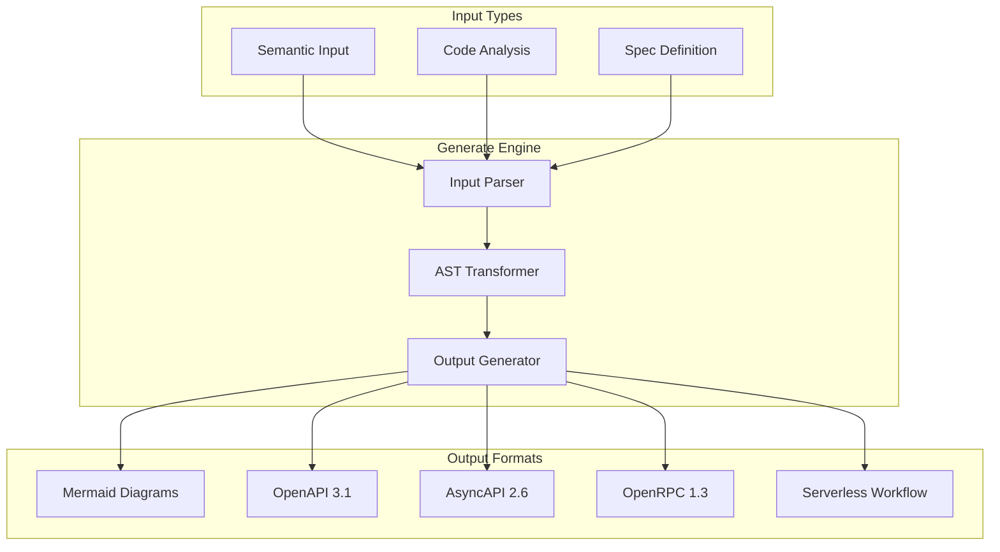
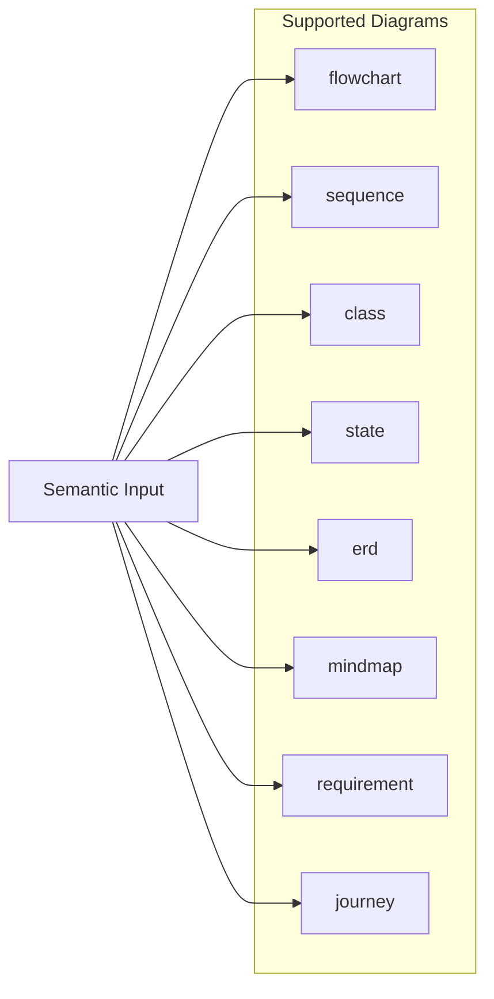
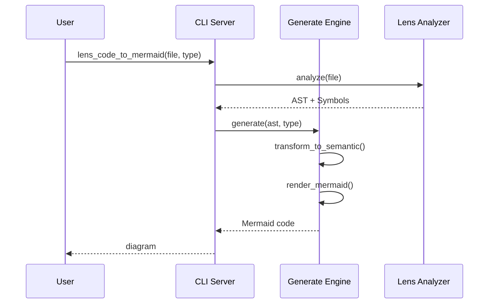

<spec>

# Generate Diagram Generator Architecture

## Overview
<!-- type: overview lang: markdown -->

Generate provides diagram and specification generation from structured input.

## Generation Pipeline
<!-- type: diagram lang: mermaid -->

## Mermaid Diagram Types
<!-- type: diagram lang: mermaid -->

## Code-to-Diagram Flow
<!-- type: diagram lang: mermaid -->

</spec>
