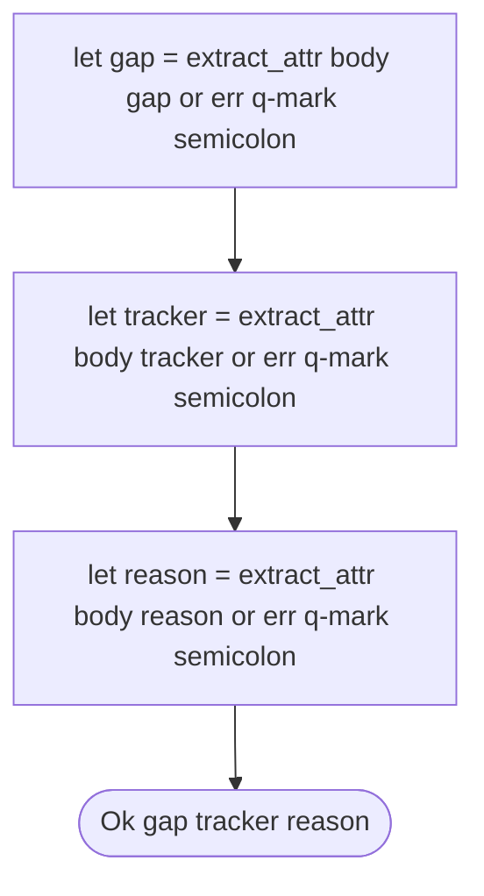

# Generate Audit Module

## Overview
<!-- type: overview lang: markdown -->

Public API manifest for `projects/agentic-workflow/src/generate/audit.rs` generated from AST during Score force-regeneration standardization.

### Symbols

| Name | Target | Kind | Visibility | Line | Signature |
|------|--------|------|------------|------|-----------|
| `BlockReport` | projects/agentic-workflow/src/generate/audit.rs | struct | pub | 61 |  |
| `HandwriteParseFailure` | projects/agentic-workflow/src/generate/audit.rs | enum | pub | 979 |  |
| `MarkerGap` | projects/agentic-workflow/src/generate/audit.rs | struct | pub | 72 |  |
| `ReportKind` | projects/agentic-workflow/src/generate/audit.rs | enum | pub | 46 |  |
| `SpecFileIndex` | projects/agentic-workflow/src/generate/audit.rs | type | pub | 557 |  |
| `UncoveredItem` | projects/agentic-workflow/src/generate/audit.rs | struct | pub | 89 |  |
| `UnifiedReport` | projects/agentic-workflow/src/generate/audit.rs | enum | pub | 807 |  |
| `audit_file` | projects/agentic-workflow/src/generate/audit.rs | function | pub | 102 | audit_file(file_path: &Path, project_root: &Path) -> std::io::Result<Vec<BlockReport>> |
| `audit_file_unified` | projects/agentic-workflow/src/generate/audit.rs | function | pub | 902 | audit_file_unified(     file_path: &Path,     project_root: &Path,     index: &SpecFileIndex, ) -> std::io::Result<Vec<UnifiedReport>> |
| `audit_markers` | projects/agentic-workflow/src/generate/audit.rs | function | pub | 403 | audit_markers(file_path: &Path) -> std::io::Result<Vec<MarkerGap>> |
| `audit_uncovered` | projects/agentic-workflow/src/generate/audit.rs | function | pub | 626 | audit_uncovered(     file_path: &Path,     project_root: &Path,     index: &SpecFileIndex, ) -> std::io::Result<Vec<UncoveredItem>> |
| `build_spec_file_index` | projects/agentic-workflow/src/generate/audit.rs | function | pub | 562 | build_spec_file_index(project_root: &Path) -> std::io::Result<SpecFileIndex> |
| `file` | projects/agentic-workflow/src/generate/audit.rs | function | pub | 863 | file(&self) -> &Path |
| `gap` | projects/agentic-workflow/src/generate/audit.rs | function | pub | 891 | gap(&self) -> Option<&str> |
| `is_clean` | projects/agentic-workflow/src/generate/audit.rs | function | pub | 853 | is_clean(&self) -> bool |
| `parse_handwrite_markers` | projects/agentic-workflow/src/generate/audit.rs | function | pub | 1048 | parse_handwrite_markers(     content: &str,     file_path: &str, ) -> std::result::Result<Vec<HandwriteMarker>, Vec<HandwriteParseError>> |
| `status` | projects/agentic-workflow/src/generate/audit.rs | function | pub | 876 | status(&self) -> &'static str |
## Logic
<!-- type: logic lang: mermaid -->



## Source
<!-- type: source lang: rust -->
<!-- source-from-target: handwrite-gap missing-generator:parse-handwrite-marker-state-machine -->

## Changes
<!-- type: changes lang: yaml -->

```yaml
changes:
  - path: projects/agentic-workflow/src/generate/audit.rs
    action: modify
    section: source
    impl_mode: codegen
    replaces:
      - "<handwrite-gap:missing-generator:parse-handwrite-marker-state-machine>"
    description: >
      Source template owns the HANDWRITE marker parser state-machine region.
      The file is intentionally not promoted as a whole-file source block
      because test fixtures embed marker-looking CODEGEN/HANDWRITE text.
  - action: annotate
    section: logic
    impl_mode: hand-written
    description: "Traceability metadata edge for the logic section."

```
