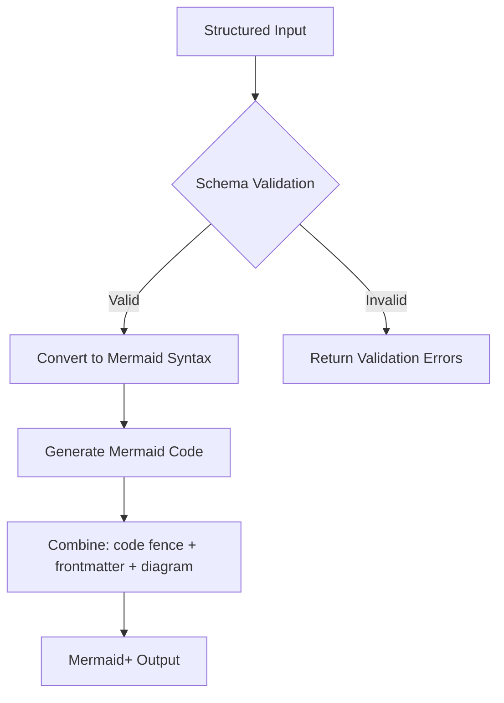

<spec>

# Mermaid+ Block Diagram Specification

## Overview
<!-- type: overview lang: markdown -->

Specification for the Mermaid+ Block Diagram generator. This diagram type supports columns, nested blocks, edges, and shapes with YAML frontmatter validation.

## Requirements
<!-- type: requirements lang: mermaid -->

```mermaid
---
id: block-plus-requirements
---
requirementDiagram
    requirement R1 {
        id: R1
        text: Support Mermaid block-beta syntax including columns, blocks, edges, and shapes.
        risk: medium
        verifymethod: test
    }
    requirement R2 {
        id: R2
        text: Validate YAML frontmatter for block definitions, nested blocks, and connections.
        risk: medium
        verifymethod: test
    }
    requirement R3 {
        id: R3
        text: Emit Mermaid+ output with frontmatter inside the diagram code block.
        risk: medium
        verifymethod: test
    }
```

## Acceptance Criteria
<!-- type: scenarios lang: yaml -->

```yaml
scenarios:
  - name: valid-block-generation
    given: A valid block definition with columns and nested blocks.
    when: Calling sdd_generate_block_plus.
    then: Returns Mermaid+ output with correct block-beta syntax and frontmatter.
  - name: missing-id-validation
    given: A block definition missing required fields such as id.
    when: Calling sdd_generate_block_plus.
    then: Returns a validation error.
```

## Diagrams
<!-- type: diagram lang: mermaid -->

### Block+ Processing Flow



</spec>

## Changes
<!-- type: changes lang: yaml -->

```yaml
changes:
  - action: annotate
    section: requirements
    impl_mode: hand-written
    description: "Traceability metadata edge for the requirements section."

  - action: annotate
    section: scenarios
    impl_mode: hand-written
    description: "Traceability metadata edge for the scenarios section."

```