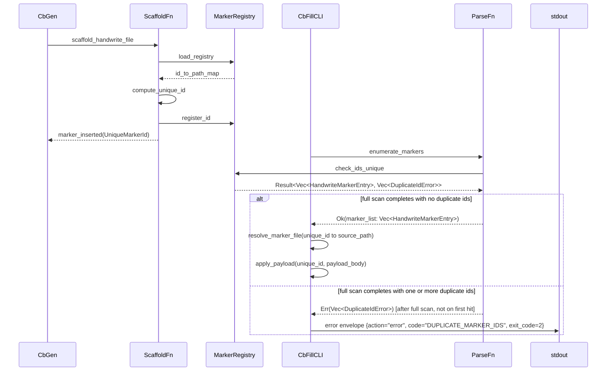

# CB Fill Marker-Id Collision Fix

## Schema
<!-- type: schema lang: yaml -->

```yaml
"$schema": "https://json-schema.org/draft/2020-12/schema"
$id: cb-fill-marker-id-collision#schema
title: CB Fill Marker-Id Collision — Type Definitions
description: >
  Type additions and constraints to fix the marker-id collision bug.
  Satisfies R1 (unique id emission), R2 (unambiguous payload path),
  R3 (unique file resolution), R5 (collision surfaced as error).

definitions:
  UniqueMarkerId:
    type: string
    $id: UniqueMarkerId
    description: >
      A marker id that is unique within a worktree. Formed as
      `<base-id>:<file-hash>:<seq>` when the gap-registry base id
      (e.g. `missing-generator:hand-written`) would otherwise collide
      across multiple source files. The suffix is deterministic:
      `file-hash` is the first 8 hex digits of SHA-256 of the
      repo-root-relative source file path; `seq` is the 0-based
      occurrence index of this marker within that file.
      When the base id is already unique within the worktree, no
      suffix is appended and the value equals the base id.
    minLength: 1
    pattern: "^[a-z][a-z0-9:\\-]*$"
    x-sdd:
      id: UniqueMarkerId
      refs:
        - $ref: "#/definitions/HandwriteMarkerEntry"

  DuplicateIdError:
    type: object
    $id: DuplicateIdError
    required: [kind, duplicate_id, files]
    description: >
      Structured error returned by `parse_handwrite_markers` when two or
      more markers in different source files share the same base id after
      gap derivation (R5). Surfaces at gen time rather than being swallowed
      at fill time.
    properties:
      kind:
        type: string
        const: "DuplicateId"
        description: "Discriminant; always 'DuplicateId'."
      duplicate_id:
        $ref: "#/definitions/UniqueMarkerId"
        description: "The colliding marker id detected in the worktree."
      files:
        type: array
        minItems: 2
        items:
          type: string
        description: >
          Repo-root-relative paths of all source files that contain a
          marker with this id. Always contains at least two entries.
    x-sdd:
      id: DuplicateIdError

  HandwriteMarkerEntry:
    type: object
    $id: HandwriteMarkerEntry
    required: [id, source_path, start_line, end_line, reason]
    description: >
      A single open HANDWRITE-BEGIN/END block enumerated by
      `parse_handwrite_markers`. The `id` field is a `UniqueMarkerId`
      — guaranteed unique within the worktree after the scaffold step
      applies the `<file-hash>:<seq>` suffix when needed (R1, R2, R3).
    properties:
      id:
        $ref: "#/definitions/UniqueMarkerId"
        description: >
          Unique marker identifier. Used as the payload filename stem:
          `.aw/payloads/<slug>/<id>.md`. Never collides across source
          files in the same worktree (R2).
        x-sdd:
          uniqueness: within-worktree
      source_path:
        type: string
        description: >
          Repo-root-relative path to the source file containing this block.
          The `id` encodes enough information to resolve to exactly this
          path and marker position (R3).
      start_line:
        type: integer
        minimum: 1
        description: "Line number of the HANDWRITE-BEGIN comment (1-indexed)."
      end_line:
        type: integer
        minimum: 1
        description: "Line number of the HANDWRITE-END comment (1-indexed)."
      reason:
        type: string
        description: "Reason string from the HANDWRITE-BEGIN annotation."
      spec_ref:
        type: string
        nullable: true
        description: >
          Optional @spec reference pointing to the TD section that
          specifies this block.
    x-sdd:
      id: HandwriteMarkerEntry
      refs:
        - $ref: "#/definitions/UniqueMarkerId"
        - $ref: "#/definitions/DuplicateIdError"
```
## Logic: scaffold-unique-marker-id

```mermaid
---
id: scaffold-unique-marker-id
entry: start
refs:
  - $ref: "cb-fill-marker-id-collision#schema/definitions/UniqueMarkerId"
  - $ref: "cb-fill-marker-id-collision#schema/definitions/DuplicateIdError"
description: >
  Two-pass algorithm. Pass 1 counts how many times each base_id appears
  across ALL source files in the worktree. Pass 2 emits each marker id:
  bare base_id only when global_count == 1; base_id:<file_hash>:<seq>
  whenever global_count > 1 (even for the very first occurrence in a
  file, so seq 0 is always explicit and ids are symmetric within a file).
nodes:
  start:
    kind: start
    label: "scaffold_handwrite_file (two-pass): entry"
  collect_all_markers:
    kind: process
    label: "Pass 1 — scan all source files: collect list of (source_path, base_id) pairs"
  build_freq_map:
    kind: process
    label: "Build freq_map: base_id → total occurrence count across all files"
  init_seq_counters:
    kind: process
    label: "Init per-file seq counters: (source_path, base_id) → 0"
  next_marker:
    kind: decision
    label: "More markers to emit?"
  derive_gap:
    kind: process
    label: "Derive base_id from entry.gap or section_type"
  check_global_count:
    kind: decision
    label: "freq_map[base_id] > 1?"
  compute_file_hash:
    kind: process
    label: "Compute file_hash = SHA-256(repo_rel_path)[0..8]"
  get_seq:
    kind: process
    label: "seq = seq_counters[(source_path, base_id)]; increment counter"
  build_suffixed_id:
    kind: process
    label: "unique_id = base_id + ':' + file_hash + ':' + seq"
  use_bare_id:
    kind: process
    label: "unique_id = base_id (globally unique, no suffix needed)"
  register_id:
    kind: process
    label: "Insert unique_id → source_path into worktree registry"
  emit_marker:
    kind: process
    label: "Emit HANDWRITE-BEGIN id=unique_id / HANDWRITE-END pair"
  done:
    kind: terminal
    label: "Ok — all markers emitted with UniqueMarkerIds"
edges:
  - from: start
    to: collect_all_markers
  - from: collect_all_markers
    to: build_freq_map
  - from: build_freq_map
    to: init_seq_counters
  - from: init_seq_counters
    to: next_marker
  - from: next_marker
    to: done
    label: "no more markers"
  - from: next_marker
    to: derive_gap
    label: "yes"
  - from: derive_gap
    to: check_global_count
  - from: check_global_count
    to: compute_file_hash
    label: "yes — base_id appears in multiple files"
  - from: check_global_count
    to: use_bare_id
    label: "no — base_id is globally unique"
  - from: compute_file_hash
    to: get_seq
  - from: get_seq
    to: build_suffixed_id
  - from: build_suffixed_id
    to: register_id
  - from: use_bare_id
    to: register_id
  - from: register_id
    to: emit_marker
  - from: emit_marker
    to: next_marker
---
flowchart TD
    start([scaffold_handwrite_file two-pass: entry]) --> collect_all_markers["Pass 1 — scan all source files: collect list of (source_path, base_id) pairs"]
    collect_all_markers --> build_freq_map["Build freq_map: base_id → total occurrence count across all files"]
    build_freq_map --> init_seq_counters["Init per-file seq counters: (source_path, base_id) → 0"]
    init_seq_counters --> next_marker{More markers to emit?}
    next_marker -->|"no more"| done([Ok — all markers emitted with UniqueMarkerIds])
    next_marker -->|"yes"| derive_gap[Derive base_id from entry.gap or section_type]
    derive_gap --> check_global_count{"freq_map[base_id] > 1?"}
    check_global_count -->|"yes — appears in multiple files"| compute_file_hash["Compute file_hash = SHA-256(repo_rel_path)[0..8]"]
    check_global_count -->|"no — globally unique"| use_bare_id["unique_id = base_id (no suffix)"]
    compute_file_hash --> get_seq["seq = seq_counters[(source_path, base_id)]; increment counter"]
    get_seq --> build_suffixed_id["unique_id = base_id + ':' + file_hash + ':' + seq"]
    build_suffixed_id --> register_id[Insert unique_id → source_path into worktree registry]
    use_bare_id --> register_id
    register_id --> emit_marker["Emit HANDWRITE-BEGIN id=unique_id / HANDWRITE-END pair"]
    emit_marker --> next_marker
```

<!-- type: logic lang: mermaid -->


## Interaction: cb-fill-unique-routing
<!-- type: interaction lang: mermaid -->


## Test Plan

```mermaid
---
id: cb-fill-marker-id-collision-test-plan
refs:
  - $ref: "cb-fill-marker-id-collision#schema/definitions/UniqueMarkerId"
  - $ref: "cb-fill-marker-id-collision#schema/definitions/DuplicateIdError"
requirements:
  r1_unique_id_emission:
    id: R1
    text: "scaffold_handwrite_file emits a UniqueMarkerId with file-hash:seq suffix when the base gap id would collide across source files in the same worktree"
    kind: functional
    risk: high
    verify: test
  r2_payload_path_unambiguous:
    id: R2
    text: "the payload path .aw/payloads/<slug>/<marker-id>.md never collides across source files because the unique suffix from R1 is embedded in the id"
    kind: functional
    risk: high
    verify: test
  r3_apply_routes_to_correct_file:
    id: R3
    text: "aw cb fill --apply --marker <unique-id> routes to exactly one (file, marker-position) pair; a formerly-colliding base id now resolves unambiguously"
    kind: functional
    risk: high
    verify: test
  r4_marker_list_unique_ids:
    id: R4
    text: "the CbFillBriefEnvelope marker_list contains unique ids from R1; no two HandwriteMarkerEntry elements share the same id field"
    kind: functional
    risk: high
    verify: test
  r5_collision_surfaced_as_error:
    id: R5
    text: "parse_handwrite_markers returns DuplicateIdError when two markers in different files share the same id; the error is not swallowed silently"
    kind: functional
    risk: medium
    verify: test
  r6_regression_multi_marker:
    id: R6
    text: "regression test in cb_fill_test.rs: two markers in different files with the same base gap id produce two distinct payload paths and have their content written to the correct files"
    kind: functional
    risk: high
    verify: test
elements:
  test_unique_id_suffix_emitted:
    kind: test
    type: "rs/#[test]"
  test_unique_id_no_suffix_when_not_needed:
    kind: test
    type: "rs/#[test]"
  test_payload_path_no_collision:
    kind: test
    type: "rs/#[test]"
  test_apply_routes_correct_file:
    kind: test
    type: "rs/#[test]"
  test_marker_list_ids_all_unique:
    kind: test
    type: "rs/#[test]"
  test_parse_emits_duplicate_id_error:
    kind: test
    type: "rs/#[test]"
  test_regression_two_files_same_base_id:
    kind: test
    type: "rs/#[test]"
relations:
  - from: test_unique_id_suffix_emitted
    verifies: r1_unique_id_emission
  - from: test_unique_id_no_suffix_when_not_needed
    verifies: r1_unique_id_emission
  - from: test_payload_path_no_collision
    verifies: r2_payload_path_unambiguous
  - from: test_apply_routes_correct_file
    verifies: r3_apply_routes_to_correct_file
  - from: test_marker_list_ids_all_unique
    verifies: r4_marker_list_unique_ids
  - from: test_parse_emits_duplicate_id_error
    verifies: r5_collision_surfaced_as_error
  - from: test_regression_two_files_same_base_id
    verifies: r6_regression_multi_marker
  - from: test_regression_two_files_same_base_id
    verifies: r2_payload_path_unambiguous
  - from: test_regression_two_files_same_base_id
    verifies: r3_apply_routes_to_correct_file
---
requirementDiagram
    requirement R1 {
      id: R1
      text: "scaffold_handwrite_file emits UniqueMarkerId with file-hash:seq suffix on collision"
      risk: high
      verifymethod: test
    }
    requirement R2 {
      id: R2
      text: "payload path .aw/payloads/<slug>/<marker-id>.md never collides across source files"
      risk: high
      verifymethod: test
    }
    requirement R3 {
      id: R3
      text: "aw cb fill --apply --marker routes to exactly one (file, marker-position) pair"
      risk: high
      verifymethod: test
    }
    requirement R4 {
      id: R4
      text: "CbFillBriefEnvelope marker_list ids are all unique (no two entries share the same id)"
      risk: high
      verifymethod: test
    }
    requirement R5 {
      id: R5
      text: "parse_handwrite_markers returns DuplicateIdError on id collision; not swallowed"
      risk: medium
      verifymethod: test
    }
    requirement R6 {
      id: R6
      text: "regression: two files with same base gap id yield distinct payload paths and correct per-file content"
      risk: high
      verifymethod: test
    }
    element test_unique_id_suffix_emitted {
      type: "rs/#[test]"
    }
    element test_unique_id_no_suffix_when_not_needed {
      type: "rs/#[test]"
    }
    element test_payload_path_no_collision {
      type: "rs/#[test]"
    }
    element test_apply_routes_correct_file {
      type: "rs/#[test]"
    }
    element test_marker_list_ids_all_unique {
      type: "rs/#[test]"
    }
    element test_parse_emits_duplicate_id_error {
      type: "rs/#[test]"
    }
    element test_regression_two_files_same_base_id {
      type: "rs/#[test]"
    }
    test_unique_id_suffix_emitted - verifies -> R1
    test_unique_id_no_suffix_when_not_needed - verifies -> R1
    test_payload_path_no_collision - verifies -> R2
    test_apply_routes_correct_file - verifies -> R3
    test_marker_list_ids_all_unique - verifies -> R4
    test_parse_emits_duplicate_id_error - verifies -> R5
    test_regression_two_files_same_base_id - verifies -> R6
    test_regression_two_files_same_base_id - verifies -> R2
    test_regression_two_files_same_base_id - verifies -> R3
```

<!-- type: test-plan lang: mermaid -->


## Changes
<!-- type: changes lang: yaml -->

```yaml
changes:
  - path: projects/agentic-workflow/src/generate/apply.rs
    action: modify
    section: logic
    impl_mode: hand-written
    description: >
      Extend `scaffold_handwrite_file` to emit UniqueMarkerIds (R1, R2).
      After deriving `base_id` from `entry.gap` or `section_type`, load
      the worktree marker registry (an in-memory `HashMap<String, Vec<PathBuf>>`
      built during the current gen-code run). If `base_id` is already present
      in the registry for a different source file, compute `file_hash` as the
      first 8 hex digits of SHA-256 of the repo-root-relative source file path,
      and `seq` as the 0-based occurrence count of this base_id within the
      current file; form `unique_id = base_id + ':' + file_hash + ':' + seq`.
      Otherwise use `unique_id = base_id` unchanged. Register `unique_id →
      source_path` in the registry before emitting the marker pair so that
      subsequent calls within the same gen-code run see the updated registry.
      Emit the HANDWRITE-BEGIN comment with `id=unique_id` attribute.
      Carries @spec cb-fill-marker-id-collision#logic/scaffold-unique-marker-id.

  - path: projects/agentic-workflow/src/generate/audit.rs
    action: modify
    section: schema
    impl_mode: hand-written
    description: >
      Extend `parse_handwrite_markers` to detect duplicate ids across files and
      surface a `DuplicateIdError` instead of returning the first match (R5).
      After successfully parsing a HANDWRITE-BEGIN id attribute, check the
      `seen_ids: HashMap<String, PathBuf>` accumulator. If the id is already
      present under a different source file path, push a
      `ParseError::DuplicateId { duplicate_id, files: [existing_path, current_path] }`
      into the error collector and continue scanning (do not push a valid marker
      for this pair). At the end, `DuplicateId` errors are included in the
      returned `Err(Vec<ParseError>)` alongside any structural errors.
      Add `DuplicateId { duplicate_id: String, files: Vec<PathBuf> }` variant
      to the `ParseError` / `HandwriteParseError` error union alongside the
      existing `UnmatchedOpen`, `UnmatchedClose`, `EmptyReason`, and
      `MalformedAttributes` variants.
      Carries @spec cb-fill-marker-id-collision#schema/definitions/DuplicateIdError.

  - path: projects/agentic-workflow/src/cli/cb_fill.rs
    action: modify
    section: interaction
    impl_mode: hand-written
    description: >
      Update `resolve_marker_file` to use the unique id for exact (file,
      marker-position) resolution (R3). The function now calls
      `enumerate_worktree_markers` which returns `HandwriteMarkerEntry`
      items each carrying a `UniqueMarkerId`; since ids are unique within
      the worktree after the R1 fix, the first match on `entry.id == marker_id`
      is the only match. If no entry is found, emit `error: marker id not found`.
      If unexpectedly multiple entries match (pre-fix worktree state), emit
      `error: ambiguous marker id — collision not resolved at gen time` and
      exit 2 (guard against stale worktrees).
      Carries @spec cb-fill-marker-id-collision#interaction/cb-fill-unique-routing.

  - path: projects/agentic-workflow/src/cli/cb.rs
    action: modify
    section: schema
    impl_mode: hand-written
    description: >
      No structural changes to `CbCommand` or dispatch. The `marker_list`
      in the `CbFillBriefEnvelope` is already sourced from
      `parse_handwrite_markers` output; after the R1/R5 fixes, all entries
      in `marker_list` carry `UniqueMarkerId` values (R4). No code change
      required here beyond confirming that `HandwriteMarkerEntry.id` is
      typed as `UniqueMarkerId` in the schema (this entry records the
      dependency for spec traceability).

  - path: projects/agentic-workflow/tests/cb_fill_test.rs
    action: modify
    section: test-plan
    impl_mode: hand-written
    description: >
      Add regression tests for the multi-marker collision scenario (R6):
        - test_unique_id_suffix_emitted: set up a fixture worktree with two
          source files each containing a HANDWRITE block whose gap derives to
          the same base id (`missing-generator:hand-written`); run
          `scaffold_handwrite_file` on both; assert that each emitted id
          carries a distinct `:<file-hash>:<seq>` suffix and that the ids
          differ from each other and from the base id.
        - test_unique_id_no_suffix_when_not_needed: single file with one
          marker; assert the emitted id equals the base id (no suffix).
        - test_payload_path_no_collision: after scaffolding two files per
          above, assert that the two payload path stems
          `.aw/payloads/<slug>/<id>.md` are distinct.
        - test_apply_routes_correct_file: write distinct payload bodies for
          each unique id; run `aw cb fill --apply --marker <id>` for each;
          assert file A receives payload A content and file B receives payload
          B content (no cross-file swap).
        - test_marker_list_ids_all_unique: brief mode on a worktree with two
          same-base-id markers; assert the emitted marker_list has two entries
          with distinct id values.
        - test_parse_emits_duplicate_id_error: create a fixture with two
          markers sharing the same fully-formed id (simulating a stale worktree
          that pre-dates the R1 fix); assert `parse_handwrite_markers` returns
          `Err` containing a `ParseError::DuplicateId` entry.

  - path: projects/agentic-workflow/tech-design/surface/specs/score-cb-fill-workflow.md
    action: modify
    section: schema
    impl_mode: hand-written
    description: >
      Update Schema section: add `uniqueness: within-worktree` constraint
      annotation to `HandwriteMarkerEntry.id` (cross-reference to
      `UniqueMarkerId` in cb-fill-marker-id-collision#schema).
      Update Logic section: in `resolve_marker_file` node, add guard comment
      — "if multiple matches found, return error: ambiguous id (pre-fix
      worktree guard)" — so the spec reflects R3's ambiguous-id error path.

  - path: projects/agentic-workflow/tech-design/core/generate/handwrite-marker.md
    action: modify
    section: logic
    impl_mode: hand-written
    description: >
      Update Schema section: add `DuplicateId` variant to the `HandwriteParseError`
      union (alongside existing `UnmatchedOpen`, `UnmatchedClose`, `EmptyReason`,
      `MalformedAttributes`) with fields `duplicate_id: string` and
      `files: array<string>`.
      Update Logic section (scaffold-handwrite flowchart): after the `s_gap`
      node (derive gap), add `s_load_registry` process and `s_check_collision`
      decision per the logic in cb-fill-marker-id-collision#logic/scaffold-unique-marker-id.
      Update Logic section (parse-handwrite-markers flowchart): after the
      `p_push` node (push to open stack), add `p_check_dup` decision —
      if `id` already in `seen_ids` under different path, push `ParseError::DuplicateId`.
      Update Test Plan: add `r_unique_id` (R1 from this spec) and
      `r_duplicate_id_error` (R5 from this spec) requirements with corresponding
      test elements.
```

# Reviews

## Review 1
<!-- type: doc lang: markdown -->
**Verdict:** needs-revision

- [interaction] (item 3) The sequence diagram models the happy path only. When `ParseFn → MarkerRegistry: check_ids_unique` returns `Err(DuplicateIdError)`, there is no branch showing what happens next — does `CbFillCLI` propagate the error envelope immediately, exit with a specific code, or collect and continue? The changes prose for `audit.rs` says "DuplicateId errors are included in the returned `Err(Vec<ParseError>)`" and `cb_fill.rs` is expected to emit an error envelope, but the interaction diagram omits this error path entirely. An implementer reading only the spec cannot determine the caller contract. Add an `alt` block (or a second message path) to the sequence showing the `DuplicateIdError` branch from `ParseFn` back to `CbFillCLI` and the resulting error output.

- [logic] (item 5) The scaffold logic does not account for the case where a single source file contains multiple markers that all derive to the same base id. The `check_collision` decision fires on "base_id already in registry?" — but after the first marker from file A registers as `base_id` (no collision at that point), the second marker in file A would also hit the collision branch and compute `base_id:<hash_A>:1`. This yields asymmetric ids within the same file: marker 1 = `base_id`, marker 2 = `base_id:<hash_A>:1`. The Schema says "`seq` is the 0-based occurrence index of this marker within that file," implying the first occurrence in a file should be seq 0, not the bare `base_id`. The logic needs a node to track whether this file has already emitted a marker for this base_id and normalize: if so, also suffix the earlier emission (or always suffix with hash:seq when any collision is possible). The current flowchart leaves this ambiguous, which will cause inconsistent payload paths and confuse `parse_handwrite_markers` when it tries to re-detect duplicates on a re-run.

## Review 2
<!-- type: doc lang: markdown -->
**Verdict:** needs-revision

- [changes] (item 6) The `apply.rs` change description (lines describing `scaffold_handwrite_file`) still prescribes a single-pass approach: "If `base_id` is already present in the registry for a different source file, compute `file_hash`... Otherwise use `unique_id = base_id` unchanged." This is the pre-revision single-pass logic that the round-1 finding identified as producing asymmetric ids. The `## Logic` section was correctly revised to a two-pass algorithm (pass 1 builds `freq_map: base_id → count`; pass 2 uses `freq_map[base_id] > 1` to decide whether to suffix all occurrences uniformly), but the `apply.rs` changes description was not updated to match. An implementer following the Changes section to the letter would reintroduce the original bug. The description must be rewritten to specify: (1) build a `freq_map` by scanning all source files before emitting any marker, (2) in the emit pass, apply the `<file_hash>:<seq>` suffix whenever `freq_map[base_id] > 1`, including the first occurrence in any file (so seq starts at 0 for every file uniformly).
