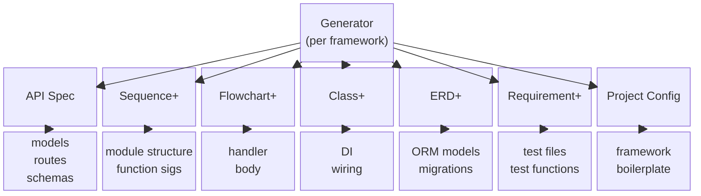

# Code Generator Contract

## Principle
<!-- type: doc lang: markdown -->

Specs describe WHAT. Generators decide HOW for each target framework.

## Generator Responsibilities
<!-- type: doc lang: markdown -->

Given agnostic specs, a generator produces framework-specific code:

| Spec Input | Generator Output |
|---|---|
| API Spec requestBody schema | Pydantic BaseModel / TS interface / Rust struct |
| API Spec security scheme | `Depends(get_current_user)` / `@UseGuards` / middleware |
| Sequence+ participant | Module / file / class definition |
| Sequence+ message `A->>B: method(args)` | Function signature on B, callable by A |
| Sequence+ message order | Call sequence in caller's function body |
| Sequence+ `alt`/`else` block | `if/else` or `match` branches |
| Sequence+ `loop` block | `for`/`while` or retry logic |
| Sequence+ `par` block | `tokio::join!` / `asyncio.gather` / `Promise.all` |
| Flowchart+ `db_query` semantic | `await session.execute()` / `lensa.findMany()` / `sqlx::query()` |
| Class+ dependency relationship | `Depends(get_repo)` / `@Autowired` / constructor param |
| ERD+ entity + attributes | SQLAlchemy Model / Lensa schema / sqlx struct |
| ERD+ FK + relationship | `ForeignKey("users.id")` / `@relation` / `#[sqlx(rename)]` |
| Requirement+ `R -verifies-> Scenario` | Test function named after scenario, grouped by requirement |
| Requirement+ `Module -satisfies-> R` | Test file imports module under test |
| Requirement+ `R2 -derives-> R1` | Test ordering — R1 tests run before R2 |
| Requirement+ `risk: High` | Test marked as critical / CI fast path |

## Inference Rules
<!-- type: doc lang: markdown -->

Generators SHOULD auto-infer common patterns from spec semantics:

| Spec Signal | Inferred Code |
|---|---|
| Flowchart has `db_query` or `db_mutation` | Inject database session |
| API Spec has `security` scheme | Inject auth dependency |
| Flowchart has `api_call` | Inject HTTP client |
| Class+ shows `A ..> B` dependency | Wire DI for A depending on B |
| Sequence+ shows `A->>B` and `A->>C` | A depends on B and C (constructor/DI params) |
| Sequence+ `alt` with error response | Error handling branch in caller |
| Requirement+ `verifymethod: Test` | Generate automated test function |
| Requirement+ `verifymethod: Inspection` | Generate TODO comment (manual review needed) |
| Requirement+ multiple scenarios verify same R | Multiple test functions in same test class |
| Requirement+ module satisfies multiple R's | Module imported in multiple test files |

Only when inference is insufficient should explicit configuration be required.

### mambalibs.http Stack Inference Rules

| Spec Signal | mambalibs.http Output |
|---|---|
| ERD+ entity with PK, FK, columns | `class {Entity}DB(Base)` with `cclab.pg` mapped_column types |
| ERD+ FK relationship | `relationship()` + `ForeignKey('table.col')` |
| ERD+ `deleted_at` column | Soft-delete pattern: `Mapped[Optional[datetime]]`, list queries exclude deleted |
| API Spec paths `/{resource}` | `Router(prefix="/{resource}", tags=["{resource}"])` |
| API Spec requestBody schema | `{Entity}Create(BaseModel)` from `cclab.schema` |
| API Spec response schema | `{Entity}Response(BaseModel)` with `ConfigDict(from_attributes=True)` |
| API Spec list endpoint with pagination | `{Entity}ListResponse(items: list[...], total: int)` |
| Spec `changes` section `file:` paths | Output file targets (overrides convention) |
| API Spec path param `{project_id}` | `project_id: UUID` in handler + `Depends(get_db)` |

### Output Path Resolution

Generators determine file paths via 3-tier strategy:

1. **Spec `changes` section** — authoritative `file:` paths from the spec author
2. **CLI flags** — `--root` + `--domain` override
3. **Convention** — resource name from OpenAPI paths → `features/{resource}/`

## Sequence Plus → Code: Detailed Mapping
<!-- type: doc lang: markdown -->

Sequence diagrams generate code at two levels simultaneously:

### Macro level (system-to-system)

Participants are separate services → generates API client code and service interfaces.

```
Client ->> APIGateway: POST /orders
APIGateway ->> OrderService: create_order(data)
```

→ `APIGateway` needs an `OrderServiceClient` with method `create_order(data)`.

### Micro level (module-to-module)

Participants are modules within one service → generates function signatures and DI wiring.

```
OrderHandler ->> OrderRepo: insert(order_data)
OrderHandler ->> AuthService: get_current_user(token)
```

→ `OrderHandler.__init__(self, order_repo: OrderRepo, auth_service: AuthService)` — DI inferred from message targets.

### N:M in one diagram

One diagram can show both levels. The generator determines granularity by participant naming convention or explicit `type` metadata in Sequence Plus semantic data.

## Requirement Plus → Test: Detailed Mapping
<!-- type: doc lang: markdown -->

One Requirement Plus diagram can produce **multiple test files** spanning **multiple modules**:

### N Requirements → N Test Classes

```
R1 (token refresh)  →  class TestR1_TokenRefresh
R2 (invalid token)  →  class TestR2_InvalidToken
```

### N Scenarios → N Test Functions

```
Scenario_happy -verifies-> R1     →  TestR1.test_valid_refresh_token()
Scenario_expired -verifies-> R2   →  TestR2.test_expired_token_returns_401()
Scenario_revoked -verifies-> R2   →  TestR2.test_revoked_token_returns_401()
```

### M Modules → imports

```
auth_handler -satisfies-> R1, R2  →  both TestR1 and TestR2 import auth_handler
token_service -satisfies-> R1     →  TestR1 imports token_service
```

### derives → test ordering

```
R2 -derives-> R1  →  TestR1 runs before TestR2 (pytest-ordering or dependency marker)
```

## Existing Generators
<!-- type: doc lang: markdown -->

Located in `crates/cclab-sdd/src/generators/`:

| Generator | Target | Input | Status |
|---|---|---|---|
| `FastAPIGenerator` | Python / FastAPI | JSON Schema (OpenAPI) | Models + routes only |
| `ExpressGenerator` | TypeScript / Express | JSON Schema (OpenAPI) | Models + routes only |
| `AxumGenerator` | Rust / Axum | JSON Schema (OpenAPI) | Models + routes only |

### Current Gap

All existing generators only consume **API Spec (OpenAPI / JSON Schema)** to produce interface code (models + route stubs). They do not yet consume Sequence+, Flowchart+, Class+, ERD+, or Requirement+.

### Target Architecture


