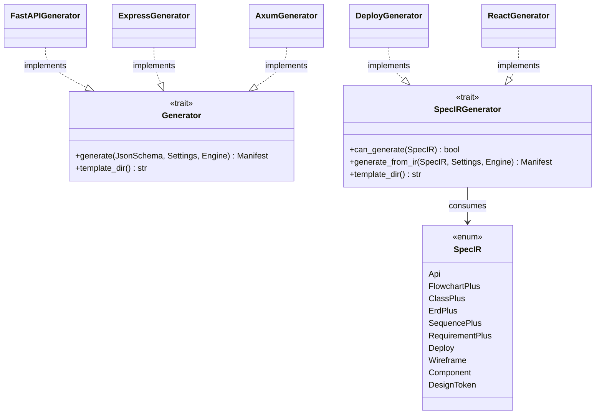
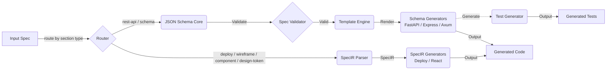

<spec>

# Generate Code Generation System Architecture

## Overview
<!-- type: overview lang: markdown -->

Defines the architecture for the Generate Code Generation System. This system allows generating production-ready code for various frameworks (FastAPI, Express, Axum) from JSON Schema/OpenAPI specifications using a template-based engine. It includes validation, testing, and modular generators.

## Requirements
<!-- type: doc lang: markdown -->

### R1 - Unified Internal Representation

```yaml
id: R1
priority: medium
status: draft
```

The system must parse JSON Schema and OpenAPI specifications into a unified internal representation based on JSON Schema.

### R2 - Spec Validation

```yaml
id: R2
priority: medium
status: draft
```

The system must validate the input specification for completeness (e.g., missing types, descriptions) before generation.

### R3 - Template-Based Generation

```yaml
id: R3
priority: medium
status: draft
```

The system must use a template engine (e.g., MiniJinja) to generate code, allowing for customizable templates.

### R4 - Pluggable Generators

```yaml
id: R4
priority: medium
status: draft
```

The system must support pluggable generators for different frameworks (FastAPI, Express, Axum).

### R5 - Test Generation

```yaml
id: R5
priority: medium
status: draft
```

The system must generate corresponding test suites for the generated code.

### R6 - SpecIR Generator Protocol

```yaml
id: R6
priority: high
status: draft
```

The system must support a `SpecIRGenerator` trait for generators that consume
structured SpecIR payloads (deploy, wireframe, component, design-token section
types) rather than raw JSON Schema. Each generator implements `can_generate()`
for routing and `generate_from_ir()` for output production.

### R7 - New Section-Type Generators

```yaml
id: R7
priority: high
status: draft
```

The system must include generators for the new section types introduced in this
change:

| Generator | Input SpecIR | Output |
|---|---|---|
| `DeployGenerator` | `SpecIR::Deploy` | Kubernetes `Deployment` + `Service` YAML |
| `ReactGenerator` | `SpecIR::Wireframe` | React `.tsx` component + `.types.ts` + `index.ts` |

### R8 - Output Path Resolution

```yaml
id: R8
priority: high
status: draft
```

Generators must determine output file paths via a 3-tier resolution strategy:

| Tier | Source | Example |
|------|--------|---------|
| 1 | Spec `changes` YAML section → `file:` paths | `projects/conductor/be/src/features/artifacts/models.py` |
| 2 | CLI flags `--root` + `--domain` | `--root projects/conductor/be/src --domain artifacts` → `features/artifacts/` |
| 3 | Convention fallback | Extract resource name from OpenAPI path `/projects/{id}/artifacts` → `features/artifacts/` |

Tier 1 takes precedence when present. Generators that produce feature modules (e.g., httpkit) must nest output under the domain directory, not dump flat.

### R9 - mambalibs.http Codegen Target

```yaml
id: R9
priority: high
status: draft
```

The system must target the Httpkit stack (`mambalibs.http`, `cclab.pg`, `cclab.schema`)
through TD v2 section generators. The removed legacy generator stack is not a
runtime dependency.

## Acceptance Criteria
<!-- type: doc lang: markdown -->

### Scenario: Generate FastAPI Code

- **GIVEN** A valid JSON Schema for a User model
- **WHEN** The FastAPI generator is invoked
- **THEN** FastAPI Pydantic models and API endpoints are generated using the FastAPI templates

### Scenario: Validation Failure

- **GIVEN** An incomplete spec missing a required field type
- **WHEN** The spec is validated
- **THEN** The system returns a validation error detailing the missing type

### Scenario: Generate Axum Code

- **GIVEN** A valid OpenAPI spec
- **WHEN** The Axum generator is invoked
- **THEN** Axum handlers and structs are generated using the Axum templates

## Diagrams
<!-- type: doc lang: markdown -->

### Generate Codegen System Class Diagram



### Generate Codegen Data Flow



<semantic-data>

```json
{
  "edges": [
    {
      "from": "InputSpec",
      "to": "JsonSchemaCore"
    },
    {
      "from": "JsonSchemaCore",
      "to": "SpecValidator"
    },
    {
      "from": "SpecValidator",
      "to": "TemplateEngine"
    },
    {
      "from": "TemplateEngine",
      "to": "Generators"
    },
    {
      "from": "Generators",
      "to": "GeneratedCode"
    },
    {
      "from": "Generators",
      "to": "TestGenerator"
    },
    {
      "from": "TestGenerator",
      "to": "GeneratedTests"
    }
  ],
  "nodes": [
    {
      "id": "InputSpec",
      "semantic": {
        "type": "start"
      }
    },
    {
      "id": "JsonSchemaCore",
      "semantic": {
        "type": "transform"
      }
    },
    {
      "id": "SpecValidator",
      "semantic": {
        "type": "validation"
      }
    },
    {
      "id": "TemplateEngine",
      "semantic": {
        "type": "transform"
      }
    },
    {
      "id": "Generators",
      "semantic": {
        "type": "transform"
      }
    },
    {
      "id": "TestGenerator",
      "semantic": {
        "type": "transform"
      }
    },
    {
      "id": "GeneratedCode",
      "semantic": {
        "type": "end"
      }
    },
    {
      "id": "GeneratedTests",
      "semantic": {
        "type": "end"
      }
    }
  ]
}
```

</semantic-data>

</spec>
