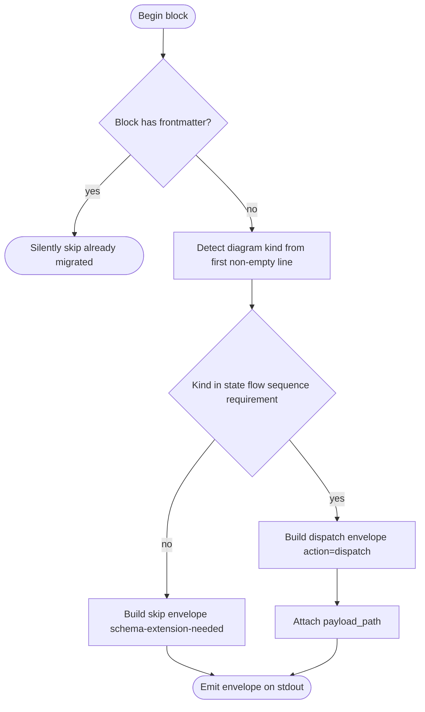
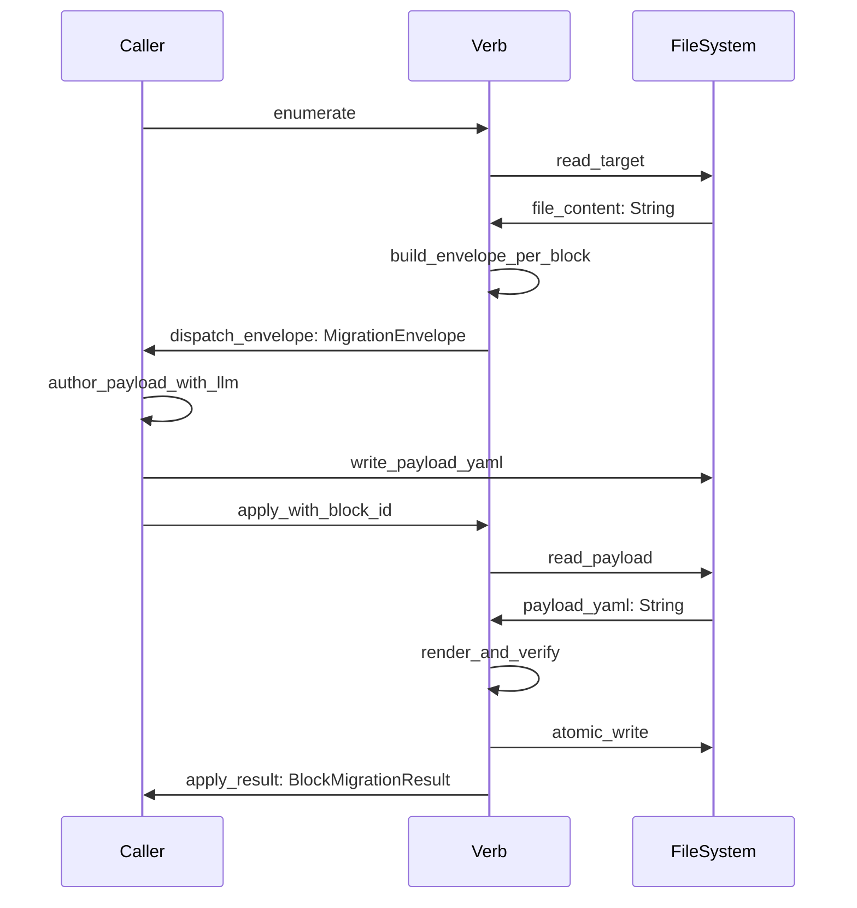

# Mermaid Plus Migration Envelope

## Overview
<!-- type: overview lang: markdown -->

The **migration envelope** is the on-the-wire dispatch object emitted by `aw td
migrate-mermaid <path>` (enumerate mode). It is the contract between the migrate verb and
its caller: the verb describes one conversion task; the caller authors a YAML frontmatter
payload, writes it to `payload_path`, then invokes `aw td migrate-mermaid --apply
<path> --block-id <id>` to land the result.

The envelope is intentionally narrow: it carries only the information needed to
(a) identify the block deterministically, (b) reproduce the legacy diagram body for the
caller's LLM prompt, and (c) tell the caller where to write the resulting payload.
Authoring of the payload — invoking an LLM, prompting a human, running cue's agent loop —
lives entirely in the caller. The migrate verb never embeds an LLM (per
`feedback_score_no_embedded_llm`).

This file defines the JSON-Schema-shaped envelope, the per-envelope state machine, and the
caller ↔ verb interaction. Concrete CLI ergonomics live in `migrate.md`.

## Schema
<!-- type: schema lang: yaml -->

```yaml
definitions:
  EnvelopeAction:
    type: string
    const: dispatch
    description: |
      The literal string "dispatch". Matches the action tag used by aw wi
      and aw td create envelopes — mainthread loops switch on action and treat
      this envelope identically to any other dispatch.

  DiagramKind:
    type: string
    enum: [StateMachine, Flowchart, Sequence, Requirement]
    description: Diagram kind detected from the legacy body's first non-empty line.
    x-rust-enum:
      derive: [Debug, Clone, PartialEq, Eq, Serialize, Deserialize]
      serde_rename_all: snake_case

  BlockId:
    type: string
    description: |
      Block identifier of the form "<fence_open_line>-<fence_close_line>" using
      1-based inclusive line numbers from the source file at enumerate time.
      Callers MUST re-enumerate after any file edit before applying — block ids
      embed line numbers and become stale on edit.
    x-rust-newtype:
      base: String
      derive: [Debug, Clone, PartialEq, Eq, Serialize, Deserialize]

  MigrationEnvelope:
    type: object
    required: [action, target_path, block_id, legacy_syntax, diagram_kind, payload_path]
    description: |
      Per-block dispatch envelope emitted by enumerate mode. One envelope per
      legacy mermaid block. Envelopes for already-migrated blocks (those with
      pre-existing YAML frontmatter) are NOT emitted — they are silently skipped.
    properties:
      action:
        $ref: "#/definitions/EnvelopeAction"
        description: Always "dispatch".
      target_path:
        type: string
        description: Relative path (from project root) to the TD spec file containing the block.
      block_id:
        $ref: "#/definitions/BlockId"
        description: Stable identifier of the block within target_path.
      legacy_syntax:
        type: string
        description: Verbatim legacy mermaid body (the diagram source between fences, excluding the ```mermaid / ``` markers).
      diagram_kind:
        $ref: "#/definitions/DiagramKind"
        description: Detected diagram kind. Schema-extension-needed envelopes carry no diagram_kind and a populated reason field.
      payload_path:
        type: string
        description: |
          Filesystem path where the caller MUST write the YAML frontmatter payload
          before invoking --apply. Default form is
          .aw/payloads/migrate-mermaid/<file_basename>-<block_id>.yaml.
      reason:
        type: string
        x-rust-type: "Option<String>"
        description: Populated only on schema-extension-needed envelopes; explains why the diagram kind is not yet supported by Mermaid Plus.
    x-rust-struct:
      derive: [Debug, Clone, Serialize, Deserialize]
```

## Logic: envelope construction
<!-- type: logic lang: mermaid -->



## Interaction: caller ↔ verb round-trip
<!-- type: interaction lang: mermaid -->



# Reviews

## Review 1
<!-- type: doc lang: markdown -->
**Verdict:** approved

- [overview] LLM-in-caller invariant cited; envelope's narrow contract clear.
- [schema] MigrationEnvelope shape matches the JSON literal in migrate.md; BlockId newtype documented.
- [logic] Construction flowchart maps every block to one of three terminals (silent skip, skip-envelope, dispatch-envelope).
- [interaction] Round-trip caller ↔ verb sequence covers both enumerate and apply phases.

## Changes
<!-- type: changes lang: yaml -->

```yaml
changes:
  - action: annotate
    section: interaction
    impl_mode: hand-written
    description: "Traceability metadata edge for the interaction section."

  - action: annotate
    section: logic
    impl_mode: hand-written
    description: "Traceability metadata edge for the logic section."

  - action: annotate
    section: schema
    impl_mode: hand-written
    description: "Traceability metadata edge for the schema section."

```