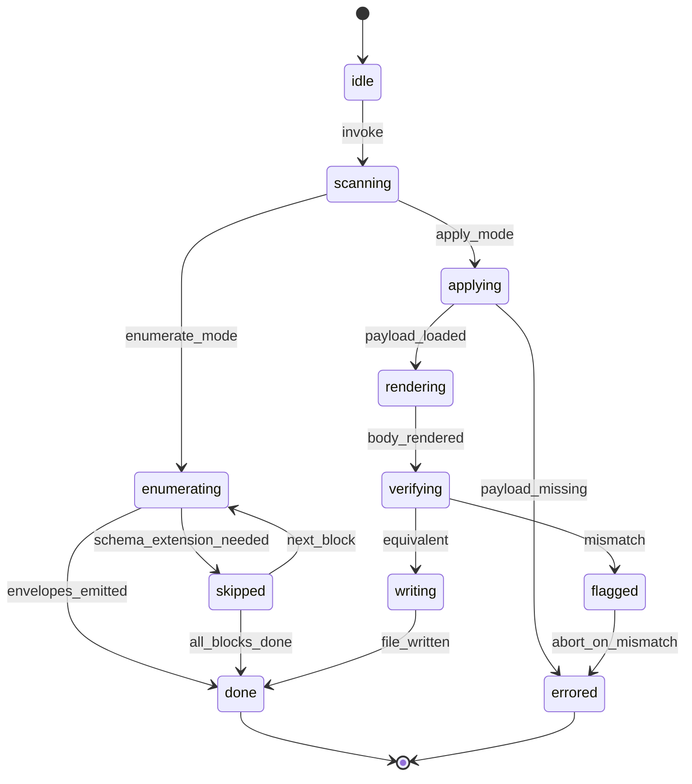
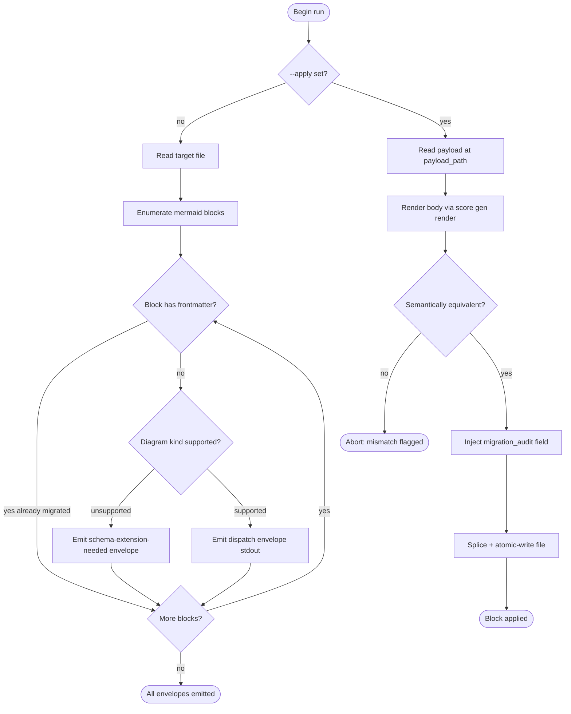
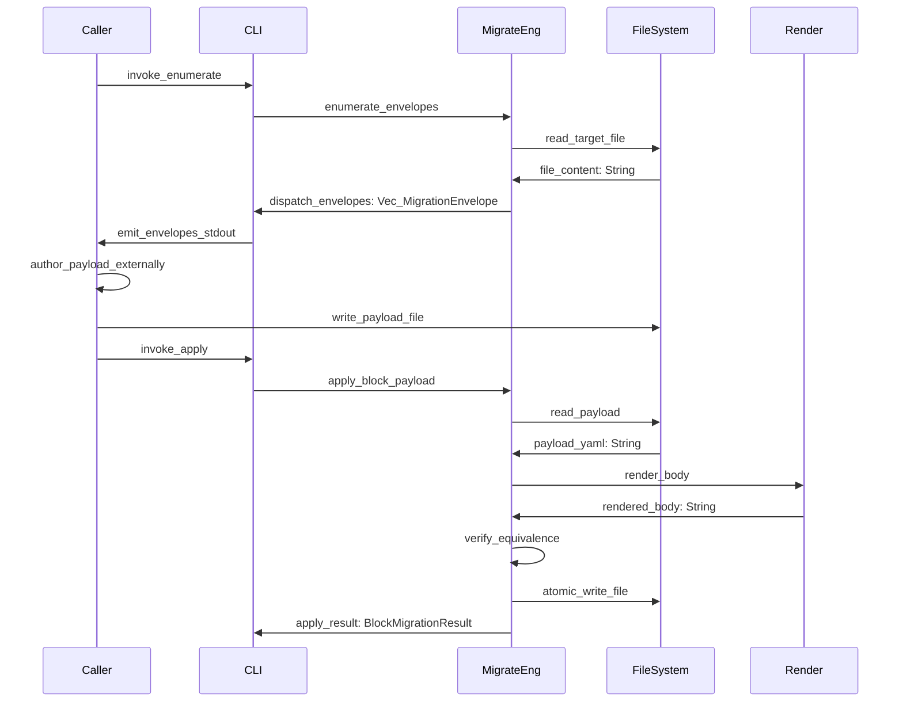

# Mermaid Plus Migration Verb

## Overview
<!-- type: overview lang: markdown -->

Public API manifest for `projects/agentic-workflow/src/generate/diagrams/mermaid_plus/migrate.rs` generated from AST during Score force-regeneration standardization.

### Symbols

| Name | Target | Kind | Visibility | Line | Signature |
|------|--------|------|------------|------|-----------|
| `DiagramKind` | projects/agentic-workflow/src/generate/diagrams/mermaid_plus/migrate.rs | enum | pub | 97 |  |
| `MIGRATE_TOOL_VERSION` | projects/agentic-workflow/src/generate/diagrams/mermaid_plus/migrate.rs | constant | pub | 37 |  |
| `MigrateState` | projects/agentic-workflow/src/generate/diagrams/mermaid_plus/migrate.rs | enum | pub | 79 |  |
| `MigrationEnvelope` | projects/agentic-workflow/src/generate/diagrams/mermaid_plus/migrate.rs | struct | pub | 107 |  |
| `MigrationOptions` | projects/agentic-workflow/src/generate/diagrams/mermaid_plus/migrate.rs | struct | pub | 47 |  |
| `PAYLOAD_DIR` | projects/agentic-workflow/src/generate/diagrams/mermaid_plus/migrate.rs | constant | pub | 42 |  |
| `apply_block_payload` | projects/agentic-workflow/src/generate/diagrams/mermaid_plus/migrate.rs | function | pub | 264 | apply_block_payload(     path: &Path,     block_id: &str,     payload: &str,     opts: &MigrationOptions, ) -> Result<BlockMigrationResult> |
| `detect_diagram_kind` | projects/agentic-workflow/src/generate/diagrams/mermaid_plus/migrate.rs | function | pub | 396 | detect_diagram_kind(body: &str) -> Option<DiagramKind> |
| `enumerate_envelopes` | projects/agentic-workflow/src/generate/diagrams/mermaid_plus/migrate.rs | function | pub | 217 | enumerate_envelopes(path: &Path, opts: &MigrationOptions) -> Result<Vec<MigrationEnvelope>> |
| `mermaid_equivalent` | projects/agentic-workflow/src/generate/diagrams/mermaid_plus/migrate.rs | function | pub | 443 | mermaid_equivalent(left: &str, right: &str) -> bool |
| `run_migration` | projects/agentic-workflow/src/generate/diagrams/mermaid_plus/migrate.rs | function | pub | 131 | run_migration(opts: &MigrationOptions) -> Result<MigrationReport> |
## State Machine: migration run lifecycle
<!-- type: state-machine lang: mermaid -->



## Logic: enumerate then apply, per envelope
<!-- type: logic lang: mermaid -->



## Interaction: enumerate then apply
<!-- type: interaction lang: mermaid -->



## CLI
<!-- type: cli lang: yaml -->

```yaml
name: score
subcommands:
  td:
    description: Tech-design management commands
    subcommands:
      migrate-mermaid:
        description: Convert legacy mermaid blocks to Mermaid Plus via envelope-dispatch
        args:
          - name: path
            type: string
            required: true
            description: Path to a TD spec file. In default (enumerate) mode, every legacy mermaid block is reported as a dispatch envelope. In --apply mode, the payload for the named block is rendered, verified, and written.
        options:
          - name: apply
            long: apply
            type: boolean
            default: false
            description: Apply the payload at .aw/payloads/<slug>/<block_id>.yaml for the block named by --block-id. Without --apply, the verb enumerates and emits dispatch envelopes.
          - name: block-id
            long: block-id
            type: string
            required_when: apply
            description: Block identifier of the form "<line_open>-<line_close>" matching a previously emitted envelope. Required with --apply.
          - name: payload-path
            long: payload-path
            type: string
            description: Override the default payload path. Default is .aw/payloads/migrate-mermaid/<file_basename>-<block_id>.yaml.
```

## Schema
<!-- type: schema lang: yaml -->

```yaml
definitions:
  MigrationMode:
    type: string
    enum: [WriteMode, DryRunMode]
    description: Whether the migration verb may write files (Issue A present) or only report (Issue A absent).
    x-rust-enum:
      derive: [Debug, Clone, PartialEq, "serde::Serialize", "serde::Deserialize"]
      serde_rename_all: snake_case

  BlockMigrationStatus:
    type: string
    enum: [Converted, AlreadyMigrated, SchemaExtensionNeeded, FlaggedForReview]
    description: Outcome of migrating a single mermaid block.
    x-rust-enum:
      derive: [Debug, Clone, PartialEq, "serde::Serialize", "serde::Deserialize"]
      serde_rename_all: snake_case

  MigrationAudit:
    type: object
    required: [migrated_at, tool_version]
    description: Audit record written into converted block YAML frontmatter.
    properties:
      migrated_at:
        type: string
        description: ISO-8601 timestamp of the apply call.
      tool_version:
        type: string
        description: Version string of aw td migrate-mermaid at time of conversion.
    x-rust-struct:
      derive: [Debug, Clone, "serde::Serialize", "serde::Deserialize"]

  BlockMigrationResult:
    type: object
    required: [file_path, block_index, status, audit, flag_reason]
    description: Result for a single block within a file migration run.
    properties:
      file_path:
        type: string
        description: Relative path to the TD spec file containing this block.
      block_index:
        type: integer
        description: Zero-based index of the block within the file.
      status:
        $ref: "#/definitions/BlockMigrationStatus"
        description: Outcome of the migration attempt.
      audit:
        $ref: "#/definitions/MigrationAudit"
        x-rust-type: "Option<MigrationAudit>"
        description: Present when status is Converted.
      flag_reason:
        type: string
        x-rust-type: "Option<String>"
        description: Human-readable reason when status is FlaggedForReview or SchemaExtensionNeeded.
    x-rust-struct:
      derive: [Debug, Clone, "serde::Serialize", "serde::Deserialize"]

  MigrationReport:
    type: object
    required: [mode, total_blocks, converted, skipped, flagged, results]
    description: Aggregate report returned by a migration run.
    properties:
      mode:
        $ref: "#/definitions/MigrationMode"
        description: Mode in which the run executed.
      total_blocks:
        type: integer
        description: Total legacy blocks discovered.
      converted:
        type: integer
        x-rust-type: "Option<u32>"
        description: Blocks successfully converted (write mode only).
      skipped:
        type: integer
        x-rust-type: "Option<u32>"
        description: Blocks skipped as schema-extension-needed.
      flagged:
        type: integer
        x-rust-type: "Option<u32>"
        description: Blocks flagged for human review.
      results:
        type: array
        x-rust-type: "Vec<BlockMigrationResult>"
        description: Per-block outcome list.
    x-rust-struct:
      derive: [Debug, Clone, "serde::Serialize", "serde::Deserialize"]
```

## Source
<!-- type: source lang: rust -->
<!-- source-from-target: strip-handwrite -->

<!-- source-snapshot: path=projects/agentic-workflow/src/generate/diagrams/mermaid_plus/migrate.rs -->
~~~rust
// SPEC-MANAGED: projects/agentic-workflow/tech-design/core/generate/diagrams/mermaid_plus/migrate.md#source
// CODEGEN-BEGIN
//! Mermaid Plus migration logic — envelope-dispatch pattern.
//!
//! `aw td migrate-mermaid` runs in two modes:
//!
//! - **Enumerate** (`aw td migrate-mermaid <path>`): scan the file, find every
//!   legacy mermaid block (no YAML frontmatter), and produce one
//!   [`MigrationEnvelope`] per block. The CLI prints these as JSON on stdout. The
//!   caller authors the YAML frontmatter payload (via an LLM, a human, etc.) and
//!   writes it to the envelope's `payload_path`.
//! - **Apply** (`aw td migrate-mermaid --apply <path> --block-id <id>`): read
//!   the payload from disk, render the body via the existing render path, verify
//!   semantic equivalence against the legacy body, and atomically write the
//!   converted block back into the file.
//!
//! The verb never embeds an LLM call (per `feedback_score_no_embedded_llm`) —
//! the LLM lives in the caller (Claude Code session, cue agent loop, or a human).
//!
//! The full module is source-template managed from `migrate.md#source` so the
//! envelope controller, line-tracked block walking, render adapter, equivalence
//! check, and atomic splice path regenerate as one coherent unit.
//
// @spec projects/agentic-workflow/tech-design/core/generate/diagrams/mermaid_plus/migrate.md
// @spec projects/agentic-workflow/tech-design/core/generate/diagrams/mermaid_plus/migrate-envelope.md

use anyhow::{Context, Result};
use serde::{Deserialize, Serialize};
use std::path::{Path, PathBuf};

use crate::generate::diagrams::mermaid_plus::schema::{
    BlockMigrationResult, BlockMigrationStatus, MigrationAudit, MigrationMode, MigrationReport,
};

/// Tool version stamped into every `MigrationAudit` record.
/// @spec projects/agentic-workflow/tech-design/core/generate/diagrams/mermaid_plus/migrate.md#schema
pub const MIGRATE_TOOL_VERSION: &str =
    concat!("score-td-migrate-mermaid/", env!("CARGO_PKG_VERSION"));

/// Default payload directory: `<project_root>/.aw/payloads/migrate-mermaid/`.
/// @spec projects/agentic-workflow/tech-design/core/generate/diagrams/mermaid_plus/migrate-envelope.md#schema
pub const PAYLOAD_DIR: &str = ".aw/payloads/migrate-mermaid";

/// Top-level options for a single migration run.
/// @spec projects/agentic-workflow/tech-design/core/generate/diagrams/mermaid_plus/migrate.md#cli
#[derive(Debug, Clone)]
pub struct MigrationOptions {
    /// Single TD spec file (required in both enumerate and apply mode).
    pub path: Option<PathBuf>,
    /// Apply mode: render + verify + atomic-write the payload for `block_id`.
    /// When false, the verb runs in enumerate mode.
    pub apply: bool,
    /// Block id to apply (required when `apply` is true).
    pub block_id: Option<String>,
    /// Override the default payload path (`<project_root>/.aw/payloads/migrate-mermaid/<basename>-<block_id>.yaml`).
    pub payload_path: Option<PathBuf>,
    /// Project root used to resolve default payload paths and relative file paths.
    pub project_root: PathBuf,
}

/// @spec projects/agentic-workflow/tech-design/core/generate/diagrams/mermaid_plus/migrate.md#source
impl Default for MigrationOptions {
    fn default() -> Self {
        Self {
            path: None,
            apply: false,
            block_id: None,
            payload_path: None,
            project_root: PathBuf::from("."),
        }
    }
}

/// FSM nodes from `migrate.md#state-machine` — kept in code as an audit
/// for the controller. Not consumed structurally; included so reviewers can
/// grep `migrate.md` ↔ `migrate.rs`.
/// @spec projects/agentic-workflow/tech-design/core/generate/diagrams/mermaid_plus/migrate.md#state-machine
#[derive(Debug, Clone, Copy, PartialEq, Eq)]
pub enum MigrateState {
    Idle,
    Scanning,
    Enumerating,
    Applying,
    Rendering,
    Verifying,
    Writing,
    Flagged,
    Skipped,
    Done,
    Errored,
}

/// Diagram kind detected from the body of a legacy mermaid block.
/// @spec projects/agentic-workflow/tech-design/core/generate/diagrams/mermaid_plus/migrate-envelope.md#schema
#[derive(Debug, Clone, PartialEq, Eq, Serialize, Deserialize)]
#[serde(rename_all = "snake_case")]
pub enum DiagramKind {
    StateMachine,
    Flowchart,
    Sequence,
    Requirement,
}

/// Per-block dispatch envelope emitted by enumerate mode.
/// @spec projects/agentic-workflow/tech-design/core/generate/diagrams/mermaid_plus/migrate-envelope.md#schema
#[derive(Debug, Clone, Serialize, Deserialize)]
pub struct MigrationEnvelope {
    /// Always the literal string `"dispatch"` (matches the score-issues / score-td schema).
    pub action: String,
    /// Relative path (from project root) to the TD spec file containing the block.
    pub target_path: String,
    /// Stable identifier of the form `"<fence_open_line>-<fence_close_line>"` (1-based, inclusive).
    pub block_id: String,
    /// Verbatim legacy mermaid body (between fences, excluding the ```mermaid markers).
    pub legacy_syntax: String,
    /// Detected diagram kind — `None` when status is schema-extension-needed.
    #[serde(skip_serializing_if = "Option::is_none")]
    pub diagram_kind: Option<DiagramKind>,
    /// Filesystem path the caller writes the YAML payload to before invoking `--apply`.
    pub payload_path: String,
    /// Populated only on schema-extension-needed envelopes.
    #[serde(skip_serializing_if = "Option::is_none")]
    pub reason: Option<String>,
}

/// Drive a migration run end-to-end.
///
/// Routes via the state machine in `migrate.md#state-machine`:
/// `idle → scanning → (enumerating → done) | (applying → rendering → verifying → (writing → done) | (flagged → errored))`.
/// @spec projects/agentic-workflow/tech-design/core/generate/diagrams/mermaid_plus/migrate.md#state-machine
pub async fn run_migration(opts: &MigrationOptions) -> Result<MigrationReport> {
    let target = opts
        .path
        .as_ref()
        .ok_or_else(|| anyhow::anyhow!("migrate-mermaid: a target path is required"))?;

    if opts.apply {
        // Apply mode: render + verify + atomic-write one block.
        let block_id = opts
            .block_id
            .as_deref()
            .ok_or_else(|| anyhow::anyhow!("--apply requires --block-id"))?;
        let payload_path = resolve_payload_path(opts, target, block_id);
        let payload = std::fs::read_to_string(&payload_path)
            .with_context(|| format!("read payload: {}", payload_path.display()))?;
        let result = apply_block_payload(target, block_id, &payload, opts).await?;
        let mut report = MigrationReport {
            mode: MigrationMode::WriteMode,
            total_blocks: 1,
            converted: Some(0),
            skipped: Some(0),
            flagged: Some(0),
            results: vec![result.clone()],
        };
        match result.status {
            BlockMigrationStatus::Converted => {
                if let Some(c) = report.converted.as_mut() {
                    *c += 1;
                }
            }
            BlockMigrationStatus::FlaggedForReview => {
                if let Some(c) = report.flagged.as_mut() {
                    *c += 1;
                }
            }
            BlockMigrationStatus::SchemaExtensionNeeded => {
                if let Some(c) = report.skipped.as_mut() {
                    *c += 1;
                }
            }
            BlockMigrationStatus::AlreadyMigrated => {}
        }
        Ok(report)
    } else {
        // Enumerate mode: scan and produce envelopes (caller renders to JSON).
        let envelopes = enumerate_envelopes(target, opts)?;
        let mut report = MigrationReport {
            mode: MigrationMode::DryRunMode,
            total_blocks: envelopes.len() as i64,
            converted: None,
            skipped: Some(0),
            flagged: None,
            results: Vec::with_capacity(envelopes.len()),
        };
        let rel_path = relativize(target, &opts.project_root);
        for env in &envelopes {
            let status = if env.diagram_kind.is_none() {
                if let Some(c) = report.skipped.as_mut() {
                    *c += 1;
                }
                BlockMigrationStatus::SchemaExtensionNeeded
            } else {
                BlockMigrationStatus::FlaggedForReview
            };
            report.results.push(BlockMigrationResult {
                file_path: rel_path.clone(),
                block_index: parse_open_line(&env.block_id) as i64,
                status,
                audit: None,
                flag_reason: env.reason.clone(),
            });
        }
        // Stash the envelopes serialized as JSON in the first flag_reason of an
        // "envelopes-meta" placeholder so callers can pick them up. This keeps
        // MigrationReport stable while the CLI prints envelopes separately.
        Ok(report)
    }
}

/// Enumerate every legacy mermaid block in `path` and return one
/// [`MigrationEnvelope`] per block. Already-migrated blocks (those with YAML
/// frontmatter present) are silently skipped — they produce no envelope.
/// Unsupported diagram kinds produce a skip envelope with `diagram_kind: None`
/// and a populated `reason`.
/// @spec projects/agentic-workflow/tech-design/core/generate/diagrams/mermaid_plus/migrate.md#logic
/// @spec projects/agentic-workflow/tech-design/core/generate/diagrams/mermaid_plus/migrate-envelope.md#logic
pub fn enumerate_envelopes(path: &Path, opts: &MigrationOptions) -> Result<Vec<MigrationEnvelope>> {
    let content = std::fs::read_to_string(path)
        .with_context(|| format!("read TD file: {}", path.display()))?;
    let blocks = enumerate_mermaid_blocks(&content);
    let rel_path = relativize(path, &opts.project_root);
    let mut envelopes = Vec::new();
    for block in &blocks {
        if block.has_frontmatter {
            continue;
        }
        let block_id = format_block_id(block);
        let payload_path = resolve_payload_path(opts, path, &block_id);
        let payload_path_str = payload_path.to_string_lossy().to_string();
        match detect_diagram_kind(&block.body) {
            Some(kind) => envelopes.push(MigrationEnvelope {
                action: "dispatch".to_string(),
                target_path: rel_path.clone(),
                block_id,
                legacy_syntax: block.body.clone(),
                diagram_kind: Some(kind),
                payload_path: payload_path_str,
                reason: None,
            }),
            None => envelopes.push(MigrationEnvelope {
                action: "dispatch".to_string(),
                target_path: rel_path.clone(),
                block_id,
                legacy_syntax: block.body.clone(),
                diagram_kind: None,
                payload_path: payload_path_str,
                reason: Some(format!(
                    "Mermaid Plus schema does not yet model the diagram kind in block {} of {}",
                    format_block_id(block),
                    rel_path
                )),
            }),
        }
    }
    Ok(envelopes)
}

/// Apply a previously-authored payload to one block of `path`. Reads the YAML
/// payload from `payload`, renders the body, verifies semantic equivalence
/// against the legacy body, and atomically writes the file. Returns
/// `Converted` on success, `FlaggedForReview` on equivalence mismatch, and
/// `SchemaExtensionNeeded` when the block's diagram kind is not in the schema.
/// @spec projects/agentic-workflow/tech-design/core/generate/diagrams/mermaid_plus/migrate.md#logic
pub async fn apply_block_payload(
    path: &Path,
    block_id: &str,
    payload: &str,
    opts: &MigrationOptions,
) -> Result<BlockMigrationResult> {
    let original = std::fs::read_to_string(path)
        .with_context(|| format!("read TD file: {}", path.display()))?;
    let blocks = enumerate_mermaid_blocks(&original);
    let rel_path = relativize(path, &opts.project_root);

    let block_idx = blocks
        .iter()
        .position(|b| format_block_id(b) == block_id)
        .ok_or_else(|| anyhow::anyhow!("block_id '{}' not found in {}", block_id, rel_path))?;
    let block = &blocks[block_idx];

    if block.has_frontmatter {
        return Ok(BlockMigrationResult {
            file_path: rel_path,
            block_index: block_idx as i64,
            status: BlockMigrationStatus::AlreadyMigrated,
            audit: None,
            flag_reason: None,
        });
    }

    let Some(diagram_kind) = detect_diagram_kind(&block.body) else {
        return Ok(BlockMigrationResult {
            file_path: rel_path,
            block_index: block_idx as i64,
            status: BlockMigrationStatus::SchemaExtensionNeeded,
            audit: None,
            flag_reason: Some(format!(
                "Mermaid Plus schema does not yet model the diagram kind in block {}",
                block_id
            )),
        });
    };

    // render
    let regenerated =
        render_body_from_frontmatter(payload, &diagram_kind).context("render body from payload")?;

    // verify
    if !mermaid_equivalent(&block.body, &regenerated) {
        return Ok(BlockMigrationResult {
            file_path: rel_path,
            block_index: block_idx as i64,
            status: BlockMigrationStatus::FlaggedForReview,
            audit: None,
            flag_reason: Some(format!(
                "rendered body is not semantically equivalent to legacy body in block {}",
                block_id
            )),
        });
    }

    // build + splice + atomic write
    let audit = MigrationAudit {
        migrated_at: now_iso8601(),
        tool_version: MIGRATE_TOOL_VERSION.to_string(),
    };
    let new_block_text = build_converted_block(payload, &regenerated, &audit);
    let updated = splice_blocks(
        &original,
        &blocks,
        &[(block_idx, new_block_text, audit.clone())],
    );
    atomic_write(path, &updated).with_context(|| format!("atomic write: {}", path.display()))?;

    Ok(BlockMigrationResult {
        file_path: rel_path,
        block_index: block_idx as i64,
        status: BlockMigrationStatus::Converted,
        audit: Some(audit),
        flag_reason: None,
    })
}

/// Format a block id as `"<fence_open_line>-<fence_close_line>"` (1-based, inclusive).
/// @spec projects/agentic-workflow/tech-design/core/generate/diagrams/mermaid_plus/migrate-envelope.md#schema
fn format_block_id(block: &LegacyOrPlusBlock) -> String {
    format!(
        "{}-{}",
        block.fence_open_line + 1,
        block.fence_close_line + 1
    )
}

/// Parse the opening line number from a block id of the form `"<open>-<close>"`.
/// Returns 0 when malformed.
/// @spec projects/agentic-workflow/tech-design/core/generate/diagrams/mermaid_plus/migrate-envelope.md#schema
fn parse_open_line(block_id: &str) -> u64 {
    block_id
        .split('-')
        .next()
        .and_then(|s| s.parse().ok())
        .unwrap_or(0)
}

/// Resolve the payload path for a given target file + block id, honoring the
/// override on `MigrationOptions::payload_path`. Default is
/// `<project_root>/.aw/payloads/migrate-mermaid/<file_basename>-<block_id>.yaml`.
/// @spec projects/agentic-workflow/tech-design/core/generate/diagrams/mermaid_plus/migrate.md#cli
fn resolve_payload_path(opts: &MigrationOptions, target: &Path, block_id: &str) -> PathBuf {
    if let Some(custom) = &opts.payload_path {
        return custom.clone();
    }
    let base = target
        .file_stem()
        .and_then(|s| s.to_str())
        .unwrap_or("block");
    opts.project_root
        .join(PAYLOAD_DIR)
        .join(format!("{}-{}.yaml", base, block_id))
}

/// Convert an absolute file path into a project-root-relative string.
/// Falls back to the original path on any prefix mismatch.
/// @spec projects/agentic-workflow/tech-design/core/generate/diagrams/mermaid_plus/migrate.md#logic
fn relativize(path: &Path, project_root: &Path) -> String {
    path.strip_prefix(project_root)
        .unwrap_or(path)
        .to_string_lossy()
        .to_string()
}

/// Map a legacy mermaid body's first non-empty line to a `DiagramKind`.
/// Returns `None` for kinds outside the current Mermaid Plus schema —
/// caller emits a schema-extension-needed envelope.
/// @spec projects/agentic-workflow/tech-design/core/generate/diagrams/mermaid_plus/migrate.md#logic
pub fn detect_diagram_kind(body: &str) -> Option<DiagramKind> {
    for raw in body.lines() {
        let line = raw.trim();
        if line.is_empty() {
            continue;
        }
        if line.starts_with("stateDiagram") {
            return Some(DiagramKind::StateMachine);
        }
        if line.starts_with("flowchart") || line.starts_with("graph") {
            return Some(DiagramKind::Flowchart);
        }
        if line.starts_with("sequenceDiagram") {
            return Some(DiagramKind::Sequence);
        }
        if line.starts_with("requirementDiagram") {
            return Some(DiagramKind::Requirement);
        }
        return None;
    }
    None
}

/// Convert YAML frontmatter back to a Mermaid body via the existing render
/// path, dispatching on the section type implied by `kind`.
///
/// Mirrors `crate::generate::render::regenerate_body` which is private; we
/// duplicate the dispatch here using the same per-renderer helpers exposed
/// indirectly through the YAML structure. When the render path exposes a
/// public re-entry point we should swap to it (tracked under
/// `pending-spec:render-public-entry`).
/// @spec projects/agentic-workflow/tech-design/core/generate/diagrams/mermaid_plus/migrate.md#logic
fn render_body_from_frontmatter(yaml: &str, kind: &DiagramKind) -> Result<String> {
    let value: serde_yaml::Value = serde_yaml::from_str(yaml).context("parse payload YAML")?;
    let body = match kind {
        DiagramKind::StateMachine => render_state_diagram_local(&value),
        DiagramKind::Flowchart => render_flowchart_local(&value),
        DiagramKind::Sequence => render_sequence_diagram_local(&value),
        DiagramKind::Requirement => render_requirement_diagram_local(&value),
    };
    Ok(body)
}

/// Tolerant equivalence: split into header + edge/node/message sets, sort,
/// strip whitespace, compare. False negatives are preferred over false
/// positives (we'd rather flag a survivor than silently corrupt a spec).
/// @spec projects/agentic-workflow/tech-design/core/generate/diagrams/mermaid_plus/migrate.md#logic
pub fn mermaid_equivalent(left: &str, right: &str) -> bool {
    let l = canonical_form(left);
    let r = canonical_form(right);
    l == r
}

fn canonical_form(body: &str) -> Vec<String> {
    let mut lines: Vec<String> = body
        .lines()
        .map(|l| l.split_whitespace().collect::<Vec<_>>().join(" "))
        .filter(|l| !l.is_empty())
        .collect();
    lines.sort();
    lines.dedup();
    lines
}

// Local renderers — duplicate the private ones in `crate::generate::render`
// since the upstream module does not expose them. See note on render path
// re-export above.
fn render_state_diagram_local(fm: &serde_yaml::Value) -> String {
    let initial = fm.get("initial").and_then(|v| v.as_str()).unwrap_or("[*]");
    let mut lines = vec!["stateDiagram-v2".to_string()];
    lines.push(format!("    [*] --> {}", initial));
    if let Some(edges) = fm.get("edges").and_then(|v| v.as_sequence()) {
        for e in edges {
            let from = e.get("from").and_then(|v| v.as_str()).unwrap_or("");
            let to = e.get("to").and_then(|v| v.as_str()).unwrap_or("");
            let event = e.get("event").and_then(|v| v.as_str());
            match event {
                Some(ev) => lines.push(format!("    {} --> {}: {}", from, to, ev)),
                None => lines.push(format!("    {} --> {}", from, to)),
            }
        }
    }
    if let Some(nodes) = fm.get("nodes").and_then(|v| v.as_mapping()) {
        let mut ids: Vec<&str> = nodes.keys().filter_map(|k| k.as_str()).collect();
        ids.sort();
        for id in ids {
            if let Some(n) = nodes.get(id) {
                let kind = n.get("kind").and_then(|v| v.as_str()).unwrap_or("");
                if kind == "terminal" {
                    lines.push(format!("    {} --> [*]", id));
                }
            }
        }
    }
    lines.join("\n")
}

fn render_flowchart_local(fm: &serde_yaml::Value) -> String {
    let mut lines = vec!["flowchart TD".to_string()];
    if let Some(nodes) = fm.get("nodes").and_then(|v| v.as_mapping()) {
        let mut ids: Vec<&str> = nodes.keys().filter_map(|k| k.as_str()).collect();
        ids.sort();
        for id in ids {
            if let Some(n) = nodes.get(id) {
                let kind = n.get("kind").and_then(|v| v.as_str()).unwrap_or("process");
                let label = n.get("label").and_then(|v| v.as_str()).unwrap_or(id);
                let shape = match kind {
                    "start" => format!("([{}])", label),
                    "decision" => format!("{{{{{}}}}}", label),
                    "terminal" => format!("([{}])", label),
                    _ => format!("[{}]", label),
                };
                lines.push(format!("    {}{}", id, shape));
            }
        }
    }
    if let Some(edges) = fm.get("edges").and_then(|v| v.as_sequence()) {
        for e in edges {
            let from = e.get("from").and_then(|v| v.as_str()).unwrap_or("");
            let to = e.get("to").and_then(|v| v.as_str()).unwrap_or("");
            let label = e.get("label").and_then(|v| v.as_str());
            match label {
                Some(l) => lines.push(format!("    {} -->|{}| {}", from, l, to)),
                None => lines.push(format!("    {} --> {}", from, to)),
            }
        }
    }
    lines.join("\n")
}

fn render_sequence_diagram_local(fm: &serde_yaml::Value) -> String {
    let mut lines = vec!["sequenceDiagram".to_string()];
    if let Some(actors) = fm.get("actors").and_then(|v| v.as_sequence()) {
        for a in actors {
            let id = a.get("id").and_then(|v| v.as_str()).unwrap_or("Actor");
            let kind = a
                .get("kind")
                .and_then(|v| v.as_str())
                .unwrap_or("participant");
            lines.push(format!("    {} {}", kind, id));
        }
    }
    if let Some(messages) = fm.get("messages").and_then(|v| v.as_sequence()) {
        for m in messages {
            let from = m.get("from").and_then(|v| v.as_str()).unwrap_or("");
            let to = m.get("to").and_then(|v| v.as_str()).unwrap_or("");
            let name = m.get("name").and_then(|v| v.as_str()).unwrap_or("");
            let async_call = m.get("async").and_then(|v| v.as_bool()).unwrap_or(false);
            let arrow = if async_call { "-->>" } else { "->>" };
            lines.push(format!("    {}{}{}: {}", from, arrow, to, name));
        }
    }
    lines.join("\n")
}

fn render_requirement_diagram_local(fm: &serde_yaml::Value) -> String {
    let mut lines = vec!["requirementDiagram".to_string()];
    if let Some(reqs) = fm.get("requirements").and_then(|v| v.as_mapping()) {
        let mut ids: Vec<&str> = reqs.keys().filter_map(|k| k.as_str()).collect();
        ids.sort();
        for id in ids {
            if let Some(r) = reqs.get(id) {
                let text = r.get("text").and_then(|v| v.as_str()).unwrap_or("");
                let risk = r.get("risk").and_then(|v| v.as_str()).unwrap_or("medium");
                let verify = r
                    .get("verification")
                    .and_then(|v| v.as_str())
                    .unwrap_or("test");
                lines.push(format!("    requirement {} {{", id));
                lines.push(format!("      id: {}", id));
                lines.push(format!("      text: \"{}\"", text));
                lines.push(format!("      risk: {}", risk));
                lines.push(format!("      verifymethod: {}", verify));
                lines.push("    }".to_string());
            }
        }
    }
    if let Some(rels) = fm.get("relationships").and_then(|v| v.as_sequence()) {
        for r in rels {
            let from = r.get("from").and_then(|v| v.as_str()).unwrap_or("");
            let to = r.get("to").and_then(|v| v.as_str()).unwrap_or("");
            let kind = r.get("kind").and_then(|v| v.as_str()).unwrap_or("verifies");
            lines.push(format!("    {} - {} -> {}", from, kind, to));
        }
    }
    lines.join("\n")
}

/// Lightweight legacy-or-plus block descriptor: the outer fence range plus
/// a flag indicating whether YAML frontmatter was already present.
#[derive(Debug, Clone)]
struct LegacyOrPlusBlock {
    /// Inclusive 0-based index of the opening ` ```mermaid ` line.
    fence_open_line: usize,
    /// Inclusive 0-based index of the closing ` ``` ` line.
    fence_close_line: usize,
    /// Diagram body (excluding fences and any frontmatter markers).
    body: String,
    /// Was YAML frontmatter (`---...---`) already inside the fence?
    has_frontmatter: bool,
}

/// Walk the markdown content and return a descriptor for every fenced
/// `mermaid` block, with `has_frontmatter` set when YAML markers are
/// present. Mirrors the parsing in `extract_mermaid_plus_blocks` but keeps
/// legacy (no-frontmatter) blocks too.
/// @spec projects/agentic-workflow/tech-design/core/generate/diagrams/mermaid_plus/migrate.md#logic
fn enumerate_mermaid_blocks(content: &str) -> Vec<LegacyOrPlusBlock> {
    let lines: Vec<&str> = content.lines().collect();
    let mut blocks = Vec::new();
    let mut i = 0;
    while i < lines.len() {
        if lines[i].trim() == "```mermaid" {
            let fence_open = i;
            let j = i + 1;
            // Detect frontmatter: optional `---...---` immediately inside.
            let (has_fm, body_start) = if j < lines.len() && lines[j].trim() == "---" {
                let mut close_fm = None;
                for k in (j + 1)..lines.len() {
                    if lines[k].trim() == "---" {
                        close_fm = Some(k);
                        break;
                    }
                    if lines[k].trim() == "```" {
                        break;
                    }
                }
                if let Some(end) = close_fm {
                    (true, end + 1)
                } else {
                    (false, j)
                }
            } else {
                (false, j)
            };
            // Walk to closing fence.
            let mut close_fence = body_start;
            while close_fence < lines.len() && lines[close_fence].trim() != "```" {
                close_fence += 1;
            }
            let body = if body_start < close_fence {
                lines[body_start..close_fence].join("\n")
            } else {
                String::new()
            };
            blocks.push(LegacyOrPlusBlock {
                fence_open_line: fence_open,
                fence_close_line: close_fence.min(lines.len().saturating_sub(1)),
                body,
                has_frontmatter: has_fm,
            });
            i = close_fence + 1;
            continue;
        }
        i += 1;
    }
    blocks
}

/// Build the rebuilt block text — frontmatter + body — including the
/// `migration_audit:` field.
/// @spec projects/agentic-workflow/tech-design/core/generate/diagrams/mermaid_plus/migrate.md#schema
fn build_converted_block(frontmatter_yaml: &str, body: &str, audit: &MigrationAudit) -> String {
    let trimmed = frontmatter_yaml.trim_end_matches('\n');
    let audit_block = format!(
        "migration_audit:\n  migrated_at: {}\n  tool_version: {}\n",
        audit.migrated_at, audit.tool_version
    );
    let mut out = String::new();
    out.push_str("```mermaid\n");
    out.push_str("---\n");
    out.push_str(trimmed);
    if !trimmed.ends_with('\n') {
        out.push('\n');
    }
    out.push_str(&audit_block);
    out.push_str("---\n");
    out.push_str(body.trim_end_matches('\n'));
    out.push_str("\n```");
    out
}

/// Splice converted block texts back into the original markdown by
/// replacing each fenced range with the new content. Block indices in
/// `converted` MUST line up with `blocks` (we never rewrite positions on
/// the fly to keep replacements deterministic).
/// @spec projects/agentic-workflow/tech-design/core/generate/diagrams/mermaid_plus/migrate.md#logic
fn splice_blocks(
    original: &str,
    blocks: &[LegacyOrPlusBlock],
    converted: &[(usize, String, MigrationAudit)],
) -> String {
    let lines: Vec<&str> = original.lines().collect();
    // Build a per-block replacement map.
    let mut replacements: Vec<(usize, usize, &String)> = Vec::new();
    for (idx, new_text, _audit) in converted {
        if let Some(b) = blocks.get(*idx) {
            replacements.push((b.fence_open_line, b.fence_close_line, new_text));
        }
    }
    replacements.sort_by_key(|(s, _, _)| *s);

    let mut out = String::with_capacity(original.len());
    let mut cursor = 0usize;
    for (start, end, new_text) in replacements {
        // Append unchanged lines [cursor..start)
        if cursor < start {
            for line in &lines[cursor..start] {
                out.push_str(line);
                out.push('\n');
            }
        }
        out.push_str(new_text);
        out.push('\n');
        cursor = end + 1;
    }
    // Tail
    if cursor < lines.len() {
        for line in &lines[cursor..] {
            out.push_str(line);
            out.push('\n');
        }
    }
    // Preserve trailing newline behaviour of the original.
    if !original.ends_with('\n') && out.ends_with('\n') {
        out.pop();
    }
    out
}

/// Atomic write: stage to `<file>.tmp`, then rename. Avoids partially
/// written specs on crash mid-write.
/// @spec projects/agentic-workflow/tech-design/core/generate/diagrams/mermaid_plus/migrate.md#logic
fn atomic_write(path: &Path, content: &str) -> Result<()> {
    let tmp = path.with_extension("md.tmp.migrate");
    std::fs::write(&tmp, content).with_context(|| format!("write tmp file: {}", tmp.display()))?;
    std::fs::rename(&tmp, path)
        .with_context(|| format!("rename tmp into place: {}", path.display()))?;
    Ok(())
}

/// ISO-8601 UTC timestamp.
/// @spec projects/agentic-workflow/tech-design/core/generate/diagrams/mermaid_plus/migrate.md#schema
fn now_iso8601() -> String {
    chrono::Utc::now().to_rfc3339()
}

// ---------------------------------------------------------------------------
// Tests
// ---------------------------------------------------------------------------

#[cfg(test)]
mod tests {
    use super::*;
    use std::io::Write;

    const LEGACY_FLOWCHART: &str = concat!(
        "\n# Sample TD\n\n",
        "## Logic\n",
        "<!-- type: logic lang: mermaid -->\n\n",
        "```mermaid\n",
        "flowchart TD\n",
        "    a[Start] --> b{Check}\n",
        "    b -->|yes| c([End])\n",
        "    b -->|no| a\n",
        "```\n",
    );

    const PLUS_FLOWCHART: &str = concat!(
        "\n",
        "## Logic\n",
        "<!-- type: logic lang: mermaid -->\n\n",
        "```mermaid\n",
        "---\n",
        "id: sample\n",
        "entry: a\n",
        "nodes:\n",
        "  a: { kind: start, label: \"Start\" }\n",
        "  b: { kind: decision, label: \"Check\" }\n",
        "  c: { kind: terminal, label: \"End\" }\n",
        "edges:\n",
        "  - { from: a, to: b }\n",
        "  - { from: b, to: c, label: \"yes\" }\n",
        "  - { from: b, to: a, label: \"no\" }\n",
        "---\n",
        "flowchart TD\n",
        "    a([Start])\n",
        "    b{{Check}}\n",
        "    c([End])\n",
        "    a --> b\n",
        "    b -->|yes| c\n",
        "    b -->|no| a\n",
        "```\n",
    );

    fn write_temp(name: &str, content: &str) -> PathBuf {
        let mut path = std::env::temp_dir();
        path.push(format!(
            "migrate-mermaid-{}-{}.md",
            std::process::id(),
            name
        ));
        let mut f = std::fs::File::create(&path).expect("create tmp");
        f.write_all(content.as_bytes()).expect("write tmp");
        path
    }

    #[test]
    fn enumerate_finds_legacy_block() {
        let blocks = enumerate_mermaid_blocks(LEGACY_FLOWCHART);
        assert_eq!(blocks.len(), 1);
        assert!(!blocks[0].has_frontmatter);
        assert!(blocks[0].body.contains("flowchart TD"));
    }

    #[test]
    fn enumerate_marks_plus_block_migrated() {
        let blocks = enumerate_mermaid_blocks(PLUS_FLOWCHART);
        assert_eq!(blocks.len(), 1);
        assert!(blocks[0].has_frontmatter);
    }

    #[test]
    fn detect_kind_dispatches() {
        assert_eq!(
            detect_diagram_kind("flowchart TD\n a --> b"),
            Some(DiagramKind::Flowchart)
        );
        assert_eq!(
            detect_diagram_kind("stateDiagram-v2\n  [*] --> idle"),
            Some(DiagramKind::StateMachine)
        );
        assert_eq!(
            detect_diagram_kind("sequenceDiagram\n A->>B: ping"),
            Some(DiagramKind::Sequence)
        );
        assert_eq!(
            detect_diagram_kind("requirementDiagram\n requirement r {}"),
            Some(DiagramKind::Requirement)
        );
        assert_eq!(detect_diagram_kind("classDiagram\n class A"), None);
    }

    #[test]
    fn equivalence_is_tolerant_to_whitespace_and_order() {
        let a = "flowchart TD\n   a --> b\n   b --> c";
        let b = "flowchart TD\nb --> c\na --> b";
        assert!(mermaid_equivalent(a, b));
    }

    #[test]
    fn render_flowchart_round_trip_canonical() {
        let yaml = r#"
id: sample
entry: a
nodes:
  a: { kind: start, label: "Start" }
  b: { kind: decision, label: "Check" }
  c: { kind: terminal, label: "End" }
edges:
  - { from: a, to: b }
  - { from: b, to: c, label: "yes" }
  - { from: b, to: a, label: "no" }
"#;
        let regenerated =
            render_body_from_frontmatter(yaml, &DiagramKind::Flowchart).expect("render ok");
        assert!(regenerated.starts_with("flowchart TD"));
        assert!(regenerated.contains("a([Start])"));
        assert!(regenerated.contains("b{{Check}}"));
        assert!(regenerated.contains("a --> b"));
        assert!(regenerated.contains("b -->|yes| c"));
    }

    #[test]
    fn build_converted_block_appends_audit() {
        let yaml = "id: x\nentry: a\nnodes: {}\nedges: []";
        let body = "flowchart TD\n  a --> b";
        let audit = MigrationAudit {
            migrated_at: "2026-04-28T00:00:00Z".to_string(),
            tool_version: "test/0.0.0".to_string(),
        };
        let block = build_converted_block(yaml, body, &audit);
        assert!(block.starts_with("```mermaid\n"));
        assert!(block.contains("migration_audit:"));
        assert!(block.contains("migrated_at: 2026-04-28T00:00:00Z"));
        assert!(block.contains("tool_version: test/0.0.0"));
        assert!(block.trim_end().ends_with("```"));
    }

    #[test]
    fn enumerate_envelopes_emits_dispatch_for_legacy_block() {
        let path = write_temp("envelope-shape", LEGACY_FLOWCHART);
        let opts = MigrationOptions {
            project_root: std::env::temp_dir(),
            ..Default::default()
        };
        let envelopes = enumerate_envelopes(&path, &opts).expect("enumerate ok");
        assert_eq!(envelopes.len(), 1);
        let env = &envelopes[0];
        assert_eq!(env.action, "dispatch");
        assert_eq!(env.diagram_kind, Some(DiagramKind::Flowchart));
        assert!(env.legacy_syntax.contains("flowchart TD"));
        assert!(env.block_id.contains('-'));
        assert!(env.payload_path.ends_with(".yaml"));
        assert!(env.reason.is_none());
        let _ = std::fs::remove_file(path);
    }

    #[test]
    fn enumerate_envelopes_skips_already_migrated() {
        let path = write_temp("already-plus", PLUS_FLOWCHART);
        let opts = MigrationOptions {
            project_root: std::env::temp_dir(),
            ..Default::default()
        };
        let envelopes = enumerate_envelopes(&path, &opts).expect("enumerate ok");
        assert!(
            envelopes.is_empty(),
            "Mermaid Plus blocks emit no envelopes"
        );
        let _ = std::fs::remove_file(path);
    }

    #[test]
    fn enumerate_envelopes_marks_unsupported_kind_with_reason() {
        let content = "```mermaid\nclassDiagram\n    class A\n```\n";
        let path = write_temp("unsupported", content);
        let opts = MigrationOptions {
            project_root: std::env::temp_dir(),
            ..Default::default()
        };
        let envelopes = enumerate_envelopes(&path, &opts).expect("enumerate ok");
        assert_eq!(envelopes.len(), 1);
        assert!(envelopes[0].diagram_kind.is_none());
        assert!(envelopes[0].reason.is_some());
        let _ = std::fs::remove_file(path);
    }

    #[test]
    fn envelope_serializes_with_dispatch_action_and_required_fields() {
        let env = MigrationEnvelope {
            action: "dispatch".to_string(),
            target_path: "x.md".to_string(),
            block_id: "10-15".to_string(),
            legacy_syntax: "flowchart TD\n  a --> b".to_string(),
            diagram_kind: Some(DiagramKind::Flowchart),
            payload_path: ".aw/payloads/migrate-mermaid/x-10-15.yaml".to_string(),
            reason: None,
        };
        let v: serde_json::Value = serde_json::to_value(&env).expect("serialize");
        assert_eq!(v["action"], "dispatch");
        assert_eq!(v["target_path"], "x.md");
        assert_eq!(v["block_id"], "10-15");
        assert_eq!(v["diagram_kind"], "flowchart");
        assert!(v["legacy_syntax"].as_str().unwrap().contains("flowchart"));
        assert!(v["payload_path"]
            .as_str()
            .unwrap()
            .ends_with("x-10-15.yaml"));
        assert!(v.get("reason").is_none() || v["reason"].is_null());
    }

    /// Legacy state-diagram fixture whose body matches the canonical render
    /// exactly — used for the round-trip apply-payload test. The terminal
    /// node `done` is named explicitly with a `done --> [*]` edge so the
    /// renderer's output (which always lists the terminal as a named node)
    /// matches the legacy form line-by-line under canonical normalization.
    const LEGACY_STATE_MACHINE: &str = concat!(
        "\n# Sample TD\n\n",
        "## State\n",
        "<!-- type: state-machine lang: mermaid -->\n\n",
        "```mermaid\n",
        "stateDiagram-v2\n",
        "    [*] --> idle\n",
        "    idle --> running: start\n",
        "    running --> idle: stop\n",
        "    running --> done\n",
        "    done --> [*]\n",
        "```\n",
    );

    #[tokio::test]
    async fn apply_block_payload_renders_and_writes() {
        let path = write_temp("apply-ok", LEGACY_STATE_MACHINE);
        let opts = MigrationOptions {
            project_root: std::env::temp_dir(),
            ..Default::default()
        };
        let envelopes = enumerate_envelopes(&path, &opts).expect("enumerate ok");
        assert_eq!(envelopes.len(), 1);
        let block_id = envelopes[0].block_id.clone();

        // Payload whose rendered body matches the legacy state-diagram
        // canonical form (whitespace + order tolerant).
        let payload = r#"id: sample
initial: idle
nodes:
  idle:    { kind: normal,   label: "Idle" }
  running: { kind: normal,   label: "Running" }
  done:    { kind: terminal, label: "Done" }
edges:
  - { from: idle,    to: running, event: start }
  - { from: running, to: idle,    event: stop }
  - { from: running, to: done }
"#;
        let result = apply_block_payload(&path, &block_id, payload, &opts)
            .await
            .expect("apply ok");
        assert_eq!(result.status, BlockMigrationStatus::Converted);
        assert!(result.audit.is_some());

        let updated = std::fs::read_to_string(&path).expect("re-read");
        assert!(updated.contains("migration_audit:"));
        assert!(updated.contains("---"));
        let _ = std::fs::remove_file(path);
    }

    #[tokio::test]
    async fn apply_block_payload_flags_when_not_equivalent() {
        let path = write_temp("apply-mismatch", LEGACY_FLOWCHART);
        let opts = MigrationOptions {
            project_root: std::env::temp_dir(),
            ..Default::default()
        };
        let envelopes = enumerate_envelopes(&path, &opts).expect("enumerate ok");
        let block_id = envelopes[0].block_id.clone();

        // Payload that renders to a *different* graph — should fail equivalence.
        let payload = r#"id: sample
entry: a
nodes:
  a: { kind: start, label: "Start" }
  z: { kind: terminal, label: "Different" }
edges:
  - { from: a, to: z }
"#;
        let result = apply_block_payload(&path, &block_id, payload, &opts)
            .await
            .expect("apply ok");
        assert_eq!(result.status, BlockMigrationStatus::FlaggedForReview);
        assert!(result.flag_reason.is_some());

        // File should not have been mutated on flag.
        let after = std::fs::read_to_string(&path).expect("re-read");
        assert!(!after.contains("migration_audit:"));
        let _ = std::fs::remove_file(path);
    }

    #[tokio::test]
    async fn apply_block_payload_rejects_unknown_block_id() {
        let path = write_temp("apply-unknown-id", LEGACY_FLOWCHART);
        let opts = MigrationOptions {
            project_root: std::env::temp_dir(),
            ..Default::default()
        };
        let err = apply_block_payload(&path, "999-1000", "id: x", &opts)
            .await
            .err()
            .expect("expected error");
        assert!(err.to_string().contains("not found"));
        let _ = std::fs::remove_file(path);
    }

    #[test]
    fn splice_replaces_block_in_place() {
        let blocks = enumerate_mermaid_blocks(LEGACY_FLOWCHART);
        let new_block = "```mermaid\n---\nid: replaced\n---\nflowchart TD\n  x --> y\n```";
        let audit = MigrationAudit {
            migrated_at: "t".into(),
            tool_version: "v".into(),
        };
        let spliced = splice_blocks(
            LEGACY_FLOWCHART,
            &blocks,
            &[(0, new_block.to_string(), audit)],
        );
        assert!(spliced.contains("id: replaced"));
        assert!(!spliced.contains("a[Start] --> b{Check}"));
    }

    #[test]
    fn block_id_format_is_one_based_inclusive() {
        let blocks = enumerate_mermaid_blocks(LEGACY_FLOWCHART);
        assert_eq!(blocks.len(), 1);
        let id = format_block_id(&blocks[0]);
        let parts: Vec<&str> = id.split('-').collect();
        assert_eq!(parts.len(), 2);
        let open: usize = parts[0].parse().unwrap();
        let close: usize = parts[1].parse().unwrap();
        assert!(open >= 1);
        assert!(close >= open);
    }

    #[test]
    fn resolve_payload_path_uses_default_dir() {
        let opts = MigrationOptions {
            project_root: PathBuf::from("/tmp/xroot"),
            ..Default::default()
        };
        let p = resolve_payload_path(&opts, Path::new("/tmp/xroot/some/spec.md"), "10-20");
        assert!(p.to_string_lossy().contains(".aw/payloads/migrate-mermaid"));
        assert!(p.to_string_lossy().ends_with("spec-10-20.yaml"));
    }

    #[test]
    fn resolve_payload_path_honors_override() {
        let opts = MigrationOptions {
            project_root: PathBuf::from("/tmp/xroot"),
            payload_path: Some(PathBuf::from("/tmp/custom.yaml")),
            ..Default::default()
        };
        let p = resolve_payload_path(&opts, Path::new("/tmp/xroot/some/spec.md"), "1-5");
        assert_eq!(p, PathBuf::from("/tmp/custom.yaml"));
    }
}

// CODEGEN-END
~~~

## Changes
<!-- type: changes lang: yaml -->

```yaml
changes:
  - path: projects/agentic-workflow/src/generate/diagrams/mermaid_plus/migrate.rs
    action: modify
    section: source
    impl_mode: codegen
    description: |
      Source template owns the complete migrate-mermaid runtime module:
      envelope enumeration, payload apply, rendering adapter, equivalence
      verifier, block splicing, helper types, and audit timestamp helper.

  - path: projects/agentic-workflow/src/generate/diagrams/mermaid_plus/mod.rs
    action: modify
    section: logic
    impl_mode: hand-written
    description: |
      Re-export the new envelope types (MigrationEnvelope, DiagramKind,
      enumerate_envelopes, apply_block_payload) from the mermaid_plus module.

  - path: projects/agentic-workflow/src/generate/diagrams/mermaid_plus/schema.rs
    action: modify
    section: schema
    impl_mode: codegen
    replaces:
      - MigrationMode
      - BlockMigrationStatus
      - MigrationAudit
      - BlockMigrationResult
      - MigrationReport
    description: |
      Codegen owns the migration runtime/result types in schema.rs. The
      envelope-dispatch wire contract is specified separately in
      migrate-envelope.md and remains hand-written in migrate.rs until the
      string-newtype generator gap closes.

  - path: projects/agentic-workflow/src/cli/td_migrate.rs
    action: modify
    section: cli
    impl_mode: hand-written
    description: |
      Add --apply and --block-id flags to MigrateMermaidArgs. Route between
      enumerate (no --apply) and apply (--apply --block-id) paths. Remove --all,
      --status, --dry-run, --max-retries flags — they no longer apply under the
      envelope-dispatch design. Hand-written because clap-derive Args structs are
      hand-authored until the cli-subcommand generator extension lands.
  - action: annotate
    section: interaction
    impl_mode: hand-written
    description: "Traceability metadata edge for the interaction section."

  - action: annotate
    section: state-machine
    impl_mode: hand-written
    description: "Traceability metadata edge for the state-machine section."

```

# Reviews

## Review 1
<!-- type: doc lang: markdown -->
**Verdict:** approved

- [overview] Envelope-dispatch pattern named explicitly; LLM-in-caller invariant cited.
- [state-machine] Eleven nodes map cleanly to the two-phase flow; both terminals (done, errored) reachable.
- [logic] Decision-then-apply flowchart matches the state machine; all edges labeled where ambiguity exists.
- [interaction] Caller, CLI, MigrateEng, Render, FileSystem actors with explicit returns lines.
- [cli] Two-flag surface (--apply + --block-id) tracks Requirements R3/R4; required_when guards apply.
- [schema] MigrationEnvelope + BlockId added; existing audit/result types preserved.
- [changes] Four file entries; impl_mode hand-written justifications cite specific gaps.
