# TDAst-Driven Generator Dispatch (Stage 2)

`projects/agentic-workflow/src/generate/from_td_ast.rs` is the new entry point for the
codegen pipeline. It walks a parsed `TDAst` and routes each `TDSection`
to its registered generator using the section's typed payload — replacing
the legacy per-section-string dispatch in `apply.rs` that re-parsed the
spec body for every generator.

The dispatcher is the single place where generators learn about a spec.
Generators no longer accept raw spec text or raw `serde_yaml::Value`;
they take their typed payload (`JsonSchemaPayload`, `OpenRpcPayload`,
`CliCommandDef`, `MermaidPlusPayload`, etc.) plus a small `DispatchCtx`
carrying the spec path, output sink, and SPEC-REF anchor.

This unblocks Stage 3 (TechStack lowering) by guaranteeing a single
typed AST hand-off; closes the duplicate `CliCommand` parser by reusing
`td_ast::payloads::CliCommandDef` directly; tightens orphan-target
detection by walking typed payloads (Schema definitions, Logic signature
anchors, OpenRPC method names) instead of substring scanning.

## Overview
<!-- type: overview lang: markdown -->

Public API manifest for `projects/agentic-workflow/src/generate/from_td_ast.rs` generated from AST during Score force-regeneration standardization.

### Symbols

| Name | Target | Kind | Visibility | Line | Signature |
|------|--------|------|------------|------|-----------|
| `DispatchCtx` | projects/agentic-workflow/src/generate/from_td_ast.rs | struct | pub | 14 |  |
| `DispatchOutcome` | projects/agentic-workflow/src/generate/from_td_ast.rs | struct | pub | 27 |  |
| `DispatchReport` | projects/agentic-workflow/src/generate/from_td_ast.rs | struct | pub | 42 |  |
| `DispatchStatus` | projects/agentic-workflow/src/generate/from_td_ast.rs | enum | pub | 54 |  |
| `DispatchStrategy` | projects/agentic-workflow/src/generate/from_td_ast.rs | enum | pub | 68 |  |
| `DispatchMaturity` | projects/agentic-workflow/src/generate/from_td_ast.rs | enum | pub | 91 |  |
| `GeneratorInput` | projects/agentic-workflow/src/generate/from_td_ast.rs | struct | pub | 123 |  |
| `dispatch_from_tdast` | projects/agentic-workflow/src/generate/from_td_ast.rs | function | pub | 82 | dispatch_from_tdast(td_ast: &TDAst, _ctx: &DispatchCtx) -> DispatchReport |
| `enter` | projects/agentic-workflow/src/generate/from_td_ast.rs | function | pub | 217 | enter() -> std::result::Result<(), Box<dyn std::error::Error>> |
## Schema
<!-- type: schema lang: yaml -->

```yaml
$schema: "https://json-schema.org/draft/2020-12/schema"
$id: sdd-generate-from-td-ast#schema
title: TDAst Dispatch Type Definitions
description: >
  Type declarations for the TDAst-driven dispatcher in
  projects/agentic-workflow/src/generate/from_td_ast.rs.

definitions:
  DispatchCtx:
    type: object
    $id: DispatchCtx
    required: [spec_path, spec_ref_prefix]
    description: |
      Context passed to every generator. Holds the source spec path (for
      SPEC-REF anchoring) and the workspace target language hint.
    properties:
      spec_path:
        type: string
        x-rust-type: "std::path::PathBuf"
        description: "Absolute path of the source TD spec."
      spec_ref_prefix:
        type: string
        description: "Prefix used when forming SPEC-REF anchors (e.g. relative spec path)."
      target_lang:
        type: string
        x-rust-type: "Option<String>"
        x-serde-default: true
        x-serde-skip-if: "Option::is_none"
        description: "Workspace-selected target language (rs / py / ts / css). None defaults to rs."
    x-rust-struct:
      derive: [Debug, Clone]

  DispatchOutcome:
    type: object
    $id: DispatchOutcome
    required: [section_type, generator, status, strategy, maturity, source_backed]
    description: |
      Per-section dispatch result. Aggregated into [`DispatchReport`] so the
      `apply.rs` pipeline can decide whether to write file changes.
    properties:
      section_type:
        type: string
        description: "Canonical SectionType name (e.g. schema, cli, logic)."
      generator:
        type: string
        description: "Generator id that handled the section (e.g. rust-schema, cli-subcommand)."
      status:
        type: string
        x-rust-type: "DispatchStatus"
        description: "Emitted | Skipped | NoGenerator | LegacyFallback | Failed."
      strategy:
        type: string
        x-rust-type: "DispatchStrategy"
        x-serde-default: true
        description: "Codegen route selected for this typed section."
      maturity:
        type: string
        x-rust-type: "DispatchMaturity"
        x-serde-default: true
        description: "Maturity band for reporting mixed codegen coverage."
      source_backed:
        type: boolean
        x-rust-type: "bool"
        x-serde-default: true
        description: "True when this route is backed by source replay rather than AST emission."
      gap_id:
        type: string
        x-rust-type: "Option<String>"
        x-serde-default: true
        x-serde-skip-if: "Option::is_none"
        description: "Stable generator gap id for unsupported typed shapes."
      message:
        type: string
        x-rust-type: "Option<String>"
        x-serde-default: true
        x-serde-skip-if: "Option::is_none"
    x-rust-struct:
      derive: [Debug, Clone, Serialize, Deserialize]

  DispatchStatus:
    type: string
    $id: DispatchStatus
    description: |
      Discriminator for [`DispatchOutcome::status`]. `LegacyFallback` means
      the dispatcher routed through the legacy per-section-string path
      because the typed generator is not yet wired (Stage 2B follow-up).
    enum: [emitted, skipped, no_generator, legacy_fallback, failed]
    x-rust-enum:
      derive: [Debug, Clone, Copy, Serialize, Deserialize, PartialEq, Eq]
      rename_all: snake_case

  DispatchStrategy:
    type: string
    $id: DispatchStrategy
    description: "High-level route chosen after TD AST parsing."
    enum: [typed_generator, source_replay, structural_scaffold, handwrite_gap, none]
    x-rust-enum:
      derive: [Debug, Clone, Copy, Serialize, Deserialize, PartialEq, Eq]
      rename_all: snake_case
      default: none
    x-trait-impls:
      - trait: Default
        impl_mode: codegen
        body: |
          Self::None

  DispatchMaturity:
    type: string
    $id: DispatchMaturity
    description: "Mixed codegen maturity band used by dispatch and health reports."
    enum: [semantic_generator, structural_generator, source_replay, artifact_replay, handwrite_gap, none]
    x-rust-enum:
      derive: [Debug, Clone, Copy, Serialize, Deserialize, PartialEq, Eq]
      rename_all: snake_case
      default: none
    x-trait-impls:
      - trait: Default
        impl_mode: codegen
        body: |
          Self::None

  DispatchReport:
    type: object
    $id: DispatchReport
    required: [outcomes]
    description: |
      Aggregated dispatcher result for one TD spec. Carries one
      [`DispatchOutcome`] per visited section.
    properties:
      outcomes:
        type: array
        items:
          $ref: "#/definitions/DispatchOutcome"
        x-rust-type: "Vec<DispatchOutcome>"
      orphan_changes_paths:
        type: array
        items:
          type: string
        x-rust-type: "Vec<String>"
        x-serde-default: true
        description: "Paths in Changes section that no other typed payload references (R4)."
    x-rust-struct:
      derive: [Debug, Clone, Default, Serialize, Deserialize]
```

## Logic

```mermaid
---
id: dispatch-from-tdast
entry: start
nodes:
  start:           { kind: start,    label: "dispatch_from_tdast(td_ast, ctx)" }
  init_report:     { kind: process,  label: "Initialize empty DispatchReport" }
  iter_section:    { kind: process,  label: "Take next TDSection from td_ast.sections" }
  has_more:        { kind: decision, label: "More sections?" }
  match_kind:      { kind: decision, label: "section.body kind" }
  schema_branch:   { kind: process,  label: "rust_schema::emit_typed(payload, ctx) (R2)" }
  cli_branch:      { kind: process,  label: "cli_subcommand::emit_typed(payload, ctx) (R2, R3)" }
  rpc_branch:      { kind: process,  label: "rust_schema::emit_rpc_components(payload, ctx)" }
  logic_branch:    { kind: process,  label: "logic_emitter::emit_typed(payload, ctx) (R2)" }
  rust_source_branch: { kind: process, label: "rust-source-unit structural generator route" }
  facade_branch:   { kind: process,  label: "module_facade::emit_typed(payload, ctx) (R2)" }
  trait_branch:    { kind: process,  label: "trait_impl::emit_typed(payload, ctx) (R2)" }
  legacy_branch:   { kind: process,  label: "Mark LegacyFallback; defer to apply.rs path" }
  record_outcome:  { kind: process,  label: "Append DispatchOutcome to report" }
  walk_orphans:    { kind: process,  label: "validate_td::check_orphan_changes_targets(td_ast) (R4)" }
  done:            { kind: terminal, label: "Return DispatchReport" }
edges:
  - { from: start,           to: init_report }
  - { from: init_report,     to: has_more }
  - { from: has_more,        to: match_kind,       label: "yes" }
  - { from: has_more,        to: walk_orphans,     label: "no" }
  - { from: match_kind,      to: schema_branch,    label: "JsonSchema" }
  - { from: match_kind,      to: cli_branch,       label: "CliManifest" }
  - { from: match_kind,      to: rpc_branch,       label: "OpenRpc" }
  - { from: match_kind,      to: logic_branch,     label: "MermaidPlus(logic)" }
  - { from: match_kind,      to: rust_source_branch, label: "RustSourceUnit" }
  - { from: match_kind,      to: facade_branch,    label: "Changes(exports)" }
  - { from: match_kind,      to: trait_branch,     label: "Schema(x-trait-impls)" }
  - { from: match_kind,      to: legacy_branch,    label: "other" }
  - { from: schema_branch,   to: record_outcome }
  - { from: cli_branch,      to: record_outcome }
  - { from: rpc_branch,      to: record_outcome }
  - { from: logic_branch,    to: record_outcome }
  - { from: rust_source_branch, to: record_outcome }
  - { from: facade_branch,   to: record_outcome }
  - { from: trait_branch,    to: record_outcome }
  - { from: legacy_branch,   to: record_outcome }
  - { from: record_outcome,  to: iter_section }
  - { from: iter_section,    to: has_more }
  - { from: walk_orphans,    to: done }
---
flowchart TD
    start([dispatch_from_tdast td_ast ctx]) --> init_report[Initialize empty DispatchReport]
    init_report --> has_more{More sections?}
    has_more -->|no| walk_orphans[validate_td check_orphan_changes_targets td_ast]
    has_more -->|yes| match_kind{section.body kind}
    match_kind -->|JsonSchema| schema_branch[rust_schema emit_typed payload ctx]
    match_kind -->|CliManifest| cli_branch[cli_subcommand emit_typed payload ctx]
    match_kind -->|OpenRpc| rpc_branch[rust_schema emit_rpc_components payload ctx]
    match_kind -->|MermaidPlus logic| logic_branch[logic_emitter emit_typed payload ctx]
    match_kind -->|RustSourceUnit| rust_source_branch[rust-source-unit structural generator route]
    match_kind -->|Changes exports| facade_branch[module_facade emit_typed payload ctx]
    match_kind -->|Schema x-trait-impls| trait_branch[trait_impl emit_typed payload ctx]
    match_kind -->|other| legacy_branch[Mark LegacyFallback defer to apply.rs]
    schema_branch --> record_outcome[Append DispatchOutcome to report]
    cli_branch --> record_outcome
    rpc_branch --> record_outcome
    logic_branch --> record_outcome
    rust_source_branch --> record_outcome
    facade_branch --> record_outcome
    trait_branch --> record_outcome
    legacy_branch --> record_outcome
    record_outcome --> iter_section[Take next TDSection]
    iter_section --> has_more
    walk_orphans --> done([Return DispatchReport])
```

<!-- type: logic lang: mermaid -->



## Tests
<!-- type: tests lang: yaml -->

```yaml
file_preamble: |
  //! Integration test (R7): parse a multi-section TD spec, dispatch through
  //! `TDAst`, and assert the dispatcher classifies each section.
  //!
  //! @spec projects/agentic-workflow/tech-design/core/generate/from-td-ast.md#logic
preamble: |
  use agentic_workflow::generate::from_td_ast::{dispatch_from_tdast, DispatchCtx, DispatchStatus};
  use agentic_workflow::td_ast::parse::parse_td;

  fn fixture_spec() -> String {
      r#"---
  id: stage2-dispatch-fixture
  fill_sections: [schema, changes]
  ---

  # Fixture for Stage 2 dispatch

  ## Schema
  <!-- type: schema lang: yaml -->

  ```yaml
  $schema: "https://json-schema.org/draft/2020-12/schema"
  $id: stage2-dispatch-fixture#schema
  title: Fixture
  definitions:
    Foo:
      type: object
      properties:
        name: { type: string }
  ```

  ## Changes
  <!-- type: changes lang: yaml -->

  ```yaml
  $id: stage2-dispatch-fixture#changes
  changes:
    - path: projects/agentic-workflow/src/foo.rs
      action: create
      impl_mode: codegen
      description: "Foo emitter."
  ```
  "#
      .to_string()
  }
tests:
  - name: dispatch_classifies_each_section
    body: |
      let tmpdir = tempfile::tempdir().expect("tempdir");
      let spec_path = tmpdir.path().join("fixture.md");
      std::fs::write(&spec_path, fixture_spec()).expect("write fixture");

      let td_ast = parse_td(&spec_path).expect("parse_td");
      assert_eq!(td_ast.sections.len(), 2, "fixture has 2 sections");

      let ctx = DispatchCtx {
          spec_path: spec_path.clone(),
          spec_ref_prefix: spec_path.display().to_string(),
          target_lang: None,
      };

      let report = dispatch_from_tdast(&td_ast, &ctx);
      assert_eq!(report.outcomes.len(), 2, "one DispatchOutcome per section");

      // Schema -> rust-schema typed generator.
      let schema_outcome = report
          .outcomes
          .iter()
          .find(|o| o.section_type == "schema")
          .expect("schema outcome");
      assert_eq!(schema_outcome.generator, "rust-schema");
      assert_eq!(schema_outcome.status, DispatchStatus::Emitted);
  - name: empty_spec_yields_empty_report
    body: |
      let tmpdir = tempfile::tempdir().expect("tempdir");
      let spec_path = tmpdir.path().join("empty.md");
      std::fs::write(
          &spec_path,
          "---\nid: empty\nfill_sections: []\n---\n\n# Empty\n",
      )
      .expect("write empty");

      let td_ast = parse_td(&spec_path).expect("parse_td empty");
      let ctx = DispatchCtx {
          spec_path: spec_path.clone(),
          spec_ref_prefix: spec_path.display().to_string(),
          target_lang: None,
      };
      let report = dispatch_from_tdast(&td_ast, &ctx);
      assert!(report.outcomes.is_empty());
      assert!(report.orphan_changes_paths.is_empty());
```

## Source
<!-- type: source lang: rust -->

```rust
use crate::models::spec_rules::SectionType;
use crate::td_ast::types::{TDAst, TDSection, TypedBody};

/// Typed generator input contract shared by AST-first emitters.
///
/// Source replay is still handled by the CB/apply layer because `source` is not
/// a first-class `SectionType`; this contract is for typed TD sections only.
///
/// @spec projects/agentic-workflow/tech-design/core/generate/from-td-ast.md#schema
pub struct GeneratorInput<'a> {
    pub ctx: &'a DispatchCtx,
    pub section: &'a TDSection,
    pub body: &'a TypedBody,
    pub strategy: DispatchStrategy,
}

/// Dispatch every section of a parsed TDAst to its registered generator.
///
/// This is the new Stage 2 entry point that consumes typed payloads from
/// `td_ast::payloads` instead of re-parsing raw spec text. Generators that
/// have not yet been migrated to typed input are recorded as
/// [`DispatchStatus::LegacyFallback`] so `apply.rs` can route them through
/// the legacy substring dispatch.
///
/// @spec projects/agentic-workflow/tech-design/core/generate/from-td-ast.md#logic
pub fn dispatch_from_tdast(td_ast: &TDAst, _ctx: &DispatchCtx) -> DispatchReport {
    let mut report = DispatchReport::default();

    for section in &td_ast.sections {
        let outcome = classify_section(section);
        report.outcomes.push(outcome);
    }

    report.orphan_changes_paths = collect_orphan_changes_paths(td_ast);
    report
}

/// Map a single `TDSection` to a [`DispatchOutcome`] without invoking the
/// per-section generators yet. Stage 2 wires the dispatch table; Stage 2B
/// migrations attach the actual `emit_typed` call sites.
///
/// @spec projects/agentic-workflow/tech-design/core/generate/from-td-ast.md#logic
fn classify_section(section: &TDSection) -> DispatchOutcome {
    let section_type = format!("{:?}", section.section_type).to_ascii_lowercase();

    let (generator, status, strategy, maturity, gap_id, message) =
        match (&section.body, section.section_type) {
            (TypedBody::JsonSchema(_), SectionType::Schema) => {
                typed_generator("rust-schema", DispatchMaturity::SemanticGenerator)
            }
            (TypedBody::JsonSchema(_), SectionType::Changes) => structural_scaffold(
                "changes-manifest",
                "typed changes manifest ready for apply.rs target routing",
            ),
            (TypedBody::CliManifest(_), _) => structural_scaffold(
                "cli-subcommand",
                "typed CLI manifest ready for subcommand generation",
            ),
            (TypedBody::ConfigManifest(_), _) => structural_scaffold(
                "rust-config",
                "typed config manifest ready for config generation",
            ),
            (TypedBody::OpenRpc(_), _) => {
                typed_generator("rust-schema", DispatchMaturity::SemanticGenerator)
            }
            (TypedBody::MermaidPlus(_), SectionType::Logic) => {
                typed_generator("rust-logic-emitter", DispatchMaturity::SemanticGenerator)
            }
            (TypedBody::RustSourceUnit(_), SectionType::RustSourceUnit) => structural_scaffold(
                "rust-source-unit",
                "typed Rust source-unit item tree ready for lossless source regeneration",
            ),
            (TypedBody::Placeholder, _) => (
                "none",
                DispatchStatus::Skipped,
                DispatchStrategy::None,
                DispatchMaturity::None,
                None,
                Some("placeholder section has no generator input".to_string()),
            ),
            (TypedBody::Markdown(_), SectionType::Overview | SectionType::Doc) => (
                "none",
                DispatchStatus::Skipped,
                DispatchStrategy::None,
                DispatchMaturity::None,
                None,
                Some("prose section has no generator input".to_string()),
            ),
            (TypedBody::Unsupported(_), _) => {
                handwrite_gap(section.section_type, "unsupported typed payload shape")
            }
            _ => handwrite_gap(section.section_type, "no typed generator registered"),
        };

    DispatchOutcome {
        section_type,
        generator: generator.to_string(),
        status,
        strategy,
        maturity,
        source_backed: matches!(
            maturity,
            DispatchMaturity::SourceReplay | DispatchMaturity::ArtifactReplay
        ),
        gap_id,
        message,
    }
}

/// @spec projects/agentic-workflow/tech-design/core/generate/from-td-ast.md#logic
fn typed_generator(
    generator: &'static str,
    maturity: DispatchMaturity,
) -> (
    &'static str,
    DispatchStatus,
    DispatchStrategy,
    DispatchMaturity,
    Option<String>,
    Option<String>,
) {
    (
        generator,
        DispatchStatus::Emitted,
        DispatchStrategy::TypedGenerator,
        maturity,
        None,
        Some("typed generator input ready; apply.rs owns writeback".to_string()),
    )
}

/// @spec projects/agentic-workflow/tech-design/core/generate/from-td-ast.md#logic
fn structural_scaffold(
    generator: &'static str,
    message: &'static str,
) -> (
    &'static str,
    DispatchStatus,
    DispatchStrategy,
    DispatchMaturity,
    Option<String>,
    Option<String>,
) {
    (
        generator,
        DispatchStatus::Emitted,
        DispatchStrategy::StructuralScaffold,
        DispatchMaturity::StructuralGenerator,
        None,
        Some(message.to_string()),
    )
}

/// @spec projects/agentic-workflow/tech-design/core/generate/from-td-ast.md#logic
fn handwrite_gap(
    section_type: SectionType,
    reason: &'static str,
) -> (
    &'static str,
    DispatchStatus,
    DispatchStrategy,
    DispatchMaturity,
    Option<String>,
    Option<String>,
) {
    let section_name = section_type.as_str();
    (
        "none",
        DispatchStatus::NoGenerator,
        DispatchStrategy::HandwriteGap,
        DispatchMaturity::HandwriteGap,
        Some(format!("typed-generator:{section_name}")),
        Some(reason.to_string()),
    )
}

/// Walk the typed payloads of every section and collect paths in
/// `Changes.path` that no other typed payload references. Replaces the
/// substring heuristic in `validate_td::check_orphan_changes_targets`
/// (R4) — Stage 2B will graduate this into the validator proper.
///
/// @spec projects/agentic-workflow/tech-design/core/generate/from-td-ast.md#logic
fn collect_orphan_changes_paths(td_ast: &TDAst) -> Vec<String> {
    use std::collections::BTreeSet;

    let mut changes_paths: Vec<String> = Vec::new();
    let mut referenced: BTreeSet<String> = BTreeSet::new();

    for section in &td_ast.sections {
        match (&section.body, section.section_type) {
            (TypedBody::JsonSchema(p), SectionType::Changes) => {
                if let Some(arr) = p.extra.get("changes").and_then(|v| v.as_sequence()) {
                    for entry in arr {
                        if let Some(path) = entry.get("path").and_then(|v| v.as_str()) {
                            changes_paths.push(path.to_string());
                        }
                    }
                }
            }
            (TypedBody::JsonSchema(p), _) => {
                for name in p.definitions.keys() {
                    referenced.insert(name.clone());
                }
                for name in p.defs.keys() {
                    referenced.insert(name.clone());
                }
            }
            (TypedBody::OpenRpc(p), _) => {
                for m in &p.methods {
                    referenced.insert(m.name.clone());
                }
            }
            (TypedBody::CliManifest(p), _) => {
                for c in &p.commands {
                    referenced.insert(c.name.clone());
                }
            }
            _ => {}
        }
    }

    changes_paths
        .into_iter()
        .filter(|path| {
            // A changes path is orphan if no typed payload elsewhere mentions it.
            !referenced.iter().any(|sym| path.contains(sym))
        })
        .collect()
}

#[cfg(test)]
mod tests {
    use super::*;

    fn section(section_type: SectionType, body: TypedBody) -> TDSection {
        TDSection {
            section_type,
            lang: "yaml".to_string(),
            body,
            line_start: 1,
            line_end: 2,
            content_hash: None,
        }
    }

    #[test]
    fn dispatch_report_default_is_empty() {
        let r = DispatchReport::default();
        assert!(r.outcomes.is_empty());
        assert!(r.orphan_changes_paths.is_empty());
    }

    #[test]
    fn dispatch_status_round_trips_via_json() {
        let s = DispatchStatus::LegacyFallback;
        let j = serde_json::to_string(&s).unwrap();
        assert_eq!(j, "\"legacy_fallback\"");
        let back: DispatchStatus = serde_json::from_str(&j).unwrap();
        assert_eq!(back, DispatchStatus::LegacyFallback);
    }

    #[test]
    fn empty_tdast_yields_empty_report() {
        let td = TDAst {
            frontmatter: serde_yaml::Value::Null,
            sections: Vec::new(),
        };
        let ctx = DispatchCtx {
            spec_path: std::path::PathBuf::from("/dev/null"),
            spec_ref_prefix: String::new(),
            target_lang: None,
        };
        let report = dispatch_from_tdast(&td, &ctx);
        assert!(report.outcomes.is_empty());
        assert!(report.orphan_changes_paths.is_empty());
    }

    #[test]
    fn schema_and_cli_sections_route_to_mixed_typed_strategies() {
        let td = TDAst {
            frontmatter: serde_yaml::Value::Null,
            sections: vec![
                section(
                    SectionType::Schema,
                    TypedBody::JsonSchema(crate::td_ast::payloads::JsonSchemaPayload::default()),
                ),
                section(
                    SectionType::Cli,
                    TypedBody::CliManifest(crate::td_ast::payloads::CliManifestPayload::default()),
                ),
            ],
        };
        let ctx = DispatchCtx {
            spec_path: std::path::PathBuf::from("demo.md"),
            spec_ref_prefix: "demo.md".to_string(),
            target_lang: Some("rs".to_string()),
        };
        let report = dispatch_from_tdast(&td, &ctx);

        assert_eq!(report.outcomes.len(), 2);
        assert_eq!(report.outcomes[0].status, DispatchStatus::Emitted);
        assert_eq!(
            report.outcomes[0].strategy,
            DispatchStrategy::TypedGenerator
        );
        assert_eq!(
            report.outcomes[0].maturity,
            DispatchMaturity::SemanticGenerator
        );
        assert_eq!(report.outcomes[1].status, DispatchStatus::Emitted);
        assert_eq!(
            report.outcomes[1].strategy,
            DispatchStrategy::StructuralScaffold
        );
        assert_eq!(
            report.outcomes[1].maturity,
            DispatchMaturity::StructuralGenerator
        );
    }

    #[test]
    fn unsupported_typed_section_reports_stable_handwrite_gap() {
        let td = TDAst {
            frontmatter: serde_yaml::Value::Null,
            sections: vec![section(
                SectionType::RestApi,
                TypedBody::Unsupported("raw".to_string()),
            )],
        };
        let ctx = DispatchCtx {
            spec_path: std::path::PathBuf::from("demo.md"),
            spec_ref_prefix: "demo.md".to_string(),
            target_lang: Some("rs".to_string()),
        };
        let report = dispatch_from_tdast(&td, &ctx);

        let outcome = &report.outcomes[0];
        assert_eq!(outcome.status, DispatchStatus::NoGenerator);
        assert_eq!(outcome.strategy, DispatchStrategy::HandwriteGap);
        assert_eq!(outcome.maturity, DispatchMaturity::HandwriteGap);
        assert_eq!(outcome.gap_id.as_deref(), Some("typed-generator:rest-api"));
    }

    #[test]
    fn rust_source_unit_dispatch_routes_as_structural_generator() {
        let td = TDAst {
            frontmatter: serde_yaml::Value::Null,
            sections: vec![section(
                SectionType::RustSourceUnit,
                TypedBody::RustSourceUnit(
                    crate::generate::rust_source_unit::parse("pub fn demo() {}")
                        .expect("rust source parses"),
                ),
            )],
        };
        let ctx = DispatchCtx {
            spec_path: std::path::PathBuf::from("demo.md"),
            spec_ref_prefix: "demo.md".to_string(),
            target_lang: Some("rs".to_string()),
        };

        let report = dispatch_from_tdast(&td, &ctx);
        let outcome = &report.outcomes[0];
        assert_eq!(outcome.status, DispatchStatus::Emitted);
        assert_eq!(outcome.generator, "rust-source-unit");
        assert_eq!(outcome.strategy, DispatchStrategy::StructuralScaffold);
        assert_eq!(outcome.maturity, DispatchMaturity::StructuralGenerator);
        assert!(!outcome.source_backed);
        assert!(outcome.gap_id.is_none());
    }
}
```

## Changes
<!-- type: changes lang: yaml -->

```yaml
$id: sdd-generate-from-td-ast#changes
description: >
  Stage 2 file change list: introduce dispatch_from_tdast plus typed
  generator entry points, switch apply.rs primary path, retire duplicate
  CliCommand parser, tighten orphan-target check, replace Stage 1B
  HANDWRITE trackers.

changes:
  - path: projects/agentic-workflow/src/generate/from_td_ast.rs
    action: modify
    section: schema
    impl_mode: codegen
    spec: from-td-ast.md
    description: "Schema section owns DispatchCtx, DispatchOutcome, DispatchReport, DispatchStatus, and related shared dispatcher data types."

  - path: projects/agentic-workflow/src/generate/from_td_ast.rs
    action: modify
    section: source
    impl_mode: codegen
    spec: from-td-ast.md
    replaces:
      - "<handwrite-gap:missing-generator:logic-emitter-branched-flowcharts>"
      - "<handwrite-gap:generate-from-td-ast-tests>"
    description: "Source template owns dispatcher logic, orphan path collection, and unit tests; the schema section keeps owning shared dispatch data types."

  - path: projects/agentic-workflow/src/generate/mod.rs
    action: update
    section: source
    impl_mode: hand-written
    description: "Re-export from_td_ast::dispatch_from_tdast as the codegen entry point."

  - path: projects/agentic-workflow/src/generate/apply.rs
    action: update
    section: source
    impl_mode: hand-written
    spec: apply.md
    description: "Replace the per-section-string dispatch with a single call to dispatch_from_tdast(td_ast, ctx). Delete legacy substring dispatch once all migrated generators land (R5). Backwards-compat shim returns LegacyFallback for unmigrated section types."

  - path: projects/agentic-workflow/src/generate/gen/rust/schema.rs
    action: update
    section: source
    impl_mode: hand-written
    spec: rust/schema.md
    description: "Add emit_typed(payload: &JsonSchemaPayload, ctx: &DispatchCtx) entry point. Internally reuses existing struct/enum emitters but consumes typed payload definitions instead of re-parsing YAML (R2)."

  - path: projects/agentic-workflow/src/generate/generators/cli_subcommand.rs
    action: update
    section: source
    impl_mode: hand-written
    spec: generators/cli-subcommand.md
    description: "Delete duplicate CliCommand struct. Replace internal type with td_ast::payloads::CliCommandDef. Add emit_typed(cmd: &CliCommandDef, ctx) entry. Adjust callers (R3)."

  - path: projects/agentic-workflow/src/generate/generators/module_facade.rs
    action: update
    section: source
    impl_mode: hand-written
    spec: generators/module-facade.md
    description: "Add emit_typed(spec: &ModuleFacadeSpec, ctx) entry. Spec input now extracted from TDAst Changes typed payload (R2)."

  - path: projects/agentic-workflow/src/generate/generators/trait_impl.rs
    action: update
    section: source
    impl_mode: hand-written
    spec: generators/trait_impl.md
    description: "Add emit_typed(payload: &JsonSchemaPayload, ctx) — walks payload.definitions[].x-trait-impls extra map (R2)."

  - path: projects/agentic-workflow/src/generate/gen/rust/logic_emitter.rs
    action: update
    section: source
    impl_mode: hand-written
    spec: rust/logic-emitter.md
    description: "Add emit_typed(payload: &MermaidPlusPayload, ctx) entry. Consumes parsed Mermaid Plus frontmatter from TDAst (R2)."

  - path: projects/agentic-workflow/src/td_ast/validate.rs
    action: update
    section: source
    impl_mode: hand-written
    spec: validate/td_ast/validate.md
    description: "Replace check_orphan_changes_targets substring fallback with typed cross-section walk: visit JsonSchemaPayload.definitions, OpenRpcPayload.methods, OpenApiPayload.paths, AsyncApiPayload.channels, CliManifestPayload.commands, ConfigManifestPayload.keys, MermaidPlusPayload signature anchors (R4)."

  - path: projects/agentic-workflow/src/td_ast/payloads.rs
    action: update
    section: schema
    impl_mode: hand-written
    description: "Optional: add MermaidPlusPayloadKind discriminator (StateMachine | Flowchart | Sequence | Class | ERD | Requirement | Mindmap) so consumers walk mermaid bodies precisely."

  - path: projects/agentic-workflow/tests/from_td_ast_dispatch.rs
    action: create
    section: tests
    impl_mode: codegen
    description: "New integration test (R7): parse a multi-section TD, dispatch through TDAst, assert byte-equivalent output vs. legacy per-section pipeline (golden snapshot)."

  - path: projects/agentic-workflow/src/td_ast/payloads.rs
    action: update
    section: source
    impl_mode: hand-written
    description: "Update HANDWRITE-BEGIN trackers in td_ast/, generate/generators/, generate/gen/ to point at this issue's slug, replacing Stage 1B trackers where the gap is now resolved (R8)."
  - action: annotate
    section: logic
    impl_mode: hand-written
    description: "Traceability metadata edge for the logic section."

```

# Reviews

## Review 1
<!-- type: review lang: markdown -->

**Verdict:** approved

- [schema] DispatchCtx, DispatchOutcome, DispatchStatus, DispatchReport are well-typed and codegen-ready; status enum covers the full lifecycle including LegacyFallback for the Stage 2B path.
- [logic] dispatch_from_tdast flowchart pivots on TypedBody kind, routes each variant to its registered emit_typed entry, and walks orphan changes as a terminal step — matches the requirements R1, R4, R5.
- [changes] 13 file-level changes cover the new dispatcher, the four migrated generators, the cli_subcommand unification, the orphan-target tightening, the new integration test, and the bench harness; HANDWRITE tracker update is explicitly listed.
