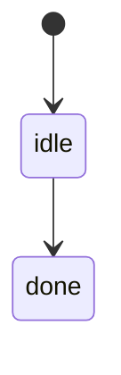
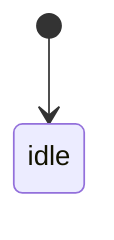
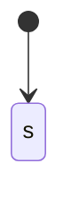

# MermaidPlusBlock Type

## Overview
<!-- type: overview lang: markdown -->

Public API manifest for `projects/agentic-workflow/src/generate/frontmatter.rs` generated from AST during Score force-regeneration standardization.

### Symbols

| Name | Target | Kind | Visibility | Line | Signature |
|------|--------|------|------------|------|-----------|
| `MermaidPlusBlock` | projects/agentic-workflow/src/generate/frontmatter.rs | struct | pub | 32 |  |
| `extract_mermaid_plus_blocks` | projects/agentic-workflow/src/generate/frontmatter.rs | function | pub | 51 | extract_mermaid_plus_blocks(content: &str) -> Vec<MermaidPlusBlock> |
| `parse_mermaid_block` | projects/agentic-workflow/src/generate/frontmatter.rs | function | pub | 142 | parse_mermaid_block(block_content: &str) -> Option<(Value, String)> |
| `parse_section_type_annotation` | projects/agentic-workflow/src/generate/frontmatter.rs | function | pub | 133 | parse_section_type_annotation(comment: &str) -> Option<String> |
## Schema
<!-- type: schema lang: yaml -->

```yaml
definitions:
  MermaidPlusBlock:
    type: object
    required: [frontmatter, frontmatter_raw, body, section_heading, section_type]
    description: |
      Result of parsing a Mermaid Plus block.
    properties:
      frontmatter:
        type: object
        x-rust-type: "Value"
        description: "Parsed YAML frontmatter value."
      frontmatter_raw:
        type: string
        description: "The raw YAML string between the `---` markers."
      body:
        type: string
        description: "The Mermaid diagram body (after the closing `---`)."
      section_heading:
        type: string
        x-rust-type: "Option<String>"
        description: "Section heading above the code fence (e.g. \"State Machine\")."
      section_type:
        type: string
        x-rust-type: "Option<String>"
        description: "Section type annotation (e.g. \"state-machine\")."
    x-rust-struct:
      derive: [Debug, Clone]
```

## Source
<!-- type: source lang: rust -->
<!-- source-from-target: strip-managed-markers -->

<!-- source-snapshot: path=projects/agentic-workflow/src/generate/frontmatter.rs -->
~~~rust
// SPEC-MANAGED: projects/agentic-workflow/tech-design/core/generate/frontmatter.md#source
// CODEGEN-BEGIN
//! YAML frontmatter extractor from Mermaid Plus code fences.
//!
//! Mermaid Plus blocks store structured YAML between `---` markers inside
//! the mermaid code fence, followed by the Mermaid diagram body. Example
//! (using `~~~` as the outer fence to escape the inner triple-backticks):
//!
//! ```text
//! ~~~mermaid
//! ---
//! id: my-diagram
//! title: My Diagram
//! nodes:
//!   state_a: { kind: normal }
//! ---
//! stateDiagram-v2
//!     [*] --> state_a
//! ~~~
//! ```
//!
//! This module extracts the YAML frontmatter and the Mermaid diagram body
//! from a spec file's raw markdown content.

// @spec projects/agentic-workflow/tech-design/core/generate/frontmatter.md#source

use serde_yaml::Value;

/// Result of parsing a Mermaid Plus block.
/// @spec projects/agentic-workflow/tech-design/core/generate/frontmatter.md#schema
#[derive(Debug, Clone)]
pub struct MermaidPlusBlock {
    /// Parsed YAML frontmatter value.
    pub frontmatter: Value,
    /// The raw YAML string between the `---` markers.
    pub frontmatter_raw: String,
    /// The Mermaid diagram body (after the closing `---`).
    pub body: String,
    /// Section heading above the code fence (e.g. "State Machine").
    pub section_heading: Option<String>,
    /// Section type annotation (e.g. "state-machine").
    pub section_type: Option<String>,
}
/// Extract all Mermaid Plus blocks from a spec file's markdown content.
///
/// A Mermaid Plus block starts with ` ```mermaid `, has a YAML frontmatter
/// section between `---` markers, and is followed by the Mermaid diagram body.
///
/// Returns all blocks found in the document, in order.
// @spec projects/agentic-workflow/tech-design/core/generate/frontmatter.md#source
pub fn extract_mermaid_plus_blocks(content: &str) -> Vec<MermaidPlusBlock> {
    let mut blocks = Vec::new();
    let mut last_heading: Option<String> = None;
    let mut last_section_type: Option<String> = None;

    let lines: Vec<&str> = content.lines().collect();
    let mut i = 0;

    while i < lines.len() {
        let line = lines[i].trim();

        // Track section headings (## Heading)
        if line.starts_with("## ") {
            last_heading = Some(line.trim_start_matches('#').trim().to_string());
            last_section_type = None;
        }
        // Track section type annotations (legacy and attr-style).
        if crate::models::section::parse_section_annotation_parts(line).is_some() {
            last_section_type = parse_section_type_annotation(line);
        }

        // Look for mermaid code fence
        if line == "```mermaid" {
            i += 1;
            // Check for YAML frontmatter (starts with `---`)
            if i < lines.len() && lines[i].trim() == "---" {
                let fm_start = i + 1;
                // Find closing `---`
                let mut fm_end = None;
                for j in fm_start..lines.len() {
                    if lines[j].trim() == "---" {
                        fm_end = Some(j);
                        break;
                    }
                    // Stop if we hit closing fence
                    if lines[j].trim() == "```" {
                        break;
                    }
                }

                if let Some(end) = fm_end {
                    let fm_raw = lines[fm_start..end].join("\n");
                    let body_start = end + 1;

                    // Collect body lines until closing ```
                    let mut body_lines = Vec::new();
                    let mut body_end = body_start;
                    let mut j = body_start;
                    while j < lines.len() {
                        if lines[j].trim() == "```" {
                            body_end = j;
                            break;
                        }
                        body_lines.push(lines[j]);
                        j += 1;
                    }

                    if let Ok(fm) = serde_yaml::from_str::<Value>(&fm_raw) {
                        blocks.push(MermaidPlusBlock {
                            frontmatter: fm,
                            frontmatter_raw: fm_raw,
                            body: body_lines.join("\n"),
                            section_heading: last_heading.clone(),
                            section_type: last_section_type.clone(),
                        });
                        i = body_end + 1;
                        continue;
                    }
                }
            }
        }

        i += 1;
    }

    blocks
}

/// Extract the section type from an annotation comment.
///
/// From `<!-- type: state-machine lang: mermaid -->`, extracts `"state-machine"`.
/// @spec projects/agentic-workflow/tech-design/core/generate/frontmatter.md#source
pub fn parse_section_type_annotation(comment: &str) -> Option<String> {
    crate::models::section::parse_section_annotation_parts(comment).map(|raw| raw.section_type)
}

/// Extract YAML frontmatter and Mermaid body from a single code block string.
///
/// Input: raw string starting after ` ```mermaid ` line.
/// Returns `Some((yaml_value, mermaid_body))` if frontmatter is present.
/// @spec projects/agentic-workflow/tech-design/core/generate/frontmatter.md#source
pub fn parse_mermaid_block(block_content: &str) -> Option<(Value, String)> {
    let lines: Vec<&str> = block_content.lines().collect();
    if lines.is_empty() || lines[0].trim() != "---" {
        return None;
    }

    let mut fm_end = None;
    for (i, line) in lines.iter().enumerate().skip(1) {
        if line.trim() == "---" {
            fm_end = Some(i);
            break;
        }
    }

    let end = fm_end?;
    let fm_raw = lines[1..end].join("\n");
    let body = lines[end + 1..].join("\n");

    let fm = serde_yaml::from_str::<Value>(&fm_raw).ok()?;
    Some((fm, body))
}

// ---------------------------------------------------------------------------
// Tests
// ---------------------------------------------------------------------------

#[cfg(test)]
mod tests {
    use super::*;

    #[test]
    fn test_extract_simple_block() {
        let content = r#"
## State Machine
<!-- type: state-machine lang: mermaid -->


"#;
        let blocks = extract_mermaid_plus_blocks(content);
        assert_eq!(blocks.len(), 1);
        let block = &blocks[0];
        assert_eq!(
            block.frontmatter.get("id").and_then(|v| v.as_str()),
            Some("my-sm")
        );
        assert!(block.body.contains("stateDiagram-v2"));
        assert_eq!(block.section_type.as_deref(), Some("state-machine"));
    }

    #[test]
    fn test_no_frontmatter_block_skipped() {
        let content = r#"

"#;
        let blocks = extract_mermaid_plus_blocks(content);
        assert_eq!(blocks.len(), 0);
    }

    #[test]
    fn test_multiple_blocks() {
        let content = r#"



"#;
        let blocks = extract_mermaid_plus_blocks(content);
        assert_eq!(blocks.len(), 2);
        assert_eq!(
            blocks[0].frontmatter.get("id").and_then(|v| v.as_str()),
            Some("first")
        );
        assert_eq!(
            blocks[1].frontmatter.get("id").and_then(|v| v.as_str()),
            Some("second")
        );
    }

    #[test]
    fn test_parse_section_type_annotation() {
        let t = parse_section_type_annotation("<!-- type: state-machine lang: mermaid -->");
        assert_eq!(t.as_deref(), Some("state-machine"));
    }

    #[test]
    fn test_parse_attr_style_section_type_annotation() {
        let t = parse_section_type_annotation(
            r#"<!-- score-section type="wireframe" lang="yaml" workspace="studio" -->"#,
        );
        assert_eq!(t.as_deref(), Some("wireframe"));
    }

    #[test]
    fn test_parse_mermaid_block() {
        let block = "---\nid: my-id\ntitle: Test\n---\nflowchart LR\n    A --> B";
        let result = parse_mermaid_block(block);
        assert!(result.is_some());
        let (fm, body) = result.unwrap();
        assert_eq!(fm.get("id").and_then(|v| v.as_str()), Some("my-id"));
        assert!(body.contains("flowchart LR"));
    }
}

// CODEGEN-END
~~~

## Changes
<!-- type: changes lang: yaml -->

```yaml
changes:
  - path: projects/agentic-workflow/src/generate/frontmatter.rs
    action: modify
    section: source
    impl_mode: codegen
    description: |
      Source template owns the complete Mermaid Plus frontmatter extraction module.
  - action: annotate
    section: schema
    impl_mode: hand-written
    description: "Traceability metadata edge for the schema section."

  - action: annotate
    section: state-machine
    impl_mode: hand-written
    description: "Traceability metadata edge for the state-machine section."

```

# Reviews

## Review 1
<!-- type: doc lang: markdown -->
**Verdict:** approved

- [overview] Single struct; foreign type + Options.
- [schema] All fields in `required:`; Value + Option<String> via x-rust-type.
- [changes] Standard split.
