# Logic Generator — Cycle Detection and Loop Emission

## Overview
<!-- type: overview lang: markdown -->

The logic generator in `projects/agentic-workflow/src/generate/gen/rust/logic.rs`
translates Mermaid Plus flowchart YAML into Rust function bodies via
recursive `emit_node` calls. The current implementation uses `MAX_DEPTH=20`
as the sole cycle guard: when a flowchart contains a cycle (e.g. the
`next_line → listen_read_line` back-edge in the chat-jsonl-migration listen
branch), recursion hits the depth cap and emits `// (max nesting depth
reached)` instead of a well-formed Rust loop. This is the remaining half of
the `#flowchart-to-fn` HANDWRITE-BEGIN gap; the process-node side was closed
in commit `b210af680`.

This spec adds DFS visiting-set cycle detection to `emit_node` and introduces
two loop emission forms:

- Generic `loop { ... break; }` — used when a cycle entry node has no
  `loop_kind` annotation.
- `for <loop_var> in <iter> { ... }` — used when the cycle entry node
  carries `loop_kind: for_each` with non-empty `iter` and `loop_var`.

Three additive optional fields (`loop_kind`, `iter`, `loop_var`) are added
to `FlowNode` with `#[serde(default)]`; existing specs deserialise unchanged.
When `loop_kind == "for_each"` is set but `iter` or `loop_var` is absent or
empty, the generator falls back to generic `loop` form and prepends a
documenting comment — no panic, no `compile_error!()` emission.

The `MAX_DEPTH` constant is retained as a defensive guard against pathological
inputs but is no longer the primary cycle-handling mechanism for well-formed
cyclic graphs.
## Schema: FlowNode Loop Annotations
<!-- type: schema lang: yaml -->

```yaml
$schema: "https://json-schema.org/draft/2020-12/schema"
$id: sdd-logic-cycle-detection#schema
title: FlowNode Loop Annotation Fields
description: >
  Three additive optional fields on FlowNode (defined in
  projects/agentic-workflow/src/generate/diagrams/content/logic.rs) that control
  loop emission in the logic generator. All fields carry
  #[serde(default)] so existing specs deserialise unchanged.
  When loop_kind is absent or null the generator falls back to
  generic loop { ... break; } form for any detected cycle entry node.
definitions:
  LoopKind:
    type: string
    description: >
      Discriminant for the loop form to emit when the node is a
      cycle-entry point (i.e. at least one back-edge points back to it
      during DFS traversal). Absent or null means generic loop { }.
    enum:
      - for_each
    x-rust-enum:
      derive: [Debug, Clone, PartialEq, Serialize, Deserialize]
      serde_rename_all: snake_case
      variants:
        - { name: ForEach, doc: "Emit for <loop_var> in <iter> { ... } form." }

  FlowNodeLoopAnnotation:
    type: object
    description: >
      Additive fields merged into the existing FlowNode struct (see
      sdd-content-logic#schema). These fields are all optional with
      #[serde(default)] and are ignored on non-cycle-entry nodes.
    required: []
    properties:
      loop_kind:
        $ref: "#/definitions/LoopKind"
        description: >
          When present on a cycle-entry node, selects the loop form.
          Recognised values: "for_each". Absent or null → generic loop { }.
        x-serde-default: true
        x-serde-skip-if: "Option::is_none"
      iter:
        type: string
        description: >
          Rust expression for the iterator in a for_each loop.
          Example: "reader.lines()". Required when loop_kind == "for_each".
          Ignored for other loop_kind values. When loop_kind == "for_each"
          but iter is None or empty, the generator falls back to generic
          loop form and prepends a documenting comment (R11).
        x-serde-default: true
        x-serde-skip-if: "Option::is_none"
      loop_var:
        type: string
        description: >
          Rust identifier bound to each iteration value in a for_each loop.
          Example: "line". Required when loop_kind == "for_each".
          Ignored for other loop_kind values. When loop_kind == "for_each"
          but loop_var is None or empty, the generator falls back to generic
          loop form and prepends a documenting comment (R11).
        x-serde-default: true
        x-serde-skip-if: "Option::is_none"

  CycleDetectionPolicy:
    type: object
    description: >
      Policy constants governing the DFS visiting-set cycle detection
      algorithm in emit_node. Not a runtime config — documented here as
      a schema record for the generator's invariant contract.
    properties:
      max_depth:
        type: integer
        description: >
          Retained defensive depth cap (MAX_DEPTH = 20). Fires only for
          pathological inputs that evade cycle detection. Well-formed cyclic
          graphs are caught by the DFS visiting-set before this limit.
        default: 20
      back_edge_action_generic_loop:
        type: string
        description: >
          Action emitted on a back-edge whose target is already in the
          visiting set, when the cycle-entry node uses generic loop form.
          Emits continue; to advance the loop iteration.
        enum: [continue_stmt]
        default: continue_stmt
      back_edge_action_for_each:
        type: string
        description: >
          Action taken on a back-edge whose target is already in the visiting
          set, when the cycle-entry node uses for_each form. The for-loop
          iterator advances naturally — no explicit continue is emitted.
        enum: [silent_noop]
        default: silent_noop
      exit_edge_action:
        type: string
        description: >
          Action emitted on a cycle-exit edge whose target is outside the
          current visiting set (i.e. the SCC has been fully traversed).
          Emits break; followed by recursion into the target.
        enum: [break_then_recurse]
        default: break_then_recurse
      malformed_for_each_fallback:
        type: string
        description: >
          When loop_kind == "for_each" but iter or loop_var is None or empty,
          the generator MUST NOT panic and MUST NOT emit compile_error!().
          Emits the fallback comment then the generic loop { ... break; } body.
        enum: [comment_then_generic_loop]
        default: comment_then_generic_loop
```
## Logic: emit_node cycle detection

```mermaid
---
id: emit-node-cycle-detection
entry: start
nodes:
  start:
    kind: start
    label: "emit_node(node_id, depth, visiting)"
  check_depth:
    kind: decision
    label: "depth >= MAX_DEPTH?"
  emit_depth_comment:
    kind: terminal
    label: "emit depth-exceeded comment"
  insert_visiting:
    kind: process
    label: "visiting.insert(node_id)"
  lookup_node:
    kind: process
    label: "node = nodes[node_id]"
  is_cycle_entry:
    kind: decision
    label: "any outgoing edge.to in visiting?"
  check_loop_kind:
    kind: decision
    label: "node.loop_kind == for_each?"
  check_for_each_fields:
    kind: decision
    label: "iter and loop_var non-empty?"
  emit_fallback_comment:
    kind: process
    label: "emit: fallback comment (R11)"
  emit_generic_loop_open:
    kind: process
    label: "emit: loop {"
  emit_for_each_open:
    kind: process
    label: "emit: for loop_var in iter {"
  emit_node_body:
    kind: process
    label: "emit node label or fn_name body"
  check_edge_in_visiting:
    kind: decision
    label: "edge.to in visiting? (back-edge)"
  check_for_each_context:
    kind: decision
    label: "inside for_each loop form?"
  emit_continue:
    kind: process
    label: "emit: continue;"
  noop_back_edge:
    kind: process
    label: "silent no-op (for_each back-edge)"
  check_is_exit_edge:
    kind: decision
    label: "inside loop body?"
  emit_break_recurse:
    kind: process
    label: "emit: break; then recurse(edge.to)"
  recurse_forward:
    kind: process
    label: "recurse(edge.to, depth+1, visiting)"
  emit_loop_close:
    kind: process
    label: "emit: } (close loop or for)"
  remove_visiting:
    kind: process
    label: "visiting.remove(node_id)"
  done:
    kind: terminal
    label: "return emitted block"
edges:
  - from: start
    to: check_depth
  - from: check_depth
    to: emit_depth_comment
    label: "yes"
  - from: check_depth
    to: insert_visiting
    label: "no"
  - from: insert_visiting
    to: lookup_node
  - from: lookup_node
    to: is_cycle_entry
  - from: is_cycle_entry
    to: emit_node_body
    label: "no"
  - from: is_cycle_entry
    to: check_loop_kind
    label: "yes"
  - from: check_loop_kind
    to: check_for_each_fields
    label: "for_each"
  - from: check_loop_kind
    to: emit_generic_loop_open
    label: "absent/null"
  - from: check_for_each_fields
    to: emit_for_each_open
    label: "yes"
  - from: check_for_each_fields
    to: emit_fallback_comment
    label: "no"
  - from: emit_fallback_comment
    to: emit_generic_loop_open
  - from: emit_generic_loop_open
    to: emit_node_body
  - from: emit_for_each_open
    to: emit_node_body
  - from: emit_node_body
    to: check_edge_in_visiting
  - from: check_edge_in_visiting
    to: check_for_each_context
    label: "yes"
  - from: check_edge_in_visiting
    to: check_is_exit_edge
    label: "no"
  - from: check_for_each_context
    to: emit_continue
    label: "no"
  - from: check_for_each_context
    to: noop_back_edge
    label: "yes"
  - from: emit_continue
    to: emit_loop_close
  - from: noop_back_edge
    to: emit_loop_close
  - from: check_is_exit_edge
    to: emit_break_recurse
    label: "yes"
  - from: check_is_exit_edge
    to: recurse_forward
    label: "no"
  - from: emit_break_recurse
    to: emit_loop_close
  - from: recurse_forward
    to: emit_loop_close
  - from: emit_loop_close
    to: remove_visiting
  - from: remove_visiting
    to: done
---
flowchart TD
    start([emit_node node_id depth visiting]) --> check_depth{depth >= MAX_DEPTH?}
    check_depth -->|yes| emit_depth_comment([emit depth comment])
    check_depth -->|no| insert_visiting[visiting.insert node_id]
    insert_visiting --> lookup_node[lookup node]
    lookup_node --> is_cycle_entry{any edge.to in visiting?}
    is_cycle_entry -->|no| emit_node_body[emit node body]
    is_cycle_entry -->|yes| check_loop_kind{loop_kind == for_each?}
    check_loop_kind -->|for_each| check_for_each_fields{iter and loop_var non-empty?}
    check_loop_kind -->|absent/null| emit_generic_loop_open[emit: loop open]
    check_for_each_fields -->|yes| emit_for_each_open[emit: for loop_var in iter]
    check_for_each_fields -->|no| emit_fallback_comment[emit: fallback comment R11]
    emit_fallback_comment --> emit_generic_loop_open
    emit_generic_loop_open --> emit_node_body
    emit_for_each_open --> emit_node_body
    emit_node_body --> check_edge_in_visiting{edge.to in visiting?}
    check_edge_in_visiting -->|yes| check_for_each_context{inside for_each?}
    check_edge_in_visiting -->|no| check_is_exit_edge{inside loop body?}
    check_for_each_context -->|no| emit_continue[emit: continue]
    check_for_each_context -->|yes| noop_back_edge[silent no-op]
    emit_continue --> emit_loop_close[emit: close brace]
    noop_back_edge --> emit_loop_close
    check_is_exit_edge -->|yes| emit_break_recurse[emit: break then recurse]
    check_is_exit_edge -->|no| recurse_forward[recurse forward]
    emit_break_recurse --> emit_loop_close
    recurse_forward --> emit_loop_close
    emit_loop_close --> remove_visiting[visiting.remove node_id]
    remove_visiting --> done([return emitted block])
```

<!-- type: logic lang: mermaid -->


## Tests
<!-- type: tests lang: yaml -->

```yaml
tests:
  - id: test_emit_node_self_loop_emits_loop_form
    description: >
      Single-node cycle (node has outgoing edge to itself) must emit
      loop { ... break; } form. The self-edge is the back-edge; no other
      outgoing edges exist so break; is emitted for the cycle-exit case
      when the loop body finishes.
    target: projects/agentic-workflow/src/generate/gen/rust/logic.rs
    setup:
      - build_logic_content_with_self_loop_node
    assertions:
      - emitted_output_contains: "loop {"
      - emitted_output_contains: "break;"
      - emitted_output_not_contains: "// (max nesting depth reached)"

  - id: test_emit_node_two_node_cycle_emits_loop_form
    description: >
      Two-node cycle A → B → A with a third terminal node C reachable
      via cycle-exit from B. Must emit loop { <A body> <B body> break; }
      followed by C body outside the loop.
    target: projects/agentic-workflow/src/generate/gen/rust/logic.rs
    setup:
      - build_logic_content_two_node_cycle
    assertions:
      - emitted_output_contains: "loop {"
      - emitted_output_contains: "break;"
      - emitted_output_not_contains: "// (max nesting depth reached)"

  - id: test_emit_node_for_each_cycle_emits_for_loop
    description: >
      Cycle entry node has loop_kind: for_each, iter: "reader.lines()",
      loop_var: "line". Must emit for line in reader.lines() { ... }.
      Must not emit loop { or continue;.
    target: projects/agentic-workflow/src/generate/gen/rust/logic.rs
    setup:
      - build_logic_content_for_each_cycle
    assertions:
      - emitted_output_contains: "for line in reader.lines() {"
      - emitted_output_not_contains: "loop {"
      - emitted_output_not_contains: "continue;"

  - id: test_emit_node_cycle_exit_emits_break
    description: >
      Cycle-exit edge (edge whose target is outside the current visiting
      set, reached from inside a loop body) must emit break; before
      recursing into the target node.
    target: projects/agentic-workflow/src/generate/gen/rust/logic.rs
    setup:
      - build_logic_content_cycle_with_exit_edge
    assertions:
      - emitted_output_contains: "break;"
      - emitted_output_sequence: ["loop {", "break;"]

  - id: test_emit_node_non_cyclic_unchanged
    description: >
      Regression guard. A non-cyclic flowchart (linear A → B → C) must
      emit byte-identical output before and after the cycle detection
      change. No loop { or break; or continue; should appear.
    target: projects/agentic-workflow/src/generate/gen/rust/logic.rs
    setup:
      - build_logic_content_linear_acyclic
    assertions:
      - emitted_output_not_contains: "loop {"
      - emitted_output_not_contains: "break;"
      - emitted_output_not_contains: "continue;"
      - emitted_output_not_contains: "// (max nesting depth reached)"

  - id: test_emit_node_for_each_malformed_falls_back_to_generic_loop
    description: >
      When loop_kind == "for_each" but iter is None (or loop_var is None),
      the generator MUST NOT panic. It must emit the documenting comment
      followed by generic loop { ... break; } form (R11).
    target: projects/agentic-workflow/src/generate/gen/rust/logic.rs
    setup:
      - build_logic_content_for_each_missing_iter
    assertions:
      - emitted_output_contains: "// (loop_kind=for_each but iter/loop_var missing"
      - emitted_output_contains: "loop {"
      - emitted_output_not_contains: "compile_error!"
```
## Changes
<!-- type: changes lang: yaml -->

```yaml
changes:
  - path: projects/agentic-workflow/src/generate/diagrams/content/logic.rs
    action: modify
    section: logic
    impl_mode: hand-written
    description: |
      Add three optional fields to the FlowNode struct, all with
      #[serde(default)] so existing specs deserialise unchanged:
        - loop_kind: Option<String> — recognized values: "for_each";
          absent or null selects the generic loop { } form.
        - iter: Option<String> — Rust iterator expression used in the
          for_each loop body (e.g. "reader.lines()"). Required when
          loop_kind == "for_each"; ignored otherwise.
        - loop_var: Option<String> — Rust identifier bound to each
          iteration value in the for_each loop (e.g. "line"). Required
          when loop_kind == "for_each"; ignored otherwise.
      No other fields or impls are changed. Backward compatible.

      Implementer instructions — hand-written exception protocol:
        1. Wrap the modified FlowNode struct body with markers:
             // HANDWRITE-BEGIN reason: codegen lacks loop-annotation
             // schema-extension primitive (#flowchart-to-fn cycle side,
             // issue enhancement-cycle-detection-loop-emission-in-generate-logic-cl).
             // HANDWRITE-END
        2. Annotate the struct and each new field with:
             /// @spec projects/agentic-workflow/tech-design/core/generate/gen/rust/logic-cycle-detection.md#schema (FlowNode loop fields)
        3. Do NOT add HANDWRITE markers to unrelated impls in the file.
    hand_written_blocks:
      - types: [FlowNode]
        handwrite_marker: |
          // HANDWRITE-BEGIN reason: codegen lacks loop-annotation schema-extension primitive
          // (#flowchart-to-fn cycle side, issue enhancement-cycle-detection-loop-emission-in-generate-logic-cl).
          // HANDWRITE-END
        spec_anchors:
          - "@spec projects/agentic-workflow/tech-design/core/generate/gen/rust/logic-cycle-detection.md#schema (FlowNode loop fields)"

  - path: projects/agentic-workflow/src/generate/gen/rust/logic.rs
    action: modify
    section: logic
    impl_mode: hand-written
    description: |
      Extend emit_node to detect cycles via a DFS visiting-set
      (back-edge detection):
        - Accept a visiting: &mut HashSet<&str> parameter (or equivalent
          wrapper struct) in addition to the existing depth counter.
        - On entering a node: insert its id into visiting.
        - Before recursing on each outgoing edge, check whether edge.to
          is already in visiting:
            * Back-edge (target in visiting): in generic loop form emit
              continue;; in for_each form emit nothing (silent no-op).
            * Exit-edge (target not in visiting, inside loop body): emit
              break; then recurse into the target.
            * Forward edge (not inside any loop body): recurse normally.
        - On finishing a node: remove its id from visiting.
        - Cycle-entry detection: a node N is a cycle entry if at least
          one of its outgoing edges points to a node that is already in
          visiting at the time N's edges are processed.
        - For cycle-entry nodes without loop_kind: wrap the SCC body in
          loop { } (R5).
        - For cycle-entry nodes with loop_kind == "for_each" and non-empty
          iter and loop_var: wrap in for <loop_var> in <iter> { } (R6).
        - Malformed for_each fallback (R11): when loop_kind == "for_each"
          but iter is None/empty or loop_var is None/empty, emit:
            // (loop_kind=for_each but iter/loop_var missing — falling back to generic loop)
          followed by the generic loop { ... break; } form. Must not
          panic or emit compile_error!().
        - Retain MAX_DEPTH=20 as a defensive depth cap against pathological
          inputs that evade cycle detection.

      Implementer instructions — hand-written exception protocol:
        1. Wrap the bodies of emit_node, emit_loop_form, and
           emit_for_each_form with markers:
             // HANDWRITE-BEGIN reason: codegen lacks self-bootstrap path
             // for cycle-detection visitor (#flowchart-to-fn cycle side,
             // issue enhancement-cycle-detection-loop-emission-in-generate-logic-cl).
             // HANDWRITE-END
        2. Annotate each new or modified fn with:
             /// @spec projects/agentic-workflow/tech-design/core/generate/gen/rust/logic-cycle-detection.md#logic (cycle detection flowchart)
           and for the changes-facing helpers also add:
             /// @spec projects/agentic-workflow/tech-design/core/generate/gen/rust/logic-cycle-detection.md#changes
        3. Do NOT add HANDWRITE markers to functions not listed above.
    hand_written_blocks:
      - functions: [emit_node, emit_loop_form, emit_for_each_form]
        handwrite_marker: |
          // HANDWRITE-BEGIN reason: codegen lacks self-bootstrap path for cycle-detection
          // visitor (#flowchart-to-fn cycle side, issue enhancement-cycle-detection-loop-emission-in-generate-logic-cl).
          // HANDWRITE-END
        spec_anchors:
          - "@spec projects/agentic-workflow/tech-design/core/generate/gen/rust/logic-cycle-detection.md#logic (cycle detection flowchart)"
          - "@spec projects/agentic-workflow/tech-design/core/generate/gen/rust/logic-cycle-detection.md#changes"

  - path: projects/agentic-workflow/tech-design/core/generate/diagrams/content/logic.md
    action: modify
    section: logic
    impl_mode: hand-written
    description: |
      Update the ## Schema section of sdd-content-logic to document the
      three new FlowNode fields (loop_kind, iter, loop_var) with their
      types, allowed values, and malformed-input fallback semantics.
      Add a short example block showing a for_each cycle entry node.

  - path: projects/agentic-workflow/tech-design/surface/specs/mermaid-plus-primitive-vocabulary.md
    action: modify
    section: logic
    impl_mode: hand-written
    description: |
      Add a ## Loop Annotation subsection documenting loop_kind, iter,
      and loop_var as node-level fields orthogonal to primitive:.
      Specify: loop_kind accepted values ("for_each" and absent/null for
      generic loop); iter and loop_var are required when
      loop_kind == "for_each"; the R11 malformed-input fallback rule
      (comment + generic loop, no panic, no compile_error!()).
  - action: annotate
    section: schema
    impl_mode: hand-written
    description: "Traceability metadata edge for the schema section."

  - action: annotate
    section: unit-test
    impl_mode: hand-written
    description: "Traceability metadata edge for the unit-test section."

```

# Reviews

## Review 1
<!-- type: doc lang: markdown -->
**Verdict:** needs-revision

- [changes] The two Rust source files (`projects/agentic-workflow/src/generate/diagrams/content/logic.rs` and `projects/agentic-workflow/src/generate/gen/rust/logic.rs`) are `impl_mode: hand-written` but neither `changes` entry instructs the implementer to wrap the modified regions with `HANDWRITE-BEGIN`/`HANDWRITE-END` markers as required by the hand-written exception protocol in CLAUDE.md. Without these markers the SDD pipeline cannot audit coverage gaps and the markers are how future codegen candidates are identified. Add to each entry's description: wrap the new/modified region(s) with `// HANDWRITE-BEGIN reason: cycle detection + loop emission — closes #enhancement-cycle-detection-loop-emission-in-generate-logic-cl` and `// HANDWRITE-END`, and annotate each new fn/type with `/// @spec projects/agentic-workflow/tech-design/core/generate/gen/rust/logic-cycle-detection.md#logic` (or `#changes` as appropriate).

## Review 2
<!-- type: doc lang: markdown -->
**Verdict:** approved

- [changes] Round-1 finding closed. Both Rust source entries now include explicit "Implementer instructions — hand-written exception protocol" sub-sections with verbatim `HANDWRITE-BEGIN reason: ...` / `HANDWRITE-END` marker text and `spec_anchors` (`/// @spec projects/agentic-workflow/tech-design/core/generate/gen/rust/logic-cycle-detection.md#schema` for `FlowNode`, `/// @spec projects/agentic-workflow/tech-design/core/generate/gen/rust/logic-cycle-detection.md#logic` and `#changes` for the three functions in `gen/rust/logic.rs`). All other sections (overview, schema, logic, tests) are unchanged and correct.
