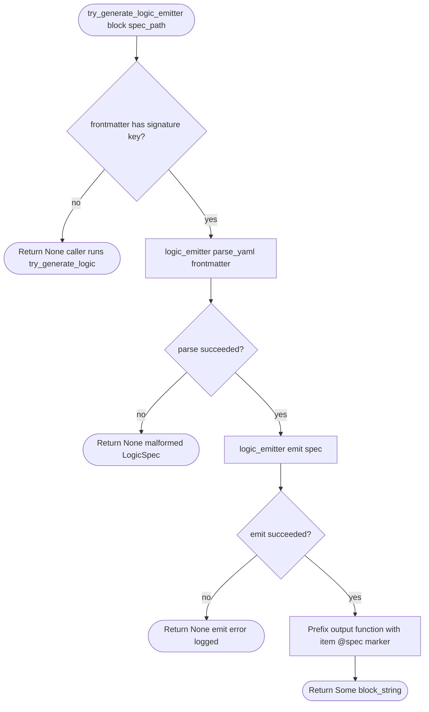

# Path B Pattern 1 — LogicEmitter integration

## Overview
<!-- type: overview lang: markdown -->

The Path B spike at `projects/agentic-workflow/src/generate/gen/rust/logic_emitter.rs` proved that a Mermaid Plus Logic flowchart shaped as `id: + signature: + nodes: + edges:` can be lowered byte-equivalently to the hand-written body of `run_module_facade()`. This TD describes how to **wire the spike into the apply pipeline** so `aw td gen-code` can use it to close one of the 17 `missing-generator:logic` markers in the Path B cluster.

The integration is additive. `projects/agentic-workflow/src/generate/apply.rs::generate_code_for_entry()` already dispatches Mermaid blocks by `block.section_type` and routes the `"logic"` arm to `try_generate_logic()` (which consumes the existing label-based `LogicContent` schema and emits skeleton placeholders). This TD adds a new sibling helper `try_generate_logic_emitter()` that:

1. inspects the raw frontmatter for the discriminator field `signature:`,
2. when present, parses the frontmatter as a `LogicSpec` via `logic_emitter::parse_yaml()`,
3. invokes `logic_emitter::emit(&spec)` and returns an item-level
   `/// @spec <spec_path>#logic` marker plus the resulting full function source,
4. when absent, returns `None` and the existing `try_generate_logic()` path runs unchanged (R2 — no spec already on main breaks).

The new helper itself is hand-written (`apply.rs` has no spec to drive it from yet) and is wrapped in a `<HANDWRITE gap="missing-generator:logic" tracker="enhancement-path-b-pattern-1-integrate-logicemitter-close-run">` marker so the gap is auditable. After this TD lands, a follow-up Pattern-1 application of itself can replace that hand-written wiring with a CODEGEN block.

The consumer-side change is a new Logic section in `module-facade.md` that carries the LogicEmitter frontmatter shape, plus a new `changes:` entry pointing the section at `module_facade.rs`. Running `aw td gen-code` against the updated spec must produce a CODEGEN block whose function body is byte-equivalent to the existing hand-written body of `run_module_facade()`. Then the surrounding `<HANDWRITE>` markers in `module_facade.rs` are removed — the function body now lives inside the CODEGEN block.

## Schema
<!-- type: schema lang: yaml -->

```yaml
$schema: "https://json-schema.org/draft/2020-12/schema"
$id: path-b-pattern-1-integration#schema
title: Path B Pattern 1 Integration — apply.rs Logic dispatch contract
description: >
  Type contract describing the inputs and outputs of the new
  try_generate_logic_emitter() helper added to apply.rs.

definitions:
  LogicEmitterDispatchInput:
    type: object
    $id: LogicEmitterDispatchInput
    description: >
      Input to the new dispatch helper. The block.frontmatter is the parsed
      YAML of a Mermaid Plus Logic section. The discriminator is the
      presence of a top-level `signature:` field — when present, this is a
      LogicSpec; when absent, the existing try_generate_logic path handles it.
    required: [frontmatter, spec_path]
    properties:
      frontmatter:
        type: object
        description: "Raw serde_yaml::Value from the Mermaid Plus block frontmatter."
      spec_path:
        type: string
        description: "Path of the originating spec file, used in the item-level @spec marker line."

  LogicEmitterDispatchOutput:
    type: object
    $id: LogicEmitterDispatchOutput
    description: >
      Output of the dispatch helper. None when the frontmatter is not a
      LogicSpec (no signature field) — caller falls back to try_generate_logic.
      Some(string) when emission succeeded; the string contains an item-level
      @spec doc marker plus the full function source ready for the surrounding
      CODEGEN-BEGIN/END markers to wrap.
    oneOf:
      - { type: "null" }
      - { type: string, description: "Item-level @spec marker plus full function source from logic_emitter::emit()." }

  Disambiguator:
    type: object
    $id: Disambiguator
    description: >
      Rule for choosing between the LogicEmitter path and the legacy
      LogicContent path. The presence of a top-level `signature:` field in
      the frontmatter is sufficient — LogicContent has no `signature:` field
      (its top-level shape is `id`, `entry`, `nodes`, `edges`), while
      LogicSpec requires `signature:` (without it, emit() cannot produce a
      function declaration). No spec already on main carries `signature:`.
    properties:
      key:
        type: string
        const: signature
      strategy:
        type: string
        const: presence-of-key
```

## Logic
<!-- type: logic lang: mermaid -->



## Test Plan

```mermaid
---
id: path-b-pattern-1-integration-test-plan
requirements:
  dispatch_signature_present:
    id: R1
    text: "When frontmatter carries `signature:`, dispatch routes to logic_emitter::emit and returns Some(item @spec marker plus full function source)."
    kind: functional
    risk: high
    verify: test
  fallback_legacy_logic:
    id: R2
    text: "When frontmatter does not carry `signature:`, dispatch returns None so try_generate_logic continues to handle the legacy LogicContent shape."
    kind: functional
    risk: high
    verify: test
  byte_equivalent_module_facade:
    id: R3
    text: "Running gen-code against module-facade.md emits a CODEGEN block whose function body is byte-equivalent to the existing hand-written run_module_facade body."
    kind: functional
    risk: high
    verify: test
  handwrite_block_removed:
    id: R4
    text: "After codegen runs, the <HANDWRITE gap=missing-generator:logic> block around run_module_facade is removed; the function body lives inside the CODEGEN block."
    kind: functional
    risk: medium
    verify: inspection
  apply_dispatch_handwrite_marker:
    id: R5
    text: "The new try_generate_logic_emitter helper in apply.rs is wrapped in a <HANDWRITE> marker referencing this issue's tracker."
    kind: functional
    risk: low
    verify: inspection
  coverage_delta:
    id: R7
    text: "score sdd coverage shows one fewer pending missing-generator:logic marker (run_module_facade closed) and one new marker for the apply.rs dispatch wiring."
    kind: functional
    risk: low
    verify: inspection
elements:
  test_dispatch_signature_present:
    kind: test
    type: "rs/#[test]"
  test_fallback_legacy_logic:
    kind: test
    type: "rs/#[test]"
  test_byte_equivalent_module_facade:
    kind: test
    type: "rs/#[test]"
  inspect_handwrite_block_removed:
    kind: inspection
    type: "rs/manual"
  inspect_apply_dispatch_marker:
    kind: inspection
    type: "rs/manual"
  inspect_coverage_delta:
    kind: inspection
    type: "cli/score sdd coverage"
relations:
  - { from: test_dispatch_signature_present,    verifies: dispatch_signature_present }
  - { from: test_fallback_legacy_logic,         verifies: fallback_legacy_logic }
  - { from: test_byte_equivalent_module_facade, verifies: byte_equivalent_module_facade }
  - { from: inspect_handwrite_block_removed,    verifies: handwrite_block_removed }
  - { from: inspect_apply_dispatch_marker,      verifies: apply_dispatch_handwrite_marker }
  - { from: inspect_coverage_delta,             verifies: coverage_delta }
---
requirementDiagram
    requirement R1 {
      id: R1
      text: "dispatch routes signature-bearing logic to LogicEmitter"
      risk: High
      verifymethod: Test
    }
    requirement R2 {
      id: R2
      text: "fallback to try_generate_logic for legacy LogicContent"
      risk: High
      verifymethod: Test
    }
    requirement R3 {
      id: R3
      text: "module-facade gen-code is byte-equivalent to handwritten body"
      risk: High
      verifymethod: Test
    }
    requirement R4 {
      id: R4
      text: "HANDWRITE block around run_module_facade removed"
      risk: Medium
      verifymethod: Inspection
    }
    requirement R5 {
      id: R5
      text: "apply.rs dispatch wrapped in HANDWRITE marker"
      risk: Low
      verifymethod: Inspection
    }
    requirement R7 {
      id: R7
      text: "score sdd coverage delta verified"
      risk: Low
      verifymethod: Inspection
    }
    element test_dispatch_signature_present {
      type: "rs/#[test]"
    }
    element test_fallback_legacy_logic {
      type: "rs/#[test]"
    }
    element test_byte_equivalent_module_facade {
      type: "rs/#[test]"
    }
    element inspect_handwrite_block_removed {
      type: "rs/manual"
    }
    element inspect_apply_dispatch_marker {
      type: "rs/manual"
    }
    element inspect_coverage_delta {
      type: "cli/score sdd coverage"
    }
    test_dispatch_signature_present - verifies -> R1
    test_fallback_legacy_logic - verifies -> R2
    test_byte_equivalent_module_facade - verifies -> R3
    inspect_handwrite_block_removed - verifies -> R4
    inspect_apply_dispatch_marker - verifies -> R5
    inspect_coverage_delta - verifies -> R7
```

<!-- type: test-plan lang: mermaid -->



## Changes
<!-- type: changes lang: yaml -->

```yaml
changes:
  - path: projects/agentic-workflow/src/generate/apply.rs
    action: modify
    section: logic
    impl_mode: hand-written
    description: >
      Add try_generate_logic_emitter(block, spec_path) -> Option<String> helper
      that sniffs `signature:` in the frontmatter, parses as LogicSpec via
      logic_emitter::parse_yaml, calls logic_emitter::emit, and returns an
      item-level @spec marker plus the full function source (caller wraps in CODEGEN markers). Wire it into
      the "logic" arm of generate_code_for_entry's Mermaid dispatch loop:
      try the emitter first; on None, fall through to the existing
      try_generate_logic helper. The helper itself is wrapped in a
      <HANDWRITE gap="missing-generator:logic" tracker="enhancement-path-b-pattern-1-integrate-logicemitter-close-run">
      marker — the apply.rs pipeline has no spec to drive itself yet.

  - path: projects/agentic-workflow/tech-design/core/generate/generators/module-facade.md
    action: modify
    section: changes
    impl_mode: hand-written
    description: >
      Add a second Logic section (or a sibling spec file module-facade-impl.md)
      carrying the LogicEmitter frontmatter shape (id, signature, nodes with
      kind:process|loop|terminal, edges with kind:next|body|after) describing
      the body of run_module_facade(). Add a `changes:` entry pointing at
      projects/agentic-workflow/src/generate/generators/module_facade.rs with section: logic
      so gen-code emits a CODEGEN block at the right anchor.

  - path: projects/agentic-workflow/src/generate/generators/module_facade.rs
    action: modify
    section: logic
    impl_mode: codegen
    description: >
      Replace the existing <HANDWRITE gap="missing-generator:logic" tracker="enhancement-codegen-primitive-bundle-module-facade-trait-impl">
      block around run_module_facade() with the CODEGEN-BEGIN/END block
      emitted by gen-code. The block content must be byte-equivalent to the
      current hand-written body (verified by the existing logic_emitter
      byte-equivalence test).

  - path: projects/agentic-workflow/src/generate/apply.rs
    action: modify
    section: tests
    impl_mode: hand-written
    description: >
      Add three #[test] cases to apply.rs's tests module
      (or a new file in projects/agentic-workflow/src/generate/tests/):
      (a) test_logic_emitter_dispatch_signature_present — verify
          try_generate_logic_emitter returns Some(...) with an item-level
          @spec marker and full function source when the frontmatter has signature.
      (b) test_logic_emitter_dispatch_falls_back_when_no_signature —
          verify it returns None for the existing label-based LogicContent
          frontmatter shape so try_generate_logic continues to run.
      (c) test_logic_emitter_module_facade_byte_equivalent —
          end-to-end: run dispatch on the module-facade Logic frontmatter
          and assert the emitted body matches the hand-written body.
  - action: annotate
    section: schema
    impl_mode: hand-written
    description: "Traceability metadata edge for the schema section."

```

# Reviews

## Review 1
<!-- type: doc lang: markdown -->
**Verdict:** approved

- [overall] TD spec is well-formed and tightly scoped. Overview correctly frames the integration as additive (existing `try_generate_logic` path preserved, new `try_generate_logic_emitter` runs first when frontmatter has `signature:`). Schema enumerates the dispatch contract via three `definitions` entries; Logic uses Mermaid Plus form with explicit nodes/edges; Test Plan binds 6 requirements (R1–R5, R7) to test or inspection elements with relations. Changes table covers 4 file modifications (apply.rs helper + dispatch wiring, module-facade.md spec edit, module_facade.rs HANDWRITE → CODEGEN flip, apply.rs new test cases) with explicit `impl_mode` per row.
- [Schema] The disambiguator (`presence-of-key: signature`) is sound — the existing `LogicContent` shape has no `signature:` field, so the discriminator can't false-positive against any spec already on main. The `LogicEmitterDispatchOutput` `oneOf` cleanly captures the None/Some(string) bifurcation that drives the fallback to the legacy path.
- [Logic] Flowchart covers all five exit edges (no signature, parse error, emit error, success, fall-through to legacy). The decision/process/terminal nodes use the legacy `LogicContent` shape (label-based) intentionally, because this Logic section drives `apply.rs` dispatch wiring which is itself hand-written under R5 (apply.rs has no LogicEmitter consumer yet — a future Pattern-1 application of itself will close that loop).
- [Changes] Each row carries explicit `section:` and `impl_mode:` (codegen vs handwrite). The handwrite rows for `apply.rs` align with R5; the codegen row for `module_facade.rs` aligns with R4 (HANDWRITE→CODEGEN flip). Test row enumerates three concrete `#[test]` cases keyed to R1, R2, R3 — covers the full requirement matrix.
- [Test Plan] 6 requirements, 6 elements, 6 verifies relations — every requirement is bound. R4/R5/R7 use inspection rather than test, which is appropriate (HANDWRITE marker presence is a code-search assertion, coverage delta is a CLI invariant).

## Review 2
<!-- type: doc lang: markdown -->
**Verdict:** approved

- [Logic] Round 1 codegen-ready check flagged missing `entry:` field in the Logic section frontmatter; the revision adds `entry: start` (the natural source node) so `LogicContent` deserialization succeeds. Frontmatter now passes both the structural rule (id + entry + nodes + edges) and the renderable Mermaid body remains aligned (start → has_sig → ...). No other edits.
