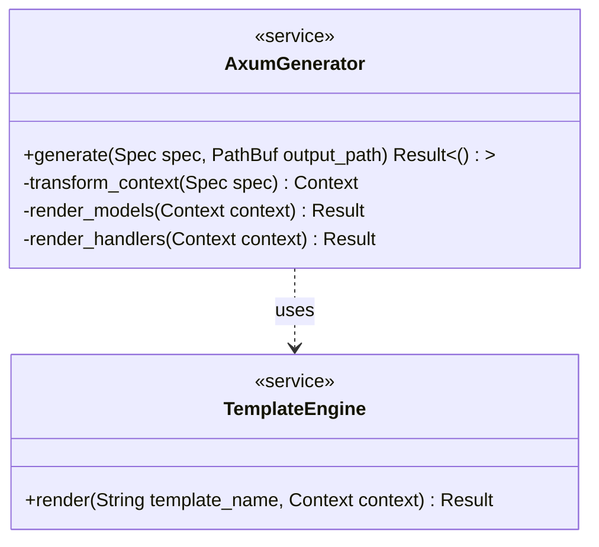

<spec>

# Axum Code Generator

## Overview
<!-- type: doc lang: markdown -->

This spec defines the `AxumGenerator` component, which orchestrates the generation of a Rust/Axum backend service. It transforms a language-agnostic `Spec` into a Rust-specific context and delegates rendering to the `TemplateEngine`. It handles the creation of the project structure, data models, API handlers, and router configuration.

## Requirements
<!-- type: doc lang: markdown -->

### R1 - Generator Interface

```yaml
id: R1
priority: high
status: draft
```

The generator must accept a Spec object (containing schema and API definitions) and an output directory path. It should orchestrate the generation process by creating the necessary directory structure for a Rust project.

### R2 - Context Transformation

```yaml
id: R2
priority: high
status: draft
```

The generator must transform the language-agnostic Spec into a Tera-compatible Context optimized for Rust. This includes mapping JSON schema types to Rust types (e.g., 'integer' -> 'i32', 'string' -> 'String', 'array' -> 'Vec<T>'), handling nullability with 'Option<T>', and converting casing to Rust conventions (PascalCase for structs, snake_case for fields/functions).

### R3 - Model Generation

```yaml
id: R3
priority: high
status: draft
```

The generator must render and write the 'models.rs' file. It should generate Rust structs for each schema definition, including appropriate `#[derive(Serialize, Deserialize, Debug, Clone)]` attributes and handling imports/dependencies.

### R4 - Router and Handler Generation

```yaml
id: R4
priority: medium
status: draft
```

The generator must render and write 'handlers.rs' and 'main.rs'. It should create handler functions for defined operations and configure the Axum router to wire these handlers to their respective paths and HTTP methods.

## Acceptance Criteria
<!-- type: doc lang: markdown -->

### Scenario: Generate User Model

- **GIVEN** A Spec containing a 'User' schema with 'id' (integer) and 'name' (string) fields
- **WHEN** The generator is invoked with this spec
- **THEN** A 'models.rs' file is created containing `pub struct User { pub id: i32, pub name: String }` with Serde derives

### Scenario: Generate User Handler

- **GIVEN** A Spec defining a GET /users operation linked to the User schema
- **WHEN** The generator runs
- **THEN** A 'handlers.rs' file is created with a `pub async fn get_users() -> Json<Vec<User>>` function signature

### Scenario: Handle Write Error

- **GIVEN** An invalid output path (e.g., read-only directory)
- **WHEN** The generator attempts to write files
- **THEN** The generator returns a standardized GeneratorError::FileSystemError

### Scenario: Generate Nested Types

- **GIVEN** A Spec containing a 'Group' schema with a 'users' field of type 'array' of 'User' items
- **WHEN** The generator processes the spec
- **THEN** A 'models.rs' file is created containing `pub struct Group { pub users: Vec<User> }`

## Diagrams
<!-- type: doc lang: markdown -->

### Axum Generator Structure



### Generation Process

```mermaid
flowchart TB
    Start((Start))
    Transform[Transform Spec to Rust Context]
    RenderModels[Render Models Template]
    RenderHandlers[Render Handlers Template]
    RenderMain[Render Main/Router Template]
    WriteFiles[Write Output Files]
    End((End))
    Start -->|generate(spec, path)| Transform
    Transform -->|Context| RenderModels
    RenderModels -->|models.rs| RenderHandlers
    RenderHandlers -->|handlers.rs| RenderMain
    RenderMain -->|main.rs| WriteFiles
    WriteFiles -->|Success| End
```

</spec>
