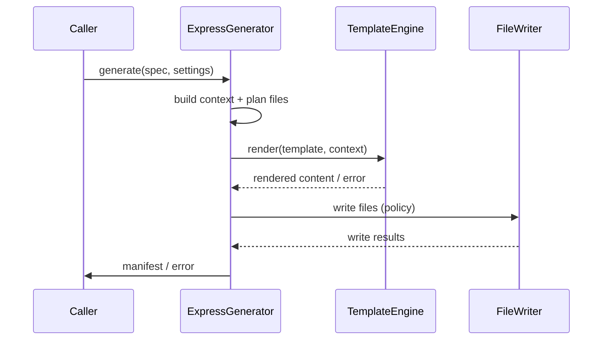

<spec>

# Express Generator

## Overview
<!-- type: overview lang: markdown -->

Defines the Express.js code generator that renders Express project files using the Tera-based template engine and produces a deterministic file manifest.

## Requirements
<!-- type: requirements lang: mermaid -->

```mermaid
---
id: generator-express-requirements
---
requirementDiagram
    requirement R1 {
        id: R1
        text: Resolve the express template set from the configured templates root.
        risk: high
        verifymethod: test
    }
    requirement R2 {
        id: R2
        text: Build deterministic template context from normalized API and JSON Schema IR.
        risk: high
        verifymethod: test
    }
    requirement R3 {
        id: R3
        text: Return an ordered deterministic manifest with status and rendered content hash.
        risk: medium
        verifymethod: test
    }
    requirement R4 {
        id: R4
        text: Enforce error, skip, and overwrite policies per target file.
        risk: medium
        verifymethod: test
    }
    requirement R5 {
        id: R5
        text: Map template and filesystem failures into structured generator errors.
        risk: medium
        verifymethod: test
    }
```

## Acceptance Criteria
<!-- type: scenarios lang: yaml -->

```yaml
scenarios:
  - name: generate-express-project
    given: An API spec with two routes and generator settings { name: "todo-api", lang: "ts" }.
    when: generate(spec, settings) is invoked.
    then: A manifest is returned containing rendered Express files under src/ plus package.json and tsconfig.json.
  - name: missing-template-set
    given: The templates root does not contain the express/ directory.
    when: generate(spec, settings) is invoked.
    then: The call fails with GeneratorError::TemplateSetMissing including the expected path.
  - name: stable-output-ordering
    given: The same input spec and settings are used twice.
    when: generate(spec, settings) is invoked both times.
    then: The manifest lists entries in identical path order and identical content hashes.
  - name: overwrite-policy-skip
    given: A target file already exists and overwrite policy is set to skip.
    when: generate(spec, settings) is invoked.
    then: The manifest records the file as skipped and the file contents remain unchanged.
  - name: overwrite-policy-error
    given: A target file already exists and overwrite policy is set to error.
    when: generate(spec, settings) is invoked.
    then: The call fails with GeneratorError::OverwriteNotAllowed naming the file.
  - name: template-render-failure
    given: A template with a syntax error in the express/ set.
    when: generate(spec, settings) is invoked.
    then: The call fails with GeneratorError::TemplateRenderError naming the template.
```

## Diagrams
<!-- type: diagram lang: mermaid -->

### Express Generation Flow



</spec>

## Changes
<!-- type: changes lang: yaml -->

```yaml
changes:
  - action: annotate
    section: requirements
    impl_mode: hand-written
    description: "Traceability metadata edge for the requirements section."

  - action: annotate
    section: scenarios
    impl_mode: hand-written
    description: "Traceability metadata edge for the scenarios section."

```