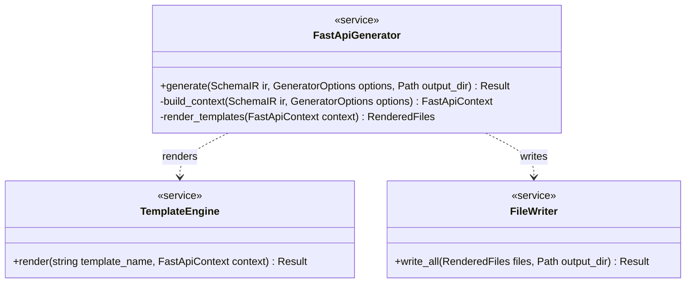
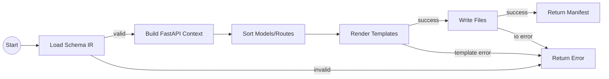

<spec>

# FastAPI Generator

## Overview
<!-- type: doc lang: markdown -->

Defines the FastAPI generator that transforms the internal schema IR into a Python FastAPI service skeleton using the TemplateEngine. The generator maps IR types to Pydantic models, renders route handlers and project files, and returns a manifest of generated outputs with structured errors for unsupported constructs or IO/template failures.

## Requirements
<!-- type: doc lang: markdown -->

### R1 - Input Mapping

```yaml
id: R1
priority: high
status: draft
```

The generator must accept the internal schema IR (from json-schema-core/spec-validator) and produce a FastAPI-oriented generation context including models, operations, and server metadata.

### R2 - Template Rendering

```yaml
id: R2
priority: high
status: draft
```

The generator must render FastAPI templates using the TemplateEngine and write output files to a specified output directory, preserving a deterministic file order.

### R3 - Project Layout

```yaml
id: R3
priority: high
status: draft
```

The generator must create a standard FastAPI project layout including app entrypoint, models module or package, routers directory, and dependency manifest, with paths configurable via generator options.

### R4 - Type Mapping

```yaml
id: R4
priority: medium
status: draft
```

The generator must map IR primitive types and object schemas to Pydantic types (e.g., string→str, integer→int, number→float, boolean→bool, arrays→List, objects→BaseModel) with required/optional fields.

### R5 - Error Reporting

```yaml
id: R5
priority: medium
status: draft
```

The generator must return structured errors for unsupported schema constructs, missing templates, and write failures, including the source operation or schema name when available.

### R6 - Deterministic Output

```yaml
id: R6
priority: medium
status: draft
```

Given identical inputs and options, the generator must produce byte-for-byte identical outputs, including stable ordering of models, routes, and imports.

## Acceptance Criteria
<!-- type: doc lang: markdown -->

### Scenario: Generate Minimal Service

- **GIVEN** A schema IR with one GET operation `/health` returning a string and generator options targeting output dir `./out`
- **WHEN** The FastAPI generator runs
- **THEN** It writes `app.py`, `routers/health.py`, and `requirements.txt`, and reports a manifest containing those files.

### Scenario: Generate Models From Objects

- **GIVEN** A schema IR containing an object schema `User` with required `id` (integer) and optional `email` (string)
- **WHEN** The FastAPI generator runs
- **THEN** It generates a Pydantic model with `id: int` required and `email: Optional[str]` optional, and includes the model in the rendered files.

### Scenario: Configurable Project Layout

- **GIVEN** Generator options override the models module path to `app/domain/models.py` and router path to `app/api/`
- **WHEN** The FastAPI generator runs
- **THEN** It writes models to `app/domain/models.py` and routes under `app/api/` while still generating a valid app entrypoint.

### Scenario: Missing Template Error

- **GIVEN** The template set is missing `routers/route.py.j2`
- **WHEN** The generator attempts to render routes
- **THEN** It returns a `TemplateError::NotFound` with the missing template name and stops generation without writing partial output.

### Scenario: Unsupported Schema Construct

- **GIVEN** A schema IR containing a construct not supported by the FastAPI generator (e.g., tuple validation)
- **WHEN** The generator builds the generation context
- **THEN** It returns a `GeneratorError::UnsupportedSchema` with the schema name/path and does not write partial output.

### Scenario: Deterministic Ordering

- **GIVEN** A schema IR with multiple models and operations in non-deterministic input order
- **WHEN** The generator runs twice with the same options
- **THEN** The generated files are byte-for-byte identical across runs.

## Diagrams
<!-- type: doc lang: markdown -->

### FastAPI Generator Structure



### FastAPI Generation Flow



</spec>
