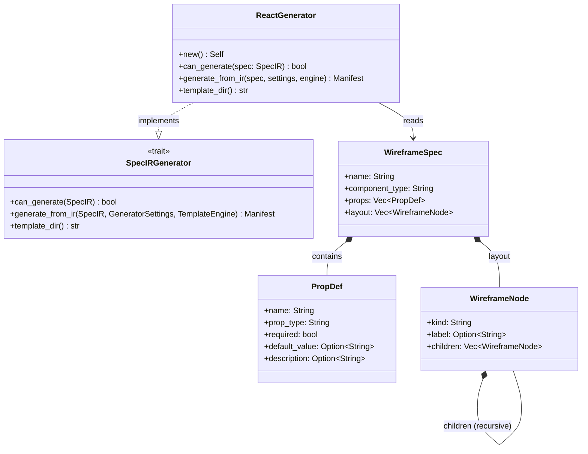
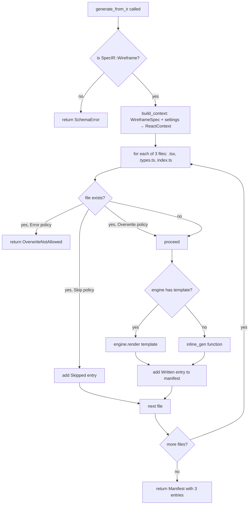

<spec>

# React Generator

## Overview
<!-- type: doc lang: markdown -->

Defines the `ReactGenerator` — a `SpecIRGenerator` that converts a `SpecIR::Wireframe` payload into a React functional component scaffold (TypeScript). It accepts only the `wireframe` section type and produces three output files: `{ComponentName}.tsx` (the React component), `{ComponentName}.types.ts` (the TypeScript props interface), and `index.ts` (barrel re-export). When Tera templates are present under the `react/` directory they are used; otherwise inline string generation is the fallback. Overwrite behaviour is governed by `GeneratorSettings.overwrite_policy`.

## Requirements
<!-- type: doc lang: markdown -->

### R1 - SpecIRGenerator Trait Implementation

`ReactGenerator` implements the `SpecIRGenerator` trait:
- `can_generate(spec)` returns `true` only for `SpecIR::Wireframe` variants.
- `generate_from_ir(spec, settings, engine)` returns a `Manifest` with exactly three entries.
- `template_dir()` returns `"react"`.

**Priority**: high

### R2 - Component File Output

`generate_from_ir` produces a React functional component at `<output_dir>/{ComponentName}.tsx`:
- Import of props interface from `./{ComponentName}.types`.
- Named export function `{ComponentName}({props}: {ComponentName}Props)`.
- Props destructuring with default values when `PropDef.default_value` is set.
- JSX body rendered from `WireframeSpec.layout` using recursive `render_jsx_body`.
- `@componentType` JSDoc comment when `WireframeSpec.component_type` is non-empty.
- Default export of the component.
- Component name derived from `WireframeSpec.name` (PascalCase); falls back to `GeneratorSettings.name` when empty.

Supported JSX node kinds in `render_jsx_body`:
- `text` → `<span>{label}</span>`
- `button` → `<button type="button">{label}</button>`
- `input` → `<input placeholder="{label}" />`
- `list` → `<ul>` with a `{/* TODO: render items */}` placeholder
- `section`, `article`, `header`, `footer`, `main`, `nav`, `aside`, `form` → semantic HTML tags
- Any other kind → `<div>` container

**Priority**: high

### R3 - Types File Output

`generate_from_ir` produces a TypeScript props interface at `<output_dir>/{ComponentName}.types.ts`:
- `export interface {ComponentName}Props` block.
- One entry per `PropDef`: required props `name: type`, optional props `name?: type`.
- JSDoc comment per prop when `PropDef.description` is set.

**Priority**: high

### R4 - Barrel Index File Output

`generate_from_ir` produces `<output_dir>/index.ts` that re-exports:
- The named component export and `default` from `./{ComponentName}`.
- The props type from `./{ComponentName}.types`.

**Priority**: high

### R5 - Template Fallback

When the Tera template engine does not contain a template at `react/{ComponentName}.tsx.j2`, `react/{ComponentName}.types.ts.j2`, or `react/index.ts.j2`, the generator falls back to inline string generation. No error is raised when templates are absent.

**Priority**: medium

### R6 - Overwrite Policy Enforcement

Before writing each output file the generator checks whether it already exists:
- `OverwritePolicy::Error` → return `GeneratorError::OverwriteNotAllowed`.
- `OverwritePolicy::Skip` → add a `Skipped` entry to the manifest and continue.
- `OverwritePolicy::Overwrite` → proceed and overwrite.

**Priority**: medium

## Input Schema
<!-- type: doc lang: markdown -->

### WireframeSpec

```json
{
  "$schema": "http://json-schema.org/draft-07/schema#",
  "title": "WireframeSpec",
  "description": "Wireframe specification for React component scaffold generation.",
  "type": "object",
  "properties": {
    "name": {
      "type": "string",
      "description": "Component name in PascalCase (e.g. 'UserCard'). Falls back to GeneratorSettings.name when empty.",
      "default": ""
    },
    "component_type": {
      "type": "string",
      "description": "High-level component type: 'page', 'layout', 'card', 'form', etc.",
      "default": ""
    },
    "props": {
      "type": "array",
      "description": "TypeScript props exposed by the component.",
      "items": { "$ref": "#/definitions/PropDef" },
      "default": []
    },
    "layout": {
      "type": "array",
      "description": "Top-level layout nodes rendered by the component.",
      "items": { "$ref": "#/definitions/WireframeNode" },
      "default": []
    }
  },
  "definitions": {
    "PropDef": {
      "title": "PropDef",
      "type": "object",
      "required": ["name", "prop_type"],
      "properties": {
        "name": { "type": "string", "description": "Prop name in camelCase." },
        "prop_type": { "type": "string", "description": "TypeScript type string." },
        "required": { "type": "boolean", "default": false },
        "default_value": { "type": "string", "description": "Default value expression for destructuring." },
        "description": { "type": "string", "description": "JSDoc description." }
      }
    },
    "WireframeNode": {
      "title": "WireframeNode",
      "type": "object",
      "required": ["kind"],
      "properties": {
        "kind": { "type": "string", "description": "Element kind: text, button, input, list, or HTML semantic tag." },
        "label": { "type": "string", "description": "Display label or placeholder text." },
        "children": {
          "type": "array",
          "items": { "$ref": "#/definitions/WireframeNode" },
          "default": []
        }
      }
    }
  }
}
```

## Structure
<!-- type: doc lang: markdown -->



## Generation Flow
<!-- type: doc lang: markdown -->



## Test Plan
<!-- type: doc lang: markdown -->

| Test | Requirement | Method |
|------|-------------|--------|
| `test_can_generate_wireframe` | R1 | Assert `can_generate(SpecIR::Wireframe)` returns `true` |
| `test_cannot_generate_non_wireframe` | R1 | Assert `can_generate(SpecIR::Api)` returns `false` |
| `test_generate_produces_three_files` | R2, R3, R4 | Assert manifest has exactly 3 entries: `UserCard.tsx`, `UserCard.types.ts`, `index.ts` |
| `test_component_tsx_content` | R2 | Assert `UserCard.tsx` entry has a content hash (confirming content was generated) |
| `test_types_ts_props_interface` | R3 | Assert output contains `interface UserCardProps`, `userId: number`, `showAvatar?: boolean` |
| `test_index_ts_exports` | R4 | Assert output contains `UserCard` and `UserCardProps` re-exports |
| `test_jsx_body_render` | R2 | Assert `render_jsx_body` produces `<span` for text nodes and `<button` for button nodes |

All tests are in `crates/cclab-sdd/src/generate/generators/react.rs` under `#[cfg(test)]`.

## Implementation
<!-- type: doc lang: markdown -->

| File | Action |
|------|--------|
| `crates/cclab-sdd/src/generate/generators/react.rs` | CREATE — ReactGenerator with SpecIRGenerator trait, inline JSX/types/index generators, recursive render_jsx_body |
| `crates/cclab-sdd/src/generate/generators/mod.rs` | MODIFY — export ReactGenerator |
| `crates/cclab-sdd/src/generate/spec_ir/types.rs` | MODIFY — add WireframeSpec, PropDef, WireframeNode, SpecIR::Wireframe variant, From<WireframeSpec> |
| `crates/cclab-sdd/src/generate/lib.rs` | MODIFY — re-export ReactGenerator, WireframeSpec, PropDef, WireframeNode |

</spec>
