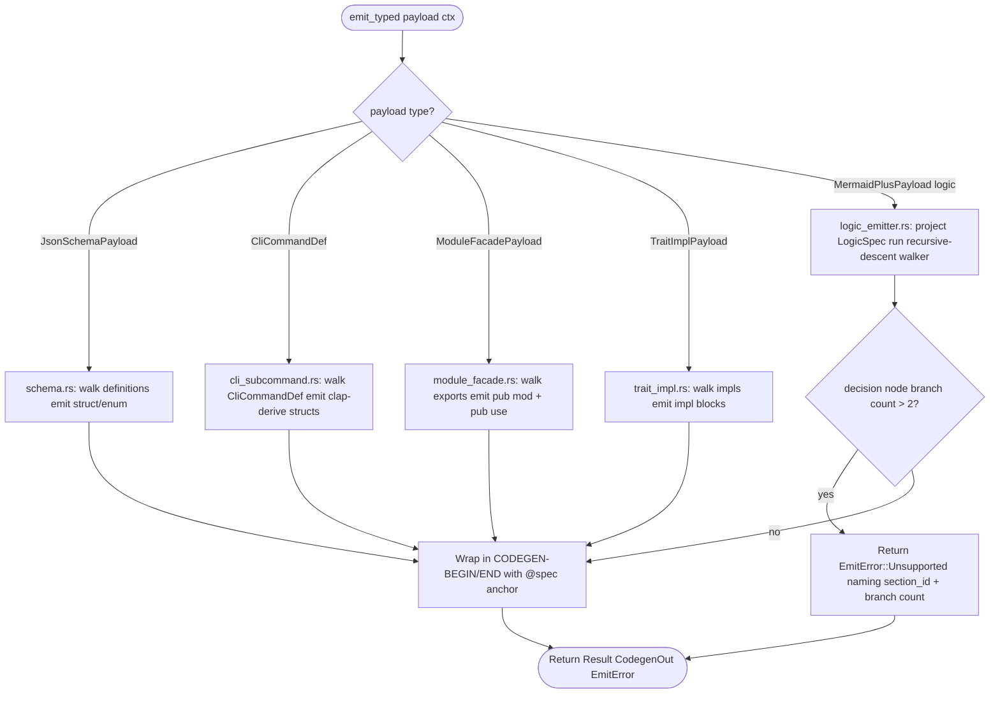
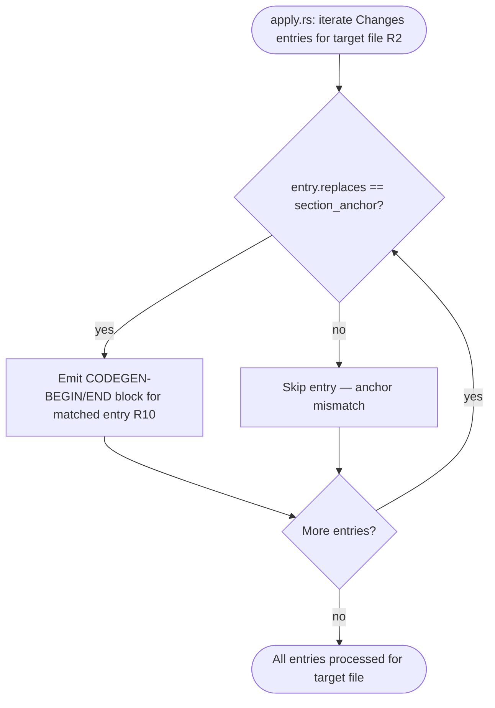
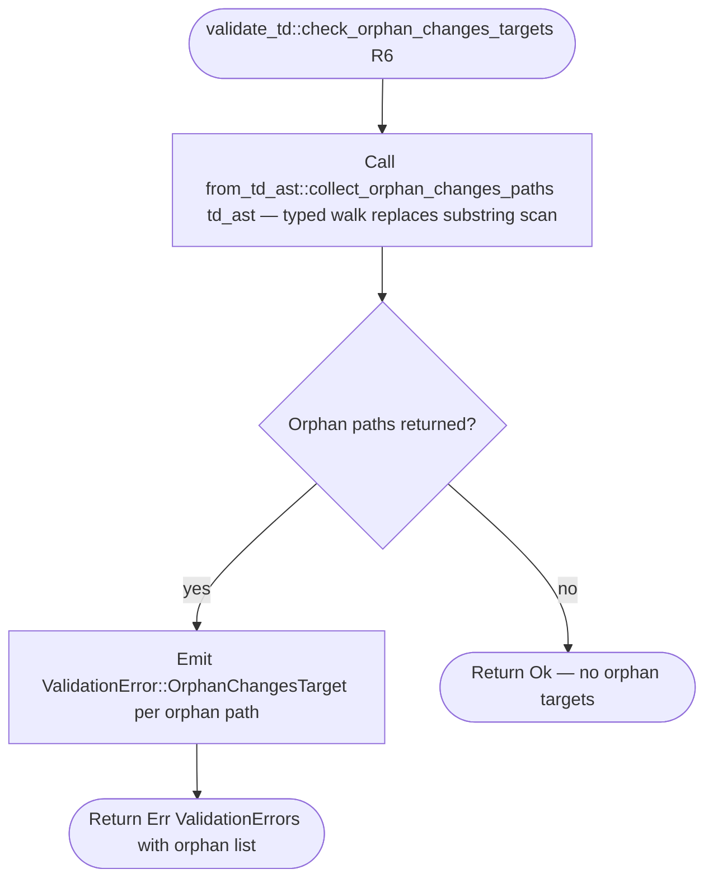
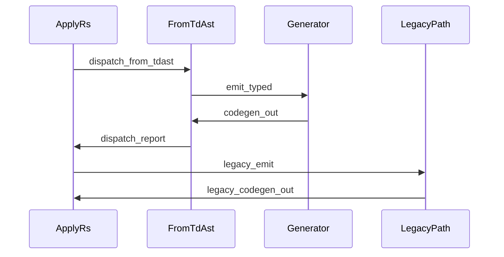

# Generator Typed Entries (Stage 2B)

## Schema: Typed Generator Entry Contracts
<!-- type: schema lang: yaml -->

```yaml
$schema: "https://json-schema.org/draft/2020-12/schema"
$id: sdd-generator-typed-entries#schema
title: Generator Typed Entry Contracts — Stage 2B
description: >
  Type definitions for the five new emit_typed entry points landed in
  Stage 2B: schema.rs, cli_subcommand.rs, module_facade.rs, trait_impl.rs,
  and logic_emitter.rs. Each entry point consumes a typed td_ast::payloads
  struct and returns CodegenOut, replacing the legacy raw-markdown parsing
  path. ModuleFacadePayload and TraitImplPayload are new additions to
  projects/agentic-workflow/src/td_ast/payloads.rs (not present after Stage 2).

definitions:
  ModuleFacadePayload:
    type: object
    $id: ModuleFacadePayload
    required: [exports]
    description: >
      Typed payload for a module-facade Changes-section entry.
      Extracted from the TDAst Changes block when the entry action is
      export-reexport or the spec has pub-use export annotations.
      Consumed by module_facade::emit_typed.
    properties:
      exports:
        type: array
        description: "Ordered list of module export groups."
        items:
          $ref: "#/definitions/FacadeExportGroup"
        x-rust-type: "Vec<FacadeExportGroup>"
      spec_ref:
        type: string
        x-rust-type: "Option<String>"
        x-serde-default: true
        x-serde-skip-if: "Option::is_none"
        description: "SPEC-REF anchor propagated to the emitted CODEGEN block."
    x-rust-struct:
      derive: [Debug, Clone, Serialize, Deserialize, Default]

  FacadeExportGroup:
    type: object
    $id: FacadeExportGroup
    required: [module, symbols]
    description: >
      One pub mod + list of pub use re-exports for that module.
    properties:
      module:
        type: string
        description: "Module name (e.g. apply, from_td_ast)."
      symbols:
        type: array
        items:
          type: string
        x-rust-type: "Vec<String>"
        description: "Symbol names to re-export via pub use."
    x-rust-struct:
      derive: [Debug, Clone, Serialize, Deserialize]

  TraitImplPayload:
    type: object
    $id: TraitImplPayload
    required: [trait_name, impls]
    description: >
      Typed payload for trait-impl emission. Extracted from a
      JsonSchemaPayload that carries x-trait-impls annotations in its
      definitions. Consumed by trait_impl::emit_typed.
    properties:
      trait_name:
        type: string
        description: "The Rust trait being implemented (e.g. SectionGenerator)."
      impls:
        type: array
        items:
          $ref: "#/definitions/TraitImplEntry"
        x-rust-type: "Vec<TraitImplEntry>"
        description: "One impl block per struct in the definitions map."
      spec_ref:
        type: string
        x-rust-type: "Option<String>"
        x-serde-default: true
        x-serde-skip-if: "Option::is_none"
    x-rust-struct:
      derive: [Debug, Clone, Serialize, Deserialize, Default]

  TraitImplEntry:
    type: object
    $id: TraitImplEntry
    required: [struct_name, methods]
    description: >
      One impl<Trait> for<Struct> block produced from an x-trait-impls entry.
    properties:
      struct_name:
        type: string
        description: "Rust struct name that receives the trait impl."
      methods:
        type: array
        items:
          $ref: "#/definitions/TraitMethodDef"
        x-rust-type: "Vec<TraitMethodDef>"
    x-rust-struct:
      derive: [Debug, Clone, Serialize, Deserialize]

  TraitMethodDef:
    type: object
    $id: TraitMethodDef
    required: [name, signature]
    description: >
      One method emitted inside a trait impl block.
      signature is the full Rust fn signature string; body_logic_id is an
      optional reference to a Logic section whose frontmatter drives the body.
    properties:
      name:
        type: string
        description: "Method name."
      signature:
        type: string
        description: "Full Rust fn signature including pub / &self / return type."
      body_logic_id:
        type: string
        x-rust-type: "Option<String>"
        x-serde-default: true
        x-serde-skip-if: "Option::is_none"
        description: "Logic section id whose walker provides the body, if any."
    x-rust-struct:
      derive: [Debug, Clone, Serialize, Deserialize]

  EmitError:
    type: object
    $id: EmitError
    required: [kind, section_id]
    description: >
      Structured error returned by emit_typed entry points via
      Result<CodegenOut, EmitError>. Unsupported is the primary variant
      for Stage 2B: returned when logic_emitter encounters a decision node
      with more than 2 outgoing branches (R1).
    properties:
      kind:
        type: string
        x-rust-type: "EmitErrorKind"
        description: "Discriminant: Unsupported | MissingPayload | InternalError."
      section_id:
        type: string
        description: "The spec section anchor that triggered the error."
      detail:
        type: string
        x-rust-type: "Option<String>"
        x-serde-default: true
        x-serde-skip-if: "Option::is_none"
        description: "Human-readable detail, e.g. observed branch count."
    x-rust-struct:
      derive: [Debug, Clone]

  EmitErrorKind:
    type: string
    $id: EmitErrorKind
    enum: [unsupported, missing_payload, internal_error]
    description: >
      Discriminant for EmitError. unsupported is emitted by logic_emitter
      when a decision node has more than 2 branches; missing_payload when
      from_td_ast cannot project a typed payload; internal_error for
      unexpected walker failures.
    x-rust-enum:
      derive: [Debug, Clone, Copy, PartialEq, Eq]
      rename_all: snake_case
```
## Logic: emit_typed dispatch
<!-- type: logic lang: mermaid -->






## Interaction: apply.rs typed dispatch flow
<!-- type: interaction lang: mermaid -->


## Test Plan
<!-- type: test-plan lang: mermaid -->

```mermaid
---
id: stage-2b-verification
requirements:
  r1_multi_arm_decision_reject:
    id: R1
    text: "logic_emitter::emit returns EmitError::Unsupported with section_id and branch count when a decision node has more than 2 outgoing branches"
    kind: functional
    risk: high
    verify: test
  r2_changes_anchor_routing:
    id: R2
    text: "apply.rs changes-list iteration emits CODEGEN block only to the target whose replaces field matches the section anchor"
    kind: functional
    risk: high
    verify: test
  r3_typed_entry_points:
    id: R3
    text: "All 5 generators expose emit_typed consuming the matching td_ast::payloads struct and returning CodegenOut"
    kind: functional
    risk: high
    verify: test
  r4_cli_command_dedup:
    id: R4
    text: "cli_subcommand::CliCommand is removed; all call sites consume td_ast::payloads::CliCommandDef directly"
    kind: functional
    risk: high
    verify: test
  r5_dispatcher_primary_path:
    id: R5
    text: "apply.rs primary emission path calls dispatch_from_tdast first; legacy path runs only on LegacyFallback"
    kind: functional
    risk: high
    verify: test
  r6_orphan_typed_walk:
    id: R6
    text: "check_orphan_changes_targets uses collect_orphan_changes_paths typed walk instead of substring scanning"
    kind: functional
    risk: medium
    verify: test
  r7_golden_tests:
    id: R7
    text: "Each migrated generator has a byte-equivalence golden test asserting legacy == emit_typed output"
    kind: functional
    risk: high
    verify: test
  r8_no_regressions:
    id: R8
    text: "All 1954+ sdd library tests continue to pass after migration"
    kind: functional
    risk: high
    verify: test
elements:
  test_logic_emitter_multi_arm:
    kind: test
    type: "rs/#[test]"
  test_apply_anchor_routing:
    kind: test
    type: "rs/#[test]"
  test_schema_emit_typed:
    kind: test
    type: "rs/#[test]"
  test_cli_subcommand_emit_typed:
    kind: test
    type: "rs/#[test]"
  test_module_facade_emit_typed:
    kind: test
    type: "rs/#[test]"
  test_trait_impl_emit_typed:
    kind: test
    type: "rs/#[test]"
  test_logic_emitter_emit_typed:
    kind: test
    type: "rs/#[test]"
  test_dispatcher_primary_path:
    kind: test
    type: "rs/#[test]"
  test_orphan_typed_walk:
    kind: test
    type: "rs/#[test]"
  test_no_cli_command_struct:
    kind: test
    type: "rs/#[test]"
  golden_schema:
    kind: test
    type: "rs/#[test]"
  golden_cli_subcommand:
    kind: test
    type: "rs/#[test]"
  golden_module_facade:
    kind: test
    type: "rs/#[test]"
  golden_trait_impl:
    kind: test
    type: "rs/#[test]"
  golden_logic_emitter:
    kind: test
    type: "rs/#[test]"
  cargo_test_full:
    kind: test
    type: "rs/cargo-test"
relations:
  - { from: test_logic_emitter_multi_arm,   verifies: r1_multi_arm_decision_reject }
  - { from: test_apply_anchor_routing,      verifies: r2_changes_anchor_routing }
  - { from: test_schema_emit_typed,         verifies: r3_typed_entry_points }
  - { from: test_cli_subcommand_emit_typed, verifies: r3_typed_entry_points }
  - { from: test_module_facade_emit_typed,  verifies: r3_typed_entry_points }
  - { from: test_trait_impl_emit_typed,     verifies: r3_typed_entry_points }
  - { from: test_logic_emitter_emit_typed,  verifies: r3_typed_entry_points }
  - { from: test_no_cli_command_struct,     verifies: r4_cli_command_dedup }
  - { from: test_cli_subcommand_emit_typed, verifies: r4_cli_command_dedup }
  - { from: test_dispatcher_primary_path,   verifies: r5_dispatcher_primary_path }
  - { from: test_orphan_typed_walk,         verifies: r6_orphan_typed_walk }
  - { from: golden_schema,                  verifies: r7_golden_tests }
  - { from: golden_cli_subcommand,          verifies: r7_golden_tests }
  - { from: golden_module_facade,           verifies: r7_golden_tests }
  - { from: golden_trait_impl,              verifies: r7_golden_tests }
  - { from: golden_logic_emitter,           verifies: r7_golden_tests }
  - { from: cargo_test_full,               verifies: r8_no_regressions }
---
requirementDiagram
    requirement R1 {
      id: R1
      text: "logic_emitter::emit returns EmitError::Unsupported when decision node has more than 2 branches"
      risk: high
      verifymethod: test
    }
    requirement R2 {
      id: R2
      text: "apply.rs emits CODEGEN block only to anchor-matching target file"
      risk: high
      verifymethod: test
    }
    requirement R3 {
      id: R3
      text: "All 5 generators expose emit_typed(payload, ctx)"
      risk: high
      verifymethod: test
    }
    requirement R4 {
      id: R4
      text: "cli_subcommand::CliCommand removed; CliCommandDef used at all call sites"
      risk: high
      verifymethod: test
    }
    requirement R5 {
      id: R5
      text: "apply.rs calls dispatch_from_tdast first; legacy on LegacyFallback only"
      risk: high
      verifymethod: test
    }
    requirement R6 {
      id: R6
      text: "check_orphan_changes_targets uses typed walk"
      risk: medium
      verifymethod: test
    }
    requirement R7 {
      id: R7
      text: "Byte-equivalence golden test per migrated generator"
      risk: high
      verifymethod: test
    }
    requirement R8 {
      id: R8
      text: "All 1954+ sdd tests pass after migration"
      risk: high
      verifymethod: test
    }
    element test_logic_emitter_multi_arm {
      type: "rs/#[test]"
    }
    element test_apply_anchor_routing {
      type: "rs/#[test]"
    }
    element test_schema_emit_typed {
      type: "rs/#[test]"
    }
    element test_cli_subcommand_emit_typed {
      type: "rs/#[test]"
    }
    element test_module_facade_emit_typed {
      type: "rs/#[test]"
    }
    element test_trait_impl_emit_typed {
      type: "rs/#[test]"
    }
    element test_logic_emitter_emit_typed {
      type: "rs/#[test]"
    }
    element test_dispatcher_primary_path {
      type: "rs/#[test]"
    }
    element test_orphan_typed_walk {
      type: "rs/#[test]"
    }
    element golden_schema {
      type: "rs/#[test]"
    }
    element golden_cli_subcommand {
      type: "rs/#[test]"
    }
    element golden_module_facade {
      type: "rs/#[test]"
    }
    element golden_trait_impl {
      type: "rs/#[test]"
    }
    element golden_logic_emitter {
      type: "rs/#[test]"
    }
    element cargo_test_full {
      type: "rs/cargo-test"
    }
    test_logic_emitter_multi_arm - verifies -> R1
    test_apply_anchor_routing - verifies -> R2
    test_schema_emit_typed - verifies -> R3
    test_cli_subcommand_emit_typed - verifies -> R3
    test_module_facade_emit_typed - verifies -> R3
    test_trait_impl_emit_typed - verifies -> R3
    test_logic_emitter_emit_typed - verifies -> R3
    test_no_cli_command_struct - verifies -> R4
    test_cli_subcommand_emit_typed - verifies -> R4
    test_dispatcher_primary_path - verifies -> R5
    test_orphan_typed_walk - verifies -> R6
    golden_schema - verifies -> R7
    golden_cli_subcommand - verifies -> R7
    golden_module_facade - verifies -> R7
    golden_trait_impl - verifies -> R7
    golden_logic_emitter - verifies -> R7
    cargo_test_full - verifies -> R8
```

## Tests
<!-- type: tests lang: yaml -->

```yaml
preamble: |
  // For each migrated generator, load the corresponding fixture, run both the
  // legacy path and `emit_typed`, and assert output equality. Fixture files live
  // under projects/agentic-workflow/tests/fixtures/stage_2b_typed_migration/ (R7, R8).
tests:
  - name: stage_2b_golden_tests_pending
    body: |
      // Placeholder so `cargo test --test stage_2b_golden_tests` succeeds.
      // Replace with the real per-generator fixture loop when fixtures land.
```

## Changes
<!-- type: changes lang: yaml -->

```yaml
$id: sdd-generator-typed-entries#changes
description: >
  Stage 2B file change list: typed entry points for 5 generators,
  duplicate CliCommand removal, dispatcher primary path, validator typed
  walk, and byte-equivalence golden tests. All impl_mode entries are
  hand-written because codegen does not yet support emit_typed scaffolding
  (gap tracked by this issue).

changes:
  - path: projects/agentic-workflow/src/td_ast/payloads.rs
    action: modify
    section: schema
    impl_mode: hand-written
    description: >
      Add ModuleFacadePayload, FacadeExportGroup, TraitImplPayload,
      TraitImplEntry, TraitMethodDef to the payloads module. These two
      payload structs were missing after Stage 2 and are required before
      module_facade::emit_typed and trait_impl::emit_typed can be wired.
      Carries @spec sdd-generator-typed-entries#schema annotation.

  - path: projects/agentic-workflow/src/generate/gen/rust/schema.rs
    action: modify
    section: schema
    impl_mode: hand-written
    description: >
      Add emit_typed(payload: &JsonSchemaPayload, ctx: &DispatchCtx) -> CodegenOut
      entry point. Internally reuses existing struct/enum emitters, consuming
      typed payload.definitions instead of re-parsing YAML. Carries
      @spec sdd-generator-typed-entries#logic annotation (R3, R10).

  - path: projects/agentic-workflow/src/generate/generators/cli_subcommand.rs
    action: modify
    section: interaction
    impl_mode: hand-written
    description: >
      Delete the duplicate CliCommand struct. Replace all internal usages
      with td_ast::payloads::CliCommandDef. Add emit_typed(cmd: &CliCommandDef,
      ctx: &DispatchCtx) -> CodegenOut entry point. Carries
      @spec sdd-generator-typed-entries#logic annotation (R3, R4, R10).

  - path: projects/agentic-workflow/src/generate/generators/module_facade.rs
    action: modify
    section: logic
    impl_mode: hand-written
    description: >
      Add emit_typed(payload: &ModuleFacadePayload, ctx: &DispatchCtx) -> CodegenOut
      entry point that walks FacadeExportGroup list and emits pub mod + pub use
      lines. Carries @spec sdd-generator-typed-entries#logic annotation (R3, R10).

  - path: projects/agentic-workflow/src/generate/generators/trait_impl.rs
    action: modify
    section: logic
    impl_mode: hand-written
    description: >
      Add emit_typed(payload: &TraitImplPayload, ctx: &DispatchCtx) -> CodegenOut
      entry point that walks TraitImplEntry list and emits impl blocks. Carries
      @spec sdd-generator-typed-entries#logic annotation (R3, R10).

  - path: projects/agentic-workflow/src/generate/gen/rust/logic_emitter.rs
    action: modify
    section: logic
    impl_mode: hand-written
    description: >
      Add emit_typed(payload: &MermaidPlusPayload, ctx: &DispatchCtx) -> CodegenOut
      entry point. Projects LogicSpec from MermaidPlusPayload for kind: logic
      sections. Adds multi-arm decision branch-count guard: emits
      EmitError::Unsupported naming section_id and branch count when > 2 branches
      detected, instructing author to use kind: match. Carries
      @spec sdd-generator-typed-entries#logic annotation (R1, R3, R10).

  - path: projects/agentic-workflow/src/generate/from_td_ast.rs
    action: modify
    section: schema
    impl_mode: hand-written
    description: >
      Extend routing table to register emit_typed entries for all 5 migrated
      generators. Update LegacyFallback decision: return LegacyFallback only
      when the section type has no typed entry registered (e.g. async-api,
      rest-api section types still on legacy path). Update HANDWRITE markers
      to reference this issue slug. Carries @spec sdd-generator-typed-entries#interaction
      annotation (R5, R9).

  - path: projects/agentic-workflow/src/generate/apply.rs
    action: modify
    section: logic
    impl_mode: hand-written
    description: >
      Switch primary emission path to call dispatch_from_tdast first. For
      DispatchStatus::Typed outcomes, take CodegenOut directly. For
      LegacyFallback, fall through to existing untyped routing. Remove per-file
      duplicate CODEGEN-block emission bug by using anchor-matched routing
      (R2 already merged in Chunk A). Carries @spec sdd-generator-typed-entries#interaction
      annotation (R5).

  - path: projects/agentic-workflow/src/td_ast/validate.rs
    action: modify
    section: schema
    impl_mode: hand-written
    description: >
      Replace substring scan in check_orphan_changes_targets with a call to
      from_td_ast::collect_orphan_changes_paths(td_ast) typed walk. The function
      already exists; promote it to primary detection. Carries
      @spec sdd-generator-typed-entries#logic annotation (R6).

  - path: projects/agentic-workflow/tests/fixtures/stage_2b_typed_migration/schema_fixture.yaml
    action: create
    section: test-plan
    impl_mode: hand-written
    description: >
      Representative JsonSchemaPayload fixture for the schema.rs golden test (R7).

  - path: projects/agentic-workflow/tests/fixtures/stage_2b_typed_migration/cli_subcommand_fixture.yaml
    action: create
    section: test-plan
    impl_mode: hand-written
    description: >
      Representative CliCommandDef fixture for the cli_subcommand.rs golden test (R7).

  - path: projects/agentic-workflow/tests/fixtures/stage_2b_typed_migration/module_facade_fixture.yaml
    action: create
    section: test-plan
    impl_mode: hand-written
    description: >
      Representative ModuleFacadePayload fixture for module_facade.rs golden test (R7).

  - path: projects/agentic-workflow/tests/fixtures/stage_2b_typed_migration/trait_impl_fixture.yaml
    action: create
    section: test-plan
    impl_mode: hand-written
    description: >
      Representative TraitImplPayload fixture for trait_impl.rs golden test (R7).

  - path: projects/agentic-workflow/tests/fixtures/stage_2b_typed_migration/logic_emitter_fixture.yaml
    action: create
    section: test-plan
    impl_mode: hand-written
    description: >
      Representative MermaidPlusPayload (logic kind) fixture for logic_emitter.rs golden test (R7).

  - path: projects/agentic-workflow/tests/stage_2b_golden_tests.rs
    action: create
    section: tests
    impl_mode: codegen
    description: >
      Generate the Stage 2B golden-test placeholder from the Tests section.
      The real byte-equivalence fixture loop remains tracked by R7, but the
      placeholder harness is now reproducible from this spec instead of being
      an unmanaged hand-written file.
```

# Reviews

## Review 1
<!-- type: doc lang: markdown -->
**Verdict:** needs-revision

- [logic] (item 3) R2 ("apply.rs changes-list iteration emits CODEGEN block only to the anchor-matching target") is unreachable from the Logic flowchart's entry node. The `emit-typed-dispatch` flowchart covers only the per-generator `emit_typed` dispatch path; there is no node or decision that models the per-target anchor comparison (`section_anchor == entry.replaces`). An implementer reading only Logic has no specification for how the anchor match works. Add a second logic diagram (or extend the Interaction diagram with an explicit `check_anchor_match` decision node leading to `skip_entry` vs `emit_codegen_block`) so R2 is traceable to a node/edge.

- [logic] (item 3) R6 ("check_orphan_changes_targets uses typed walk instead of substring scanning") is similarly unreachable: neither the Logic nor the Interaction diagram contains any node modeling the `validate_td::check_orphan_changes_targets` call site or its replacement. The Changes entry for `validate.rs` describes the intent correctly, but the spec contains no diagrammatic node that an implementer could point to as the canonical R6 design. Add at minimum an Interaction sequence showing `ValidateTd` calling `FromTdAst::collect_orphan_changes_paths` as the primary detection path.

- [schema] (item 4) `EmitTypedResult` is defined in Schema as the unified result wrapper for each `emit_typed` entry point ("Carries the CodegenOut on success or a structured EmitError on failure"), but the Logic flowchart terminates with `return_out: Return CodegenOut` and every Changes entry declares `-> CodegenOut` as the return type. These are contradictory: either the entry points return `EmitTypedResult` (which wraps `CodegenOut` or `EmitError`) or they return `CodegenOut` directly (and surface errors via `Result<CodegenOut, EmitError>`). An implementer cannot determine the actual function signature from the spec as written. Resolve by either (a) removing `EmitTypedResult` from Schema and describing the error path as `Result<CodegenOut, EmitError>` in the Logic return node, or (b) updating Logic's `return_out` label and all Changes descriptions to say `EmitTypedResult`.

## Review 2
<!-- type: doc lang: markdown -->
**Verdict:** approved

All three round-1 findings are resolved:

- [schema] (item 4) `EmitTypedResult`/`EmitTypedStatus` removed; Schema now defines `EmitError` + `EmitErrorKind`. Logic `return_out` reads "Return Result<CodegenOut, EmitError>" and Changes entries use `-> CodegenOut` as the success arm. Schema, Logic, and Changes are consistent.
- [logic] (item 3) R2 is now reachable via the new `apply-anchor-match` diagram (`iterate_changes` → `check_anchor_match` decision → `emit_codegen_block` / `skip_entry` → `next_entry` loop → `done_anchor`). The anchor-match algorithm is fully specified.
- [logic] (item 3) R6 is now reachable via the new `orphan-changes-typed-walk` diagram (`check_orphan_start` → `call_collect_orphan` → `check_orphans_found` decision → `report_orphans` / `return_clean`). The typed-walk promotion is fully specified.

Full 6-item checklist passed: problem solved, R1-R10 all traceable, schema coheres with Logic and Test Plan, error paths covered (Unsupported / missing_payload / internal_error / anchor-mismatch skip / orphan list), Changes plan covers all in-scope files with appropriate granularity.
