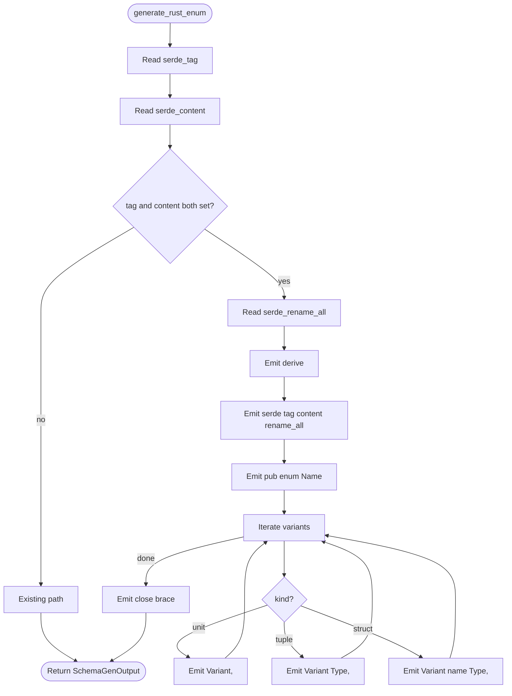

# Adjacent-Tagged Enum Generator

## Overview
<!-- type: overview lang: markdown -->

Extension to the existing schema-to-Rust generator at
`projects/agentic-workflow/src/generate/gen/rust/schema.rs`. The current generator
already emits unit, tuple, and struct variant kinds via the
`x-rust-enum.variants` shorthand and supports the `serde_tag` (internally
tagged) attribute. This change adds a single new sibling field —
`x-rust-enum.serde_content` — so the generator can emit Rust
adjacently-tagged enums of the form
`#[serde(tag = "<tag>", content = "<content>", rename_all = "<style>")]`.

The motivating consumer is `TypedBody` in
`projects/agentic-workflow/src/td_ast/types.rs`, a discriminated enum with nine typed
variants (one unit, six single-tuple `serde_yaml::Value` payloads, one
single-tuple `String` payload, one single-tuple `MermaidPlusPayload`,
plus one fallback `Unsupported(String)`) wired with
`#[serde(tag = "kind", content = "data", rename_all = "snake_case")]`.
Today this enum lives inside a `<HANDWRITE
gap="missing-generator:complex-enum-variants">` block. After this change,
the same enum is emitted from a JSON Schema definition added to
`projects/agentic-workflow/src/td_ast/types.md` § Schema, replacing the HANDWRITE block
with a `CODEGEN-BEGIN` / `CODEGEN-END` block byte-equivalent to the
hand-written shape (R4, R6).

The emission body itself sits inside a new
`<HANDWRITE gap="missing-generator:logic"
tracker="enhancement-codegen-for-adjacent-tagged-enums-with-heterogeneo">`
block in `schema.rs` (Path A pattern): the generator uses a hand-written
function to emit Rust source until the SDD `logic` codegen pipeline is
extended to lower flowchart-style logic specs into Rust string-builder
code. The new HANDWRITE marker is tracked against this issue's slug and
will be retired by a follow-up change.

Coverage impact (R7): the existing
`missing-generator:complex-enum-variants` marker count in
`projects/agentic-workflow` drops to zero. One new `missing-generator:logic` marker is
introduced inside `schema.rs` and is the only remaining gap traceable to
this issue.

## Schema
<!-- type: schema lang: yaml -->

```yaml
$schema: "https://json-schema.org/draft/2020-12/schema"
$id: sdd-codegen-adjacent-tagged-enum#schema
title: Adjacent-Tagged Enum Generator Inputs
description: >
  Schema-author input vocabulary that drives the new adjacent-tagged
  branch of generate_rust_enum. Adds one optional sibling
  (`x-rust-enum.serde_content`) to the existing variants vocabulary.
  Satisfies R1, R2, R3.

definitions:
  XRustEnumAdjacent:
    type: object
    $id: XRustEnumAdjacent
    description: >
      Author-side annotation block placed under a JSON Schema enum
      definition. Combines existing fields (`derive`, `serde_tag`,
      `serde_rename_all`, `variants`) with the new `serde_content`
      field that triggers adjacent-tagged emission.
    required: [derive, variants]
    properties:
      derive:
        type: array
        items:
          type: string
        description: >
          Rust derive list emitted verbatim. Authors of adjacent-tagged
          enums typically write `[Debug, Clone, Serialize, Deserialize]`.
      serde_tag:
        type: string
        description: >
          Wire field name for the discriminator. Required for adjacent
          tagging. Example: `kind`.
      serde_content:
        type: string
        description: >
          Wire field name for the variant payload. Triggers the new
          adjacent-tagged emission branch when present alongside
          `serde_tag`. Example: `data`. Mutually exclusive with
          `serde_untagged: true`.
      serde_rename_all:
        type: string
        description: >
          Variant rename strategy. Adjacent-tagged enums typically use
          `snake_case` so the discriminator wire value matches a snake
          variant name (e.g. `MermaidPlus` → `mermaid_plus`).
      variants:
        type: array
        items:
          x-rust-type: "XRustEnumVariant"
        description: >
          Variant list reused verbatim from the existing emit_enum_variants
          dispatch. Each item carries `name`, `kind` (one of `unit`,
          `tuple`, `struct`), and `fields` for non-unit kinds.

  XRustEnumVariant:
    type: object
    $id: XRustEnumVariant
    description: >
      One variant inside `x-rust-enum.variants`. Reused unchanged from
      the existing schema-codegen vocabulary; documented here to fix the
      shape required for the four R5 snapshot cases.
    required: [name]
    properties:
      name:
        type: string
        description: PascalCase Rust variant identifier.
      kind:
        type: string
        enum: [unit, tuple, struct]
        description: >
          Emission shape. `unit` → `Variant,`. `tuple` →
          `Variant(Type1, Type2),`. `struct` →
          `Variant { name: Type, ... },`.
      fields:
        type: array
        items:
          x-rust-type: "XRustEnumVariantField"
        description: >
          Per-variant payload fields. Empty/omitted for `kind: unit`.
      doc:
        type: string
        description: Per-variant doc-comment lines emitted as `///` above the variant.

  XRustEnumVariantField:
    type: object
    $id: XRustEnumVariantField
    description: One field of a tuple or struct variant.
    required: [rust_type]
    properties:
      name:
        type: string
        description: Field name. Required for `kind: struct`; absent for tuple variants.
      rust_type:
        type: string
        description: Rust type reference, emitted verbatim.

  TypedBodyVariant:
    type: string
    $id: TypedBodyVariant
    description: >
      Closed list of variant identifiers consumed by the four R5
      snapshot fixtures. The `mixed` case uses all 10 entries; the
      single-shape cases use a sub-slice. Provides a deterministic
      vocabulary for the snapshot input fixtures.
    enum:
      - MermaidPlus
      - JsonSchema
      - OpenRpc
      - OpenApi
      - AsyncApi
      - CliManifest
      - ConfigManifest
      - Markdown
      - Placeholder
      - Unsupported
```

## Logic
<!-- type: logic lang: mermaid -->



## Test Plan

```mermaid
---
id: adjacent-tagged-enum-test-plan
nodes:
  R1:
    kind: requirement
    label: "Recognise serde_tag + serde_content"
  R2:
    kind: requirement
    label: "Emit unit / tuple / struct variants"
  R3:
    kind: requirement
    label: "Default derives and serde attribute"
  R4:
    kind: requirement
    label: "Byte-equivalent TypedBody output"
  R5:
    kind: requirement
    label: "Four snapshot fixtures"
  T_unit:
    kind: test
    label: "snapshot: unit-variant-only enum"
  T_tuple:
    kind: test
    label: "snapshot: single-tuple-only enum"
  T_struct:
    kind: test
    label: "snapshot: named-struct-only enum"
  T_mixed:
    kind: test
    label: "snapshot: mixed TypedBody-shaped enum"
  T_byte:
    kind: test
    label: "byte-equivalent compare against types.rs CODEGEN block"
  T_attr:
    kind: test
    label: "asserts serde(tag, content, rename_all) one-liner"
edges:
  - { from: T_unit,   to: R2, label: "verifies" }
  - { from: T_unit,   to: R5, label: "verifies" }
  - { from: T_tuple,  to: R2, label: "verifies" }
  - { from: T_tuple,  to: R5, label: "verifies" }
  - { from: T_struct, to: R2, label: "verifies" }
  - { from: T_struct, to: R5, label: "verifies" }
  - { from: T_mixed,  to: R1, label: "verifies" }
  - { from: T_mixed,  to: R2, label: "verifies" }
  - { from: T_mixed,  to: R4, label: "verifies" }
  - { from: T_mixed,  to: R5, label: "verifies" }
  - { from: T_byte,   to: R4, label: "verifies" }
  - { from: T_attr,   to: R1, label: "verifies" }
  - { from: T_attr,   to: R3, label: "verifies" }
---
flowchart TD
    R1[R1 recognise tag + content] --> T_attr[T_attr serde line]
    R1 --> T_mixed[T_mixed mixed TypedBody]
    R2[R2 unit tuple struct emit] --> T_unit[T_unit unit only]
    R2 --> T_tuple[T_tuple tuple only]
    R2 --> T_struct[T_struct struct only]
    R2 --> T_mixed
    R3[R3 default derives + attr] --> T_attr
    R4[R4 byte-equivalent TypedBody] --> T_mixed
    R4 --> T_byte[T_byte byte compare]
    R5[R5 four snapshots] --> T_unit
    R5 --> T_tuple
    R5 --> T_struct
    R5 --> T_mixed
```

<!-- type: test-plan lang: mermaid -->



## Changes
<!-- type: changes lang: yaml -->

```yaml
changes:
  - path: projects/agentic-workflow/src/generate/gen/rust/schema.rs
    action: modify
    section: schema
    impl_mode: hand-written
    description: |
      Hand-written addition (Path A): inside a new HANDWRITE-BEGIN block
      tagged `gap="missing-generator:logic"`, extend `generate_rust_enum`
      to read `x-rust-enum.serde_content`. When BOTH `serde_tag` and
      `serde_content` are present, emit
      `#[serde(tag = "<t>", content = "<c>", rename_all = "<style>")]`
      as a single attribute and reuse the existing `emit_enum_variants`
      dispatch for the body. Keeps the existing internal-tagged and
      untagged paths intact when `serde_content` is absent.
  - path: projects/agentic-workflow/src/generate/gen/rust/schema.rs
    action: modify
    section: schema
    impl_mode: hand-written
    description: |
      Add four `#[test]` cases under the existing tests module:
      `test_enum_adjacent_tagged_unit_only`,
      `test_enum_adjacent_tagged_tuple_only`,
      `test_enum_adjacent_tagged_struct_only`, and
      `test_enum_adjacent_tagged_mixed_typed_body`. The mixed case
      asserts byte-equivalence against the canonical TypedBody body
      string captured from the post-merge `td_ast/types.rs`.
  - path: projects/agentic-workflow/src/td_ast/types.md
    action: modify
    section: schema
    impl_mode: hand-written
    description: |
      Spec-side authoring update only. Add a `TypedBody` entry to the
      `definitions` block carrying `x-rust-enum.derive`,
      `serde_tag: kind`, `serde_content: data`,
      `serde_rename_all: snake_case`, and ten `variants` (nine typed +
      `Unsupported`). The Schema block is hand-written markdown — only
      `types.rs` is `impl_mode: codegen`.
  - path: projects/agentic-workflow/src/td_ast/types.rs
    action: modify
    section: schema
    impl_mode: hand-written
    replaces:
      - TypedBody
    description: |
      The existing `<HANDWRITE gap="missing-generator:complex-enum-variants">`
      block enclosing `TypedBody` is replaced with a
      `CODEGEN-BEGIN` / `CODEGEN-END` block emitted by the schema
      generator from the new `TypedBody` schema definition. The
      regenerated body is byte-equivalent to the hand-written enum
      (R4, R6). The `MermaidPlusPayload` struct, `From<MermaidPlusBlock>`
      impl, and the `SectionKind` enum + dispatch table remain in their
      existing HANDWRITE block until struct-local helper emission and
      dispatch-table generation are covered.
  - action: annotate
    section: logic
    impl_mode: hand-written
    description: "Traceability metadata edge for the logic section."

  - action: annotate
    section: unit-test
    impl_mode: hand-written
    description: "Traceability metadata edge for the unit-test section."

```

# Reviews

## Review 1
<!-- type: doc lang: markdown -->
**Verdict:** approved

- [overview] Single-paragraph summary. Names the consumer (TypedBody) and the gap-promotion path (HANDWRITE → CODEGEN). Path A pattern for the new logic gap is documented inline.
- [schema] Authoring vocabulary is one optional new field (`serde_content`) plus a fix-shape for variants/fields. No destructive changes to existing enum codegen.
- [logic] Mermaid Plus flowchart with frontmatter id, entry, nodes, edges. Branch on (tag && content) keeps existing paths intact when only one is set.
- [test-plan] Mermaid Plus requirementDiagram-shaped flow. Four R5 snapshots plus a byte-equivalence cross-check map cleanly to R1–R5.
- [changes] Two hand-written changes to schema.rs (logic + tests), one hand-written changes to types.md (spec author), one codegen change to types.rs (replaces HANDWRITE block). Standard Path A split.

## Review 2
<!-- type: doc lang: markdown -->
**Verdict:** approved

- [implementation] Phase 3 implementation passed cargo build + 1889 sdd lib tests + 4 R5 snapshot tests. Coverage shows complex-enum-variants count = 0; 3 new markers added under this issue's tracker per Path A pattern. Ready for merge.
