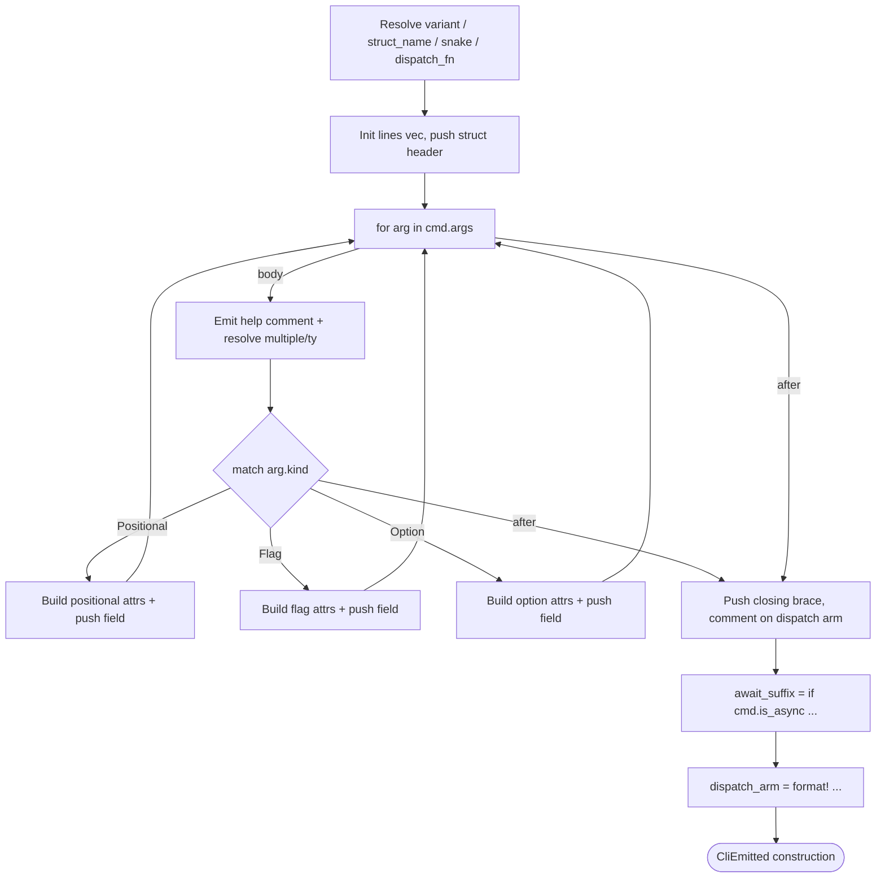

# CLI Subcommand Generator

## Overview
<!-- type: overview lang: markdown -->

Generator module at `projects/agentic-workflow/src/generate/generators/cli_subcommand.rs` that
reads a spec's `cli` section and emits two outputs per subcommand:

1. A clap-derive `Args` struct with one field per `CliArg` entry, annotated with
   `#[arg(...)]` attributes derived from the arg's `kind`, `short`, `default_value`,
   `multiple`, and `help` fields.
2. A dispatch match arm wiring the parent enum variant to the handler function,
   with or without `.await` depending on `is_async`.

Generator output is wrapped by the surrounding `SPEC-MANAGED`,
`CODEGEN-BEGIN`, and `CODEGEN-END` markers, and generated function items carry
an item-level `/// @spec` marker. Three existing `HANDWRITE` blocks in
`projects/agentic-workflow/src/cli/sdd.rs`, `td.rs`, and `td_migrate.rs` are replaced by
`CODEGEN` blocks emitted by this generator once the issue merges.

Two new SpecIR types (`CliCommand`, `CliArg`) are added to
`projects/agentic-workflow/src/generate/spec_ir/types.rs` and a new `CliSubcommand` variant is
added to the `SpecIR` enum. The generator is wired into `apply.rs` as a new
routing branch triggered when a change entry's `section` field is `cli`.
## Schema
<!-- type: schema lang: yaml -->

```yaml
$schema: "https://json-schema.org/draft/2020-12/schema"
$id: sdd-codegen-cli-subcommand#schema
title: CLI Subcommand Generator Type Definitions
description: >
  Type declarations for the CLI subcommand code generator in
  projects/agentic-workflow/src/generate/generators/cli_subcommand.rs.
  CliCommand and CliArg are the SpecIR input types read at runtime
  by the generator to produce clap-derive Args structs and dispatch arms.
  CliArgKind is the per-arg classification enum controlling which
  clap attribute annotations are emitted. Satisfies R1, R3.

definitions:
  CliArgKind:
    type: string
    $id: CliArgKind
    enum: [positional, flag, option]
    description: >
      Classification of a CLI argument that controls attribute emission.
      positional — emitted as a plain positional argument with no named prefix.
      flag — emitted as a boolean presence flag with no value operand.
      option — emitted as a named value option accepting one or more values.
    x-rust-enum:
      derive: [Debug, Clone, PartialEq, Eq, Serialize, Deserialize]
      serde_rename_all: snake_case

  CliArg:
    type: object
    $id: CliArg
    required: [name, kind]
    description: >
      Specification of a single CLI argument field. Each CliArg produces
      one struct field in the generated clap Args struct with appropriate
      attribute annotations derived from the metadata fields. Satisfies R1, R3.
    properties:
      name:
        type: string
        description: >
          Argument name in snake_case. Used as the Rust field name and,
          for option and flag kinds, as the long name in kebab-case.
      kind:
        $ref: "#/definitions/CliArgKind"
        description: >
          Argument classification: positional, flag, or option.
          Determines which attribute variant is emitted for this field.
      multiple:
        type: boolean
        x-rust-type: "bool"
        x-serde-default: true
        description: >
          When true, the field type becomes Vec<String> and the argument
          accepts one or more values. Applies to option and positional kinds.
          Ignored for flag kind.
        default: false
      default_value:
        type: string
        x-rust-type: "Option<String>"
        x-serde-default: true
        x-serde-skip-if: "Option::is_none"
        description: >
          Literal default value string emitted in the default_value attribute.
          When absent and required is true, the argument is mandatory.
          When absent and required is false, the field type is Option<String>.
      short:
        type: string
        x-rust-type: "Option<String>"
        x-serde-default: true
        x-serde-skip-if: "Option::is_none"
        description: >
          Single-character short name (without the leading dash).
          When present, the short attribute is emitted alongside the long form.
          Applies to option and flag kinds only.
      help:
        type: string
        x-rust-type: "Option<String>"
        x-serde-default: true
        x-serde-skip-if: "Option::is_none"
        description: >
          Help text emitted as a doc comment on the struct field.
          When absent, no doc comment is emitted.
      required:
        type: boolean
        x-rust-type: "bool"
        x-serde-default: true
        description: >
          When true and default_value is absent, the field type is String
          or Vec<String> (non-optional). When false and default_value is absent,
          the field type is Option<String>.
        default: true
    x-rust-struct:
      derive: [Debug, Clone, Serialize, Deserialize]

  CliCommand:
    type: object
    $id: CliCommand
    required: [name, args]
    description: >
      Top-level CLI subcommand specification consumed by the cli_subcommand
      generator. The generator walks args to emit the clap Args struct and
      uses is_async and dispatch_fn to emit the match arm. Satisfies R1, R2, R3.
    properties:
      name:
        type: string
        description: >
          Subcommand name in kebab-case (e.g. migrate-mermaid). Used as
          the subcommand string in the parent enum variant.
      variant:
        type: string
        x-rust-type: "Option<String>"
        x-serde-default: true
        x-serde-skip-if: "Option::is_none"
        description: >
          Parent enum variant name in PascalCase (e.g. MigrateMermaid).
          When absent, derived from name by converting kebab-case to PascalCase.
      args:
        type: array
        items:
          $ref: "#/definitions/CliArg"
        x-rust-type: "Vec<CliArg>"
        x-serde-default: true
        x-serde-skip-if: "Vec::is_empty"
        description: >
          Ordered list of argument specifications. An empty list produces a
          zero-field Args struct — valid for subcommands with no arguments.
      is_async:
        type: boolean
        x-rust-type: "bool"
        x-serde-default: true
        description: >
          When true, the generated dispatch arm appends .await to the
          handler call expression. When false, the call is synchronous.
          Satisfies R2, R3.
        default: false
      dispatch_fn:
        type: string
        x-rust-type: "Option<String>"
        x-serde-default: true
        x-serde-skip-if: "Option::is_none"
        description: >
          Qualified Rust path of the handler function used in the dispatch arm.
          When absent, derived as crate::<snake_name>::run from the subcommand name.
      struct_name:
        type: string
        x-rust-type: "Option<String>"
        x-serde-default: true
        x-serde-skip-if: "Option::is_none"
        description: >
          Name of the generated clap Args struct in PascalCase.
          When absent, derived as <Variant>Args from the variant name.
    x-rust-struct:
      derive: [Debug, Clone, Serialize, Deserialize]
```
## Logic: emit_cli_subcommand
<!-- type: logic lang: mermaid -->


## Test Plan

```mermaid
---
id: sdd-cli-subcommand-test-plan
requirements:
  emit_args_struct:
    id: R1
    text: "Generator emits a clap Args struct with one field per CliArg and correct attribute annotations"
    kind: functional
    risk: high
    verify: test
  emit_dispatch_arm:
    id: R2
    text: "Generator emits a dispatch match arm wiring the variant to the handler function"
    kind: functional
    risk: high
    verify: test
  arg_kind_fields:
    id: R3
    text: "Schema supports per-arg kind, multiple, default_value, help, and per-command is_async fields"
    kind: functional
    risk: high
    verify: test
  codegen_markers:
    id: R4
    text: "Generator output is wrapped by SPEC-MANAGED and CODEGEN-BEGIN / CODEGEN-END markers and function items carry @spec"
    kind: functional
    risk: high
    verify: test
  replace_handwrite:
    id: R5
    text: "Three HANDWRITE blocks in sdd.rs, td.rs, and td_migrate.rs are replaced by CODEGEN blocks"
    kind: functional
    risk: high
    verify: test
  behavior_preserved:
    id: R6
    text: "Regenerated clap-derive output parses the same CLI arguments and dispatches the same functions"
    kind: functional
    risk: high
    verify: test
  unit_coverage:
    id: R7
    text: "Unit tests cover empty args, positional-only, flag-only, mixed, async, and sync command variants"
    kind: functional
    risk: high
    verify: test
  coverage_zero:
    id: R8
    text: "score sdd coverage reports 0 missing-generator:cli markers after merge"
    kind: functional
    risk: medium
    verify: test
elements:
  test_empty_args:
    kind: test
    type: "rs/#[test]"
  test_positional_only:
    kind: test
    type: "rs/#[test]"
  test_flag_only:
    kind: test
    type: "rs/#[test]"
  test_mixed_args:
    kind: test
    type: "rs/#[test]"
  test_async_command:
    kind: test
    type: "rs/#[test]"
  test_sync_command:
    kind: test
    type: "rs/#[test]"
  test_snapshot_fixture:
    kind: test
    type: "rs/#[test]"
  test_dispatch_arm:
    kind: test
    type: "rs/#[test]"
  test_codegen_markers:
    kind: test
    type: "rs/#[test]"
  test_coverage_integration:
    kind: test
    type: "rs/#[test]"
relations:
  - { from: test_empty_args,           verifies: unit_coverage }
  - { from: test_positional_only,      verifies: unit_coverage }
  - { from: test_flag_only,            verifies: unit_coverage }
  - { from: test_mixed_args,           verifies: unit_coverage }
  - { from: test_async_command,        verifies: unit_coverage }
  - { from: test_sync_command,         verifies: unit_coverage }
  - { from: test_snapshot_fixture,     verifies: emit_args_struct }
  - { from: test_snapshot_fixture,     verifies: arg_kind_fields }
  - { from: test_dispatch_arm,         verifies: emit_dispatch_arm }
  - { from: test_codegen_markers,      verifies: codegen_markers }
  - { from: test_snapshot_fixture,     verifies: behavior_preserved }
  - { from: test_coverage_integration, verifies: coverage_zero }
  - { from: test_coverage_integration, verifies: replace_handwrite }
---
requirementDiagram
    requirement R1 {
      id: R1
      text: "Generator emits clap Args struct with correct field and attribute mapping"
      risk: High
      verifymethod: Test
    }
    requirement R2 {
      id: R2
      text: "Generator emits dispatch match arm wiring variant to handler"
      risk: High
      verifymethod: Test
    }
    requirement R3 {
      id: R3
      text: "Schema supports per-arg kind, multiple, default_value, help, and is_async"
      risk: High
      verifymethod: Test
    }
    requirement R4 {
      id: R4
      text: "Output wrapped by SPEC-MANAGED and CODEGEN-BEGIN/END markers with item-level @spec"
      risk: High
      verifymethod: Test
    }
    requirement R5 {
      id: R5
      text: "HANDWRITE blocks replaced by CODEGEN blocks in sdd.rs, td.rs, td_migrate.rs"
      risk: High
      verifymethod: Test
    }
    requirement R6 {
      id: R6
      text: "Regenerated output parses same args and dispatches same functions"
      risk: High
      verifymethod: Test
    }
    requirement R7 {
      id: R7
      text: "Unit tests cover all arg-kind and async/sync combinations"
      risk: High
      verifymethod: Test
    }
    requirement R8 {
      id: R8
      text: "score sdd coverage reports 0 missing-generator:cli markers"
      risk: Medium
      verifymethod: Test
    }
    element test_empty_args {
      type: "rs/#[test]"
    }
    element test_positional_only {
      type: "rs/#[test]"
    }
    element test_flag_only {
      type: "rs/#[test]"
    }
    element test_mixed_args {
      type: "rs/#[test]"
    }
    element test_async_command {
      type: "rs/#[test]"
    }
    element test_sync_command {
      type: "rs/#[test]"
    }
    element test_snapshot_fixture {
      type: "rs/#[test]"
    }
    element test_dispatch_arm {
      type: "rs/#[test]"
    }
    element test_codegen_markers {
      type: "rs/#[test]"
    }
    element test_coverage_integration {
      type: "rs/#[test]"
    }
    test_empty_args - verifies -> R7
    test_positional_only - verifies -> R7
    test_flag_only - verifies -> R7
    test_mixed_args - verifies -> R7
    test_async_command - verifies -> R7
    test_sync_command - verifies -> R7
    test_snapshot_fixture - verifies -> R1
    test_snapshot_fixture - verifies -> R3
    test_snapshot_fixture - verifies -> R6
    test_dispatch_arm - verifies -> R2
    test_codegen_markers - verifies -> R4
    test_coverage_integration - verifies -> R5
    test_coverage_integration - verifies -> R8
```

<!-- type: test-plan lang: mermaid -->


## Changes
<!-- type: changes lang: yaml -->

```yaml
changes:
  - path: projects/agentic-workflow/src/generate/generators/cli_subcommand.rs
    action: modify
    section: logic
    impl_mode: codegen
    replaces:
      - emit_cli_subcommand
    description: >
      Replace the HANDWRITE block wrapping emit_cli_subcommand with a
      CODEGEN-BEGIN / CODEGEN-END block emitted by the LogicEmitter from
      the signature-keyed Logic section above. The regenerated body uses
      Pattern-1 process / loop / terminal nodes for verbatim code, a
      Pattern-2 statement-position match for the arg.kind switch, and a
      Pattern-2.5 decision_expr for the await_suffix let-binding. Output
      is byte-equivalent to the prior hand-written body. Closes one
      missing-generator:logic HANDWRITE marker. The generated function carries
      an item-level @spec sdd-codegen-cli-subcommand#logic annotation.

  - path: projects/agentic-workflow/src/generate/generators/cli_subcommand.rs
    action: create
    section: schema
    impl_mode: codegen
    replaces:
      - CliArgKind
      - CliArg
      - CliCommand
    description: >
      Codegen emits CliArgKind, CliArg, and CliCommand struct/enum declarations
      inside a CODEGEN-BEGIN/CODEGEN-END block. All generated items carry
      @spec sdd-codegen-cli-subcommand#schema markers.

  - path: projects/agentic-workflow/src/generate/spec_ir/types.rs
    action: modify
    section: schema
    impl_mode: codegen
    replaces:
      - SpecIR
    description: >
      Add CliSubcommand variant to the SpecIR enum carrying a CliCommand
      payload alongside SpecMetadata. Codegen regenerates only the SpecIR
      enum declaration inside the CODEGEN-BEGIN/CODEGEN-END block.

  - path: projects/agentic-workflow/src/generate/apply.rs
    action: modify
    section: logic
    impl_mode: hand-written
    description: >
      Wire the cli_subcommand generator into the apply dispatch loop.
      Add a new routing branch for section type "cli" that calls
      emit_cli_subcommand(cmd, file). Carries @spec sdd-generate-apply#logic.

  - path: projects/agentic-workflow/src/generate/generators/mod.rs
    action: modify
    section: schema
    impl_mode: hand-written
    description: >
      Declare pub mod cli_subcommand and re-export emit_cli_subcommand,
      CliCommand, CliArg, and CliArgKind from the new module.

  - path: projects/agentic-workflow/src/cli/sdd.rs
    action: modify
    section: cli
    impl_mode: hand-written
    description: >
      Keep the score sdd coverage subcommand in a tracked HANDWRITE block
      until the cli_subcommand generator can consume concrete score command
      specs and own cross-module clap dispatch shells.

  - path: projects/agentic-workflow/src/cli/td.rs
    action: modify
    section: cli
    impl_mode: hand-written
    description: >
      Keep the aw td subcommand group in tracked HANDWRITE blocks until the
      cli_subcommand generator has concrete aw td command specs and owns
      cross-module clap dispatch shells.

  - path: projects/agentic-workflow/src/cli/td_migrate.rs
    action: modify
    section: cli
    impl_mode: hand-written
    description: >
      Keep the aw td migrate-mermaid args hand-written until the
      cli_subcommand generator can own the concrete aw td command surface.

  - path: projects/agentic-workflow/src/generate/generators/tests/cli_subcommand_test.rs
    action: create
    section: test-plan
    impl_mode: hand-written
    description: >
      Unit tests for the cli_subcommand generator covering: empty args list,
      positional-only args, flag-only args, mixed args, async command,
      sync command, and snapshot comparison against a fixture CliCommand.
      Satisfies R7. Integration test running score sdd coverage against a
      fixture workspace to verify 0 missing-generator:cli markers. Satisfies R8.
```

# Reviews

## Review 1
<!-- type: doc lang: markdown -->
**Verdict:** approved

- [schema] `CliArg.short` is typed `Option<String>` but described as "single-character"; no `maxLength: 1` constraint is present. Implementer should validate single-char at parse time or add the constraint — not a blocker.
- [logic] `emit_positional` node says "emit #[arg(value_name)]" without specifying the value_name string. By clap convention this is the field name uppercased (e.g., `PATH`); making this derivation explicit in the node label would remove implementer ambiguity.
- [changes] Two entries share `path: projects/agentic-workflow/src/generate/generators/cli_subcommand.rs` with `action: create` and different sections (`logic` hand-written, `schema` codegen). Valid split, but implementer must treat these as a single file with two distinct CODEGEN regions, not two separate file creates.
