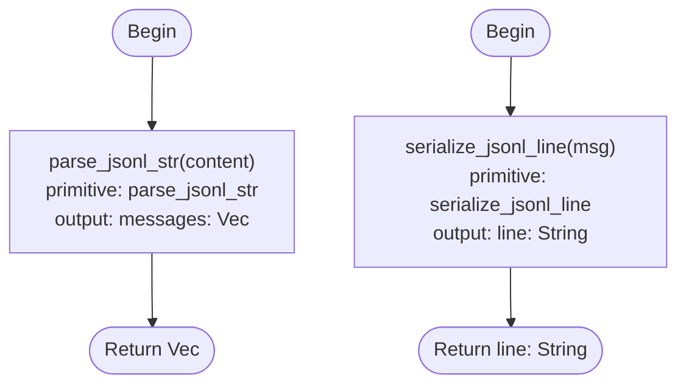

# JSONL String Primitives

## Overview
<!-- type: overview lang: markdown -->

This spec introduces two new primitive vocabulary entries to the Mermaid Plus
flowchart code generation system: `parse_jsonl_str` and `serialize_jsonl_line`.

`parse_jsonl_str` reads a JSONL string (e.g. the full contents of a channel
file already loaded into memory) and deserialises each non-empty line via
`serde_json::from_str`, silently dropping malformed lines. Output is
`Vec<T>` where T is the target struct. This is infallible at the primitive
level — parse errors per-line are swallowed, matching the existing
`parse_channel_jsonl` behaviour.

`serialize_jsonl_line` serialises a single value to a JSON string with a
trailing newline character, suitable for POSIX-atomic `O_APPEND` writes to a
JSONL channel file. It is fallible (`serde_json::to_string` returns `Result`)
and the `?` operator propagates `serde_json::Error` to the enclosing function.

Adding these two entries closes the primitive vocabulary gap that blocked a
future generated implementation of `parse_channel_jsonl` and
`serialize_message_jsonl` in `projects/agentic-workflow/src/cli/chat_members.rs`.
The functions still remain tracked hand-written code today because the logic
generator cannot yet emit anchored multi-function replacements from this
primitive-bound flowchart shape. That remaining generator gap must close before
their `HANDWRITE-BEGIN`/`END` markers can be replaced with `CODEGEN-BEGIN`/`END`
+ `SPEC-REF` annotations.

The PrimitiveKind enum in `flowchart_plus/schema.rs` gains two new variants
(`ParseJsonlStr`, `SerializeJsonlLine`) and the static `REGISTRY` in
`primitive_registry.rs` gains two new `PrimitiveEntry` rows. The registry
size assertion in tests is updated from 15 to 17.
## Schema: ParseJsonlStr and SerializeJsonlLine
<!-- type: schema lang: yaml -->

```yaml
$schema: "https://json-schema.org/draft/2020-12/schema"
$id: jsonl-str-primitives#schema
title: JSONL String Primitive Entries
description: >
  Schema additions for two new PrimitiveKind variants and their PrimitiveEntry
  rows in the static REGISTRY. These close the vocabulary gap that blocked
  parse_channel_jsonl and serialize_message_jsonl from being codegen-driven.

definitions:
  ParseJsonlStrEntry:
    $ref: "mermaid-plus-primitive-vocabulary#/definitions/PrimitiveEntry"
    description: >
      parse_jsonl_str: splits a &str on newlines, deserialises each non-empty
      line via serde_json::from_str::<T>(), and collects successes into Vec<T>.
      Malformed lines are silently dropped (infallible at primitive level).
    x-entry:
      name: parse_jsonl_str
      category: serde
      inputs:
        - name: content
          field_type: string
      output_type: "Vec<T>"
      generic_params: [T]
      fallible: false
      emit_template_id: parse_jsonl_str
      emit_template: >-
        let {out}: Vec<{T}> = {content}.lines()
          .filter(|l| !l.trim().is_empty())
          .filter_map(|l| serde_json::from_str(l.trim()).ok())
          .collect();

  SerializeJsonlLineEntry:
    $ref: "mermaid-plus-primitive-vocabulary#/definitions/PrimitiveEntry"
    description: >
      serialize_jsonl_line: serialises a &T: Serialize to a JSON string and
      appends a newline, producing a single JSONL line ready for O_APPEND write.
      Fallible: serde_json::to_string returns Result; the ? operator propagates
      serde_json::Error to the enclosing function's Result return type.
    x-entry:
      name: serialize_jsonl_line
      category: serde
      inputs:
        - name: value
          field_type: T
      output_type: string
      generic_params: [T]
      fallible: true
      emit_template_id: serialize_jsonl_line
      emit_template: >-
        let {out} = format!("{}\n", serde_json::to_string(&{value})?);

  PrimitiveKindExtension:
    description: >
      Two new variants appended to the PrimitiveKind enum in
      projects/agentic-workflow/src/generate/diagrams/flowchart_plus/schema.rs.
      Placed in the JSONL stream IO group alongside existing variants.
    type: object
    properties:
      variants:
        type: array
        items:
          type: string
        x-values:
          - ParseJsonlStr
          - SerializeJsonlLine
```
## Logic: parse_channel_jsonl and serialize_message_jsonl
<!-- type: logic lang: mermaid -->


## Tests: primitive registry coverage
<!-- type: tests lang: yaml -->

```yaml
tests:
  - id: T1
    name: test_lookup_parse_jsonl_str_returns_entry
    kind: unit
    description: >
      parse_jsonl_str is registered in REGISTRY with infallible=false,
      output_type Vec<T>, and an emit_template containing both
      serde_json::from_str and .lines().
    setup:
      import: crate::generate::generators::primitive_registry
    assertions:
      - expr: "lookup(&PrimitiveKind::ParseJsonlStr).is_some()"
        expect: true
      - expr: "lookup(&PrimitiveKind::ParseJsonlStr).unwrap().name"
        expect: '"parse_jsonl_str"'
      - expr: "lookup(&PrimitiveKind::ParseJsonlStr).unwrap().fallible"
        expect: false
      - expr: "lookup(&PrimitiveKind::ParseJsonlStr).unwrap().output_type"
        expect: '"Vec<T>"'
      - expr: "lookup(&PrimitiveKind::ParseJsonlStr).unwrap().emit_template.contains(\"serde_json::from_str\")"
        expect: true
      - expr: "lookup(&PrimitiveKind::ParseJsonlStr).unwrap().emit_template.contains(\".lines()\")"
        expect: true

  - id: T2
    name: test_lookup_serialize_jsonl_line_returns_entry
    kind: unit
    description: >
      serialize_jsonl_line is registered in REGISTRY with fallible=true,
      output_type string, and an emit_template containing serde_json::to_string
      and a trailing newline.
    setup:
      import: crate::generate::generators::primitive_registry
    assertions:
      - expr: "lookup(&PrimitiveKind::SerializeJsonlLine).is_some()"
        expect: true
      - expr: "lookup(&PrimitiveKind::SerializeJsonlLine).unwrap().name"
        expect: '"serialize_jsonl_line"'
      - expr: "lookup(&PrimitiveKind::SerializeJsonlLine).unwrap().fallible"
        expect: true
      - expr: "lookup(&PrimitiveKind::SerializeJsonlLine).unwrap().output_type"
        expect: '"string"'
      - expr: "lookup(&PrimitiveKind::SerializeJsonlLine).unwrap().emit_template.contains(\"serde_json::to_string\")"
        expect: true
      - expr: "lookup(&PrimitiveKind::SerializeJsonlLine).unwrap().emit_template.contains(\"\\\\n\")"
        expect: true

  - id: T3
    name: test_registry_has_seventeen_entries
    kind: unit
    description: >
      REGISTRY has exactly 17 entries: 15 from the previous registry
      (score-chat-jsonl-migration bootstrap) plus 2 new entries
      (parse_jsonl_str, serialize_jsonl_line).
    setup:
      import: crate::generate::generators::primitive_registry
    assertions:
      - expr: "REGISTRY.len()"
        expect: 17
```
## Changes
<!-- type: changes lang: yaml -->

```yaml
changes:
  - path: projects/agentic-workflow/src/generate/diagrams/flowchart_plus/schema.rs
    action: modify
    section: schema
    impl_mode: hand-written
    description: >
      Add two PrimitiveKind variants: ParseJsonlStr and SerializeJsonlLine.
      Place them in the JSONL stream IO group alongside ParseJsonlStream and
      AppendLineAtomic. The additions are inside the existing CODEGEN-BEGIN
      (primitive-vocabulary) block since the file is spec-managed.

  - path: projects/agentic-workflow/src/generate/generators/primitive_registry.rs
    action: modify
    section: schema
    impl_mode: hand-written
    description: >
      Add two PrimitiveEntry rows to the static REGISTRY constant for
      parse_jsonl_str and serialize_jsonl_line, using the emit_template strings
      defined in this spec. Add two arms to kind_to_name for ParseJsonlStr and
      SerializeJsonlLine. Update the registry-size assertion in tests from 15
      to 17. Add tests T1 (test_lookup_parse_jsonl_str_returns_entry),
      T2 (test_lookup_serialize_jsonl_line_returns_entry), and T3
      (test_registry_has_seventeen_entries) in the existing tests module.

  - path: projects/agentic-workflow/tech-design/surface/specs/score-chat-jsonl-migration.md
    action: modify
    section: logic
    impl_mode: hand-written
    description: >
      Append a Logic: parse_channel_jsonl block with a primitive-bound flowchart
      referencing primitive: parse_jsonl_str and type_arg T: ChannelMessage.
      Append a Logic: serialize_message_jsonl block referencing primitive:
      serialize_jsonl_line and type_arg T: ChannelMessage. Update the changes
      section to record that the HANDWRITE-BEGIN/END markers are replaced by
      CODEGEN-BEGIN/END + SPEC-REF annotations after running aw td gen-code.

  - path: projects/agentic-workflow/tech-design/surface/specs/mermaid-plus-primitive-vocabulary.md
    action: modify
    section: schema
    impl_mode: hand-written
    description: >
      Add parse_jsonl_str and serialize_jsonl_line to the PrimitiveKind enum
      list in the schema section, grouped with the JSONL stream IO comment
      alongside parse_jsonl_stream, append_line_atomic, and run_subprocess.
      Add full PrimitiveEntry rows for both new primitives in the serde
      category x-entries block.

  - path: projects/agentic-workflow/src/cli/chat_members.rs
    action: modify
    section: logic
    impl_mode: hand-written
    description: >
      Keep parse_channel_jsonl and serialize_message_jsonl as tracked
      hand-written logic until the logic generator can emit anchored
      multi-function replacements for primitive-bound flowcharts. A stale
      unattached CODEGEN start() skeleton must not claim this section.
  - action: annotate
    section: unit-test
    impl_mode: hand-written
    description: "Traceability metadata edge for the unit-test section."

```

# Reviews

## Review 1
<!-- type: doc lang: markdown -->

**Verdict:** approved

- [schema] `serialize_jsonl_line` correctly has `fallible: true` and the emit template uses `format!("{}\n", serde_json::to_string(&{value})?)` — semantically equivalent to the R4 formulation and unambiguous for codegen.
- [schema] `parse_jsonl_str` emit template correctly chains `.lines()`, blank-line filter, and `.filter_map(...ok())` into `Vec<{T}>` — matches the infallible contract.
- [changes] `chat_members.rs` entry records the current remaining generator gap as `impl_mode: hand-written`; the primitive vocabulary is ready, but the function-anchored CODEGEN swap is still blocked by logic generator routing.
- [tests] T1–T3 cover registration, fallibility flag, output_type, and template content for both primitives plus the registry-size assertion bump to 17 — sufficient for R9/R10 gate.
- [logic] Two-flow Mermaid Plus diagram correctly encodes primitive-bound nodes with `type_args: T: ChannelMessage` for both functions, satisfying R5 and R6.
