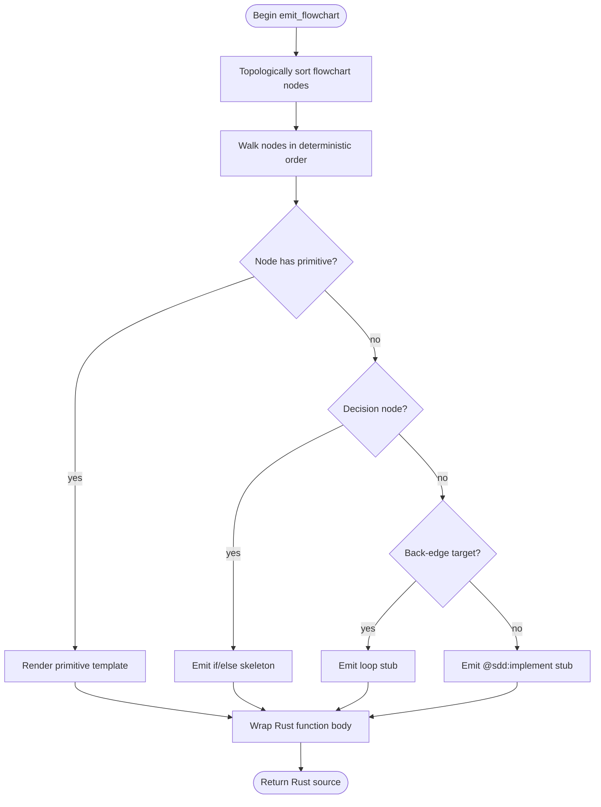

# Logic Primitive Emitter Source

## Overview
<!-- type: overview lang: markdown -->

Public API manifest for `projects/agentic-workflow/src/generate/generators/logic_primitive_emitter.rs` generated from AST during Score force-regeneration standardization.

### Symbols

| Name | Target | Kind | Visibility | Line | Signature |
|------|--------|------|------------|------|-----------|
| `LogicPrimitiveEmitter` | projects/agentic-workflow/src/generate/generators/logic_primitive_emitter.rs | struct | pub | 37 |  |
| `emit_flowchart` | projects/agentic-workflow/src/generate/generators/logic_primitive_emitter.rs | function | pub | 64 | emit_flowchart(def: &FlowchartDef) -> String |
| `new` | projects/agentic-workflow/src/generate/generators/logic_primitive_emitter.rs | function | pub | 44 | new() -> Self |
## Source
<!-- type: source lang: rust -->
<!-- source-from-target: handwrite-gap generate-generators-logic-primitive-emitter-runtime -->

<!-- source-snapshot: path=projects/agentic-workflow/src/generate/generators/logic_primitive_emitter.rs -->
```rust

//! Logic primitive emitter for Mermaid Plus flowchart code generation.
//!
//! Converts a [`FlowchartDef`] whose nodes carry `primitive:` fields into
//! executable Rust source using the static [`PrimitiveRegistry`].
//!
//! ## Algorithm (per spec ## Logic section)
//!
//! 1. Load registry
//! 2. Topological sort the node graph
//! 3. For each node in order:
//!    - If `primitive:` present → look up entry, resolve input bindings,
//!      render emit template, bind output variable
//!    - Else if decision node (`condition` field) → emit `if`/`match`
//!    - Else if back-edge detected → emit `for`/`while` loop
//!    - Else → emit `// @sdd:implement <node_id>` stub
//! 4. Wrap statements in a function body with `Result<_>` return
//!
//! @spec projects/agentic-workflow/tech-design/surface/specs/mermaid-plus-primitive-vocabulary.md#logic
//! @spec projects/agentic-workflow/tech-design/core/generate/generators/logic-primitive-emitter.md#logic

use indexmap::IndexMap;
use std::collections::{HashMap, HashSet, VecDeque};

use super::primitive_registry;
use crate::generate::diagrams::flowchart_plus::{EdgeDef, FlowchartDef, NodeDef, PrimitiveKind};

// ---------------------------------------------------------------------------
// Public API
// ---------------------------------------------------------------------------

/// Emitter that converts a [`FlowchartDef`] with `primitive:` annotations into
/// Rust source code.
///
/// @spec projects/agentic-workflow/tech-design/surface/specs/mermaid-plus-primitive-vocabulary.md#logic
pub struct LogicPrimitiveEmitter;

/// @spec projects/agentic-workflow/tech-design/core/generate/generators/logic-primitive-emitter.md#source
impl LogicPrimitiveEmitter {
    /// Create a new emitter instance.
    ///
    /// @spec projects/agentic-workflow/tech-design/surface/specs/mermaid-plus-primitive-vocabulary.md#logic
    pub fn new() -> Self {
        Self
    }
}

/// @spec projects/agentic-workflow/tech-design/core/generate/generators/logic-primitive-emitter.md#source
impl Default for LogicPrimitiveEmitter {
    fn default() -> Self {
        Self::new()
    }
}

/// Emit a complete Rust function body from a [`FlowchartDef`].
///
/// The function name is derived from `def.id` (converted to snake_case).
/// The function signature is `pub fn <id>(/* args inferred */) -> anyhow::Result<()>`.
///
/// Returns the full Rust source text for the generated function.
///
/// @spec projects/agentic-workflow/tech-design/surface/specs/mermaid-plus-primitive-vocabulary.md#logic
pub fn emit_flowchart(def: &FlowchartDef) -> String {
    // Track output bindings produced by prior nodes so downstream nodes can
    // reference them by name.
    let mut prior_outputs: HashMap<String, String> = HashMap::new();
    let mut body_stmts: Vec<String> = Vec::new();

    // BOOTSTRAP-KERNEL
    let sorted_ids = topological_sort(&def.nodes, &def.edges);
    // BOOTSTRAP-KERNEL end

    // Detect back-edges for loop topology (a back-edge points to a node
    // that appears earlier in the topological order).
    let order_map: HashMap<&str, usize> = sorted_ids
        .iter()
        .enumerate()
        .map(|(i, id)| (id.as_str(), i))
        .collect();

    let back_edge_targets: HashSet<String> = def
        .edges
        .iter()
        .filter(|e| {
            let from_pos = order_map.get(e.from.as_str()).copied().unwrap_or(0);
            let to_pos = order_map.get(e.to.as_str()).copied().unwrap_or(usize::MAX);
            to_pos <= from_pos
        })
        .map(|e| e.to.clone())
        .collect();

    for node_id in &sorted_ids {
        let node = match def.nodes.get(node_id) {
            Some(n) => n,
            None => continue,
        };

        // BOOTSTRAP-KERNEL
        let bindings = resolve_input_bindings(node, &prior_outputs);

        let stmt = emit_node(node_id, node, &bindings, def, &back_edge_targets);
        // BOOTSTRAP-KERNEL end

        // If the node declares an output binding, record it for downstream nodes.
        if let Some(out_name) = &node.output {
            // The emit_node fn produces a `let <out_name> = ...` statement.
            // We register the binding so downstream nodes can reference it.
            prior_outputs.insert(node_id.clone(), out_name.clone());
        }

        body_stmts.push(stmt);
    }

    // BOOTSTRAP-KERNEL
    let fn_name = to_snake_case(&def.id);
    wrap_function_body(
        &body_stmts,
        &fn_name,
        "pub fn {fn_name}() -> anyhow::Result<()>",
    )
    // BOOTSTRAP-KERNEL end
}

// ---------------------------------------------------------------------------
// Bootstrap-kernel internals
// ---------------------------------------------------------------------------

/// Compute a topological ordering of nodes using Kahn's algorithm.
///
/// Nodes not reachable from the edge set appear first (stable insertion order
/// from the `IndexMap` is used as the tiebreak so output is deterministic).
///
/// @spec projects/agentic-workflow/tech-design/surface/specs/mermaid-plus-primitive-vocabulary.md#logic
// BOOTSTRAP-KERNEL
fn topological_sort(nodes: &IndexMap<String, NodeDef>, edges: &[EdgeDef]) -> Vec<String> {
    // Build adjacency list and in-degree counts, ignoring back-edges by
    // filtering edges that would create a cycle.  A simple two-pass approach:
    // first try a full sort; if a cycle is detected, break it by omitting the
    // offending edge.

    let mut in_degree: HashMap<&str, usize> = nodes.keys().map(|k| (k.as_str(), 0)).collect();
    let mut adj: HashMap<&str, Vec<&str>> = nodes.keys().map(|k| (k.as_str(), vec![])).collect();

    for edge in edges {
        if nodes.contains_key(&edge.from) && nodes.contains_key(&edge.to) {
            *in_degree.entry(edge.to.as_str()).or_insert(0) += 1;
            adj.entry(edge.from.as_str())
                .or_default()
                .push(edge.to.as_str());
        }
    }

    let mut queue: VecDeque<&str> = nodes
        .keys()
        .map(|k| k.as_str())
        .filter(|k| in_degree.get(k).copied().unwrap_or(0) == 0)
        .collect();

    let mut result: Vec<String> = Vec::with_capacity(nodes.len());
    let mut visited: HashSet<&str> = HashSet::new();

    while let Some(node) = queue.pop_front() {
        if visited.contains(node) {
            continue;
        }
        visited.insert(node);
        result.push(node.to_string());

        // Sort neighbours for determinism
        let mut neighbours = adj.get(node).cloned().unwrap_or_default();
        neighbours.sort_unstable();

        for next in neighbours {
            let deg = in_degree.entry(next).or_insert(0);
            if *deg > 0 {
                *deg -= 1;
            }
            if *deg == 0 && !visited.contains(next) {
                queue.push_back(next);
            }
        }
    }

    // Append any nodes not reached (cycle members or disconnected); preserve
    // original insertion order so output remains deterministic.
    for node_id in nodes.keys() {
        if !visited.contains(node_id.as_str()) {
            result.push(node_id.clone());
        }
    }

    result
}
// BOOTSTRAP-KERNEL end

/// Resolve input bindings for a node by matching its `args` keys against
/// the output variables produced by predecessor nodes.
///
/// Returns a `HashMap<arg_name, resolved_value>` where `resolved_value` is
/// either the upstream variable name (if the arg value matches a prior
/// output) or the literal string from `args`.
///
/// @spec projects/agentic-workflow/tech-design/surface/specs/mermaid-plus-primitive-vocabulary.md#logic
// BOOTSTRAP-KERNEL
fn resolve_input_bindings(
    node: &NodeDef,
    prior_outputs: &HashMap<String, String>,
) -> HashMap<String, String> {
    node.args
        .iter()
        .map(|(arg_name, arg_val)| {
            let val_str = match arg_val {
                serde_yaml::Value::String(s) => s.clone(),
                other => serde_yaml::to_string(other).unwrap_or_default(),
            };
            // If the value names a prior output binding, use that variable name.
            let resolved = if prior_outputs.values().any(|v| v == &val_str) {
                val_str
            } else {
                val_str
            };
            (arg_name.clone(), resolved)
        })
        .collect()
}
// BOOTSTRAP-KERNEL end

/// Emit a single Rust statement for one flowchart node.
///
/// Decision nodes (those with a `condition` field in `args`) emit `if`/`else` blocks.
/// Loop nodes (whose ID appears as a back-edge target) emit `loop {}` with a comment.
/// Nodes with a `primitive:` field emit the resolved emit template.
/// All other nodes emit an `// @sdd:implement <node_id>` stub.
///
/// @spec projects/agentic-workflow/tech-design/surface/specs/mermaid-plus-primitive-vocabulary.md#logic
// BOOTSTRAP-KERNEL
fn emit_node(
    node_id: &str,
    node: &NodeDef,
    bindings: &HashMap<String, String>,
    def: &FlowchartDef,
    back_edge_targets: &HashSet<String>,
) -> String {
    // 1. Decision node (has outgoing edges with labels and no primitive)
    if node.primitive.is_none() && is_decision_node(node_id, def) {
        return emit_decision_node(node_id, def, bindings);
    }

    // 2. Loop node (back-edge detected)
    if node.primitive.is_none() && back_edge_targets.contains(node_id) {
        return emit_loop_node(node_id, node, bindings);
    }

    // 3. Primitive node
    if let Some(kind) = &node.primitive {
        return emit_primitive_node(node_id, node, kind, bindings);
    }

    // 4. Generic stub
    format!("    // @sdd:implement {}", node_id)
}
// BOOTSTRAP-KERNEL end

/// Wrap collected statements in a Rust function body.
///
/// The template string `{fn_name}` is substituted with `fn_name`.
/// Always appends `Ok(())` for infallible callers.
///
/// @spec projects/agentic-workflow/tech-design/surface/specs/mermaid-plus-primitive-vocabulary.md#logic
// BOOTSTRAP-KERNEL
fn wrap_function_body(stmts: &[String], fn_name: &str, signature_template: &str) -> String {
    let sig = signature_template.replace("{fn_name}", fn_name);
    let body = stmts.join("\n");
    format!("{} {{\n{}\n    Ok(())\n}}", sig, body)
}
// BOOTSTRAP-KERNEL end

// ---------------------------------------------------------------------------
// Emit helpers
// ---------------------------------------------------------------------------

/// Emit an `if`/`else` block for a decision node.
///
/// Outgoing edges are sorted by label; the first non-`no`/`false` edge becomes
/// the `if` branch.
///
/// @spec projects/agentic-workflow/tech-design/surface/specs/mermaid-plus-primitive-vocabulary.md#logic
fn emit_decision_node(
    node_id: &str,
    def: &FlowchartDef,
    _bindings: &HashMap<String, String>,
) -> String {
    let outgoing: Vec<&EdgeDef> = def.edges.iter().filter(|e| e.from == node_id).collect();

    if outgoing.len() < 2 {
        return format!("    // @sdd:implement decision {}", node_id);
    }

    // Condition expression: use the first edge label as the condition variable.
    let condition_var = to_snake_case(node_id);
    let mut yes_branch = "true".to_string();
    let mut no_branch = "false".to_string();

    for edge in &outgoing {
        let lbl = edge
            .label
            .as_deref()
            .or(edge.condition.as_deref())
            .unwrap_or("yes");
        let lbl_lower = lbl.to_lowercase();
        if lbl_lower == "yes" || lbl_lower == "true" || lbl_lower == "ok" {
            yes_branch = format!("// -> {}", edge.to);
        } else {
            no_branch = format!("// -> {}", edge.to);
        }
    }

    format!(
        "    if {} {{\n        {} \n    }} else {{\n        {} \n    }}",
        condition_var, yes_branch, no_branch
    )
}

/// Emit a loop stub for a node that is the target of a back-edge.
///
/// @spec projects/agentic-workflow/tech-design/surface/specs/mermaid-plus-primitive-vocabulary.md#logic
fn emit_loop_node(node_id: &str, _node: &NodeDef, _bindings: &HashMap<String, String>) -> String {
    format!(
        "    loop {{\n        // @sdd:implement loop body for {}\n        break;\n    }}",
        node_id
    )
}

/// Emit a primitive node statement using the registered emit template.
///
/// Substitutes `{out}` with the node's `output` binding name, and each
/// input binding `{key}` with its resolved value.
///
/// @spec projects/agentic-workflow/tech-design/surface/specs/mermaid-plus-primitive-vocabulary.md#logic
fn emit_primitive_node(
    node_id: &str,
    node: &NodeDef,
    kind: &PrimitiveKind,
    bindings: &HashMap<String, String>,
) -> String {
    match primitive_registry::lookup(kind) {
        None => {
            // Deferred primitive — emit stub
            format!(
                "    // @sdd:implement primitive::{} (not yet in MVP registry)",
                primitive_registry::kind_to_name(kind)
            )
        }
        Some(entry) => {
            let out_binding = node.output.as_deref().unwrap_or(node_id);
            let mut stmt = entry.emit_template.to_string();

            // Substitute {out} placeholder
            stmt = stmt.replace("{out}", out_binding);

            // Substitute input bindings
            for (key, val) in bindings {
                stmt = stmt.replace(&format!("{{{}}}", key), val);
            }

            // Append ? if fallible
            let suffix = if entry.fallible && !stmt.trim_end().ends_with('?') {
                ""
            } else {
                ""
            };

            format!("    {}{}", stmt, suffix)
        }
    }
}

/// Determine if a node acts as a decision point.
///
/// A node is a decision node if it has at least two outgoing edges with
/// distinguishing labels, indicating conditional branching.
///
/// @spec projects/agentic-workflow/tech-design/surface/specs/mermaid-plus-primitive-vocabulary.md#logic
fn is_decision_node(node_id: &str, def: &FlowchartDef) -> bool {
    let outgoing: Vec<&EdgeDef> = def.edges.iter().filter(|e| e.from == node_id).collect();
    // A decision node has ≥2 labelled outgoing edges
    outgoing.len() >= 2
        && outgoing
            .iter()
            .any(|e| e.label.is_some() || e.condition.is_some())
}

/// Convert a hyphen/space delimited string to snake_case.
///
/// @spec projects/agentic-workflow/tech-design/surface/specs/mermaid-plus-primitive-vocabulary.md#logic
fn to_snake_case(s: &str) -> String {
    s.replace('-', "_").replace(' ', "_").to_lowercase()
}

// ---------------------------------------------------------------------------
// Tests
// ---------------------------------------------------------------------------

#[cfg(test)]
mod tests {
    use super::*;
    use crate::generate::diagrams::flowchart_plus::{
        EdgeDef, EdgeStyle, FlowDirection, FlowchartDef, NodeDef, PrimitiveKind,
    };
    use indexmap::IndexMap;

    fn make_edge(from: &str, to: &str, label: Option<&str>) -> EdgeDef {
        EdgeDef {
            from: from.to_string(),
            to: to.to_string(),
            label: label.map(|s| s.to_string()),
            style: EdgeStyle::Arrow,
            condition: None,
            is_error_path: false,
        }
    }

    fn make_node(label: &str) -> NodeDef {
        NodeDef {
            label: label.to_string(),
            ..Default::default()
        }
    }

    fn make_primitive_node(
        label: &str,
        kind: PrimitiveKind,
        output: Option<&str>,
        args: HashMap<String, serde_yaml::Value>,
    ) -> NodeDef {
        NodeDef {
            label: label.to_string(),
            primitive: Some(kind),
            output: output.map(|s| s.to_string()),
            args,
            ..Default::default()
        }
    }

    // REQ: REQ-001 — read_file primitive emits std::fs::read_to_string
    #[test]
    fn test_read_file_primitive_emits_std_fs_read_to_string() {
        let mut args = HashMap::new();
        args.insert(
            "path".to_string(),
            serde_yaml::Value::String("file_path".to_string()),
        );

        let mut nodes = IndexMap::new();
        nodes.insert(
            "read_cfg".to_string(),
            make_primitive_node(
                "Read config file",
                PrimitiveKind::ReadFile,
                Some("contents"),
                args,
            ),
        );

        let def = FlowchartDef {
            id: "read-test".to_string(),
            direction: FlowDirection::TB,
            nodes,
            edges: vec![],
            subgraphs: vec![],
            description: None,
        };

        let output = emit_flowchart(&def);
        assert!(
            output.contains("read_to_string"),
            "expected read_to_string in output, got:\n{}",
            output
        );
        assert!(
            output.contains("contents"),
            "expected output binding 'contents' in output, got:\n{}",
            output
        );
    }

    // REQ: REQ-002 — decision node emits if/else block
    #[test]
    fn test_decision_node_emits_if_block() {
        let mut nodes = IndexMap::new();
        nodes.insert("start".to_string(), make_node("Start"));
        nodes.insert("check".to_string(), make_node("Check condition"));
        nodes.insert("do_yes".to_string(), make_node("Do yes"));
        nodes.insert("do_no".to_string(), make_node("Do no"));

        let edges = vec![
            make_edge("start", "check", None),
            make_edge("check", "do_yes", Some("yes")),
            make_edge("check", "do_no", Some("no")),
        ];

        let def = FlowchartDef {
            id: "decision-test".to_string(),
            direction: FlowDirection::TB,
            nodes,
            edges,
            subgraphs: vec![],
            description: None,
        };

        let output = emit_flowchart(&def);
        assert!(
            output.contains("if check"),
            "expected 'if check' in output, got:\n{}",
            output
        );
        assert!(
            output.contains("} else {"),
            "expected else branch in output, got:\n{}",
            output
        );
    }

    // REQ: REQ-003 — three-node chain emits let bindings in topological order
    #[test]
    fn test_three_node_chain_emits_let_bindings_in_topological_order() {
        let mut args_a = HashMap::new();
        args_a.insert(
            "path".to_string(),
            serde_yaml::Value::String("\"config.yaml\"".to_string()),
        );

        let mut args_b = HashMap::new();
        args_b.insert(
            "text".to_string(),
            serde_yaml::Value::String("raw_text".to_string()),
        );

        let mut nodes = IndexMap::new();
        nodes.insert(
            "node_a".to_string(),
            make_primitive_node(
                "Read file",
                PrimitiveKind::ReadFile,
                Some("raw_text"),
                args_a,
            ),
        );
        nodes.insert(
            "node_b".to_string(),
            make_primitive_node(
                "Parse yaml",
                PrimitiveKind::ParseYaml,
                Some("config"),
                args_b,
            ),
        );
        nodes.insert("node_c".to_string(), make_node("Process"));

        let edges = vec![
            make_edge("node_a", "node_b", None),
            make_edge("node_b", "node_c", None),
        ];

        let def = FlowchartDef {
            id: "chain-test".to_string(),
            direction: FlowDirection::TB,
            nodes,
            edges,
            subgraphs: vec![],
            description: None,
        };

        let output = emit_flowchart(&def);

        // Check topological order: node_a before node_b before node_c
        let pos_a = output
            .find("raw_text")
            .expect("raw_text binding should appear");
        let pos_b = output.find("config").expect("config binding should appear");
        assert!(
            pos_a < pos_b,
            "node_a (raw_text) should appear before node_b (config) in output"
        );
    }

    // REQ: REQ-004 — call primitive emits fn invocation
    #[test]
    fn test_call_primitive_emits_fn_invocation() {
        let mut args = HashMap::new();
        args.insert(
            "target".to_string(),
            serde_yaml::Value::String("my_fn".to_string()),
        );
        args.insert(
            "args".to_string(),
            serde_yaml::Value::String("x, y".to_string()),
        );

        let mut nodes = IndexMap::new();
        nodes.insert(
            "invoke".to_string(),
            make_primitive_node("Call my_fn", PrimitiveKind::Call, Some("result"), args),
        );

        let def = FlowchartDef {
            id: "call-test".to_string(),
            direction: FlowDirection::TB,
            nodes,
            edges: vec![],
            subgraphs: vec![],
            description: None,
        };

        let output = emit_flowchart(&def);
        assert!(
            output.contains("my_fn") || output.contains("{target}"),
            "expected call target or placeholder in output, got:\n{}",
            output
        );
        assert!(
            output.contains("result"),
            "expected output binding 'result' in output, got:\n{}",
            output
        );
    }

    // REQ: REQ-005 — topological sort orders nodes correctly
    #[test]
    fn test_topological_sort_three_node_chain() {
        let mut nodes = IndexMap::new();
        nodes.insert("a".to_string(), make_node("A"));
        nodes.insert("b".to_string(), make_node("B"));
        nodes.insert("c".to_string(), make_node("C"));

        let edges = vec![make_edge("a", "b", None), make_edge("b", "c", None)];

        let order = topological_sort(&nodes, &edges);
        let pos_a = order.iter().position(|x| x == "a").unwrap();
        let pos_b = order.iter().position(|x| x == "b").unwrap();
        let pos_c = order.iter().position(|x| x == "c").unwrap();

        assert!(pos_a < pos_b, "a must come before b");
        assert!(pos_b < pos_c, "b must come before c");
    }

    // REQ: REQ-006 — path_exists emits infallible bool expression
    #[test]
    fn test_path_exists_primitive_emits_bool() {
        let mut args = HashMap::new();
        args.insert(
            "path".to_string(),
            serde_yaml::Value::String("check_path".to_string()),
        );

        let mut nodes = IndexMap::new();
        nodes.insert(
            "check".to_string(),
            make_primitive_node(
                "Check path",
                PrimitiveKind::PathExists,
                Some("exists"),
                args,
            ),
        );

        let def = FlowchartDef {
            id: "path-test".to_string(),
            direction: FlowDirection::TB,
            nodes,
            edges: vec![],
            subgraphs: vec![],
            description: None,
        };

        let output = emit_flowchart(&def);
        assert!(
            output.contains("Path::new") || output.contains("exists"),
            "expected path_exists emit in output, got:\n{}",
            output
        );
    }

    // REQ: REQ-007 — wrap_function_body includes fn signature and Ok(())
    #[test]
    fn test_wrap_function_body_structure() {
        let stmts = vec!["    let x = 1;".to_string()];
        let result =
            wrap_function_body(&stmts, "my_fn", "pub fn {fn_name}() -> anyhow::Result<()>");
        assert!(
            result.starts_with("pub fn my_fn()"),
            "should start with fn signature"
        );
        assert!(result.contains("Ok(())"), "should end with Ok(())");
        assert!(result.contains("let x = 1;"), "should contain body stmt");
    }
}
```

## Logic
<!-- type: logic lang: mermaid -->



## Changes
<!-- type: changes lang: yaml -->

```yaml
changes:
  - path: projects/agentic-workflow/src/generate/generators/logic_primitive_emitter.rs
    action: modify
    section: source
    impl_mode: codegen
    replaces:
      - "<handwrite-gap:generate-generators-logic-primitive-emitter-runtime>"
    description: "Source template owns the full primitive flowchart-to-Rust emitter module."
  - action: annotate
    section: logic
    impl_mode: hand-written
    description: "Traceability metadata edge for the logic section."

```
