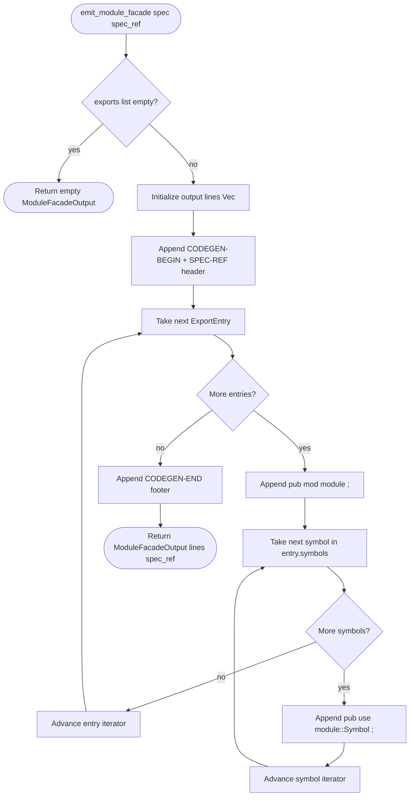
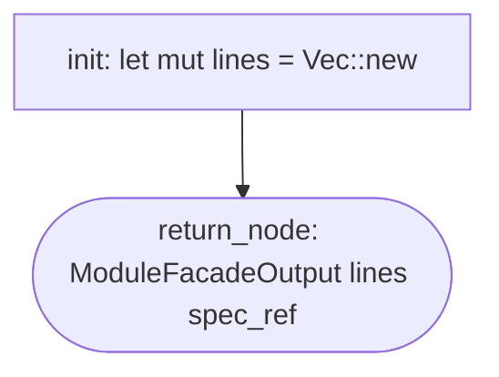

# Module-Facade Generator

## Overview
<!-- type: overview lang: markdown -->

`projects/agentic-workflow/src/generate/generators/module_facade.rs` is a new codegen primitive that
emits an optional module preamble, external `pub use <path>;` re-exports, `pub mod <name>;`
declarations, and `pub use <name>::<Symbol>;` re-exports for a Rust module hierarchy
described by the `preamble:`, `pub_uses:`, and `exports:` fields in a spec change entry.

Three existing `HANDWRITE-BEGIN/END` blocks across `td_ast/mod.rs`, `td_ast/entities.rs`,
and `validate/rules/section_format.rs` remain on main because the codegen pipeline has no
generator capable of producing module-facade boilerplate from a spec.
This generator closes that gap: after merging, `aw td gen-code` replaces those three
blocks with `CODEGEN-BEGIN/END` blocks referencing the consuming specs.

Input contract: a `ChangeEntry` carrying any of:
`preamble:` raw Rust lines, `pub_uses:` external paths, and `exports:` ordered
`{module, symbols}` pairs. The preamble is emitted first, each external path emits one
`pub use <path>;`, then each export pair emits one `pub mod module;` line followed by one
`pub use module::Symbol;` line per symbol in the list. Empty fields produce no output
(idempotent zero-item case).

Output is wrapped in canonical `CODEGEN-BEGIN` / `CODEGEN-END` markers with a `SPEC-REF`
line pointing back to the source spec section anchor (R4).
## Requirements

```mermaid
---
id: sdd-codegen-module-facade-requirements
requirements:
  emit_pub_mod:
    id: R1
    text: "emit_module_facade MUST emit pub mod declarations for each entry in the exports list."
    kind: functional
    risk: high
    verify: test
  emit_pub_use:
    id: R2
    text: "emit_module_facade MUST emit pub use re-exports for each symbol in each exports entry."
    kind: functional
    risk: high
    verify: test
  empty_list:
    id: R3
    text: "An empty exports list MUST produce no output lines."
    kind: functional
    risk: high
    verify: test
  codegen_markers:
    id: R4
    text: "All emitted code MUST be wrapped in CODEGEN-BEGIN/CODEGEN-END markers with a SPEC-REF line."
    kind: functional
    risk: high
    verify: test
  unit_tests:
    id: R5
    text: "The generator MUST have unit tests covering empty, single-item, multi-item, and snapshot cases."
    kind: functional
    risk: high
    verify: test
  emit_preamble:
    id: R7
    text: "emit_module_facade MUST emit an optional raw module preamble before any re-export or module declaration."
    kind: functional
    risk: high
    verify: test
  emit_external_pub_uses:
    id: R8
    text: "emit_module_facade MUST emit external pub-use paths before module facade declarations."
    kind: functional
    risk: high
    verify: test
  handwrite_replaced:
    id: R6
    text: "HANDWRITE-BEGIN/END blocks at td_ast/mod.rs and td_ast/entities.rs MUST be replaced with CODEGEN-BEGIN/END blocks."
    kind: functional
    risk: high
    verify: inspection
elements: {}
relations: []
---
requirementDiagram
    requirement R1 {
      id: R1
      text: "emit_module_facade emits pub mod declarations"
      risk: High
      verifymethod: Test
    }
    requirement R2 {
      id: R2
      text: "emit_module_facade emits pub use re-exports"
      risk: High
      verifymethod: Test
    }
    requirement R3 {
      id: R3
      text: "empty exports list produces no output"
      risk: High
      verifymethod: Test
    }
    requirement R4 {
      id: R4
      text: "output wrapped in CODEGEN-BEGIN/CODEGEN-END with SPEC-REF"
      risk: High
      verifymethod: Test
    }
    requirement R5 {
      id: R5
      text: "unit tests cover empty single multi snapshot cases"
      risk: High
      verifymethod: Test
    }
    requirement R6 {
      id: R6
      text: "HANDWRITE blocks replaced with CODEGEN blocks after merge"
      risk: High
      verifymethod: Inspection
    }
    requirement R7 {
      id: R7
      text: "optional preamble emitted before declarations"
      risk: High
      verifymethod: Test
    }
    requirement R8 {
      id: R8
      text: "external pub-use paths emitted before module declarations"
      risk: High
      verifymethod: Test
    }
```

<!-- type: requirements lang: mermaid -->


## Schema
<!-- type: schema lang: yaml -->

```yaml
$schema: "https://json-schema.org/draft/2020-12/schema"
$id: sdd-codegen-module-facade#schema
title: Module-Facade Generator Type Definitions
description: >
  Type declarations for the module-facade codegen primitive in
  projects/agentic-workflow/src/generate/generators/module_facade.rs.

definitions:
  ExportEntry:
    type: object
    $id: ExportEntry
    required: [module, symbols]
    description: >
      A single module-facade export pair: one pub mod declaration and one
      or more pub use re-exports (R1, R2).
    properties:
      module:
        type: string
        description: "Module name used in pub mod <module>; and pub use <module>::..."
      symbols:
        type: array
        items:
          type: string
        x-rust-type: "Vec<String>"
        description: "Symbols to re-export. Each emits one pub use <module>::<Symbol>; line."
    x-rust-struct:
      derive: [Debug, Clone, Serialize, Deserialize, PartialEq, Eq]

  ModuleFacadeSpec:
    type: object
    $id: ModuleFacadeSpec
    required: []
    description: >
      Input descriptor for the module-facade generator, sourced from the
      preamble:, pub_uses:, and exports: fields of a spec change entry
      (R1, R2, R3, R7, R8).
    properties:
      preamble:
        type: string
        x-rust-type: "Option<String>"
        x-serde-default: true
        x-serde-skip-if: "Option::is_none"
        description: "Optional raw module preamble emitted before pub use/pub mod lines."
      pub_uses:
        type: array
        items:
          type: string
        x-rust-type: "Vec<String>"
        x-serde-default: true
        description: "External pub-use paths emitted as `pub use <path>;`."
      exports:
        type: array
        items:
          $ref: "#/definitions/ExportEntry"
        x-rust-type: "Vec<ExportEntry>"
        x-serde-default: true
        description: "Ordered list of module-symbol pairs. Empty list emits no output (R3)."
    x-rust-struct:
      derive: [Debug, Clone, Default, Serialize, Deserialize]

  ModuleFacadeOutput:
    type: object
    $id: ModuleFacadeOutput
    required: [lines]
    description: >
      Result of running the module-facade generator. Contains the generated
      lines to be inserted inside CODEGEN-BEGIN/CODEGEN-END markers (R4).
    properties:
      lines:
        type: array
        items:
          type: string
        x-rust-type: "Vec<String>"
        description: "Generated source lines (pub mod + pub use statements)."
      spec_ref:
        type: string
        x-rust-type: "Option<String>"
        x-serde-default: true
        x-serde-skip-if: "Option::is_none"
        description: "SPEC-REF anchor string for the CODEGEN marker header."
    x-rust-struct:
      derive: [Debug, Clone, Default, Serialize, Deserialize]
```
## Logic
<!-- type: logic lang: mermaid -->


## Test Plan

```mermaid
---
id: sdd-codegen-module-facade-test-plan
requirements:
  emit_mod_decls:
    id: R1
    text: "emit_module_facade emits pub mod declarations for each exports entry"
    kind: functional
    risk: high
    verify: test
  emit_use_reexports:
    id: R2
    text: "emit_module_facade emits pub use re-exports for each symbol in each entry"
    kind: functional
    risk: high
    verify: test
  empty_exports:
    id: R3
    text: "emit_module_facade returns empty output for an empty exports list"
    kind: functional
    risk: high
    verify: test
  codegen_markers:
    id: R4
    text: "emitted output is wrapped in CODEGEN-BEGIN/CODEGEN-END markers with SPEC-REF"
    kind: functional
    risk: high
    verify: test
  handwrite_replaced:
    id: R6
    text: "HANDWRITE blocks at td_ast/mod.rs and td_ast/entities.rs replaced with CODEGEN blocks"
    kind: functional
    risk: high
    verify: inspection
  emit_preamble:
    id: R7
    text: "emit_module_facade emits optional preamble before declarations"
    kind: functional
    risk: high
    verify: test
  emit_external_pub_uses:
    id: R8
    text: "emit_module_facade emits external pub-use paths before module declarations"
    kind: functional
    risk: high
    verify: test
elements:
  test_empty_exports:
    kind: test
    type: "rs/#[test]"
  test_single_module_single_symbol:
    kind: test
    type: "rs/#[test]"
  test_single_module_multi_symbol:
    kind: test
    type: "rs/#[test]"
  test_multi_module:
    kind: test
    type: "rs/#[test]"
  test_codegen_markers_present:
    kind: test
    type: "rs/#[test]"
  inspect_handwrite_replaced:
    kind: inspection
    type: "rs/#[cfg(test)]"
  test_preamble_and_external_pub_uses:
    kind: test
    type: "rs/#[test]"
relations:
  - { from: test_empty_exports,               verifies: empty_exports }
  - { from: test_single_module_single_symbol, verifies: emit_mod_decls }
  - { from: test_single_module_single_symbol, verifies: emit_use_reexports }
  - { from: test_single_module_multi_symbol,  verifies: emit_use_reexports }
  - { from: test_multi_module,                verifies: emit_mod_decls }
  - { from: test_multi_module,                verifies: emit_use_reexports }
  - { from: test_codegen_markers_present,     verifies: codegen_markers }
  - { from: inspect_handwrite_replaced,       verifies: handwrite_replaced }
  - { from: test_preamble_and_external_pub_uses, verifies: emit_preamble }
  - { from: test_preamble_and_external_pub_uses, verifies: emit_external_pub_uses }
---
requirementDiagram
    requirement R1 {
      id: R1
      text: "emit_module_facade emits pub mod declarations for each entry"
      risk: High
      verifymethod: Test
    }
    requirement R2 {
      id: R2
      text: "emit_module_facade emits pub use re-exports for each symbol"
      risk: High
      verifymethod: Test
    }
    requirement R3 {
      id: R3
      text: "empty exports list produces empty output"
      risk: High
      verifymethod: Test
    }
    requirement R4 {
      id: R4
      text: "output wrapped in CODEGEN-BEGIN/CODEGEN-END with SPEC-REF"
      risk: High
      verifymethod: Test
    }
    requirement R6 {
      id: R6
      text: "HANDWRITE blocks at td_ast replaced with CODEGEN blocks"
      risk: High
      verifymethod: Inspection
    }
    requirement R7 {
      id: R7
      text: "optional preamble emitted before declarations"
      risk: High
      verifymethod: Test
    }
    requirement R8 {
      id: R8
      text: "external pub-use paths emitted before module declarations"
      risk: High
      verifymethod: Test
    }
    element test_empty_exports {
      type: "rs/#[test]"
    }
    element test_single_module_single_symbol {
      type: "rs/#[test]"
    }
    element test_single_module_multi_symbol {
      type: "rs/#[test]"
    }
    element test_multi_module {
      type: "rs/#[test]"
    }
    element test_codegen_markers_present {
      type: "rs/#[test]"
    }
    element inspect_handwrite_replaced {
      type: "rs/#[cfg(test)]"
    }
    element test_preamble_and_external_pub_uses {
      type: "rs/#[test]"
    }
    test_empty_exports - verifies -> R3
    test_single_module_single_symbol - verifies -> R1
    test_single_module_single_symbol - verifies -> R2
    test_single_module_multi_symbol - verifies -> R2
    test_multi_module - verifies -> R1
    test_multi_module - verifies -> R2
    test_codegen_markers_present - verifies -> R4
    inspect_handwrite_replaced - verifies -> R6
    test_preamble_and_external_pub_uses - verifies -> R7
    test_preamble_and_external_pub_uses - verifies -> R8
```

<!-- type: test-plan lang: mermaid -->



<!--
This Logic section is consumed by the Path-B Pattern-1 LogicEmitter (apply.rs `try_generate_logic_emitter`). The discriminator that routes it to the emitter (rather than the legacy label-based skeleton emitter) is the presence of the top-level `signature:` field. Drives the body of `run_module_facade()` (Pattern 1: linear flow + nested loops + terminal).
-->

## Logic Body
<!-- type: logic lang: mermaid -->



## Changes
<!-- type: changes lang: yaml -->

```yaml
changes:
  - path: projects/agentic-workflow/src/generate/generators/module_facade.rs
    action: create
    section: schema
    impl_mode: codegen
    description: >
      New module: ExportEntry, ModuleFacadeSpec, ModuleFacadeOutput struct declarations
      generated from sdd-codegen-module-facade#schema. CODEGEN-BEGIN/END blocks with
      @spec markers.

  - path: projects/agentic-workflow/src/generate/generators/module_facade.rs
    action: modify
    section: logic
    impl_mode: codegen
    replaces:
      - run_module_facade
    description: >
      run_module_facade(spec: &ModuleFacadeSpec, spec_ref: Option<String>) -> ModuleFacadeOutput
      generated from sdd-codegen-module-facade#logic-body via the Path-B Pattern-1 LogicEmitter
      (linear flow + nested loops + terminal). Discriminator: `signature:` field in the Logic
      Body frontmatter routes apply.rs to logic_emitter::emit() rather than the legacy skeleton
      emitter. The generated function carries an item-level @spec marker. Replaces the existing
      <HANDWRITE gap="missing-generator:logic"> block.

  - path: projects/agentic-workflow/src/generate/spec_ir/types.rs
    action: modify
    section: schema
    impl_mode: hand-written
    description: >
      Add optional preamble, pub_uses, and exports fields to the ChangeEntry type so that
      gen-code can invoke the module-facade generator from Changes metadata.

  - path: projects/agentic-workflow/src/td_ast/mod.rs
    action: modify
    section: schema
    impl_mode: hand-written
    description: >
      Historical replacement target now superseded by
      projects/agentic-workflow/tech-design/core/interfaces/td_ast/types.md#exports.
      This spec no longer emits schema structs into td_ast/mod.rs.

  - path: projects/agentic-workflow/src/td_ast/entities.rs
    action: modify
    section: schema
    impl_mode: hand-written
    description: >
      Historical replacement target now superseded by
      projects/agentic-workflow/tech-design/core/interfaces/td_ast/entities.md#source.
      This spec no longer emits schema structs into td_ast/entities.rs.

  - path: projects/agentic-workflow/src/generate/generators/mod.rs
    action: modify
    section: schema
    impl_mode: hand-written
    description: >
      Declare pub mod module_facade and re-export emit_module_facade,
      ExportEntry, ModuleFacadeSpec, ModuleFacadeOutput.

  - path: projects/agentic-workflow/src/generate/generators/tests/module_facade_test.rs
    action: create
    section: test-plan
    impl_mode: hand-written
    description: >
      Unit tests for emit_module_facade: empty exports, single module with single
      symbol, single module with multiple symbols, multiple modules, and preamble
      plus external pub-use ordering. Snapshot test against a representative spec
      fixture. Satisfies R1, R2, R3, R4, R5, R7, R8.
  - action: annotate
    section: requirements
    impl_mode: hand-written
    description: "Traceability metadata edge for the requirements section."

```

# Reviews

## Review 1
<!-- type: doc lang: markdown -->
**Verdict:** approved

- [overview] module-facade.md is complete and implementable on its own. Overview, requirements, schema, logic, test-plan, and changes sections are all substantive and cross-consistent. No blocking issues within this spec.
- [changes] The companion spec `trait-impl.md` (sdd-codegen-trait-impl) is entirely "TBD" across all six fill_sections. It covers issue requirement R2 (trait_impl generator) and the `trait_impl:` SpecIR field that the issue scope lists as in-scope. This is not a blocker for implementing module-facade.md in isolation, but the implementer cannot satisfy issue R2, R3, or R8's third gap-code (validate/rules/section_format.rs HANDWRITE block) without it. Recommend authoring trait-impl.md before or immediately after implementing this spec.
- [changes] The `primitive-registry.md` update (issue Spec Plan row "sdd-codegen-primitive-registry", action: update on `projects/agentic-workflow/tech-design/core/generators/mod.md`) was not authored. The prose-section-classifier entry has no spec coverage at all. The third HANDWRITE block at `validate/rules/section_format.rs` cannot be replaced without it. This is also not a blocker for this spec's own implementation, but it leaves issue R3 and R5's third replacement unspecified.
- [changes] The `changes` entry for `projects/agentic-workflow/src/generate/spec_ir/types.rs` adds only the `exports:` field (Vec<ExportEntry>). The issue scope also requires `trait_impl:` and `prose_set:` fields on ChangeEntry for the other two generators. Acceptable to defer those to trait-impl.md and primitive-registry.md specs, but the current changes entry should note this is a partial update to avoid an implementer adding all three fields at once from one spec.
