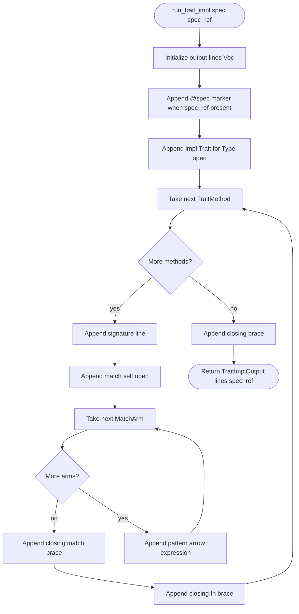
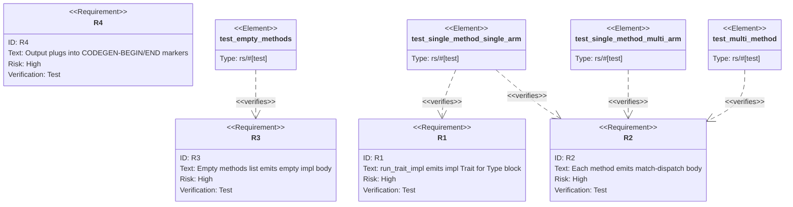

# Trait-Impl Generator

## Overview
<!-- type: overview lang: markdown -->

Public API manifest for `projects/agentic-workflow/src/generate/generators/trait_impl.rs` generated from AST during Score force-regeneration standardization.

### Symbols

| Name | Target | Kind | Visibility | Line | Signature |
|------|--------|------|------------|------|-----------|
| `MatchArm` | projects/agentic-workflow/src/generate/generators/trait_impl.rs | struct | pub | 17 |  |
| `TraitImplOutput` | projects/agentic-workflow/src/generate/generators/trait_impl.rs | struct | pub | 25 |  |
| `TraitImplSpec` | projects/agentic-workflow/src/generate/generators/trait_impl.rs | struct | pub | 36 |  |
| `TraitMethod` | projects/agentic-workflow/src/generate/generators/trait_impl.rs | struct | pub | 48 |  |
| `run_trait_impl` | projects/agentic-workflow/src/generate/generators/trait_impl.rs | function | pub | 73 | run_trait_impl(spec: &TraitImplSpec, spec_ref: Option<String>) -> TraitImplOutput |
## Requirements

```mermaid
---
id: sdd-codegen-trait-impl-requirements
requirements:
  emit_impl_block:
    id: R1
    text: "run_trait_impl MUST emit an impl <Trait> for <Type> { ... } block."
    kind: functional
    risk: high
    verify: test
  emit_method_match:
    id: R2
    text: "Each TraitMethod MUST emit a fn body that match-dispatches on self over body_lookup entries."
    kind: functional
    risk: high
    verify: test
  empty_methods:
    id: R3
    text: "An empty methods list MUST emit an impl block with an empty body (no panic, valid Rust)."
    kind: functional
    risk: high
    verify: test
  codegen_markers:
    id: R4
    text: "Emitted output MUST plug into CODEGEN-BEGIN/CODEGEN-END markers via the lines field."
    kind: functional
    risk: high
    verify: test
  unit_tests:
    id: R5
    text: "Generator MUST have unit tests covering empty, single-method, multi-arm, multi-method cases."
    kind: functional
    risk: high
    verify: test
elements: {}
relations: []
---
requirementDiagram
    requirement R1 {
      id: R1
      text: "run_trait_impl emits impl Trait for Type block"
      risk: High
      verifymethod: Test
    }
    requirement R2 {
      id: R2
      text: "Each method emits match-dispatch body"
      risk: High
      verifymethod: Test
    }
    requirement R3 {
      id: R3
      text: "empty methods list emits empty impl body"
      risk: High
      verifymethod: Test
    }
    requirement R4 {
      id: R4
      text: "output plugs into CODEGEN-BEGIN/END markers"
      risk: High
      verifymethod: Test
    }
    requirement R5 {
      id: R5
      text: "unit tests cover empty single multi-arm multi-method cases"
      risk: High
      verifymethod: Test
    }
```

<!-- type: requirements lang: mermaid -->



## Schema
<!-- type: schema lang: yaml -->

```yaml
$schema: "https://json-schema.org/draft/2020-12/schema"
$id: sdd-codegen-trait-impl#schema
title: Trait-Impl Generator Type Definitions
description: >
  Type declarations for the trait-impl codegen primitive in
  projects/agentic-workflow/src/generate/generators/trait_impl.rs.

definitions:
  TraitMethod:
    type: object
    $id: TraitMethod
    required: [name, signature, body_lookup]
    description: >
      One method inside a TraitImplSpec. The signature carries the full Rust
      fn header (everything from fn through the opening { brace). body_lookup
      is an ordered map from match-arm pattern (key) to expression (value);
      each entry emits one `<key> => <value>,` line in the match body.
    properties:
      name:
        type: string
        description: "Method identifier, used for documentation only (the signature carries it too)."
      signature:
        type: string
        description: "Full Rust fn signature from `fn` through the opening `{`."
      body_lookup:
        type: array
        items:
          type: object
          required: [pattern, expression]
          properties:
            pattern:
              type: string
            expression:
              type: string
        x-rust-type: "Vec<MatchArm>"
        description: "Ordered list of (pattern, expression) match arms."
    x-rust-struct:
      derive: [Debug, Clone, Serialize, Deserialize, PartialEq, Eq]

  MatchArm:
    type: object
    $id: MatchArm
    required: [pattern, expression]
    description: "One `<pattern> => <expression>,` line in a match self body."
    properties:
      pattern:
        type: string
      expression:
        type: string
    x-rust-struct:
      derive: [Debug, Clone, Serialize, Deserialize, PartialEq, Eq]

  TraitImplSpec:
    type: object
    $id: TraitImplSpec
    required: [trait_name, type_name, methods]
    description: >
      Input descriptor for the trait-impl generator, sourced from the
      trait_impl: field of a spec change entry (R1, R2).
    properties:
      trait_name:
        type: string
        description: "Trait identifier used in `impl <trait_name> for <type_name>`."
      type_name:
        type: string
        description: "Type identifier used in `impl <trait_name> for <type_name>`."
      methods:
        type: array
        items:
          $ref: "#/definitions/TraitMethod"
        x-rust-type: "Vec<TraitMethod>"
        description: "Ordered list of methods inside the impl block (R2, R3)."
    x-rust-struct:
      derive: [Debug, Clone, Default, Serialize, Deserialize]

  TraitImplOutput:
    type: object
    $id: TraitImplOutput
    required: [lines]
    description: >
      Result of running the trait-impl generator. lines plug into
      CODEGEN-BEGIN/CODEGEN-END markers (R4).
    properties:
      lines:
        type: array
        items:
          type: string
        x-rust-type: "Vec<String>"
        description: "Generated source lines (impl block declaration + body)."
      spec_ref:
        type: string
        x-rust-type: "Option<String>"
        x-serde-default: true
        x-serde-skip-if: "Option::is_none"
        description: "SPEC-REF anchor string for the CODEGEN marker header."
    x-rust-struct:
      derive: [Debug, Clone, Default, Serialize, Deserialize]
```

## Logic
<!-- type: logic lang: mermaid -->



## Test Plan
<!-- type: test-plan lang: mermaid -->



## Source
<!-- type: source lang: rust -->
<!-- source-from-target: handwrite-gap missing-generator:logic -->

## Changes
<!-- type: changes lang: yaml -->

```yaml
changes:
  - path: projects/agentic-workflow/src/generate/generators/trait_impl.rs
    action: create
    section: schema
    impl_mode: codegen
    description: >
      New module: TraitMethod, MatchArm, TraitImplSpec, TraitImplOutput struct
      declarations generated from sdd-codegen-trait-impl#schema. CODEGEN-BEGIN/END
      blocks with @spec markers.

  - path: projects/agentic-workflow/src/generate/generators/trait_impl.rs
    action: modify
    section: source
    impl_mode: codegen
    replaces:
      - "<handwrite-gap:missing-generator:logic>"
    description: >
      run_trait_impl(spec: &TraitImplSpec, spec_ref: Option<String>) ->
      TraitImplOutput implementing the logic flowchart in
      sdd-codegen-trait-impl#logic.

  - path: projects/agentic-workflow/src/generate/generators/mod.rs
    action: modify
    section: schema
    impl_mode: hand-written
    description: >
      Declare pub mod trait_impl and re-export run_trait_impl, TraitImplSpec,
      TraitMethod, MatchArm, TraitImplOutput.
  - action: annotate
    section: logic
    impl_mode: hand-written
    description: "Traceability metadata edge for the logic section."

  - action: annotate
    section: requirements
    impl_mode: hand-written
    description: "Traceability metadata edge for the requirements section."

  - action: annotate
    section: unit-test
    impl_mode: hand-written
    description: "Traceability metadata edge for the unit-test section."

```
