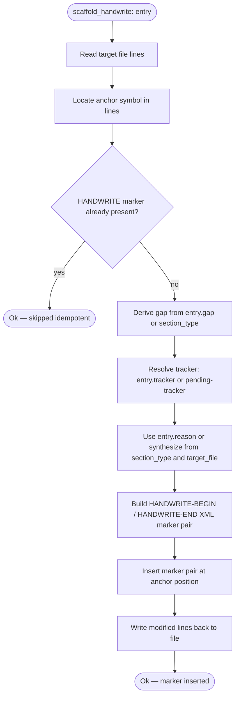
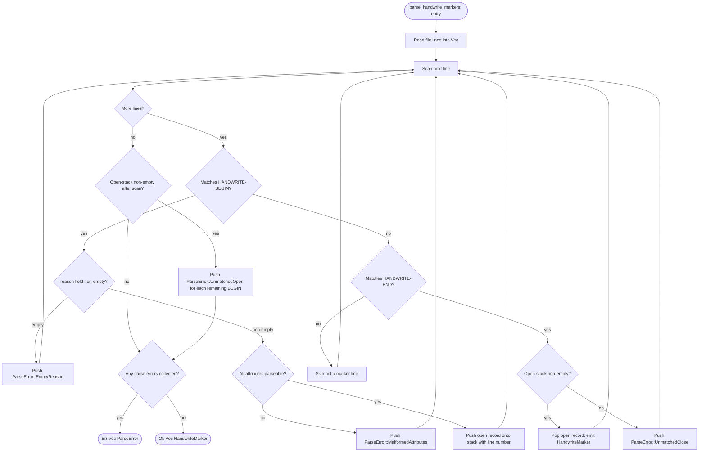

# HANDWRITE Marker Tooling

## Overview
<!-- type: overview lang: markdown -->

`aw td gen-code` currently silently skips every `changes` entry whose
`impl_mode` is `hand-written`, leaving the target file with no
`<HANDWRITE>` scaffold — 32 markers had to be inserted manually after
Issues A/B/C merged, and any future hand-written region risks landing on
`main` without a marker (violating the SDD audit invariant in CLAUDE.md).
`projects/agentic-workflow/src/generate/audit.rs` has zero HANDWRITE consumers, so those
32 markers are grep-only today.

This spec closes both gaps in one CRRR cycle:

1. **gen-code auto-scaffold** — extend `apply.rs` to replace the SKIP
   branch on `impl_mode=hand-written` with a scaffold-insertion path that
   emits canonical XML-form `<HANDWRITE gap="..." tracker="..."
   reason="...">` open/close pairs at the entry's anchor symbol.

2. **Structured parser** — add `parse_handwrite_markers()` and
   `HandwriteMarker` to `audit.rs`; validates pair integrity, non-empty
   `reason`, and matching `tracker` sentinel detection.

3. **`score sdd coverage` CLI** — new `projects/agentic-workflow/src/cli/sdd.rs`
   verb that aggregates the marker corpus into a structured report grouped
   by `gap` taxonomy code, supports human-readable and `--json` output,
   and highlights markers still carrying the `pending-tracker` sentinel.

The `tracker` attribute defaults to `pending-tracker` (not the legacy
value which is forbidden by the issue parser ambiguity check). The 32
existing markers on main using the legacy sentinel are migrated as part
of this issue's implementation.
## Requirements

```mermaid
---
id: sdd-handwrite-marker-requirements
---
requirementDiagram

requirement R1 {
  id: R1
  text: "gen-code MUST emit canonical XML-form HANDWRITE open/close scaffold when impl_mode=hand-written."
  risk: High
  verifymethod: Test
}

requirement R2 {
  id: R2
  text: "parse_handwrite_markers() MUST extract all HANDWRITE marker pairs and return structured HandwriteMarker records with file path, line range, gap, tracker, and reason."
  risk: High
  verifymethod: Test
}

requirement R3 {
  id: R3
  text: "The inserted tracker attribute MUST default to pending-tracker unless the spec entry carries an explicit tracker field naming an issue slug."
  risk: High
  verifymethod: Test
}

requirement R4 {
  id: R4
  text: "score sdd coverage MUST scan the workspace for HANDWRITE markers and produce a report listing each marker with its file, reason, and tracker."
  risk: High
  verifymethod: Test
}

requirement R5 {
  id: R5
  text: "The coverage report MUST support both human-readable text and JSON formats selectable via --format flag."
  risk: Medium
  verifymethod: Test
}

requirement R6 {
  id: R6
  text: "Scaffold insertion MUST be idempotent: re-running on a file with existing HANDWRITE markers for the same region MUST NOT produce duplicates."
  risk: High
  verifymethod: Test
}

requirement R7 {
  id: R7
  text: "The parser MUST validate that every HANDWRITE-BEGIN has a matching HANDWRITE-END in the same file and report an error with file path and line number for any unmatched marker."
  risk: High
  verifymethod: Test
}

requirement R8 {
  id: R8
  text: "The tooling MUST be registered under score sdd coverage as a CLI subcommand."
  risk: Medium
  verifymethod: Inspection
}

requirement R9 {
  id: R9
  text: "All HANDWRITE-BEGIN markers MUST carry a non-empty reason field; the parser MUST reject markers with missing or empty reason."
  risk: High
  verifymethod: Test
}

requirement R10 {
  id: R10
  text: "Markers whose tracker equals pending-tracker MUST be highlighted in the coverage report."
  risk: Medium
  verifymethod: Test
}
```

<!-- type: requirements lang: mermaid -->


## Schema
<!-- type: schema lang: yaml -->

```yaml
$schema: "https://json-schema.org/draft/2020-12/schema"
$id: sdd-handwrite-marker#schema
title: HANDWRITE Marker Type Definitions
description: >
  Type declarations for the HANDWRITE marker subsystem in projects/agentic-workflow/src/generate/.
  Satisfies R2, R3, R7, R9.

definitions:
  HandwriteMarker:
    type: object
    $id: HandwriteMarker
    required: [file_path, line_start, line_end, gap, tracker, reason]
    description: >
      Structured record representing one parsed HANDWRITE marker pair.
      Produced by parse_handwrite_markers() from Rust source files (R2).
    properties:
      file_path:
        type: string
        description: "Absolute or workspace-relative path to the source file."
      line_start:
        type: integer
        x-rust-type: "usize"
        description: "1-based line number of the begin marker comment."
      line_end:
        type: integer
        x-rust-type: "usize"
        description: "1-based line number of the end marker comment."
      gap:
        type: string
        description: "Taxonomy code identifying the codegen gap (e.g. logic-flowchart)."
      tracker:
        type: string
        description: >
          Issue slug tracking this gap, or the sentinel value pending-tracker
          if no issue has been assigned yet (R3, R10).
        default: "pending-tracker"
      reason:
        type: string
        minLength: 1
        description: "Non-empty human-readable description of why this region is hand-written (R9)."
    x-rust-struct:
      derive: [Debug, Clone, Serialize, Deserialize, PartialEq, Eq]

  HandwriteParseError:
    type: object
    $id: HandwriteParseError
    required: [file_path, line, message]
    description: >
      Structured error returned when the parser encounters a malformed or
      unmatched HANDWRITE marker (R7, R9).
    properties:
      file_path:
        type: string
        description: "Path to the file containing the malformed marker."
      line:
        type: integer
        x-rust-type: "usize"
        description: "1-based line number where the error was detected."
      message:
        type: string
        description: "Human-readable parse failure description."
    x-rust-struct:
      derive: [Debug, Clone, Serialize, Deserialize]

  HandwriteEntry:
    type: object
    $id: HandwriteEntry
    required: []
    description: >
      Optional fields on a spec changes entry that control HANDWRITE scaffold
      emission during gen-code (R1, R3). Corresponds to new optional fields
      added to the ChangeEntry type in spec_ir/types.rs. All three fields are
      optional; scaffold_handwrite derives defaults for any that are absent.
    properties:
      gap:
        type: string
        description: >
          Codegen gap taxonomy code. If absent, scaffold_handwrite derives the
          value from the entry's section_type (e.g. section_type=logic →
          gap="missing-generator:logic"). This derivation is defined in R2/R4.
      tracker:
        type: string
        description: >
          Issue slug tracking this gap. If absent, scaffold_handwrite fills in
          the sentinel value "pending-tracker" (R3). Markers carrying this
          sentinel are highlighted by score sdd coverage (R10).
        default: "pending-tracker"
      reason:
        type: string
        minLength: 1
        description: >
          Non-empty description of the codegen gap. Used as the reason attribute
          in the emitted HANDWRITE marker. If absent, scaffold_handwrite
          synthesizes a reason from the section_type and target_file path.
          The parser still rejects a persisted empty-string reason (R9).
    x-rust-struct:
      derive: [Debug, Clone, Serialize, Deserialize, Default]

  CoverageReport:
    type: object
    $id: CoverageReport
    required: [markers, pending_count, total_count]
    description: >
      Aggregated output of score sdd coverage over a workspace scan (R4, R5).
    properties:
      markers:
        type: array
        items:
          $ref: "#/definitions/HandwriteMarker"
        description: "All parsed HANDWRITE markers from the scanned workspace."
      pending_count:
        type: integer
        x-rust-type: "usize"
        description: "Count of markers whose tracker equals pending-tracker (R10)."
      total_count:
        type: integer
        x-rust-type: "usize"
        description: "Total marker count across all scanned files."
      by_gap:
        type: object
        x-rust-type: "std::collections::HashMap<String, Vec<HandwriteMarker>>"
        description: "Markers grouped by gap taxonomy code for prioritisation."
    x-rust-struct:
      derive: [Debug, Clone, Serialize, Deserialize, Default]
```
## Logic
<!-- type: logic lang: mermaid -->




## Test Plan

```mermaid
---
id: sdd-handwrite-marker-test-plan
requirements:
  scaffold_emit:
    id: R1
    text: "gen-code emits HANDWRITE scaffold when impl_mode=hand-written"
    kind: functional
    risk: high
    verify: test
  tracker_default:
    id: R3
    text: "tracker defaults to pending-tracker when not specified in spec entry"
    kind: functional
    risk: high
    verify: test
  idempotent:
    id: R6
    text: "scaffold insertion is idempotent on files with existing HANDWRITE markers"
    kind: functional
    risk: high
    verify: test
  parser_extracts:
    id: R2
    text: "parse_handwrite_markers extracts all marker pairs with correct fields"
    kind: functional
    risk: high
    verify: test
  parser_unmatched:
    id: R7
    text: "parser reports error with file and line for unmatched HANDWRITE-BEGIN"
    kind: functional
    risk: high
    verify: test
  parser_empty_reason:
    id: R9
    text: "parser rejects HANDWRITE-BEGIN with missing or empty reason field"
    kind: functional
    risk: high
    verify: test
  coverage_report:
    id: R4
    text: "score sdd coverage scans workspace and produces aggregated report"
    kind: functional
    risk: high
    verify: test
  coverage_formats:
    id: R5
    text: "coverage report supports human-readable text and JSON via --format"
    kind: functional
    risk: medium
    verify: test
  pending_highlight:
    id: R10
    text: "pending-tracker markers are highlighted in coverage report"
    kind: functional
    risk: medium
    verify: test
elements:
  test_scaffold_emit:
    kind: test
    type: "rs/#[test]"
  test_scaffold_idempotent:
    kind: test
    type: "rs/#[test]"
  test_tracker_default:
    kind: test
    type: "rs/#[test]"
  test_parser_well_formed:
    kind: test
    type: "rs/#[test]"
  test_parser_unmatched:
    kind: test
    type: "rs/#[test]"
  test_parser_empty_reason:
    kind: test
    type: "rs/#[test]"
  test_coverage_integration:
    kind: test
    type: "rs/#[test]"
  test_coverage_json:
    kind: test
    type: "rs/#[test]"
  test_pending_highlight:
    kind: test
    type: "rs/#[test]"
relations:
  - { from: test_scaffold_emit,      verifies: scaffold_emit }
  - { from: test_scaffold_idempotent, verifies: idempotent }
  - { from: test_tracker_default,    verifies: tracker_default }
  - { from: test_parser_well_formed, verifies: parser_extracts }
  - { from: test_parser_unmatched,   verifies: parser_unmatched }
  - { from: test_parser_empty_reason, verifies: parser_empty_reason }
  - { from: test_coverage_integration, verifies: coverage_report }
  - { from: test_coverage_json,      verifies: coverage_formats }
  - { from: test_pending_highlight,  verifies: pending_highlight }
---
requirementDiagram
    requirement R1 {
      id: R1
      text: "gen-code emits HANDWRITE scaffold when impl_mode=hand-written"
      risk: High
      verifymethod: Test
    }
    requirement R3 {
      id: R3
      text: "tracker defaults to pending-tracker when not specified"
      risk: High
      verifymethod: Test
    }
    requirement R6 {
      id: R6
      text: "scaffold insertion is idempotent"
      risk: High
      verifymethod: Test
    }
    requirement R2 {
      id: R2
      text: "parse_handwrite_markers extracts all marker pairs"
      risk: High
      verifymethod: Test
    }
    requirement R7 {
      id: R7
      text: "parser reports error for unmatched HANDWRITE-BEGIN"
      risk: High
      verifymethod: Test
    }
    requirement R9 {
      id: R9
      text: "parser rejects empty reason field"
      risk: High
      verifymethod: Test
    }
    requirement R4 {
      id: R4
      text: "score sdd coverage produces aggregated report"
      risk: High
      verifymethod: Test
    }
    requirement R5 {
      id: R5
      text: "report supports text and JSON formats"
      risk: Medium
      verifymethod: Test
    }
    requirement R10 {
      id: R10
      text: "pending-tracker markers are highlighted"
      risk: Medium
      verifymethod: Test
    }
    element test_scaffold_emit {
      type: "rs/#[test]"
    }
    element test_scaffold_idempotent {
      type: "rs/#[test]"
    }
    element test_tracker_default {
      type: "rs/#[test]"
    }
    element test_parser_well_formed {
      type: "rs/#[test]"
    }
    element test_parser_unmatched {
      type: "rs/#[test]"
    }
    element test_parser_empty_reason {
      type: "rs/#[test]"
    }
    element test_coverage_integration {
      type: "rs/#[test]"
    }
    element test_coverage_json {
      type: "rs/#[test]"
    }
    element test_pending_highlight {
      type: "rs/#[test]"
    }
    test_scaffold_emit - verifies -> R1
    test_scaffold_idempotent - verifies -> R6
    test_tracker_default - verifies -> R3
    test_parser_well_formed - verifies -> R2
    test_parser_unmatched - verifies -> R7
    test_parser_empty_reason - verifies -> R9
    test_coverage_integration - verifies -> R4
    test_coverage_json - verifies -> R5
    test_pending_highlight - verifies -> R10
```

<!-- type: test-plan lang: mermaid -->


## CLI: score sdd coverage
<!-- type: cli lang: yaml -->

```yaml
command: score sdd coverage
description: >
  Scan the workspace for HANDWRITE marker pairs, aggregate them into a
  CoverageReport grouped by gap taxonomy code, and render the report in
  human-readable text (default) or JSON format. Markers whose tracker
  equals pending-tracker are highlighted in the output (R4, R5, R8, R10).

arguments:
  - name: --workspace-root
    short: -w
    type: path
    required: false
    default: "."
    description: >
      Root directory to scan recursively for Rust source files containing
      HANDWRITE markers. Defaults to the current working directory.

  - name: --json
    type: flag
    required: false
    default: false
    description: >
      Emit the CoverageReport as a JSON object to stdout. Equivalent to
      --format json. Structured output matches the CoverageReport schema
      defined in sdd-handwrite-marker#schema.

  - name: --format
    type: string
    enum: [text, json]
    required: false
    default: text
    description: >
      Output format. "text" renders a human-readable table grouped by gap
      taxonomy code with pending-tracker entries flagged. "json" emits
      the full CoverageReport object.

output:
  text:
    description: >
      Human-readable report. Each gap group is printed as a heading followed
      by a table of markers: file path, line range, tracker, and reason.
      Markers with tracker=pending-tracker are prefixed with "[PENDING]".
    example: |
      HANDWRITE Coverage Report  (3 markers, 2 pending)

      Gap: missing-generator:logic (2 markers)
        [PENDING] projects/agentic-workflow/src/generate/apply.rs:114-120
                  reason: logic flowchart generator not yet implemented
                  tracker: pending-tracker
                  projects/agentic-workflow/src/generate/audit.rs:88-102
                  reason: parse_handwrite_markers hand-written pending codegen
                  tracker: enhancement-handwrite-marker-tooling-gen-code-auto-scaffold-pa

      Gap: missing-generator:schema (1 marker)
                  projects/agentic-workflow/src/generate/handwrite.rs:5-12
                  reason: schema struct generator bootstrapping
                  tracker: enhancement-handwrite-marker-tooling-gen-code-auto-scaffold-pa

  json:
    description: >
      Serialised CoverageReport object as defined in sdd-handwrite-marker#schema.
      Array fields preserve file-scan order within each gap group.
    schema:
      $ref: "sdd-handwrite-marker#schema/definitions/CoverageReport"

exit_codes:
  0: Report generated successfully.
  1: One or more parse errors encountered (unmatched markers, empty reason).
  2: Workspace root path does not exist or is not a directory.
```

## Changes
<!-- type: changes lang: yaml -->

```yaml
changes:
  - path: projects/agentic-workflow/src/generate/spec_ir/types.rs
    action: modify
    section: schema
    impl_mode: hand-written
    description: >
      Add optional gap, tracker, and reason fields to the ChangeEntry type
      so gen-code can derive HandwriteEntry attributes for scaffold emission (R1, R3).
      Corresponds to HandwriteEntry schema definition in sdd-handwrite-marker#schema.

  - path: projects/agentic-workflow/src/generate/handwrite.rs
    action: create
    section: schema
    impl_mode: codegen
    description: >
      New module: HandwriteMarker, HandwriteParseError, HandwriteEntry, and
      CoverageReport struct declarations generated from sdd-handwrite-marker#schema.
      CODEGEN-BEGIN/END blocks with @spec markers.

  - path: projects/agentic-workflow/src/generate/handwrite_scaffold.rs
    action: create
    section: logic
    impl_mode: hand-written
    description: >
      scaffold_handwrite(entry, file) function implementing the logic flowchart
      in sdd-handwrite-marker#logic: reads target file, locates anchor symbol,
      checks for existing marker (idempotency, R6), derives gap/tracker/reason,
      builds XML marker pair, inserts at anchor, writes back. Carries
      @spec sdd-handwrite-marker#logic annotation.

  - path: projects/agentic-workflow/src/generate/audit.rs
    action: modify
    section: logic
    impl_mode: hand-written
    description: >
      Add parse_handwrite_markers(path) function and supporting regex per
      commit 2e99662d4. Validates marker pairs (R7), non-empty reason (R9),
      returns Vec<HandwriteMarker> or Vec<HandwriteParseError>. Carries
      @spec sdd-generate-audit#logic annotation.

  - path: projects/agentic-workflow/src/generate/apply.rs
    action: modify
    section: logic
    impl_mode: hand-written
    description: >
      Replace the SKIP branch at line 114 on impl_mode=hand-written with a
      call to scaffold_handwrite(entry, file). Carries @spec
      sdd-generate-apply#logic annotation.

  - path: projects/agentic-workflow/src/cli/sdd.rs
    action: create
    section: cli
    impl_mode: hand-written
    description: >
      New file implementing score sdd coverage verb: scans workspace for
      HANDWRITE markers via parse_handwrite_markers, builds CoverageReport,
      renders human-readable text (default) or JSON (--json / --format json),
      highlights pending-tracker entries (R4, R5, R8, R10). Carries @spec
      sdd-handwrite-marker#cli annotation.

  - path: projects/agentic-workflow/src/generate/mod.rs
    action: modify
    section: schema
    impl_mode: hand-written
    description: >
      Declare pub mod handwrite and pub mod handwrite_scaffold; re-export
      HandwriteMarker, HandwriteParseError, HandwriteEntry, CoverageReport,
      scaffold_handwrite, parse_handwrite_markers.

  - path: projects/agentic-workflow/src/generate/tests/handwrite_scaffold_test.rs
    action: create
    section: test-plan
    impl_mode: hand-written
    description: >
      Unit tests for scaffold_handwrite: emit scaffold, idempotency guard,
      tracker derivation (pending-tracker default), reason placeholder.
      Integration test for parse_handwrite_markers: well-formed marker,
      malformed marker, multi-marker file, comment-leader variants.
      Satisfies R1, R2, R3, R6, R7, R9.

  - path: projects/agentic-workflow/tests/sdd_coverage_test.rs
    action: create
    section: test-plan
    impl_mode: hand-written
    description: >
      Integration test running score sdd coverage against a curated fixture set
      under a temp dir: validates report structure, JSON output, pending-tracker
      highlighting. Satisfies R4, R5, R10.
  - action: annotate
    section: requirements
    impl_mode: hand-written
    description: "Traceability metadata edge for the requirements section."

```

# Reviews

## Review 3
<!-- type: doc lang: markdown -->
**Verdict:** approved

- [logic] Both Mermaid Plus blocks (`scaffold-handwrite` and `parse-handwrite-markers`) now carry well-formed YAML frontmatter with `id`, `entry`, `nodes` (each with `kind` and `label`), and `edges` (each with `from`/`to`, optional `label`). Node IDs are consistent between frontmatter and the `flowchart TD` body in both blocks. The `parse-handwrite-markers` flowchart covers all required paths: line scan loop, open/close pair matching, `EmptyReason`, `MalformedAttributes`, `UnmatchedClose`, `UnmatchedOpen`, and both `Ok`/`Err` return terminals. Finding from Review 1 fully resolved.

## Review 2
<!-- type: doc lang: markdown -->
**Verdict:** approved

- [schema] `HandwriteEntry.required` is now `[]`; all three fields carry documented derivation defaults. Finding resolved.
- [logic] Second Mermaid flowchart added for `parse_handwrite_markers()` covering the line-scan loop, open/close pair matching, `ParseError::EmptyReason`, `ParseError::MalformedAttributes`, `ParseError::UnmatchedClose`, and `ParseError::UnmatchedOpen` error paths. Finding resolved.
- [changes] Inline `## CLI: score sdd coverage` section added with full command signature, flags, output examples, and exit codes; `sdd.rs` changes entry annotation updated to `@spec sdd-handwrite-marker#cli`. Dead link eliminated. Finding resolved.

## Review 1
<!-- type: doc lang: markdown -->
**Verdict:** needs-revision

- [schema] `HandwriteEntry` declares `required: [gap, tracker, reason]` but the design intent — stated in its own description and in the changes entry for `spec_ir/types.rs` — is that all three fields are *optional* additions to `ChangeEntry`. The `gap` property description even says "If absent, derived from the entry's section type," which is impossible if `gap` is required. Remove `gap` and `reason` from the `required` array (keep only `tracker` if a default sentinel is always emitted), or mark all three optional with explicit defaults. The generated `ChangeEntry` struct will otherwise reject every existing spec entry that omits these fields.

- [logic] The spec provides a logic flowchart only for `scaffold_handwrite`. No logic section exists for `parse_handwrite_markers()` — the function that implements R2, R7, and R9. The secondary spec `audit.md` also has `TBD` for its logic section. An implementer must infer the parser's state machine (scan lines, match open/close pairs, detect unmatched BEGIN, validate reason attribute) with no spec guidance. Add a `## Logic: parse_handwrite_markers` flowchart or state-machine covering: line scan, open/close pair matching, unmatched-BEGIN error path, empty-reason rejection path, and the `Vec<HandwriteMarker>` / `Vec<HandwriteParseError>` return paths.

- [changes] The `projects/agentic-workflow/src/cli/sdd.rs` entry carries `@spec sdd-coverage-cli#cli` but `sdd-coverage-cli.md` was never written and does not exist in the worktree. Referencing a non-existent spec anchor is a dead link that blocks CLI implementation. Either inline the CLI section contract (subcommand signature, flag definitions, output format) into this spec as a `## CLI: score sdd coverage` section and update the `@spec` annotation accordingly, or author `sdd-coverage-cli.md` as part of this CRRR cycle. The Spec Plan in the issue already lists it as `create` — it must be present before the spec is approved.
