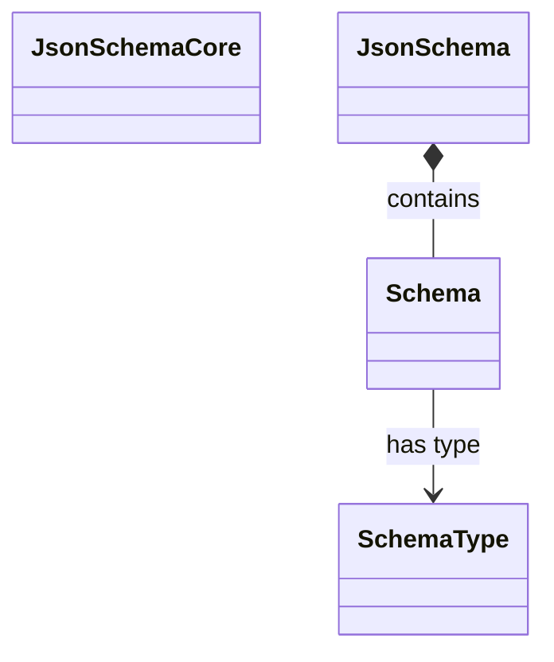

<spec>

# JSON Schema Core Implementation

## Overview
<!-- type: overview lang: markdown -->

Defines the core JSON Schema structures and parsing logic for cclab-sdd. This module is responsible for parsing JSON Schema strings into a strongly-typed Rust structure that can be used by validators and generators.

## Requirements
<!-- type: requirements lang: mermaid -->

```mermaid
---
id: json-schema-core-requirements
---
requirementDiagram
    requirement R1 {
        id: R1
        text: Support parsing Draft 7 and Draft 2020-12 JSON Schemas.
        risk: medium
        verifymethod: test
    }
    requirement R2 {
        id: R2
        text: Provide strongly typed schema structures including recursive ref handling.
        risk: medium
        verifymethod: test
    }
    requirement R3 {
        id: R3
        text: Support serialization and deserialization through Serde.
        risk: medium
        verifymethod: test
    }
```

## Acceptance Criteria
<!-- type: scenarios lang: yaml -->

```yaml
scenarios:
  - name: parse-draft-7-schema
    given: A valid Draft 7 JSON Schema string.
    when: The parse function is called.
    then: It is successfully parsed into a JsonSchema struct.
  - name: handle-recursion
    given: A JSON Schema with a circular $ref.
    when: The schema is traversed.
    then: The structure preserves the reference or resolves it lazily.
```

## Diagrams
<!-- type: diagram lang: mermaid -->

### JSON Schema Core Class Diagram



## API Specification (JSON Schema)
<!-- type: schema lang: yaml -->

```yaml
properties:
  definitions:
    type: object
  schema_version:
    type: string
title: JsonSchema
type: object
```

</spec>

## Changes
<!-- type: changes lang: yaml -->

```yaml
changes:
  - action: annotate
    section: requirements
    impl_mode: hand-written
    description: "Traceability metadata edge for the requirements section."

  - action: annotate
    section: scenarios
    impl_mode: hand-written
    description: "Traceability metadata edge for the scenarios section."

  - action: annotate
    section: schema
    impl_mode: hand-written
    description: "Traceability metadata edge for the schema section."

```