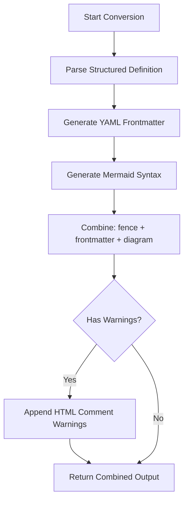
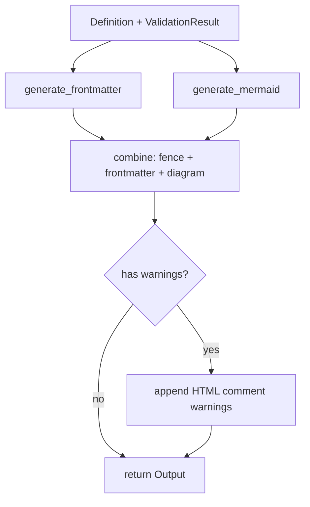

<spec>

# Mermaid+ Conversion Algorithm

## Overview
<!-- type: doc lang: markdown -->

This spec defines the conversion algorithm from structured definitions to Mermaid+ output. The implementation is in crates/cclab-sdd/src/diagrams/*/generator.rs for each diagram type. The algorithm:

1. Takes a structured definition (validated schema)
2. Generates YAML frontmatter from the definition
3. Generates Mermaid diagram syntax
4. Combines them in Mermaid+ format (frontmatter inside code block)

## Requirements
<!-- type: doc lang: markdown -->

### R1 - Core Conversion Algorithm

```yaml
id: R1
priority: high
status: implemented
```

Implement core conversion functions for each diagram type. The generators are located in:
- `crates/cclab-sdd/src/diagrams/state_plus/generator.rs`
- `crates/cclab-sdd/src/diagrams/flowchart_plus/generator.rs`
- `crates/cclab-sdd/src/diagrams/sequence_plus/generator.rs`
- etc.

### R2 - Output Format Compliance

```yaml
id: R2
priority: high
status: implemented
```

All generators must output Mermaid+ format with frontmatter INSIDE the code block:

```
```mermaid
---
<yaml frontmatter>
---
<mermaid diagram>
```
```

Validation warnings are appended as HTML comments after the code block.

## Acceptance Criteria
<!-- type: doc lang: markdown -->

### Scenario: Nested State Conversion

- **GIVEN** A definition with nested/compound states.
- **WHEN** Conversion algorithm executes.
- **THEN** Produces Mermaid code with `state "..." as id { ... }` syntax.

### Scenario: Frontmatter Inside Code Block

- **GIVEN** Any valid diagram definition.
- **WHEN** Conversion algorithm executes.
- **THEN** Output starts with ` ```mermaid\n---\n ` (frontmatter inside).

## Diagrams
<!-- type: doc lang: markdown -->

### Mermaid+ Conversion Flow



## Implementation Details
<!-- type: doc lang: markdown -->

Each generator follows this pattern:



Output format: ` ```mermaid ` → `---` → YAML frontmatter → `---` → Mermaid diagram → ` ``` ` → optional `<!-- Validation Warnings -->` HTML comment.

</spec>
