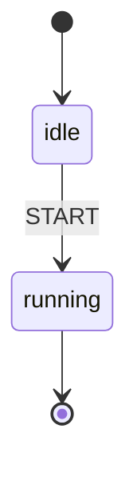
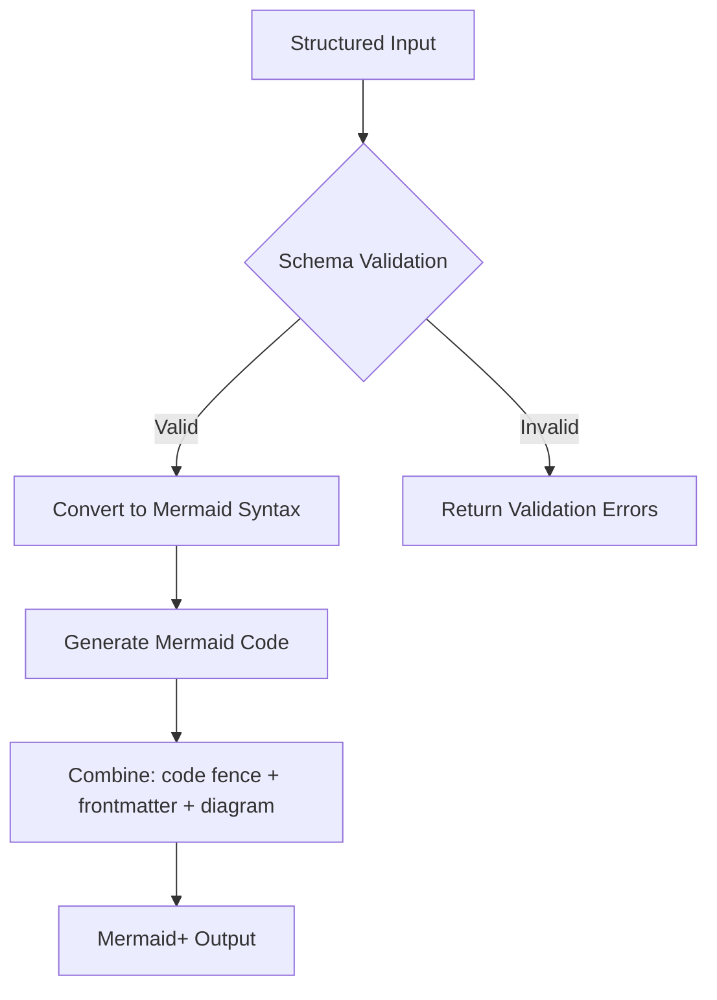

<spec>

# Mermaid+ Format Specification

## Overview
<!-- type: overview lang: markdown -->

This spec defines the Mermaid+ format used in cclab-sdd. Mermaid+ combines structured YAML frontmatter with Mermaid diagrams, enabling machine-readable metadata alongside human-readable visualizations. The key feature is that **frontmatter is placed inside the mermaid code block**, following Mermaid's official frontmatter specification.

## Format
<!-- type: doc lang: markdown -->

The Mermaid+ format places YAML frontmatter inside the code block:

```markdown

```

This format ensures:
1. Platform compatibility (GitHub, GitLab, Jira render correctly)
2. Mermaid frontmatter parsing works as intended
3. Structured metadata is preserved alongside the diagram

## Requirements
<!-- type: doc lang: markdown -->

### R1 - Frontmatter Inside Code Block

```yaml
id: R1
priority: high
status: implemented
```

All Mermaid+ generators must output YAML frontmatter INSIDE the mermaid code block, not outside. The format is: code fence, then `---`, then YAML, then `---`, then diagram content, then closing code fence.

### R2 - Structured Schema Validation

```yaml
id: R2
priority: high
status: implemented
```

Validate that Mermaid+ definitions have required fields based on diagram type. For state diagrams: id, initial, states. For flowcharts: id, nodes, edges.

### R3 - Output Embedding

```yaml
id: R3
priority: medium
status: implemented
```

Tool output must follow Mermaid+ format specification. SpecService correctly handles and embeds this format without breaking existing Markdown structure.

### R4 - Validation and Error Handling

```yaml
id: R4
priority: medium
status: implemented
```

SemanticValidator includes Mermaid+ validation logic to ensure structural consistency. Validation warnings are appended as HTML comments after the code block.

## Acceptance Criteria
<!-- type: doc lang: markdown -->

### Scenario: Valid Input Generates Mermaid+

- **GIVEN** A valid state machine definition with idle and loading states.
- **WHEN** Calling sdd_generate_state_plus (or similar *_plus tool).
- **THEN** Returns output with frontmatter inside the mermaid code block.

### Scenario: Invalid Input Returns Error Details

- **GIVEN** A definition missing required fields (e.g., no initial state).
- **WHEN** Calling a Mermaid+ generator tool.
- **THEN** Returns structured error result with validation failure details.

### Scenario: Platform Rendering

- **GIVEN** Mermaid+ output from any *_plus generator.
- **WHEN** Pasted into GitHub/GitLab markdown.
- **THEN** Diagram renders correctly; frontmatter is parsed as config, not displayed as text.

## Diagrams
<!-- type: doc lang: markdown -->

### Mermaid+ Tool Processing Flow



## Supported Diagram Types
<!-- type: doc lang: markdown -->

| Tool | Diagram Type | Frontmatter Fields |
|------|--------------|-------------------|
| sdd_generate_state_plus | stateDiagram-v2 | id, initial, states, guards, actions |
| sdd_generate_flowchart_plus | flowchart | id, nodes, edges, direction |
| sdd_generate_sequence_plus | sequenceDiagram | id, participants, messages |
| sdd_generate_class_plus | classDiagram | id, classes, relationships |
| sdd_generate_erd_plus | erDiagram | id, entities, relationships |
| sdd_generate_requirement_plus | requirementDiagram | id, requirements, elements |
| sdd_generate_mindmap_plus | mindmap | id, root |
| sdd_generate_journey_plus | journey | id, title, sections |

</spec>
