# Path B Pattern 2.5 — Decision / Match in Expression Position

## Overview
<!-- type: overview lang: markdown -->

Path B Pattern 2 added `Decision` and `Match` node kinds that emit `if cond { ... } else { ... }` and `match expr { ... }` as **statement-position multi-line blocks** — every arm walks a sub-graph and emits a chain of process / loop / terminal lines. That shape covers branch-as-statement bodies but cannot model the most common branching shape in real Rust function bodies: an if-or-match used as an **expression** that produces a value, typically bound to a `let` or returned as the function's tail. The canonical example sits inside the `emit_cli_subcommand` HANDWRITE block at `projects/agentic-workflow/src/generate/generators/cli_subcommand.rs:74-256`, where the dispatch arm is built by `let await_suffix = if cmd.is_async.unwrap_or(false) { ".await" } else { "" };`. A statement-position Decision would emit four lines plus an `after` continuation; the resulting code would re-bind `await_suffix` on every arm and would not be byte-equivalent to the hand-written body.

Pattern 2.5 closes this gap with the smallest possible additive change: two new node kinds, `decision_expr` and `match_expr`, that carry **literal value strings** instead of subgraph targets, plus an optional `bind:` field controlling let-binding vs bare-expression emission. The walker treats them as single-statement nodes (analogous to `process`), keeping the existing recursion shape unchanged. Statement-position `Decision` and `Match` from Pattern 2 are unchanged — Pattern 2.5 is purely additive.

The byte-equivalence fixture is the same `emit_cli_subcommand` body. Its `await_suffix` binding becomes a `decision_expr` node with `bind: await_suffix`, `cond: 'cmd.is_async.unwrap_or(false)'`, `true_value: '".await"'`, `false_value: '""'`. The same body's tail format!() expression becomes a terminal node — an existing Pattern-1 kind — wrapping the dispatch_arm string. Closing this fixture exercises decision-as-expression directly, validating the schema against the highest-leverage branching shape in the cluster.

## Schema
<!-- type: schema lang: yaml -->

```yaml
$schema: "https://json-schema.org/draft/2020-12/schema"
$id: path-b-pattern-2-5-expression-decision#schema
title: LogicEmitter Pattern-2.5 schema extension
description: >
  Additive extension to LogicSpec / LogicNode that adds expression-position
  branching support. All Pattern-1 and Pattern-2 invariants (signature:,
  entry resolution, four-space indent, verbatim code: snippets,
  statement-position Decision/Match arms) are preserved verbatim — the new
  variants are additive.

definitions:
  LogicNodeKind:
    type: string
    enum: [process, loop, terminal, decision, match, decision_expr, match_expr]
    description: >
      Discriminator for LogicNode. process / loop / terminal / decision /
      match carry Pattern-1 + Pattern-2 semantics unchanged. decision_expr
      and match_expr are new in Pattern-2.5 and emit single-statement
      let-bindings or bare expression fragments.

  LogicNodeDecisionExpr:
    type: object
    $id: LogicNodeDecisionExpr
    required: [kind, cond, true_value, false_value]
    properties:
      kind:
        const: decision_expr
      cond:
        type: string
        description: >
          The Rust predicate expression rendered between `if` and `{`.
          Emitted verbatim — the spec author owns syntactic validity.
      true_value:
        type: string
        description: >
          Literal Rust expression emitted between the `{` and the `}` of
          the `if` arm. No walking, no subgraph resolution. The spec author
          writes the arm value as a single string (e.g. `'".await"'`,
          `'cmd.path.clone()'`, `'42'`).
      false_value:
        type: string
        description: >
          Literal Rust expression emitted between the `{` and the `}` of
          the `else` arm. Same emission rule as true_value.
      bind:
        type: [string, "null"]
        description: >
          Optional Rust identifier. When present, the node emits
          `let <bind> = if <cond> { <true_value> } else { <false_value> };`
          at the current indent. When absent, the node emits the bare
          expression `if <cond> { <true_value> } else { <false_value> }`
          at the current indent with no leading `let` and no trailing `;`,
          suitable for terminal-position use.
    description: >
      Lowers (single-line case, total width <= 100 chars at indent=0) to:
        let <bind> = if <cond> { <true_value> } else { <false_value> };
      or, when bind is absent:
        if <cond> { <true_value> } else { <false_value> }
      Lowers (multi-line case, total width > 100 chars at indent=0) to:
        let <bind> = if <cond> {
            <true_value>
        } else {
            <false_value>
        };
      The walker continues with the standard sequential successor
      (Next-edge) chain at the current indent after emission.

  LogicNodeMatchExpr:
    type: object
    $id: LogicNodeMatchExpr
    required: [kind, expr, arms_value]
    properties:
      kind:
        const: match_expr
      expr:
        type: string
        description: >
          The Rust scrutinee expression rendered between `match` and `{`.
          Emitted verbatim.
      arms_value:
        type: object
        description: >
          Ordered map of arm pattern -> literal Rust expression. Iteration
          order is the YAML insertion order preserved by serde_yaml::Mapping.
          Each value string is emitted verbatim as the arm's RHS — no
          walking, no subgraph resolution. The spec author owns syntactic
          validity for both pattern keys (e.g. `Some(x)`, `None`, `_`,
          `CliArgKind::Positional`) and value strings.
        additionalProperties:
          type: string
      bind:
        type: [string, "null"]
        description: >
          Optional Rust identifier. When present, the node emits
          `let <bind> = match <expr> { <pat1> => <val1>, ... };` at the
          current indent. When absent, the node emits the bare expression
          form at the current indent.
    description: >
      Lowers (single-line case) to:
        let <bind> = match <expr> { <pat1> => <val1>, <pat2> => <val2> };
      or, multi-line case (rendered width > 100 at indent=0):
        let <bind> = match <expr> {
            <pat1> => <val1>,
            <pat2> => <val2>,
        };

  LogicNodeFieldExtension:
    type: object
    $id: LogicNodeFieldExtension
    description: >
      Additive optional fields appended to the unified LogicNode struct so
      one flat shape continues to deserialize all kinds. Required-by-kind
      enforcement lives in the walker, not in the schema.
    properties:
      true_value:
        type: [string, "null"]
      false_value:
        type: [string, "null"]
      arms_value:
        type: [object, "null"]
        additionalProperties: { type: string }
      bind:
        type: [string, "null"]

  LineWidthRule:
    type: object
    $id: LineWidthRule
    description: >
      Deterministic single-line vs multi-line emission threshold.
    properties:
      threshold:
        type: integer
        const: 100
      measurement:
        type: string
        const: "Width is measured at indent=0 (column 1) on the candidate single-line rendering. The pad string for the current indent is added back when the line is emitted, but is NOT counted in the width comparison. This keeps the rule independent of nesting depth — a fragment that fits on one line at the top of the function still fits when emitted four levels deep."
      multi_line_shape:
        type: string
        const: "When over threshold, emission wraps as: opener line at current indent, arm bodies at indent+1, closer line at current indent. Match_expr multi-line emission uses one arm per line at indent+1 with trailing comma."
      single_line_shape:
        type: string
        const: "When at or under threshold, emission packs onto one line at the current indent."

  PreservedInvariants:
    type: object
    $id: PreservedInvariants
    description: >
      Invariants Pattern-2.5 preserves from Pattern-1 and Pattern-2.
    properties:
      pattern1_unchanged:
        type: string
        const: "process / loop / terminal / next / body / after walking is byte-identical to Pattern-1. No Pattern-1 fixture grows a decision_expr or match_expr node."
      pattern2_unchanged:
        type: string
        const: "Statement-position Decision / Match / Branch nodes and edges from Pattern-2 walk identically. Pattern-2.5 introduces NO changes to those arms in walk()."
      sequential_successor:
        type: string
        const: "After emitting a decision_expr or match_expr node, the walker resolves the unique outgoing Next-kind edge and recurses at the current indent (mirrors process-node convention). Multiple Next edges error EmitError::Unsupported."
      bind_optional:
        type: string
        const: "When bind is None for a decision_expr or match_expr node, the node renders as a bare expression with no leading `let` and no trailing `;`. This shape is valid only at the function tail (terminal position) — sequential continuation after a bare-expression node has no observable effect because the bare expression is the function's tail value. Authors targeting terminal use should leave bind unset and place the node at the end of the chain."
```

## Logic

```mermaid
---
id: path-b-pattern-2-5-walk
entry: walk_node
nodes:
  walk_node:
    kind: process
    label: "walk(spec, node_id, indent, out)"
  inspect:
    kind: decision
    label: "node.kind?"
  emit_pattern1:
    kind: process
    label: "Pattern-1: dispatch process / loop / terminal arms unchanged"
  emit_pattern2:
    kind: process
    label: "Pattern-2: dispatch decision / match arms unchanged (statement-position multi-line emission)"
  fetch_dexpr_fields:
    kind: process
    label: "Read cond / true_value / false_value / bind from node; require all three value fields present (else MissingField)"
  render_dexpr_inline:
    kind: process
    label: "Render candidate `if <cond> { <true_value> } else { <false_value> }` and measure width at indent=0"
  width_check_dexpr:
    kind: decision
    label: "rendered width at indent=0 <= 100?"
  emit_dexpr_single_bound:
    kind: process
    label: "When bind is Some: push `<pad>let <bind> = <inline>;`"
  emit_dexpr_single_bare:
    kind: process
    label: "When bind is None: push `<pad><inline>` (no semicolon, function tail)"
  emit_dexpr_multi_bound:
    kind: process
    label: "When bind is Some and width > 100: push `<pad>let <bind> = if <cond> {`, push `<pad+1><true_value>`, push `<pad>} else {`, push `<pad+1><false_value>`, push `<pad>};`"
  emit_dexpr_multi_bare:
    kind: process
    label: "When bind is None and width > 100: push `<pad>if <cond> {`, push `<pad+1><true_value>`, push `<pad>} else {`, push `<pad+1><false_value>`, push `<pad>}`"
  fetch_mexpr_fields:
    kind: process
    label: "Read expr / arms_value / bind from node; require expr and arms_value present"
  render_mexpr_inline:
    kind: process
    label: "Render candidate `match <expr> { <pat1> => <val1>, ... }` and measure width at indent=0"
  width_check_mexpr:
    kind: decision
    label: "rendered width at indent=0 <= 100?"
  emit_mexpr_single_bound:
    kind: process
    label: "When bind is Some: push `<pad>let <bind> = <inline>;`"
  emit_mexpr_single_bare:
    kind: process
    label: "When bind is None: push `<pad><inline>` (no semicolon)"
  emit_mexpr_multi_bound:
    kind: process
    label: "When bind is Some and width > 100: push `<pad>let <bind> = match <expr> {`, for each arm push `<pad+1><pat> => <val>,`, push `<pad>};`"
  emit_mexpr_multi_bare:
    kind: process
    label: "When bind is None and width > 100: push `<pad>match <expr> {`, for each arm push `<pad+1><pat> => <val>,`, push `<pad>}`"
  walk_next:
    kind: process
    label: "Resolve unique sequential successor (Next-kind edge); recurse at indent"
  done:
    kind: terminal
    label: "return Ok"
edges:
  - { from: walk_node, to: inspect }
  - { from: inspect, to: emit_pattern1, label: "process | loop | terminal" }
  - { from: inspect, to: emit_pattern2, label: "decision | match" }
  - { from: inspect, to: fetch_dexpr_fields, label: "decision_expr" }
  - { from: inspect, to: fetch_mexpr_fields, label: "match_expr" }
  - { from: emit_pattern1, to: done }
  - { from: emit_pattern2, to: done }
  - { from: fetch_dexpr_fields, to: render_dexpr_inline }
  - { from: render_dexpr_inline, to: width_check_dexpr }
  - { from: width_check_dexpr, to: emit_dexpr_single_bound, label: "yes & bind=Some" }
  - { from: width_check_dexpr, to: emit_dexpr_single_bare, label: "yes & bind=None" }
  - { from: width_check_dexpr, to: emit_dexpr_multi_bound, label: "no & bind=Some" }
  - { from: width_check_dexpr, to: emit_dexpr_multi_bare, label: "no & bind=None" }
  - { from: emit_dexpr_single_bound, to: walk_next }
  - { from: emit_dexpr_single_bare, to: walk_next }
  - { from: emit_dexpr_multi_bound, to: walk_next }
  - { from: emit_dexpr_multi_bare, to: walk_next }
  - { from: fetch_mexpr_fields, to: render_mexpr_inline }
  - { from: render_mexpr_inline, to: width_check_mexpr }
  - { from: width_check_mexpr, to: emit_mexpr_single_bound, label: "yes & bind=Some" }
  - { from: width_check_mexpr, to: emit_mexpr_single_bare, label: "yes & bind=None" }
  - { from: width_check_mexpr, to: emit_mexpr_multi_bound, label: "no & bind=Some" }
  - { from: width_check_mexpr, to: emit_mexpr_multi_bare, label: "no & bind=None" }
  - { from: emit_mexpr_single_bound, to: walk_next }
  - { from: emit_mexpr_single_bare, to: walk_next }
  - { from: emit_mexpr_multi_bound, to: walk_next }
  - { from: emit_mexpr_multi_bare, to: walk_next }
  - { from: walk_next, to: done }
---
flowchart TD
    walk_node[walk node_id at indent] --> inspect{node.kind?}
    inspect -->|process or loop or terminal| emit_pattern1[Pattern-1 dispatch]
    inspect -->|decision or match| emit_pattern2[Pattern-2 dispatch]
    inspect -->|decision_expr| fetch_dexpr_fields[Read cond / true_value / false_value / bind]
    inspect -->|match_expr| fetch_mexpr_fields[Read expr / arms_value / bind]
    emit_pattern1 --> done([return])
    emit_pattern2 --> done
    fetch_dexpr_fields --> render_dexpr_inline[Render single-line candidate at indent=0]
    render_dexpr_inline --> width_check_dexpr{width <= 100?}
    width_check_dexpr -->|yes and bind Some| emit_dexpr_single_bound[push pad+let bind = inline ;]
    width_check_dexpr -->|yes and bind None| emit_dexpr_single_bare[push pad+inline no semicolon]
    width_check_dexpr -->|no and bind Some| emit_dexpr_multi_bound[push multi-line let bind = if cond ... ;]
    width_check_dexpr -->|no and bind None| emit_dexpr_multi_bare[push multi-line if cond ...]
    emit_dexpr_single_bound --> walk_next[walk sequential successor]
    emit_dexpr_single_bare --> walk_next
    emit_dexpr_multi_bound --> walk_next
    emit_dexpr_multi_bare --> walk_next
    fetch_mexpr_fields --> render_mexpr_inline[Render single-line candidate at indent=0]
    render_mexpr_inline --> width_check_mexpr{width <= 100?}
    width_check_mexpr -->|yes and bind Some| emit_mexpr_single_bound[push pad+let bind = inline ;]
    width_check_mexpr -->|yes and bind None| emit_mexpr_single_bare[push pad+inline no semicolon]
    width_check_mexpr -->|no and bind Some| emit_mexpr_multi_bound[push multi-line let bind = match expr ... ;]
    width_check_mexpr -->|no and bind None| emit_mexpr_multi_bare[push multi-line match expr ...]
    emit_mexpr_single_bound --> walk_next
    emit_mexpr_single_bare --> walk_next
    emit_mexpr_multi_bound --> walk_next
    emit_mexpr_multi_bare --> walk_next
    walk_next --> done
```

<!-- type: logic lang: mermaid -->



## Test Plan

```mermaid
---
id: path-b-pattern-2-5-test-plan
requirements:
  decision_expr_schema:
    id: R1
    text: "LogicNodeKind gains DecisionExpr variant carrying cond / true_value / false_value / bind that round-trips through serde_yaml"
    kind: functional
    risk: high
    verify: test
  match_expr_schema:
    id: R2
    text: "LogicNodeKind gains MatchExpr variant carrying expr / arms_value / bind that round-trips through serde_yaml"
    kind: functional
    risk: high
    verify: test
  bind_optional:
    id: R3
    text: "Walker emits let-binding when bind is Some, bare expression when bind is None; both forms tested"
    kind: functional
    risk: high
    verify: test
  width_threshold:
    id: R4
    text: "Walker emits single-line form when rendered width at indent=0 is <= 100, multi-line form when > 100; threshold is deterministic"
    kind: functional
    risk: high
    verify: test
  sequential_successor:
    id: R5
    text: "Walker continues into the unique Next-kind successor at the current indent after emitting a decision_expr or match_expr node; multiple Next edges error EmitError::Unsupported"
    kind: functional
    risk: high
    verify: test
  cli_subcommand_byte_equiv:
    id: R6
    text: "aw td gen-code over the new Logic section in cli-subcommand.md emits a CODEGEN block byte-equivalent to the existing emit_cli_subcommand body"
    kind: functional
    risk: high
    verify: test
  handwrite_removed:
    id: R7
    text: "<HANDWRITE> markers around emit_cli_subcommand are removed; the body lives inside the CODEGEN block"
    kind: functional
    risk: high
    verify: test
  no_pattern1_pattern2_regression:
    id: R8
    text: "All Pattern-1 and Pattern-2 logic_emitter tests stay green; no walker arm changes alter existing emission"
    kind: functional
    risk: high
    verify: test
  unit_coverage:
    id: R9
    text: "Unit tests cover decision_expr with bind set, match_expr with bind set, decision_expr with bind None at terminal position, nested decision_expr inside a match_expr arm"
    kind: functional
    risk: high
    verify: test
  coverage_delta:
    id: R10
    text: "score sdd coverage reports exactly one fewer missing-generator:logic marker (emit_cli_subcommand closed); other gap counts unchanged"
    kind: functional
    risk: medium
    verify: test
elements:
  test_decision_expr_bound_single_line:
    kind: test
    type: "rs/#[test]"
  test_match_expr_bound_single_line:
    kind: test
    type: "rs/#[test]"
  test_decision_expr_bare_terminal:
    kind: test
    type: "rs/#[test]"
  test_nested_decision_expr_in_match_arm:
    kind: test
    type: "rs/#[test]"
  test_decision_expr_multi_line_when_over_100_chars:
    kind: test
    type: "rs/#[test]"
  test_decision_expr_missing_field_errors_cleanly:
    kind: test
    type: "rs/#[test]"
  test_match_expr_missing_field_errors_cleanly:
    kind: test
    type: "rs/#[test]"
  test_emit_cli_subcommand_byte_equivalent:
    kind: test
    type: "rs/#[test]"
  test_pattern1_pattern2_regression_suite:
    kind: test
    type: "rs/#[test]"
relations:
  - { from: test_decision_expr_bound_single_line, verifies: decision_expr_schema }
  - { from: test_decision_expr_bound_single_line, verifies: bind_optional }
  - { from: test_decision_expr_bound_single_line, verifies: width_threshold }
  - { from: test_match_expr_bound_single_line, verifies: match_expr_schema }
  - { from: test_match_expr_bound_single_line, verifies: bind_optional }
  - { from: test_decision_expr_bare_terminal, verifies: bind_optional }
  - { from: test_nested_decision_expr_in_match_arm, verifies: unit_coverage }
  - { from: test_decision_expr_multi_line_when_over_100_chars, verifies: width_threshold }
  - { from: test_decision_expr_missing_field_errors_cleanly, verifies: decision_expr_schema }
  - { from: test_match_expr_missing_field_errors_cleanly, verifies: match_expr_schema }
  - { from: test_emit_cli_subcommand_byte_equivalent, verifies: cli_subcommand_byte_equiv }
  - { from: test_emit_cli_subcommand_byte_equivalent, verifies: handwrite_removed }
  - { from: test_pattern1_pattern2_regression_suite, verifies: no_pattern1_pattern2_regression }
---
requirementDiagram
    requirement R1 {
      id: R1
      text: "LogicNodeKind gains DecisionExpr variant"
      risk: High
      verifymethod: Test
    }
    requirement R2 {
      id: R2
      text: "LogicNodeKind gains MatchExpr variant"
      risk: High
      verifymethod: Test
    }
    requirement R3 {
      id: R3
      text: "bind optional: let-binding vs bare expression"
      risk: High
      verifymethod: Test
    }
    requirement R4 {
      id: R4
      text: "100-char width threshold drives single-line vs multi-line"
      risk: High
      verifymethod: Test
    }
    requirement R5 {
      id: R5
      text: "Sequential successor chain after expression node"
      risk: High
      verifymethod: Test
    }
    requirement R6 {
      id: R6
      text: "emit_cli_subcommand byte-equivalent regen"
      risk: High
      verifymethod: Test
    }
    requirement R7 {
      id: R7
      text: "HANDWRITE markers removed at emit_cli_subcommand"
      risk: High
      verifymethod: Test
    }
    requirement R8 {
      id: R8
      text: "Pattern-1 and Pattern-2 tests stay green"
      risk: High
      verifymethod: Test
    }
    requirement R9 {
      id: R9
      text: "Unit tests across all four R9 scenarios"
      risk: High
      verifymethod: Test
    }
    requirement R10 {
      id: R10
      text: "Coverage delta -1 missing-generator:logic"
      risk: Medium
      verifymethod: Test
    }
    element test_decision_expr_bound_single_line {
      type: "rs/#[test]"
    }
    element test_match_expr_bound_single_line {
      type: "rs/#[test]"
    }
    element test_decision_expr_bare_terminal {
      type: "rs/#[test]"
    }
    element test_nested_decision_expr_in_match_arm {
      type: "rs/#[test]"
    }
    element test_decision_expr_multi_line_when_over_100_chars {
      type: "rs/#[test]"
    }
    element test_decision_expr_missing_field_errors_cleanly {
      type: "rs/#[test]"
    }
    element test_match_expr_missing_field_errors_cleanly {
      type: "rs/#[test]"
    }
    element test_emit_cli_subcommand_byte_equivalent {
      type: "rs/#[test]"
    }
    element test_pattern1_pattern2_regression_suite {
      type: "rs/#[test]"
    }
    test_decision_expr_bound_single_line - verifies -> R1
    test_decision_expr_bound_single_line - verifies -> R3
    test_decision_expr_bound_single_line - verifies -> R4
    test_match_expr_bound_single_line - verifies -> R2
    test_match_expr_bound_single_line - verifies -> R3
    test_decision_expr_bare_terminal - verifies -> R3
    test_nested_decision_expr_in_match_arm - verifies -> R9
    test_decision_expr_multi_line_when_over_100_chars - verifies -> R4
    test_decision_expr_missing_field_errors_cleanly - verifies -> R1
    test_match_expr_missing_field_errors_cleanly - verifies -> R2
    test_emit_cli_subcommand_byte_equivalent - verifies -> R6
    test_emit_cli_subcommand_byte_equivalent - verifies -> R7
    test_pattern1_pattern2_regression_suite - verifies -> R8
```

<!-- type: test-plan lang: mermaid -->



## Changes
<!-- type: changes lang: yaml -->

```yaml
changes:
  - path: projects/agentic-workflow/src/generate/gen/rust/logic_emitter.rs
    action: modify
    section: schema
    impl_mode: hand-written
    description: >
      Add LogicNodeKind::DecisionExpr (serde rename decision_expr) and
      LogicNodeKind::MatchExpr (serde rename match_expr) variants. Extend
      LogicNode struct with optional fields true_value, false_value,
      arms_value, bind. All gated by serde(default, skip_serializing_if =
      "Option::is_none") so existing fixtures continue to round-trip. Carries
      @spec projects/agentic-workflow/tech-design/core/generate/path-b-pattern-2-5-expression-decision.md#schema. Inside an
      existing HANDWRITE block (codegen-self-host gap; same exception as
      Pattern-1 / Pattern-2 emitter schema).

  - path: projects/agentic-workflow/src/generate/gen/rust/logic_emitter.rs
    action: modify
    section: logic
    impl_mode: hand-written
    description: >
      Add two new arms to walk() match handling LogicNodeKind::DecisionExpr
      and LogicNodeKind::MatchExpr. Each arm renders single-line or
      multi-line form based on the 100-char width rule, emits to out at the
      current pad, then walks the sequential successor at the same indent.
      Add private helper render_inline_decision_expr / render_inline_match_expr
      and render_width_at_zero used to compute the candidate width. Carries
      @spec projects/agentic-workflow/tech-design/core/generate/path-b-pattern-2-5-expression-decision.md#logic. Inside the same
      HANDWRITE block as Pattern-1 / Pattern-2 walker arms (codegen-self-host
      gap).

  - path: projects/agentic-workflow/tech-design/core/generate/gen/rust/logic-emitter.md
    action: modify
    section: schema
    impl_mode: hand-written
    description: >
      Document the two new node kinds and the bind / true_value / false_value /
      arms_value fields in the Schema section. Update Limitations to remove
      the expression-position gap. Carries no codegen — spec authoring only.

  - path: projects/agentic-workflow/tech-design/core/generate/generators/cli-subcommand.md
    action: modify
    section: logic
    impl_mode: hand-written
    description: >
      Add a new logic-emitter-shape Logic section (signature-keyed Mermaid
      Plus frontmatter) describing the emit_cli_subcommand body. Uses
      decision_expr for the await_suffix binding, terminal for the dispatch
      arm format!() expression, and Pattern-1 + Pattern-2 nodes for the
      args loop and intra-loop kind match. The existing markdown-shape Logic
      section is replaced by the logic-emitter-shape section so apply.rs
      routes through try_generate_logic_emitter.

  - path: projects/agentic-workflow/src/generate/generators/cli_subcommand.rs
    action: modify
    section: logic
    impl_mode: codegen
    replaces:
      - emit_cli_subcommand
      - kebab_to_pascal
      - kebab_to_snake
      - resolve_field_type
      - CliEmitted
    description: >
      Replace the HANDWRITE block emit_cli_subcommand + helpers with a
      CODEGEN-BEGIN / CODEGEN-END block emitted by aw td gen-code via the
      extended logic_emitter. The replacement is byte-equivalent to the
      current hand-written body and preserves all existing unit tests under
      cli_subcommand::tests. Carries @spec
      projects/agentic-workflow/tech-design/core/generate/generators/cli-subcommand.md#logic.

  - path: projects/agentic-workflow/src/generate/gen/rust/logic_emitter.rs
    action: modify
    section: test-plan
    impl_mode: hand-written
    description: >
      Add unit tests in the tests submodule covering the four R9 scenarios
      (decision_expr bound single-line; match_expr bound single-line;
      decision_expr bare terminal; nested decision_expr inside match_expr
      arm), the R4 width-threshold multi-line scenario, the R1 / R2 missing-
      field error cases, and the R6 byte-equivalence fixture for
      emit_cli_subcommand. Pattern-1 and Pattern-2 existing tests stay
      unmodified.
```

# Reviews

## Review 1
<!-- type: doc lang: markdown -->
**Verdict:** approved

- [schema] LogicNodeDecisionExpr / LogicNodeMatchExpr definitions are explicit on emission shape (single-line vs multi-line) and bind semantics. PreservedInvariants block makes the additivity contract concrete.
- [logic] Walker flowchart enumerates all four (single/multi × bound/bare) emission paths; sequential successor convention is consistent with Pattern-1 process-node semantics.
- [test-plan] R1-R10 mapped to 9 unit tests with relations; coverage delta R10 is verifiable via score sdd coverage.
- [changes] Five entries cover both spec docs (logic-emitter.md / cli-subcommand.md) and the two source-file edits (logic_emitter.rs schema+logic+test, cli_subcommand.rs codegen replacement). Note the spec acknowledges that logic_emitter.rs sits inside an existing HANDWRITE block (codegen-self-host gap) — this is consistent with Pattern-1 and Pattern-2 precedent.
