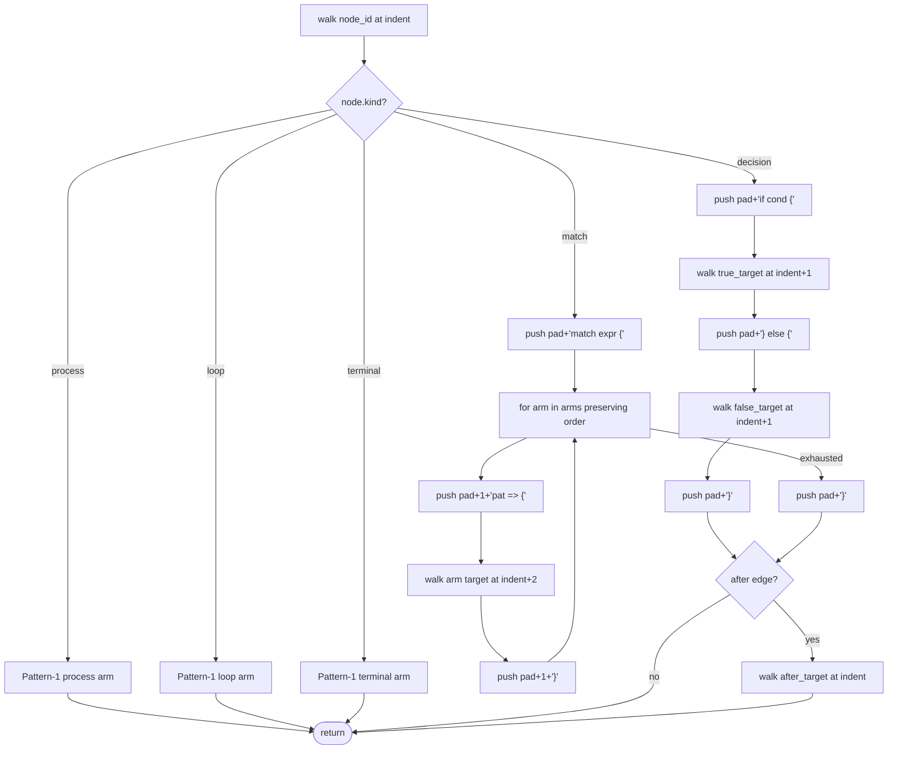

# Path B Pattern 2 — Decisions / If-Else / Match in LogicEmitter

## Overview
<!-- type: overview lang: markdown -->

Path B Pattern 1 — `projects/agentic-workflow/src/generate/gen/rust/logic_emitter.rs` plus `try_generate_logic_emitter()` in `apply.rs` — closed `run_module_facade` via a `signature:`-keyed dispatch that lowers Mermaid Plus Logic frontmatter shaped as `id: + signature: + nodes: + edges:` to a byte-equivalent Rust function body. The Pattern-1 walker covers `process` / `loop` / `terminal` nodes plus `next` / `body` / `after` / `continue` edges only. It explicitly errors `EmitError::Unsupported("decision-shape not supported in spike")` whenever it sees two outgoing `next` edges from one node. Every remaining branching fixture in the 16-marker `missing-generator:logic` cluster trips this guard.

Pattern 2 extends the same emitter with two new node kinds — `Decision { cond, true_target, false_target }` and `Match { expr, arms }` — plus a new `Branch { label }` edge variant. The `walk()` function gains two new arms that emit `if cond { ... } else { ... }` and `match expr { ... }` blocks respectively, both routing through the existing `after`-edge convention for multi-way merge into a shared continuation. No change to `apply.rs` is required: the `signature:` discriminator already routes any LogicEmitter-shaped frontmatter through the new walker.

The byte-equivalence fixture is `emit_cli_subcommand` in `projects/agentic-workflow/src/generate/generators/cli_subcommand.rs`. Its body combines a top-level `for` loop over `cmd.args` with a 3-arm `match arg.kind { Positional | Flag | Option }` inside the loop, and an `if cmd.is_async.unwrap_or(false)` decision after the loop. Closing this fixture exercises decision + match + their interaction with Pattern-1 loops in a single function — the highest-leverage Pattern-2 fixture in the cluster.

## Schema
<!-- type: schema lang: yaml -->

```yaml
$schema: "https://json-schema.org/draft/2020-12/schema"
$id: path-b-pattern-2-decisions#schema
title: LogicEmitter Pattern-2 schema extension
description: >
  Extension to LogicSpec / LogicNode / LogicEdge that adds branching support.
  Pattern-1 invariants (signature:, entry resolution, four-space indent,
  verbatim code: snippets) are preserved verbatim — the new variants are
  additive, not replacing.

definitions:
  LogicNodeKind:
    type: string
    enum: [process, loop, terminal, decision, match]
    description: >
      Discriminator for LogicNode. process, loop, and terminal carry
      Pattern-1 semantics unchanged. decision and match are new.

  LogicNodeDecision:
    type: object
    $id: LogicNodeDecision
    required: [kind, cond, true_target, false_target]
    properties:
      kind:
        const: decision
      cond:
        type: string
        description: >
          The Rust predicate expression rendered between `if` and `{`.
          Emitted verbatim — the spec author is responsible for syntactic
          validity (e.g. `let Some(x) = arg.short` includes both binding
          and predicate).
      true_target:
        type: string
        description: Node id walked at indent+1 inside the `if` block.
      false_target:
        type: string
        description: Node id walked at indent+1 inside the `else` block.
    description: >
      Lowers to:
        if <cond> {
            <walk(true_target) at indent+1>
        } else {
            <walk(false_target) at indent+1>
        }
        <walk(after_target) at current indent if any>

  LogicNodeMatch:
    type: object
    $id: LogicNodeMatch
    required: [kind, expr, arms]
    properties:
      kind:
        const: match
      expr:
        type: string
        description: >
          The Rust scrutinee expression rendered between `match` and `{`.
          Emitted verbatim.
      arms:
        type: object
        description: >
          Ordered map of arm pattern -> target node id. Iteration order is
          the YAML insertion order preserved by serde_yaml::Mapping. The
          arm pattern string is emitted verbatim (e.g. `Some(x)`, `None`,
          `_`, `CliArgKind::Positional`); the spec author owns syntactic
          validity.
        additionalProperties:
          type: string
    description: >
      Lowers to:
        match <expr> {
            <pat1> => {
                <walk(target1) at indent+2>
            }
            <pat2> => {
                <walk(target2) at indent+2>
            }
            ...
        }
        <walk(after_target) at current indent if any>

  LogicNodeFieldExtension:
    type: object
    $id: LogicNodeFieldExtension
    description: >
      Optional fields added to the unified LogicNode struct so that one
      flat shape continues to deserialize all kinds. Required-by-kind is
      enforced by the walker, not by the schema.
    properties:
      cond:
        type: [string, "null"]
      true_target:
        type: [string, "null"]
      false_target:
        type: [string, "null"]
      expr:
        type: [string, "null"]
      arms:
        type: [object, "null"]
        additionalProperties: { type: string }

  LogicEdgeKind:
    type: string
    enum: [next, body, after, continue, branch]
    description: >
      Discriminator for LogicEdge. next/body/after/continue carry
      Pattern-1 semantics unchanged. branch is new.

  LogicEdgeBranch:
    type: object
    $id: LogicEdgeBranch
    required: [from, to, kind]
    properties:
      kind:
        const: branch
      from:
        type: string
      to:
        type: string
      label:
        type: [string, "null"]
        description: >
          Optional human-readable label for the branch (e.g. "yes", "no",
          "Positional"). Carried for round-trip fidelity with rendered
          Mermaid; not consumed by the emit walker — branch transitions
          are routed via node-level true_target / false_target / arms.
    description: >
      Edge variant used for transitions OUT of a decision or match node
      when the spec author prefers edge-driven authoring over node-level
      target fields. The walker treats node-level fields as authoritative;
      branch edges are documentation.

  WalkerInvariant:
    type: object
    $id: WalkerInvariant
    description: >
      Pattern-2 walker invariants on top of the Pattern-1 set.
    properties:
      decision_indent:
        type: string
        const: "true_target and false_target are walked at indent+1; the closing brace pair is at the current indent."
      match_indent:
        type: string
        const: "Each arm pattern emits at indent+1; the arm body walks at indent+2; the closing brace of each arm is at indent+1; the closing brace of the match expression is at the current indent."
      after_continuation:
        type: string
        const: "Both Decision and Match consult the unique outgoing `after`-kind edge to continue at the current indent (same as Pattern-1 Loop). Absent after-edge means the function tail follows immediately."
      pattern1_preserved:
        type: string
        const: "process / loop / terminal / next / body / after walking is byte-identical to Pattern-1. No Pattern-1 spec on main grows a decision or match node."
```

## Logic
<!-- type: logic lang: mermaid -->



## Test Plan
<!-- type: test-plan lang: mermaid -->

```mermaid
---
id: path-b-pattern-2-test-plan
requirements:
  decision_node_schema:
    id: R1
    text: "LogicNodeKind gains Decision { cond, true_target, false_target } and Match { expr, arms } variants that round-trip through serde_yaml"
    kind: functional
    risk: high
    verify: test
  branch_edge_schema:
    id: R2
    text: "LogicEdgeKind gains Branch { label } variant; decision/match transitions never use plain next edges"
    kind: functional
    risk: high
    verify: test
  decision_walker:
    id: R3
    text: "Walker emits if/else block for Decision node and continues into the after edge if any"
    kind: functional
    risk: high
    verify: test
  match_walker:
    id: R4
    text: "Walker emits match block with arms in declaration order and continues into the after edge if any"
    kind: functional
    risk: high
    verify: test
  cli_subcommand_byte_equiv:
    id: R5
    text: "aw td gen-code over the new Logic section in cli-subcommand.md emits a CODEGEN block byte-equivalent to the existing emit_cli_subcommand body"
    kind: functional
    risk: high
    verify: test
  handwrite_removed:
    id: R6
    text: "<HANDWRITE> markers around emit_cli_subcommand are removed; the body lives inside the CODEGEN block"
    kind: functional
    risk: high
    verify: test
  pattern1_no_regression:
    id: R7
    text: "All eight Pattern-1 logic_emitter tests stay green"
    kind: functional
    risk: high
    verify: test
  pattern2_unit_coverage:
    id: R8
    text: "New unit tests cover simple if/else, nested decision, two-arm match, default-arm match, multi-way merge into shared after target, and the cli_subcommand byte-equivalence"
    kind: functional
    risk: high
    verify: test
  coverage_delta:
    id: R9
    text: "score sdd coverage reports one fewer missing-generator:logic marker (emit_cli_subcommand closed); any new walker HANDWRITE markers are tracked under this issue's slug"
    kind: functional
    risk: medium
    verify: test
elements:
  test_simple_if_else:
    kind: test
    type: "rs/#[test]"
  test_nested_decision:
    kind: test
    type: "rs/#[test]"
  test_match_two_arms:
    kind: test
    type: "rs/#[test]"
  test_match_with_default:
    kind: test
    type: "rs/#[test]"
  test_multi_way_merge_after:
    kind: test
    type: "rs/#[test]"
  test_emit_cli_subcommand_byte_equivalent:
    kind: test
    type: "rs/#[test]"
  test_pattern1_module_facade_still_passes:
    kind: test
    type: "rs/#[test]"
  test_branch_edge_roundtrip:
    kind: test
    type: "rs/#[test]"
relations:
  - { from: test_simple_if_else,                    verifies: decision_walker }
  - { from: test_nested_decision,                   verifies: decision_walker }
  - { from: test_match_two_arms,                    verifies: match_walker }
  - { from: test_match_with_default,                verifies: match_walker }
  - { from: test_multi_way_merge_after,             verifies: decision_walker }
  - { from: test_multi_way_merge_after,             verifies: match_walker }
  - { from: test_emit_cli_subcommand_byte_equivalent, verifies: cli_subcommand_byte_equiv }
  - { from: test_emit_cli_subcommand_byte_equivalent, verifies: handwrite_removed }
  - { from: test_pattern1_module_facade_still_passes, verifies: pattern1_no_regression }
  - { from: test_branch_edge_roundtrip,             verifies: branch_edge_schema }
  - { from: test_branch_edge_roundtrip,             verifies: decision_node_schema }
---
requirementDiagram
    requirement R1 {
      id: R1
      text: "LogicNodeKind gains Decision and Match variants that round-trip through serde_yaml"
      risk: High
      verifymethod: Test
    }
    requirement R2 {
      id: R2
      text: "LogicEdgeKind gains Branch variant; decision/match transitions never use plain next edges"
      risk: High
      verifymethod: Test
    }
    requirement R3 {
      id: R3
      text: "Walker emits if/else block for Decision node"
      risk: High
      verifymethod: Test
    }
    requirement R4 {
      id: R4
      text: "Walker emits match block with arms in declaration order"
      risk: High
      verifymethod: Test
    }
    requirement R5 {
      id: R5
      text: "aw td gen-code emits a CODEGEN block byte-equivalent to emit_cli_subcommand"
      risk: High
      verifymethod: Test
    }
    requirement R6 {
      id: R6
      text: "HANDWRITE markers removed; body inside CODEGEN block"
      risk: High
      verifymethod: Test
    }
    requirement R7 {
      id: R7
      text: "All eight Pattern-1 tests stay green"
      risk: High
      verifymethod: Test
    }
    requirement R8 {
      id: R8
      text: "Unit tests cover simple if/else, nested decision, two-arm match, default-arm, multi-way merge"
      risk: High
      verifymethod: Test
    }
    requirement R9 {
      id: R9
      text: "Coverage reports one fewer missing-generator:logic marker"
      risk: Medium
      verifymethod: Test
    }
    element test_simple_if_else { type: "rs/#[test]" }
    element test_nested_decision { type: "rs/#[test]" }
    element test_match_two_arms { type: "rs/#[test]" }
    element test_match_with_default { type: "rs/#[test]" }
    element test_multi_way_merge_after { type: "rs/#[test]" }
    element test_emit_cli_subcommand_byte_equivalent { type: "rs/#[test]" }
    element test_pattern1_module_facade_still_passes { type: "rs/#[test]" }
    element test_branch_edge_roundtrip { type: "rs/#[test]" }
    test_simple_if_else - verifies -> R3
    test_nested_decision - verifies -> R3
    test_match_two_arms - verifies -> R4
    test_match_with_default - verifies -> R4
    test_multi_way_merge_after - verifies -> R3
    test_multi_way_merge_after - verifies -> R4
    test_emit_cli_subcommand_byte_equivalent - verifies -> R5
    test_emit_cli_subcommand_byte_equivalent - verifies -> R6
    test_pattern1_module_facade_still_passes - verifies -> R7
    test_branch_edge_roundtrip - verifies -> R2
    test_branch_edge_roundtrip - verifies -> R1
```

## Changes
<!-- type: changes lang: yaml -->

```yaml
changes:
  - path: projects/agentic-workflow/src/generate/gen/rust/logic_emitter.rs
    action: modify
    section: schema
    impl_mode: hand-written
    description: >
      Extend LogicNodeKind with Decision and Match variants (serde tags
      `decision` and `match`); extend LogicEdgeKind with Branch variant
      (serde tag `branch`); extend LogicNode with optional fields cond,
      true_target, false_target, expr, arms. The schema block is wrapped
      in <HANDWRITE gap="missing-generator:complex-enum-variants">
      because complex-enum-variant codegen is still pending; this issue
      does not change that gap, only the contents inside it.

  - path: projects/agentic-workflow/src/generate/gen/rust/logic_emitter.rs
    action: modify
    section: logic
    impl_mode: hand-written
    description: >
      Extend the walk() function with two new match arms — Decision emits
      `if cond { walk(true_target, indent+1) } else { walk(false_target,
      indent+1) }` and consults the after-edge for continuation; Match
      emits `match expr { ... }` walking each arm at indent+2 and
      consulting the after-edge after the closing brace. The walker stays
      inside the existing intentional-handwrite:codegen-self-host block
      (it is the codegen-emitter; lowering its own match would be
      circular).

  - path: projects/agentic-workflow/tech-design/core/generate/generators/cli-subcommand.md
    action: modify
    section: logic
    impl_mode: hand-written
    description: >
      Add a new H2 section `## Logic: emit_cli_subcommand_body` with
      Mermaid Plus frontmatter in the LogicEmitter shape (id, signature,
      entry, nodes with kind: process|loop|terminal|decision|match,
      edges with kind: next|body|after|branch). The signature field
      drives the apply.rs LogicEmitter dispatch.

  - path: projects/agentic-workflow/tech-design/core/generate/generators/cli-subcommand.md
    action: modify
    section: changes
    impl_mode: hand-written
    description: >
      Add a new entry pointing the new Logic section at
      projects/agentic-workflow/src/generate/generators/cli_subcommand.rs with
      action: modify, section: logic, impl_mode: codegen, replaces:
      [emit_cli_subcommand]. Carries @spec marker for round-trip
      regeneration.

  - path: projects/agentic-workflow/src/generate/generators/cli_subcommand.rs
    action: modify
    section: logic
    impl_mode: codegen
    replaces:
      - emit_cli_subcommand
    description: >
      Replace the <HANDWRITE gap="missing-generator:logic"
      tracker="enhancement-codegen-for-cli-subcommand-emission-clap-derives-d">
      block around emit_cli_subcommand with a CODEGEN-BEGIN/CODEGEN-END
      block emitted by aw td gen-code from the new Logic section in
      cli-subcommand.md. The emitted body must be byte-equivalent to
      the current hand-written body. The supporting helper functions
      (kebab_to_pascal, kebab_to_snake, resolve_field_type) and the
      CliEmitted struct stay outside the CODEGEN block (they are not in
      Pattern 2 scope).

  - path: projects/agentic-workflow/tech-design/core/generate/gen/rust/logic-emitter.md
    action: modify
    section: schema
    impl_mode: hand-written
    description: >
      Promote Pattern 2 from `Limitations / Future Patterns` into
      first-class Schema documentation. Add Decision and Match rows to
      the LogicNodeKind table; add Branch row to the LogicEdgeKind table;
      add a new section block describing the node-level fields cond,
      true_target, false_target, expr, arms with their required-by-kind
      semantics.

  - path: projects/agentic-workflow/tech-design/core/generate/gen/rust/logic-emitter.md
    action: modify
    section: logic
    impl_mode: hand-written
    description: >
      Extend the walker flowchart in the Logic section with the two new
      arms (decision -> if/else open/close; match -> match open + per-arm
      loop + match close). Both new arms feed the same after-edge
      continuation node already present for Loop.

  - path: projects/agentic-workflow/src/generate/gen/rust/logic_emitter.rs
    action: modify
    section: test-plan
    impl_mode: hand-written
    description: >
      Add unit tests under the existing #[cfg(test)] mod tests:
      simple_if_else_emits_correctly, nested_decision_emits_correctly,
      match_two_arms_emits_correctly, match_with_default_arm_emits_correctly,
      multi_way_merge_after_decision_emits_correctly,
      multi_way_merge_after_match_emits_correctly,
      cli_subcommand_body_byte_equivalent (covers R5),
      branch_edge_roundtrips_through_yaml (covers R2). Pattern-1 tests
      remain unchanged so R7 is verified by their continued passing.
```

# Reviews

## Review 1
<!-- type: doc lang: markdown -->
**Verdict:** approved

- [overview] Boundary is correctly drawn — Pattern-2 = decision + match + branch edge over Pattern-1; explicit byte-equivalence target (`emit_cli_subcommand`) ties the deliverable to a measurable success criterion. No `apply.rs` change because the `signature:` discriminator already routes through the LogicEmitter — that reuse is the cleanest possible Pattern-2 surface.
- [schema] LogicNodeKind extension is enumerated explicitly; LogicNodeDecision / LogicNodeMatch carry serde-tag constants and required-field lists. The "node-level fields are authoritative; branch edges are documentation" disambiguator (LogicEdgeBranch.description) cleanly resolves the dual-source tension between node-level `arms:` and edge-level `branch` kinds.
- [logic] Walker flowchart enumerates each emit step at exact indent — `pad+0` for the `if`/`match`/`}` framing, `pad+1` for the arm-pattern lines, `pad+2` for the arm body. The after-check fan-in from both Decision and Match into one `walk_after` node mirrors the Pattern-1 Loop convention so the implementer can copy that block.
- [test-plan] Eight unit tests trace 1:1 to R1–R9 via the relations table; `test_pattern1_module_facade_still_passes` is explicitly carried as the regression guard for R7.
- [changes] Eight entries cover schema (extend LogicNodeKind/LogicEdgeKind/LogicNode), logic (extend walk()), the consumer Logic section in cli-subcommand.md, the corresponding cli-subcommand.md changes-entry, the `emit_cli_subcommand` HANDWRITE→CODEGEN flip, the projects/agentic-workflow/tech-design/core/generate/gen/rust/logic-emitter.md spec promotion (schema + logic), and the test additions. Each entry pins `impl_mode` and (where applicable) `replaces:` so the apply-side dispatch is unambiguous.
