# Path B Pattern 3b — Result / `?` Propagation in LogicEmitter

<!--
Background (not a section, prose only):

Path B Patterns 1 / 2 / 2.5 cover linear flow, nested loops, terminal expressions, statement-position decision and match, and expression-position decision and match. Pattern 3b closes the largest remaining gap: Result / `?` propagation in fallible function bodies. The canonical fixture is `parse_handwrite_markers` at `projects/agentic-workflow/src/generate/audit.rs:626-946`. Pattern 3b adds two optional fields (fallible, error_propagating) and modifies only the Process and Terminal walker arms. Signature stays authoritative — no return-type inference. See #schema for the additive schema and #logic for the four-case emission rule.
-->

## Schema
<!-- type: schema lang: yaml -->

```yaml
$schema: "https://json-schema.org/draft/2020-12/schema"
$id: path-b-pattern-3b-result-propagation#schema
title: LogicEmitter Pattern-3b schema extension
description: >
  Additive extension to LogicNode that adds Result / ? propagation to the
  Process and Terminal walker arms. All Pattern-1, Pattern-2, and Pattern-2.5
  invariants (signature:, entry resolution, four-space indent, verbatim
  code: snippets, statement-position Decision / Match arms,
  expression-position DecisionExpr / MatchExpr arms with bind: and width
  threshold) are preserved verbatim — the new fields are additive and
  optional.

definitions:
  LogicNodeFallibleField:
    type: object
    $id: LogicNodeFallibleField
    description: >
      Additive optional field appended to the unified LogicNode struct.
    properties:
      fallible:
        type: [boolean, "null"]
        description: >
          When Some(true) on a kind: process node, the emitter appends `?`
          to the rendered statement immediately before the trailing `;`.
          When combined with bind: <name>, the emission shape is
          `let <name> = <code>?;`. When None or Some(false), emission is
          identical to existing Pattern-1 behaviour. Required-by-kind
          enforcement: ignored on non-process nodes for the Process arm
          path; the Terminal arm uses error_propagating instead.

  LogicNodeErrorPropagatingField:
    type: object
    $id: LogicNodeErrorPropagatingField
    description: >
      Additive optional field appended to the unified LogicNode struct.
    properties:
      error_propagating:
        type: [boolean, "null"]
        description: >
          When Some(true) on a kind: terminal node, the emitter renders the
          tail expression with `?` appended (e.g. `Err(e)?` rather than
          `Err(e)`). When None or Some(false), emission is identical to
          existing Pattern-1 terminal behaviour (bare tail expression with
          no `;` and no `?`). The flag is meaningful only on terminal
          nodes; presence on other kinds is ignored.

  ProcessArmFourCaseComposition:
    type: object
    $id: ProcessArmFourCaseComposition
    description: >
      The Process walker arm composes bind: and fallible: orthogonally.
    properties:
      no_bind_no_fallible:
        type: string
        const: "Render `<pad><code>;` (existing Pattern-1 behaviour, byte-identical)."
      bind_only:
        type: string
        const: "Render `<pad>let <bind> = <code>;` at the current pad (Pattern-2.5 introduced bind: on DecisionExpr / MatchExpr; Pattern-3b extends bind: semantics to Process nodes)."
      fallible_only:
        type: string
        const: "Render `<pad><code>?;` at the current pad. The `?` is inserted immediately before the trailing `;`."
      bind_and_fallible:
        type: string
        const: "Render `<pad>let <bind> = <code>?;` at the current pad. This is the most common shape — every `?`-propagated let-binding in parse_handwrite_markers and similar parsers."

  TerminalArmTwoCase:
    type: object
    $id: TerminalArmTwoCase
    description: >
      The Terminal walker arm honours error_propagating.
    properties:
      no_error_propagating:
        type: string
        const: "Render `<pad><value>` (existing Pattern-1 behaviour, byte-identical, no trailing `;`, no trailing `?`)."
      with_error_propagating:
        type: string
        const: "Render `<pad><value>?` at the current pad. The `?` is appended directly to the value with no whitespace. This shape covers tail-position Err(e)? and ok().or_else(...)? patterns."

  SignatureAuthority:
    type: object
    $id: SignatureAuthority
    description: >
      Pattern-3b does not infer return types.
    properties:
      rule:
        type: string
        const: "The LogicSpec.signature: field is the sole authority on the function's return type. The emitter does not scan node fields to add or modify `-> Result<...>`. The spec author writes the full signature including return type. The emitter only emits body content (the lines between the signature's opening `{` and the closing `}`)."
      rationale:
        type: string
        const: "Inferring return types from node fields would require a separate scan-and-rewrite pass on the signature string and would couple the walker to the signature parser. Keeping the signature authoritative scopes Pattern-3b to walk() arm changes only."

  PreservedInvariants:
    type: object
    $id: PreservedInvariants
    description: >
      Invariants Pattern-3b preserves from Pattern-1 / Pattern-2 / Pattern-2.5.
    properties:
      pattern1_unchanged:
        type: string
        const: "process / loop / terminal walking is byte-identical to Pattern-1 when fallible and error_propagating are both unset. No Pattern-1 fixture grows a fallible field."
      pattern2_unchanged:
        type: string
        const: "Statement-position Decision / Match arms walk identically. Pattern-3b introduces NO changes to those arms in walk(). Fallible nodes inside a decision / match arm body still recurse through the Process arm with the new conditional."
      pattern25_unchanged:
        type: string
        const: "Expression-position DecisionExpr / MatchExpr arms walk identically. The bind: field semantics introduced by Pattern-2.5 are extended (not replaced) to apply to Process nodes."
      sequential_successor:
        type: string
        const: "After emitting a Process or Terminal node, the walker resolves successors via the existing Next-kind edge mechanism. Pattern-3b does not alter successor resolution."
```

## Logic

```mermaid
---
id: path-b-pattern-3b-walk
entry: walk_node
nodes:
  walk_node:
    kind: process
    label: "walk(spec, node_id, indent, out)"
  inspect:
    kind: decision
    label: "node.kind?"
  emit_pattern1_loop:
    kind: process
    label: "Pattern-1 Loop arm — unchanged"
  emit_pattern2:
    kind: process
    label: "Pattern-2 Decision / Match arms — unchanged"
  emit_pattern25:
    kind: process
    label: "Pattern-2.5 DecisionExpr / MatchExpr arms — unchanged"
  process_fetch:
    kind: process
    label: "Process arm: read code, bind (optional), fallible (optional)"
  process_dispatch:
    kind: decision
    label: "(bind, fallible) ?"
  emit_proc_bare:
    kind: process
    label: "no bind, no fallible: push `<pad><code>;` (Pattern-1 byte-identical)"
  emit_proc_bind_only:
    kind: process
    label: "bind=Some, fallible unset: push `<pad>let <bind> = <code>;`"
  emit_proc_fallible_only:
    kind: process
    label: "bind unset, fallible=true: push `<pad><code>?;`"
  emit_proc_bind_fallible:
    kind: process
    label: "bind=Some, fallible=true: push `<pad>let <bind> = <code>?;`"
  terminal_fetch:
    kind: process
    label: "Terminal arm: read value, error_propagating (optional)"
  terminal_dispatch:
    kind: decision
    label: "error_propagating ?"
  emit_term_bare:
    kind: process
    label: "no error_propagating: push `<pad><value>` (Pattern-1 byte-identical)"
  emit_term_propagating:
    kind: process
    label: "error_propagating=true: push `<pad><value>?`"
  walk_next_proc:
    kind: process
    label: "Process arm only: resolve unique sequential successor (Next-kind); recurse at indent"
  done:
    kind: terminal
    label: "return Ok(())"
edges:
  - { from: walk_node, to: inspect }
  - { from: inspect, to: emit_pattern1_loop, label: "loop" }
  - { from: inspect, to: emit_pattern2, label: "decision | match" }
  - { from: inspect, to: emit_pattern25, label: "decision_expr | match_expr" }
  - { from: inspect, to: process_fetch, label: "process" }
  - { from: inspect, to: terminal_fetch, label: "terminal" }
  - { from: emit_pattern1_loop, to: done }
  - { from: emit_pattern2, to: done }
  - { from: emit_pattern25, to: done }
  - { from: process_fetch, to: process_dispatch }
  - { from: process_dispatch, to: emit_proc_bare, label: "(None, None)" }
  - { from: process_dispatch, to: emit_proc_bind_only, label: "(Some, None)" }
  - { from: process_dispatch, to: emit_proc_fallible_only, label: "(None, Some(true))" }
  - { from: process_dispatch, to: emit_proc_bind_fallible, label: "(Some, Some(true))" }
  - { from: emit_proc_bare, to: walk_next_proc }
  - { from: emit_proc_bind_only, to: walk_next_proc }
  - { from: emit_proc_fallible_only, to: walk_next_proc }
  - { from: emit_proc_bind_fallible, to: walk_next_proc }
  - { from: walk_next_proc, to: done }
  - { from: terminal_fetch, to: terminal_dispatch }
  - { from: terminal_dispatch, to: emit_term_bare, label: "None | Some(false)" }
  - { from: terminal_dispatch, to: emit_term_propagating, label: "Some(true)" }
  - { from: emit_term_bare, to: done }
  - { from: emit_term_propagating, to: done }
---
flowchart TD
    walk_node[walk node_id at indent] --> inspect{node.kind?}
    inspect -->|loop| emit_pattern1_loop[Pattern-1 Loop arm unchanged]
    inspect -->|decision or match| emit_pattern2[Pattern-2 arms unchanged]
    inspect -->|decision_expr or match_expr| emit_pattern25[Pattern-2.5 arms unchanged]
    inspect -->|process| process_fetch[Read code bind fallible]
    inspect -->|terminal| terminal_fetch[Read value error_propagating]
    emit_pattern1_loop --> done([return Ok])
    emit_pattern2 --> done
    emit_pattern25 --> done
    process_fetch --> process_dispatch{bind fallible?}
    process_dispatch -->|None None| emit_proc_bare[push pad code semicolon]
    process_dispatch -->|Some None| emit_proc_bind_only[push pad let bind equals code semicolon]
    process_dispatch -->|None true| emit_proc_fallible_only[push pad code question semicolon]
    process_dispatch -->|Some true| emit_proc_bind_fallible[push pad let bind equals code question semicolon]
    emit_proc_bare --> walk_next_proc[walk sequential successor at indent]
    emit_proc_bind_only --> walk_next_proc
    emit_proc_fallible_only --> walk_next_proc
    emit_proc_bind_fallible --> walk_next_proc
    walk_next_proc --> done
    terminal_fetch --> terminal_dispatch{error_propagating?}
    terminal_dispatch -->|None or false| emit_term_bare[push pad value]
    terminal_dispatch -->|true| emit_term_propagating[push pad value question]
    emit_term_bare --> done
    emit_term_propagating --> done
```

<!-- type: logic lang: mermaid -->



## Test Plan

```mermaid
---
id: path-b-pattern-3b-test-plan
requirements:
  fallible_field:
    id: R1
    text: "LogicNode gains fallible: Option<bool> field that round-trips through serde_yaml and is interpreted only on Process arm"
    kind: functional
    risk: high
    verify: test
  error_propagating_field:
    id: R2
    text: "LogicNode gains error_propagating: Option<bool> field that round-trips through serde_yaml and is interpreted only on Terminal arm"
    kind: functional
    risk: high
    verify: test
  four_case_composition:
    id: R3
    text: "Process arm composes bind: and fallible: orthogonally; the four cases (no/no, bind/no, no/yes, bind/yes) emit distinct shapes"
    kind: functional
    risk: high
    verify: test
  signature_authority:
    id: R4
    text: "Emitter does NOT infer return types; signature: field is authoritative; verbatim signature passes through emit()"
    kind: functional
    risk: medium
    verify: test
  parse_handwrite_byte_equiv:
    id: R5
    text: "aw td gen-code over the new Logic section in audit.md emits a CODEGEN block byte-equivalent to the existing parse_handwrite_markers body"
    kind: functional
    risk: high
    verify: test
  handwrite_removed:
    id: R6
    text: "<HANDWRITE> markers around parse_handwrite_markers are removed; the body lives inside a CODEGEN-BEGIN / CODEGEN-END block"
    kind: functional
    risk: high
    verify: test
  coverage_delta:
    id: R7
    text: "score sdd coverage reports exactly one fewer missing-generator:logic marker (parse_handwrite_markers closed); other gap counts unchanged"
    kind: functional
    risk: medium
    verify: test
  unit_coverage:
    id: R8
    text: "Unit tests cover six Pattern-3b scenarios: bare-fallible, bind-fallible, sequential fallible chain, terminal-error-propagating, fallible-in-decision-arm, byte-equivalent parse_handwrite_markers"
    kind: functional
    risk: high
    verify: test
  no_pattern_regression:
    id: R9
    text: "All Pattern-1 / Pattern-2 / Pattern-2.5 logic_emitter tests stay green; Loop / Decision / Match / DecisionExpr / MatchExpr arms are byte-untouched"
    kind: functional
    risk: high
    verify: test
  audit_md_logic_section:
    id: R10
    text: "audit.md gains a logic-emitter-shape Logic section with signature: field; Changes section flips audit.rs from hand-written to codegen for the logic section"
    kind: functional
    risk: medium
    verify: test
elements:
  test_process_fallible_no_bind:
    kind: test
    type: "rs/#[test]"
  test_process_fallible_with_bind:
    kind: test
    type: "rs/#[test]"
  test_process_sequential_fallible_chain:
    kind: test
    type: "rs/#[test]"
  test_terminal_error_propagating:
    kind: test
    type: "rs/#[test]"
  test_fallible_inside_decision_arm:
    kind: test
    type: "rs/#[test]"
  test_emit_parse_handwrite_markers_byte_equivalent:
    kind: test
    type: "rs/#[test]"
  test_signature_passes_through_unchanged:
    kind: test
    type: "rs/#[test]"
  test_pattern1_pattern2_pattern25_regression:
    kind: test
    type: "rs/#[test]"
relations:
  - { from: test_process_fallible_no_bind, verifies: fallible_field }
  - { from: test_process_fallible_no_bind, verifies: four_case_composition }
  - { from: test_process_fallible_with_bind, verifies: fallible_field }
  - { from: test_process_fallible_with_bind, verifies: four_case_composition }
  - { from: test_process_sequential_fallible_chain, verifies: four_case_composition }
  - { from: test_terminal_error_propagating, verifies: error_propagating_field }
  - { from: test_fallible_inside_decision_arm, verifies: unit_coverage }
  - { from: test_fallible_inside_decision_arm, verifies: no_pattern_regression }
  - { from: test_emit_parse_handwrite_markers_byte_equivalent, verifies: parse_handwrite_byte_equiv }
  - { from: test_emit_parse_handwrite_markers_byte_equivalent, verifies: handwrite_removed }
  - { from: test_signature_passes_through_unchanged, verifies: signature_authority }
  - { from: test_pattern1_pattern2_pattern25_regression, verifies: no_pattern_regression }
---
requirementDiagram
    requirement R1 {
      id: R1
      text: "LogicNode gains fallible field"
      risk: High
      verifymethod: Test
    }
    requirement R2 {
      id: R2
      text: "LogicNode gains error_propagating field"
      risk: High
      verifymethod: Test
    }
    requirement R3 {
      id: R3
      text: "Process arm four-case composition of bind and fallible"
      risk: High
      verifymethod: Test
    }
    requirement R4 {
      id: R4
      text: "Signature authoritative no return-type inference"
      risk: Medium
      verifymethod: Test
    }
    requirement R5 {
      id: R5
      text: "parse_handwrite_markers byte-equivalent regen"
      risk: High
      verifymethod: Test
    }
    requirement R6 {
      id: R6
      text: "HANDWRITE markers removed at parse_handwrite_markers"
      risk: High
      verifymethod: Test
    }
    requirement R7 {
      id: R7
      text: "Coverage delta -1 missing-generator:logic"
      risk: Medium
      verifymethod: Test
    }
    requirement R8 {
      id: R8
      text: "Unit tests across all six Pattern-3b scenarios"
      risk: High
      verifymethod: Test
    }
    requirement R9 {
      id: R9
      text: "Pattern-1 Pattern-2 Pattern-2.5 tests stay green"
      risk: High
      verifymethod: Test
    }
    requirement R10 {
      id: R10
      text: "audit.md gains logic-emitter Logic section"
      risk: Medium
      verifymethod: Test
    }
    element test_process_fallible_no_bind {
      type: "rs/#[test]"
    }
    element test_process_fallible_with_bind {
      type: "rs/#[test]"
    }
    element test_process_sequential_fallible_chain {
      type: "rs/#[test]"
    }
    element test_terminal_error_propagating {
      type: "rs/#[test]"
    }
    element test_fallible_inside_decision_arm {
      type: "rs/#[test]"
    }
    element test_emit_parse_handwrite_markers_byte_equivalent {
      type: "rs/#[test]"
    }
    element test_signature_passes_through_unchanged {
      type: "rs/#[test]"
    }
    element test_pattern1_pattern2_pattern25_regression {
      type: "rs/#[test]"
    }
    test_process_fallible_no_bind - verifies -> R1
    test_process_fallible_no_bind - verifies -> R3
    test_process_fallible_with_bind - verifies -> R1
    test_process_fallible_with_bind - verifies -> R3
    test_process_sequential_fallible_chain - verifies -> R3
    test_terminal_error_propagating - verifies -> R2
    test_fallible_inside_decision_arm - verifies -> R8
    test_fallible_inside_decision_arm - verifies -> R9
    test_emit_parse_handwrite_markers_byte_equivalent - verifies -> R5
    test_emit_parse_handwrite_markers_byte_equivalent - verifies -> R6
    test_signature_passes_through_unchanged - verifies -> R4
    test_pattern1_pattern2_pattern25_regression - verifies -> R9
```

<!-- type: test-plan lang: mermaid -->



## Changes
<!-- type: changes lang: yaml -->

```yaml
changes:
  - path: projects/agentic-workflow/src/generate/gen/rust/logic_emitter.rs
    action: modify
    section: schema
    impl_mode: hand-written
    description: >
      Add fallible: Option<bool> and error_propagating: Option<bool> optional
      fields on LogicNode struct, both gated by serde(default,
      skip_serializing_if = "Option::is_none") so existing fixtures continue
      to round-trip without change. Carries @spec
      projects/agentic-workflow/tech-design/core/generate/path-b-pattern-3b-result-propagation.md#schema. Inside the existing
      HANDWRITE block (codegen-self-host gap; same exception as Pattern-1 /
      Pattern-2 / Pattern-2.5 emitter schema).

  - path: projects/agentic-workflow/src/generate/gen/rust/logic_emitter.rs
    action: modify
    section: logic
    impl_mode: hand-written
    description: >
      Modify the Process arm of walk() to compose bind: and fallible:
      orthogonally per the four-case rule. Modify the Terminal arm to honour
      error_propagating: Some(true) by appending `?` to the rendered tail.
      Pattern-1 emission (no bind, no fallible, no error_propagating) is
      byte-identical to current behaviour; the conditional is purely
      additive. Carries @spec projects/agentic-workflow/tech-design/core/generate/path-b-pattern-3b-result-propagation.md#logic.
      Inside the same HANDWRITE block as Pattern-1 / Pattern-2 / Pattern-2.5
      walker arms (codegen-self-host gap).

  - path: projects/agentic-workflow/tech-design/core/generate/gen/rust/logic-emitter.md
    action: modify
    section: schema
    impl_mode: hand-written
    description: >
      Document the two new optional fields fallible and error_propagating in
      the Schema section. Document the four-case composition rule in the
      Logic / Process arm description. Update the Limitations table to
      remove the Result / ? gap (move the entry from Limitations to
      "Supported as of Pattern-3b"). Carries no codegen — spec authoring
      only.

  - path: projects/agentic-workflow/tech-design/core/generate/audit.md
    action: modify
    section: logic
    impl_mode: hand-written
    description: >
      Add a new logic-emitter-shape Logic section (signature-keyed Mermaid
      Plus frontmatter) describing the parse_handwrite_markers body. Uses
      process nodes with fallible: true + bind: for the parse_attributes(body)?
      style calls, decision nodes for the raw-string detection / comment-strip
      / open-vs-close branches, and a terminal node for the final
      Ok(markers) / Err(failures) dispatch. The existing markdown-shape Logic
      section is replaced by the logic-emitter-shape section so apply.rs
      routes through try_generate_logic_emitter.

  - path: projects/agentic-workflow/src/generate/audit.rs
    action: modify
    section: logic
    impl_mode: codegen
    replaces:
      - parse_handwrite_markers
      - HandwriteParseFailure
      - detect_unclosed_raw_string
      - strip_comment_lead
      - parse_attributes
      - extract_attr
    description: >
      Replace the HANDWRITE block at audit.rs:626-946 with a CODEGEN-BEGIN /
      CODEGEN-END block emitted by aw td gen-code via the extended
      logic_emitter. The replacement is byte-equivalent to the current
      hand-written body (or close enough; rustfmt-driven whitespace
      differences documented in the spec) and preserves all existing unit
      tests under audit::tests. Carries @spec
      projects/agentic-workflow/tech-design/core/generate/audit.md#logic.
  - action: annotate
    section: unit-test
    impl_mode: hand-written
    description: "Traceability metadata edge for the unit-test section."

```

# Reviews

## Review 1
<!-- type: review lang: markdown -->

**Verdict:** approved

- [schema] The two new optional fields (`fallible`, `error_propagating`) are minimal and additive; serde gating preserves round-trip with all existing fixtures. The four-case Process composition table makes the emission rule unambiguous. SignatureAuthority is a clear contract — no return-type inference, signature is authoritative.
- [logic] The Mermaid Plus flowchart distinguishes Pattern-1 / Pattern-2 / Pattern-2.5 dispatch (untouched arms) from the Process / Terminal arms that grow new conditionals. Edge labels enumerate all four (bind, fallible) combinations and both error_propagating cases. Terminal arm has no `walk_next` (terminals end the chain); flowchart correctly omits the successor edge for Terminal.
- [test-plan] Ten requirements with concrete verify methods; eight test elements; relations cover every requirement. R5 (parse_handwrite_markers byte-equivalence) is the central acceptance test; R9 enforces non-interference with prior patterns.
- [changes] Five entries — two on logic_emitter.rs (schema + logic, hand-written, inside the existing codegen-self-host HANDWRITE), one on projects/agentic-workflow/tech-design/core/generate/gen/rust/logic-emitter.md (parent spec update), one on audit.md (consumer logic section), one on audit.rs (codegen, replacing the parse_handwrite_markers HANDWRITE block with a CODEGEN block). The `replaces` list correctly enumerates the helpers (HandwriteParseFailure, detect_unclosed_raw_string, strip_comment_lead, parse_attributes, extract_attr) that share the same logic block.
