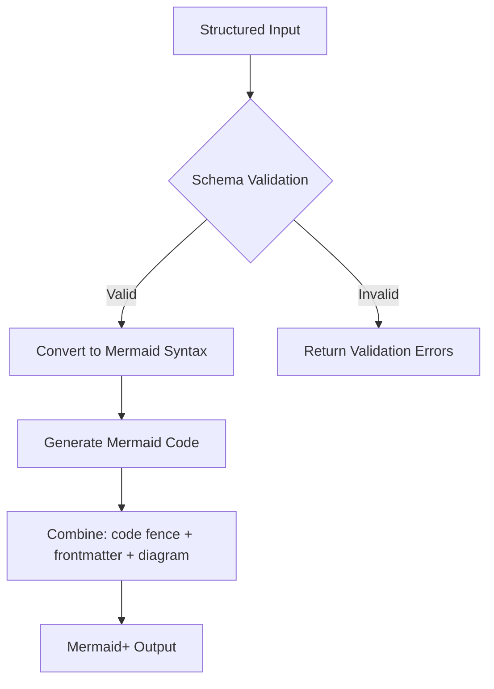

<spec>

# Enhanced Requirement+ Specification (SysML v1.6)

## Overview
<!-- type: doc lang: markdown -->

Specification for the enhanced Mermaid+ Requirement Diagram generator. This enhancement adds full support for SysML v1.6 types, risk levels, verification methods, and relationship types with YAML frontmatter validation.

## Requirements
<!-- type: doc lang: markdown -->

### R1 - SysML v1.6 Type Support

```yaml
id: R1
priority: medium
status: draft
```

Support SysML v1.6 requirement types: functionalRequirement, interfaceRequirement, performanceRequirement, physicalRequirement, designConstraint.

### R2 - Risk and Verification Support

```yaml
id: R2
priority: medium
status: draft
```

Support risk levels (Low, Medium, High) and verification methods (Analysis, Inspection, Test, Demonstration).

### R3 - Relationship Type Support

```yaml
id: R3
priority: medium
status: draft
```

Support requirement relationships: satisfies, verifies, refines, traces, contains, copies, derives.

### R4 - Enhanced Validation

```yaml
id: R4
priority: medium
status: draft
```

Ensure YAML frontmatter validation covers all new types and relationships.

## Acceptance Criteria
<!-- type: doc lang: markdown -->

### Scenario: Valid Requirement Generation

- **GIVEN** A valid requirement definition with performanceRequirement and Test verification.
- **WHEN** Calling sdd_generate_requirement_plus.
- **THEN** Returns Mermaid+ output with correct requirementDiagram syntax and frontmatter.

### Scenario: Invalid Risk Validation

- **GIVEN** A requirement with an invalid risk level.
- **WHEN** Calling sdd_generate_requirement_plus.
- **THEN** Returns a validation error.

## Diagrams
<!-- type: doc lang: markdown -->

### Requirement+ Processing Flow



</spec>
