# Schema Generator Gaps

## Overview
<!-- type: overview lang: markdown -->

Closes thirteen gaps in `projects/agentic-workflow/src/generate/gen/rust/schema.rs` and
`RustTypeTranslator` that were exposed when the `rule.rs` and production
model dogfood specs were regenerated, including follow-on gaps discovered
during Batch 2 codegen:

- R1: `x-methods.dispatch` — emit `match self { variant => value, ... }` arms; never use the raw variant name as the return value.
- R2: `x-constructor` with `impl_mode: codegen` — emit a named constructor with `into()` conversions and `init` field initialisers; skip when `impl_mode: hand-written`.
- R3: `x-builders` entries with `impl_mode: codegen` — emit builder methods that wrap the field value (e.g. `wrap: Some`) and return `Self`.
- R4: Non-dispatch `x-methods` with `impl_mode: codegen` — emit method stubs with the declared signature, using `delegates_to` or `body` as the function body.
- R5: `type: [integer, "null"]` — `RustTypeTranslator` emits `Option<usize>`; `minimum: 1` does not change the `usize` selection; plain `type: integer` continues to default to `u64`.
- R6: Explicit `x-rust-enum.derive` / `x-rust-struct.derive` — emit exactly those derives in declaration order; no additional derives (e.g. `Hash`) are appended.
- R7: `as_str()` and `impl FromStr` are only emitted when explicitly declared via `x-methods`; string enum schemas without these declarations produce no auto-impls.
- R8: `x-serde-alias` — per-field list of alias strings; emit one `alias = "<value>"` serde part per entry after any `x-serde-rename` entry, gated on `struct_has_serde`. Order preserved.
- R9: `x-serde-skip` — per-field value `true | "serializing" | "deserializing"`; emit `skip`, `skip_serializing`, or `skip_deserializing` serde part respectively, gated on `struct_has_serde`; any other value surfaces a generator error.
- R10: `flatten: true` on enum variant struct fields — emit `#[serde(flatten)]` immediately above the field line inside `emit_enum_variants` `"struct"` branch, gated on `has_serde`.
- R11: Collection-type bypass for `already_optional` check — when `x-rust-type` starts with `Vec<`, `HashMap<`, `BTreeMap<`, `HashSet<`, or `BTreeSet<`, treat the field as non-wrappable, emitting the bare type without adding `Option<...>` regardless of whether the field appears in `required:`.
- R12: `explicit_default_bool` gated on `struct_has_serde` — when a struct's `derive:` list lacks both `Serialize` and `Deserialize`, no per-field `#[serde(default)]` is emitted even if `x-serde-default: true` is set, preventing rustc "cannot find attribute `serde` in this scope" errors.
- R13: Rust keyword field names — schema properties such as `async` are emitted as raw identifiers (`r#async`) with serde rename back to the original wire key.

The primary target file is `projects/agentic-workflow/src/generate/gen/rust/schema.rs`. The `RustTypeTranslator` integer-type fix (R5) resides in the same `projects/agentic-workflow/src/generate/gen/rust/` directory.
## Schema
<!-- type: schema lang: yaml -->

```yaml
$id: sdd-generate-schema-rs-gaps
description: |
  Extension annotations recognised by the Rust schema generator
  (projects/agentic-workflow/src/generate/gen/rust/schema.rs) and RustTypeTranslator.
  Gaps R1-R7 (original), plus R8 (x-serde-alias), R9 (x-serde-skip),
  R10 (flatten variant field), R11 (collection-type bypass), R12
  (explicit_default_bool serde gate), and R13 (Rust keyword raw field
  identifiers) added by subsequent changes.

definitions:

  DispatchArm:
    type: object
    description: |
      One arm of a dispatch table inside x-methods.
      R1: The generator emits a match arm returning value for variant.
    required: [variant, value]
    properties:
      variant:
        type: string
        description: "Rust enum variant name (PascalCase)."
      value:
        type: string
        description: "String literal returned for this variant."

  MethodArg:
    type: object
    description: "One argument to a generated method or constructor."
    required: [name, rust_type]
    properties:
      name:
        type: string
        description: "Parameter identifier."
      rust_type:
        type: string
        description: "Rust type string."
      into:
        type: [string, "null"]
        description: |
          R2: When present, the constructor body calls .into() to coerce the
          argument from rust_type to the named target type.

  XMethod:
    type: object
    description: |
      One entry in x-methods on a schema definition.
      R1: When dispatch is present, emit a match-arm body.
      R4: When dispatch is absent and impl_mode is codegen, emit stub.
      R7: as_str and FromStr only emitted when declared here.
    required: [name, impl_mode]
    properties:
      name:
        type: string
        description: "Rust method identifier."
      returns:
        type: [string, "null"]
        description: "Return type string. Omit for unit."
      impl_mode:
        type: string
        enum: [codegen, hand-written]
        description: "codegen emits; hand-written skips."
      doc:
        type: [string, "null"]
        description: "Doc comment text."
      dispatch:
        type: [array, "null"]
        items:
          $ref: "#/definitions/DispatchArm"
        description: "R1: When present, emit match self arms."
      delegates_to:
        type: [string, "null"]
        description: "R4: Rust expression used as method body."
      body:
        type: [string, "null"]
        description: "R4: Literal body when delegates_to is absent."
      args:
        type: [array, "null"]
        items:
          $ref: "#/definitions/MethodArg"
        description: "Method parameters."

  XConstructor:
    type: object
    description: |
      Named constructor on a struct schema definition.
      R2: impl_mode codegen emits pub fn name(args) -> Self with
          into() conversions and init field initialisers.
          impl_mode hand-written skips.
    required: [name, impl_mode]
    properties:
      name:
        type: string
        description: "Constructor function identifier."
      doc:
        type: [string, "null"]
        description: "Doc comment."
      impl_mode:
        type: string
        enum: [codegen, hand-written]
        description: "codegen emits; hand-written skips."
      args:
        type: array
        items:
          $ref: "#/definitions/MethodArg"
        description: "Constructor parameters in declaration order."
      init:
        type: object
        description: |
          R2: Map of field name to literal Rust expression for fields not
          covered by args (e.g. line: None, severity: Severity::Error).
        additionalProperties:
          type: string

  XBuilderEntry:
    type: object
    description: |
      One builder method on a struct schema definition.
      R3: impl_mode codegen emits pub fn name(mut self, arg) -> Self
          wrapping the field value as declared by wrap.
    required: [name, impl_mode, field]
    properties:
      name:
        type: string
        description: "Builder method identifier."
      doc:
        type: [string, "null"]
        description: "Doc comment."
      impl_mode:
        type: string
        enum: [codegen, hand-written]
        description: "codegen emits; hand-written skips."
      field:
        type: string
        description: "Struct field name this builder sets."
      arg:
        $ref: "#/definitions/MethodArg"
        description: "The single builder argument."
      wrap:
        type: [string, "null"]
        description: |
          R3: Wrapper applied to the argument before assignment.
          Example: Some produces self.field = Some(arg_name).

  XRustEnum:
    type: object
    description: |
      Rust enum customisation on a string-enum schema.
      R6: When derive is present, emit exactly those derives in order.
          No extra derives appended.
    properties:
      derive:
        type: array
        items:
          type: string
        description: "R6: Exact derive list in declaration order."
      variants:
        type: array
        items:
          type: object
          required: [name]
          properties:
            name:
              type: string
              description: "PascalCase variant identifier."
            doc:
              type: [string, "null"]
              description: "Per-variant doc comment."

  XRustStruct:
    type: object
    description: |
      Rust struct customisation on an object schema.
      R6: When derive is present, emit exactly those derives in order.
    properties:
      derive:
        type: array
        items:
          type: string
        description: "R6: Exact derive list in declaration order."

  XSerdeAlias:
    type: object
    description: |
      Per-field serde alias extension.
      R8: When x-serde-alias is a non-empty sequence of strings,
          the serde_parts builder appends one alias = "<value>" part
          per entry, in declaration order, after any x-serde-rename
          part. Gated on struct_has_serde.
      Order: Alias parts are emitted in the exact order declared
          in the YAML spec sequence.
    required: [aliases]
    properties:
      aliases:
        type: array
        items:
          type: string
        minItems: 1
        description: |
          Ordered list of serde alias strings. Each entry maps to one
          alias = "<value>" part in the emitted #[serde(...)] attribute.

  XSerdeSkip:
    type: object
    description: |
      Per-field serde skip extension.
      R9: x-serde-skip accepts true (boolean) or the strings
          "serializing" / "deserializing". Mapped to serde parts:
            true            -> skip
            "serializing"   -> skip_serializing
            "deserializing" -> skip_deserializing
          Any other value causes a generator error (not a silent omit).
          Gated on struct_has_serde.
    required: [value]
    properties:
      value:
        description: |
          Boolean true or one of the two direction strings.
          The generator rejects any value outside this set.
        oneOf:
          - type: boolean
            enum: [true]
            description: "Emit skip."
          - type: string
            enum: [serializing, deserializing]
            description: "Emit skip_serializing or skip_deserializing."

  FlattenField:
    type: object
    description: |
      Enum variant struct field with flatten: true.
      R10: When a field inside the "struct" branch of emit_enum_variants
           declares flatten: true AND has_serde is true, emit
           #[serde(flatten)] immediately above the field line.
           Coexists with error_from / #[from] — the flatten check
           runs after the error_from check and before the field-line
           emission.
    required: [flatten]
    properties:
      flatten:
        type: boolean
        enum: [true]
        description: |
          When true and has_serde, emit #[serde(flatten)] above the
          field line inside emit_enum_variants "struct" branch.

  XCollectionTypeBypass:
    type: object
    description: |
      Collection-type bypass for the already_optional check (R11).
      When a property's x-rust-type value starts with one of the five
      collection prefixes (Vec<, HashMap<, BTreeMap<, HashSet<,
      BTreeSet<), the generator treats the field as non-wrappable and
      emits the bare type without wrapping it in Option<>, regardless
      of whether the field name appears in the parent schema's
      required: list.
      Rationale: an explicit x-rust-type: "Vec<T>" declaration signals
      author intent — the field should never silently become
      Option<Vec<T>>.
    required: [rust_type]
    properties:
      rust_type:
        type: string
        description: |
          The x-rust-type value that starts with a collection prefix.
          The generator matches the prefix using starts_with on one of:
          Vec<, HashMap<, BTreeMap<, HashSet<, BTreeSet<.
      collection_prefixes:
        type: array
        description: |
          The exact set of prefixes checked. Ordering is unimportant;
          any match short-circuits the already_optional guard.
        items:
          type: string
          enum: ["Vec<", "HashMap<", "BTreeMap<", "HashSet<", "BTreeSet<"]
        default: ["Vec<", "HashMap<", "BTreeMap<", "HashSet<", "BTreeSet<"]

  XSerdeDefaultGate:
    type: object
    description: |
      Serde-default guard for structs without Serialize/Deserialize (R12).
      The existing auto_default path already factors struct_has_serde
      (auto_default = struct_has_serde && wrap_option). However,
      explicit_default_bool (set when x-serde-default: true appears on
      the field) bypasses that guard. R12 wraps the explicit_default_bool
      branch with struct_has_serde && so that structs whose derive list
      lacks Serialize or Deserialize never receive per-field
      #[serde(default)] attributes — preventing rustc "cannot find
      attribute serde in this scope" errors.
    required: [struct_has_serde, explicit_default_bool]
    properties:
      struct_has_serde:
        type: boolean
        description: |
          True when the struct's derive list contains at least one of
          Serialize or Deserialize. Derived before the field-emission
          loop begins.
      explicit_default_bool:
        type: boolean
        description: |
          True when x-serde-default: true (boolean) appears on the
          current field. The generator emits #[serde(default)] only
          when both struct_has_serde AND explicit_default_bool are true.

  RustKeywordFieldName:
    type: object
    description: |
      Rust keyword field-name handling (R13). The generator first converts
      the schema property key to snake_case, then if that identifier is a
      Rust keyword emits a raw identifier by prefixing r#. Serde rename is
      emitted back to the original property key so the wire format remains
      unchanged.
    required: [field_name, rust_field_name, serde_rename]
    properties:
      field_name:
        type: string
        description: "Original schema property key, e.g. async."
      rust_field_name:
        type: string
        description: "Rust field identifier emitted by codegen, e.g. r#async."
      serde_rename:
        type: string
        description: "Serde rename target preserving the original wire key."
```
## Logic

```mermaid
---
id: schema-rs-generator-dispatch
entry: start
nodes:
  start:                      { kind: start,    label: "generate_schema_with_provenance" }
  check_enum:                 { kind: decision, label: "is_string_enum_schema?" }
  check_x_enum_derive:        { kind: decision, label: "x-rust-enum.derive present?" }
  use_spec_enum_derives:      { kind: process,  label: "emit spec derives only (R6)" }
  use_default_enum_derives:   { kind: process,  label: "emit default derives incl Hash" }
  check_methods_r7:           { kind: decision, label: "x-methods declares as_str?" }
  emit_as_str:                { kind: process,  label: "emit as_str dispatch match (R1)" }
  emit_from_str:              { kind: process,  label: "emit impl FromStr" }
  skip_auto_impls:            { kind: process,  label: "skip as_str + FromStr (R7)" }
  end_enum:                   { kind: terminal, label: "return enum SchemaGenOutput" }
  check_struct_derive:        { kind: decision, label: "x-rust-struct.derive present?" }
  use_spec_struct_derives:    { kind: process,  label: "emit spec derives only (R6)" }
  use_default_struct_derives: { kind: process,  label: "emit default derives" }
  emit_struct_fields:         { kind: process,  label: "emit struct with field Option wrapping" }
  check_integer_null:         { kind: decision, label: "field type [integer null]?" }
  emit_option_usize:          { kind: process,  label: "emit Option<usize> (R5)" }
  check_collection_bypass:    { kind: decision, label: "x-rust-type starts with Vec/Map/Set prefix? (R11)" }
  emit_bare_collection:       { kind: process,  label: "emit bare collection type; skip Option wrap (R11)" }
  emit_normal_type:           { kind: process,  label: "emit translated type" }
  check_serde_rename:         { kind: decision, label: "x-serde-rename present?" }
  emit_serde_rename:          { kind: process,  label: "push rename part" }
  check_serde_alias:          { kind: decision, label: "x-serde-alias non-empty? (R8)" }
  emit_serde_alias:           { kind: process,  label: "push alias parts in order (R8)" }
  check_serde_skip:           { kind: decision, label: "x-serde-skip present? (R9)" }
  validate_serde_skip:        { kind: decision, label: "value in {true, serializing, deserializing}?" }
  emit_serde_skip:            { kind: process,  label: "push skip/skip_serializing/skip_deserializing (R9)" }
  error_serde_skip:           { kind: terminal, label: "return GeneratorError (R9)" }
  check_explicit_default:     { kind: decision, label: "explicit_default_bool AND struct_has_serde? (R12)" }
  emit_serde_default:         { kind: process,  label: "push serde default part (R12)" }
  check_rust_keyword_field:   { kind: decision, label: "field identifier is Rust keyword? (R13)" }
  emit_raw_identifier:        { kind: process,  label: "emit r# raw identifier + serde rename (R13)" }
  check_constructor:          { kind: decision, label: "x-constructor impl_mode codegen?" }
  emit_constructor:           { kind: process,  label: "emit pub fn name(args)->Self with into+init (R2)" }
  check_builders:             { kind: decision, label: "x-builders codegen entries?" }
  emit_builders:              { kind: process,  label: "emit builder methods with wrap (R3)" }
  check_x_methods:            { kind: decision, label: "non-dispatch x-methods codegen?" }
  emit_x_methods:             { kind: process,  label: "emit method stubs delegates_to/body (R4)" }
  end_struct:                 { kind: terminal, label: "return struct SchemaGenOutput" }
  check_enum_variants:        { kind: decision, label: "emit_enum_variants struct branch?" }
  check_flatten:              { kind: decision, label: "field flatten:true AND has_serde? (R10)" }
  emit_serde_flatten:         { kind: process,  label: "emit #[serde(flatten)] above field (R10)" }
  emit_field_line:            { kind: process,  label: "emit field line" }
  end_variant_field:          { kind: terminal, label: "return variant field output" }
edges:
  - { from: start,                      to: check_enum }
  - { from: check_enum,                 to: check_x_enum_derive,        label: "yes" }
  - { from: check_enum,                 to: check_struct_derive,         label: "no - struct" }
  - { from: check_enum,                 to: check_enum_variants,         label: "no - enum variant field" }
  - { from: check_x_enum_derive,        to: use_spec_enum_derives,       label: "yes" }
  - { from: check_x_enum_derive,        to: use_default_enum_derives,    label: "no" }
  - { from: use_spec_enum_derives,      to: check_methods_r7 }
  - { from: use_default_enum_derives,   to: check_methods_r7 }
  - { from: check_methods_r7,           to: emit_as_str,                 label: "declared" }
  - { from: check_methods_r7,           to: skip_auto_impls,             label: "absent" }
  - { from: emit_as_str,                to: emit_from_str }
  - { from: skip_auto_impls,            to: end_enum }
  - { from: emit_from_str,              to: end_enum }
  - { from: check_struct_derive,        to: use_spec_struct_derives,     label: "yes" }
  - { from: check_struct_derive,        to: use_default_struct_derives,  label: "no" }
  - { from: use_spec_struct_derives,    to: emit_struct_fields }
  - { from: use_default_struct_derives, to: emit_struct_fields }
  - { from: emit_struct_fields,         to: check_integer_null }
  - { from: check_integer_null,         to: emit_option_usize,           label: "yes (R5)" }
  - { from: check_integer_null,         to: check_collection_bypass,     label: "no" }
  - { from: emit_option_usize,          to: check_serde_rename }
  - { from: check_collection_bypass,    to: emit_bare_collection,        label: "yes (R11)" }
  - { from: check_collection_bypass,    to: emit_normal_type,            label: "no" }
  - { from: emit_bare_collection,       to: check_serde_rename }
  - { from: emit_normal_type,           to: check_serde_rename }
  - { from: check_serde_rename,         to: emit_serde_rename,           label: "yes" }
  - { from: check_serde_rename,         to: check_serde_alias,           label: "no" }
  - { from: emit_serde_rename,          to: check_serde_alias }
  - { from: check_serde_alias,          to: emit_serde_alias,            label: "yes (R8)" }
  - { from: check_serde_alias,          to: check_serde_skip,            label: "no" }
  - { from: emit_serde_alias,           to: check_serde_skip }
  - { from: check_serde_skip,           to: validate_serde_skip,         label: "yes (R9)" }
  - { from: check_serde_skip,           to: check_explicit_default,      label: "no" }
  - { from: validate_serde_skip,        to: emit_serde_skip,             label: "valid" }
  - { from: validate_serde_skip,        to: error_serde_skip,            label: "invalid" }
  - { from: emit_serde_skip,            to: check_explicit_default }
  - { from: check_explicit_default,     to: emit_serde_default,          label: "yes (R12)" }
  - { from: check_explicit_default,     to: check_rust_keyword_field,    label: "no" }
  - { from: emit_serde_default,         to: check_rust_keyword_field }
  - { from: check_rust_keyword_field,   to: emit_raw_identifier,         label: "yes (R13)" }
  - { from: check_rust_keyword_field,   to: check_constructor,           label: "no" }
  - { from: emit_raw_identifier,        to: check_constructor }
  - { from: check_constructor,          to: emit_constructor,            label: "codegen" }
  - { from: check_constructor,          to: check_builders,              label: "absent/hand-written" }
  - { from: emit_constructor,           to: check_builders }
  - { from: check_builders,             to: emit_builders,               label: "yes" }
  - { from: check_builders,             to: check_x_methods,             label: "none" }
  - { from: emit_builders,              to: check_x_methods }
  - { from: check_x_methods,            to: emit_x_methods,              label: "yes" }
  - { from: check_x_methods,            to: end_struct,                  label: "none" }
  - { from: emit_x_methods,             to: end_struct }
  - { from: check_enum_variants,        to: check_flatten,               label: "struct field" }
  - { from: check_flatten,              to: emit_serde_flatten,          label: "yes (R10)" }
  - { from: check_flatten,              to: emit_field_line,             label: "no" }
  - { from: emit_serde_flatten,         to: emit_field_line }
  - { from: emit_field_line,            to: end_variant_field }
---
flowchart TD
    start([generate_schema_with_provenance]) --> check_enum{is_string_enum_schema?}
    check_enum -->|yes| check_x_enum_derive{x-rust-enum.derive present?}
    check_enum -->|no - struct| check_struct_derive{x-rust-struct.derive present?}
    check_enum -->|no - enum variant field| check_enum_variants{emit_enum_variants struct branch?}

    check_x_enum_derive -->|yes| use_spec_enum_derives[emit spec derives only R6]
    check_x_enum_derive -->|no| use_default_enum_derives[emit default derives incl Hash]
    use_spec_enum_derives --> check_methods_r7{x-methods declares as_str?}
    use_default_enum_derives --> check_methods_r7

    check_methods_r7 -->|declared| emit_as_str[emit as_str dispatch match R1]
    check_methods_r7 -->|absent| skip_auto_impls[skip as_str + FromStr R7]
    emit_as_str --> emit_from_str[emit impl FromStr]
    skip_auto_impls --> end_enum([return enum output])
    emit_from_str --> end_enum

    check_struct_derive -->|yes| use_spec_struct_derives[emit spec derives only R6]
    check_struct_derive -->|no| use_default_struct_derives[emit default derives]
    use_spec_struct_derives --> emit_struct_fields[emit struct fields with Option wrapping]
    use_default_struct_derives --> emit_struct_fields
    emit_struct_fields --> check_integer_null{field type integer+null?}
    check_integer_null -->|yes R5| emit_option_usize[emit Option&lt;usize&gt;]
    check_integer_null -->|no| check_collection_bypass{x-rust-type collection prefix? R11}
    check_collection_bypass -->|yes R11| emit_bare_collection[emit bare collection type R11]
    check_collection_bypass -->|no| emit_normal_type[emit translated type]
    emit_option_usize --> check_serde_rename{x-serde-rename present?}
    emit_bare_collection --> check_serde_rename
    emit_normal_type --> check_serde_rename
    check_serde_rename -->|yes| emit_serde_rename[push rename part]
    check_serde_rename -->|no| check_serde_alias{x-serde-alias non-empty? R8}
    emit_serde_rename --> check_serde_alias
    check_serde_alias -->|yes R8| emit_serde_alias[push alias parts in order R8]
    check_serde_alias -->|no| check_serde_skip{x-serde-skip present? R9}
    emit_serde_alias --> check_serde_skip
    check_serde_skip -->|yes R9| validate_serde_skip{value valid?}
    check_serde_skip -->|no| check_explicit_default{explicit_default_bool AND struct_has_serde? R12}
    validate_serde_skip -->|valid| emit_serde_skip[push skip part R9]
    validate_serde_skip -->|invalid| error_serde_skip([GeneratorError R9])
    emit_serde_skip --> check_explicit_default
    check_explicit_default -->|yes R12| emit_serde_default[push serde default part R12]
    check_explicit_default -->|no| check_rust_keyword_field{field identifier is Rust keyword? R13}
    emit_serde_default --> check_rust_keyword_field
    check_rust_keyword_field -->|yes R13| emit_raw_identifier[emit r# raw identifier + serde rename R13]
    check_rust_keyword_field -->|no| check_constructor{x-constructor codegen?}
    emit_raw_identifier --> check_constructor
    check_constructor -->|codegen| emit_constructor[emit named constructor R2]
    check_constructor -->|absent/hand-written| check_builders{x-builders codegen?}
    emit_constructor --> check_builders
    check_builders -->|yes| emit_builders[emit builder methods R3]
    check_builders -->|none| check_x_methods{non-dispatch x-methods codegen?}
    emit_builders --> check_x_methods
    check_x_methods -->|yes| emit_x_methods[emit method stubs R4]
    check_x_methods -->|none| end_struct([return struct output])
    emit_x_methods --> end_struct

    check_enum_variants -->|struct field| check_flatten{flatten:true AND has_serde? R10}
    check_flatten -->|yes R10| emit_serde_flatten[emit serde flatten above field R10]
    check_flatten -->|no| emit_field_line[emit field line]
    emit_serde_flatten --> emit_field_line
    emit_field_line --> end_variant_field([return variant field output])
```

<!-- type: logic lang: mermaid -->


## Changes
<!-- type: changes lang: yaml -->

```yaml
changes:
  - path: projects/agentic-workflow/src/generate/gen/rust/schema.rs
    action: modify
    section: schema
    impl_mode: hand-written
    description: |
      This changes entry is meta: it records the hand-written edits to the
      Rust schema generator and must not produce a #changes CODEGEN block.
      The schema and logic sections describe the contract; the edits below
      are applied in-place to the existing generator implementation.

      R1: In generate_rust_enum, when an x-methods entry has a dispatch table,
          emit match self arms returning the declared value strings. Never use
          the raw variant name as the return value.
      R2: In generate_schema_with_provenance, read x-constructor. When
          impl_mode is codegen, emit pub fn name(args) -> Self with into()
          conversions on args that declare into: and init field initialisers.
          Skip entirely when impl_mode is hand-written.
      R3: Read x-builders. For each entry with impl_mode: codegen, emit
          pub fn name(mut self, arg: rust_type) -> Self setting
          self.field = wrap(arg) and returning self. Skip hand-written entries.
      R4: Read non-dispatch x-methods with impl_mode: codegen. Emit
          pub fn name(args) -> returns using delegates_to or body as the
          function body. Skip hand-written entries and dispatch entries.
      R5: In infer_rust_type_with_nullable, when the type array includes
          both integer and null, emit usize as the inner type, producing
          Option<usize>. The minimum constraint does not override this.
          Plain type: integer without null continues to default to u64
          when minimum >= 0, or i64 when minimum is absent or negative.
      R6: In generate_rust_enum, when x-rust-enum.derive is present,
          emit derive using exactly the declared list in declaration order.
          Do not append Hash or any other extra derive. Apply same logic for
          x-rust-struct.derive in generate_schema_with_provenance.
      R7: In generate_rust_enum, only emit as_str and impl FromStr when
          x-methods explicitly declares them. Remove unconditional emission
          of these two impls.
      R8: In the serde_parts builder (struct field loop, ~lines 264-317),
          after the x-serde-rename block, check prop_value.get("x-serde-alias").
          If it is a non-empty Sequence, iterate the entries in order and push
          one format!("alias = \"{}\"", s) per string into serde_parts.
          Gate the entire block on struct_has_serde.
      R9: In the same serde_parts builder, after the x-serde-alias block,
          check prop_value.get("x-serde-skip"). Map values:
            Value::Bool(true)       -> push "skip"
            Value::String("serializing")   -> push "skip_serializing"
            Value::String("deserializing") -> push "skip_deserializing"
            any other value         -> return Err(GeneratorError) immediately.
          Gate on struct_has_serde.
      R10: In emit_enum_variants, inside the "struct" match branch
           (~lines 1354-1385), for each field f: after the error_from
           check and before emitting the field line, check
           f.get("flatten") for boolean true. If true and has_serde,
           push the line "        #[serde(flatten)]" before the field line.
      R11: In the already_optional check (~line 217), extend the OR chain to
           also treat collection-type x-rust-type values as non-wrappable.
           Current check:
             let already_optional = inner_type.starts_with("Option<")
               || inner_type.starts_with("std::option::Option<");
           New check (inline or refactored to is_collection_or_option helper):
             let already_optional = inner_type.starts_with("Option<")
               || inner_type.starts_with("std::option::Option<")
               || inner_type.starts_with("Vec<")
               || inner_type.starts_with("HashMap<")
               || inner_type.starts_with("BTreeMap<")
               || inner_type.starts_with("HashSet<")
               || inner_type.starts_with("BTreeSet<");
           Effect: a field with x-rust-type: "Vec<T>" and absent from
           required: emits pub field: Vec<T>, not pub field: Option<Vec<T>>.
      R12: In the serde_parts builder, locate the default emission branch
           (~lines 329-332):
             if let Some(fn_name) = explicit_default_fn { ... }
             else if explicit_default_bool || auto_default {
               serde_parts.push("default".to_string());
             }
           Wrap explicit_default_bool with struct_has_serde:
             else if (struct_has_serde && explicit_default_bool) || auto_default {
               serde_parts.push("default".to_string());
             }
           Rationale: auto_default is already defined as
           struct_has_serde && wrap_option, so it is already safe.
           explicit_default_bool has no such guard — adding
           struct_has_serde && prevents emission of #[serde(default)]
           on structs that derive neither Serialize nor Deserialize.
      R13: In the struct field-emission path, route schema property names
           through a helper that converts snake_case identifiers which are
           Rust keywords into raw identifiers by prefixing r#.
           Example: property key async emits:
             #[serde(rename = "async", default)]
             pub r#async: bool,
           The helper is also used for generated constructor field
           initialisers so shorthand and explicit field assignment remain
           consistent.
  - action: annotate
    section: logic
    impl_mode: hand-written
    description: "Traceability metadata edge for the logic section."

```

# Reviews

## Review 1
<!-- type: doc lang: markdown -->
**Verdict:** approved

- [schema] All seven gaps (R1–R7) are represented as distinct, testable schema definitions (DispatchArm, MethodArg, XMethod, XConstructor, XBuilderEntry, XRustEnum, XRustStruct) with required fields and accurate descriptions. Coverage is complete.
- [logic] The Mermaid Plus diagram traces the full generator decision tree end-to-end with labelled edges for all seven gaps. One nit: `check_integer_null` appears as a single linear step between `emit_struct_fields` and `check_constructor`, but R5 is a per-field decision inside a loop while the constructor/builder/method checks are per-struct. The schema section and changes text make the per-field intent unambiguous, so this is not a blocker.
- [changes] R5 is split into a second `modify` entry for the same `projects/agentic-workflow/src/generate/gen/rust/schema.rs` path. The split is harmless — `infer_rust_type_with_nullable` is confirmed to be defined in `schema.rs` — but consolidating into one entry would eliminate any ambiguity about two-pass application.
- [overview] Reference to `projects/agentic-workflow/tech-design/core/validate/rule.md` is present in the issue Reference Context and confirmed on disk; the dogfood linkage is clear.

## Review 2
<!-- type: doc lang: markdown -->
**Verdict:** approved

- [schema] `XSerdeAlias`, `XSerdeSkip`, and `FlattenField` are all present and correctly typed. `XSerdeSkip.value` uses `oneOf` with `type: boolean enum: [true]` and `type: string enum: [serializing, deserializing]` — the correct pattern for a tri-valued field. `FlattenField.flatten` is `boolean enum: [true]`, unambiguous. One minor label nit: `XSerdeAlias` description uses `R4 (order):` which collides with R4 in the spec overview (non-dispatch x-methods); the intent is clear from context so this does not block implementation.
- [logic] All three new branches are present in the Mermaid diagram with correct labelling: `check_serde_alias` → `emit_serde_alias` (R8), `check_serde_skip` → `validate_serde_skip` → `{emit_serde_skip | error_serde_skip}` (R9 including the reject path), and `check_enum_variants` → `check_flatten` → `{emit_serde_flatten → emit_field_line | emit_field_line}` (R10). The invalid-value terminal node `error_serde_skip` satisfies the validation/reject coverage requirement.
- [changes] R8 and R9 reference `~lines 264-317` with concrete key names (`prop_value.get("x-serde-alias")`, `prop_value.get("x-serde-skip")`) and map all accepted values plus the error branch. R10 references `~lines 1354-1385` and specifies the exact insertion point (after `error_from` check, before field-line emission). All three anchors are actionable.
- [overview] The four acceptance fixtures (`frontmatter.rs`, `types.rs`, `change.rs`, `spec_ir/types.rs`) named in the Scope section serve as round-trip tests for R8-R10; no additional test names are needed for the spec to be implementable.

## Review 3
<!-- type: doc lang: markdown -->
**Verdict:** approved

- [overview] R11 and R12 are clearly stated and consistent with the issue requirements. The target file (`schema.rs`) and the rationale for each gap are unambiguous.
- [schema] `XCollectionTypeBypass` enumerates all five collection prefixes with a `default` array and a `starts_with` match description; `XSerdeDefaultGate` correctly models the `struct_has_serde && explicit_default_bool` compound guard. Both definitions are well-typed and implementable.
- [logic] `check_collection_bypass` and `check_explicit_default` nodes are correctly placed and labelled in both the Mermaid Plus node list and the flowchart TD. The `check_collection_bypass` decision appears after `check_integer_null` (R5), which is the correct evaluation order.
- [changes] R11 provides an exact before/after `already_optional` code diff with the five collection prefixes. R12 provides an exact before/after for the `explicit_default_bool` guard anchored to `~lines 329-332`. Both are immediately actionable.
