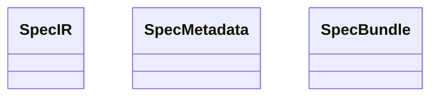

<spec>

# SpecIR Contract Definition

## Overview
<!-- type: doc lang: markdown -->

Define the SpecIR (Specification Intermediate Representation) contract in cclab-sdd that serves as the universal input format for code generators in cclab-lens. SpecIR unifies structured specs (OpenAPI/JSON Schema) and diagram specs (Mermaid Plus YAML frontmatter) into a single typed representation that generators consume. This addresses GitHub issue #325 and is the foundational type for the entire spec-to-code pipeline.

## Requirements
<!-- type: doc lang: markdown -->

### R1 - SpecIR enum type

```yaml
id: R1
priority: high
status: implemented
```

Define a SpecIR enum in cclab-sdd/src/spec_ir/ that represents all 6 spec types from the knowledge base: ApiSpec (OpenAPI/JSON Schema), SequencePlus, FlowchartPlus (with SemanticType), ClassPlus (with Stereotype), ErdPlus (with FK/PK), RequirementPlus (with N:M mapping). Each variant wraps the existing Generate schema types (e.g., FlowchartDef, ClassDef, ErdDef, SequenceDef).

### R2 - SpecIR metadata

```yaml
id: R2
priority: high
status: implemented
```

Each SpecIR variant carries common metadata: source file path, spec group, spec ID, and a list of tags. This metadata enables generators to make routing decisions (can_generate) without parsing the full spec.

### R3 - SpecIR construction from Generate types

```yaml
id: R3
priority: high
status: implemented
```

Provide From<T> implementations to construct SpecIR from existing Generate types: From<JsonSchema>, From<FlowchartDef>, From<ClassDiagramDef>, From<ERDDef>, From<SequenceDef>, From<RequirementDiagramDef>. Parsing is Generate's responsibility; SpecIR is the output contract.

### R4 - Public API export

```yaml
id: R4
priority: medium
status: implemented
```

Export SpecIR and all related types from cclab-sdd's lib.rs so that cclab-lens (which already depends on cclab-sdd) can import them directly. The types must be Serialize + Deserialize for JSON transport.

### R5 - SpecBundle for multi-spec input

```yaml
id: R5
priority: medium
status: implemented
```

Define a SpecBundle struct that holds Vec<SpecIR> plus a dependency graph (which specs reference which). This allows generators to receive the complete context for a change, not just individual specs.

## Diagrams
<!-- type: doc lang: markdown -->

### SpecIR Type Hierarchy



</spec>
