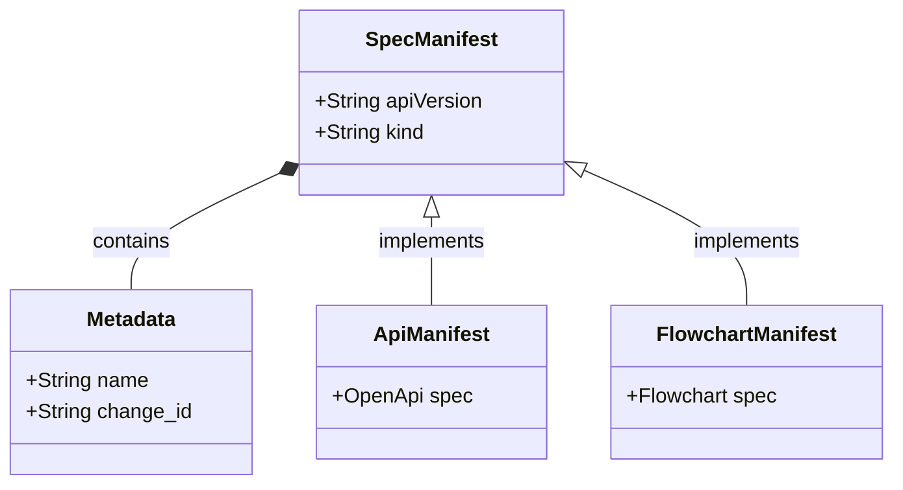

<spec>

# SpecIR YAML Manifest Schema

## Overview
<!-- type: overview lang: markdown -->

Defines the YAML schema for SpecIR manifests, following a Kubernetes-style resource model (apiVersion, kind, metadata, spec). This serves as the language-agnostic interface between SDD (producer) and Lens (consumer).

## Requirements
<!-- type: requirements lang: mermaid -->

```mermaid
---
id: spec-ir-schema-requirements
---
requirementDiagram
    requirement R1 {
        id: R1
        text: Require apiVersion, kind, metadata, and spec envelope fields.
        risk: medium
        verifymethod: test
    }
    requirement R2 {
        id: R2
        text: Use kind to select the payload schema stored under spec.
        risk: medium
        verifymethod: test
    }
    requirement R3 {
        id: R3
        text: Enforce strict YAML serialization and reject unknown fields.
        risk: medium
        verifymethod: test
    }
```

## Acceptance Criteria
<!-- type: scenarios lang: yaml -->

```yaml
scenarios:
  - name: serialize-api-spec
    when: An API spec is serialized.
    then: A valid YAML manifest with kind Api and OpenApi spec payload is produced.
  - name: deserialize-valid-manifest
    when: A valid YAML file is read.
    then: The manifest is successfully parsed into the corresponding Rust struct.
  - name: error-on-missing-kind
    when: A YAML file missing the kind field is parsed.
    then: A validation error is returned stating kind is required.
```

## Diagrams
<!-- type: diagram lang: mermaid -->

### SpecIR Manifest Model



## API Specification (JSON Schema)
<!-- type: schema lang: yaml -->

```yaml
$schema: http://json-schema.org/draft-07/schema#
properties:
  apiVersion:
    type: string
  kind:
    enum:
    - Api
    - FlowchartPlus
    - SequencePlus
    - ClassPlus
    - ErdPlus
    - RequirementPlus
    type: string
  metadata:
    properties:
      change_id:
        type: string
      name:
        type: string
      source_file:
        type: string
    required:
    - name
    - change_id
    type: object
  spec:
    type: object
required:
- apiVersion
- kind
- metadata
- spec
title: SpecManifest
type: object
```

</spec>

## Changes
<!-- type: changes lang: yaml -->

```yaml
changes:
  - action: annotate
    section: requirements
    impl_mode: hand-written
    description: "Traceability metadata edge for the requirements section."

  - action: annotate
    section: scenarios
    impl_mode: hand-written
    description: "Traceability metadata edge for the scenarios section."

  - action: annotate
    section: schema
    impl_mode: hand-written
    description: "Traceability metadata edge for the schema section."

```