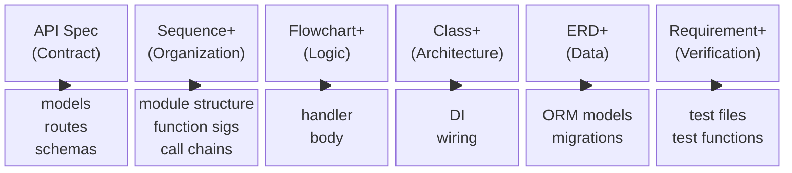
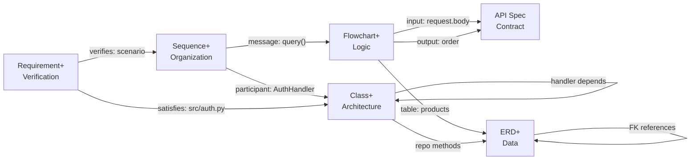
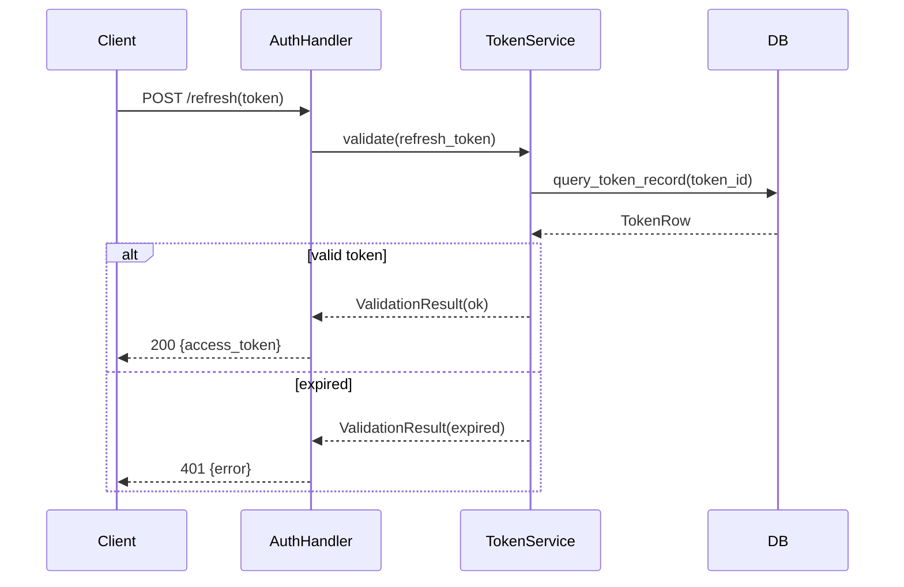
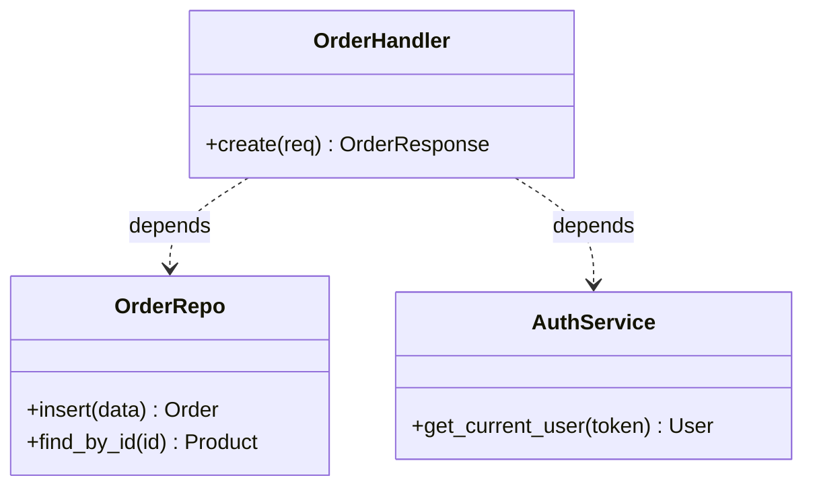

# Spec-to-Code Model

## Principle
<!-- type: doc lang: markdown -->

Specs are **language/framework-agnostic** — they describe WHAT, not HOW. Different system types need different spec combinations.

## Spec Catalog
<!-- type: doc lang: markdown -->

Six core spec types. Pick the subset that fits your system.

| Spec | Layer | Describes | Maps to |
|---|---|---|---|
| **API Spec** (OpenAPI / OpenRPC) | Contract | What the system exposes | models, routes, schemas |
| **Sequence Plus** | Organization | Who does what, in what order | module structure, function signatures, DI wiring |
| **Flowchart Plus** | Logic | Step-by-step decision logic per handler | handler body code |
| **Class Plus** | Architecture | Components, responsibilities, dependencies | class/struct definitions, DI |
| **ERD Plus** | Data | Tables, columns, keys, relationships | ORM models, migrations |
| **Requirement Plus** | Verification | Requirements ↔ scenarios ↔ code traceability | test files, test functions |



## System Archetypes
<!-- type: doc lang: markdown -->

| System Type | Spec Combination |
|---|---|
| Single CRUD route | API Spec + Flowchart+ |
| API service with dependencies | API Spec + Sequence+ + Flowchart+ + Class+ + ERD+ |
| Workflow / state machine | API Spec + State+ + Sequence+ + Flowchart+ + Requirement+ |
| Data pipeline | ERD+ + Flowchart+ + Sequence+ |
| Full module with tests | All six (Requirement+ for test scaffolding) |

## Spec Interactions
<!-- type: doc lang: markdown -->



| From | References | To | Example |
|---|---|---|---|
| Flowchart | `input: "request.body"` | API Spec requestBody | Pydantic model |
| Flowchart | `table: "products"` | ERD entity name | DB query target |
| Flowchart | `output: "order"` | API Spec response | Return type |
| Sequence | `participant: AuthHandler` | Class component | Module boundary |
| Sequence | `message: validate()` | Flowchart entry point | Function call in handler |
| Class | `OrderRepo` methods | ERD entities | Repository operates on tables |
| Class | `OrderHandler` dependency | Class `OrderRepo` | DI wiring |
| ERD | `FK references: "users.id"` | ERD entity.attribute | Foreign key link |
| Requirement | `element -satisfies-> R1` | Class component / file | Code that implements R1 |
| Requirement | `element -verifies-> R1` | Scenario (from Sequence) | Test that validates R1 |

## Spec Details
<!-- type: doc lang: markdown -->

### 1. API Spec — System Contract

**Describes:** what the system exposes to callers.

Supported formats:
- **OpenAPI 3.1** — REST endpoints, request/response models, status codes, auth schemes
- **OpenRPC 1.3** — JSON-RPC / CLI tool definitions, params, result schemas
- **AsyncAPI 2.6** — Event channels, message schemas
- **Serverless Workflow 0.8** — State machine definitions

**Generate tools:** `sdd_generate_openapi`, `sdd_generate_openrpc`, `sdd_generate_asyncapi`, `sdd_generate_serverless_workflow`

### 2. Sequence Plus — Code Organization

**Describes:** who does what, in what order. One diagram can contain multiple scenarios (happy path + error paths) via `alt`/`opt` blocks, and operate at multiple granularity levels simultaneously.

**Key principle:** Sequence diagrams define **module boundaries and function signatures**. Each participant becomes a module/class; each message becomes a function that the receiver must expose.



**Mapping rules (N:M — one diagram, multiple outputs):**

| Diagram Element | Maps to | Relationship |
|---|---|---|
| `participant A` | Module / file / class | One participant → one module |
| `A->>B: method(args)` | B exposes `method(args)` callable by A | Message → function signature on receiver |
| `B-->>A: ReturnType` | Return type of the method | Return message → function return type |
| Message ordering (top→bottom) | Call sequence within the caller's function body | Order → code line order |
| `alt` / `else` block | `if/else` or `match` branches | Alt → conditional branches |
| `opt` block | Optional execution (`if condition`) | Opt → guard clause |
| `loop` block | `for`/`while` or retry logic | Loop → iteration construct |
| `par` block | Concurrent execution (`tokio::join!`, `asyncio.gather`) | Par → concurrency |
| `Note over A,B` | Code comment or doc string | Note → documentation |

**Granularity levels in one diagram:**
- **Macro** (system-to-system): `Client ->> APIGateway ->> ServiceA` → defines API boundaries, separate services
- **Micro** (module-to-module): `Handler ->> Service ->> Repo ->> DB` → defines call chain within one service, becomes DI wiring

**Does NOT describe:** implementation details inside each function (that's Flowchart Plus).

**Generate tool:** `sdd_generate_sequence_plus`

### 3. Flowchart Plus — Business Logic

**Describes:** the step-by-step logic inside a single function/handler.

Each node carries a `SemanticType` that is machine-readable for code generation:

| SemanticType | Maps to |
|---|---|
| `start` | Function entry |
| `end { output }` | Return statement |
| `validation { input, rules, error_code }` | Input validation + error response |
| `condition { expression }` | if/else branch |
| `db_query { table, filter, output }` | Database SELECT |
| `db_mutation { operation, table, data }` | Database INSERT/UPDATE/DELETE |
| `api_call { method, url, body, output }` | External HTTP request |
| `transform { input, output, expression }` | Data mapping |
| `assign { variable, value }` | Variable assignment |
| `raise_error { code, message }` | Error response |
| `loop_start { condition }` / `loop_end` | Loop construct |

Edges carry `condition` (branch expression) and `is_error_path` (error handling path).

**Relationship to Sequence Plus:** Each message in a sequence diagram (`A->>B: method()`) can have a corresponding flowchart that details what B does inside `method()`. Sequence = the call graph; Flowchart = the body of each call.

**Generate tool:** `sdd_generate_flowchart_plus`

### 4. Class Plus — Component Architecture

**Describes:** service components, their responsibilities, and dependency relationships.



**Does NOT describe:** how dependencies are injected (that's framework-specific).

**Generate tool:** `sdd_generate_class_plus`

### 5. ERD Plus — Data Model

**Describes:** database tables, columns, keys, and relationships between tables.

```mermaid
erDiagram
    users {
        UUID PK id
        VARCHAR email
        TIMESTAMP created_at
    }
    products {
        UUID PK id
        VARCHAR name
        INTEGER stock
    }
    orders {
        UUID PK id
        UUID FK user_id
        UUID FK product_id
        INTEGER quantity
    }
    users ||--o{ orders : places
    products ||--o{ orders : contains
```

**Does NOT describe:** ORM model code, migration scripts, or DB engine specifics.

**Generate tool:** `sdd_generate_erd_plus`

### 6. Requirement Plus — Test Verification

**Describes:** N:M traceability between requirements, acceptance scenarios, and code modules. One diagram can contain multiple requirements, multiple scenarios, and multiple modules — all cross-linked.

**Key principle:** This is the **test generation blueprint**. The relationships define what to test, how to test it, and which code is under test.

```mermaid
requirementDiagram
    functionalRequirement R1 {
        id: R1
        text: Users can refresh expired tokens
        risk: Medium
        verifymethod: Test
    }
    functionalRequirement R2 {
        id: R2
        text: Invalid tokens return 401
        risk: High
        verifymethod: Test
    }

    element Scenario_happy   { type: Scenario  docref: "valid refresh token" }
    element Scenario_expired { type: Scenario  docref: "expired token returns 401" }
    element Scenario_revoked { type: Scenario  docref: "revoked token returns 401" }
    element auth_handler     { type: Module    docref: "src/handlers/auth.py" }
    element token_service    { type: Module    docref: "src/services/token.py" }

    Scenario_happy - verifies -> R1
    Scenario_expired - verifies -> R2
    Scenario_revoked - verifies -> R2
    auth_handler - satisfies -> R1
    auth_handler - satisfies -> R2
    token_service - satisfies -> R1
    R2 - derives -> R1
```

**Mapping rules (N:M — one diagram, multiple requirements and scenarios):**

| Diagram Element | Maps to | Relationship |
|---|---|---|
| `functionalRequirement R1` | Test docstring / test class grouping | One R → one or more test functions |
| `element { type: Scenario, docref }` | One `def test_*()` function | Scenario name → test function name |
| `element { type: Module, docref }` | `import` / module under test | docref → the code being tested |
| `Scenario -verifies-> R1` | Test function validates requirement R1 | N scenarios can verify 1 requirement |
| `Module -satisfies-> R1` | Test imports this module to test R1 | 1 module can satisfy N requirements |
| `R2 -derives-> R1` | R2 depends on R1; test R1 first | Test execution ordering |
| `risk: High` | Test priority — run in CI fast path | High risk → critical test |
| `verifymethod: Test` | Automated test (vs Inspection, Analysis, Demonstration) | Determines test type |

**Example output (Python/pytest):**

```yaml
# Generated test structure from Requirement Plus diagram
test_file: tests/test_auth_token_refresh.py
imports:
  - module: src.handlers.auth.AuthHandler    # satisfies R1, R2
  - module: src.services.token.TokenService  # satisfies R1

test_classes:
  - name: TestR1_TokenRefresh
    requirement: "R1: Users can refresh expired tokens (risk: Medium)"
    tests:
      - name: test_valid_refresh_token
        scenario: "valid refresh token → verifies R1"
        given: a user with a valid refresh token
        when: POST /refresh is called
        then: a new access token is returned

  - name: TestR2_InvalidToken
    requirement: "R2: Invalid tokens return 401 (risk: High) [derives R1]"
    tests:
      - name: test_expired_token_returns_401
        scenario: "expired token returns 401 → verifies R2"
        given: an expired refresh token
        when: POST /refresh is called
        then: 401 is returned
      - name: test_revoked_token_returns_401
        scenario: "revoked token returns 401 → verifies R2"
        given: a revoked refresh token
        when: POST /refresh is called
        then: 401 is returned
```

**Does NOT describe:** test implementation details (mocks, fixtures, assertions).

**Generate tool:** `sdd_generate_requirement_plus`

## Supplementary Specs
<!-- type: doc lang: markdown -->

These are situational — used for specific system types, not universally required.

| Spec | Layer | When to use |
|---|---|---|
| **State Plus** | State machine | Systems with explicit phase transitions (workflow engines, protocol handlers) |
| **Block Plus** | Dependency DAG | Spec dependency graphs, build pipelines, module dependency visualization |
| **Mindmap Plus** | Scope overview | High-level module/area organization, project scoping |
| **Journey Plus** | User flow | E2E test scenarios, user experience flows |

**Generate tools:** `sdd_generate_state_plus`, `sdd_generate_block_plus`, `sdd_generate_mindmap_plus`, `sdd_generate_journey_plus`

## Scope Guidelines
<!-- type: doc lang: markdown -->

| Scenario | Specs Needed |
|---|---|
| Single CRUD route | API Spec + Flowchart+ |
| Route with service dependencies | API Spec + Sequence+ + Flowchart+ + Class+ |
| Route with DB access | API Spec + Sequence+ + Flowchart+ + ERD+ |
| Full module with tests | API Spec + Sequence+ + Flowchart+ + Class+ + ERD+ + Requirement+ |
| Workflow / state machine | API Spec + State+ + Sequence+ + Flowchart+ + Requirement+ |
| Pure data model / schema | ERD+ only |

## Sequence Plus ↔ Flowchart Plus Boundary
<!-- type: doc lang: markdown -->

These two specs are complementary, not overlapping:

- **Sequence Plus** = the call graph (who calls whom, in what order, across modules)
- **Flowchart Plus** = the function body (what happens inside each call)

One Sequence message `A->>B: validate(token)` can expand into an entire Flowchart that details B's internal `validate()` logic. Use Sequence to plan module structure; use Flowchart to implement each function.

## What Specs Do NOT Cover
<!-- type: doc lang: markdown -->

These are handled by the code generator, not specs:

- DI mechanism (FastAPI `Depends()`, Spring `@Autowired`, etc.)
- ORM model code (SQLAlchemy models, Lensa schema — generated FROM ERD Plus)
- Migration scripts (Alembic, Flyway — generated FROM ERD Plus)
- Framework boilerplate (app setup, middleware registration)
- Import statements and module structure
- Test fixtures, mocks, and assertion logic (generated FROM Requirement Plus structure)
