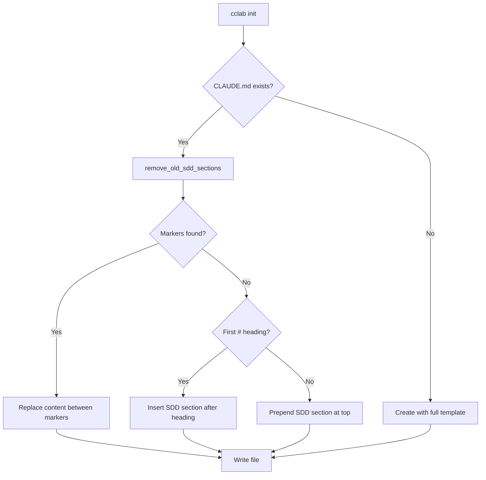

# CLAUDE.md SDD Section Template

## Overview
<!-- type: overview lang: markdown -->

The CLAUDE.md template injects SDD workflow instructions into a project's `CLAUDE.md` file. It uses marker-based upsert to safely update the SDD section without overwriting user-written content outside the markers.

The template contains a concise reference for Claude Code: workflow skills (`/cclab:sdd:run-change`), utility skills (`/cclab:sdd:agent`, `/cclab:sdd:fillback-main-specs`), and tool pointers for knowledge and specs.

**Template source**: `crates/cclab-sdd/templates/mainthread/CLAUDE.md`

## Template
<!-- type: doc lang: markdown -->

```markdown
# CLAUDE.md

<!-- cclab:sdd:start -->
SDD: Spec-Driven Development

**IMPORTANT: Spec-First Rule** — Always update specs BEFORE modifying source code.
1. **Preferred**: Use the SDD workflow skills below (they handle spec updates automatically).
2. **Manual**: If skipping SDD tools, update `.aw/tech-design/{scope}` first, then modify the codebase.

### Workflow Skills

| Skill | Purpose |
|-------|---------|
| `/cclab:sdd:run-change` | Unified workflow: decide -> plan -> implement -> merge |

The skill is **state-aware** -- calls `sdd_run_change` CLI tool internally and resumes from the current phase.

**CRITICAL**: One change-id handles ALL referenced issues. NEVER split multiple issues (e.g. `"#272 #273"`) into separate changes. Pass the full description to the tool -- it manages multi-issue routing internally.

Start with: `/cclab:sdd:run-change <id> "<description>"`

### Utility Skills

| Skill | Purpose |
|-------|---------|
| `/cclab:sdd:agent` | Run prompts with any LLM agent (Gemini, Codex, Claude) |
| `/cclab:sdd:fillback-main-specs` | Fillback: generate rich specs from existing code |

### Knowledge Base

System documentation is in `cclab/knowledge/`, specs in `.aw/tech-design/`. Use CLI tools to read:
- `mcp__cclab__sdd_list_knowledge` / `read_knowledge` -- Knowledge files
- `mcp__cclab__sdd_list_main_specs` / `read_main_spec` -- Spec files
<!-- cclab:sdd:end -->
```

## Installation
<!-- type: doc lang: markdown -->

### R1 - Compile-Time Embedding

```yaml
id: R1
priority: high
status: draft
```

The template is embedded via `include_str!()` as `CLAUDE_TEMPLATE` in `init.rs:23`. At runtime, `get_sdd_section()` extracts the content between the `<!-- cclab:sdd:start -->` and `<!-- cclab:sdd:end -->` markers (inclusive) from the embedded string.

### R2 - Marker-Based Upsert

```yaml
id: R2
priority: high
status: draft
```

When `CLAUDE.md` exists and contains the markers `<!-- cclab:sdd:start -->` / `<!-- cclab:sdd:end -->`, the installer replaces only the content between markers (inclusive). All user content outside the markers is preserved.

**Implementation**: `generate_claude_md()` in `init.rs:466-517`.

### R3 - Marker Insertion

```yaml
id: R3
priority: high
status: draft
```

When `CLAUDE.md` exists but does NOT contain markers, the SDD section is inserted after the first `#` heading line. If no heading is found, it is prepended at the top of the file.

### R4 - Fresh Creation

```yaml
id: R4
priority: medium
status: draft
```

When no `CLAUDE.md` exists, the full template (including the `# CLAUDE.md` heading and markers) is written as a new file.

### R5 - Legacy Cleanup

```yaml
id: R5
priority: medium
status: draft
```

Before upserting, `remove_old_sdd_sections()` strips deprecated section patterns (`## SDD Workflow`, `## File Structure`) from the file content. This handles migration from older SDD formats that predated the marker system.

## Diagrams
<!-- type: diagram lang: mermaid -->

### CLAUDE.md Upsert Decision Flow


