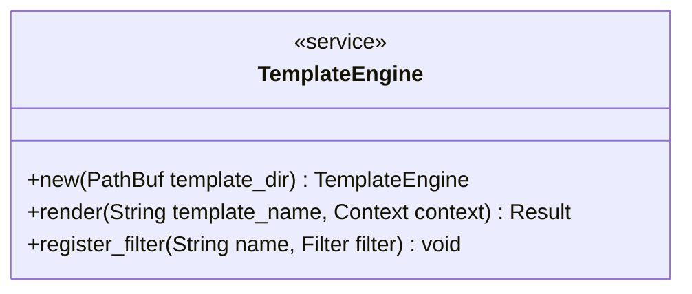

<spec>

# Tera Template Engine Integration

## Overview
<!-- type: overview lang: markdown -->

Provides the template engine functionality using Tera for the Generate code generation system. It acts as the core rendering service, responsible for loading templates from the filesystem, registering custom string manipulation filters (e.g., PascalCase), and generating code output by combining templates with a data context.

## Requirements
<!-- type: doc lang: markdown -->

### R1 - Tera Initialization

```yaml
id: R1
priority: high
status: draft
```

The TemplateEngine must initialize a Tera instance by loading all templates from a specified directory, supporting recursive discovery of .j2 or .tera files.

### R2 - Template Rendering

```yaml
id: R2
priority: high
status: draft
```

The system must provide a render method that accepts a template name and a serializable context object, returning the rendered string or an error.

### R3 - String Manipulation Filters

```yaml
id: R3
priority: medium
status: draft
```

The engine must register custom Tera filters for common case conversions: pascal_case, camel_case, snake_case, and kebab_case.

### R4 - Error Handling

```yaml
id: R4
priority: medium
status: draft
```

The system must return structured errors for: template not found, template syntax error, context type mismatch, and filter execution errors.

## Acceptance Criteria
<!-- type: doc lang: markdown -->

### Scenario: Render Valid Template

- **GIVEN** A template 'test.rs.j2' with content '{{ name | pascal_case }}' and context '{ name: \"my_module\" }'
- **WHEN** render(\"test.rs.j2\", context) is called
- **THEN** Returns 'MyModule'

### Scenario: Render Missing Template

- **GIVEN** A non-existent template name 'ghost.j2'
- **WHEN** render(\"ghost.j2\", context) is called
- **THEN** Returns TemplateError::NotFound

### Scenario: Render Syntax Error

- **GIVEN** A template 'broken.j2' with invalid syntax '{{ unclosed tag'
- **WHEN** The engine initializes or attempts to render
- **THEN** Returns TemplateError::ParseError

### Scenario: Context Data Access

- **GIVEN** A template accessing '{{ config.version }}' and context '{ config: { version: \"1.0\" } }'
- **WHEN** render is called
- **THEN** Returns string containing '1.0'

## Test Plan
<!-- type: doc lang: markdown -->

| Test | Covers |
|------|--------|
| render_valid_template | R1, R2, R3 |
| render_missing_template | R4 |
| render_syntax_error | R4 |
| render_context_data_access | R2 |

## Diagrams
<!-- type: doc lang: markdown -->

### TemplateEngine Class Diagram



### Rendering Flow

```mermaid
flowchart LR
    Start((Start))
    LoadTemplates[Load Templates]
    RegisterFilters[Register Filters]
    RenderCall{Render(template, context)} 
    ProcessTemplate[Tera Processing]
    Output[Generated Code]
    Error[Return Error]
    Start -->|| LoadTemplates
    LoadTemplates -->|Success| RegisterFilters
    LoadTemplates -.->|Error| Error
    RegisterFilters -->|| RenderCall
    RenderCall -->|Valid Template| ProcessTemplate
    RenderCall -.->|Missing Template| Error
    ProcessTemplate -->|Success| Output
    ProcessTemplate -.->|Render Error| Error
```

</spec>
