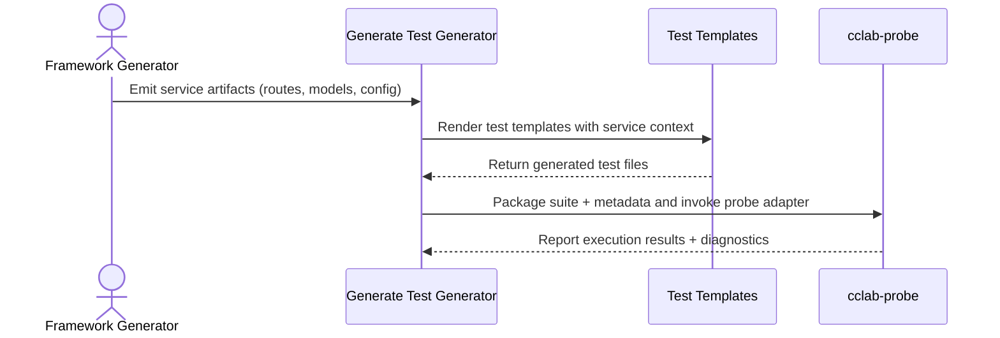

<spec>

# Test Generation Integration with cclab-probe

## Overview
<!-- type: doc lang: markdown -->

Defines how cclab-sdd generates framework-specific test suites and integrates with cclab-probe to execute and validate generated services for FastAPI, Express, and Axum outputs.

## Requirements
<!-- type: doc lang: markdown -->

### R1 - Generator Test Artifacts

```yaml
id: R1
priority: high
status: draft
```

The test-generation pipeline must produce framework-specific test artifacts (fixtures, client helpers, and test cases) for FastAPI, Express, and Axum outputs using the corresponding generator outputs as inputs.

### R2 - Probe Adapter Integration

```yaml
id: R2
priority: high
status: draft
```

The system must provide a Probe adapter that packages generated tests into a cclab-probe compatible suite, including metadata for endpoints, expected responses, and runtime config.

### R3 - Deterministic Outputs

```yaml
id: R3
priority: medium
status: draft
```

Given the same generator inputs and templates, test generation must be deterministic in file names and content ordering to avoid spurious diffs.

### R4 - Failure Reporting

```yaml
id: R4
priority: medium
status: draft
```

When test generation fails, the system must return structured errors that include the generator type, template name, and a human-readable cause.

## Acceptance Criteria
<!-- type: doc lang: markdown -->

### Scenario: Generate FastAPI Test Suite

- **GIVEN** A FastAPI service is generated from an OpenAPI spec and templates
- **WHEN** test generation runs for generator-fastapi
- **THEN** A probe-compatible test suite is produced with endpoint tests and fixture setup.

### Scenario: Generate Express Test Suite

- **GIVEN** An Express service is generated from an OpenAPI spec and templates
- **WHEN** test generation runs for generator-express
- **THEN** A probe-compatible test suite is produced with endpoint tests and fixture setup.

### Scenario: Generate Axum Test Suite

- **GIVEN** An Axum service is generated from an OpenAPI spec and templates
- **WHEN** test generation runs for generator-axum
- **THEN** A probe-compatible test suite is produced with endpoint tests and fixture setup.

### Scenario: Handle Template Failure

- **GIVEN** A test template is missing or fails to render
- **WHEN** test generation runs
- **THEN** The system returns a structured error that includes the generator type and template name.

## Diagrams
<!-- type: doc lang: markdown -->

### Test Generation Integration Sequence



</spec>
